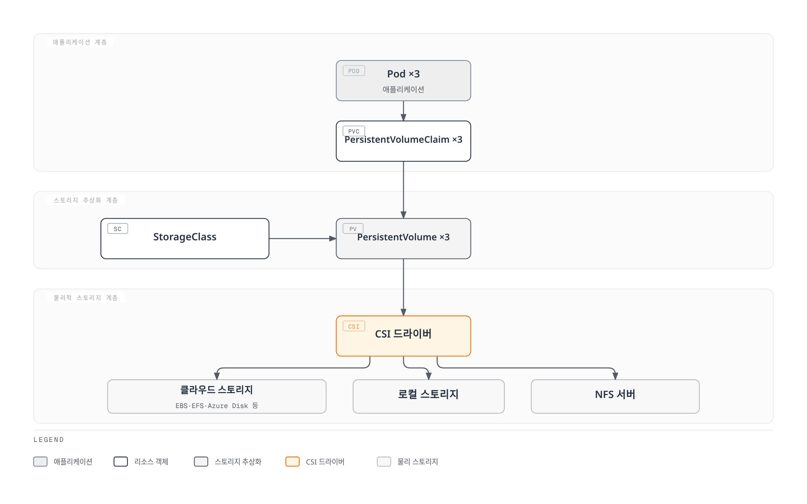
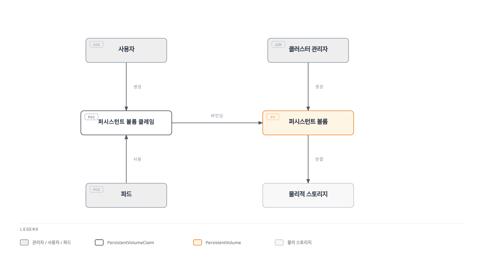
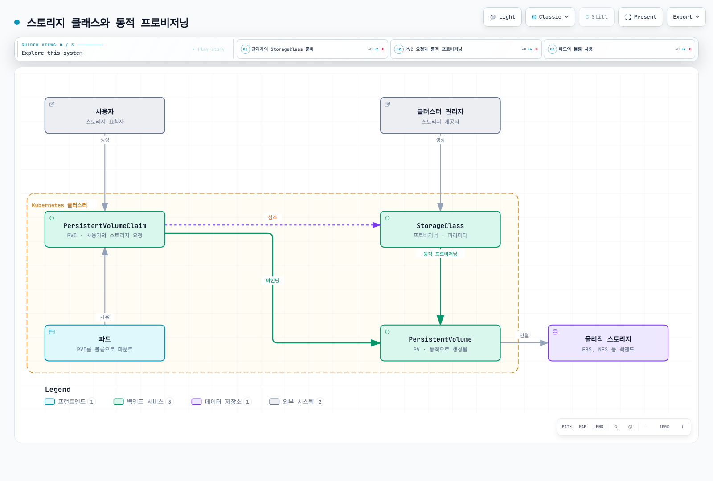
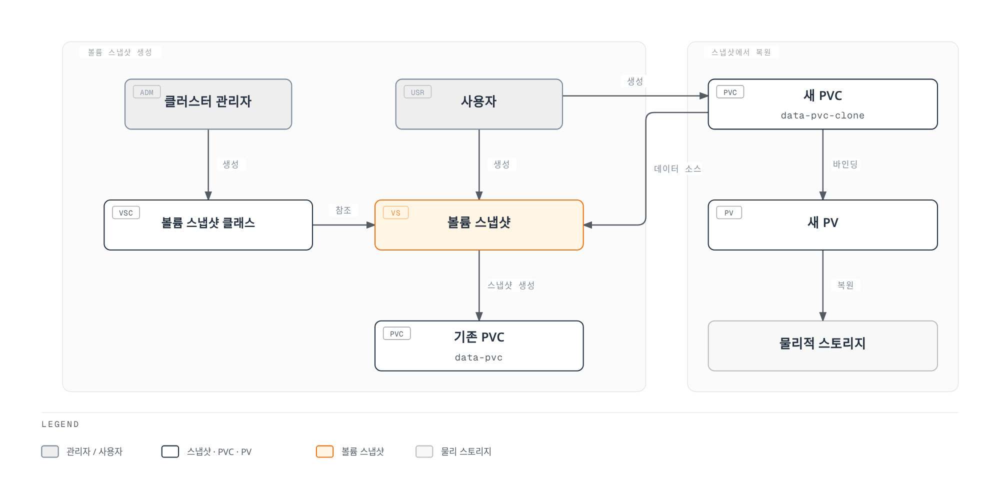
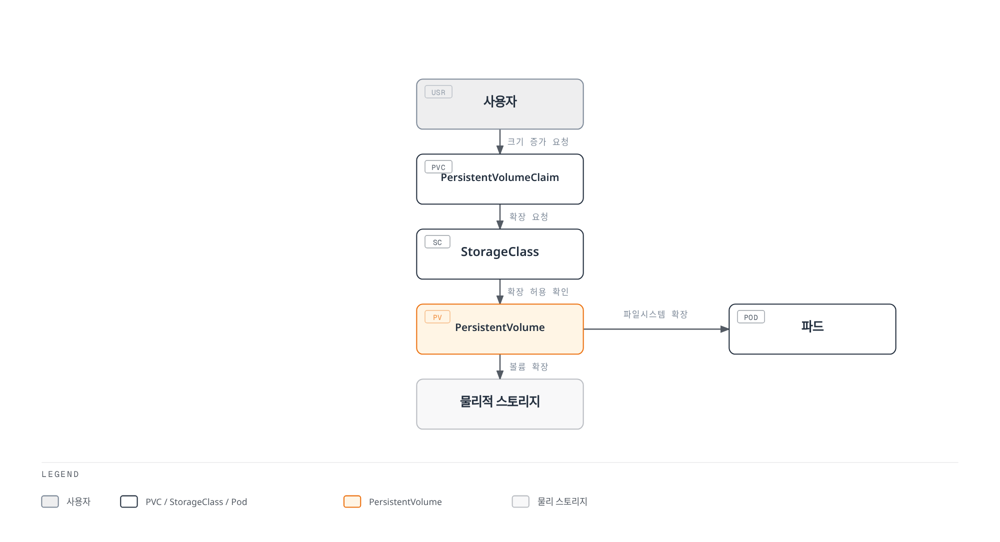
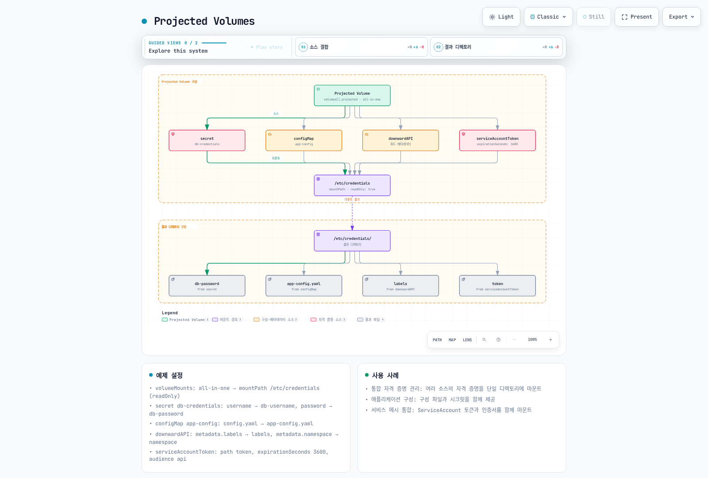
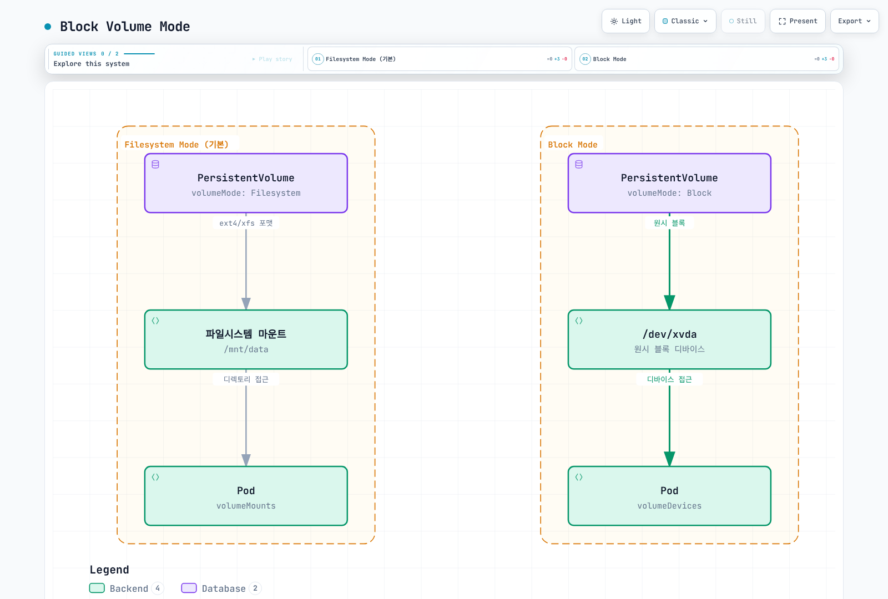
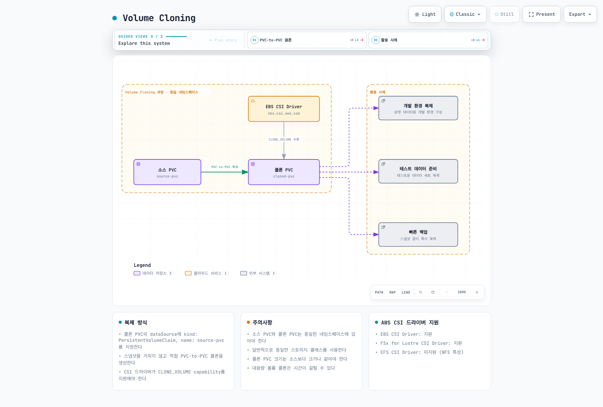
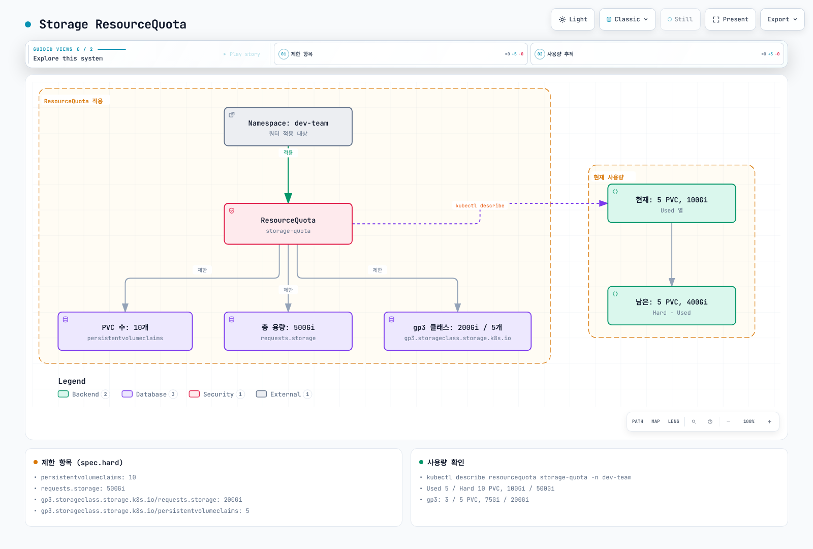
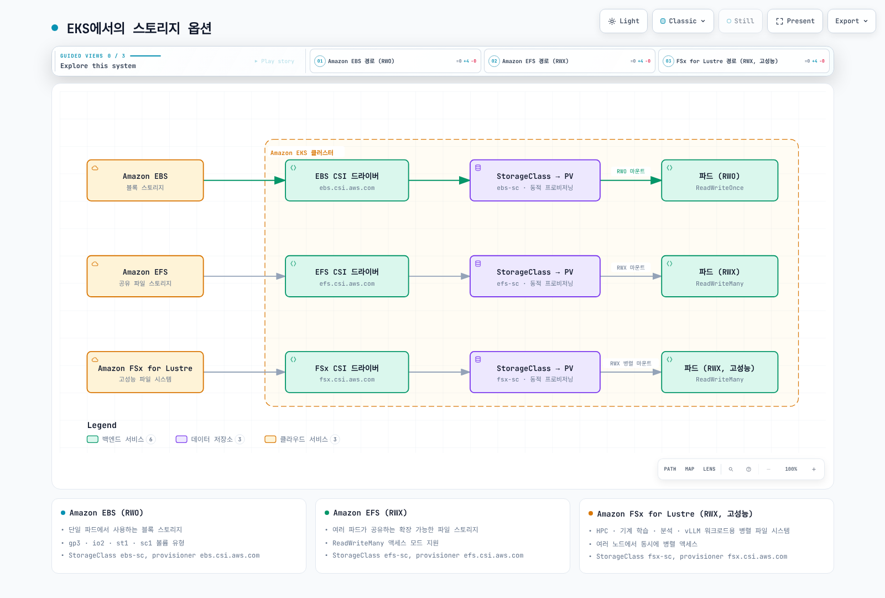

# 스토리지

> **지원 버전**: Kubernetes 1.35, 1.36, 1.37
> **마지막 업데이트**: 2026년 2월 19일

Kubernetes에서 스토리지는 컨테이너화된 애플리케이션의 데이터를 저장하고 관리하는 중요한 부분입니다. 이 장에서는 볼륨, 퍼시스턴트 볼륨, 퍼시스턴트 볼륨 클레임, 스토리지 클래스 등 Kubernetes의 스토리지 개념에 대해 자세히 알아보겠습니다.

## 실습 환경 설정

이 문서의 예제를 따라하기 위해서는 다음과 같은 도구와 환경이 필요합니다:

### 필수 도구
- API 서버와 마이너 버전 차이가 1 이내인 kubectl
- 작동하는 Kubernetes 클러스터 (EKS, minikube, kind 등)
- 스토리지 프로비저너 (EKS의 경우 EBS CSI 드라이버)

첫 예시는 기본 StorageClass가 필요하며 없으면 설치된 클래스의 이름을 `storageClassName`에 지정하세요. 아래 EKS EBS 예시는 IAM 권한을 가진 표준 EBS CSI 드라이버와 EC2 노드 기준이며 Auto Mode는 `ebs.csi.eks.amazonaws.com`을 사용합니다. EBS는 Fargate·Hybrid Nodes에서 마운트할 수 없습니다. 이후 매니페스트는 각각 선행 조건이 필요한 독립 예시입니다.

### 스토리지 예제 설정

```bash
# 네임스페이스 생성
kubectl create namespace storage-demo

# 간단한 PVC 및 Pod 생성
kubectl -n storage-demo apply -f - <<'EOF'
apiVersion: v1
kind: PersistentVolumeClaim
metadata:
  name: data-pvc
spec:
  accessModes:
    - ReadWriteOnce
  resources:
    requests:
      storage: 1Gi
---
apiVersion: v1
kind: Pod
metadata:
  name: data-pod
spec:
  containers:
  - name: data-container
    image: busybox
    command: ["sh", "-c", "while true; do echo $(date) >> /data/output.txt; sleep 5; done"]
    volumeMounts:
    - name: data-volume
      mountPath: /data
  volumes:
  - name: data-volume
    persistentVolumeClaim:
      claimName: data-pvc
EOF

# 스토리지 리소스 확인
kubectl -n storage-demo get pvc,pod
```

## 목차

1. [볼륨(Volume)](#볼륨volume)
2. [퍼시스턴트 볼륨(PersistentVolume)](#퍼시스턴트-볼륨persistentvolume)
3. [퍼시스턴트 볼륨 클레임(PersistentVolumeClaim)](#퍼시스턴트-볼륨-클레임persistentvolumeclaim)
4. [스토리지 클래스(StorageClass)](#스토리지-클래스storageclass)
5. [동적 프로비저닝](#동적-프로비저닝)
6. [볼륨 스냅샷](#볼륨-스냅샷)
7. [볼륨 확장](#볼륨-확장)
8. [Projected Volumes](#projected-volumes)
9. [Generic Ephemeral Volumes](#generic-ephemeral-volumes)
10. [Block Volume Mode](#block-volume-mode)
11. [Volume Cloning](#volume-cloning)
12. [Storage ResourceQuota](#storage-resourcequota)
13. [EKS에서의 스토리지 옵션](#eks에서의-스토리지-옵션)

## 볼륨(Volume)

> **핵심 개념**: Kubernetes 볼륨은 포드 내의 컨테이너가 데이터를 저장하고 공유할 수 있는 디렉토리로, 컨테이너의 재시작과 관계없이 데이터를 유지할 수 있습니다.

Kubernetes 볼륨은 포드 내의 컨테이너가 데이터를 저장하고 공유할 수 있는 디렉토리입니다. 파드의 마운트 수명과 실제 데이터의 보존 기간은 다릅니다. emptyDir 데이터는 파드와 함께 제거되지만 영구 스토리지는 파드보다 오래 유지될 수 있습니다.

### Kubernetes 스토리지 아키텍처



[🔍 인터랙티브 다이어그램 보기](https://www.atomai.click/kubernetes-docs/archmaps/ko-core-04-storage-0.html)

### 볼륨의 필요성

1. **컨테이너 재시작 시 데이터 유지**: 컨테이너가 재시작되면 파일 시스템이 초기화되지만, 볼륨을 사용하면 데이터를 유지할 수 있습니다.
2. **컨테이너 간 데이터 공유**: 같은 포드 내의 여러 컨테이너가 볼륨을 통해 데이터를 공유할 수 있습니다.

### 주요 볼륨 유형 비교

| 볼륨 유형 | 수명 주기 | 데이터 지속성 | 사용 사례 | 특징 |
|----------|----------|-------------|----------|------|
| **emptyDir** | 포드 | 임시 | 임시 데이터, 캐시, 체크포인트 | 포드가 삭제되면 데이터도 삭제됨 |
| **hostPath** | 노드 | 노드 수준 | 노드 파일 시스템 접근, 모니터링 | 보안 위험이 있으므로 주의 필요 |
| **configMap** | 구성 | 구성 데이터 | 애플리케이션 구성 | 구성 데이터를 볼륨으로 마운트 |
| **secret** | 구성 | 민감 데이터 | 인증서, 비밀번호 | 민감 데이터를 볼륨으로 마운트 |
| **persistentVolumeClaim** | 클러스터 | 영구적 | 데이터베이스, 파일 저장소 | 포드 재시작 및 재스케줄링 후에도 데이터 유지 |

### emptyDir

`emptyDir` 볼륨은 포드가 노드에 할당될 때 생성되고, 포드가 해당 노드에서 실행되는 동안 유지됩니다. 포드가 노드에서 제거되면 `emptyDir`의 데이터는 영구적으로 삭제됩니다.

```yaml
apiVersion: v1
kind: Pod
metadata:
  name: test-pd
spec:
  containers:
  - image: nginx
    name: test-container
    volumeMounts:
    - mountPath: /cache
      name: cache-volume
  volumes:
  - name: cache-volume
    emptyDir: {}
```

### hostPath

`hostPath` 볼륨은 노드의 파일 시스템에서 파일이나 디렉토리를 포드에 마운트합니다. 이는 노드의 파일 시스템에 접근해야 하는 포드에 유용하지만, 보안 위험이 있으므로 주의해서 사용해야 합니다.

```yaml
apiVersion: v1
kind: Pod
metadata:
  name: test-hostpath
spec:
  containers:
  - image: nginx
    name: test-container
    volumeMounts:
    - mountPath: /test-pd
      name: test-volume
  volumes:
  - name: test-volume
    hostPath:
      path: /data
      type: Directory  # DirectoryOrCreate, Directory, FileOrCreate, File, Socket, CharDevice, BlockDevice
```

```yaml
apiVersion: v1
kind: Pod
metadata:
  name: test-pd
spec:
  containers:
  - image: nginx
    name: test-container
    volumeMounts:
    - mountPath: /test-pd
      name: test-volume
  volumes:
  - name: test-volume
    hostPath:
      path: /data
      type: Directory
```

#### configMap

`configMap` 볼륨은 ConfigMap의 데이터를 포드에 마운트합니다. ConfigMap은 키-값 쌍의 형태로 구성 데이터를 저장하는 데 사용됩니다.

```yaml
apiVersion: v1
kind: Pod
metadata:
  name: configmap-pod
spec:
  containers:
  - name: test
    image: busybox
    volumeMounts:
    - name: config-vol
      mountPath: /etc/config
  volumes:
  - name: config-vol
    configMap:
      name: log-config
      items:
      - key: log_level
        path: log_level
```

#### secret

`secret` 볼륨은 Secret의 데이터를 포드에 마운트합니다. Secret은 암호, 토큰, 키 등의 민감한 정보를 저장하는 데 사용됩니다.

```yaml
apiVersion: v1
kind: Pod
metadata:
  name: secret-pod
spec:
  containers:
  - name: test
    image: busybox
    volumeMounts:
    - name: secret-vol
      mountPath: /etc/secret
      readOnly: true
  volumes:
  - name: secret-vol
    secret:
      secretName: mysecret
      items:
      - key: username
        path: my-username
```

#### nfs

`nfs` 볼륨은 기존 NFS(Network File System) 공유를 포드에 마운트합니다.

```yaml
apiVersion: v1
kind: Pod
metadata:
  name: nfs-pod
spec:
  containers:
  - name: test
    image: busybox
    volumeMounts:
    - name: nfs-vol
      mountPath: /mnt/nfs
  volumes:
  - name: nfs-vol
    nfs:
      server: nfs-server.example.com
      path: /share
```

#### persistentVolumeClaim

`persistentVolumeClaim` 볼륨은 PersistentVolumeClaim을 포드에 마운트합니다. 이는 가장 일반적으로 사용되는 볼륨 유형 중 하나입니다.

```yaml
apiVersion: v1
kind: Pod
metadata:
  name: pvc-pod
spec:
  containers:
  - name: test
    image: busybox
    volumeMounts:
    - name: pvc-vol
      mountPath: /mnt/pvc
  volumes:
  - name: pvc-vol
    persistentVolumeClaim:
      claimName: my-pvc
```

#### CSI(Container Storage Interface)

CSI 볼륨은 Kubernetes와 외부 스토리지 시스템 간의 표준 인터페이스를 제공합니다. CSI를 사용하면 스토리지 제공업체가 Kubernetes 코드를 수정하지 않고도 자체 스토리지 드라이버를 개발할 수 있습니다.

```yaml
apiVersion: v1
kind: Pod
metadata:
  name: csi-pod
spec:
  containers:
  - name: test
    image: busybox
    volumeMounts:
    - name: csi-vol
      mountPath: /mnt/csi
  volumes:
  - name: csi-vol
    csi:
      driver: csi-driver.example.com
      volumeAttributes:
        foo: bar
      nodePublishSecretRef:
        name: csi-secret
```

## 퍼시스턴트 볼륨(PersistentVolume)

퍼시스턴트 볼륨(PV)은 관리자가 프로비저닝하거나 스토리지 클래스를 사용하여 동적으로 프로비저닝된 클러스터의 스토리지입니다. PV는 포드와 독립적인 수명 주기를 가지며, 포드가 삭제되어도 PV는 유지됩니다.



[🔍 인터랙티브 다이어그램 보기](https://www.atomai.click/kubernetes-docs/archmaps/ko-core-04-storage-1.html)

### PV 생성

```yaml
apiVersion: v1
kind: PersistentVolume
metadata:
  name: pv0001
  labels:
    release: stable
    environment: dev
spec:
  capacity:
    storage: 10Gi
  volumeMode: Filesystem
  accessModes:
    - ReadWriteOnce
  persistentVolumeReclaimPolicy: Retain
  storageClassName: slow
  mountOptions:
    - hard
    - nfsvers=4.1
  nfs:
    path: /tmp
    server: 172.17.0.2
```

### PV 액세스 모드

PV는 다음과 같은 액세스 모드를 지원합니다:

- **ReadWriteOnce(RWO)**: 볼륨은 단일 노드에 의해 읽기-쓰기로 마운트될 수 있습니다.
- **ReadOnlyMany(ROX)**: 볼륨은 여러 노드에 의해 읽기 전용으로 마운트될 수 있습니다.
- **ReadWriteMany(RWX)**: 볼륨은 여러 노드에 의해 읽기-쓰기로 마운트될 수 있습니다.
- **ReadWriteOncePod(RWOP)**: 볼륨은 단일 포드에 의해 읽기-쓰기로 마운트될 수 있습니다(CSI 전용, v1.29부터 Stable).

RWO는 읽기·쓰기 마운트를 한 **노드**로 제한하며 한 파드로 제한하지 않습니다. 같은 노드의 여러 파드가 공유할 수 있습니다. RWOP는 이를 지원하는 CSI 드라이버에서 한 파드만 사용하도록 제한합니다. 액세스 모드는 파일시스템 권한을 대체하지 않습니다.

### PV 회수 정책

PV는 다음과 같은 회수 정책을 가질 수 있습니다:

- **Retain**: PVC가 삭제되어도 PV와 데이터는 유지됩니다. 관리자가 수동으로 정리해야 합니다.
- **Delete**: PVC가 삭제되면 PV와 외부 스토리지 자산이 자동으로 삭제됩니다.
- **Recycle**: PVC가 삭제되면 PV의 데이터가 삭제되고 PV는 다시 사용 가능한 상태가 됩니다(사용 중단됨).

### PV 상태

PV는 다음과 같은 상태를 가질 수 있습니다:

- **Available**: 아직 클레임에 바인딩되지 않은 사용 가능한 리소스입니다.
- **Bound**: 클레임에 바인딩되었습니다.
- **Released**: 클레임이 삭제되었지만, 리소스는 아직 클러스터에 의해 회수되지 않았습니다.
- **Failed**: 자동 회수가 실패했습니다.

## 퍼시스턴트 볼륨 클레임(PersistentVolumeClaim)

퍼시스턴트 볼륨 클레임(PVC)은 사용자의 스토리지 요청입니다. PVC는 PV와 유사하지만, PVC는 사용자가 스토리지를 요청하는 방법이고, PV는 관리자가 스토리지를 제공하는 방법입니다.

### PVC 생성

```yaml
apiVersion: v1
kind: PersistentVolumeClaim
metadata:
  name: myclaim
spec:
  accessModes:
    - ReadWriteOnce
  volumeMode: Filesystem
  resources:
    requests:
      storage: 8Gi
  storageClassName: slow
  selector:
    matchLabels:
      release: "stable"
    matchExpressions:
      - {key: environment, operator: In, values: [dev]}
```

### PVC와 PV 바인딩

PVC가 생성되면 Kubernetes는 PVC의 요구 사항(스토리지 크기, 액세스 모드, 스토리지 클래스, 셀렉터 등)을 충족하는 PV를 찾아 바인딩합니다. 일치하는 PV가 없으면 적절한 StorageClass가 동적 프로비저닝할 수 있습니다. 다만 위처럼 selector가 비어 있지 않은 PVC는 동적 프로비저닝할 수 없으므로 일치하는 정적 PV가 없으면 Pending입니다. WaitForFirstConsumer도 스케줄링까지 바인딩을 의도적으로 지연합니다.

### PVC 사용

PVC는 포드에서 볼륨으로 사용할 수 있습니다:

```yaml
apiVersion: v1
kind: Pod
metadata:
  name: mypod
spec:
  containers:
    - name: myfrontend
      image: nginx
      volumeMounts:
      - mountPath: "/var/www/html"
        name: mypd
  volumes:
    - name: mypd
      persistentVolumeClaim:
        claimName: myclaim
```

## 스토리지 클래스(StorageClass)

스토리지 클래스는 관리자가 제공하는 스토리지의 "클래스"를 설명합니다. 스토리지 클래스는 PV를 동적으로 프로비저닝하는 데 사용됩니다.



[🔍 인터랙티브 다이어그램 보기](https://www.atomai.click/kubernetes-docs/archmaps/ko-core-04-storage-2.html)

### 스토리지 클래스 생성

```yaml
apiVersion: storage.k8s.io/v1
kind: StorageClass
metadata:
  name: standard
provisioner: ebs.csi.aws.com
parameters:
  type: gp3
  csi.storage.k8s.io/fstype: ext4
reclaimPolicy: Delete
allowVolumeExpansion: true
volumeBindingMode: WaitForFirstConsumer
```

이 예제는 AWS EBS gp3 볼륨을 프로비저닝하는 스토리지 클래스를 생성합니다.

### 프로비저너

스토리지 클래스는 볼륨을 프로비저닝하는 데 사용되는 프로비저너를 지정합니다. 현재 CSI 프로비저너 예시는 다음과 같습니다:

- `ebs.csi.aws.com`: AWS EBS
- `efs.csi.aws.com`: AWS EFS
- `fsx.csi.aws.com`: FSx for Lustre
- `pd.csi.storage.gke.io`: Google Persistent Disk
- `disk.csi.azure.com` / `file.csi.azure.com`: Azure Disk/File
- `nfs.csi.k8s.io`: NFS CSI 드라이버 (기존 NFS 서버 필요)

레거시 인트리 클라우드 플러그인은 제거되거나 마이그레이션되었습니다. 해당 CSI 드라이버를 설치해야 하며 `kubernetes.io/nfs`라는 내장 동적 프로비저너는 없습니다.

### 볼륨 바인딩 모드

스토리지 클래스는 다음과 같은 볼륨 바인딩 모드를 지원합니다:

- **Immediate**: 기본값으로, PVC가 생성되면 바로 볼륨이 프로비저닝됩니다.
- **WaitForFirstConsumer**: 포드가 PVC를 사용하려고 할 때까지 볼륨 프로비저닝을 지연합니다. 이는 볼륨이 포드와 같은 영역에 프로비저닝되도록 하는 데 유용합니다.

### 기본 스토리지 클래스

클러스터에는 기본 스토리지 클래스를 설정할 수 있습니다. PVC에서 스토리지 클래스를 지정하지 않으면 기본 스토리지 클래스가 사용됩니다.

```yaml
apiVersion: storage.k8s.io/v1
kind: StorageClass
metadata:
  name: standard
  annotations:
    storageclass.kubernetes.io/is-default-class: "true"
provisioner: ebs.csi.aws.com
parameters:
  type: gp3
  encrypted: "true"
volumeBindingMode: WaitForFirstConsumer
```

## 동적 프로비저닝

동적 프로비저닝은 PVC가 생성될 때 자동으로 PV를 생성하는 기능입니다. 이를 통해 관리자가 미리 PV를 생성할 필요 없이 사용자가 필요할 때 스토리지를 요청할 수 있습니다.

### 동적 프로비저닝 예제

1. 스토리지 클래스 생성:

```yaml
apiVersion: storage.k8s.io/v1
kind: StorageClass
metadata:
  name: fast
provisioner: ebs.csi.aws.com
parameters:
  type: gp3
  iops: "3000"
  encrypted: "true"
allowVolumeExpansion: true
volumeBindingMode: WaitForFirstConsumer
```

2. PVC 생성:

```yaml
apiVersion: v1
kind: PersistentVolumeClaim
metadata:
  name: myclaim
spec:
  accessModes:
    - ReadWriteOnce
  resources:
    requests:
      storage: 100Gi
  storageClassName: fast
```

3. 포드에서 PVC 사용:

```yaml
apiVersion: v1
kind: Pod
metadata:
  name: mypod
spec:
  containers:
    - name: myfrontend
      image: nginx
      volumeMounts:
      - mountPath: "/var/www/html"
        name: mypd
  volumes:
    - name: mypd
      persistentVolumeClaim:
        claimName: myclaim
```

## 볼륨 스냅샷

Kubernetes는 볼륨 스냅샷을 지원하여 PV의 특정 시점 복사본을 생성할 수 있습니다. 이는 백업 및 복원 시나리오에 유용합니다.



[🔍 인터랙티브 다이어그램 보기](https://www.atomai.click/kubernetes-docs/archmaps/ko-core-04-storage-3.html)

스냅샷 CRD, 스냅샷 컨트롤러, 스냅샷을 지원하는 CSI 드라이버가 필요합니다. 아래는 EBS 예시이며 소스 PVC와 복원 StorageClass는 해당 드라이버를 사용해야 합니다. `readyToUse: true`를 기다리고 스냅샷 복원 크기 이상의 용량을 요청하세요. 스토리지 스냅샷만으로 DB 일관성을 보장하지 않으므로 쓰기를 중지하거나 DB 인식 백업을 사용하세요.

### 볼륨 스냅샷 클래스

```yaml
apiVersion: snapshot.storage.k8s.io/v1
kind: VolumeSnapshotClass
metadata:
  name: ebs-snapclass
driver: ebs.csi.aws.com
deletionPolicy: Delete
```

### 볼륨 스냅샷 생성

```yaml
apiVersion: snapshot.storage.k8s.io/v1
kind: VolumeSnapshot
metadata:
  name: new-snapshot
spec:
  volumeSnapshotClassName: ebs-snapclass
  source:
    persistentVolumeClaimName: myclaim
```

### 스냅샷에서 PVC 생성

```yaml
apiVersion: v1
kind: PersistentVolumeClaim
metadata:
  name: restore-pvc
spec:
  storageClassName: standard
  dataSource:
    name: new-snapshot
    kind: VolumeSnapshot
    apiGroup: snapshot.storage.k8s.io
  accessModes:
    - ReadWriteOnce
  resources:
    requests:
      storage: 100Gi
```

## 볼륨 확장

Kubernetes는 PVC의 크기를 확장하는 기능을 지원합니다. 이를 위해서는 스토리지 클래스에서 `allowVolumeExpansion: true`를 설정해야 합니다.



[🔍 인터랙티브 다이어그램 보기](https://www.atomai.click/kubernetes-docs/archmaps/ko-core-04-storage-4.html)

### PVC 확장

확장을 지원하는 EBS StorageClass의 기존 100Gi PVC라면 요청 용량만 변경합니다:

```bash
kubectl patch pvc myclaim --type merge -p '{"spec":{"resources":{"requests":{"storage":"120Gi"}}}}'
```

PVC의 네임스페이스와 기존 StorageClass를 사용하세요. 드라이버·파일시스템이 확장을 지원해야 하며 축소는 지원하지 않습니다. 바인딩된 PVC의 클래스를 바꾸거나 PV 용량을 직접 수정해 확장을 흉내 내지 마세요.

## Projected Volumes

Projected Volumes는 여러 볼륨 소스를 하나의 디렉토리에 마운트할 수 있는 기능입니다. secrets, configMaps, downwardAPI, serviceAccountToken을 단일 볼륨으로 결합할 수 있습니다.



[🔍 인터랙티브 다이어그램 보기](https://www.atomai.click/kubernetes-docs/archmaps/ko-core-04-storage-5.html)

### Projected Volume 예제

```yaml
apiVersion: v1
kind: Pod
metadata:
  name: projected-volume-pod
spec:
  containers:
  - name: app
    image: busybox
    command: ["sleep", "3600"]
    volumeMounts:
    - name: all-in-one
      mountPath: /etc/credentials
      readOnly: true
  volumes:
  - name: all-in-one
    projected:
      sources:
      # Secret에서 데이터베이스 자격 증명
      - secret:
          name: db-credentials
          items:
          - key: username
            path: db-username
          - key: password
            path: db-password
      # ConfigMap에서 애플리케이션 구성
      - configMap:
          name: app-config
          items:
          - key: config.yaml
            path: app-config.yaml
      # Downward API에서 포드 메타데이터
      - downwardAPI:
          items:
          - path: labels
            fieldRef:
              fieldPath: metadata.labels
          - path: namespace
            fieldRef:
              fieldPath: metadata.namespace
      # ServiceAccountToken
      - serviceAccountToken:
          path: token
          expirationSeconds: 3600
          audience: api
```

### 사용 사례

1. **통합 자격 증명 관리**: 여러 소스의 자격 증명을 단일 디렉토리에 마운트
2. **애플리케이션 구성**: 구성 파일과 시크릿을 함께 제공
3. **서비스 메시 통합**: ServiceAccount 토큰과 인증서를 함께 마운트

프로젝션 토큰은 갱신되므로 앱이 파일을 다시 읽어야 합니다. 명시한 `audience`는 검증 서비스와 일치해야 하며 Kubernetes API에 자동으로 유효한 값은 아닙니다.

## Generic Ephemeral Volumes

Generic Ephemeral Volumes는 PVC 기반의 임시 볼륨을 제공합니다. emptyDir과 달리 동적 프로비저닝과 스토리지 클래스의 모든 기능을 사용할 수 있습니다.

### emptyDir과의 비교

| 특성 | emptyDir | Generic Ephemeral Volume |
|------|----------|-------------------------|
| **프로비저닝** | 노드 로컬 디스크 | 동적 프로비저닝 (CSI) |
| **스토리지 클래스** | 지원 안 함 | 지원 |
| **용량 지정** | sizeLimit (소프트 제한) | 정확한 용량 요청 |
| **스냅샷** | 지원 안 함 | 지원 |
| **암호화** | 노드에 따라 다름 | 스토리지 클래스로 제어 |
| **IOPS/처리량** | 노드에 따라 다름 | 스토리지 클래스로 제어 |
| **수명 주기** | 포드와 함께 | 포드와 함께 |

### Generic Ephemeral Volume 예제

```yaml
apiVersion: v1
kind: Pod
metadata:
  name: ephemeral-volume-pod
spec:
  containers:
  - name: app
    image: nginx
    volumeMounts:
    - name: scratch
      mountPath: /scratch
  volumes:
  - name: scratch
    ephemeral:
      volumeClaimTemplate:
        metadata:
          labels:
            type: ephemeral
        spec:
          accessModes: ["ReadWriteOnce"]
          storageClassName: gp3-fast
          resources:
            requests:
              storage: 10Gi
```

### 사용 사례

1. **고성능 임시 스토리지**: CSI 드라이버의 고성능 스토리지를 임시로 사용
2. **대용량 캐시**: emptyDir의 노드 디스크 제한 없이 대용량 캐시 사용
3. **ML/AI 워크로드**: 모델 학습 중 체크포인트를 고성능 스토리지에 저장
4. **암호화된 임시 스토리지**: CSI 드라이버의 암호화 기능 활용

```yaml
# ML 학습용 고성능 임시 스토리지
apiVersion: v1
kind: Pod
metadata:
  name: ml-training
spec:
  containers:
  - name: trainer
    image: pytorch/pytorch:latest
    volumeMounts:
    - name: checkpoint
      mountPath: /checkpoints
  volumes:
  - name: checkpoint
    ephemeral:
      volumeClaimTemplate:
        spec:
          accessModes: ["ReadWriteOnce"]
          storageClassName: io2-high-iops
          resources:
            requests:
              storage: 100Gi
```

Generic ephemeral PVC는 파드가 소유하며 파드 삭제 시 가비지 수집됩니다. 실제 데이터 삭제는 PV 회수 정책을 따르므로 `Retain`이면 스토리지가 남고 수동 정리가 필요합니다. 파드 손실 이후에도 필요한 체크포인트는 별도 영구 저장소에 보관하세요.

## Block Volume Mode

Block Volume Mode는 파일시스템 대신 원시 블록 디바이스로 볼륨을 마운트할 수 있는 기능입니다. 이는 데이터베이스와 같이 파일시스템 오버헤드 없이 직접 블록 접근이 필요한 애플리케이션에 유용합니다.



[🔍 인터랙티브 다이어그램 보기](https://www.atomai.click/kubernetes-docs/archmaps/ko-core-04-storage-6.html)

### Block Volume 설정

```yaml
# PersistentVolume
apiVersion: v1
kind: PersistentVolume
metadata:
  name: block-pv
spec:
  capacity:
    storage: 100Gi
  volumeMode: Block  # Block 모드 지정
  accessModes:
  - ReadWriteOnce
  persistentVolumeReclaimPolicy: Retain
  storageClassName: block-storage
  csi:
    driver: ebs.csi.aws.com
    volumeHandle: vol-0123456789abcdef0
  nodeAffinity:
    required:
      nodeSelectorTerms:
      - matchExpressions:
        - key: topology.kubernetes.io/zone
          operator: In
          values: [us-west-2a]
---
# PersistentVolumeClaim
apiVersion: v1
kind: PersistentVolumeClaim
metadata:
  name: block-pvc
spec:
  volumeMode: Block  # Block 모드 지정
  accessModes:
  - ReadWriteOnce
  storageClassName: block-storage
  resources:
    requests:
      storage: 100Gi
```

### Block Volume 사용

```yaml
apiVersion: v1
kind: Pod
metadata:
  name: block-volume-pod
spec:
  containers:
  - name: database
    image: custom-database:latest
    volumeDevices:  # volumeMounts 대신 volumeDevices 사용
    - name: data
      devicePath: /dev/xvda  # 디바이스 경로
  volumes:
  - name: data
    persistentVolumeClaim:
      claimName: block-pvc
```

### 사용 사례

1. **특수 스토리지 엔진**: 원시 블록 장치를 명시적으로 지원하는 소프트웨어만 사용하며 일반 MySQL/PostgreSQL 데이터 디렉토리는 파일시스템 필요
2. **NoSQL 데이터베이스**: Cassandra, ScyllaDB 등의 성능 최적화
3. **가상화**: VM 디스크 이미지 저장
4. **커스텀 파일시스템**: 애플리케이션이 자체 파일시스템 사용

정적 EBS 볼륨 ID와 nodeAffinity의 영역은 실제 볼륨과 해당 가용 영역으로 바꾸세요. `custom-database` 이미지는 원시 블록 장치를 지원하는 소프트웨어의 자리 표시자입니다.

## Volume Cloning

Volume Cloning은 기존 PVC의 데이터를 새 PVC로 복제하는 기능입니다. 스냅샷을 거치지 않고 직접 PVC-to-PVC 클론을 생성할 수 있습니다.



[🔍 인터랙티브 다이어그램 보기](https://www.atomai.click/kubernetes-docs/archmaps/ko-core-04-storage-7.html)

#정적 EBS 볼륨 ID와 nodeAffinity의 영역은 실제 볼륨과 해당 가용 영역으로 바꾸세요. `custom-database` 이미지는 원시 블록 장치를 지원하는 소프트웨어의 자리 표시자입니다.

## Volume Cloning 예제

```yaml
# 소스 PVC
apiVersion: v1
kind: PersistentVolumeClaim
metadata:
  name: source-pvc
spec:
  accessModes:
  - ReadWriteOnce
  storageClassName: gp3
  resources:
    requests:
      storage: 100Gi
---
# 클론 PVC
apiVersion: v1
kind: PersistentVolumeClaim
metadata:
  name: cloned-pvc
spec:
  accessModes:
  - ReadWriteOnce
  storageClassName: gp3  # 동일한 스토리지 클래스
  resources:
    requests:
      storage: 100Gi  # 동일하거나 더 큰 크기
  dataSource:
    kind: PersistentVolumeClaim
    name: source-pvc  # 소스 PVC 참조
```

### CSI 드라이버 지원과 제약

EBS CSI 드라이버는 v1.51.0부터 PVC 복제를 지원합니다([버전 고정 예제](https://github.com/kubernetes-sigs/aws-ebs-csi-driver/blob/v1.66.0/examples/kubernetes/clone/README.md)). 설치 버전과 IAM 권한을 확인하세요. `kubectl get csidriver`는 CSI RPC의 `CLONE_VOLUME` capability를 표시하지 않습니다. 해당 드라이버의 공식 기능 문서와 CSI `ControllerGetCapabilities`가 근거입니다.

FSx for Lustre CSI 드라이버는 현재 `CLONE_VOLUME`을 제공하지 않으며 EFS도 PVC 복제 지원을 가정하면 안 됩니다. 소스·대상은 같은 네임스페이스와 volumeMode를 사용해야 하고 대상 용량은 소스 이상이어야 합니다. StorageClass는 드라이버 호환 범위에서 달라도 됩니다. 소스는 바인딩되고 사용 중이 아닌 상태로 준비하고 DB 일관성을 확보하세요.

## Storage ResourceQuota

Storage ResourceQuota는 네임스페이스 단위로 스토리지 리소스 사용을 제한합니다. PVC 수와 총 스토리지 용량을 제어할 수 있습니다.



[🔍 인터랙티브 다이어그램 보기](https://www.atomai.click/kubernetes-docs/archmaps/ko-core-04-storage-8.html)

### Storage ResourceQuota 예제

```yaml
apiVersion: v1
kind: ResourceQuota
metadata:
  name: storage-quota
  namespace: dev-team
spec:
  hard:
    # 총 PVC 수 제한
    persistentvolumeclaims: "10"

    # 총 스토리지 요청량 제한
    requests.storage: "500Gi"

    # 특정 스토리지 클래스별 제한
    gp3.storageclass.storage.k8s.io/requests.storage: "200Gi"
    gp3.storageclass.storage.k8s.io/persistentvolumeclaims: "5"

    io2.storageclass.storage.k8s.io/requests.storage: "100Gi"
    io2.storageclass.storage.k8s.io/persistentvolumeclaims: "3"
```

### 스토리지 클래스별 쿼터

```yaml
# 여러 팀을 위한 스토리지 할당
---
# 개발 팀
apiVersion: v1
kind: ResourceQuota
metadata:
  name: dev-storage-quota
  namespace: development
spec:
  hard:
    requests.storage: "200Gi"
    persistentvolumeclaims: "20"
    gp3.storageclass.storage.k8s.io/requests.storage: "150Gi"
    io2.storageclass.storage.k8s.io/requests.storage: "50Gi"
---
# 프로덕션 팀
apiVersion: v1
kind: ResourceQuota
metadata:
  name: prod-storage-quota
  namespace: production
spec:
  hard:
    requests.storage: "2Ti"
    persistentvolumeclaims: "50"
    gp3.storageclass.storage.k8s.io/requests.storage: "1Ti"
    io2.storageclass.storage.k8s.io/requests.storage: "500Gi"
    fsx-lustre.storageclass.storage.k8s.io/requests.storage: "500Gi"
```

### 쿼터 사용량 확인

```bash
# ResourceQuota 상태 확인
kubectl describe resourcequota storage-quota -n dev-team

# 출력 예시:
# Name:                                                       storage-quota
# Namespace:                                                  dev-team
# Resource                                                    Used   Hard
# --------                                                    ----   ----
# gp3.storageclass.storage.k8s.io/persistentvolumeclaims      3      5
# gp3.storageclass.storage.k8s.io/requests.storage            75Gi   200Gi
# persistentvolumeclaims                                      5      10
# requests.storage                                            100Gi  500Gi
```

### LimitRange와 함께 사용

```yaml
# PVC 최소/최대 용량 제한; 요청 기본값을 주입하지 않음
apiVersion: v1
kind: LimitRange
metadata:
  name: storage-limits
  namespace: dev-team
spec:
  limits:
  - type: PersistentVolumeClaim
    max:
      storage: 100Gi
    min:
      storage: 1Gi
```

## EKS에서의 스토리지 옵션

Amazon EKS에서는 다양한 스토리지 옵션을 사용할 수 있습니다. 각 옵션은 서로 다른 사용 사례와 성능 특성을 가지고 있으므로, 애플리케이션의 요구 사항에 맞는 적절한 스토리지를 선택하는 것이 중요합니다.



[🔍 인터랙티브 다이어그램 보기](https://www.atomai.click/kubernetes-docs/archmaps/ko-core-04-storage-9.html)

### Amazon EBS

Amazon EBS(Elastic Block Store)는 EC2 인스턴스에 연결할 수 있는 블록 스토리지 볼륨을 제공합니다. EKS에서는 EBS CSI 드라이버를 사용하여 EBS 볼륨을 Kubernetes 포드에 마운트할 수 있습니다.

#### EBS CSI 드라이버 설치

[EKS 드라이버 설치 문서](https://docs.aws.amazon.com/eks/latest/userguide/ebs-csi.html)에 따라 호환되는 애드온·드라이버 버전과 IAM 역할, 노드 선행 조건을 준비한 후 PVC를 생성하세요. StorageClass만으로 드라이버가 설치되지는 않습니다.

#### EBS 스토리지 클래스

```yaml
apiVersion: storage.k8s.io/v1
kind: StorageClass
metadata:
  name: ebs-sc
provisioner: ebs.csi.aws.com
parameters:
  type: gp3
  csi.storage.k8s.io/fstype: ext4
  encrypted: "true"
volumeBindingMode: WaitForFirstConsumer
```

#### EBS 볼륨 유형

Amazon EBS는 다양한 볼륨 유형을 제공합니다:

1. **gp3**: 범용 SSD 볼륨으로, 대부분의 워크로드에 적합합니다. 기본 3,000 IOPS와 125 MiB/s를 제공하며 현재 리전 볼륨 한도는 용량·IOPS 비율과 인스턴스 한도에 따라 최대 80,000 IOPS, 2,000 MiB/s입니다. Outposts 한도는 더 낮습니다([AWS 사양](https://docs.aws.amazon.com/ebs/latest/userguide/general-purpose.html)).

2. **io2**: 고성능 SSD 볼륨으로, 높은 IOPS가 필요한 워크로드에 적합합니다. 현재 io2 Block Express는 적합한 Nitro 인스턴스에서 볼륨·인스턴스 한도에 따라 최대 1,000 IOPS/GiB와 256,000 IOPS를 지원합니다([AWS 사양](https://docs.aws.amazon.com/ebs/latest/userguide/provisioned-iops.html)).

3. **st1**: 처리량 최적화 HDD 볼륨으로, 빅데이터, 데이터 웨어하우스, 로그 처리 등의 처리량 집약적 워크로드에 적합합니다.

4. **sc1**: 콜드 HDD 볼륨으로, 자주 액세스하지 않는 데이터에 적합합니다.

#### EBS 스토리지 클래스 예제 (gp3)

```yaml
apiVersion: storage.k8s.io/v1
kind: StorageClass
metadata:
  name: ebs-gp3
provisioner: ebs.csi.aws.com
parameters:
  type: gp3
  iops: "3000"
  throughput: "125"
  encrypted: "true"
  kmsKeyId: "arn:aws:kms:us-west-2:111122223333:key/1234abcd-12ab-34cd-56ef-1234567890ab"
volumeBindingMode: WaitForFirstConsumer
```

#### EBS 스토리지 클래스 예제 (io2)

```yaml
apiVersion: storage.k8s.io/v1
kind: StorageClass
metadata:
  name: ebs-io2
provisioner: ebs.csi.aws.com
parameters:
  type: io2
  iops: "10000"
  encrypted: "true"
volumeBindingMode: WaitForFirstConsumer
```

### Amazon EFS

Amazon EFS(Elastic File System)는 여러 EC2 인스턴스에서 동시에 액세스할 수 있는 확장 가능한 파일 스토리지를 제공합니다. EFS는 ReadWriteMany 액세스 모드를 지원하므로 여러 포드에서 동일한 볼륨을 공유해야 하는 경우에 유용합니다.

#### EFS CSI 드라이버 설치

[EKS 드라이버 설치 문서](https://docs.aws.amazon.com/eks/latest/userguide/efs-csi.html)에 따라 호환되는 애드온·드라이버 버전과 IAM 역할, 노드 선행 조건을 준비한 후 PVC를 생성하세요. StorageClass만으로 드라이버가 설치되지는 않습니다.

#### EFS 파일 시스템 생성

EFS 파일 시스템을 생성하려면 AWS Management Console, AWS CLI 또는 AWS CloudFormation을 사용할 수 있습니다.

AWS CLI를 사용한 예제:

```bash
# EFS 파일 시스템 생성
aws efs create-file-system \
  --creation-token eks-efs \
  --performance-mode generalPurpose \
  --encrypted \
  --throughput-mode bursting \
  --tags Key=Name,Value=EKS-EFS

# 파일 시스템 ID 저장
FS_ID=$(aws efs describe-file-systems \
  --creation-token eks-efs \
  --query "FileSystems[0].FileSystemId" \
  --output text)

# 가용 영역당 마운트 타겟 하나 생성
aws efs create-mount-target \
  --file-system-id "$FS_ID" \
  --subnet-id subnet-0eabfaa81fb22bcaf \
  --security-groups sg-068000ccf82dfba88
```

#### EFS 스토리지 클래스

```yaml
apiVersion: storage.k8s.io/v1
kind: StorageClass
metadata:
  name: efs-sc
provisioner: efs.csi.aws.com
parameters:
  provisioningMode: efs-ap
  fileSystemId: fs-1234abcd
  directoryPerms: "700"
```

#### EFS 액세스 포인트를 사용한 PV 및 PVC

```yaml
# 퍼시스턴트 볼륨
apiVersion: v1
kind: PersistentVolume
metadata:
  name: efs-pv
spec:
  capacity:
    storage: 5Gi
  volumeMode: Filesystem
  accessModes:
    - ReadWriteMany
  persistentVolumeReclaimPolicy: Retain
  storageClassName: efs-sc
  csi:
    driver: efs.csi.aws.com
    volumeHandle: fs-1234abcd::fsap-0123456789abcdef
---
# 퍼시스턴트 볼륨 클레임
apiVersion: v1
kind: PersistentVolumeClaim
metadata:
  name: efs-pvc
spec:
  accessModes:
    - ReadWriteMany
  storageClassName: efs-sc
  resources:
    requests:
      storage: 5Gi
```

파일시스템·액세스 포인트 ID를 교체하고 클라이언트 보안 그룹에서 마운트 타겟으로 NFS TCP 2049를 허용하세요. 동적 프로비저닝은 기존 파일시스템에 액세스 포인트를 만들며 파일시스템 자체를 생성하지 않습니다. EFS PVC 용량은 바인딩용 값이며 PVC별 사용량 한도가 아니고 EFS는 탄력적으로 증가합니다. Fargate는 EFS 정적 프로비저닝만 지원합니다.

#### EFS 성능 모드

EFS는 두 가지 성능 모드를 제공합니다:

1. **General Purpose**: 대부분의 파일 시스템 워크로드에 권장되는 기본 모드입니다. 낮은 지연 시간을 제공합니다.

2. **Max I/O**: 작업당 지연 시간이 더 긴 이전 세대 모드이며 AWS는 새 워크로드에 General Purpose를 권장합니다. Max I/O는 Elastic 처리량과 함께 사용할 수 없습니다.

#### EFS 처리량 모드

EFS는 세 가지 처리량 모드를 제공합니다:

1. **Bursting**: 파일 시스템 크기에 따라 기본 처리량이 할당되고, 버스트 크레딧을 사용하여 일시적으로 더 높은 처리량을 제공합니다.

2. **Provisioned**: 파일 시스템 크기와 관계없이 지정된 처리량을 제공합니다.

3. **Elastic**: 워크로드에 따라 자동으로 처리량을 확장하고 축소합니다.

### Amazon FSx for Lustre

Amazon FSx for Lustre는 고성능 컴퓨팅 워크로드를 위한 고성능 파일 시스템을 제공합니다. FSx for Lustre는 대규모 데이터 처리, 기계 학습, 분석 등의 워크로드에 적합합니다.

#### FSx for Lustre CSI 드라이버 설치

[EKS 드라이버 설치 문서](https://docs.aws.amazon.com/eks/latest/userguide/fsx-csi-create.html)에 따라 호환되는 애드온·드라이버 버전과 IAM 역할, 노드 선행 조건을 준비한 후 PVC를 생성하세요. StorageClass만으로 드라이버가 설치되지는 않습니다.

#### FSx for Lustre 파일 시스템 생성

AWS CLI를 사용한 예제:

```bash
aws fsx create-file-system \
  --file-system-type LUSTRE \
  --storage-capacity 1200 \
  --subnet-ids subnet-0eabfaa81fb22bcaf \
  --lustre-configuration DeploymentType=SCRATCH_2
```

#### FSx for Lustre 스토리지 클래스

```yaml
apiVersion: storage.k8s.io/v1
kind: StorageClass
metadata:
  name: fsx-sc
provisioner: fsx.csi.aws.com
parameters:
  subnetId: subnet-0eabfaa81fb22bcaf
  securityGroupIds: sg-068000ccf82dfba88
  deploymentType: SCRATCH_2
  dataCompressionType: "NONE"
  weeklyMaintenanceStartTime: "7:09:00"
```

#### FSx for Lustre 배포 유형

FSx for Lustre는 scratch와 persistent 스토리지를 구분합니다:

- **SCRATCH_1 / SCRATCH_2**: 데이터 복제가 없는 임시 저장소입니다. 장애 파일 서버는 교체되지 않으며 해당 데이터가 손실될 수 있습니다. SCRATCH_2가 이를 자동 복구하지는 않습니다.
- **PERSISTENT_1 / PERSISTENT_2**: 데이터 복제와 장애 구성 요소 자동 교체를 제공합니다. 배포 유형별로 스토리지 클래스, 용량 증분, 처리량 옵션, 지원 리전이 다릅니다.

Scratch 기본 처리량은 200 MBps/TiB이며 최대 6배 버스트가 가능합니다. `PerUnitStorageThroughput`은 persistent SSD/HDD 설정용이며 SCRATCH_2용이 아닙니다. Persistent SSD 옵션은 PERSISTENT_1의 50/100/200 MBps/TiB와 PERSISTENT_2의 125/250/500/1000 등이 있습니다. Intelligent-Tiering은 용량·처리량 설정이 다르므로 크기 선택 전에 [배포 사양](https://docs.aws.amazon.com/fsx/latest/LustreGuide/using-fsx-lustre.html)과 API를 확인하세요.

### vLLM 워크로드를 위한 FSx for Lustre 구성

vLLM(LLM 추론·서빙 엔진)과 같은 대규모 AI 모델 워크로드는 높은 처리량과 낮은 지연 시간을 가진 스토리지가 필요합니다. FSx for Lustre는 이러한 요구 사항을 충족하는 이상적인 솔루션입니다.

#### vLLM을 위한 FSx for Lustre 스토리지 클래스

```yaml
apiVersion: storage.k8s.io/v1
kind: StorageClass
metadata:
  name: fsx-lustre-vllm
provisioner: fsx.csi.aws.com
parameters:
  subnetId: subnet-0eabfaa81fb22bcaf
  securityGroupIds: sg-068000ccf82dfba88
  deploymentType: PERSISTENT_1
  perUnitStorageThroughput: "200"
  dataCompressionType: "NONE"
reclaimPolicy: Retain
volumeBindingMode: Immediate
```

FSx CSI 드라이버는 StorageClass의 `storageCapacity` 파라미터가 아닌 PVC 요청에서 용량을 계산합니다. 서브넷·보안 그룹 ID를 교체하고 호환 Lustre 클라이언트·CSI 드라이버를 설치하며 선택한 배포 유형에 유효한 용량을 요청하세요. 아래 추론 이미지는 모델 서빙 명령을 제공해야 하는 자리 표시자입니다.

#### vLLM 워크로드를 위한 PVC

```yaml
apiVersion: v1
kind: PersistentVolumeClaim
metadata:
  name: vllm-model-storage
spec:
  accessModes:
    - ReadWriteMany
  resources:
    requests:
      storage: 4800Gi
  storageClassName: fsx-lustre-vllm
```

#### vLLM 배포 예제

```yaml
apiVersion: apps/v1
kind: Deployment
metadata:
  name: vllm-inference
spec:
  replicas: 1
  selector:
    matchLabels:
      app: vllm-inference
  template:
    metadata:
      labels:
        app: vllm-inference
    spec:
      nodeSelector:
        node.kubernetes.io/instance-type: g5.12xlarge
      containers:
      - name: vllm
        image: vllm-inference:latest
        resources:
          limits:
            nvidia.com/gpu: 4
          requests:
            nvidia.com/gpu: 4
            memory: "64Gi"
            cpu: "32"
        volumeMounts:
        - name: model-storage
          mountPath: /models
      volumes:
      - name: model-storage
        persistentVolumeClaim:
          claimName: vllm-model-storage
```

#### vLLM 성능 최적화 팁

1. **적절한 처리량 선택**: vLLM 워크로드의 경우 모델 로드 동시성과 데이터셋 접근을 측정해 처리량을 선택합니다.

2. **스토리지 용량 최적화**: 모델 크기와 데이터셋 크기를 고려하여 충분한 스토리지 용량을 할당합니다.

3. **네트워크 최적화**: FSx for Lustre 파일 시스템과 EKS 노드가 동일한 가용 영역에 있는지 확인합니다.

4. **인스턴스 유형 선택**: GPU 인스턴스(예: g5.12xlarge)를 사용하여 vLLM 워크로드의 성능을 최적화합니다.

5. **메모리 구성**: 모델 크기에 따라 충분한 메모리를 할당합니다.

6. **파일 시스템 마운트 옵션**: 최적의 성능을 위해 적절한 마운트 옵션을 사용합니다.

   ```bash
   mount -t lustre -o noatime,flock fs-1234abcd.fsx.us-west-2.amazonaws.com@tcp:/fsx /mnt/fsx
   ```

### 스토리지 옵션 비교

| 스토리지 옵션 | 액세스 모드 | 사용 사례 | 성능 | 비용 | 확장성 |
|------------|----------|--------|------|-----|------|
| Amazon EBS | ReadWriteOnce | 단일 노드에 마운트하는 블록 스토리지 | 중간-높음 | 중간 | 제한적 (단일 노드) |
| Amazon EFS | ReadWriteMany | 여러 포드에서 공유하는 파일 스토리지 | 중간 | 중간-높음 | 높음 (여러 노드) |
| Amazon FSx for Lustre | ReadWriteMany | 고성능 컴퓨팅, 기계 학습, 분석 | 매우 높음 | 높음 | 매우 높음 (병렬 액세스) |

### EKS 스토리지 선택 가이드

1. **단일 노드에 마운트하는 블록 스토리지가 필요한 경우**: Amazon EBS
   - 데이터베이스
   - 상태 저장 애플리케이션
   - 단일 노드에서 실행되는 워크로드

2. **여러 포드에서 공유하는 파일 스토리지가 필요한 경우**: Amazon EFS
   - 웹 서버 콘텐츠
   - 공유 구성 파일
   - 중간 규모의 데이터 처리

3. **고성능 파일 스토리지가 필요한 경우**: Amazon FSx for Lustre
   - 대규모 데이터 처리
   - 기계 학습 및 AI 워크로드 (vLLM 등)
   - 고성능 컴퓨팅 (HPC)
   - 빅데이터 분석

## 결론

이 장에서는 Kubernetes의 스토리지 개념에 대해 알아보았습니다. 볼륨은 포드 내의 컨테이너가 데이터를 저장하고 공유할 수 있는 방법을 제공하고, 퍼시스턴트 볼륨과 퍼시스턴트 볼륨 클레임은 포드와 독립적인 수명 주기를 가진 스토리지를 제공합니다. 스토리지 클래스는 동적 프로비저닝을 통해 사용자가 필요할 때 스토리지를 요청할 수 있게 합니다.

EKS에서는 Amazon EBS, Amazon EFS, Amazon FSx for Lustre 등 다양한 스토리지 옵션을 사용할 수 있으며, 각 옵션은 서로 다른 사용 사례와 성능 특성을 가지고 있습니다. 특히 vLLM과 같은 대규모 AI 모델 워크로드의 경우, 높은 처리량과 낮은 지연 시간을 제공하는 FSx for Lustre가 이상적인 선택입니다. FSx for Lustre는 병렬 파일 시스템으로, 여러 노드에서 동시에 데이터에 액세스할 수 있어 대규모 모델 학습 및 추론 작업에 적합합니다.

애플리케이션의 요구 사항에 맞는 적절한 스토리지 옵션을 선택하는 것이 중요합니다. 단일 노드에 마운트하는 블록 스토리지가 필요한 경우 Amazon EBS를, 여러 포드에서 공유하는 파일 스토리지가 필요한 경우 Amazon EFS를, 고성능 파일 스토리지가 필요한 경우 Amazon FSx for Lustre를 선택하는 것이 좋습니다.

다음 장에서는 Kubernetes의 구성 및 시크릿에 대해 알아보겠습니다.

## 퀴즈

이 장에서 배운 내용을 테스트하려면 [스토리지 퀴즈](../quizzes/core/04-storage-quiz.md)를 풀어보세요.

## 참고 자료

- [Kubernetes 공식 문서 - 볼륨](https://kubernetes.io/docs/concepts/storage/volumes/)
- [Kubernetes 공식 문서 - 퍼시스턴트 볼륨](https://kubernetes.io/docs/concepts/storage/persistent-volumes/)
- [Kubernetes 공식 문서 - 스토리지 클래스](https://kubernetes.io/docs/concepts/storage/storage-classes/)
- [Kubernetes 공식 문서 - 볼륨 스냅샷](https://kubernetes.io/docs/concepts/storage/volume-snapshots/)
- [AWS EBS CSI 드라이버](https://github.com/kubernetes-sigs/aws-ebs-csi-driver)
- [AWS EFS CSI 드라이버](https://github.com/kubernetes-sigs/aws-efs-csi-driver)
- [AWS FSx for Lustre CSI 드라이버](https://github.com/kubernetes-sigs/aws-fsx-csi-driver)
- [AWS 블로그 - Scaling your LLM inference workloads: Multi-node deployment with TensorRT-LLM and Triton on Amazon EKS](https://aws.amazon.com/ko/blogs/hpc/scaling-your-llm-inference-workloads-multi-node-deployment-with-tensorrt-llm-and-triton-on-amazon-eks/)
- [AWS 워크숍 - GenAI FSx EKS](https://catalog.workshops.aws/genaifsxeks/en-US/200-module2-genai/210-deploy)
