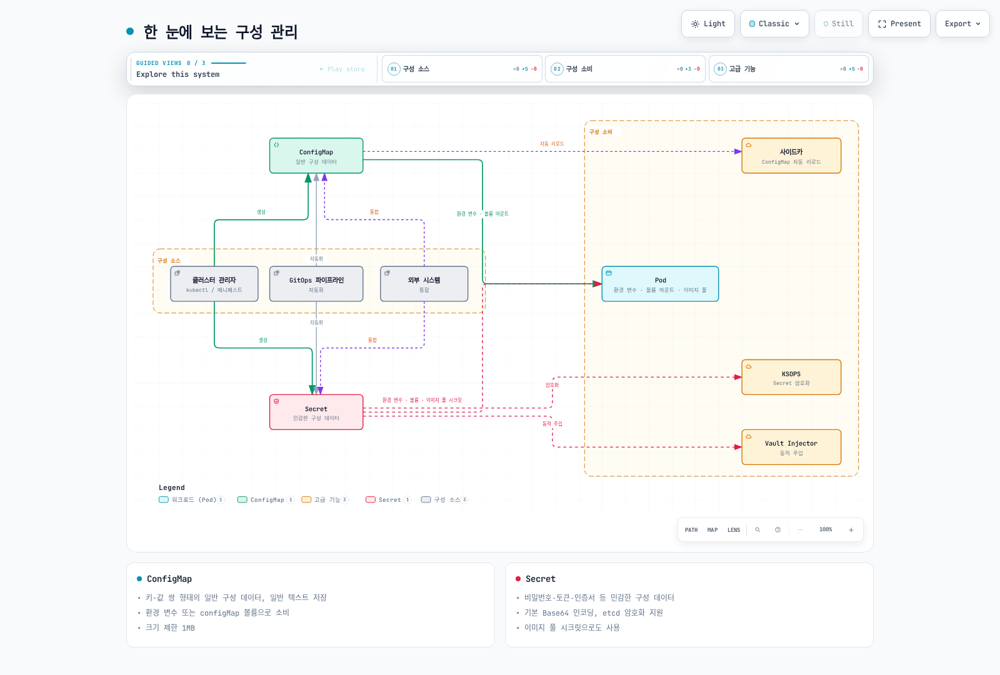
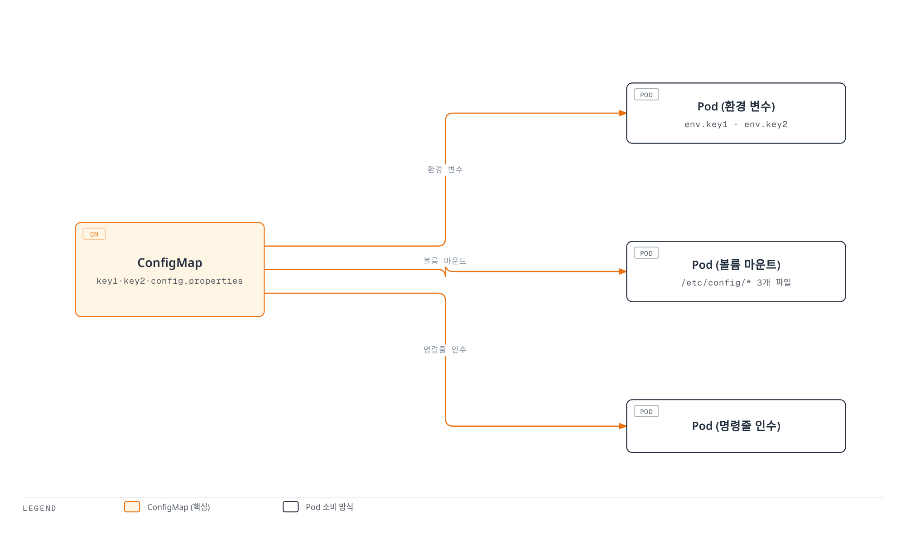
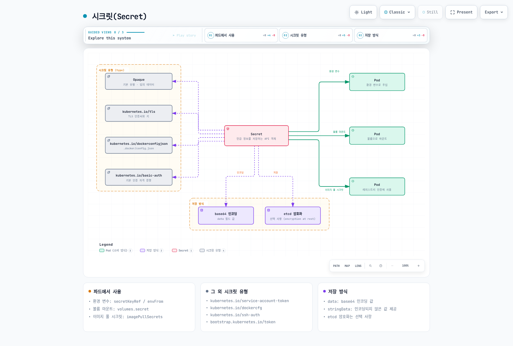
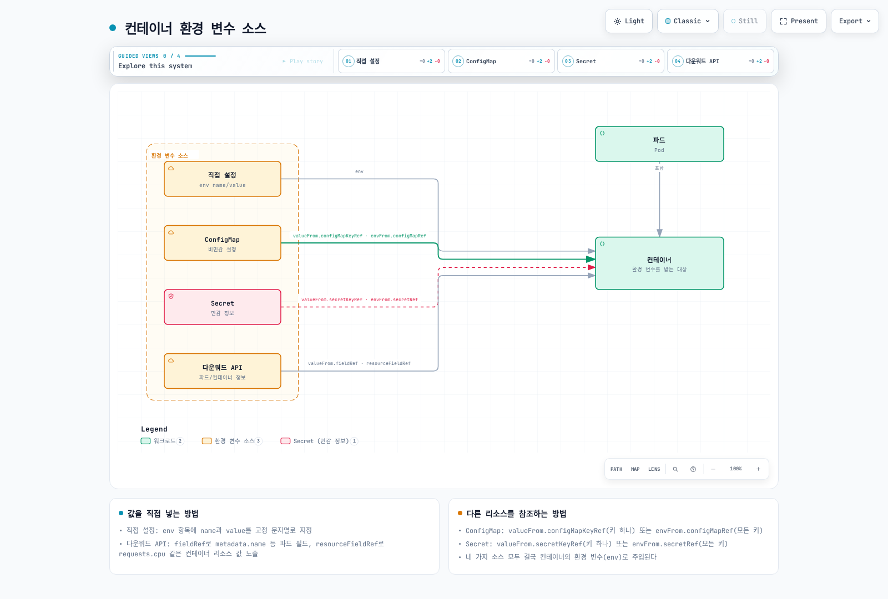
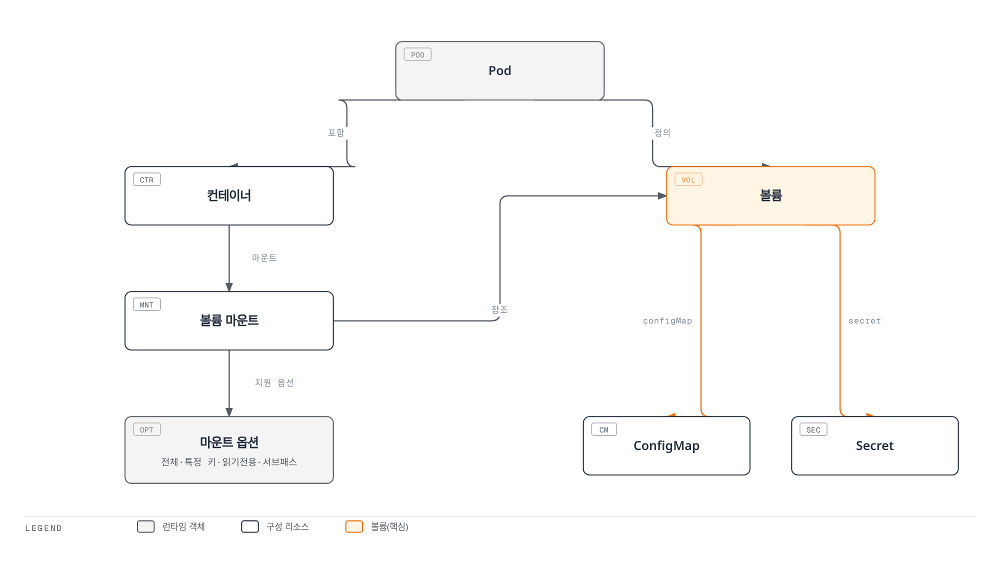
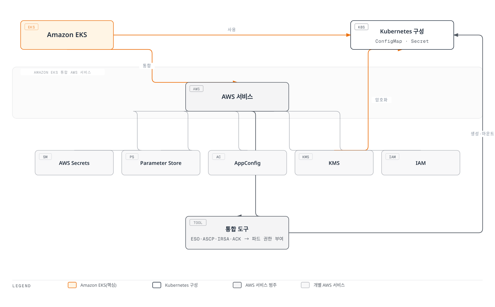

# 구성 및 시크릿

> **지원 버전**: Kubernetes 1.35, 1.36, 1.37
> **마지막 업데이트**: 2026년 2월 22일

Kubernetes에서 구성 관리는 애플리케이션의 설정을 코드와 분리하여 관리하는 중요한 부분입니다. 이 장에서는 컨피그맵(ConfigMap), 시크릿(Secret), 환경 변수, 볼륨을 통한 구성 마운트 등 Kubernetes의 구성 관리 방법에 대해 자세히 알아보겠습니다.

## 실습 환경 설정

이 문서의 예제를 따라하기 위해서는 다음과 같은 도구와 환경이 필요합니다:

### 필수 도구
- API 서버와 마이너 버전 차이가 1 이내인 kubectl
- 작동하는 Kubernetes 클러스터 (EKS, minikube, kind 등)

### 구성 예제 설정

```bash
# 네임스페이스 생성
kubectl create namespace config-demo

# ConfigMap 생성
kubectl -n config-demo create configmap app-config \
  --from-literal=APP_ENV=production \
  --from-literal=APP_DEBUG=false \
  --from-literal=APP_PORT=8080

# Secret 생성
kubectl -n config-demo create secret generic app-secrets \
  --from-literal=DB_USER=admin \
  --from-literal=DB_PASSWORD=s3cr3t \
  --from-literal=API_KEY=abcdef123456

# ConfigMap과 Secret을 사용하는 Pod 생성
kubectl -n config-demo apply -f - <<'EOF'
apiVersion: v1
kind: Pod
metadata:
  name: config-test-pod
spec:
  containers:
  - name: test-container
    image: busybox
    command: ["sh", "-c", 'test -n "$DB_PASSWORD" && echo "Secret available" && sleep 3600']
    env:
    - name: APP_ENV
      valueFrom:
        configMapKeyRef:
          name: app-config
          key: APP_ENV
    - name: DB_PASSWORD
      valueFrom:
        secretKeyRef:
          name: app-secrets
          key: DB_PASSWORD
  restartPolicy: Never
EOF

# Pod 로그 확인
kubectl -n config-demo logs config-test-pod
```

## 한 눈에 보는 구성 관리



[🔍 인터랙티브 다이어그램 보기](https://www.atomai.click/kubernetes-docs/archmaps/ko-core-05-configuration-secrets-0.html)

## 목차

1. [컨피그맵(ConfigMap)](#컨피그맵configmap)
2. [시크릿(Secret)](#시크릿secret)
3. [환경 변수](#환경-변수)
4. [볼륨을 통한 구성 마운트](#볼륨을-통한-구성-마운트)
5. [구성 모범 사례](#구성-모범-사례)
6. [Amazon EKS에서의 구성 관리](#amazon-eks에서의-구성-관리)

## 컨피그맵(ConfigMap)

> **핵심 개념**: 컨피그맵은 키-값 쌍 형태로 구성 데이터를 저장하는 객체로, 애플리케이션 코드와 구성을 분리합니다.

컨피그맵은 키-값 쌍의 형태로 구성 데이터를 저장하는 API 객체입니다. 컨피그맵을 사용하면 컨테이너 이미지에서 구성 데이터를 분리하여 애플리케이션을 더 쉽게 이식할 수 있습니다.

### ConfigMap과 Secret 비교

| 특성 | ConfigMap | Secret |
|------|-----------|--------|
| **용도** | 일반 구성 데이터 | 민감한 구성 데이터 |
| **API 표현** | UTF-8 `data` 또는 base64 `binaryData` | Base64 `data`; 쓰기 시 `stringData` 허용 |
| **크기 제한** | 1 MiB | 1 MiB |
| **저장 시 암호화** | API 서버·플랫폼 구성에 따라 다름 | API 서버·플랫폼 구성에 따라 다름 |
| **볼륨 타입** | configMap | secret |
| **사용 사례** | 환경 변수, 설정 파일 | 비밀번호, 토큰, 인증서 |
| **자동 업데이트** | 볼륨 마운트 시 지연 가능 | 볼륨 마운트 시 지연 가능 |

### 컨피그맵 생성 방법

컨피그맵은 다양한 방법으로 생성할 수 있습니다:

1. **명령형 방식으로 생성**:

```bash
# 리터럴 값으로 생성
kubectl create configmap my-config --from-literal=key1=value1 --from-literal=key2=value2

# 파일에서 생성
kubectl create configmap my-config --from-file=config.properties

# 디렉토리에서 생성
kubectl create configmap my-config --from-file=config-dir/
```

2. **선언형 방식으로 생성**:

```yaml
apiVersion: v1
kind: ConfigMap
metadata:
  name: my-config
data:
  # 단순 키-값 쌍
  database.host: "mysql"
  database.port: "3306"
  
  # 파일 형태의 구성
  config.yaml: |
    server:
      port: 8080
    logging:
      level: INFO
    features:
      enabled: true
```

### 컨피그맵 사용 방법

컨피그맵은 다음과 같은 방법으로 사용할 수 있습니다:

1. **환경 변수로 사용**:

```yaml
apiVersion: v1
kind: Pod
metadata:
  name: config-env-pod
spec:
  containers:
  - name: app
    image: nginx
    env:
    # 단일 키-값 참조
    - name: DB_HOST
      valueFrom:
        configMapKeyRef:
          name: my-config
          key: database.host
    # 모든 키-값 참조
    envFrom:
    - configMapRef:
        name: my-config
```



[🔍 인터랙티브 다이어그램 보기](https://www.atomai.click/kubernetes-docs/archmaps/ko-core-05-configuration-secrets-1.html)

### 컨피그맵 생성

컨피그맵은 여러 가지 방법으로 생성할 수 있습니다:

#### 명령형 방식

```bash
# 리터럴 값으로 생성
kubectl create configmap my-config --from-literal=key1=value1 --from-literal=key2=value2

# 파일에서 생성
kubectl create configmap my-config --from-file=config.properties

# 디렉토리에서 생성
kubectl create configmap my-config --from-file=config-dir/
```

#### 선언형 방식

```yaml
apiVersion: v1
kind: ConfigMap
metadata:
  name: my-config
data:
  # 단순 키-값 쌍
  key1: value1
  key2: value2
  # 파일과 같은 구성
  config.properties: |
    property1=value1
    property2=value2
  # JSON 구성
  config.json: |
    {
      "property1": "value1",
      "property2": "value2"
    }
```

### 컨피그맵 사용

컨피그맵은 다음과 같은 방법으로 포드에서 사용할 수 있습니다:

##자체 관리형 클러스터는 `--encryption-provider-config`로 이 파일을 로드하고 암호화 키를 보호하며 기존 Secret도 다시 저장해야 합니다. `kubectl apply`로 생성하는 리소스가 아닙니다. EKS의 암호화는 서비스가 관리합니다(아래 참고).

## 환경 변수로 사용

```yaml
apiVersion: v1
kind: Pod
metadata:
  name: configmap-pod
spec:
  containers:
  - name: test-container
    image: busybox
    command: [ "/bin/sh", "-c", "env" ]
    env:
    # 단일 키-값 쌍 사용
    - name: SPECIAL_KEY
      valueFrom:
        configMapKeyRef:
          name: my-config
          key: key1
    # 모든 키-값 쌍을 환경 변수로 사용
    envFrom:
    - configMapRef:
        name: my-config
  restartPolicy: Never
```

#### 볼륨으로 마운트

```yaml
apiVersion: v1
kind: Pod
metadata:
  name: configmap-pod
spec:
  containers:
  - name: test-container
    image: busybox
    command: [ "/bin/sh", "-c", "ls /etc/config/" ]
    volumeMounts:
    - name: config-volume
      mountPath: /etc/config
  volumes:
  - name: config-volume
    configMap:
      name: my-config
  restartPolicy: Never
```

#### 특정 키만 마운트

```yaml
apiVersion: v1
kind: Pod
metadata:
  name: configmap-pod
spec:
  containers:
  - name: test-container
    image: busybox
    command: [ "/bin/sh", "-c", "cat /etc/config/key1" ]
    volumeMounts:
    - name: config-volume
      mountPath: /etc/config
  volumes:
  - name: config-volume
    configMap:
      name: my-config
      items:
      - key: key1
        path: key1
  restartPolicy: Never
```

### 컨피그맵 업데이트

수정 가능한 ConfigMap·Secret의 전체 볼륨 마운트는 최종적으로 갱신되며 지연은 kubelet 동기화와 변경 감지·캐시 설정에 따라 다릅니다. 앱도 파일을 다시 읽거나 리로드해야 합니다. `subPath` 마운트는 갱신되지 않습니다. 실행 중 프로세스의 환경 변수는 바뀌지 않으므로 새 값을 사용하려면 Deployment 롤아웃 등으로 파드를 재생성하세요.

```bash
kubectl edit configmap my-config
```

또는

```yaml
apiVersion: v1
kind: ConfigMap
metadata:
  name: my-config
data:
  key1: updated-value1
  key2: value2
```

```bash
kubectl apply -f updated-configmap.yaml
```

## 시크릿(Secret)

시크릿은 암호, OAuth 토큰, SSH 키와 같은 민감한 정보를 저장하는 API 객체입니다. 시크릿은 컨피그맵과 유사하지만, 민감한 데이터를 저장하기 위한 추가적인 보안 기능을 제공합니다.



[🔍 인터랙티브 다이어그램 보기](https://www.atomai.click/kubernetes-docs/archmaps/ko-core-05-configuration-secrets-2.html)

### 시크릿 유형

Kubernetes는 다양한 유형의 시크릿을 제공합니다:

- **Opaque**: 기본 유형으로, 임의의 사용자 정의 데이터를 저장합니다.
- **kubernetes.io/service-account-token**: 서비스 계정 토큰을 저장합니다.
- **kubernetes.io/dockercfg**: `.dockercfg` 파일의 직렬화된 형태를 저장합니다.
- **kubernetes.io/dockerconfigjson**: `.docker/config.json` 파일의 직렬화된 형태를 저장합니다.
- **kubernetes.io/basic-auth**: 기본 인증을 위한 자격 증명을 저장합니다.
- **kubernetes.io/ssh-auth**: SSH 인증을 위한 자격 증명을 저장합니다.
- **kubernetes.io/tls**: TLS 인증서와 키를 저장합니다.
- **bootstrap.kubernetes.io/token**: 부트스트랩 토큰 데이터를 저장합니다.

### 시크릿 생성

시크릿은 여러 가지 방법으로 생성할 수 있습니다:

#### 명령형 방식

```bash
# 리터럴 값으로 생성
kubectl create secret generic my-secret --from-literal=username=admin --from-literal=password=secret

# 파일에서 생성
kubectl create secret generic my-secret --from-file=username=username.txt --from-file=password=password.txt

# TLS 시크릿 생성
kubectl create secret tls my-tls-secret --cert=path/to/cert.crt --key=path/to/key.key

# Docker 레지스트리 시크릿 생성
kubectl create secret docker-registry my-registry-secret \
  --docker-server=DOCKER_REGISTRY_SERVER \
  --docker-username=DOCKER_USER \
  --docker-password=DOCKER_PASSWORD \
  --docker-email=DOCKER_EMAIL
```

#### 선언형 방식

```yaml
apiVersion: v1
kind: Secret
metadata:
  name: my-secret
type: Opaque
data:
  # base64로 인코딩된 값
  username: YWRtaW4=  # admin
  password: c2VjcmV0  # secret
```

또는 `stringData` 필드를 사용하여 인코딩되지 않은 값을 제공할 수 있습니다:

```yaml
apiVersion: v1
kind: Secret
metadata:
  name: my-secret
type: Opaque
stringData:
  # 인코딩되지 않은 값
  username: admin
  password: secret
```

### 시크릿 사용

시크릿은 다음과 같은 방법으로 포드에서 사용할 수 있습니다:

##자체 관리형 클러스터는 `--encryption-provider-config`로 이 파일을 로드하고 암호화 키를 보호하며 기존 Secret도 다시 저장해야 합니다. `kubectl apply`로 생성하는 리소스가 아닙니다. EKS의 암호화는 서비스가 관리합니다(아래 참고).

## 환경 변수로 사용

```yaml
apiVersion: v1
kind: Pod
metadata:
  name: secret-pod
spec:
  containers:
  - name: test-container
    image: busybox
    command: ["/bin/sh", "-c", 'test -n "$USERNAME" && echo "Secret available"']
    env:
    # 단일 키-값 쌍 사용
    - name: USERNAME
      valueFrom:
        secretKeyRef:
          name: my-secret
          key: username
    # 모든 키-값 쌍을 환경 변수로 사용
    envFrom:
    - secretRef:
        name: my-secret
  restartPolicy: Never
```

#### 볼륨으로 마운트

```yaml
apiVersion: v1
kind: Pod
metadata:
  name: secret-pod
spec:
  containers:
  - name: test-container
    image: busybox
    command: [ "/bin/sh", "-c", "ls /etc/secret/" ]
    volumeMounts:
    - name: secret-volume
      mountPath: /etc/secret
  volumes:
  - name: secret-volume
    secret:
      secretName: my-secret
  restartPolicy: Never
```

#### 이미지 풀 시크릿

```yaml
apiVersion: v1
kind: Pod
metadata:
  name: private-image-pod
spec:
  containers:
  - name: private-image-container
    image: private-registry.example.com/my-app:v1
  imagePullSecrets:
  - name: my-registry-secret
```

### 시크릿 보안 고려 사항

시크릿은 기본적으로 base64로 인코딩되어 있지만, 이는 암호화가 아닙니다. 시크릿의 보안을 강화하기 위해 다음과 같은 방법을 고려할 수 있습니다:

1. **etcd 암호화**: etcd에 저장된 시크릿을 암호화합니다.
2. **RBAC**: 시크릿에 대한 접근을 제한합니다.
3. **네트워크 정책**: 지원되는 환경에서 API·외부 저장소로의 네트워크 접근을 제한하며 Secret 객체 권한은 NetworkPolicy가 아닌 RBAC가 집행합니다.
4. **외부 시크릿 관리 도구**: AWS Secrets Manager, HashiCorp Vault 등의 외부 시크릿 관리 도구를 사용합니다.

여기 표시한 자격 증명은 교육용 더미 값입니다. 실제 값이나 base64 값을 로그·Git에 남기지 말고 리터럴 CLI 인수보다 보호된 입력 파일이나 외부 시크릿 저장소를 사용하세요. Secret을 사용하는 파드를 생성할 수 있는 사용자는 직접 Secret 읽기 권한 없이도 값을 얻을 수 있습니다.

#### etcd 암호화 구성

```yaml
apiVersion: apiserver.config.k8s.io/v1
kind: EncryptionConfiguration
resources:
  - resources:
    - secrets
    providers:
    - aescbc:
        keys:
        - name: key1
          secret: <base64 encoded key>
    - identity: {}
```

자체 관리형 클러스터는 `--encryption-provider-config`로 이 파일을 로드하고 암호화 키를 보호하며 기존 Secret도 다시 저장해야 합니다. `kubectl apply`로 생성하는 리소스가 아닙니다. EKS의 암호화는 서비스가 관리합니다(아래 참고).

## 환경 변수

환경 변수는 컨테이너에 구성 정보를 전달하는 간단한 방법입니다. Kubernetes는 여러 가지 방법으로 환경 변수를 설정할 수 있습니다.



[🔍 인터랙티브 다이어그램 보기](https://www.atomai.click/kubernetes-docs/archmaps/ko-core-05-configuration-secrets-3.html)

### 직접 설정

```yaml
apiVersion: v1
kind: Pod
metadata:
  name: env-pod
spec:
  containers:
  - name: test-container
    image: busybox
    command: [ "/bin/sh", "-c", "env" ]
    env:
    - name: ENVIRONMENT
      value: "production"
    - name: LOG_LEVEL
      value: "INFO"
  restartPolicy: Never
```

### 컨피그맵에서 설정

```yaml
apiVersion: v1
kind: Pod
metadata:
  name: env-pod
spec:
  containers:
  - name: test-container
    image: busybox
    command: [ "/bin/sh", "-c", "env" ]
    env:
    - name: ENVIRONMENT
      valueFrom:
        configMapKeyRef:
          name: my-config
          key: key1
  restartPolicy: Never
```

### 시크릿에서 설정

```yaml
apiVersion: v1
kind: Pod
metadata:
  name: env-pod
spec:
  containers:
  - name: test-container
    image: busybox
    command: ["/bin/sh", "-c", 'test -n "$DATABASE_PASSWORD" && echo "Secret available"']
    env:
    - name: DATABASE_PASSWORD
      valueFrom:
        secretKeyRef:
          name: my-secret
          key: password
  restartPolicy: Never
```

### 다운워드 API를 통한 설정

다운워드 API를 사용하면 포드 및 컨테이너 정보를 환경 변수로 노출할 수 있습니다.

```yaml
apiVersion: v1
kind: Pod
metadata:
  name: downward-api-pod
  labels:
    app: myapp
spec:
  containers:
  - name: test-container
    image: busybox
    command: [ "/bin/sh", "-c", "env" ]
    env:
    - name: POD_NAME
      valueFrom:
        fieldRef:
          fieldPath: metadata.name
    - name: POD_NAMESPACE
      valueFrom:
        fieldRef:
          fieldPath: metadata.namespace
    - name: POD_IP
      valueFrom:
        fieldRef:
          fieldPath: status.podIP
    - name: NODE_NAME
      valueFrom:
        fieldRef:
          fieldPath: spec.nodeName
    - name: CONTAINER_CPU_REQUEST
      valueFrom:
        resourceFieldRef:
          containerName: test-container
          resource: requests.cpu
  restartPolicy: Never
```

## 볼륨을 통한 구성 마운트

볼륨을 통해 구성 파일을 컨테이너에 마운트하는 방법은 환경 변수보다 더 유연한 구성 관리 방법을 제공합니다.



[🔍 인터랙티브 다이어그램 보기](https://www.atomai.click/kubernetes-docs/archmaps/ko-core-05-configuration-secrets-4.html)

### 컨피그맵 볼륨

```yaml
apiVersion: v1
kind: Pod
metadata:
  name: configmap-volume-pod
spec:
  containers:
  - name: test-container
    image: busybox
    command: [ "/bin/sh", "-c", "ls -la /etc/config" ]
    volumeMounts:
    - name: config-volume
      mountPath: /etc/config
  volumes:
  - name: config-volume
    configMap:
      name: my-config
  restartPolicy: Never
```

### 시크릿 볼륨

```yaml
apiVersion: v1
kind: Pod
metadata:
  name: secret-volume-pod
spec:
  containers:
  - name: test-container
    image: busybox
    command: [ "/bin/sh", "-c", "ls -la /etc/secret" ]
    volumeMounts:
    - name: secret-volume
      mountPath: /etc/secret
  volumes:
  - name: secret-volume
    secret:
      secretName: my-secret
  restartPolicy: Never
```

### 특정 파일 마운트

```yaml
apiVersion: v1
kind: Pod
metadata:
  name: specific-file-pod
spec:
  containers:
  - name: test-container
    image: busybox
    command: [ "/bin/sh", "-c", "cat /etc/config/config.properties" ]
    volumeMounts:
    - name: config-volume
      mountPath: /etc/config
  volumes:
  - name: config-volume
    configMap:
      name: my-config
      items:
      - key: config.properties
        path: config.properties
  restartPolicy: Never
```

### 읽기 전용 마운트

```yaml
apiVersion: v1
kind: Pod
metadata:
  name: readonly-mount-pod
spec:
  containers:
  - name: test-container
    image: busybox
    command: [ "/bin/sh", "-c", "ls -la /etc/config" ]
    volumeMounts:
    - name: config-volume
      mountPath: /etc/config
      readOnly: true
  volumes:
  - name: config-volume
    configMap:
      name: my-config
  restartPolicy: Never
```

### 서브패스 마운트

```yaml
apiVersion: v1
kind: Pod
metadata:
  name: subpath-mount-pod
spec:
  containers:
  - name: test-container
    image: busybox
    command: [ "/bin/sh", "-c", "cat /etc/config/config.properties" ]
    volumeMounts:
    - name: config-volume
      mountPath: /etc/config/config.properties
      subPath: config.properties
  volumes:
  - name: config-volume
    configMap:
      name: my-config
  restartPolicy: Never
```

## 구성 모범 사례

Kubernetes에서 구성을 관리할 때 다음과 같은 모범 사례를 고려하세요:

### 1. 구성과 코드 분리

애플리케이션 코드와 구성을 분리하여 관리하세요. 이렇게 하면 구성을 변경할 때 애플리케이션을 다시 빌드하지 않아도 됩니다.

### 2. 환경별 구성 관리

개발, 테스트, 프로덕션 등 다양한 환경에 대한 구성을 별도로 관리하세요. 네임스페이스를 사용하여 환경을 분리하고, 환경별로 다른 컨피그맵과 시크릿을 사용할 수 있습니다.

```yaml
apiVersion: v1
kind: ConfigMap
metadata:
  name: my-config
  namespace: development
data:
  environment: development
  log_level: DEBUG
---
apiVersion: v1
kind: ConfigMap
metadata:
  name: my-config
  namespace: production
data:
  environment: production
  log_level: INFO
```

### 3. 민감한 정보는 시크릿 사용

암호, API 키, 인증서 등의 민감한 정보는 항상 시크릿을 사용하여 저장하세요. 컨피그맵은 민감하지 않은 구성 데이터에만 사용하세요.

### 4. 불변성 유지

구성을 변경할 때는 새 버전을 생성하고, 기존 버전을 수정하지 마세요. 이렇게 하면 롤백이 쉬워지고, 구성 변경 이력을 추적할 수 있습니다.

```yaml
apiVersion: v1
kind: ConfigMap
metadata:
  name: my-config-v1
immutable: true
data:
  log_level: INFO
  # 구성 데이터
---
apiVersion: v1
kind: ConfigMap
metadata:
  name: my-config-v2
immutable: true
data:
  log_level: DEBUG
  # 업데이트된 구성 데이터
```

### 5. 구성 변경 시 포드 재시작

환경 변수로 사용된 구성은 포드가 재시작되어야 업데이트됩니다. 디플로이먼트를 사용하여 포드를 롤링 업데이트하세요.

```bash
kubectl rollout restart deployment/my-deployment
```

### 6. 구성 검증

구성을 적용하기 전에 유효성을 검증하세요. 잘못된 구성은 애플리케이션 장애를 일으킬 수 있습니다.

### 7. 구성 문서화

구성 옵션과 그 영향을 문서화하세요. 이는 팀원들이 구성을 이해하고 관리하는 데 도움이 됩니다.

### 리소스 요청과 QoS

요청은 스케줄링과 실행 중 리소스 배분의 기준이며 앱이 반드시 그만큼 사용해야 한다는 뜻은 아닙니다. CPU 제한은 스로틀링하고 메모리 제한은 OOM 종료를 유발할 수 있습니다. 퀴즈의 컨테이너 수준 예시에서 Guaranteed는 모든 컨테이너의 CPU·메모리 요청이 각각 제한과 같아야 하며 BestEffort는 둘 다 없고 나머지는 Burstable입니다. 파드 수준 리소스도 QoS에 영향을 줄 수 있습니다. 노드 압력 축출에는 우선순위와 요청 대비 사용량도 반영됩니다. [리소스 관리](https://kubernetes.io/docs/concepts/configuration/manage-resources-containers/)와 [파드 QoS](https://kubernetes.io/docs/concepts/workloads/pods/pod-qos/)를 참고하세요.

## Amazon EKS에서의 구성 관리

Amazon EKS에서는 Kubernetes의 기본 구성 관리 기능 외에도 AWS의 다양한 서비스를 활용하여 구성과 시크릿을 관리할 수 있습니다. 이 섹션에서는 EKS에서 구성을 관리하는 다양한 방법과 AWS 서비스와의 통합에 대해 알아보겠습니다.



[🔍 인터랙티브 다이어그램 보기](https://www.atomai.click/kubernetes-docs/archmaps/ko-core-05-configuration-secrets-5.html)

### AWS Secrets Manager 통합

AWS Secrets Manager는 데이터베이스 자격 증명, API 키 및 기타 시크릿 정보를 안전하게 저장하고 관리할 수 있는 서비스입니다. External Secrets Operator는 Kubernetes Secret을 동기화합니다. ASCP와 Secrets Store CSI Driver는 외부 값을 파일로 마운트하며 Kubernetes Secret 동기화·자동 로테이션은 별도 선택 설정이 필요합니다.

#### External Secrets Operator 설치

```bash
# Helm을 사용하여 External Secrets Operator 설치
helm repo add external-secrets https://charts.external-secrets.io
helm install external-secrets external-secrets/external-secrets \
  --namespace external-secrets \
  --create-namespace
```

#### SecretStore 생성

```yaml
apiVersion: external-secrets.io/v1
kind: SecretStore
metadata:
  name: aws-secretsmanager
  namespace: my-namespace
spec:
  provider:
    aws:
      service: SecretsManager
      region: us-west-2
      auth:
        jwt:
          serviceAccountRef:
            name: my-serviceaccount
```

#### ExternalSecret 생성

```yaml
apiVersion: external-secrets.io/v1
kind: ExternalSecret
metadata:
  name: database-credentials
  namespace: my-namespace
spec:
  refreshInterval: 1h
  secretStoreRef:
    name: aws-secretsmanager
    kind: SecretStore
  target:
    name: db-credentials
  data:
  - secretKey: username
    remoteRef:
      key: prod/db/credentials
      property: username
  - secretKey: password
    remoteRef:
      key: prod/db/credentials
      property: password
```

#### IRSA(IAM Roles for Service Accounts) 설정

External Secrets Operator가 AWS Secrets Manager에 접근하려면 적절한 IAM 권한이 필요합니다. IRSA를 사용하여 Kubernetes 서비스 계정에 IAM 역할을 연결할 수 있습니다.

```bash
# OIDC 제공자 생성
eksctl utils associate-iam-oidc-provider \
  --cluster my-cluster \
  --approve

# IAM 역할 및 서비스 계정 생성
eksctl create iamserviceaccount \
  --cluster my-cluster \
  --namespace my-namespace \
  --name my-serviceaccount \
  --attach-policy-arn arn:aws:iam::123456789012:policy/ReadAppDatabaseSecret \
  --approve
```

`ReadAppDatabaseSecret` 정책을 먼저 만들고 `secretsmanager:GetSecretValue`, `secretsmanager:DescribeSecret`을 `prod/db/credentials`의 전체 ARN으로 제한하세요. 고객 관리 키 사용 시 필요한 범위의 `kms:Decrypt`만 추가합니다. IAM 신뢰 정책은 클러스터·네임스페이스·ServiceAccount와 일치해야 합니다. ESO와 v1 CRD, 네임스페이스, ServiceAccount를 SecretStore보다 먼저 준비하세요.

### AWS Parameter Store 활용

AWS Systems Manager Parameter Store는 구성 데이터와 시크릿 값을 계층적으로 저장하고 관리할 수 있는 서비스입니다. 로테이션·수명 주기·접근 요구사항에 따라 Parameter Store와 Secrets Manager를 선택하세요. 요금은 파라미터 티어와 API 사용량에 따라 다릅니다.

#### ASCP(AWS Secrets and Configuration Provider) 설치

```bash
# ASCP 설치
helm repo add secrets-store-csi-driver https://kubernetes-sigs.github.io/secrets-store-csi-driver/charts
helm install csi-secrets-store secrets-store-csi-driver/secrets-store-csi-driver \
  --namespace kube-system

# AWS 제공자 설치
kubectl apply -f https://raw.githubusercontent.com/aws/secrets-store-csi-driver-provider-aws/main/deployment/aws-provider-installer.yaml
```

#### SecretProviderClass 생성

```yaml
apiVersion: secrets-store.csi.x-k8s.io/v1
kind: SecretProviderClass
metadata:
  name: aws-parameters
  namespace: my-namespace
spec:
  provider: aws
  parameters:
    objects: |
      - objectName: /my-app/config/log-level
        objectType: ssmparameter
      - objectName: /my-app/config/environment
        objectType: ssmparameter
```

#### 포드에서 Parameter Store 값 사용

```yaml
apiVersion: v1
kind: Pod
metadata:
  name: parameter-store-pod
  namespace: my-namespace
spec:
  serviceAccountName: parameter-reader
  containers:
  - name: app
    image: my-app:latest
    volumeMounts:
    - name: parameters-store-volume
      mountPath: "/mnt/parameters"
      readOnly: true
  volumes:
  - name: parameters-store-volume
    csi:
      driver: secrets-store.csi.k8s.io
      readOnly: true
      volumeAttributes:
        secretProviderClass: aws-parameters
```

`parameter-reader`에 두 파라미터 ARN의 `ssm:GetParameters` 및 필요한 범위의 KMS 복호화 권한을 가진 IRSA 역할 또는 Pod Identity 연결을 준비하세요. 앞의 Secrets Manager 역할에는 SSM 권한이 없습니다. ASCP는 호환 EC2 노드가 필요하며 Fargate에서는 이 CSI 마운트를 사용할 수 없습니다.

### AWS AppConfig를 사용한 동적 구성

AWS AppConfig는 애플리케이션 구성을 관리하고 배포하는 서비스입니다. AppConfig를 사용하면 애플리케이션을 재배포하지 않고도 구성을 동적으로 업데이트할 수 있습니다.

#### AppConfig Agent 사이드카 패턴

애플리케이션은 에이전트의 로컬 HTTP 엔드포인트에서 구성을 가져와 갱신·리로드해야 합니다. emptyDir 공유만으로 에이전트가 `/config/config.json`을 쓰지는 않습니다. 먼저 애플리케이션·환경·구성 프로필을 만들고 배포한 뒤 필요한 구성에 대한 `appconfig:StartConfigurationSession`, `appconfig:GetLatestConfiguration` 권한을 파드 ID에 부여하세요.

```yaml
apiVersion: apps/v1
kind: Deployment
metadata:
  name: my-app
  namespace: my-namespace
spec:
  replicas: 3
  selector:
    matchLabels:
      app: my-app
  template:
    metadata:
      labels:
        app: my-app
    spec:
      serviceAccountName: appconfig-reader
      containers:
      - name: app
        image: my-app:latest
        env:
        - name: CONFIG_URL
          value: http://localhost:2772/applications/MyApp/environments/Production/configurations/MyConfig
      - name: appconfig-agent
        image: public.ecr.aws/aws-appconfig/aws-appconfig-agent:2.x
        env:
        - name: SERVICE_REGION
          value: us-west-2
        - name: POLL_INTERVAL
          value: "45s"
        - name: REQUEST_TIMEOUT
          value: "15s"
        - name: HTTP_PORT
          value: "2772"
        - name: HTTP_HOST
          value: localhost
        - name: PREFETCH_LIST
          value: MyApp:Production:MyConfig
```

애플리케이션 이미지는 CONFIG_URL 조회와 사이드카 시작 중 재시도를 구현해야 합니다. 배포 전에 `appconfig-reader`와 제한된 AWS ID를 생성하고 운영에서는 검증된 에이전트 버전·다이제스트를 고정하세요. 위 값은 Lambda 확장 변수가 아닌 컨테이너 에이전트 설정입니다.

### EKS Fargate 프로파일을 사용한 구성

EKS Fargate를 사용하면 노드를 관리할 필요 없이 Kubernetes 포드를 실행할 수 있습니다. Fargate 프로파일을 사용하여 포드의 실행 환경을 구성할 수 있습니다.

Fargate 프로파일은 기본 Kubernetes 객체가 아니라 EKS API 리소스입니다. 다음 `eksctl` 구성에서 프라이빗 서브넷 ID와 실행 역할을 바꾼 후 `eksctl create fargateprofile -f fargate-profile.yaml`로 생성합니다:

```yaml
apiVersion: eksctl.io/v1alpha5
kind: ClusterConfig
metadata:
  name: my-cluster
  region: us-west-2
fargateProfiles:
- name: my-profile
  podExecutionRoleARN: arn:aws:iam::123456789012:role/my-pod-execution-role
  selectors:
  - namespace: my-namespace
    labels:
      environment: production
  subnets:
  - subnet-1234567890abcdef0
  - subnet-0abcdef1234567890
```

### AWS KMS를 사용한 시크릿 암호화

Kubernetes 1.28 이상의 EKS는 AWS 소유 키로 Secret·ConfigMap을 포함한 [모든 Kubernetes API 데이터를 기본 봉투 암호화](https://docs.aws.amazon.com/eks/latest/userguide/envelope-encryption.html)합니다. 고객 관리 KMS 키는 선택 사항이며 암호화를 켜기 위해 반드시 필요한 것은 아닙니다.

지원되는 기존 클러스터에 고객 관리 키를 연결할 때는 `update-cluster-config`가 아닌 `associate-encryption-config`를 사용합니다. 적용 전에 키 리전·정책·권한과 연결 제약을 검토하세요. 아래 예시는 키 하나만 생성하고 반환된 ARN을 재사용합니다:

```bash
set -eu
KEY_ARN=$(aws kms create-key --region us-west-2 \
  --description "EKS customer-managed encryption key" \
  --query KeyMetadata.Arn --output text)
aws kms create-alias --region us-west-2 \
  --alias-name alias/eks-secrets --target-key-id "$KEY_ARN"

aws eks associate-encryption-config --region us-west-2 \
  --cluster-name my-cluster \
  --encryption-config "resources=secrets,provider={keyArn=$KEY_ARN}"
```

반환된 업데이트 ID로 `aws eks describe-update` 완료 여부를 확인하고 `aws eks describe-cluster --name my-cluster --region us-west-2 --query cluster.encryptionConfig`로 구성을 확인하세요. 고객 관리 키 구성이 없어도 기본 암호화가 꺼진 것은 아닙니다.

### AWS IAM을 사용한 시크릿 접근 제어

IRSA(IAM Roles for Service Accounts)를 사용하여 Kubernetes 서비스 계정에 IAM 역할을 연결하면, 포드가 AWS 서비스에 안전하게 접근할 수 있습니다.

#### 서비스 계정 생성

```yaml
apiVersion: v1
kind: ServiceAccount
metadata:
  name: my-service-account
  namespace: my-namespace
  annotations:
    eks.amazonaws.com/role-arn: arn:aws:iam::123456789012:role/my-iam-role
```

#### 포드에서 서비스 계정 사용

```yaml
apiVersion: v1
kind: Pod
metadata:
  name: my-pod
  namespace: my-namespace
spec:
  serviceAccountName: my-service-account
  containers:
  - name: app
    image: my-app:latest
```

### EKS 구성 모범 사례

EKS에서 구성을 관리할 때 다음과 같은 모범 사례를 고려하세요:

1. **워크로드 ID 사용**: 지원되는 컴퓨팅에서는 EKS Pod Identity 또는 IRSA로 권한을 제한하세요. Fargate 앱은 IRSA를 사용하며 파드 실행 역할은 인프라용이지 앱 자격 증명이 아닙니다.

2. **시크릿 암호화**: KMS를 사용하여 EKS 클러스터의 시크릿을 암호화하세요.

3. **외부 시크릿 관리**: 민감한 정보는 AWS Secrets Manager나 Parameter Store와 같은 외부 시크릿 관리 서비스를 사용하여 관리하세요.

4. **구성 버전 관리**: AWS AppConfig나 Parameter Store를 사용하여 구성 버전을 관리하세요.

5. **환경별 구성 분리**: 개발, 테스트, 프로덕션 환경에 대한 구성을 분리하여 관리하세요. Kubernetes 네임스페이스와 AWS 리소스 태그를 활용하세요.

6. **IAM 정책 최소화**: AWS 서비스에 접근할 때는 최소 권한 원칙을 따르세요.

7. **구성 자동화**: AWS CloudFormation, AWS CDK, Terraform 등의 도구를 사용하여 구성 관리를 자동화하세요.

### EKS 구성 관리 도구

EKS에서 구성을 관리하는 데 도움이 되는 도구들을 살펴보겠습니다:

#### AWS Controllers for Kubernetes(ACK)

ACK는 Kubernetes에서 AWS 리소스를 관리할 수 있는 도구입니다. ACK를 사용하면 Kubernetes 매니페스트를 통해 AWS 리소스를 생성하고 관리할 수 있습니다.

```yaml
apiVersion: secretsmanager.services.k8s.aws/v1alpha1
kind: Secret
metadata:
  name: my-secret
  annotations:
    services.k8s.aws/deletion-policy: retain
spec:
  name: my-secret
  description: "My secret created via ACK"
  recoveryWindowInDays: 30
```

ACK Secrets Manager 컨트롤러와 IAM 역할·CRD를 먼저 설치하세요. 이 매니페스트는 시크릿 컨테이너 메타데이터를 관리하며 비밀번호를 생성하거나 기본 Kubernetes Secret을 만들지 않습니다. 값은 통제된 시크릿 관리 절차로 입력하세요.

#### eksctl

eksctl은 EKS 클러스터를 생성하고 관리하는 명령줄 도구입니다. eksctl을 사용하여 클러스터 구성을 관리할 수 있습니다.

```yaml
# cluster.yaml
apiVersion: eksctl.io/v1alpha5
kind: ClusterConfig
metadata:
  name: my-cluster
  region: us-west-2
secretsEncryption:
  keyARN: arn:aws:kms:us-west-2:123456789012:key/1234abcd-12ab-34cd-56ef-1234567890ab
```

```bash
eksctl create cluster -f cluster.yaml
```

#### AWS CDK

AWS CDK(Cloud Development Kit)는 프로그래밍 언어를 사용하여 AWS 리소스를 정의하는 도구입니다. CDK를 사용하여 EKS 클러스터와 관련 리소스를 정의할 수 있습니다.

다음 함수는 기존 CDK EKS 클러스터와 Secret 구성을 받아 해당 Secret에만 읽기 권한을 부여합니다. 네임스페이스가 이미 존재하고 클러스터에 호환 kubectl 공급자가 구성되어 있어야 합니다.

```typescript
import * as eks from 'aws-cdk-lib/aws-eks';
import * as secretsmanager from 'aws-cdk-lib/aws-secretsmanager';

export function addSecretReader(
  cluster: eks.Cluster,
  secret: secretsmanager.ISecret,
): eks.ServiceAccount {
  const serviceAccount = cluster.addServiceAccount('SecretReader', {
    name: 'my-service-account',
    namespace: 'my-namespace',
  });
  secret.grantRead(serviceAccount);
  return serviceAccount;
}
```

## 결론

이 장에서는 Kubernetes의 구성 관리 방법에 대해 알아보았습니다. 컨피그맵과 시크릿은 애플리케이션 구성을 관리하는 기본적인 방법을 제공하며, 환경 변수와 볼륨을 통해 이러한 구성을 컨테이너에 전달할 수 있습니다. 또한, 구성 관리의 모범 사례와 외부 구성 관리 도구에 대해서도 살펴보았습니다.

Amazon EKS 환경에서는 Kubernetes의 기본 구성 관리 기능과 함께 AWS의 다양한 서비스를 활용하여 더욱 강력하고 안전한 구성 관리가 가능합니다. AWS Secrets Manager, Parameter Store, KMS, IAM 등의 서비스를 통합하여 시크릿을 안전하게 관리하고, IRSA를 통해 포드에 최소 권한을 부여할 수 있습니다. 또한, AWS AppConfig를 사용하여 애플리케이션을 재배포하지 않고도 구성을 동적으로 업데이트할 수 있습니다.

효과적인 구성 관리는 Kubernetes 애플리케이션의 유지 관리성, 확장성 및 보안을 향상시키는 데 중요합니다. 애플리케이션의 요구 사항에 맞는 적절한 구성 관리 전략을 선택하고, 모범 사례를 따르는 것이 중요합니다. 특히 EKS 환경에서는 AWS 서비스와의 통합을 통해 더욱 강력한 구성 관리 솔루션을 구축할 수 있습니다.

다음 장에서는 Kubernetes의 보안에 대해 알아보겠습니다.

## 퀴즈

이 장에서 배운 내용을 테스트하려면 [구성 및 시크릿 퀴즈](../quizzes/core/05-configuration-secrets-quiz.md)를 풀어보세요.

## 참고 자료

- [Kubernetes 공식 문서 - ConfigMaps](https://kubernetes.io/docs/concepts/configuration/configmap/)
- [Kubernetes 공식 문서 - Secrets](https://kubernetes.io/docs/concepts/configuration/secret/)
- [Kubernetes 공식 문서 - Environment Variables](https://kubernetes.io/docs/tasks/inject-data-application/define-environment-variable-container/)
- [Kubernetes 공식 문서 - Configure a Pod to Use a ConfigMap](https://kubernetes.io/docs/tasks/configure-pod-container/configure-pod-configmap/)
- [Kubernetes 공식 문서 - Distribute Credentials Securely Using Secrets](https://kubernetes.io/docs/tasks/inject-data-application/distribute-credentials-secure/)
- [Helm 공식 문서](https://helm.sh/docs/)
- [Kustomize 공식 문서](https://kustomize.io/)
- [External Secrets Operator 공식 문서](https://external-secrets.io/latest/)
- [AWS Secrets Manager 공식 문서](https://docs.aws.amazon.com/secretsmanager/latest/userguide/intro.html)
- [AWS Systems Manager Parameter Store 공식 문서](https://docs.aws.amazon.com/systems-manager/latest/userguide/systems-manager-parameter-store.html)
- [AWS AppConfig 공식 문서](https://docs.aws.amazon.com/appconfig/latest/userguide/what-is-appconfig.html)
- [EKS 공식 문서 - IRSA](https://docs.aws.amazon.com/eks/latest/userguide/iam-roles-for-service-accounts.html)
- [EKS 공식 문서 - Secrets Encryption](https://docs.aws.amazon.com/eks/latest/userguide/enable-kms.html)
- [AWS Controllers for Kubernetes(ACK) 공식 문서](https://aws-controllers-k8s.github.io/community/)
