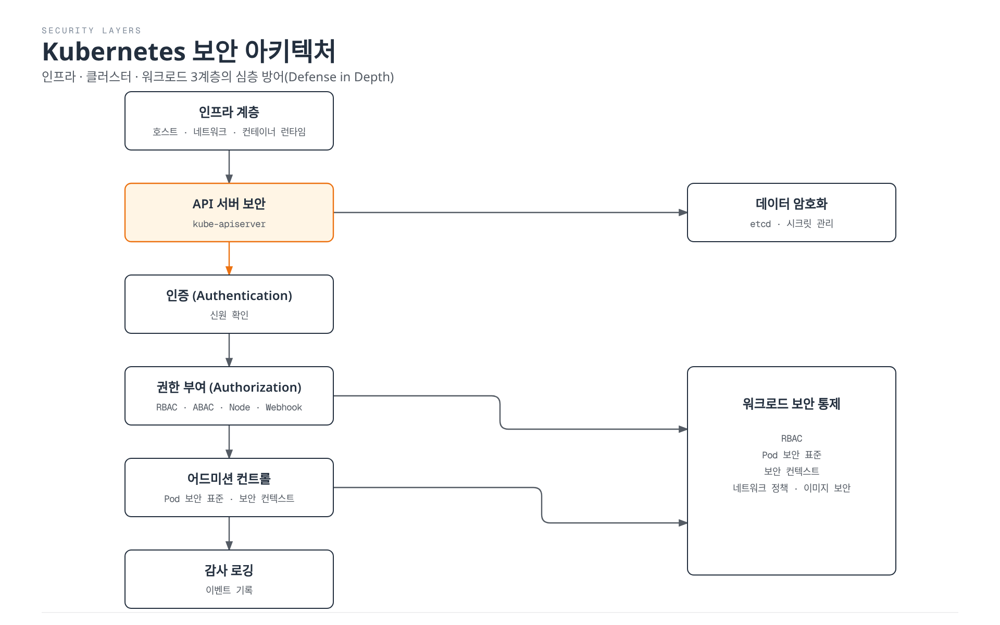
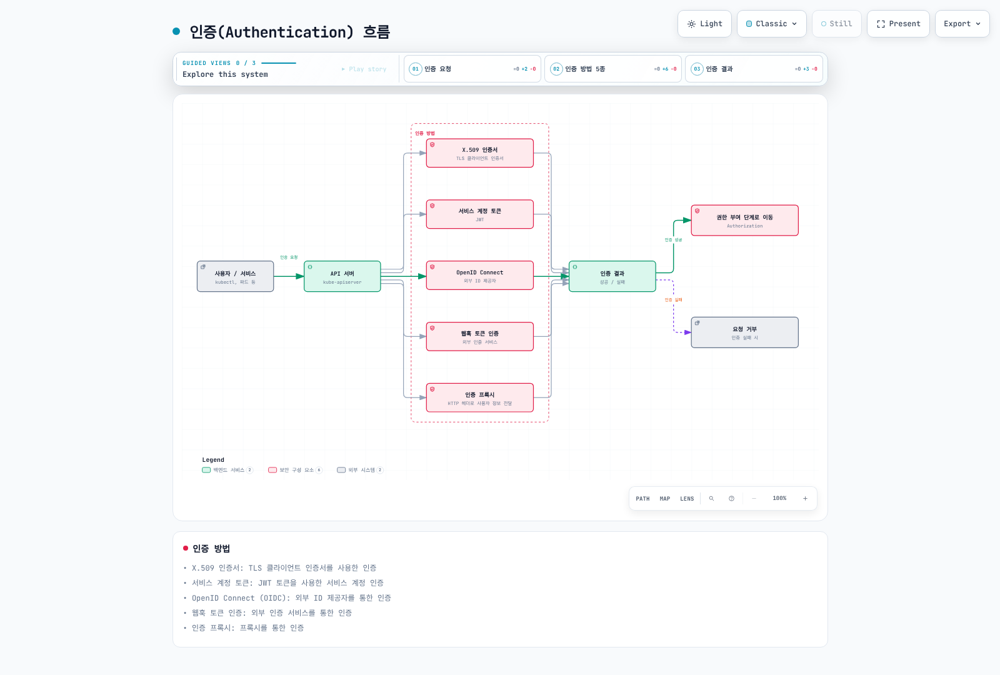
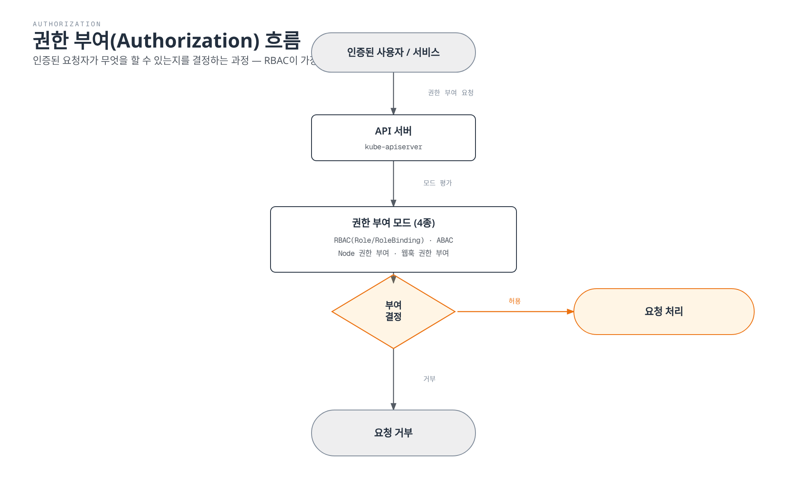
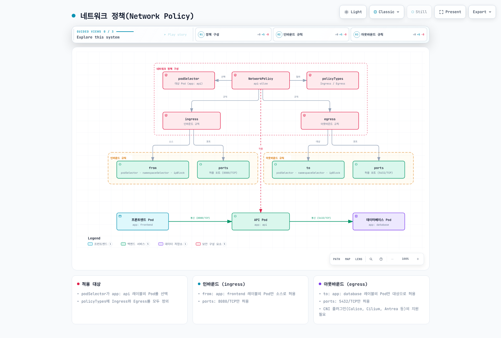
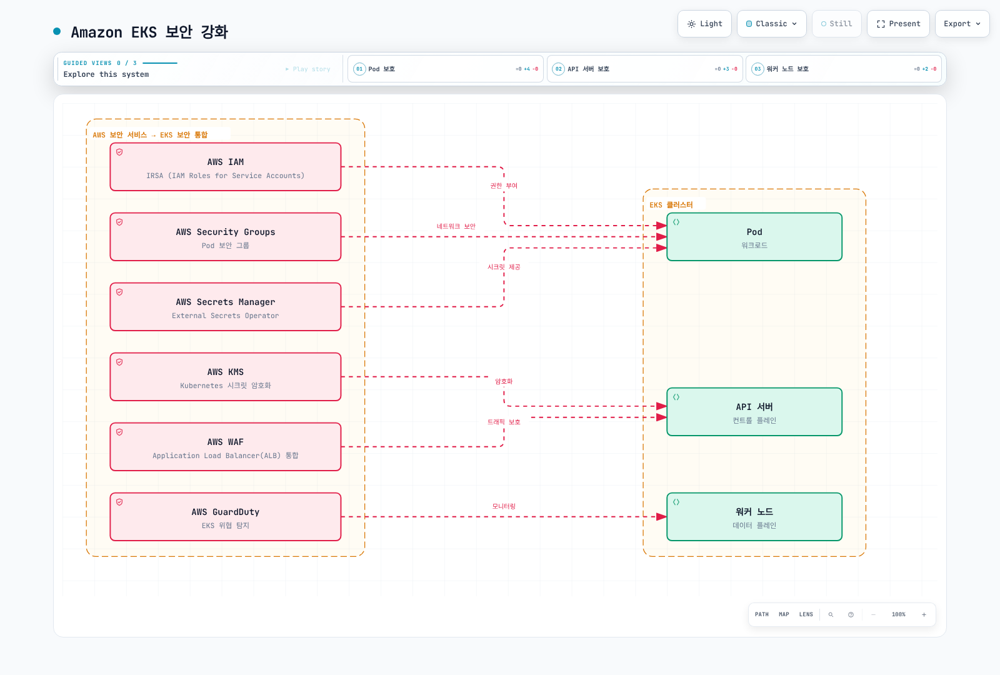

# Kubernetes 보안

> **지원 버전**: Kubernetes 1.35, 1.36, 1.37
> **마지막 업데이트**: 2026년 2월 11일

Kubernetes에서 보안은 클러스터와 애플리케이션을 보호하기 위한 핵심 요소입니다. 이 장에서는 Kubernetes의 보안 개념, 인증 및 권한 부여 메커니즘, 네트워크 정책, 보안 컨텍스트, 그리고 Amazon EKS에서의 보안 강화 방법에 대해 알아보겠습니다.

## 실습 환경 설정

이 문서의 예제를 따라하기 위해서는 다음과 같은 도구와 환경이 필요합니다:

### 필수 도구
- API 서버와 마이너 버전 차이가 1 이내인 kubectl
- 작동하는 Kubernetes 클러스터 (EKS, minikube, kind 등)
- OpenSSL (인증서 생성용)

### 보안 예제 설정

```bash
# 네임스페이스 생성
kubectl create namespace security-demo

# 서비스 계정 생성
kubectl -n security-demo create serviceaccount demo-sa

# 역할 생성
kubectl -n security-demo apply -f - <<EOF
apiVersion: rbac.authorization.k8s.io/v1
kind: Role
metadata:
  name: pod-reader
rules:
- apiGroups: [""]
  resources: ["pods"]
  verbs: ["get", "watch", "list"]
EOF

# 역할 바인딩 생성
kubectl -n security-demo apply -f - <<EOF
apiVersion: rbac.authorization.k8s.io/v1
kind: RoleBinding
metadata:
  name: read-pods
subjects:
- kind: ServiceAccount
  name: demo-sa
  namespace: security-demo
roleRef:
  kind: Role
  name: pod-reader
  apiGroup: rbac.authorization.k8s.io
EOF

# 보안 컨텍스트가 적용된 파드 생성
kubectl -n security-demo apply -f - <<EOF
apiVersion: v1
kind: Pod
metadata:
  name: security-context-demo
spec:
  serviceAccountName: demo-sa
  securityContext:
    runAsUser: 1000
    runAsGroup: 3000
    fsGroup: 2000
    runAsNonRoot: true
    seccompProfile:
      type: RuntimeDefault
  containers:
  - name: sec-ctx-demo
    image: busybox
    command: ["sh", "-c", "sleep 3600"]
    securityContext:
      allowPrivilegeEscalation: false
      readOnlyRootFilesystem: true
EOF
```

## Kubernetes 보안 아키텍처



[🔍 인터랙티브 다이어그램 보기](https://www.atomai.click/kubernetes-docs/archmaps/ko-core-06-security-0.html)

## 목차
1. [보안 개요](#보안-개요)
2. [인증(Authentication)](#인증authentication)
3. [권한 부여(Authorization)](#권한-부여authorization)
4. [보안 컨텍스트(Security Context)](#보안-컨텍스트security-context)
5. [네트워크 정책(Network Policy)](#네트워크-정책network-policy)
6. [시크릿 관리](#시크릿-관리)
7. [이미지 보안](#이미지-보안)
8. [포드 보안 표준](#포드-보안-표준pod-security-standards)
9. [감사(Audit)](#감사audit)
10. [Amazon EKS 보안 강화](#amazon-eks-보안-강화)

## 보안 개요

> **핵심 개념**: Kubernetes 보안은 다층 방어(Defense in Depth) 접근 방식을 따르며, 인프라, 클러스터, 워크로드 수준에서 여러 보안 메커니즘을 제공합니다.

Kubernetes 보안은 다음과 같은 주요 영역으로 구성됩니다:

### 보안 영역 비교

| 보안 영역 | 주요 구성 요소 | 책임자 | 보안 메커니즘 |
|----------|--------------|-------|-------------|
| **인프라 보안** | 호스트 OS, 컨테이너 런타임, 네트워크 | 클러스터 관리자 | 방화벽, OS 강화, 컨테이너 런타임 보안 |
| **클러스터 보안** | API 서버, etcd, kubelet | 클러스터 관리자 | 인증, 권한 부여, 어드미션 컨트롤, 암호화 |
| **워크로드 보안** | 파드, 컨테이너, 서비스 | 애플리케이션 개발자 | 보안 컨텍스트, 네트워크 정책, RBAC |

### 보안 원칙

1. **최소 권한 원칙**: 필요한 최소한의 권한만 부여
2. **심층 방어**: 여러 보안 계층을 통한 방어
3. **기본 거부**: 명시적으로 허용되지 않은 모든 것을 거부
4. **보안 강화**: 기본 설정보다 더 강력한 보안 설정 적용
5. **지속적인 모니터링**: 보안 이벤트 감지 및 대응

## 인증(Authentication)

Kubernetes API 서버에 접근하기 위해서는 인증 과정을 거쳐야 합니다. Kubernetes는 다양한 인증 방법을 지원합니다:



[🔍 인터랙티브 다이어그램 보기](https://www.atomai.click/kubernetes-docs/archmaps/ko-core-06-security-1.html)

### X.509 인증서

Kubernetes는 TLS 인증서를 사용하여 클라이언트를 인증합니다. 이는 주로 클러스터 내부 통신과 관리자 인증에 사용됩니다.

```bash
# 인증서 기반 인증을 위한 kubeconfig 설정 예시
kubectl config set-credentials admin --client-certificate=admin.crt --client-key=admin.key
```

### 서비스 계정 토큰

서비스 계정은 포드 내에서 실행되는 프로세스가 API 서버와 통신할 때 사용하는 계정입니다. 현재 파드는 보통 TokenRequest API로 단기·파드 바인딩 프로젝션 토큰을 받습니다. kubelet이 토큰을 갱신하므로 앱도 토큰 파일을 다시 읽어야 합니다. v1.24부터 ServiceAccount 생성 시 장기 토큰 Secret이 자동 생성되지 않습니다. 아래 웹 서버처럼 API 자격 증명이 필요 없으면 `automountServiceAccountToken: false`를 설정하세요. 명시적인 단기 토큰은 `kubectl create token`으로 요청하며 장기 토큰 Secret은 레거시 예외입니다.

```yaml
apiVersion: v1
kind: ServiceAccount
metadata:
  name: my-service-account
  namespace: default
```

```yaml
apiVersion: v1
kind: Pod
metadata:
  name: my-pod
spec:
  serviceAccountName: my-service-account
  automountServiceAccountToken: false
  containers:
  - name: my-container
    image: nginx:1.30.4
```

### OpenID Connect (OIDC)

외부 ID 제공자(예: Google, Microsoft Entra ID)를 통한 인증을 지원합니다. 이는 기업 환경에서 Single Sign-On(SSO)을 구현하는 데 유용합니다.

ID 제공자에 맞는 신뢰할 수 있는 client-go ExecCredential 로그인 플러그인을 설치하고 해당 로그인 절차를 완료하세요. 아래 kubeconfig 사용자 일부의 실행 파일은 자리 표시자이므로 설치한 플러그인과 문서화된 인수로 교체합니다. EKS IAM 인증은 `aws eks get-token` 등의 AWS 서명 토큰을 사용하며 IAM 자체가 일반 OIDC ID 제공자인 것은 아닙니다.

```yaml
users:
- name: oidc-user
  user:
    exec:
      apiVersion: client.authentication.k8s.io/v1
      command: oidc-login-helper
      interactiveMode: IfAvailable
      provideClusterInfo: true
```

### 웹훅 토큰 인증

외부 인증 서비스를 통해 토큰을 검증하는 방법입니다. API 서버는 토큰을 외부 서비스에 전달하고, 해당 서비스는 토큰의 유효성을 검증하고 사용자 정보를 반환합니다.

### 인증 프록시

API 서버 앞에 인증 프록시를 배치하여 사용자 인증을 처리하는 방법입니다. 프록시는 인증된 사용자의 정보를 HTTP 헤더에 포함하여 API 서버로 전달합니다.

## 권한 부여(Authorization)

인증이 "당신이 누구인가?"를 확인하는 과정이라면, 권한 부여는 "당신이 무엇을 할 수 있는가?"를 결정하는 과정입니다. Kubernetes는 다양한 권한 부여 모드를 지원합니다:



[🔍 인터랙티브 다이어그램 보기](https://www.atomai.click/kubernetes-docs/archmaps/ko-core-06-security-2.html)

### RBAC(Role-Based Access Control)

RBAC는 Kubernetes에서 가장 널리 사용되는 권한 부여 메커니즘입니다. 역할(Role)과 역할 바인딩(RoleBinding)을 통해 사용자나 서비스 계정에 특정 리소스에 대한 권한을 부여합니다.

#### Role과 ClusterRole

Role은 네임스페이스 리소스이며 ClusterRole은 클러스터 범위에서 네임스페이스·클러스터 리소스 권한을 정의할 수 있습니다. 그 자체로 권한을 부여하지는 않습니다. RoleBinding은 해당 네임스페이스로 권한을 한정하고 ClusterRoleBinding은 클러스터 전체에 권한을 부여합니다.

```yaml
# 네임스페이스 내 Role 예시
apiVersion: rbac.authorization.k8s.io/v1
kind: Role
metadata:
  namespace: default
  name: pod-reader
rules:
- apiGroups: [""]
  resources: ["pods"]
  verbs: ["get", "watch", "list"]
```

```yaml
# 클러스터 전체 ClusterRole 예시
apiVersion: rbac.authorization.k8s.io/v1
kind: ClusterRole
metadata:
  name: node-reader
rules:
- apiGroups: [""]
  resources: ["nodes"]
  verbs: ["get", "watch", "list"]
```

#### RoleBinding과 ClusterRoleBinding

RoleBinding은 Role이나 ClusterRole을 특정 네임스페이스의 사용자, 그룹 또는 서비스 계정에 바인딩합니다. ClusterRoleBinding은 ClusterRole을 클러스터 전체의 사용자, 그룹 또는 서비스 계정에 바인딩합니다.

```yaml
# RoleBinding 예시
apiVersion: rbac.authorization.k8s.io/v1
kind: RoleBinding
metadata:
  name: read-pods
  namespace: default
subjects:
- kind: User
  name: jane
  apiGroup: rbac.authorization.k8s.io
roleRef:
  kind: Role
  name: pod-reader
  apiGroup: rbac.authorization.k8s.io
```

```yaml
# ClusterRoleBinding 예시
apiVersion: rbac.authorization.k8s.io/v1
kind: ClusterRoleBinding
metadata:
  name: read-nodes-global
subjects:
- kind: Group
  name: node-viewers
  apiGroup: rbac.authorization.k8s.io
roleRef:
  kind: ClusterRole
  name: node-reader
  apiGroup: rbac.authorization.k8s.io
```

### ABAC(Attribute-Based Access Control)

ABAC는 사용자 속성, 리소스 속성, 환경 속성 등을 기반으로 권한을 부여하는 방식입니다. Kubernetes에서는 JSON 파일을 통해 정책을 정의합니다. RBAC에 비해 유연하지만 관리가 복잡하여 덜 사용됩니다.

### Node 권한 부여

Node 권한 부여는 kubelet이 API 서버에 접근할 때 사용되는 특수한 권한 부여 모드입니다. kubelet은 자신이 실행 중인 노드에 관련된 리소스(포드, 노드 상태 등)에만 접근할 수 있습니다.

### 웹훅 권한 부여

외부 서비스를 통해 권한 부여 결정을 내리는 방식입니다. API 서버는 권한 부여 요청을 외부 서비스에 전달하고, 해당 서비스는 요청을 허용할지 거부할지 결정합니다.

## 보안 컨텍스트(Security Context)

보안 컨텍스트는 포드나 컨테이너 수준에서 보안 설정을 정의합니다. 이를 통해 권한, 액세스 제어, 기능 등을 세밀하게 제어할 수 있습니다.


[🔍 인터랙티브 다이어그램 보기](https://www.atomai.click/kubernetes-docs/archmaps/ko-core-06-security-3.html)

### 포드 보안 컨텍스트

```yaml
apiVersion: v1
kind: Pod
metadata:
  name: security-context-pod
spec:
  securityContext:
    runAsUser: 1000
    runAsGroup: 3000
    fsGroup: 2000
    runAsNonRoot: true
    seccompProfile:
      type: RuntimeDefault
  containers:
  - name: security-context-container
    image: busybox:1.36
    command: ["sh", "-c", "sleep 3600"]
    securityContext:
      allowPrivilegeEscalation: false
      capabilities:
        drop:
        - ALL
      readOnlyRootFilesystem: true
```

위 예시에서:
- `runAsUser`: 컨테이너 프로세스가 실행될 사용자 ID
- `runAsGroup`: 컨테이너 프로세스가 실행될 그룹 ID
- `fsGroup`: 볼륨에 접근할 때 사용할 그룹 ID
- `allowPrivilegeEscalation`: 프로세스가 부모 프로세스보다 더 많은 권한을 얻을 수 있는지 여부
- `capabilities`: Linux 커널 기능을 추가하거나 제거
- `readOnlyRootFilesystem`: 루트 파일 시스템을 읽기 전용으로 마운트

### 포드 보안 표준(Pod Security Standards)

PodSecurityPolicy는 v1.25에서 제거되었습니다. v1.25에서 Stable이 된 Pod Security Admission이 네임스페이스 레이블로 Pod Security Standards를 집행할 수 있습니다. 표준은 정책 정의이며 `PodSecurityStandard` API 리소스가 아닙니다. 세 수준을 정의합니다:

1. **Privileged**: 제한 없음, 모든 권한 허용
2. **Baseline**: 알려진 권한 상승 경로 차단
3. **Restricted**: 강력하게 강화된 보안 정책

```yaml
# 네임스페이스에 포드 보안 표준 적용 예시
apiVersion: v1
kind: Namespace
metadata:
  name: my-namespace
  labels:
    pod-security.kubernetes.io/enforce: restricted
    pod-security.kubernetes.io/audit: restricted
    pod-security.kubernetes.io/warn: restricted
```

Restricted Linux 워크로드에는 `runAsNonRoot: true`, `allowPrivilegeEscalation: false`, 허용된 seccomp 프로필, capability 제거와 호스트 접근 제한 등이 필요합니다. `readOnlyRootFilesystem`은 유용한 강화 설정이지만 Restricted 자체의 필수 항목은 아닙니다. 정책 버전을 고정하려면 `*-version` 네임스페이스 레이블을 지정하세요.

## 네트워크 정책(Network Policy)

네트워크 정책은 포드 간의 통신을 제어하는 방법을 제공합니다. 기본적으로 Kubernetes 클러스터의 모든 포드는 서로 통신할 수 있지만, 네트워크 정책을 사용하면 이를 제한할 수 있습니다.



[🔍 인터랙티브 다이어그램 보기](https://www.atomai.click/kubernetes-docs/archmaps/ko-core-06-security-4.html)

```yaml
apiVersion: networking.k8s.io/v1
kind: NetworkPolicy
metadata:
  name: api-allow
  namespace: default
spec:
  podSelector:
    matchLabels:
      app: api
  policyTypes:
  - Ingress
  - Egress
  ingress:
  - from:
    - podSelector:
        matchLabels:
          app: frontend
    ports:
    - protocol: TCP
      port: 8080
  egress:
  - to:
    - podSelector:
        matchLabels:
          app: database
    ports:
    - protocol: TCP
      port: 5432
```

위 예시에서:
- `app=api` 레이블이 있는 포드에 대한 네트워크 정책을 정의
- `app=frontend` 레이블이 있는 포드에서 8080 포트로의 인바운드 트래픽만 허용
- `app=database` 레이블이 있는 포드의 5432 포트로의 아웃바운드 트래픽만 허용

네트워크 정책을 사용하려면 클러스터의 네트워크 플러그인이 네트워크 정책을 지원해야 합니다. Calico, Cilium, Antrea 등의 CNI 플러그인은 네트워크 정책을 지원합니다.

이 podSelector는 `default`의 파드를 선택합니다. 정책은 허용 규칙의 합집합이므로 다른 정책이 더 많은 트래픽을 허용할 수 있으며 출발지 egress와 목적지 ingress 양쪽이 허용해야 합니다. 이 예시는 DNS를 포함하지 않으므로 Service 이름 조회가 필요하면 실제 클러스터 DNS의 TCP/UDP 53도 허용하세요.

## 시크릿 관리

Kubernetes 시크릿은 암호, API 키, 인증서 등의 민감한 정보를 저장하고 관리하는 데 사용됩니다. Secret API의 `data`는 base64를 사용하며 이 인코딩 자체는 암호화가 아닙니다. 저장 시 보호는 클러스터에 따라 다릅니다. 자체 관리형 클러스터는 암호화 설정이 필요하고 현재 EKS는 기본 봉투 암호화를 제공합니다. 두 경우 모두 RBAC와 안전한 앱 처리가 필요합니다.

### 시크릿 암호화

etcd에 저장된 시크릿을 암호화하려면 API 서버의 암호화 구성을 설정해야 합니다:

```yaml
apiVersion: apiserver.config.k8s.io/v1
kind: EncryptionConfiguration
resources:
  - resources:
      - secrets
    providers:
      - aescbc:
          keys:
            - name: key1
              secret: <base64-encoded-key>
      - identity: {}
```

자체 관리형 API 서버는 `--encryption-provider-config`로 이 파일을 로드해야 합니다. 키를 보호하고 기존 Secret도 다시 저장하세요. 이 파일은 kubectl로 적용할 Kubernetes 리소스가 아닙니다.

### 외부 시크릿 관리

보다 안전한 시크릿 관리를 위해 외부 시크릿 관리 시스템을 사용할 수 있습니다:

- HashiCorp Vault
- AWS Secrets Manager
- Azure Key Vault
- Google Secret Manager
- External Secrets Operator

## 이미지 보안

컨테이너 이미지 보안은 Kubernetes 보안의 중요한 부분입니다.

### 이미지 취약점 스캔

컨테이너 이미지의 취약점을 스캔하여 알려진 보안 문제를 식별하고 해결할 수 있습니다:

- Trivy
- Clair
- Anchore
- AWS ECR 스캔
- Docker Hub 스캔

### 이미지 서명 및 검증

이미지 서명을 통해 이미지의 출처와 무결성을 검증할 수 있습니다:

- Notary
- Cosign
- Portieris
- AWS Signer
- Connaisseur

### 이미지 정책

이미지 정책을 통해 신뢰할 수 있는 레지스트리에서만 이미지를 가져오도록 제한할 수 있습니다:

```yaml
apiVersion: apiserver.config.k8s.io/v1
kind: AdmissionConfiguration
plugins:
- name: ImagePolicyWebhook
  configuration:
    imagePolicy:
      kubeConfigFile: /path/to/kubeconfig
      allowTTL: 50
      denyTTL: 50
      retryBackoff: 500
      defaultAllow: false
```

ImagePolicyWebhook에는 실행 중인 정책 백엔드와 자체 관리형 API 서버의 admission 설정이 필요하며 이 파일만으로 레지스트리 규칙이 집행되지 않습니다. EKS는 임의의 API 서버 플래그를 노출하지 않으므로 지원되는 admission 웹훅·정책 컨트롤러를 사용하세요.

## 감사(Audit)

Kubernetes 감사는 클러스터에서 발생하는 이벤트를 기록하고 분석하는 메커니즘을 제공합니다.

### 감사 정책

감사 정책은 어떤 이벤트를 기록할지 정의합니다:

```yaml
apiVersion: audit.k8s.io/v1
kind: Policy
rules:
- level: Metadata
  resources:
  - group: ""
    resources: ["secrets", "serviceaccounts/token"]
  - group: "authentication.k8s.io"
    resources: ["tokenreviews"]
- level: Metadata
```

감사 수준:
- `None`: 이벤트를 기록하지 않음
- `Metadata`: 요청 메타데이터(사용자, 시간, 리소스 등)만 기록
- `Request`: 요청 메타데이터와 요청 본문을 기록
- `RequestResponse`: 요청 메타데이터, 요청 본문, 응답 본문을 기록

### 감사 로그 백엔드

감사 로그는 다양한 백엔드에 저장될 수 있습니다:
- 파일
- 웹훅

내장 백엔드는 파일/log와 webhook입니다. 수집기로 Elasticsearch/Loki에 전달할 수 있지만 이들은 기본 동적 audit 백엔드가 아닙니다. 위 예시는 메타데이터만 기록하므로 Secret·토큰 본문을 로그에 복사하지 않습니다. 자체 관리형 API 서버에는 정책·백엔드 설정이 필요하며 EKS 감사 로그는 컨트롤 플레인 로깅으로 활성화합니다.

## Amazon EKS 보안 강화

Amazon EKS는 Kubernetes의 기본 보안 기능 외에도 AWS의 보안 서비스와 통합하여 보안을 강화할 수 있습니다.



[🔍 인터랙티브 다이어그램 보기](https://www.atomai.click/kubernetes-docs/archmaps/ko-core-06-security-5.html)

### IAM 역할 및 서비스 계정(IRSA)

IRSA(IAM Roles for Service Accounts)를 사용하면 Kubernetes 서비스 계정에 IAM 역할을 연결하여 AWS 서비스에 안전하게 접근할 수 있습니다.

```bash
# OIDC 제공자 생성
eksctl utils associate-iam-oidc-provider --cluster my-cluster --approve

# IAM 역할 생성 및 서비스 계정 연결
eksctl create iamserviceaccount \
  --name my-service-account \
  --namespace default \
  --cluster my-cluster \
  --attach-policy-arn arn:aws:iam::123456789012:policy/ReadApplicationBucket \
  --approve
```

필요한 버킷·접두사에만 `s3:GetObject`를 허용하는 `ReadApplicationBucket` 정책을 만들고 목록 조회가 필요할 때만 `s3:ListBucket`을 추가하세요. 광범위한 관리형 정책으로 모든 버킷 권한을 주지 마세요. 지원되는 컴퓨팅에서는 EKS Pod Identity도 가능하며 Fargate 앱은 IRSA를 사용합니다.

### AWS KMS를 사용한 시크릿 암호화

EKS 1.28+는 AWS 소유 KMS 키로 모든 Kubernetes API 데이터를 기본 암호화합니다. 고객 관리 키는 선택 사항입니다. 올바른 연결 예시는 [구성 장](./05-configuration-secrets.md#aws-kms를-사용한-시크릿-암호화)을 참고하고 API의 base64 표현과 저장 시 암호화를 구분하세요.

### AWS Security Groups

EKS 클러스터의 노드와 포드에 AWS 보안 그룹을 적용하여 네트워크 트래픽을 제어할 수 있습니다.

```bash
# 보안 그룹 생성
SECURITY_GROUP_ID=$(aws ec2 create-security-group \
  --vpc-id vpc-0123456789abcdef0 \
  --group-name eks-client-access --description "EKS client access example" \
  --query GroupId --output text)

# 인바운드 규칙 추가
aws ec2 authorize-security-group-ingress \
  --group-id "$SECURITY_GROUP_ID" \
  --protocol tcp \
  --port 443 \
  --cidr 10.0.0.0/16
```

환경에 맞는 VPC/CIDR로 바꾸고 해당 보안 그룹을 대상 리소스에 연결해야 합니다. 그룹 생성만으로 기존 노드·파드를 보호하지 않습니다. 파드 보안 그룹에는 지원되는 VPC CNI 설정과 SecurityGroupPolicy가 추가로 필요합니다.

### AWS WAF

AWS WAF는 연결된 ALB 또는 CloudFront를 통해 HTTP(S) 앱 트래픽을 보호하며 EKS API 서버·파드·NLB에 직접 연결하지 않습니다. 기본 동작이 `Allow`이고 규칙이 없는 Web ACL은 아무것도 차단하지 않습니다. 규칙을 구성·테스트한 후 같은 리전의 앱 ALB에 regional ACL을 연결합니다:

```bash
aws wafv2 associate-web-acl \
  --web-acl-arn "$WEB_ACL_ARN" \
  --resource-arn "$APPLICATION_ALB_ARN"
```

### AWS GuardDuty

AWS GuardDuty를 사용하여 EKS 클러스터의 보안 위협을 탐지하고 대응할 수 있습니다.

먼저 대상 계정·리전의 detector를 확인하세요. EKS 감사 로그 분석(`EKS_AUDIT_LOGS`)과 Runtime Monitoring(`RUNTIME_MONITORING`)은 별도 기능입니다. Runtime Monitoring은 지원 노드의 에이전트 적용도 필요하며 자동 EKS 에이전트 관리는 `EKS_ADDON_MANAGEMENT`를 사용합니다. 기존 `EKS_RUNTIME_MONITORING` 사용자는 두 런타임 기능을 동시에 켜지 말고 마이그레이션 절차를 따라야 합니다.

```bash
aws guardduty list-detectors
aws guardduty get-detector --detector-id "$DETECTOR_ID"
```

반환된 ID로 `DETECTOR_ID`를 설정하고 [Runtime Monitoring 구성](https://docs.aws.amazon.com/guardduty/latest/ug/runtime-monitoring-configuration.html)을 따른 뒤 적용 범위를 확인하세요. GuardDuty는 탐지 결과를 생성하며 자동 대응에는 별도로 구성한 워크플로가 필요합니다.

## 보안 모범 사례

Kubernetes 클러스터와 워크로드의 보안을 강화하기 위한 모범 사례를 소개합니다.

### 클러스터 보안

1. **최신 버전 유지**: Kubernetes와 모든 컴포넌트를 최신 버전으로 유지하여 알려진 취약점을 패치합니다.
2. **API 서버 접근 제한**: API 서버에 대한 접근을 제한하고, 필요한 경우에만 공개 접근을 허용합니다.
3. **etcd 암호화**: etcd에 저장된 데이터를 암호화하여 민감한 정보를 보호합니다.
4. **감사 로깅 활성화**: 클러스터 활동을 모니터링하고 분석하기 위해 감사 로깅을 활성화합니다.
5. **네트워크 정책 구현**: 포드 간 통신을 제한하기 위해 네트워크 정책을 구현합니다.

### 워크로드 보안

1. **최소 권한 원칙**: 포드와 컨테이너에 필요한 최소한의 권한만 부여합니다.
2. **비루트 사용자**: 컨테이너를 비루트 사용자로 실행합니다.
3. **읽기 전용 파일 시스템**: 가능한 경우 컨테이너의 루트 파일 시스템을 읽기 전용으로 마운트합니다.
4. **리소스 제한**: CPU와 메모리 리소스 제한을 설정하여 DoS 공격을 방지합니다.
5. **보안 컨텍스트 구성**: 포드와 컨테이너의 보안 컨텍스트를 적절히 구성합니다.

### 이미지 보안

1. **최소 베이스 이미지**: 최소한의 패키지만 포함된 베이스 이미지를 사용합니다.
2. **이미지 취약점 스캔**: 컨테이너 이미지의 취약점을 정기적으로 스캔합니다.
3. **이미지 서명 및 검증**: 이미지 서명을 통해 이미지의 출처와 무결성을 검증합니다.
4. **신뢰할 수 있는 레지스트리**: 신뢰할 수 있는 레지스트리에서만 이미지를 가져옵니다.
5. **최신 이미지 사용**: 이미지를 정기적으로 업데이트하여 알려진 취약점을 패치합니다.

#이 podSelector는 `default`의 파드를 선택합니다. 정책은 허용 규칙의 합집합이므로 다른 정책이 더 많은 트래픽을 허용할 수 있으며 출발지 egress와 목적지 ingress 양쪽이 허용해야 합니다. 이 예시는 DNS를 포함하지 않으므로 Service 이름 조회가 필요하면 실제 클러스터 DNS의 TCP/UDP 53도 허용하세요.

## 시크릿 관리

1. **외부 시크릿 관리**: 외부 시크릿 관리 시스템을 사용하여 시크릿을 안전하게 관리합니다.
2. **시크릿 암호화**: etcd에 저장된 시크릿을 암호화합니다.
3. **시크릿 순환**: 시크릿을 정기적으로 순환하여 보안을 강화합니다.
4. **최소 권한 접근**: 시크릿에 대한 접근을 필요한 포드로만 제한합니다.
5. **환경 변수 대신 볼륨 사용**: 환경 변수 대신 볼륨을 통해 시크릿을 마운트합니다.

## 결론

Kubernetes 보안은 여러 계층에서 구현되어야 하며, 클러스터 인프라, Kubernetes 컴포넌트, 애플리케이션 워크로드 등 모든 영역에서 보안을 고려해야 합니다. 인증, 권한 부여, 네트워크 정책, 보안 컨텍스트 등의 Kubernetes 기본 보안 기능과 함께, 이미지 보안, 시크릿 관리, 감사 로깅 등의 추가적인 보안 조치를 통해 클러스터와 워크로드의 보안을 강화할 수 있습니다.

Amazon EKS를 사용하는 경우, AWS의 다양한 보안 서비스와 통합하여 보안을 더욱 강화할 수 있습니다. IAM 역할 및 서비스 계정(IRSA), AWS KMS를 사용한 시크릿 암호화, AWS Security Groups, AWS WAF, AWS GuardDuty 등의 서비스를 활용하여 EKS 클러스터의 보안을 향상시킬 수 있습니다.

보안은 지속적인 과정이므로, 정기적인 보안 평가와 업데이트를 통해 클러스터와 워크로드의 보안 상태를 유지하는 것이 중요합니다.

## 퀴즈

이 장에서 배운 내용을 테스트하려면 [보안 퀴즈](../quizzes/core/06-security-quiz.md)를 풀어보세요.

## 참고 자료

- [Kubernetes 공식 문서 - 보안](https://kubernetes.io/docs/concepts/security/)
- [Kubernetes 공식 문서 - 인증](https://kubernetes.io/docs/reference/access-authn-authz/authentication/)
- [Kubernetes 공식 문서 - 권한 부여](https://kubernetes.io/docs/reference/access-authn-authz/authorization/)
- [Kubernetes 공식 문서 - RBAC](https://kubernetes.io/docs/reference/access-authn-authz/rbac/)
- [Kubernetes 공식 문서 - 네트워크 정책](https://kubernetes.io/docs/concepts/services-networking/network-policies/)
- [Kubernetes 공식 문서 - 보안 컨텍스트](https://kubernetes.io/docs/tasks/configure-pod-container/security-context/)
- [Kubernetes 공식 문서 - 포드 보안 표준](https://kubernetes.io/docs/concepts/security/pod-security-standards/)
- [Kubernetes 공식 문서 - 시크릿](https://kubernetes.io/docs/concepts/configuration/secret/)
- [Kubernetes 공식 문서 - 감사](https://kubernetes.io/docs/tasks/debug-application-cluster/audit/)
- [Amazon EKS 공식 문서 - 보안](https://docs.aws.amazon.com/eks/latest/userguide/security.html)
- [Amazon EKS 공식 문서 - IAM 역할 및 서비스 계정](https://docs.aws.amazon.com/eks/latest/userguide/iam-roles-for-service-accounts.html)
- [Amazon EKS 공식 문서 - 시크릿 암호화](https://docs.aws.amazon.com/eks/latest/userguide/enable-kms.html)
- [AWS 보안 블로그 - EKS 보안 모범 사례](https://aws.amazon.com/blogs/containers/amazon-eks-security-best-practices/)
