# Kubernetes 스케줄링, 선점 및 축출

> **지원 버전**: Kubernetes 1.32 - 1.34  
> **마지막 업데이트**: 2026년 2월 22일

Kubernetes에서 스케줄링은 포드를 적절한 노드에 배치하는 과정입니다. 선점은 우선순위가 높은 포드를 위해 우선순위가 낮은 포드를 제거하는 과정이며, 축출은 노드 문제 발생 시 포드를 안전하게 이동시키는 과정입니다. 이 장에서는 Kubernetes의 스케줄링 메커니즘, 노드 선택, 선점, 축출 등의 개념과 Amazon EKS에서의 스케줄링 최적화 방법에 대해 알아보겠습니다.

## 실습 환경 설정

이 문서의 예제를 따라하기 위해서는 다음과 같은 도구와 환경이 필요합니다:

### 필수 도구
- kubectl v1.34 이상
- 작동하는 Kubernetes 클러스터 (EKS, minikube, kind 등)
- 여러 노드가 있는 클러스터 (스케줄링 테스트용)

### 스케줄링 예제 설정

```bash
# 네임스페이스 생성
kubectl create namespace scheduling-demo

# 노드에 레이블 추가 (여러 노드가 있는 경우)
kubectl label nodes <node-name> disktype=ssd
kubectl label nodes <node-name> gpu=true

# 노드 어피니티를 사용하는 파드 생성
kubectl -n scheduling-demo apply -f - <<EOF
apiVersion: v1
kind: Pod
metadata:
  name: nginx-ssd
spec:
  affinity:
    nodeAffinity:
      requiredDuringSchedulingIgnoredDuringExecution:
        nodeSelectorTerms:
        - matchExpressions:
          - key: disktype
            operator: In
            values:
            - ssd
  containers:
  - name: nginx
    image: nginx
EOF

# 우선순위 클래스 생성
kubectl apply -f - <<EOF
apiVersion: scheduling.k8s.io/v1
kind: PriorityClass
metadata:
  name: high-priority
value: 1000000
globalDefault: false
description: "This priority class should be used for critical service pods only."
EOF

# 포드 중단 예산(PDB) 생성
kubectl -n scheduling-demo apply -f - <<EOF
apiVersion: policy/v1
kind: PodDisruptionBudget
metadata:
  name: nginx-pdb
spec:
  minAvailable: 1
  selector:
    matchLabels:
      app: nginx
EOF
```

## Kubernetes 스케줄링 아키텍처

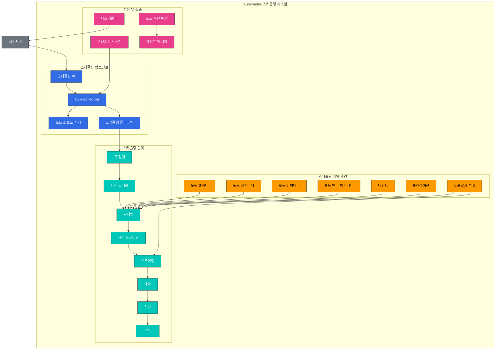

## 스케줄링 개념 비교

| 개념 | 목적 | 사용 사례 | Kubernetes 버전 |
|------|------|----------|----------------|
| **노드 셀렉터** | 특정 레이블이 있는 노드에 포드 배치 | 간단한 노드 선택 | 모든 버전 |
| **노드 어피니티** | 복잡한 노드 선택 규칙 정의 | 고급 노드 선택 | 1.6+ |
| **포드 어피니티** | 다른 포드와 가까이 배치 | 관련 서비스 공동 배치 | 1.6+ |
| **포드 안티-어피니티** | 다른 포드와 멀리 배치 | 고가용성 보장 | 1.6+ |
| **테인트와 톨러레이션** | 특정 포드만 노드에 배치 허용 | 전용 노드, 노드 격리 | 1.6+ |
| **토폴로지 분배 제약** | 토폴로지 도메인 간 포드 분산 | 가용 영역 간 분산 | 1.16+ (1.19에서 GA) |
| **우선순위 및 선점** | 중요 워크로드 우선 배치 | 중요 서비스 보장 | 1.8+ (1.11에서 GA) |
| **포드 중단 예산** | 동시에 중단되는 포드 수 제한 | 고가용성 보장 | 1.4+ (1.21에서 GA) |

## 스케줄링 기본 개념

> **핵심 개념**: Kubernetes 스케줄러는 포드를 실행할 최적의 노드를 선택하는 컨트롤 플레인 컴포넌트로, 필터링과 스코어링 두 단계로 작동합니다.

### 스케줄링 프로세스

1. **필터링 단계 (Predicates)**
   - 포드를 실행할 수 있는 적합한 노드 집합 식별
   - 리소스 요구사항, 노드 셀렉터, 어피니티 규칙, 테인트/톨러레이션 등 고려
   - 하나의 조건이라도 충족하지 못하면 노드 제외

2. **스코어링 단계 (Priorities)**
   - 필터링을 통과한 노드에 점수 부여
   - 리소스 사용률, 포드 간 분산, 어피니티 선호도 등 고려
   - 가장 높은 점수를 받은 노드 선택

3. **바인딩 단계**
   - 선택된 노드에 포드 할당
   - API 서버에 바인딩 정보 업데이트

## 목차
1. [스케줄링 개요](#스케줄링-개요)
2. [스케줄러 작동 방식](#스케줄러-작동-방식)
3. [노드 선택](#노드-선택)
4. [포드 어피니티와 안티-어피니티](#포드-어피니티와-안티-어피니티)
5. [테인트와 톨러레이션](#테인트와-톨러레이션)
6. [노드 어피니티](#노드-어피니티)
7. [포드 우선순위와 선점](#포드-우선순위와-선점)
8. [포드 축출](#포드-축출)
9. [포드 중단 예산(PDB)](#포드-중단-예산pdb)
10. [노드 압력 축출](#노드-압력-축출)
11. [토폴로지 분배 제약 조건(TopologySpreadConstraints)](#토폴로지-분배-제약-조건topologyspreadconstraints)
12. [Pod Deletion Cost](#pod-deletion-cost)
13. [Descheduler](#descheduler)
14. [Amazon EKS에서의 스케줄링 최적화](#amazon-eks에서의-스케줄링-최적화)
15. [스케줄링 모범 사례](#스케줄링-모범-사례)
16. [결론](#결론)

## 스케줄링 개요

Kubernetes 스케줄러는 포드를 적절한 노드에 배치하는 컨트롤 플레인 컴포넌트입니다. 스케줄러는 다양한 요소를 고려하여 포드를 배치할 최적의 노드를 결정합니다:

1. **리소스 요구 사항**: 포드가 요청한 CPU, 메모리 등의 리소스
2. **하드웨어/소프트웨어/정책 제약 조건**: 노드 셀렉터, 노드 어피니티, 테인트 등
3. **어피니티/안티-어피니티 명세**: 다른 포드와의 배치 관계
4. **데이터 지역성**: 데이터에 가까운 곳에 포드 배치
5. **워크로드 간 간섭**: 다양한 워크로드 간의 간섭 최소화
6. **데드라인**: 시간 제약이 있는 워크로드 고려

### 스케줄링 프로세스

스케줄링 프로세스는 크게 두 단계로 나뉩니다:

1. **필터링(Filtering)**: 포드를 실행할 수 있는 노드 집합을 식별
   - 리소스 요구 사항 충족 여부 확인
   - 노드 셀렉터, 어피니티, 테인트 등의 제약 조건 확인

2. **스코어링(Scoring)**: 필터링된 노드에 점수를 매겨 최적의 노드 선택
   - 리소스 사용률 균형
   - 포드 간 어피니티/안티-어피니티
   - 데이터 지역성
   - 테인트/톨러레이션

## 스케줄러 작동 방식

Kubernetes 스케줄러는 다음과 같은 과정으로 작동합니다:

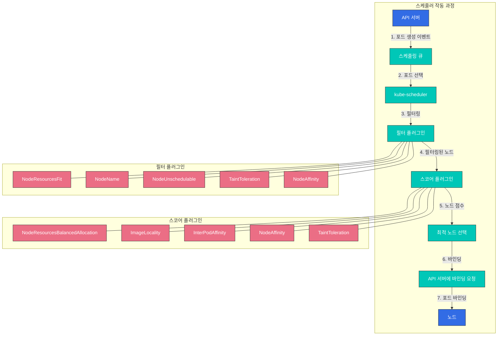

1. **포드 큐 감시**: 스케줄러는 API 서버를 감시하여 스케줄링되지 않은 포드를 찾습니다.
2. **노드 필터링**: 포드를 실행할 수 있는 노드 집합을 식별합니다.
3. **노드 스코어링**: 필터링된 노드에 점수를 매깁니다.
4. **노드 선택**: 가장 높은 점수를 받은 노드를 선택합니다.
5. **바인딩**: 선택된 노드에 포드를 바인딩합니다.

### 스케줄링 플러그인

Kubernetes 스케줄러는 플러그인 아키텍처를 사용하여 확장 가능하게 설계되었습니다. 다양한 플러그인이 스케줄링 프로세스의 여러 단계에서 작동합니다:

1. **필터 플러그인**: 포드를 실행할 수 없는 노드를 필터링
   - NodeResourcesFit: 노드의 리소스 용량 확인
   - NodeName: 포드의 nodeName 필드 확인
   - NodeUnschedulable: 노드의 스케줄 가능 여부 확인
   - TaintToleration: 테인트와 톨러레이션 확인

2. **스코어 플러그인**: 노드에 점수 부여
   - NodeResourcesBalancedAllocation: 리소스 사용 균형 고려
   - ImageLocality: 이미지 지역성 고려
   - InterPodAffinity: 포드 간 어피니티 고려
   - NodeAffinity: 노드 어피니티 고려

### 다중 스케줄러

Kubernetes는 여러 스케줄러를 동시에 실행할 수 있습니다. 이를 통해 특정 워크로드에 대해 사용자 정의 스케줄링 로직을 구현할 수 있습니다.

```yaml
apiVersion: v1
kind: Pod
metadata:
  name: custom-scheduled-pod
spec:
  schedulerName: my-custom-scheduler
  containers:
  - name: container
    image: nginx
```

위 예시에서 `schedulerName` 필드를 사용하여 포드를 스케줄링할 스케줄러를 지정합니다.

## 노드 선택

Kubernetes는 포드를 특정 노드에 배치하기 위한 여러 메커니즘을 제공합니다.

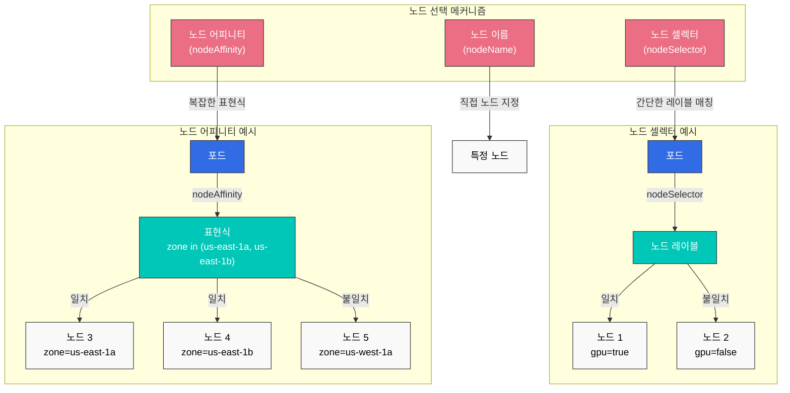

### 노드 셀렉터(Node Selector)

노드 셀렉터는 포드를 특정 레이블이 있는 노드에만 배치하도록 제한하는 가장 간단한 방법입니다.

```yaml
apiVersion: v1
kind: Pod
metadata:
  name: gpu-pod
spec:
  nodeSelector:
    gpu: "true"
  containers:
  - name: gpu-container
    image: nvidia/cuda
```

위 예시에서 포드는 `gpu=true` 레이블이 있는 노드에만 배치됩니다.

### nodeName

`nodeName` 필드를 사용하여 포드를 특정 노드에 직접 배치할 수 있습니다. 이 방법은 스케줄러를 우회하므로 일반적으로 권장되지 않습니다.

```yaml
apiVersion: v1
kind: Pod
metadata:
  name: specific-node-pod
spec:
  nodeName: worker-node-1
  containers:
  - name: container
    image: nginx
```

위 예시에서 포드는 `worker-node-1`이라는 이름의 노드에 직접 배치됩니다.

## 포드 어피니티와 안티-어피니티

포드 어피니티와 안티-어피니티는 포드 간의 관계를 기반으로 포드를 배치하는 방법을 제공합니다.

```mermaid
graph TD
    subgraph "포드 어피니티"
        PA["podAffinity"]
        PA -->|같은 노드/토폴로지에 배치| Together["함께 배치"]
        
        subgraph "어피니티 예시"
            WebPod["웹 포드<br>app=web"]
            CachePod["캐시 포드<br>app=cache"]
            WebPod -->|함께 배치| CachePod
            Node1["노드 1"] -->|포함| WebPod
            Node1 -->|포함| CachePod
        end
    end
    
    subgraph "포드 안티-어피니티"
        PAA["podAntiAffinity"]
        PAA -->|다른 노드/토폴로지에 배치| Apart["분리 배치"]
        
        subgraph "안티-어피니티 예시"
            WebPod1["웹 포드 1<br>app=web"]
            WebPod2["웹 포드 2<br>app=web"]
            WebPod1 -->|분리 배치| WebPod2
            Node2["노드 2"] -->|포함| WebPod1
            Node3["노드 3"] -->|포함| WebPod2
        end
    end
    
    subgraph "어피니티 유형"
        Required["requiredDuringSchedulingIgnoredDuringExecution<br>(하드 요구 사항)"]
        Preferred["preferredDuringSchedulingIgnoredDuringExecution<br>(소프트 요구 사항)"]
    end
    
    PA -->|유형| Required
    PA -->|유형| Preferred
    PAA -->|유형| Required
    PAA -->|유형| Preferred
    
    %% 스타일 정의
    classDef affinityType fill:#EB6E85,stroke:#333,stroke-width:1px,color:white;
    classDef affinityResult fill:#00C7B7,stroke:#333,stroke-width:1px,color:white;
    classDef k8sComponent fill:#326CE5,stroke:#333,stroke-width:1px,color:white;
    classDef nodeComponent fill:#f9f9f9,stroke:#333,stroke-width:1px,color:black;
    classDef affinityKind fill:#3B48CC,stroke:#333,stroke-width:1px,color:white;
    
    %% 클래스 적용
    class PA,PAA affinityType;
    class Together,Apart affinityResult;
    class WebPod,CachePod,WebPod1,WebPod2 k8sComponent;
    class Node1,Node2,Node3 nodeComponent;
    class Required,Preferred affinityKind;
```

### 포드 어피니티(Pod Affinity)

포드 어피니티는 특정 레이블을 가진 포드와 같은 노드 또는 토폴로지 도메인에 포드를 배치하도록 합니다.

```yaml
apiVersion: v1
kind: Pod
metadata:
  name: frontend
spec:
  affinity:
    podAffinity:
      requiredDuringSchedulingIgnoredDuringExecution:
      - labelSelector:
          matchExpressions:
          - key: app
            operator: In
            values:
            - cache
        topologyKey: kubernetes.io/hostname
  containers:
  - name: frontend
    image: nginx
```

위 예시에서 `frontend` 포드는 `app=cache` 레이블이 있는 포드와 같은 호스트에 배치됩니다.

### 포드 안티-어피니티(Pod Anti-Affinity)

포드 안티-어피니티는 특정 레이블을 가진 포드와 다른 노드 또는 토폴로지 도메인에 포드를 배치하도록 합니다.

```yaml
apiVersion: v1
kind: Pod
metadata:
  name: frontend
  labels:
    app: frontend
spec:
  affinity:
    podAntiAffinity:
      requiredDuringSchedulingIgnoredDuringExecution:
      - labelSelector:
          matchExpressions:
          - key: app
            operator: In
            values:
            - frontend
        topologyKey: kubernetes.io/hostname
  containers:
  - name: frontend
    image: nginx
```

위 예시에서 `frontend` 포드는 다른 `app=frontend` 레이블이 있는 포드와 다른 호스트에 배치됩니다. 이는 고가용성을 위해 같은 애플리케이션의 인스턴스를 여러 노드에 분산시키는 데 유용합니다.

### 어피니티 유형

포드 어피니티와 안티-어피니티는 두 가지 유형이 있습니다:

1. **requiredDuringSchedulingIgnoredDuringExecution**: 스케줄링 시 반드시 충족해야 하는 하드 요구 사항
2. **preferredDuringSchedulingIgnoredDuringExecution**: 가능하면 충족하는 것이 좋지만, 필수는 아닌 소프트 요구 사항

```yaml
# preferredDuringSchedulingIgnoredDuringExecution 예시
affinity:
  podAffinity:
    preferredDuringSchedulingIgnoredDuringExecution:
    - weight: 100
      podAffinityTerm:
        labelSelector:
          matchExpressions:
          - key: app
            operator: In
            values:
            - cache
        topologyKey: kubernetes.io/hostname
```

위 예시에서 `weight` 필드는 이 선호도의 가중치를 나타냅니다. 여러 선호도가 있을 경우 가중치가 높은 선호도가 더 중요하게 고려됩니다.

## 테인트와 톨러레이션

테인트(Taint)와 톨러레이션(Toleration)은 노드가 특정 포드를 거부할 수 있게 하는 메커니즘입니다.

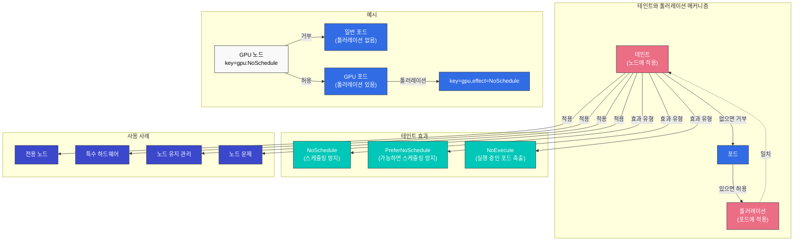

### 테인트(Taint)

테인트는 노드에 적용되어 포드가 해당 노드에 스케줄링되는 것을 제한합니다.

```bash
# 노드에 테인트 추가
kubectl taint nodes node1 key=value:NoSchedule
```

테인트 효과(Effect)는 세 가지가 있습니다:

1. **NoSchedule**: 톨러레이션이 없는 포드는 노드에 스케줄링되지 않음
2. **PreferNoSchedule**: 가능하면 톨러레이션이 없는 포드를 노드에 스케줄링하지 않음
3. **NoExecute**: 톨러레이션이 없는 포드는 노드에서 축출됨

### 톨러레이션(Toleration)

톨러레이션은 포드에 적용되어 테인트가 있는 노드에 스케줄링될 수 있게 합니다.

```yaml
apiVersion: v1
kind: Pod
metadata:
  name: nginx
spec:
  tolerations:
  - key: "key"
    operator: "Equal"
    value: "value"
    effect: "NoSchedule"
  containers:
  - name: nginx
    image: nginx
```

위 예시에서 포드는 `key=value:NoSchedule` 테인트가 있는 노드에 스케줄링될 수 있습니다.

### 사용 사례

테인트와 톨러레이션의 일반적인 사용 사례는 다음과 같습니다:

1. **전용 노드**: 특정 워크로드만 실행할 노드 지정
2. **특수 하드웨어**: GPU와 같은 특수 하드웨어가 있는 노드 관리
3. **노드 유지 관리**: 유지 관리 중인 노드에서 새 포드 스케줄링 방지
4. **노드 문제**: 문제가 있는 노드에서 포드 축출

### 기본 테인트

Kubernetes는 일부 노드에 기본 테인트를 적용합니다:

- **node.kubernetes.io/not-ready**: 노드가 준비되지 않음
- **node.kubernetes.io/unreachable**: 노드에 도달할 수 없음
- **node.kubernetes.io/memory-pressure**: 노드에 메모리 압력이 있음
- **node.kubernetes.io/disk-pressure**: 노드에 디스크 압력이 있음
- **node.kubernetes.io/pid-pressure**: 노드에 PID 압력이 있음
- **node.kubernetes.io/network-unavailable**: 노드의 네트워크가 사용 불가능함
- **node.kubernetes.io/unschedulable**: 노드가 스케줄 불가능함

## 노드 어피니티

노드 어피니티는 포드를 특정 노드 집합에 배치하는 보다 표현력이 풍부한 방법을 제공합니다. 노드 셀렉터보다 더 복잡한 조건을 지정할 수 있습니다.

### 노드 어피니티 유형

노드 어피니티는 두 가지 유형이 있습니다:

1. **requiredDuringSchedulingIgnoredDuringExecution**: 스케줄링 시 반드시 충족해야 하는 하드 요구 사항
2. **preferredDuringSchedulingIgnoredDuringExecution**: 가능하면 충족하는 것이 좋지만, 필수는 아닌 소프트 요구 사항

```yaml
apiVersion: v1
kind: Pod
metadata:
  name: with-node-affinity
spec:
  affinity:
    nodeAffinity:
      requiredDuringSchedulingIgnoredDuringExecution:
        nodeSelectorTerms:
        - matchExpressions:
          - key: kubernetes.io/e2e-az-name
            operator: In
            values:
            - e2e-az1
            - e2e-az2
      preferredDuringSchedulingIgnoredDuringExecution:
      - weight: 1
        preference:
          matchExpressions:
          - key: another-node-label-key
            operator: In
            values:
            - another-node-label-value
  containers:
  - name: with-node-affinity
    image: nginx
```

위 예시에서 포드는 `kubernetes.io/e2e-az-name` 레이블이 `e2e-az1` 또는 `e2e-az2`인 노드에만 배치됩니다. 또한 가능하면 `another-node-label-key=another-node-label-value` 레이블이 있는 노드에 배치됩니다.

### 연산자

노드 어피니티는 다양한 연산자를 지원합니다:

- **In**: 레이블 값이 지정된 값 중 하나와 일치
- **NotIn**: 레이블 값이 지정된 값과 일치하지 않음
- **Exists**: 지정된 키를 가진 레이블이 존재
- **DoesNotExist**: 지정된 키를 가진 레이블이 존재하지 않음
- **Gt**: 레이블 값이 지정된 값보다 큼
- **Lt**: 레이블 값이 지정된 값보다 작음
## 포드 우선순위와 선점

Kubernetes는 포드 우선순위와 선점(Preemption) 기능을 통해 중요한 워크로드가 클러스터 리소스를 확보할 수 있도록 합니다.

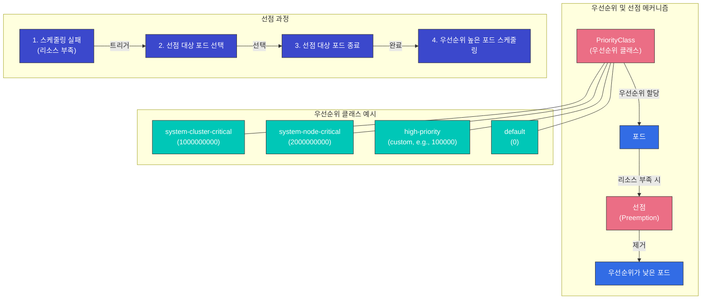

### 우선순위 클래스(PriorityClass)

우선순위 클래스는 포드의 상대적 중요도를 정의합니다. 우선순위 값이 높을수록 포드의 중요도가 높습니다.

```yaml
apiVersion: scheduling.k8s.io/v1
kind: PriorityClass
metadata:
  name: high-priority
value: 1000000
globalDefault: false
description: "이 우선순위 클래스는 중요한 워크로드에 사용해야 합니다."
```

위 예시에서 `value` 필드는 우선순위 값을 나타냅니다. 값이 클수록 우선순위가 높습니다. `globalDefault` 필드가 `true`로 설정되면, 우선순위 클래스가 지정되지 않은 포드에 이 우선순위 클래스가 적용됩니다.

### 포드에 우선순위 클래스 적용

포드에 우선순위 클래스를 적용하려면 `priorityClassName` 필드를 사용합니다.

```yaml
apiVersion: v1
kind: Pod
metadata:
  name: high-priority-pod
spec:
  priorityClassName: high-priority
  containers:
  - name: container
    image: nginx
```

### 선점(Preemption)

선점은 우선순위가 높은 포드를 스케줄링하기 위해 우선순위가 낮은 포드를 제거하는 과정입니다. 스케줄러가 우선순위가 높은 포드를 스케줄링할 노드를 찾지 못하면, 우선순위가 낮은 포드를 선점하여 리소스를 확보합니다.

선점 과정:
1. 스케줄러가 우선순위가 높은 포드를 스케줄링할 노드를 찾지 못함
2. 스케줄러가 우선순위가 낮은 포드를 선점하여 제거할 노드를 선택
3. 선택된 노드에서 우선순위가 낮은 포드에 종료 신호 전송
4. 포드가 정상적으로 종료되면 우선순위가 높은 포드를 해당 노드에 스케줄링

### 선점 고려 사항

선점을 사용할 때 고려해야 할 사항:

1. **그레이스풀 종료 기간**: 선점된 포드는 `terminationGracePeriodSeconds`에 지정된 시간 동안 정상 종료 과정을 거침
2. **PodDisruptionBudget**: 선점은 PodDisruptionBudget을 존중하지 않음
3. **시스템 우선순위 클래스**: Kubernetes는 시스템 컴포넌트를 위한 우선순위 클래스를 제공
   - `system-cluster-critical`: 클러스터 작동에 중요한 포드
   - `system-node-critical`: 노드 작동에 중요한 포드

## 포드 축출

포드 축출(Pod Eviction)은 노드 문제 발생 시 포드를 안전하게 이동시키는 과정입니다. 축출은 다양한 이유로 발생할 수 있습니다.

```mermaid
graph TD
    subgraph "축출 유형"
        ControllerEviction["kube-controller-manager<br>축출"]
        KubeletEviction["kubelet 축출"]
        UserEviction["사용자 축출"]
    end
    
    subgraph "축출 원인"
        NodeNotReady["노드 NotReady"]
        NodeUnreachable["노드 Unreachable"]
        ResourcePressure["리소스 부족<br>(메모리, 디스크 등)"]
        HardwareIssue["하드웨어 문제"]
        Maintenance["유지 관리"]
    end
    
    subgraph "kubelet 축출 신호"
        MemoryAvailable["memory.available"]
        NodefsAvailable["nodefs.available"]
        NodefsInodesFree["nodefs.inodesFree"]
        ImagefsAvailable["imagefs.available"]
        ImagefsInodesFree["imagefs.inodesFree"]
        PidAvailable["pid.available"]
    end
    
    ControllerEviction -->|원인| NodeNotReady
    ControllerEviction -->|원인| NodeUnreachable
    KubeletEviction -->|원인| ResourcePressure
    KubeletEviction -->|원인| HardwareIssue
    UserEviction -->|원인| Maintenance
    
    KubeletEviction -->|모니터링| MemoryAvailable
    KubeletEviction -->|모니터링| NodefsAvailable
    KubeletEviction -->|모니터링| NodefsInodesFree
    KubeletEviction -->|모니터링| ImagefsAvailable
    KubeletEviction -->|모니터링| ImagefsInodesFree
    KubeletEviction -->|모니터링| PidAvailable
    
    %% 스타일 정의
    classDef evictionType fill:#EB6E85,stroke:#333,stroke-width:1px,color:white;
    classDef evictionCause fill:#00C7B7,stroke:#333,stroke-width:1px,color:white;
    classDef evictionSignal fill:#3B48CC,stroke:#333,stroke-width:1px,color:white;
    
    %% 클래스 적용
    class ControllerEviction,KubeletEviction,UserEviction evictionType;
    class NodeNotReady,NodeUnreachable,ResourcePressure,HardwareIssue,Maintenance evictionCause;
    class MemoryAvailable,NodefsAvailable,NodefsInodesFree,ImagefsAvailable,ImagefsInodesFree,PidAvailable evictionSignal;
```

### 축출 유형

1. **kube-controller-manager에 의한 축출**:
   - 노드가 NotReady 상태로 `pod-eviction-timeout` 기간(기본 5분) 동안 유지될 때
   - 노드가 Unreachable 상태일 때

2. **kubelet에 의한 축출**:
   - 노드 리소스 부족(메모리, 디스크 등)
   - 하드웨어 문제

3. **사용자에 의한 축출**:
   - `kubectl drain` 명령 실행
   - 노드 유지 관리 작업

### kubelet 축출 신호

kubelet은 다음과 같은 축출 신호를 모니터링합니다:

1. **memory.available**: 사용 가능한 메모리
2. **nodefs.available**: 노드 파일 시스템의 사용 가능한 공간
3. **nodefs.inodesFree**: 노드 파일 시스템의 사용 가능한 inode
4. **imagefs.available**: 이미지 파일 시스템의 사용 가능한 공간
5. **imagefs.inodesFree**: 이미지 파일 시스템의 사용 가능한 inode
6. **pid.available**: 사용 가능한 프로세스 ID

각 신호에 대해 소프트 임계값과 하드 임계값을 설정할 수 있습니다:

- **소프트 임계값**: 임계값을 초과하면 `grace-period` 후에 포드 축출
- **하드 임계값**: 임계값을 초과하면 즉시 포드 축출

```yaml
# kubelet 구성 예시
evictionHard:
  memory.available: "100Mi"
  nodefs.available: "10%"
  nodefs.inodesFree: "5%"
  imagefs.available: "15%"
evictionSoft:
  memory.available: "200Mi"
  nodefs.available: "15%"
evictionSoftGracePeriod:
  memory.available: "1m"
  nodefs.available: "2m"
evictionPressureTransitionPeriod: "30s"
```

### 축출 우선순위

kubelet은 다음 순서로 포드를 축출합니다:

1. BestEffort QoS 클래스의 포드
2. Burstable QoS 클래스의 포드 (리소스 사용량이 요청량을 초과하는 포드부터)
3. Guaranteed QoS 클래스의 포드 (리소스 사용량이 요청량과 제한량이 동일한 포드)

## 포드 중단 예산(PDB)

포드 중단 예산(Pod Disruption Budget, PDB)은 자발적 중단 중에도 애플리케이션의 가용성을 유지하기 위한 방법입니다. PDB는 동시에 중단될 수 있는 포드의 수를 제한합니다.

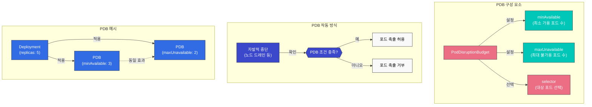

### PDB 정의

```yaml
apiVersion: policy/v1
kind: PodDisruptionBudget
metadata:
  name: frontend-pdb
spec:
  minAvailable: 2
  selector:
    matchLabels:
      app: frontend
```

또는

```yaml
apiVersion: policy/v1
kind: PodDisruptionBudget
metadata:
  name: frontend-pdb
spec:
  maxUnavailable: 1
  selector:
    matchLabels:
      app: frontend
```

위 예시에서:
- `minAvailable`: 항상 사용 가능해야 하는 최소 포드 수
- `maxUnavailable`: 동시에 사용 불가능할 수 있는 최대 포드 수
- `selector`: PDB가 적용될 포드를 선택하는 레이블 셀렉터

### PDB 작동 방식

1. 노드 드레인과 같은 자발적 중단이 발생하면, Kubernetes는 PDB를 확인
2. PDB 조건을 충족하면 포드 축출 진행
3. PDB 조건을 충족하지 않으면 포드 축출 거부

### PDB 모범 사례

1. **모든 중요한 워크로드에 PDB 설정**: 고가용성이 필요한 모든 워크로드에 PDB 설정
2. **적절한 값 선택**: 워크로드 특성에 맞는 `minAvailable` 또는 `maxUnavailable` 값 선택
3. **레플리카 수 고려**: PDB 값은 레플리카 수보다 작아야 함
4. **정기적인 테스트**: 노드 드레인 등의 작업으로 PDB 작동 테스트

## 노드 압력 축출

노드 압력 축출(Node Pressure Eviction)은 노드의 리소스 부족으로 인해 포드가 축출되는 메커니즘입니다.

### 노드 상태 조건

kubelet은 다음과 같은 노드 상태 조건을 보고합니다:

1. **MemoryPressure**: 노드의 메모리가 부족함
2. **DiskPressure**: 노드의 디스크 공간이 부족함
3. **PIDPressure**: 노드의 프로세스 ID가 부족함

이러한 조건이 발생하면 kubelet은 포드를 축출하여 리소스를 확보합니다.

### 축출 정책 구성

kubelet 구성에서 축출 정책을 설정할 수 있습니다:

```yaml
# kubelet 구성 예시
evictionHard:
  memory.available: "100Mi"
  nodefs.available: "10%"
  nodefs.inodesFree: "5%"
  imagefs.available: "15%"
evictionSoft:
  memory.available: "200Mi"
  nodefs.available: "15%"
evictionSoftGracePeriod:
  memory.available: "1m"
  nodefs.available: "2m"
evictionMinimumReclaim:
  memory.available: "50Mi"
  nodefs.available: "5%"
evictionPressureTransitionPeriod: "30s"
```

위 예시에서:
- `evictionMinimumReclaim`: 축출 후 최소한으로 확보해야 할 리소스 양
- `evictionPressureTransitionPeriod`: 압력 상태 전환 사이의 대기 시간

## 토폴로지 분배 제약 조건(TopologySpreadConstraints)

토폴로지 분배 제약 조건은 포드를 클러스터의 여러 토폴로지 도메인(노드, 영역, 리전 등)에 균등하게 분산시키는 기능입니다. 이는 고가용성을 보장하고 장애 도메인의 영향을 최소화하는 데 유용합니다.

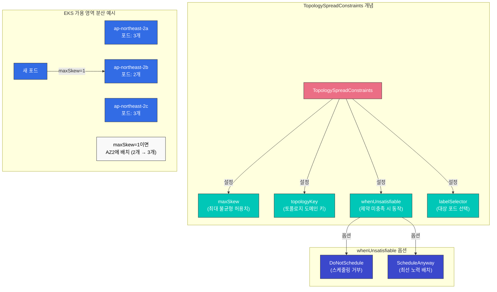

### 주요 필드 설명

| 필드 | 설명 | 필수 여부 |
|------|------|----------|
| **maxSkew** | 토폴로지 도메인 간 포드 수 차이의 최대 허용치 | 필수 |
| **topologyKey** | 토폴로지 도메인을 정의하는 노드 레이블 키 | 필수 |
| **whenUnsatisfiable** | 제약 조건을 충족할 수 없을 때 동작 (DoNotSchedule 또는 ScheduleAnyway) | 필수 |
| **labelSelector** | 분산 대상 포드를 선택하는 레이블 셀렉터 | 필수 |
| **minDomains** | 최소 토폴로지 도메인 수 (Kubernetes 1.25+) | 선택 |
| **matchLabelKeys** | 동일한 키의 레이블 값으로 그룹화 (Kubernetes 1.27+) | 선택 |
| **nodeAffinityPolicy** | 노드 어피니티/노드 셀렉터 고려 여부 (Kubernetes 1.26+) | 선택 |
| **nodeTaintsPolicy** | 노드 테인트 고려 여부 (Kubernetes 1.26+) | 선택 |

### EKS 가용 영역 분산 예제

```yaml
apiVersion: apps/v1
kind: Deployment
metadata:
  name: web-server
  namespace: production
spec:
  replicas: 6
  selector:
    matchLabels:
      app: web
  template:
    metadata:
      labels:
        app: web
    spec:
      topologySpreadConstraints:
      # 가용 영역 간 균등 분산 (하드 제약)
      - maxSkew: 1
        topologyKey: topology.kubernetes.io/zone
        whenUnsatisfiable: DoNotSchedule
        labelSelector:
          matchLabels:
            app: web
      # 노드 간 균등 분산 (소프트 제약)
      - maxSkew: 2
        topologyKey: kubernetes.io/hostname
        whenUnsatisfiable: ScheduleAnyway
        labelSelector:
          matchLabels:
            app: web
      containers:
      - name: web
        image: nginx:1.24
        resources:
          requests:
            cpu: 100m
            memory: 128Mi
```

### minDomains 사용 (Kubernetes 1.25+)

`minDomains`는 최소 도메인 수를 지정하여, 도메인 수가 이 값보다 적을 때 스케줄링 동작을 제어합니다.

```yaml
apiVersion: apps/v1
kind: Deployment
metadata:
  name: zone-spread-app
spec:
  replicas: 3
  selector:
    matchLabels:
      app: zone-spread
  template:
    metadata:
      labels:
        app: zone-spread
    spec:
      topologySpreadConstraints:
      - maxSkew: 1
        topologyKey: topology.kubernetes.io/zone
        whenUnsatisfiable: DoNotSchedule
        minDomains: 3  # 최소 3개 영역에 분산 필요
        labelSelector:
          matchLabels:
            app: zone-spread
      containers:
      - name: app
        image: nginx
```

### matchLabelKeys 사용 (Kubernetes 1.27+)

`matchLabelKeys`는 동일한 키의 레이블 값을 공유하는 포드끼리만 분산을 계산합니다. 이는 롤링 업데이트 시 새 버전과 이전 버전의 포드를 별도로 분산시키는 데 유용합니다.

```yaml
apiVersion: apps/v1
kind: Deployment
metadata:
  name: rolling-update-app
spec:
  replicas: 6
  selector:
    matchLabels:
      app: myapp
  template:
    metadata:
      labels:
        app: myapp
    spec:
      topologySpreadConstraints:
      - maxSkew: 1
        topologyKey: topology.kubernetes.io/zone
        whenUnsatisfiable: DoNotSchedule
        labelSelector:
          matchLabels:
            app: myapp
        matchLabelKeys:
        - pod-template-hash  # 같은 ReplicaSet의 포드끼리만 분산 계산
      containers:
      - name: app
        image: myapp:v2
```

### Pod Anti-Affinity 대비 장점

| 특성 | TopologySpreadConstraints | Pod Anti-Affinity |
|------|--------------------------|-------------------|
| **분산 수준** | 균등 분산 (maxSkew로 제어) | 완전 분리 또는 없음 |
| **유연성** | 높음 (허용 편차 지정 가능) | 낮음 (all-or-nothing) |
| **스케일링** | 확장 시에도 균등 분산 유지 | 노드 수에 제한됨 |
| **성능** | 효율적 | 포드 수 증가 시 성능 저하 |
| **권장 사용** | 일반적인 고가용성 배포 | 동일 노드 배치 완전 금지 시 |

```yaml
# Anti-Affinity: 동일 노드에 절대 배치 불가 (레플리카 수 = 노드 수로 제한)
affinity:
  podAntiAffinity:
    requiredDuringSchedulingIgnoredDuringExecution:
    - labelSelector:
        matchLabels:
          app: web
      topologyKey: kubernetes.io/hostname

# TopologySpreadConstraints: 균등 분산 (더 유연함)
topologySpreadConstraints:
- maxSkew: 1
  topologyKey: kubernetes.io/hostname
  whenUnsatisfiable: DoNotSchedule
  labelSelector:
    matchLabels:
      app: web
```

## Pod Deletion Cost

Pod Deletion Cost는 HPA(Horizontal Pod Autoscaler)가 스케일다운 시 어떤 포드를 먼저 제거할지 결정하는 데 사용되는 어노테이션입니다. 낮은 비용의 포드가 먼저 제거됩니다.

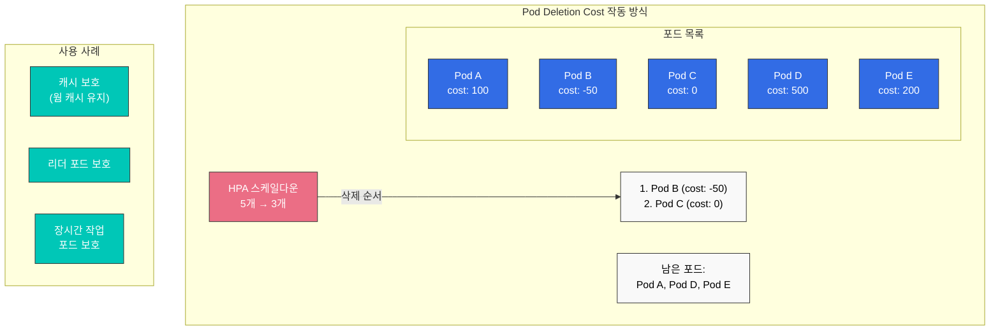

### 어노테이션 형식

```yaml
metadata:
  annotations:
    controller.kubernetes.io/pod-deletion-cost: "100"
```

- **값 범위**: -2147483648 ~ 2147483647 (32비트 정수)
- **기본값**: 0 (어노테이션이 없는 경우)
- **동작**: 낮은 값의 포드가 먼저 삭제됨

### 캐시 보호 패턴

캐시가 충분히 워밍업된 포드를 보호하여 스케일다운 시에도 캐시 히트율을 유지합니다.

```yaml
apiVersion: apps/v1
kind: Deployment
metadata:
  name: cache-service
spec:
  replicas: 5
  selector:
    matchLabels:
      app: cache-service
  template:
    metadata:
      labels:
        app: cache-service
    spec:
      containers:
      - name: cache
        image: redis:7
        lifecycle:
          postStart:
            exec:
              command:
              - /bin/sh
              - -c
              - |
                # 시작 시 낮은 비용 설정
                sleep 10
        # 캐시 워밍업 완료 후 사이드카가 비용 증가
      - name: cost-updater
        image: bitnami/kubectl:latest
        command:
        - /bin/sh
        - -c
        - |
          # 5분 후 캐시 워밍업 완료로 간주하고 비용 증가
          sleep 300
          kubectl annotate pod $POD_NAME \
            controller.kubernetes.io/pod-deletion-cost=1000 \
            --overwrite
          # 이후 주기적으로 캐시 히트율에 따라 비용 조정
          while true; do
            sleep 60
            HIT_RATE=$(redis-cli INFO stats | grep keyspace_hits)
            # 캐시 히트율에 따라 비용 동적 조정 로직
          done
        env:
        - name: POD_NAME
          valueFrom:
            fieldRef:
              fieldPath: metadata.name
```

### 장시간 작업 보호 패턴

```yaml
apiVersion: batch/v1
kind: Job
metadata:
  name: long-running-task
spec:
  template:
    metadata:
      annotations:
        # 작업 진행 중인 포드 보호
        controller.kubernetes.io/pod-deletion-cost: "10000"
    spec:
      containers:
      - name: worker
        image: worker:latest
        command: ["./process-large-dataset.sh"]
      restartPolicy: Never
```

### HPA와 함께 사용

```yaml
apiVersion: autoscaling/v2
kind: HorizontalPodAutoscaler
metadata:
  name: cache-hpa
spec:
  scaleTargetRef:
    apiVersion: apps/v1
    kind: Deployment
    name: cache-service
  minReplicas: 2
  maxReplicas: 10
  metrics:
  - type: Resource
    resource:
      name: cpu
      target:
        type: Utilization
        averageUtilization: 70
  behavior:
    scaleDown:
      stabilizationWindowSeconds: 300
      policies:
      - type: Pods
        value: 1
        periodSeconds: 60
      # Pod Deletion Cost가 자동으로 고려됨
```

## Descheduler

Descheduler는 실행 중인 클러스터에서 포드를 재분산시키는 도구입니다. 스케줄러는 새 포드를 배치할 때만 동작하지만, Descheduler는 이미 실행 중인 포드를 축출하여 더 나은 분산을 달성할 수 있습니다.

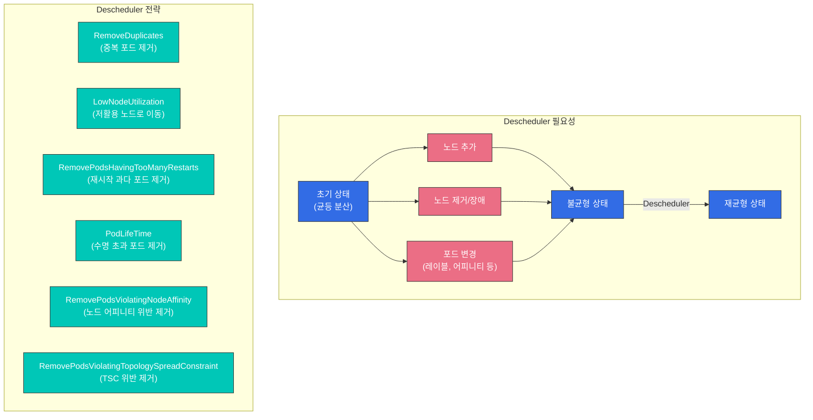

### Helm을 사용한 설치

```bash
# Helm 저장소 추가
helm repo add descheduler https://kubernetes-sigs.github.io/descheduler/

# 기본 설치
helm install descheduler descheduler/descheduler \
  --namespace kube-system \
  --set cronJobApiVersion="batch/v1"

# 커스텀 설정으로 설치
helm install descheduler descheduler/descheduler \
  --namespace kube-system \
  --values descheduler-values.yaml
```

### DeschedulerPolicy 설정

```yaml
apiVersion: "descheduler/v1alpha2"
kind: "DeschedulerPolicy"
profiles:
- name: default
  pluginConfig:
  # 동일한 노드에 같은 ReplicaSet/Deployment의 포드가 2개 이상 있으면 제거
  - name: RemoveDuplicates
    args:
      excludeOwnerKinds:
      - StatefulSet

  # 저활용 노드에서 고활용 노드로 포드 이동
  - name: LowNodeUtilization
    args:
      thresholds:
        cpu: 20
        memory: 20
        pods: 20
      targetThresholds:
        cpu: 50
        memory: 50
        pods: 50

  # 재시작 횟수가 많은 포드 제거
  - name: RemovePodsHavingTooManyRestarts
    args:
      podRestartThreshold: 100
      includingInitContainers: true

  # 특정 시간 이상 실행된 포드 제거
  - name: PodLifeTime
    args:
      maxPodLifeTimeSeconds: 86400  # 24시간
      labelSelector:
        matchLabels:
          app.kubernetes.io/lifecycle: ephemeral

  # 노드 어피니티 규칙을 위반하는 포드 제거
  - name: RemovePodsViolatingNodeAffinity
    args:
      nodeAffinityType:
      - requiredDuringSchedulingIgnoredDuringExecution

  # TopologySpreadConstraints 위반 포드 제거
  - name: RemovePodsViolatingTopologySpreadConstraint
    args:
      constraints:
      - DoNotSchedule

  plugins:
    balance:
      enabled:
      - RemoveDuplicates
      - LowNodeUtilization
      - RemovePodsViolatingTopologySpreadConstraint
    deschedule:
      enabled:
      - RemovePodsHavingTooManyRestarts
      - PodLifeTime
      - RemovePodsViolatingNodeAffinity
```

### Descheduler CronJob 설정

```yaml
apiVersion: batch/v1
kind: CronJob
metadata:
  name: descheduler
  namespace: kube-system
spec:
  schedule: "*/30 * * * *"  # 30분마다 실행
  concurrencyPolicy: Forbid
  jobTemplate:
    spec:
      template:
        spec:
          serviceAccountName: descheduler
          containers:
          - name: descheduler
            image: registry.k8s.io/descheduler/descheduler:v0.28.0
            args:
            - --policy-config-file=/policy-dir/policy.yaml
            - --v=3
            volumeMounts:
            - name: policy-volume
              mountPath: /policy-dir
          restartPolicy: Never
          volumes:
          - name: policy-volume
            configMap:
              name: descheduler-policy
```

### PDB 존중

Descheduler는 기본적으로 PodDisruptionBudget(PDB)을 존중합니다. PDB가 설정된 포드는 PDB 제한 내에서만 축출됩니다.

```yaml
# PDB 설정 예시
apiVersion: policy/v1
kind: PodDisruptionBudget
metadata:
  name: web-pdb
spec:
  minAvailable: 2
  selector:
    matchLabels:
      app: web
---
# Descheduler가 이 PDB를 존중하여
# 최소 2개의 web 포드가 항상 유지됨
```

### 주의사항

1. **시스템 포드 보호**: kube-system 네임스페이스의 포드는 기본적으로 제외됩니다.
2. **DaemonSet 포드**: DaemonSet 포드는 축출되지 않습니다.
3. **로컬 스토리지**: 로컬 스토리지를 사용하는 포드는 기본적으로 축출되지 않습니다.
4. **PDB 제한**: PDB 제한을 초과하여 포드를 축출하지 않습니다.

> 📚 **심화 학습**: 커스텀 스케줄러에 대한 자세한 내용은 다음을 참조하세요:
> - [Custom Scheduler Part 1: 기본 개념](../scheduling/01-custom-scheduler-part1.md)
> - [Custom Scheduler Part 2: 구현](../scheduling/02-custom-scheduler-part2.md)
> - [Custom Scheduler Part 3: 고급 기능](../scheduling/03-custom-scheduler-part3.md)

## Amazon EKS에서의 스케줄링 최적화

Amazon EKS에서는 Kubernetes 스케줄링 기능을 활용하여 워크로드를 최적화할 수 있습니다.

```mermaid
graph TD
    subgraph "EKS 스케줄링 최적화"
        NodeGroups["노드 그룹 및<br>인스턴스 유형"]
        AZSpread["가용 영역 분산"]
        Karpenter["Karpenter<br>자동 스케일링"]
        ResourceOpt["리소스 요청 및<br>제한 최적화"]
    end
    
    subgraph "노드 그룹 전략"
        ComputeOpt["컴퓨팅 최적화<br>인스턴스"]
        MemoryOpt["메모리 최적화<br>인스턴스"]
        SpotInst["스팟 인스턴스"]
        GPUInst["GPU 인스턴스"]
    end
    
    subgraph "가용성 전략"
        PodAntiAffinity["포드 안티-어피니티"]
        TopologySpread["토폴로지 스프레드<br>제약 조건"]
        MultiAZ["다중 가용 영역<br>배포"]
    end
    
    subgraph "자동화 도구"
        VPA["Vertical Pod<br>Autoscaler"]
        HPA["Horizontal Pod<br>Autoscaler"]
        CA["Cluster<br>Autoscaler"]
        KarpenterProv["Karpenter<br>Provisioner"]
    end
    
    NodeGroups -->|유형| ComputeOpt
    NodeGroups -->|유형| MemoryOpt
    NodeGroups -->|유형| SpotInst
    NodeGroups -->|유형| GPUInst
    
    AZSpread -->|방법| PodAntiAffinity
    AZSpread -->|방법| TopologySpread
    AZSpread -->|결과| MultiAZ
    
    Karpenter -->|사용| KarpenterProv
    ResourceOpt -->|도구| VPA
    ResourceOpt -->|도구| HPA
    NodeGroups -->|도구| CA
    
    %% 스타일 정의
    classDef eksComponent fill:#FF9900,stroke:#333,stroke-width:1px,color:black;
    classDef strategyComponent fill:#EB6E85,stroke:#333,stroke-width:1px,color:white;
    classDef instanceType fill:#00C7B7,stroke:#333,stroke-width:1px,color:white;
    classDef availabilityStrategy fill:#326CE5,stroke:#333,stroke-width:1px,color:white;
    classDef autoTool fill:#3B48CC,stroke:#333,stroke-width:1px,color:white;
    
    %% 클래스 적용
    class NodeGroups,AZSpread,Karpenter,ResourceOpt eksComponent;
    class ComputeOpt,MemoryOpt,SpotInst,GPUInst strategyComponent;
    class PodAntiAffinity,TopologySpread,MultiAZ availabilityStrategy;
    class VPA,HPA,CA,KarpenterProv autoTool;
```

### 노드 그룹 및 인스턴스 유형

EKS에서는 다양한 노드 그룹과 인스턴스 유형을 활용하여 워크로드에 맞는 리소스를 제공할 수 있습니다:

1. **다양한 인스턴스 유형**: 컴퓨팅 최적화, 메모리 최적화, 스토리지 최적화 등
2. **스팟 인스턴스**: 비용 효율적인 워크로드를 위한 스팟 인스턴스
3. **GPU 인스턴스**: AI/ML 워크로드를 위한 GPU 인스턴스

노드 레이블과 테인트를 사용하여 특정 워크로드를 특정 노드 그룹에 배치할 수 있습니다:

```bash
# 노드 그룹 생성 시 레이블 및 테인트 설정
eksctl create nodegroup \
  --cluster my-cluster \
  --name gpu-nodes \
  --node-labels="workload-type=gpu" \
  --node-type=p3.2xlarge \
  --taints="gpu=true:NoSchedule"
```

### 가용 영역 분산

EKS에서는 포드 안티-어피니티와 토폴로지 스프레드 제약 조건을 사용하여 워크로드를 여러 가용 영역에 분산시킬 수 있습니다:

```yaml
apiVersion: apps/v1
kind: Deployment
metadata:
  name: web-server
spec:
  replicas: 3
  selector:
    matchLabels:
      app: web
  template:
    metadata:
      labels:
        app: web
    spec:
      topologySpreadConstraints:
      - maxSkew: 1
        topologyKey: topology.kubernetes.io/zone
        whenUnsatisfiable: DoNotSchedule
        labelSelector:
          matchLabels:
            app: web
      containers:
      - name: web
        image: nginx
```

위 예시에서 `topologySpreadConstraints`는 포드를 여러 가용 영역에 균등하게 분산시킵니다.

### Karpenter를 사용한 자동 스케일링

Amazon EKS에서는 Karpenter를 사용하여 워크로드에 맞는 노드를 자동으로 프로비저닝할 수 있습니다:

```yaml
apiVersion: karpenter.sh/v1
kind: NodePool
metadata:
  name: default
spec:
  template:
    spec:
      requirements:
        - key: karpenter.sh/capacity-type
          operator: In
          values: ["spot", "on-demand"]
        - key: kubernetes.io/arch
          operator: In
          values: ["amd64", "arm64"]
      nodeClassRef:
        name: default-class
  limits:
    cpu: 1000
    memory: 1000Gi
  disruption:
    consolidationPolicy: WhenEmpty
    consolidateAfter: 30s
---
apiVersion: karpenter.k8s.aws/v1
kind: EC2NodeClass
metadata:
  name: default-class
spec:
  subnetSelector:
    karpenter.sh/discovery: my-cluster
  securityGroupSelector:
    karpenter.sh/discovery: my-cluster
```

Karpenter는 포드의 리소스 요구 사항에 맞는 최적의 인스턴스 유형을 선택하여 비용을 최적화합니다.

### 리소스 요청 및 제한 최적화

EKS에서 워크로드의 리소스 요청과 제한을 최적화하는 것이 중요합니다:

1. **Vertical Pod Autoscaler(VPA)**: 워크로드의 실제 리소스 사용량을 기반으로 리소스 요청 최적화
2. **Goldilocks**: VPA 권장 사항을 시각화하여 리소스 요청 최적화 지원
3. **리소스 쿼터**: 네임스페이스별 리소스 사용량 제한

```yaml
# VPA 예시
apiVersion: autoscaling.k8s.io/v1
kind: VerticalPodAutoscaler
metadata:
  name: frontend-vpa
spec:
  targetRef:
    apiVersion: apps/v1
    kind: Deployment
    name: frontend
  updatePolicy:
    updateMode: "Auto"
```

## 스케줄링 모범 사례

Kubernetes 및 EKS에서 스케줄링을 최적화하기 위한 모범 사례:

1. **적절한 리소스 요청 및 제한 설정**:
   - 워크로드의 실제 리소스 사용량을 기반으로 리소스 요청 설정
   - 중요한 워크로드에 적절한 리소스 제한 설정
   - VPA를 사용하여 리소스 요청 자동 최적화

2. **워크로드 분산**:
   - 포드 안티-어피니티를 사용하여 중요한 워크로드를 여러 노드에 분산
   - 토폴로지 스프레드 제약 조건을 사용하여 워크로드를 여러 가용 영역에 분산
   - 노드 어피니티를 사용하여 특정 워크로드를 특정 노드에 배치

3. **노드 리소스 최적화**:
   - 다양한 인스턴스 유형을 사용하여 워크로드에 맞는 리소스 제공
   - 스팟 인스턴스를 사용하여 비용 최적화
   - Karpenter를 사용하여 워크로드에 맞는 노드 자동 프로비저닝

4. **PDB 설정**:
   - 중요한 워크로드에 PDB 설정
   - 워크로드 특성에 맞는 `minAvailable` 또는 `maxUnavailable` 값 선택
   - 정기적으로 PDB 작동 테스트

5. **우선순위 및 선점 설정**:
   - 중요한 워크로드에 높은 우선순위 클래스 설정
   - 시스템 컴포넌트에 `system-cluster-critical` 또는 `system-node-critical` 우선순위 클래스 사용
   - 선점 영향 이해 및 테스트

6. **노드 테인트 및 톨러레이션**:
   - 특수 워크로드를 위한 전용 노드 설정
   - 유지 관리 중인 노드에 테인트 적용
   - 적절한 톨러레이션 설정

## 결론

Kubernetes의 스케줄링, 선점 및 축출 메커니즘은 클러스터 리소스를 효율적으로 관리하고 워크로드의 가용성을 유지하는 데 중요한 역할을 합니다. 이러한 기능을 이해하고 활용함으로써 Amazon EKS 클러스터에서 워크로드를 최적화하고 안정적으로 운영할 수 있습니다.

스케줄링 최적화는 지속적인 과정이며, 워크로드 특성과 클러스터 상태에 따라 지속적으로 조정해야 합니다. 모니터링 도구를 활용하여 클러스터 리소스 사용량을 추적하고, 필요에 따라 스케줄링 정책을 조정하는 것이 중요합니다.

## 퀴즈

이 장에서 배운 내용을 테스트하려면 [스케줄링, 선점 및 축출 퀴즈](../quizzes/core/08-scheduling-preemption-eviction-quiz.md)를 풀어보세요.
