# Kubernetes 클러스터 관리

> **버전 정보**: Kubernetes 1.34 - 1.36 (2026년 9월 11일 EKS 표준 지원 기준)
> **마지막 업데이트**: 2026년 2월 11일

Kubernetes 클러스터 관리는 클러스터의 설정, 유지 관리, 모니터링, 문제 해결 및 업그레이드를 포함하는 중요한 작업입니다. 이 장에서는 Kubernetes 클러스터 관리의 다양한 측면과 Amazon EKS에서의 클러스터 관리 모범 사례에 대해 알아보겠습니다.

자체 관리형 kubeadm 작업과 EKS 서비스 작업은 구분해야 합니다. EKS는 컨트롤 플레인 호스트, 정적 파드 매니페스트, etcd 직접 접근을 제공하지 않습니다. 아래 블록은 연속 실행하는 단일 스크립트가 아닌 별도 예시입니다. 실제 클러스터 버전의 업스트림 지원과 애드온 호환성을 확인하세요.

## 핵심 개념

- **클러스터 수명 주기 관리**: 클러스터 생성부터 폐기까지의 전체 과정
- **컨트롤 플레인 관리**: API 서버, 스케줄러, 컨트롤러 관리자 등의 핵심 구성 요소 관리
- **노드 관리**: 워커 노드의 추가, 제거, 유지 관리
- **리소스 할당**: CPU, 메모리, 스토리지 등의 리소스 할당 및 제한 설정
- **업그레이드 전략**: 다운타임 최소화를 위한 클러스터 및 애플리케이션 업그레이드 전략

## 목차
1. [클러스터 관리 개요](#클러스터-관리-개요)
2. [클러스터 구성요소 관리](#클러스터-구성요소-관리)
3. [리소스 관리](#리소스-관리)
4. [클러스터 네트워킹](#클러스터-네트워킹)
5. [인증 및 권한 관리](#인증-및-권한-관리)
6. [클러스터 업그레이드](#클러스터-업그레이드)
7. [백업 및 복구](#백업-및-복구)
8. [모니터링 및 로깅](#모니터링-및-로깅)
9. [문제 해결](#문제-해결)
10. [Amazon EKS 클러스터 관리](#amazon-eks-클러스터-관리)
11. [클러스터 관리 모범 사례](#클러스터-관리-모범-사례)
12. [결론](#결론)

## 환경 설정

클러스터 관리를 위해 다음 도구들이 필요합니다:

[공식 kubectl 설치 문서](https://kubernetes.io/docs/tasks/tools/install-kubectl-linux/)를 사용하고 API 서버와 마이너 버전 차이를 1 이내로 유지하세요. 자체 관리형 클러스터의 kubeadm/kubelet은 대상 마이너 버전의 `pkgs.k8s.io` 저장소에서 설치합니다. 이전 `1.x.y-00` 패키지 예시는 더 이상 유효하지 않으며 저장소에서 정확한 패키지 버전을 선택해야 합니다.

Helm과 k9s는 [Helm 공식 설치 지침](https://helm.sh/docs/intro/install/)과 [k9s 릴리스](https://github.com/derailed/k9s/releases)에서 아키텍처·체크섬을 확인해 설치하세요. EKS에는 인증된 AWS CLI와 호환되는 eksctl도 필요합니다.

```bash
kubectl version --client
helm version
k9s version
# 대상 마이너 저장소를 구성한 자체 관리형 노드에서만 확인:
apt-cache madison kubeadm
```


## 클러스터 관리 개요

Kubernetes 클러스터 관리는 클러스터의 전체 수명 주기를 관리하는 과정입니다. 이는 다음과 같은 주요 영역을 포함합니다:

1. **클러스터 설정 및 구성**: 클러스터 생성, 노드 추가, 네트워킹 설정, 스토리지 구성 등
2. **운영 관리**: 리소스 모니터링, 성능 최적화, 용량 계획, 문제 해결
3. **보안 관리**: 인증, 권한 부여, 네트워크 정책, 보안 컨텍스트 등
4. **업그레이드 및 패치**: 클러스터 버전 업그레이드, 보안 패치 적용
5. **백업 및 복구**: 클러스터 데이터 백업, 재해 복구 계획

다음 다이어그램은 Kubernetes 클러스터 관리의 주요 영역과 관련 도구를 보여줍니다:

## 클러스터 구성요소 관리

Kubernetes 클러스터는 컨트롤 플레인 구성요소와 노드 구성요소로 구성됩니다. 각 구성요소의 관리는 클러스터의 안정성과 성능에 중요합니다.

### 컨트롤 플레인 구성요소 관리

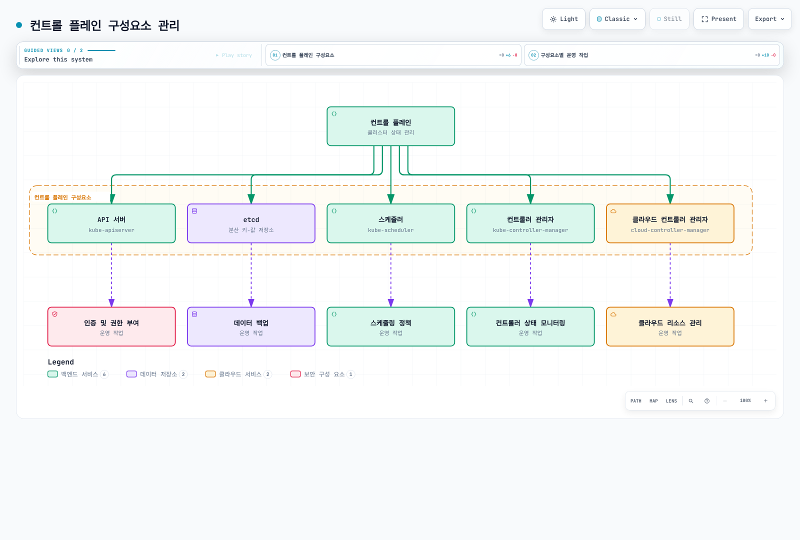

[🔍 인터랙티브 다이어그램 보기](https://www.atomai.click/kubernetes-docs/archmaps/ko-core-09-cluster-administration-0.html)

#### API 서버 관리

API 서버는 Kubernetes API를 노출하는 컨트롤 플레인의 핵심 구성요소입니다.

```bash
# API 서버 로그 확인
kubectl logs -n kube-system kube-apiserver-<master-node-name>

# API 서버 구성 확인 (kubeadm 클러스터)
sudo cat /etc/kubernetes/manifests/kube-apiserver.yaml

# API 서버 상태 확인
kubectl get --raw='/readyz?verbose'
```

#### etcd 관리

etcd는 Kubernetes API 상태를 저장하는 분산 키-값 저장소입니다.

```bash
# etcd 백업
ETCDCTL_API=3 etcdctl --endpoints=https://127.0.0.1:2379 \
  --cacert=/etc/kubernetes/pki/etcd/ca.crt \
  --cert=/etc/kubernetes/pki/etcd/server.crt \
  --key=/etc/kubernetes/pki/etcd/server.key \
  snapshot save /backup/etcd-snapshot-$(date +%Y-%m-%d).db

# etcd 상태 확인
ETCDCTL_API=3 etcdctl --endpoints=https://127.0.0.1:2379 \
  --cacert=/etc/kubernetes/pki/etcd/ca.crt \
  --cert=/etc/kubernetes/pki/etcd/server.crt \
  --key=/etc/kubernetes/pki/etcd/server.key \
  endpoint health
```

### 노드 관리

노드는 컨테이너화된 애플리케이션을 실행하는 워커 머신입니다.

```bash
# 노드 목록 확인
kubectl get nodes

# 노드 상세 정보 확인
kubectl describe node <node-name>

# 노드 라벨 추가
kubectl label node <node-name> environment=production

# 노드 유지보수 모드 설정
kubectl drain <node-name> --ignore-daemonsets

# 유지보수 후 노드 복귀
kubectl uncordon <node-name>
```

### 구성요소 상태 모니터링

```bash
# 컨트롤 플레인 구성요소 상태 확인
kubectl get --raw='/readyz?verbose'

# 시스템 파드 상태 확인
kubectl get pods -n kube-system

# 노드 리소스 사용량 확인
kubectl top nodes
```

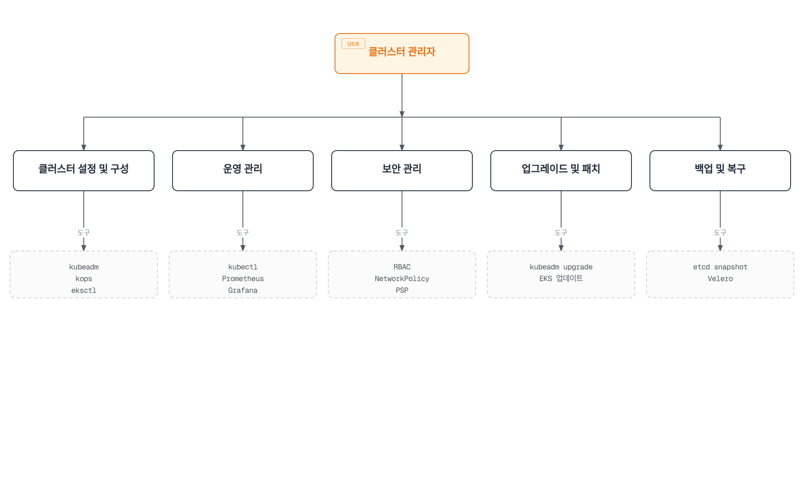

[🔍 인터랙티브 다이어그램 보기](https://www.atomai.click/kubernetes-docs/archmaps/ko-core-09-cluster-administration-1.html)

### 클러스터 관리 도구

Kubernetes 클러스터 관리를 위한 다양한 도구가 있습니다:

1. **kubectl**: Kubernetes 클러스터와 상호 작용하기 위한 명령줄 도구
2. **kubeadm**: Kubernetes 클러스터 생성 및 관리를 위한 도구
3. **kops**: Kubernetes 클러스터 생성, 업그레이드, 관리를 위한 도구
4. **eksctl**: Amazon EKS 클러스터 생성 및 관리를 위한 도구
5. **Helm**: Kubernetes 애플리케이션 패키지 관리자
6. **Headlamp**: Kubernetes 웹 UI (기존 Kubernetes Dashboard 프로젝트는 보관 상태)
7. **Prometheus & Grafana**: 모니터링 및 알림 도구
8. **Fluentd & Elasticsearch**: 로깅 도구

## 클러스터 구성요소 관리

Kubernetes 클러스터는 여러 구성요소로 이루어져 있으며, 이러한 구성요소를 효과적으로 관리하는 것이 중요합니다.

### 컨트롤 플레인 구성요소

컨트롤 플레인 구성요소는 클러스터의 전반적인 상태를 관리합니다:

1. **kube-apiserver**: Kubernetes API를 노출하는 컴포넌트
2. **etcd**: 클러스터 데이터를 저장하는 키-값 저장소
3. **kube-scheduler**: 포드를 노드에 스케줄링하는 컴포넌트
4. **kube-controller-manager**: 컨트롤러를 실행하는 컴포넌트
5. **cloud-controller-manager**: 클라우드 제공업체와 상호 작용하는 컴포넌트

다음 다이어그램은 Kubernetes 컨트롤 플레인 구성요소와 그 상호작용을 보여줍니다:

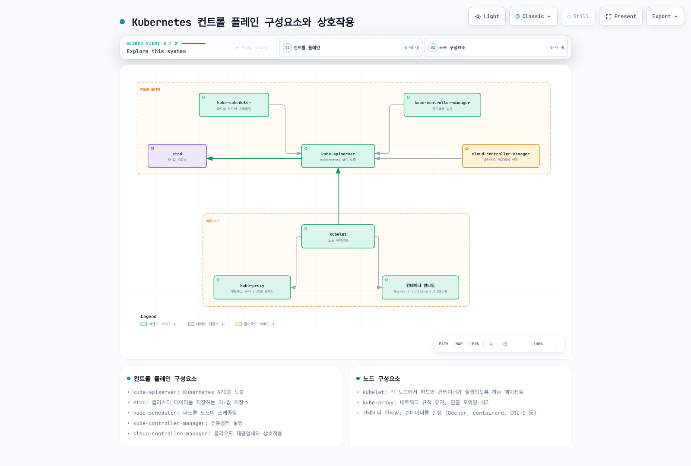

[🔍 인터랙티브 다이어그램 보기](https://www.atomai.click/kubernetes-docs/archmaps/ko-core-09-cluster-administration-2.html)

#### 컨트롤 플레인 구성요소 모니터링

컨트롤 플레인 구성요소의 상태를 모니터링하는 것이 중요합니다:

```bash
# 컨트롤 플레인 구성요소 상태 확인
kubectl get --raw='/readyz?verbose'

# API 서버 로그 확인
kubectl logs -n kube-system kube-apiserver-<node-name>

# etcd 상태 확인
kubectl exec -n kube-system etcd-<node-name> -- etcdctl \
  --endpoints=https://127.0.0.1:2379 \
  --cacert=/etc/kubernetes/pki/etcd/ca.crt \
  --cert=/etc/kubernetes/pki/etcd/healthcheck-client.crt \
  --key=/etc/kubernetes/pki/etcd/healthcheck-client.key endpoint health
```

#### 컨트롤 플레인 구성요소 구성

아래 매니페스트는 플래그·구성 일부입니다. 호스트 네트워크, 인증서 마운트와 기타 kubeadm 생성 설정을 생략했으므로 실행 중인 컨트롤 플레인 매니페스트를 이것으로 대체하지 마세요. 이미지는 클러스터 업그레이드 계획과 일치시킵니다.

컨트롤 플레인 구성요소의 구성을 관리하는 방법:

```yaml
# kube-apiserver 구성 예시
apiVersion: v1
kind: Pod
metadata:
  name: kube-apiserver
  namespace: kube-system
spec:
  containers:
  - command:
    - kube-apiserver
    - --advertise-address=192.168.1.10
    - --allow-privileged=true
    - --authorization-mode=Node,RBAC
    - --client-ca-file=/etc/kubernetes/pki/ca.crt
    - --enable-admission-plugins=NodeRestriction
    - --enable-bootstrap-token-auth=true
    - --etcd-cafile=/etc/kubernetes/pki/etcd/ca.crt
    - --etcd-certfile=/etc/kubernetes/pki/apiserver-etcd-client.crt
    - --etcd-keyfile=/etc/kubernetes/pki/apiserver-etcd-client.key
    - --etcd-servers=https://127.0.0.1:2379
    - --kubelet-client-certificate=/etc/kubernetes/pki/apiserver-kubelet-client.crt
    - --kubelet-client-key=/etc/kubernetes/pki/apiserver-kubelet-client.key
    - --kubelet-preferred-address-types=InternalIP,ExternalIP,Hostname
    - --secure-port=6443
    - --service-account-key-file=/etc/kubernetes/pki/sa.pub
    - --service-account-signing-key-file=/etc/kubernetes/pki/sa.key
    - --service-account-issuer=https://kubernetes.default.svc.cluster.local
    - --service-cluster-ip-range=10.96.0.0/12
    - --tls-cert-file=/etc/kubernetes/pki/apiserver.crt
    - --tls-private-key-file=/etc/kubernetes/pki/apiserver.key
    image: registry.k8s.io/kube-apiserver:v1.36.4
    name: kube-apiserver
```

### 노드 구성요소

노드 구성요소는 각 노드에서 실행되며 포드를 관리합니다:

1. **kubelet**: 각 노드에서 실행되는 에이전트로, 포드와 컨테이너가 실행되도록 함
2. **kube-proxy**: 네트워크 규칙을 유지하고 연결 포워딩을 처리
3. **컨테이너 런타임**: 컨테이너를 실행하는 소프트웨어(containerd, CRI-O 또는 외부 CRI 어댑터를 사용하는 Docker Engine 등)

#### 노드 관리

노드 관리를 위한 주요 명령어:

```bash
# 노드 목록 확인
kubectl get nodes

# 노드 상세 정보 확인
kubectl describe node <node-name>

# 노드 레이블 추가
kubectl label node <node-name> key=value

# 노드 테인트 추가
kubectl taint node <node-name> key=value:NoSchedule

# 노드 유지 관리 모드 설정
kubectl cordon <node-name>

# 노드 드레인
kubectl drain <node-name> --ignore-daemonsets
```

drain은 단독 파드, PDB, 로컬 데이터 때문에 중단될 수 있습니다. 기본적으로 `--force`·`--delete-emptydir-data`를 추가하지 말고 원인을 확인하세요. 후자는 emptyDir 데이터 손실을 명시적으로 허용합니다. drain 완료와 워크로드 상태를 확인한 뒤 유지 관리하세요.

#### 노드 문제 해결

노드 문제 해결을 위한 명령어:

```bash
# 노드 상태 확인
kubectl describe node <node-name> | grep Conditions -A 10

# 노드 리소스 사용량 확인
kubectl top node <node-name>

# kubelet 로그 확인
journalctl -u kubelet

# 컨테이너 런타임 상태 확인
systemctl status docker  # Docker 사용 시
systemctl status containerd  # containerd 사용 시
```

## 리소스 관리

Kubernetes 클러스터에서 리소스를 효과적으로 관리하는 것은 클러스터의 안정성과 성능을 유지하는 데 중요합니다.

### 리소스 쿼터

리소스 쿼터는 네임스페이스별로 리소스 사용량을 제한합니다:

```yaml
apiVersion: v1
kind: ResourceQuota
metadata:
  name: compute-resources
  namespace: dev
spec:
  hard:
    requests.cpu: "1"
    requests.memory: 1Gi
    limits.cpu: "2"
    limits.memory: 2Gi
    pods: "10"
```

위 예시에서 `dev` 네임스페이스는 최대 10개의 포드, 1 CPU 및 1Gi 메모리 요청, 2 CPU 및 2Gi 메모리 제한을 가질 수 있습니다.

### 리밋 레인지

리밋 레인지는 네임스페이스 내의 개별 리소스에 대한 기본값과 제한을 설정합니다:

```yaml
apiVersion: v1
kind: LimitRange
metadata:
  name: limit-range
  namespace: dev
spec:
  limits:
  - default:
      cpu: 500m
      memory: 512Mi
    defaultRequest:
      cpu: 200m
      memory: 256Mi
    max:
      cpu: 1
      memory: 1Gi
    min:
      cpu: 100m
      memory: 128Mi
    type: Container
```

위 예시에서 `dev` 네임스페이스의 모든 컨테이너는 기본적으로 500m CPU 및 512Mi 메모리 제한, 200m CPU 및 256Mi 메모리 요청을 가지며, 최대 1 CPU 및 1Gi 메모리, 최소 100m CPU 및 128Mi 메모리를 가질 수 있습니다.

### 수평 포드 자동 확장(HPA)

HPA는 CPU 사용량이나 사용자 정의 메트릭을 기반으로 포드 수를 자동으로 조정합니다:

```yaml
apiVersion: autoscaling/v2
kind: HorizontalPodAutoscaler
metadata:
  name: frontend-hpa
spec:
  scaleTargetRef:
    apiVersion: apps/v1
    kind: Deployment
    name: frontend
  minReplicas: 2
  maxReplicas: 10
  metrics:
  - type: Resource
    resource:
      name: cpu
      target:
        type: Utilization
        averageUtilization: 80
```

위 예시에서 `frontend` 디플로이먼트는 요청 CPU 대비 평균 사용률 80%를 목표로 하며 허용 오차, 누락 메트릭, 안정화 구간과 스케일링 정책을 함께 적용합니다. 최소 2개, 최대 10개의 레플리카를 유지합니다.

### 수직 포드 자동 확장(VPA)

VPA는 포드의 CPU 및 메모리 요청을 자동으로 조정합니다:

```yaml
apiVersion: autoscaling.k8s.io/v1
kind: VerticalPodAutoscaler
metadata:
  name: frontend-vpa
spec:
  targetRef:
    apiVersion: apps/v1
    kind: Deployment
    name: frontend
  updatePolicy:
    updateMode: "Recreate"
```

위 예시에서 `frontend` 디플로이먼트의 포드는 실제 리소스 사용량을 기반으로 CPU 및 메모리 요청이 자동으로 조정됩니다.
## 클러스터 네트워킹

Kubernetes 클러스터 네트워킹은 포드, 서비스, 노드 간의 통신을 관리합니다.

### 클러스터 네트워크 모델

Kubernetes 네트워크 모델의 기본 요구 사항:

1. 모든 포드는 NAT 없이 다른 모든 포드와 통신할 수 있어야 함
2. 노드의 에이전트(kubelet)는 해당 노드의 모든 포드와 통신할 수 있어야 함
3. 외부 연결은 라우팅·egress 정책에 따라 달라지며 보편적인 Pod NAT 모드 요구사항은 없음

다음 다이어그램은 Kubernetes 네트워킹 구성요소와 통신 흐름을 보여줍니다:

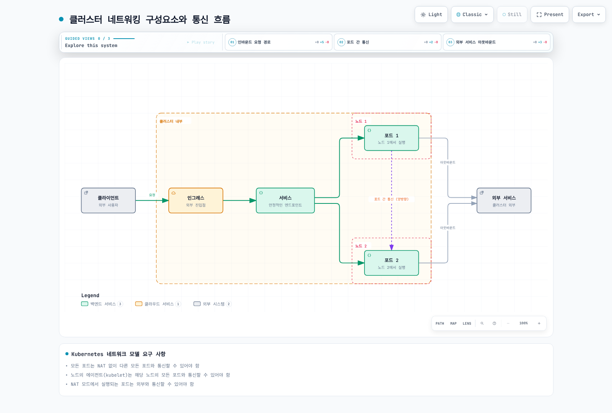

[🔍 인터랙티브 다이어그램 보기](https://www.atomai.click/kubernetes-docs/archmaps/ko-core-09-cluster-administration-3.html)

### CNI(Container Network Interface) 플러그인

Kubernetes는 CNI 플러그인을 통해 네트워킹을 구현합니다. 일반적인 CNI 플러그인:

1. **Calico**: 네트워크 정책 및 보안 기능이 강화된 CNI
2. **Flannel**: 간단한 오버레이 네트워크 제공
3. **Cilium**: eBPF 기반의 네트워킹 및 보안 솔루션
4. **AWS VPC CNI**: AWS VPC와 통합된 CNI
5. **Weave Net (역사적 예시)**: 보관 상태이며 새 설치는 유지 관리되는 대안을 선택

#### CNI 플러그인 설치 및 구성

CNI 플러그인 설치 예시(Calico):

CNI 하나 또는 문서화된 체이닝·마이그레이션 구성을 선택하세요. Calico·Flannel·Cilium 대안을 같은 실행 중 클러스터에 순서대로 설치하면 안 됩니다. 지원되는 버전을 고정하고 제공자별 지침을 따르며 EKS에서는 [네트워킹 장](./03-services-networking.md)의 VPC CNI 또는 대체 CNI 전환 절차를 사용하세요.

```bash
# 변경 전에 설치된 네트워킹 구성 요소 확인
kubectl get daemonsets -A
kubectl get pods -A -l k8s-app=calico-node
```


### 서비스 네트워킹

Kubernetes 서비스는 포드 집합에 대한 안정적인 엔드포인트를 제공합니다:

1. **ClusterIP**: 클러스터 내부에서만 접근 가능한 서비스
2. **NodePort**: 모든 노드의 특정 포트를 통해 접근 가능한 서비스
3. **LoadBalancer**: 외부 로드 밸런서를 통해 접근 가능한 서비스
4. **ExternalName**: 외부 서비스에 대한 CNAME 레코드 제공

#### 서비스 CIDR 구성

서비스 CIDR은 서비스 IP 주소 범위를 정의합니다:

```bash
# kube-apiserver 구성에서 서비스 CIDR 설정
--service-cluster-ip-range=10.96.0.0/12
```

### CoreDNS 관리

CoreDNS는 Kubernetes의 DNS 서비스를 제공합니다:

```bash
# CoreDNS 상태 확인
kubectl get pods -n kube-system -l k8s-app=kube-dns

# CoreDNS 구성 확인
kubectl get configmap -n kube-system coredns -o yaml
```

CoreDNS 구성 예시:

```yaml
apiVersion: v1
kind: ConfigMap
metadata:
  name: coredns
  namespace: kube-system
data:
  Corefile: |
    .:53 {
        errors
        health {
           lameduck 5s
        }
        ready
        kubernetes cluster.local in-addr.arpa ip6.arpa {
           pods insecure
           fallthrough in-addr.arpa ip6.arpa
           ttl 30
        }
        prometheus :9153
        forward . /etc/resolv.conf
        cache 30
        loop
        reload
        loadbalance
    }
```

### 네트워크 정책

네트워크 정책은 포드 간의 통신을 제어합니다:

```yaml
apiVersion: networking.k8s.io/v1
kind: NetworkPolicy
metadata:
  name: db-network-policy
  namespace: default
spec:
  podSelector:
    matchLabels:
      role: db
  policyTypes:
  - Ingress
  - Egress
  ingress:
  - from:
    - podSelector:
        matchLabels:
          role: frontend
    ports:
    - protocol: TCP
      port: 3306
  egress:
  - to:
    - podSelector:
        matchLabels:
          role: monitoring
    ports:
    - protocol: TCP
      port: 9090
```

위 예시에서 `role=db` 레이블이 있는 포드는 `role=frontend` 레이블이 있는 포드로부터의 TCP 3306 포트 인바운드 트래픽과 `role=monitoring` 레이블이 있는 포드로의 TCP 9090 포트 아웃바운드 트래픽만 허용합니다.

## 인증 및 권한 관리

Kubernetes의 인증 및 권한 관리는 클러스터 보안의 핵심 요소입니다.

다음 다이어그램은 Kubernetes의 인증 및 권한 부여 흐름을 보여줍니다:

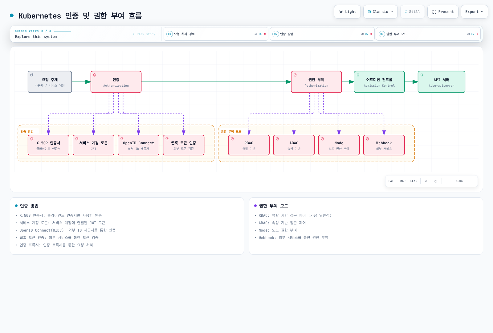

[🔍 인터랙티브 다이어그램 보기](https://www.atomai.click/kubernetes-docs/archmaps/ko-core-09-cluster-administration-4.html)

### 인증(Authentication)

Kubernetes는 다양한 인증 방법을 지원합니다:

1. **X.509 인증서**: 클라이언트 인증서를 사용한 인증
2. **서비스 계정 토큰**: 서비스 계정에 연결된 JWT 토큰
3. **OpenID Connect(OIDC)**: 외부 ID 제공자를 통한 인증
4. **웹훅 토큰 인증**: 외부 서비스를 통한 토큰 검증
5. **인증 프록시**: 인증 프록시를 통한 요청 처리

#### X.509 인증서 관리

X.509 인증서 생성 및 관리:

```bash
# 보호된 개인 키와 CSR 생성
umask 077
openssl genrsa -out user.key 2048
openssl req -new -key user.key -out user.csr -subj "/CN=user/O=group"

# CSR을 Kubernetes에 제출
cat <<EOF | kubectl apply -f -
apiVersion: certificates.k8s.io/v1
kind: CertificateSigningRequest
metadata:
  name: user-csr
spec:
  request: $(cat user.csr | base64 | tr -d '\n')
  signerName: kubernetes.io/kube-apiserver-client
  usages:
  - client auth
EOF

# CSR 승인
kubectl certificate approve user-csr
kubectl wait --for=jsonpath='{.status.certificate}' csr/user-csr --timeout=60s

# 인증서 가져오기
kubectl get csr user-csr -o jsonpath='{.status.certificate}' | base64 --decode > user.crt
```

#### OIDC 인증 구성

OIDC 인증 구성 예시:

```bash
# kube-apiserver 구성에 OIDC 플래그 추가
--oidc-issuer-url=https://accounts.google.com
--oidc-client-id=kubernetes
--oidc-username-claim=email
--oidc-groups-claim=groups
```

### 권한 부여(Authorization)

Kubernetes는 다양한 권한 부여 모드를 지원합니다:

1. **RBAC(Role-Based Access Control)**: 역할 기반 접근 제어
2. **ABAC(Attribute-Based Access Control)**: 속성 기반 접근 제어
3. **Node**: 노드 권한 부여
4. **Webhook**: 외부 서비스를 통한 권한 부여

#### RBAC 구성

RBAC는 가장 일반적인 권한 부여 메커니즘입니다:

```yaml
# Role 예시
apiVersion: rbac.authorization.k8s.io/v1
kind: Role
metadata:
  namespace: default
  name: pod-reader
rules:
- apiGroups: [""]
  resources: ["pods"]
  verbs: ["get", "watch", "list"]

# RoleBinding 예시
---
apiVersion: rbac.authorization.k8s.io/v1
kind: RoleBinding
metadata:
  name: read-pods
  namespace: default
subjects:
- kind: User
  name: user
  apiGroup: rbac.authorization.k8s.io
roleRef:
  kind: Role
  name: pod-reader
  apiGroup: rbac.authorization.k8s.io
```

위 예시에서 `user`는 `default` 네임스페이스의 포드를 조회할 수 있는 권한을 가집니다.

#### ClusterRole 및 ClusterRoleBinding

클러스터 전체 리소스에 대한 권한을 관리합니다:

```yaml
# ClusterRole 예시
apiVersion: rbac.authorization.k8s.io/v1
kind: ClusterRole
metadata:
  name: node-reader
rules:
- apiGroups: [""]
  resources: ["nodes"]
  verbs: ["get", "watch", "list"]

# ClusterRoleBinding 예시
---
apiVersion: rbac.authorization.k8s.io/v1
kind: ClusterRoleBinding
metadata:
  name: read-nodes
subjects:
- kind: User
  name: user
  apiGroup: rbac.authorization.k8s.io
roleRef:
  kind: ClusterRole
  name: node-reader
  apiGroup: rbac.authorization.k8s.io
```

위 예시에서 `user`는 클러스터의 모든 노드를 조회할 수 있는 권한을 가집니다.

### 서비스 계정 관리

서비스 계정은 포드가 API 서버와 통신하는 데 사용됩니다:

```yaml
# 서비스 계정 생성
apiVersion: v1
kind: ServiceAccount
metadata:
  name: my-service-account
  namespace: default

# 서비스 계정에 권한 부여
---
apiVersion: rbac.authorization.k8s.io/v1
kind: RoleBinding
metadata:
  name: my-service-account-binding
  namespace: default
subjects:
- kind: ServiceAccount
  name: my-service-account
  namespace: default
roleRef:
  kind: Role
  name: pod-reader
  apiGroup: rbac.authorization.k8s.io

# 포드에서 서비스 계정 사용
---
apiVersion: v1
kind: Pod
metadata:
  name: my-pod
spec:
  serviceAccountName: my-service-account
  containers:
  - name: my-container
    image: nginx
```

### 보안 컨텍스트

보안 컨텍스트는 포드 및 컨테이너의 권한과 접근 제어를 정의합니다:

```yaml
apiVersion: v1
kind: Pod
metadata:
  name: security-context-pod
spec:
  securityContext:
    runAsUser: 1000
    runAsGroup: 3000
    fsGroup: 2000
    runAsNonRoot: true
    seccompProfile:
      type: RuntimeDefault
  containers:
  - name: security-context-container
    image: busybox:1.36
    command: ["sh", "-c", "sleep 3600"]
    securityContext:
      allowPrivilegeEscalation: false
      capabilities:
        drop:
        - ALL
      readOnlyRootFilesystem: true
```

위 예시에서 포드는 UID 1000, GID 3000으로 실행되며, 컨테이너는 권한 상승이 불가능하고, 모든 Linux 기능이 제거되며, 루트 파일 시스템이 읽기 전용으로 마운트됩니다.

## 클러스터 업그레이드

Kubernetes 클러스터 업그레이드는 새로운 기능, 성능 개선, 보안 패치를 적용하기 위해 필요합니다.

다음 다이어그램은 Kubernetes 클러스터 업그레이드 프로세스를 보여줍니다:

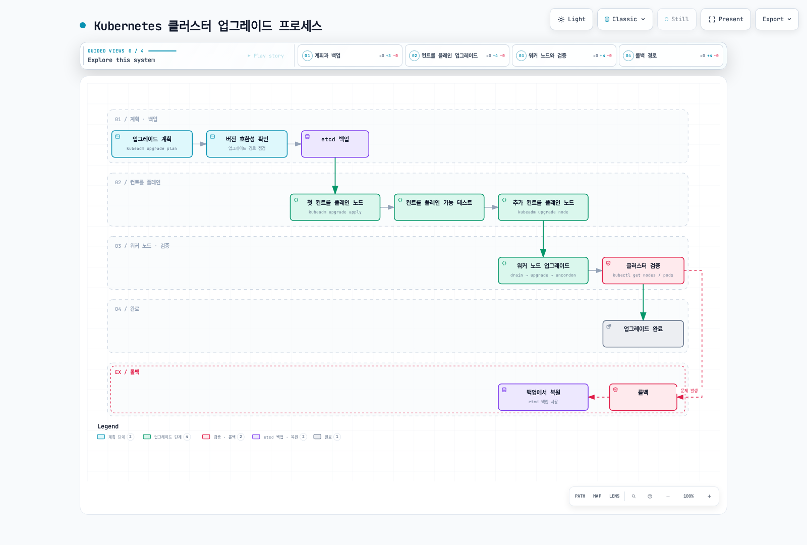

[🔍 인터랙티브 다이어그램 보기](https://www.atomai.click/kubernetes-docs/archmaps/ko-core-09-cluster-administration-5.html)

### 업그레이드 계획

클러스터 업그레이드를 계획할 때 고려해야 할 사항:

1. **버전 호환성**: Kubernetes 버전 간의 호환성 확인
2. **업그레이드 경로**: 지원되는 업그레이드 경로 확인
3. **다운타임**: 업그레이드 중 예상되는 다운타임 계획
4. **롤백 계획**: 문제 발생 시 롤백 계획 수립
5. **애플리케이션 영향**: 업그레이드가 애플리케이션에 미치는 영향 평가

### 컨트롤 플레인 업그레이드

kubeadm을 사용한 컨트롤 플레인 업그레이드:

[해당 버전의 kubeadm 업그레이드 절차](https://kubernetes.io/docs/tasks/administer-cluster/kubeadm/kubeadm-upgrade/)를 따르세요. 대상 마이너 버전의 pkgs.k8s.io 저장소에서 실제 패키지 버전을 선택하고 한 번에 한 마이너 버전만 업그레이드합니다.

1. etcd 백업과 워크로드·애드온 호환성을 확인합니다. 첫 컨트롤 플레인 노드에서 kubeadm을 먼저 업그레이드한 뒤 `kubeadm upgrade plan`, `kubeadm upgrade apply <target-version>`을 실행합니다.
2. 추가 컨트롤 플레인 노드는 kubeadm 업그레이드 후 `kubeadm upgrade node`를 실행합니다.
3. 각 노드의 kubelet 업그레이드 전에 drain하고 실패하면 절차를 중단해 원인을 해결합니다. 호환 kubelet/kubectl 패키지 설치, systemd 재로드, kubelet 재시작, Ready·워크로드 확인 후 관리자 클라이언트에서 uncordon합니다.
4. 워커도 kubeadm 업그레이드와 `kubeadm upgrade node` 후 drain/kubelet/검증/uncordon 절차를 수행합니다. 일반적인 전체 OS 업그레이드를 Kubernetes 버전별 업그레이드 절차 대신 사용하지 마세요.

명령은 명시한 노드 또는 관리자 클라이언트에서 실행합니다. 중첩된 `ssh` 명령을 나열한 것은 다중 노드 자동화 스크립트가 아닙니다.

### 워커 노드 업그레이드

워커 노드 업그레이드 과정:

[해당 버전의 kubeadm 업그레이드 절차](https://kubernetes.io/docs/tasks/administer-cluster/kubeadm/kubeadm-upgrade/)를 따르세요. 대상 마이너 버전의 pkgs.k8s.io 저장소에서 실제 패키지 버전을 선택하고 한 번에 한 마이너 버전만 업그레이드합니다.

1. etcd 백업과 워크로드·애드온 호환성을 확인합니다. 첫 컨트롤 플레인 노드에서 kubeadm을 먼저 업그레이드한 뒤 `kubeadm upgrade plan`, `kubeadm upgrade apply <target-version>`을 실행합니다.
2. 추가 컨트롤 플레인 노드는 kubeadm 업그레이드 후 `kubeadm upgrade node`를 실행합니다.
3. 각 노드의 kubelet 업그레이드 전에 drain하고 실패하면 절차를 중단해 원인을 해결합니다. 호환 kubelet/kubectl 패키지 설치, systemd 재로드, kubelet 재시작, Ready·워크로드 확인 후 관리자 클라이언트에서 uncordon합니다.
4. 워커도 kubeadm 업그레이드와 `kubeadm upgrade node` 후 drain/kubelet/검증/uncordon 절차를 수행합니다. 일반적인 전체 OS 업그레이드를 Kubernetes 버전별 업그레이드 절차 대신 사용하지 마세요.

명령은 명시한 노드 또는 관리자 클라이언트에서 실행합니다. 중첩된 `ssh` 명령을 나열한 것은 다중 노드 자동화 스크립트가 아닙니다.

### 업그레이드 검증

업그레이드 후 클러스터 상태 검증:

```bash
# 노드 버전 확인
kubectl get nodes

# 컴포넌트 상태 확인
kubectl get --raw='/readyz?verbose'

# 포드 상태 확인
kubectl get pods --all-namespaces

# 클러스터 기능 테스트
kubectl create deployment nginx --image=nginx
kubectl expose deployment nginx --port=80
kubectl get svc nginx
```
## 백업 및 복구

Kubernetes 클러스터의 백업 및 복구는 재해 복구 계획의 중요한 부분입니다.

다음 다이어그램은 Kubernetes 클러스터의 백업 및 복구 프로세스를 보여줍니다:

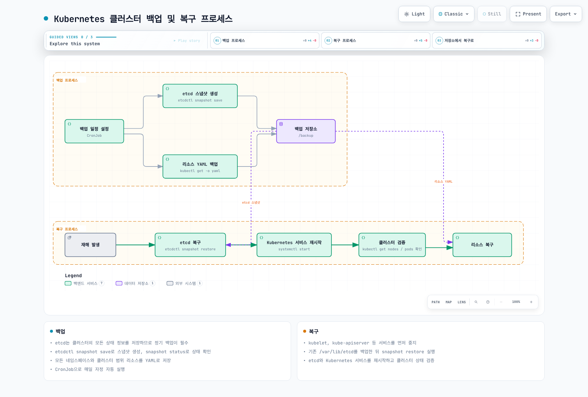

[🔍 인터랙티브 다이어그램 보기](https://www.atomai.click/kubernetes-docs/archmaps/ko-core-09-cluster-administration-6.html)

### etcd 백업

etcd는 Kubernetes 클러스터의 모든 상태 정보를 저장하므로 정기적인 백업이 중요합니다:

```bash
# etcd 스냅샷 생성
ETCDCTL_API=3 etcdctl --endpoints=https://127.0.0.1:2379 \
  --cacert=/etc/kubernetes/pki/etcd/ca.crt \
  --cert=/etc/kubernetes/pki/etcd/server.crt \
  --key=/etc/kubernetes/pki/etcd/server.key \
  snapshot save /backup/etcd-snapshot-$(date +%Y-%m-%d-%H-%M-%S).db

# 스냅샷 상태 확인
etcdutl snapshot status --write-out=table /backup/etcd-snapshot-2023-01-01-12-00-00.db
```

### etcd 복구

etcd 스냅샷에서 복구:

자체 관리형 재해 복구는 배포판 운영 절차에 따라 모든 API 서버와 해당 etcd 프로세스를 먼저 중지합니다. kubelet만 중지해도 기존 정적 파드 컨테이너는 계속 실행됩니다. 호환되는 etcdutl로 새 디렉토리에 복원하고 검증 전까지 원본 데이터를 보관하세요. 아래는 단일 멤버 예시이며 HA 다중 멤버 복구 절차가 아닙니다:

```bash
etcdutl snapshot status "$SNAPSHOT_FILE" --write-out=table
etcdutl snapshot restore "$SNAPSHOT_FILE" \
  --data-dir=/var/lib/etcd-restore \
  --name=etcd-1 \
  --initial-cluster=etcd-1=https://127.0.0.1:2380 \
  --initial-cluster-token=restored-cluster \
  --initial-advertise-peer-urls=https://127.0.0.1:2380 \
  --bump-revision=1000000000 --mark-compacted
```

SNAPSHOT_FILE에는 검증한 스냅샷 경로를 지정하세요. HA는 같은 스냅샷을 각 멤버의 고유 이름·피어 URL과 동일한 전체 멤버 목록으로 복원합니다. 스냅샷 이후 변경을 초과하는 리비전 증가량을 선택하고 etcd 매니페스트·서비스의 경로·소유권·인증서를 맞춘 뒤 쿼럼·상태를 확인합니다. 이후 API 서버·컨트롤러를 시작하세요([공식 복구 문서](https://etcd.io/docs/v3.6/op-guide/recovery/)). EKS 관리형 컨트롤 플레인의 etcd는 사용자가 직접 복구하지 않습니다.

### 리소스 백업

다음 내보내기는 보호해야 할 인벤토리이며 완전한 이식형 복원 계획이 아닙니다. Secret이 포함되므로 제한된 권한·암호화가 필요하고 PV 데이터는 포함하지 않습니다. `umask 077`을 사용하고 각 명령 실패를 확인하세요. 복원 시 CRD·종속성 순서와 서버 소유 메타데이터 정리가 필요하며 `kubectl get all`은 일부 리소스 종류만 반환합니다.

Kubernetes 리소스를 YAML 파일로 백업:

```bash
# 목록 조회 가능한 리소스 내보내기 (민감한 Secret 포함)
set -eu
umask 077
for ns in $(kubectl get ns -o jsonpath='{.items[*].metadata.name}'); do
  mkdir -p /backup/resources/$ns
  for resource in $(kubectl api-resources --verbs=list --namespaced=true -o name); do
    kubectl get -n "$ns" "$resource" -o yaml > "/backup/resources/$ns/$resource.yaml"
  done
done

# 클러스터 범위 리소스 백업
mkdir -p /backup/resources/cluster-scoped
for resource in $(kubectl api-resources --verbs=list --namespaced=false -o name); do
  kubectl get "$resource" -o yaml > "/backup/resources/cluster-scoped/$resource.yaml"
done
```

### 백업 자동화

자체 관리형 kubeadm 전용 예시입니다. 호환 etcdctl이 포함된 검증 이미지로 교체하고 컨트롤 플레인 레이블·테인트·인증서 경로를 맞추며 백업 PVC를 먼저 생성하세요. 선택한 호스트는 표시한 루프백 주소에서 etcd에 접근 가능하고 PVC를 마운트할 수 있어야 합니다. EKS 관리형 컨트롤 플레인에서는 실행할 수 없습니다. 스냅샷 검증 후 보호된 외부 저장소로 복사해야 하며 클러스터 내부 PVC만으로 재해 복구가 되지는 않습니다.

백업 작업을 CronJob으로 자동화:

```yaml
apiVersion: batch/v1
kind: CronJob
metadata:
  name: etcd-backup
  namespace: kube-system
spec:
  concurrencyPolicy: Forbid
  schedule: "0 0 * * *"  # 매일 자정에 실행
  jobTemplate:
    spec:
      template:
        spec:
          hostNetwork: true
          automountServiceAccountToken: false
          nodeSelector:
            node-role.kubernetes.io/control-plane: ""
          tolerations:
          - key: node-role.kubernetes.io/control-plane
            operator: Exists
            effect: NoSchedule
          containers:
          - name: etcd-backup
            image: example.invalid/etcd-backup-tools:replace-me
            command:
            - /bin/sh
            - -c
            - |
              set -eu
              umask 077
              ETCDCTL_API=3 etcdctl --endpoints=https://127.0.0.1:2379 \
                --cacert=/etc/kubernetes/pki/etcd/ca.crt \
                --cert=/etc/kubernetes/pki/etcd/healthcheck-client.crt \
                --key=/etc/kubernetes/pki/etcd/healthcheck-client.key \
                snapshot save /backup/etcd-snapshot-$(date +%Y-%m-%d-%H-%M-%S).db
            volumeMounts:
            - name: etcd-ca
              mountPath: /etc/kubernetes/pki/etcd/ca.crt
              readOnly: true
            - name: etcd-client-cert
              mountPath: /etc/kubernetes/pki/etcd/healthcheck-client.crt
              readOnly: true
            - name: etcd-client-key
              mountPath: /etc/kubernetes/pki/etcd/healthcheck-client.key
              readOnly: true
            - name: backup
              mountPath: /backup
          restartPolicy: OnFailure
          volumes:
          - name: etcd-ca
            hostPath:
              path: /etc/kubernetes/pki/etcd/ca.crt
              type: File
          - name: etcd-client-cert
            hostPath:
              path: /etc/kubernetes/pki/etcd/healthcheck-client.crt
              type: File
          - name: etcd-client-key
            hostPath:
              path: /etc/kubernetes/pki/etcd/healthcheck-client.key
              type: File
          - name: backup
            persistentVolumeClaim:
              claimName: etcd-backup-pvc
```

## 모니터링 및 로깅

효과적인 모니터링 및 로깅은 클러스터 관리의 핵심 요소입니다.

다음 다이어그램은 Kubernetes 클러스터의 모니터링 및 로깅 아키텍처를 보여줍니다:

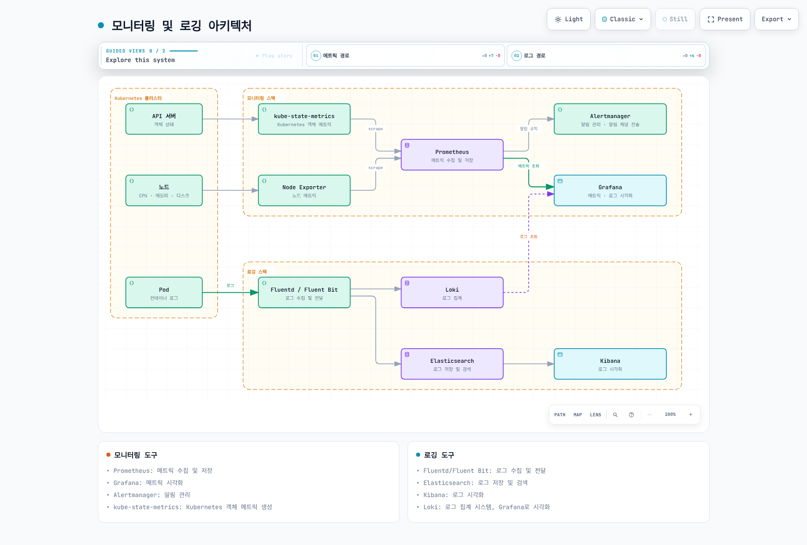

[🔍 인터랙티브 다이어그램 보기](https://www.atomai.click/kubernetes-docs/archmaps/ko-core-09-cluster-administration-7.html)

### 모니터링 도구

Kubernetes 클러스터 모니터링을 위한 도구:

1. **Prometheus**: 메트릭 수집 및 저장
2. **Grafana**: 메트릭 시각화
3. **Alertmanager**: 알림 관리
4. **kube-state-metrics**: Kubernetes 객체 메트릭 생성
5. **metrics-server**: 리소스 사용량 메트릭 제공

#### Prometheus 및 Grafana 설치

Helm을 사용한 Prometheus 및 Grafana 설치:

```bash
# Helm 저장소 추가
helm repo add prometheus-community https://prometheus-community.github.io/helm-charts
helm repo update

# Prometheus 스택 설치
helm install prometheus prometheus-community/kube-prometheus-stack \
  --namespace monitoring \
  --create-namespace
```

#### 주요 모니터링 메트릭

모니터링해야 할 주요 메트릭:

1. **노드 메트릭**: CPU, 메모리, 디스크, 네트워크 사용량
2. **포드 메트릭**: CPU, 메모리 사용량, 재시작 횟수
3. **컨테이너 메트릭**: CPU, 메모리 사용량, 파일 시스템 사용량
4. **API 서버 메트릭**: 요청 지연 시간, 요청 수, 오류율
5. **etcd 메트릭**: 디스크 I/O, 리더 변경, 커밋 지연 시간

### 로깅 도구

Kubernetes 클러스터 로깅을 위한 도구:

1. **Elasticsearch**: 로그 저장 및 검색
2. **Fluentd/Fluent Bit**: 로그 수집 및 전달
3. **Kibana**: 로그 시각화
4. **Loki**: 로그 집계 시스템
5. **Grafana**: 로그 시각화

#### EFK(Elasticsearch, Fluentd, Kibana) 스택 설치

Helm을 사용한 EFK 스택 설치:

독립 Elastic Stack Helm 차트 저장소는 보관 상태입니다. 유지 관리되는 배포에는 Elastic Cloud on Kubernetes(ECK)를 사용하고 Elasticsearch·Kibana 리소스와 호환 로그 수집기를 별도로 정의하세요. 오퍼레이터 설치만으로 EFK 스택이 생성되지는 않습니다:

```bash
helm repo add elastic https://helm.elastic.co
helm upgrade --install elastic-operator elastic/eck-operator \
  --namespace elastic-system --create-namespace \
  --version "${ECK_CHART_VERSION:?Select a supported ECK chart version}"
```

대시보드는 ClusterIP·인증된 접근으로 보호하고 [ECK 문서](https://www.elastic.co/docs/deploy-manage/deploy/cloud-on-k8s/install-using-helm-chart)에 따라 스토리지·TLS·자격 증명·수집기 파서·RBAC를 구성하세요.

#### 로그 수집 구성

이 예시는 Docker JSON을 가정하지 않고 CRI 로그 형식을 파싱합니다. 수집기 이미지에 메타데이터·출력 플러그인이 있어야 하며 노드 로그·쓰기 가능한 위치 파일 저장소를 마운트하고 제한된 메타데이터 RBAC를 부여해야 합니다. 실제 Elasticsearch의 TLS·인증을 설정하며 예시 호스트 이름만으로 ECK 통합이 완성되지는 않습니다. 부분·멀티라인 레코드는 선택한 수집기에 맞게 처리하세요.

Fluentd 구성 예시:

```yaml
apiVersion: v1
kind: ConfigMap
metadata:
  name: fluentd-config
  namespace: logging
data:
  fluent.conf: |
    <source>
      @type tail
      path /var/log/containers/*.log
      pos_file /var/log/fluentd-containers.log.pos
      tag kubernetes.*
      read_from_head true
      <parse>
        @type regexp
        expression /^(?<time>[^ ]+) (?<stream>stdout|stderr) (?<logtag>[^ ]*) (?<log>.*)$/
        time_type string
        time_format %Y-%m-%dT%H:%M:%S.%N%:z
      </parse>
    </source>

    <filter kubernetes.**>
      @type kubernetes_metadata
      kubernetes_url https://kubernetes.default.svc
      bearer_token_file /var/run/secrets/kubernetes.io/serviceaccount/token
      ca_file /var/run/secrets/kubernetes.io/serviceaccount/ca.crt
    </filter>

    <match kubernetes.**>
      @type elasticsearch
      host elasticsearch-master
      port 9200
      logstash_format true
      logstash_prefix k8s
    </match>
```

## 문제 해결

Kubernetes 클러스터 문제 해결은 클러스터 관리의 중요한 부분입니다.

### 포드 문제 해결

포드 문제 해결을 위한 명령어:

```bash
# 포드 상태 확인
kubectl get pod <pod-name> -o wide

# 포드 상세 정보 확인
kubectl describe pod <pod-name>

# 포드 로그 확인
kubectl logs <pod-name>
kubectl logs <pod-name> -c <container-name>  # 다중 컨테이너 포드의 경우
kubectl logs <pod-name> --previous  # 이전 컨테이너의 로그

# 포드 내 명령 실행
kubectl exec -it <pod-name> -- /bin/sh
```

### 노드 문제 해결

노드 문제 해결을 위한 명령어:

```bash
# 노드 상태 확인
kubectl get node <node-name> -o wide

# 노드 상세 정보 확인
kubectl describe node <node-name>

# 노드 리소스 사용량 확인
kubectl top node <node-name>

# SSH로 노드에 접속
ssh <node-name>

# 노드 시스템 로그 확인
journalctl -u kubelet

# 노드 리소스 사용량 확인
top
df -h
free -m
```

### 네트워킹 문제 해결

네트워킹 문제 해결을 위한 명령어:

```bash
# 서비스 상태 확인
kubectl get svc <service-name>

# 서비스 상세 정보 확인
kubectl describe svc <service-name>

# 엔드포인트 확인
kubectl get endpointslices -l kubernetes.io/service-name=<service-name>

# DNS 확인
kubectl run -it --rm --restart=Never busybox --image=busybox -- nslookup <service-name>

# 네트워크 연결 테스트
kubectl run -it --rm --restart=Never busybox --image=busybox -- wget -O- <service-name>:<port>

# 네트워크 정책 확인
kubectl get networkpolicy
kubectl describe networkpolicy <policy-name>
```

### 컨트롤 플레인 문제 해결

컨트롤 플레인 문제 해결을 위한 명령어:

```bash
# 컴포넌트 상태 확인
kubectl get --raw='/readyz?verbose'

# API 서버 로그 확인
kubectl logs -n kube-system kube-apiserver-<node-name>

# 컨트롤러 매니저 로그 확인
kubectl logs -n kube-system kube-controller-manager-<node-name>

# 스케줄러 로그 확인
kubectl logs -n kube-system kube-scheduler-<node-name>

# etcd 로그 확인
kubectl logs -n kube-system etcd-<node-name>
```

## Amazon EKS 클러스터 관리

Amazon EKS는 관리형 Kubernetes 서비스로, 클러스터 관리의 많은 부분을 자동화합니다.

다음 다이어그램은 Amazon EKS 클러스터 아키텍처와 관리 구성요소를 보여줍니다:

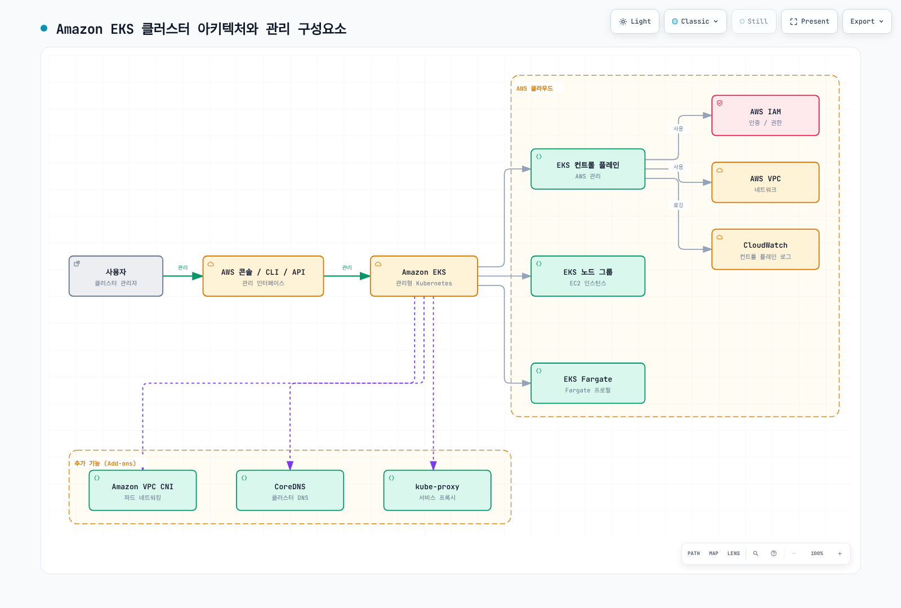

[🔍 인터랙티브 다이어그램 보기](https://www.atomai.click/kubernetes-docs/archmaps/ko-core-09-cluster-administration-8.html)

### EKS 클러스터 구성

엔드포인트 변경 전에 실제 관리자 CIDR을 정하고 프라이빗 접근 가능 여부도 확인하세요. 버전 업그레이드는 호환 애드온·노드를 준비한 다음 지원되는 마이너 버전으로 수행하며 다운그레이드나 마이너 건너뛰기에 사용하면 안 됩니다. 반환된 업데이트 ID를 확인하고 실패하면 후속 변경을 중단하세요.

EKS 클러스터 구성 관리:

```bash
# EKS 클러스터 정보 확인
aws eks describe-cluster --name my-cluster

# EKS 클러스터 업데이트
aws eks update-cluster-config \
  --name my-cluster \
  --resources-vpc-config "endpointPublicAccess=true,endpointPrivateAccess=true,publicAccessCidrs=${ADMIN_CIDR:?Set an approved administrator public CIDR}"

# EKS 클러스터 버전 업데이트
aws eks update-cluster-version \
  --name my-cluster \
  --kubernetes-version "${TARGET_VERSION:?Select the next EKS-supported minor version}"
```

### EKS 노드 그룹 관리

EKS 노드 그룹 관리:

```bash
# 노드 그룹 정보 확인
aws eks describe-nodegroup \
  --cluster-name my-cluster \
  --nodegroup-name my-nodegroup

# 노드 그룹 스케일링
aws eks update-nodegroup-config \
  --cluster-name my-cluster \
  --nodegroup-name my-nodegroup \
  --scaling-config minSize=2,maxSize=10,desiredSize=5

# 노드 그룹 업데이트
aws eks update-nodegroup-version \
  --cluster-name my-cluster \
  --nodegroup-name my-nodegroup
```

### EKS 추가 기능 관리

`aws eks describe-cluster --name my-cluster --query cluster.version --output text`로 현재 버전을 확인하고 애드온 검색에 사용한 뒤 호환 버전을 고정하세요. create/update 전에 기존 설정·IAM을 검토하고 이미 관리 중인 애드온을 다시 생성하지 마세요. 삭제 예시는 `--preserve`로 CNI 실행을 유지하면서 EKS 관리만 제거하며 실행 중 네트워킹 삭제는 별도의 중단 작업입니다.

EKS 추가 기능 관리:

```bash
# 사용 가능한 추가 기능 확인
aws eks describe-addon-versions --addon-name vpc-cni \
  --kubernetes-version "${CLUSTER_VERSION:?Set the actual cluster version}"

# 추가 기능 설치
aws eks create-addon \
  --cluster-name my-cluster \
  --addon-name vpc-cni \
  --addon-version "${CNI_ADDON_VERSION:?Select a compatible pinned VPC CNI add-on version}"

# 추가 기능 업데이트
aws eks update-addon \
  --cluster-name my-cluster \
  --addon-name vpc-cni \
  --addon-version "${CNI_ADDON_VERSION:?Select a compatible pinned VPC CNI add-on version}"

# 추가 기능 삭제
aws eks delete-addon \
  --cluster-name my-cluster \
  --addon-name vpc-cni --preserve
```

### EKS 클러스터 업그레이드

EKS 클러스터 업그레이드 과정:

1. **컨트롤 플레인 업그레이드**:
   ```bash
   aws eks update-cluster-version \
     --name my-cluster \
     --kubernetes-version "${TARGET_VERSION:?Select the next EKS-supported minor version}"
   ```

2. **추가 기능 업그레이드**:
   ```bash
   aws eks update-addon \
     --cluster-name my-cluster \
     --addon-name vpc-cni \
     --addon-version "${CNI_ADDON_VERSION:?Select a compatible pinned VPC CNI add-on version}"
   ```

3. **노드 그룹 업그레이드**:
   ```bash
   aws eks update-nodegroup-version \
     --cluster-name my-cluster \
     --nodegroup-name my-nodegroup
   ```

### EKS 클러스터 모니터링

컨트롤 플레인 로깅은 api/audit/authenticator/controllerManager/scheduler 로그를 내보냅니다. Container Insights에는 CloudWatch 에이전트·애드온과 제한된 텔레메트리 IAM 권한이 필요하며 update-cluster-logging으로 활성화되지 않습니다. CloudWatch 관측 애드온은 Prometheus/Grafana가 아닌 CloudWatch·Fluent Bit 구성 요소를 설치합니다([공식 설치 문서](https://docs.aws.amazon.com/AmazonCloudWatch/latest/monitoring/install-CloudWatch-Observability-EKS-addon.html)).

EKS 클러스터 모니터링 도구:

1. **Amazon CloudWatch**: 메트릭, 로그, 알림
2. **AWS CloudTrail**: API 호출 로깅
3. **Amazon Managed Grafana**: 메트릭 시각화
4. **Amazon Managed Service for Prometheus**: 메트릭 수집 및 저장

EKS 컨트롤 플레인 로깅 활성화:

```bash
# EKS 컨트롤 플레인 로그 활성화
eksctl utils update-cluster-logging \
  --enable-types all \
  --cluster my-cluster \
  --approve
```

## 클러스터 관리 모범 사례

Kubernetes 및 EKS 클러스터 관리를 위한 모범 사례:

### 클러스터 구성 모범 사례

1. **Infrastructure as Code(IaC)**: Terraform, AWS CDK, eksctl 등을 사용하여 클러스터 구성 관리
2. **버전 관리**: 클러스터 구성을 버전 관리 시스템에 저장
3. **다중 환경**: 개발, 스테이징, 프로덕션 환경 분리
4. **네트워크 분리**: 적절한 네트워크 분리 및 보안 그룹 구성
5. **최소 권한 원칙**: 필요한 최소한의 권한만 부여

### 운영 모범 사례

1. **정기적인 백업**: etcd 및 중요 리소스 정기 백업
2. **모니터링 및 알림**: 포괄적인 모니터링 및 알림 시스템 구축
3. **로깅 중앙화**: 로그 중앙화 및 분석
4. **자동화**: 반복 작업 자동화
5. **재해 복구 계획**: 명확한 재해 복구 계획 수립 및 테스트

### 보안 모범 사례

1. **정기적인 업데이트**: 클러스터 및 노드 정기 업데이트
2. **네트워크 정책**: 적절한 네트워크 정책 구성
3. **암호화**: 저장 데이터 및 전송 중 데이터 암호화
4. **보안 컨텍스트**: 적절한 보안 컨텍스트 구성
5. **이미지 스캐닝**: 컨테이너 이미지 취약점 스캐닝

### 리소스 관리 모범 사례

1. **리소스 요청 및 제한**: 모든 포드에 적절한 리소스 요청 및 제한 설정
2. **네임스페이스 분리**: 워크로드를 네임스페이스로 분리
3. **리소스 쿼터**: 네임스페이스별 리소스 쿼터 설정
4. **HPA 및 VPA**: 자동 스케일링 구성
5. **노드 어피니티 및 테인트**: 워크로드 배치 최적화

### EKS 특화 모범 사례

1. **관리형 노드 그룹**: 가능한 경우 관리형 노드 그룹 사용
2. **Fargate**: 서버리스 워크로드에 Fargate 사용
3. **EKS 추가 기능**: 공식 EKS 추가 기능 사용
4. **IAM 역할 서비스 계정(IRSA)**: 포드별 IAM 권한 관리
5. **VPC CNI 사용자 지정**: 네트워킹 요구 사항에 맞게 VPC CNI 구성

## 결론

Kubernetes 클러스터 관리는 클러스터의 안정성, 보안, 성능을 유지하는 데 중요한 역할을 합니다. 이 장에서는 클러스터 구성요소 관리, 리소스 관리, 네트워킹, 인증 및 권한 관리, 업그레이드, 백업 및 복구, 모니터링 및 로깅, 문제 해결 등 클러스터 관리의 다양한 측면을 다루었습니다.

Amazon EKS를 사용하면 Kubernetes 컨트롤 플레인 관리의 복잡성을 줄이고, AWS 서비스와의 통합을 통해 클러스터 관리를 간소화할 수 있습니다. 그러나 효과적인 클러스터 관리를 위해서는 여전히 Kubernetes의 기본 개념과 모범 사례를 이해하는 것이 중요합니다.

클러스터 관리는 지속적인 과정이며, 클러스터의 요구 사항과 워크로드 특성에 따라 지속적으로 조정해야 합니다. 모니터링 도구를 활용하여 클러스터 상태를 추적하고, 자동화를 통해 반복 작업을 최소화하며, 모범 사례를 따라 클러스터의 안정성과 보안을 유지하는 것이 중요합니다.
## 리소스 관리

Kubernetes에서 리소스 관리는 클러스터의 효율적인 운영을 위해 중요합니다. 이는 CPU, 메모리, 스토리지와 같은 컴퓨팅 리소스와 네임스페이스, 쿼터와 같은 논리적 리소스를 포함합니다.

### 네임스페이스 관리

네임스페이스는 클러스터 내에서 리소스를 논리적으로 분리하는 방법입니다.

```bash
# 네임스페이스 생성
kubectl create namespace admin-demo

# 특정 네임스페이스의 리소스 확인
kubectl get all -n admin-demo

# 실습용 네임스페이스만 정리 (안의 리소스도 삭제됨)
kubectl delete namespace admin-demo
```

### 리소스 쿼터 관리

리소스 쿼터는 네임스페이스별로 리소스 사용량을 제한합니다.

```yaml
# resource-quota.yaml
apiVersion: v1
kind: ResourceQuota
metadata:
  name: compute-quota
  namespace: production
spec:
  hard:
    pods: "10"
    requests.cpu: "4"
    requests.memory: 8Gi
    limits.cpu: "8"
    limits.memory: 16Gi
```

```bash
# 리소스 쿼터 적용
kubectl apply -f resource-quota.yaml

# 리소스 쿼터 확인
kubectl describe resourcequota compute-quota -n production
```

### 리소스 요청 및 제한 설정

파드 수준에서 리소스 요청과 제한을 설정하여 리소스 사용량을 관리할 수 있습니다.

```yaml
# resource-limits.yaml
apiVersion: v1
kind: Pod
metadata:
  name: frontend
spec:
  containers:
  - name: app
    image: nginx
    resources:
      requests:
        memory: "128Mi"
        cpu: "100m"
      limits:
        memory: "256Mi"
        cpu: "200m"
```

### 리소스 모니터링

```bash
# 노드 리소스 사용량 확인
kubectl top nodes

# 파드 리소스 사용량 확인
kubectl top pods -A

# 특정 네임스페이스의 파드 리소스 사용량 확인
kubectl top pods -n production
```

### 리소스 관리 모범 사례

1. 모든 컨테이너에 리소스 요청과 제한 설정
2. 네임스페이스별 리소스 쿼터 설정
3. 수평적 파드 자동 확장(HPA) 구성
4. 클러스터 자동 확장 설정
5. 정기적인 리소스 사용량 모니터링 및 최적화
## 클러스터 네트워킹

Kubernetes 클러스터 네트워킹은 파드 간 통신, 서비스 디스커버리, 외부 접근 등을 관리합니다.

### 네트워크 아키텍처

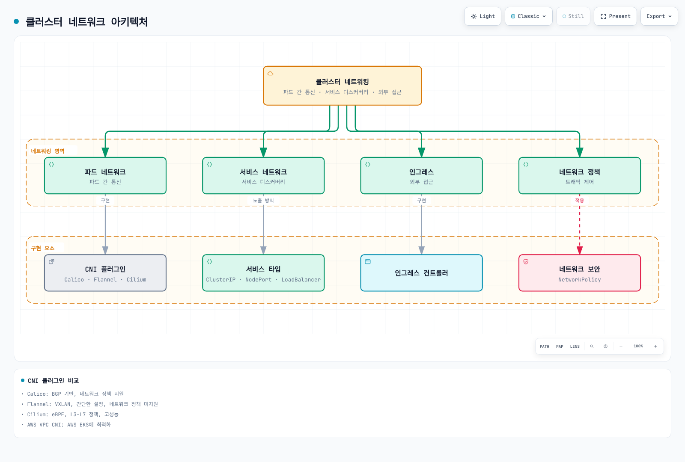

[🔍 인터랙티브 다이어그램 보기](https://www.atomai.click/kubernetes-docs/archmaps/ko-core-09-cluster-administration-9.html)

### CNI 플러그인 관리

CNI(Container Network Interface) 플러그인은 Kubernetes 클러스터의 네트워킹을 담당합니다.

CNI 하나 또는 문서화된 체이닝·마이그레이션 구성을 선택하세요. Calico·Flannel·Cilium 대안을 같은 실행 중 클러스터에 순서대로 설치하면 안 됩니다. 지원되는 버전을 고정하고 제공자별 지침을 따르며 EKS에서는 [네트워킹 장](./03-services-networking.md)의 VPC CNI 또는 대체 CNI 전환 절차를 사용하세요.

```bash
# 변경 전에 설치된 네트워킹 구성 요소 확인
kubectl get daemonsets -A
kubectl get pods -A -l k8s-app=calico-node
```


### CNI 플러그인 비교

| CNI 플러그인 | 네트워크 모델 | 네트워크 정책 지원 | 성능 | 특징 |
|-------------|-------------|-----------------|------|------|
| **Calico** | BGP | 예 | 높음 | 네트워크 정책에 강점, 라우팅 기반 |
| **Flannel** | VXLAN/호스트-게이트웨이 | 아니오 | 중간 | 간단한 설정, 제한된 기능 |
| **Cilium** | eBPF | 예 | 매우 높음 | L3-L7 정책, 고성능 |
| **Weave Net** | VXLAN | 예 | 중간 | 암호화 지원, 멀티클러스터 |
| **AWS VPC CNI** | AWS VPC | 지원 버전·구성에서 가능 | 워크로드에 따라 다름 | EKS 네이티브 통합 |

### 네트워크 문제 해결

```bash
# 파드 네트워크 연결 테스트
kubectl run -it --rm network-test --image=busybox -- sh
# 컨테이너 내에서
ping <target-ip>
traceroute <target-ip>
wget -O- <service-name>

# DNS 문제 해결
kubectl run -it --rm dns-test --image=busybox -- sh
# 컨테이너 내에서
nslookup kubernetes.default.svc.cluster.local
cat /etc/resolv.conf

# 서비스 엔드포인트 확인
kubectl get endpointslices -l kubernetes.io/service-name=<service-name>

# 네트워크 정책 확인
kubectl describe networkpolicy -n <namespace>
```
## 인증 및 권한 관리

Kubernetes의 인증 및 권한 관리는 클러스터 보안의 핵심 요소입니다. RBAC(Role-Based Access Control)을 통해 사용자와 서비스 계정의 권한을 관리합니다.

### 인증 방법

Kubernetes는 다양한 인증 방법을 지원합니다:

1. **X.509 인증서**: 클라이언트 인증서를 사용한 인증
2. **서비스 계정 토큰**: 파드 내에서 API 서버 접근에 사용
3. **OpenID Connect(OIDC)**: 외부 ID 제공자와 통합
4. **웹훅 토큰 인증**: 외부 인증 서비스와 통합
5. **인증 프록시**: 프록시를 통한 인증

### RBAC 구성

```yaml
# role.yaml - 네임스페이스 범위의 역할
apiVersion: rbac.authorization.k8s.io/v1
kind: Role
metadata:
  namespace: default
  name: pod-reader
rules:
- apiGroups: [""]
  resources: ["pods"]
  verbs: ["get", "watch", "list"]
```

```yaml
# rolebinding.yaml - 역할과 사용자 연결
apiVersion: rbac.authorization.k8s.io/v1
kind: RoleBinding
metadata:
  name: read-pods
  namespace: default
subjects:
- kind: User
  name: jane
  apiGroup: rbac.authorization.k8s.io
roleRef:
  kind: Role
  name: pod-reader
  apiGroup: rbac.authorization.k8s.io
```

```yaml
# clusterrole.yaml - 클러스터 범위의 역할
apiVersion: rbac.authorization.k8s.io/v1
kind: ClusterRole
metadata:
  name: namespace-reader
rules:
- apiGroups: [""]
  resources: ["namespaces"]
  verbs: ["get", "watch", "list"]
```

```yaml
# clusterrolebinding.yaml - 클러스터 역할과 사용자 연결
apiVersion: rbac.authorization.k8s.io/v1
kind: ClusterRoleBinding
metadata:
  name: read-namespaces-global
subjects:
- kind: Group
  name: namespace-viewers
  apiGroup: rbac.authorization.k8s.io
roleRef:
  kind: ClusterRole
  name: namespace-reader
  apiGroup: rbac.authorization.k8s.io
```

### 사용자 인증서 생성

자체 관리형 클라이언트 인증서는 CSR을 제출하고 권한 있는 승인자가 요청한 사용자·그룹을 검증해야 합니다. 클러스터 CA 개인 키를 배포하지 마세요. EKS 사용자 접근에는 IAM·액세스 항목을 사용합니다.

```bash
umask 077
openssl genrsa -out jane.key 2048
openssl req -new -key jane.key -out jane.csr -subj "/CN=jane/O=dev"
cat <<EOF | kubectl apply -f -
apiVersion: certificates.k8s.io/v1
kind: CertificateSigningRequest
metadata:
  name: jane-csr
spec:
  request: $(base64 < jane.csr | tr -d '\n')
  signerName: kubernetes.io/kube-apiserver-client
  expirationSeconds: 86400
  usages:
  - client auth
EOF
# Authorized approver only, after reviewing the CSR identity:
kubectl certificate approve jane-csr
kubectl wait --for=jsonpath='{.status.certificate}' csr/jane-csr --timeout=60s
kubectl get csr jane-csr -o jsonpath='{.status.certificate}' | base64 --decode > jane.crt
kubectl config set-credentials jane --client-certificate=jane.crt --client-key=jane.key
kubectl config set-context jane-context --cluster=kubernetes --user=jane
```

### 서비스 계정 관리

```bash
# 서비스 계정 생성
kubectl create serviceaccount app-service-account

# 서비스 계정에 역할 바인딩
kubectl create rolebinding app-service-account-binding \
  --role=pod-reader \
  --serviceaccount=default:app-service-account

# ServiceAccount 메타데이터 확인 (프로젝션 토큰은 여기에 표시되지 않음)
kubectl describe serviceaccount app-service-account
```

### 권한 검증

```bash
# 사용자 권한 확인
kubectl auth can-i get pods --as jane

# 특정 네임스페이스에서 권한 확인
kubectl auth can-i create deployments --as jane --namespace production
```
## 클러스터 업그레이드

Kubernetes 클러스터 업그레이드는 새로운 기능, 보안 패치, 버그 수정을 적용하기 위해 필요합니다. 업그레이드는 신중하게 계획하고 실행해야 합니다.

### 업그레이드 계획

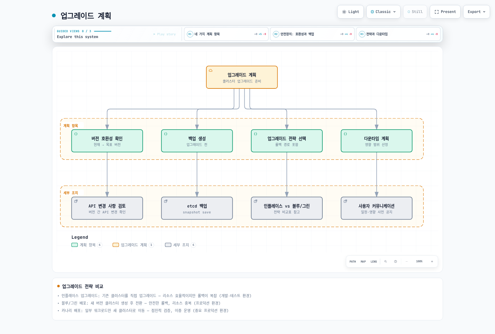

[🔍 인터랙티브 다이어그램 보기](https://www.atomai.click/kubernetes-docs/archmaps/ko-core-09-cluster-administration-10.html)

### 업그레이드 전략 비교

| 전략 | 설명 | 장점 | 단점 | 적합한 환경 |
|------|------|------|------|------------|
| **인플레이스 업그레이드** | 기존 클러스터를 직접 업그레이드 | 리소스 효율적, 간단한 절차 | 롤백 복잡, 잠재적 다운타임 | 개발, 테스트 환경 |
| **블루/그린 배포** | 새 버전의 클러스터 생성 후 전환 | 안전한 롤백, 검증 가능 | 리소스 중복, 비용 증가 | 프로덕션 환경 |
| **카나리 배포** | 일부 워크로드만 새 클러스터로 이동 | 점진적 검증, 위험 감소 | 복잡한 관리, 이중 운영 | 중요 프로덕션 환경 |

### kubeadm을 사용한 업그레이드

[해당 버전의 kubeadm 업그레이드 절차](https://kubernetes.io/docs/tasks/administer-cluster/kubeadm/kubeadm-upgrade/)를 따르세요. 대상 마이너 버전의 pkgs.k8s.io 저장소에서 실제 패키지 버전을 선택하고 한 번에 한 마이너 버전만 업그레이드합니다.

1. etcd 백업과 워크로드·애드온 호환성을 확인합니다. 첫 컨트롤 플레인 노드에서 kubeadm을 먼저 업그레이드한 뒤 `kubeadm upgrade plan`, `kubeadm upgrade apply <target-version>`을 실행합니다.
2. 추가 컨트롤 플레인 노드는 kubeadm 업그레이드 후 `kubeadm upgrade node`를 실행합니다.
3. 각 노드의 kubelet 업그레이드 전에 drain하고 실패하면 절차를 중단해 원인을 해결합니다. 호환 kubelet/kubectl 패키지 설치, systemd 재로드, kubelet 재시작, Ready·워크로드 확인 후 관리자 클라이언트에서 uncordon합니다.
4. 워커도 kubeadm 업그레이드와 `kubeadm upgrade node` 후 drain/kubelet/검증/uncordon 절차를 수행합니다. 일반적인 전체 OS 업그레이드를 Kubernetes 버전별 업그레이드 절차 대신 사용하지 마세요.

명령은 명시한 노드 또는 관리자 클라이언트에서 실행합니다. 중첩된 `ssh` 명령을 나열한 것은 다중 노드 자동화 스크립트가 아닙니다.

### 업그레이드 후 검증

```bash
# 클러스터 버전 확인
kubectl version

# 노드 버전 확인
kubectl get nodes

# 컴포넌트 상태 확인
kubectl get --raw='/readyz?verbose'

# 워크로드 상태 확인
kubectl get pods -A
```
## 백업 및 복구

Kubernetes 클러스터의 백업 및 복구는 재해 복구 계획의 중요한 부분입니다. 주요 백업 대상은 etcd 데이터베이스, 영구 볼륨 데이터, 그리고 Kubernetes 리소스 정의입니다.

### etcd 백업 및 복구

etcd는 클러스터의 모든 상태 정보를 저장하는 핵심 구성 요소입니다.

자체 관리형 재해 복구는 배포판 운영 절차에 따라 모든 API 서버와 해당 etcd 프로세스를 먼저 중지합니다. kubelet만 중지해도 기존 정적 파드 컨테이너는 계속 실행됩니다. 호환되는 etcdutl로 새 디렉토리에 복원하고 검증 전까지 원본 데이터를 보관하세요. 아래는 단일 멤버 예시이며 HA 다중 멤버 복구 절차가 아닙니다:

```bash
etcdutl snapshot status "$SNAPSHOT_FILE" --write-out=table
etcdutl snapshot restore "$SNAPSHOT_FILE" \
  --data-dir=/var/lib/etcd-restore \
  --name=etcd-1 \
  --initial-cluster=etcd-1=https://127.0.0.1:2380 \
  --initial-cluster-token=restored-cluster \
  --initial-advertise-peer-urls=https://127.0.0.1:2380 \
  --bump-revision=1000000000 --mark-compacted
```

SNAPSHOT_FILE에는 검증한 스냅샷 경로를 지정하세요. HA는 같은 스냅샷을 각 멤버의 고유 이름·피어 URL과 동일한 전체 멤버 목록으로 복원합니다. 스냅샷 이후 변경을 초과하는 리비전 증가량을 선택하고 etcd 매니페스트·서비스의 경로·소유권·인증서를 맞춘 뒤 쿼럼·상태를 확인합니다. 이후 API 서버·컨트롤러를 시작하세요([공식 복구 문서](https://etcd.io/docs/v3.6/op-guide/recovery/)). EKS 관리형 컨트롤 플레인의 etcd는 사용자가 직접 복구하지 않습니다.

### Kubernetes 리소스 백업

```bash
# 선택한 리소스 내보내기이며 전체 클러스터 백업이 아님
set -eu
umask 077
mkdir -p /backup/resources/$(date +%Y-%m-%d)
for ns in $(kubectl get ns -o jsonpath='{.items[*].metadata.name}'); do
  kubectl -n $ns get all -o yaml > /backup/resources/$(date +%Y-%m-%d)/$ns-all.yaml
done

# 특정 리소스 유형 백업
for resource in deployments services configmaps secrets; do
  kubectl get $resource -A -o yaml > /backup/resources/$(date +%Y-%m-%d)/$resource.yaml
done
```

### Velero를 사용한 백업 및 복구

공식 호환성 표로 Velero/AWS 플러그인 버전을 선택하세요. IRSA 예시는 클러스터 OIDC 제공자와 velero ServiceAccount를 신뢰하는 제한된 역할이 구성되어 있다고 가정합니다. 설치 전에 백업 버킷, 볼륨 스냅샷·파일 백업 지원, 암호화·복원 권한을 준비해야 하며 모든 PVC가 자동 보호되는 것은 아닙니다.

Velero는 Kubernetes 클러스터 리소스와 영구 볼륨을 백업하고 복구하는 도구입니다.

```bash
# Velero 설치 (AWS S3 백업 스토리지 사용)
velero install \
  --provider aws \
  --plugins "${VELERO_AWS_PLUGIN_IMAGE:?Select a plugin compatible with your Velero release}" \
  --bucket velero-backup \
  --backup-location-config region=us-west-2 \
  --snapshot-location-config region=us-west-2 \
  --no-secret \
  --sa-annotations "eks.amazonaws.com/role-arn=${VELERO_ROLE_ARN:?Set the preconfigured IRSA role ARN}"

# 전체 클러스터 백업
velero backup create full-cluster-backup --include-namespaces '*'

# 특정 네임스페이스 백업
velero backup create production-backup --include-namespaces production

# 백업 상태 확인
velero backup describe full-cluster-backup

# 백업에서 복구
velero restore create --from-backup full-cluster-backup
```

### 백업 전략 비교

| 백업 방법 | 백업 대상 | 장점 | 단점 | 복구 시간 |
|----------|----------|------|------|----------|
| **etcd 스냅샷** | 클러스터 상태 | 내장 기능, 완전한 상태 보존 | 볼륨 데이터 미포함, 수동 프로세스 | 중간 |
| **리소스 YAML 백업** | Kubernetes 객체 | 간단한 구현, 선택적 복원 | 볼륨 데이터 미포함, 관계 복잡성 | 느림 |
| **Velero** | 리소스 및 볼륨 | 자동화, 스케줄링, 볼륨 스냅샷 | 추가 도구 설치 필요 | 빠름 |
| **클라우드 제공자 스냅샷** | 지원되는 디스크·파일시스템 | 백엔드 복구 지점 | Kubernetes/EKS 클러스터 전체를 캡처하지 않음 | 데이터·백엔드에 따라 다름 |
## 모니터링 및 로깅

효과적인 클러스터 관리를 위해서는 포괄적인 모니터링 및 로깅 시스템이 필요합니다. 이를 통해 문제를 조기에 발견하고 해결할 수 있습니다.

### 모니터링 아키텍처

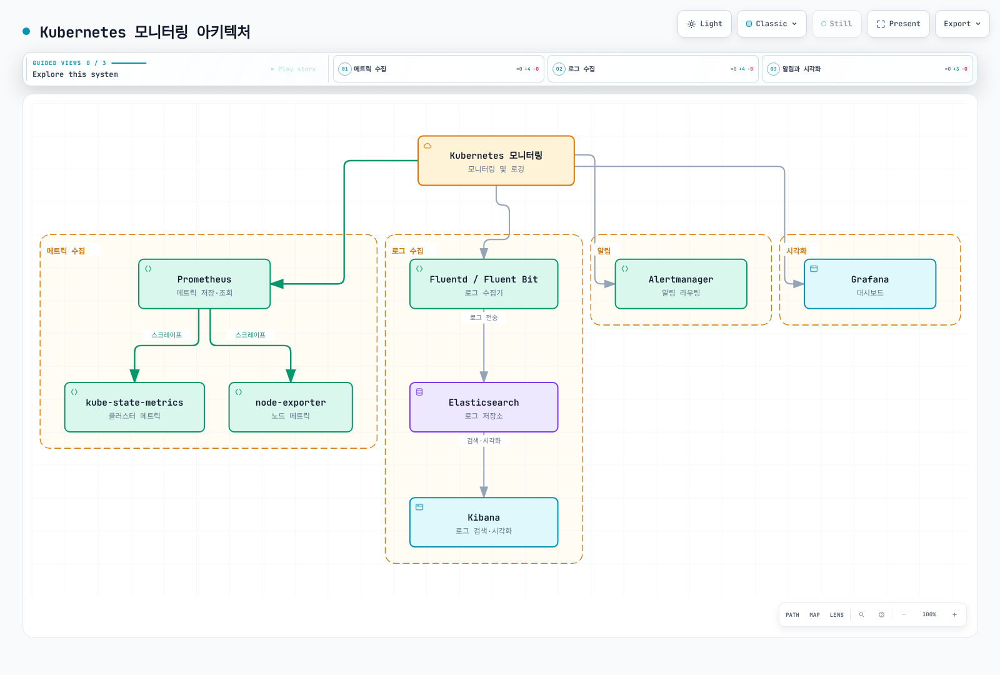

[🔍 인터랙티브 다이어그램 보기](https://www.atomai.click/kubernetes-docs/archmaps/ko-core-09-cluster-administration-11.html)

### Prometheus 및 Grafana 설치

```bash
# Helm을 사용한 Prometheus 및 Grafana 설치
helm repo add prometheus-community https://prometheus-community.github.io/helm-charts
helm repo update

helm install prometheus prometheus-community/kube-prometheus-stack \
  --namespace monitoring \
  --create-namespace \
  --set grafana.enabled=true \
  --set prometheus.service.type=ClusterIP

# 서비스 확인
kubectl get svc -n monitoring

# Grafana 접근 (포트 포워딩 사용)
kubectl port-forward svc/prometheus-grafana 3000:80 -n monitoring
# 구성된 Grafana Secret에서 자격 증명을 확인하고 공개된 기본 비밀번호를 가정하지 마세요
```

### EFK 스택 설치 (Elasticsearch, Fluentd, Kibana)

독립 Elastic Stack Helm 차트 저장소는 보관 상태입니다. 유지 관리되는 배포에는 Elastic Cloud on Kubernetes(ECK)를 사용하고 Elasticsearch·Kibana 리소스와 호환 로그 수집기를 별도로 정의하세요. 오퍼레이터 설치만으로 EFK 스택이 생성되지는 않습니다:

```bash
helm repo add elastic https://helm.elastic.co
helm upgrade --install elastic-operator elastic/eck-operator \
  --namespace elastic-system --create-namespace \
  --version "${ECK_CHART_VERSION:?Select a supported ECK chart version}"
```

대시보드는 ClusterIP·인증된 접근으로 보호하고 [ECK 문서](https://www.elastic.co/docs/deploy-manage/deploy/cloud-on-k8s/install-using-helm-chart)에 따라 스토리지·TLS·자격 증명·수집기 파서·RBAC를 구성하세요.

### 주요 모니터링 메트릭

| 메트릭 유형 | 설명 | 주요 메트릭 | 모니터링 도구 |
|------------|------|------------|--------------|
| **노드 메트릭** | 노드 수준 리소스 사용량 | CPU, 메모리, 디스크, 네트워크 | node-exporter, Prometheus |
| **파드 메트릭** | 컨테이너 리소스 사용량 | CPU, 메모리 사용량, 제한 | cAdvisor, Prometheus |
| **클러스터 메트릭** | 클러스터 상태 및 리소스 | 파드 수, 노드·객체 상태, 원하는·현재 복제본 수 | kube-state-metrics |
| **애플리케이션 메트릭** | 사용자 정의 애플리케이션 메트릭 | 요청 수, 지연 시간, 오류율 | Prometheus 클라이언트 라이브러리 |

### 로그 수집 및 분석

```bash
# 특정 파드의 로그 확인
kubectl logs <pod-name> -n <namespace>

# 이전 인스턴스의 로그 확인
kubectl logs <pod-name> -n <namespace> --previous

# 특정 컨테이너의 로그 확인 (다중 컨테이너 파드)
kubectl logs <pod-name> -c <container-name> -n <namespace>

# 로그 스트리밍
kubectl logs -f <pod-name> -n <namespace>

# 모든 파드의 로그 확인 (레이블 선택자 사용)
kubectl logs -l app=nginx -n <namespace>
```

### 알림 구성

Prometheus Alertmanager를 사용하여 알림을 구성할 수 있습니다:

monitoring에 `url` 키를 가진 보호된 `slack-webhook` Secret을 생성한 뒤 다음 Helm values를 기존 kube-prometheus-stack 릴리스 설정에 병합하세요. 웹훅 URL은 Git에 저장하지 않습니다. 독립 ConfigMap만 생성해서는 오퍼레이터가 자동으로 사용하지 않습니다.

```yaml
# alertmanager-values.yaml
alertmanager:
  alertmanagerSpec:
    secrets:
    - slack-webhook
  config:
    global:
      resolve_timeout: 5m
      slack_api_url_file: /etc/alertmanager/secrets/slack-webhook/url
    route:
      receiver: slack-notifications
      group_wait: 30s
      group_interval: 5m
      repeat_interval: 4h
      group_by: [alertname, cluster, service]
    receivers:
    - name: slack-notifications
      slack_configs:
      - channel: '#alerts'
        send_resolved: true
        title: '{{ range .Alerts }}{{ .Annotations.summary }}{{ end }}'
        text: '{{ range .Alerts }}{{ .Annotations.description }}{{ end }}'
```

업그레이드 시 현재 차트 버전과 다른 설정을 유지하고 알림에 의존하기 전에 Alertmanager 재로드·상태를 확인하세요.
## 문제 해결

Kubernetes 클러스터 문제 해결은 시스템 관리자와 운영자에게 중요한 기술입니다. 효과적인 문제 해결을 위해 체계적인 접근 방식이 필요합니다.

### 문제 해결 방법론

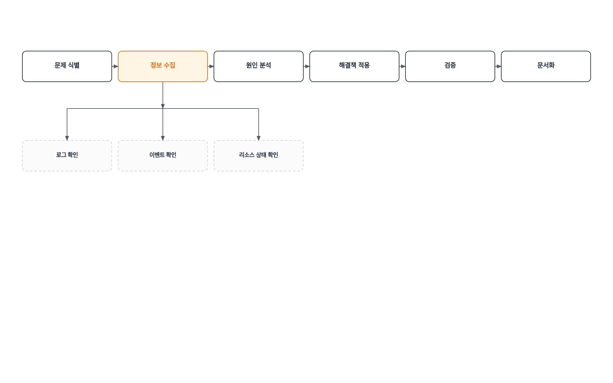

[🔍 인터랙티브 다이어그램 보기](https://www.atomai.click/kubernetes-docs/archmaps/ko-core-09-cluster-administration-12.html)

### 일반적인 문제 및 해결 방법

| 문제 유형 | 증상 | 진단 명령어 | 일반적인 해결 방법 |
|----------|------|------------|-----------------|
| **파드가 시작되지 않음** | 파드가 Pending 또는 ContainerCreating 상태 | `kubectl describe pod <pod-name>` | 리소스 제약 확인, 이미지 가용성 확인, 볼륨 마운트 확인 |
| **서비스 연결 문제** | 서비스를 통해 파드에 접근할 수 없음 | `kubectl describe svc <service-name>`, `kubectl get endpointslices -l kubernetes.io/service-name=<service-name>` | 레이블 선택자 확인, 파드 상태 확인, 네트워크 정책 확인 |
| **노드 문제** | 노드가 NotReady 상태 | `kubectl describe node <node-name>`, `kubectl get events` | kubelet 상태 확인, 시스템 리소스 확인, 네트워크 연결 확인 |
| **DNS 문제** | 서비스 이름으로 연결할 수 없음 | `kubectl exec -it <pod-name> -- nslookup kubernetes.default` | CoreDNS 파드 확인, kube-dns 서비스 확인, 네트워크 정책 확인 |
| **인증·인가 문제** | API 서버 접근 거부 | `kubectl auth can-i <verb> <resource>` | RBAC 설정 확인, 인증서 유효성 확인, 서비스 계정 확인 |

### 파드 문제 해결

```bash
# 파드 상태 확인
kubectl get pod <pod-name> -o wide

# 파드 세부 정보 확인
kubectl describe pod <pod-name>

# 파드 로그 확인
kubectl logs <pod-name>
kubectl logs <pod-name> --previous  # 이전 컨테이너의 로그

# 파드 내 명령 실행
kubectl exec -it <pod-name> -- /bin/sh

# 파드 이벤트 확인
kubectl get events --field-selector involvedObject.name=<pod-name>
```

### 노드 문제 해결

```bash
# 노드 상태 확인
kubectl get nodes
kubectl describe node <node-name>

# 노드 리소스 사용량 확인
kubectl top node <node-name>

# 노드 시스템 로그 확인 (SSH 접속 필요)
ssh <node-ip> 'sudo journalctl -u kubelet'

# kubelet 상태 확인 (SSH 접속 필요)
ssh <node-ip> 'sudo systemctl status kubelet'
```

### 네트워킹 문제 해결

```bash
# 서비스 및 엔드포인트 확인
kubectl get svc <service-name>
kubectl get endpointslices -l kubernetes.io/service-name=<service-name>

# DNS 문제 해결
kubectl run -it --rm dns-test --image=busybox -- sh
# 컨테이너 내에서
nslookup kubernetes.default.svc.cluster.local
cat /etc/resolv.conf

# 네트워크 연결 테스트
kubectl run -it --rm network-test --image=nicolaka/netshoot -- sh
# 컨테이너 내에서
ping <target-ip>
traceroute <target-ip>
curl <service-name>:<port>
```
## Amazon EKS 클러스터 관리

Amazon EKS(Elastic Kubernetes Service)는 AWS에서 관리하는 Kubernetes 서비스로, 컨트롤 플레인 관리를 AWS가 담당합니다. 노드 관리 책임은 관리형 노드 그룹, Auto Mode, Fargate, 자체 관리형 컴퓨팅에 따라 달라지며 워크로드 보안·구성은 고객 책임입니다.

### EKS 클러스터 아키텍처

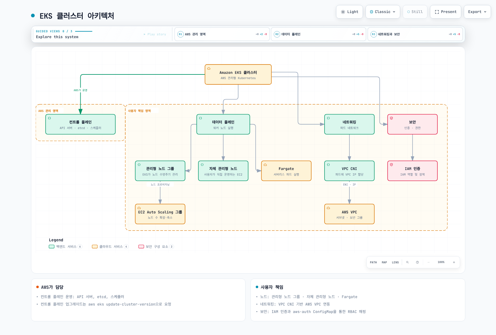

[🔍 인터랙티브 다이어그램 보기](https://www.atomai.click/kubernetes-docs/archmaps/ko-core-09-cluster-administration-13.html)

### EKS 클러스터 생성

```bash
# eksctl을 사용한 클러스터 생성
eksctl create cluster \
  --name my-cluster \
  --version 1.36 \
  --region us-west-2 \
  --nodegroup-name standard-workers \
  --node-type t3.medium \
  --nodes 3 \
  --nodes-min 1 \
  --nodes-max 5 \
  --managed

# 대안: AWS CLI로 컨트롤 플레인 생성 (위 eksctl 예시 이후 중복 실행하지 않음)
aws eks create-cluster \
  --name my-cluster \
  --role-arn arn:aws:iam::123456789012:role/eks-cluster-role \
  --kubernetes-version 1.36 \
  --resources-vpc-config "subnetIds=${EKS_SUBNET_IDS:?Set two or more appropriate subnets},securityGroupIds=${EKS_SECURITY_GROUP_ID:?Set the intended security group},endpointPrivateAccess=true,endpointPublicAccess=true,publicAccessCidrs=${ADMIN_CIDR:?Set an approved administrator public CIDR}"
```

### 노드 그룹 관리

```bash
# 관리형 노드 그룹 생성
eksctl create nodegroup \
  --cluster my-cluster \
  --region us-west-2 \
  --name my-nodegroup \
  --node-type t3.medium \
  --nodes 3 \
  --nodes-min 1 \
  --nodes-max 5

# 노드 그룹 확장
eksctl scale nodegroup \
  --cluster my-cluster \
  --name my-nodegroup \
  --nodes 5 \
  --region us-west-2

# 노드 그룹 업데이트
aws eks update-nodegroup-version \
  --cluster-name my-cluster \
  --nodegroup-name my-nodegroup \
  --region us-west-2
```

### EKS 클러스터 업그레이드

```bash
# 클러스터 버전 확인
aws eks describe-cluster --name my-cluster --query "cluster.version"

# 클러스터 컨트롤 플레인 업그레이드
aws eks update-cluster-version \
  --name my-cluster \
  --kubernetes-version "${TARGET_VERSION:?Select the next EKS-supported minor version}"

# 관리형 노드 그룹 업그레이드
aws eks update-nodegroup-version \
  --cluster-name my-cluster \
  --nodegroup-name my-nodegroup
```

### EKS 클러스터 인증 및 권한

클러스터 인증 모드는 `API` 또는 `API_AND_CONFIG_MAP`이어야 합니다. 기존 관리자·노드 접근을 보존하며 레거시 aws-auth 매핑 전환을 계획하세요. 다음은 조회용 역할에 default 네임스페이스만 허용하는 예시입니다:

```bash
aws eks describe-cluster --name my-cluster --query cluster.accessConfig.authenticationMode
aws eks create-access-entry --cluster-name my-cluster \
  --principal-arn arn:aws:iam::123456789012:role/cluster-viewer --type STANDARD
aws eks associate-access-policy --cluster-name my-cluster \
  --principal-arn arn:aws:iam::123456789012:role/cluster-viewer \
  --policy-arn arn:aws:eks::aws:cluster-access-policy/AmazonEKSViewPolicy \
  --access-scope type=namespace,namespaces=default
```

[EKS 액세스 항목 문서](https://docs.aws.amazon.com/eks/latest/userguide/access-entries.html)를 참고하세요. EKS 접근 항목을 관리하는 권한과 Kubernetes 워크로드 권한은 별개입니다.

### EKS 클러스터 모니터링

컨트롤 플레인 로깅은 api/audit/authenticator/controllerManager/scheduler 로그를 내보냅니다. Container Insights에는 CloudWatch 에이전트·애드온과 제한된 텔레메트리 IAM 권한이 필요하며 update-cluster-logging으로 활성화되지 않습니다. CloudWatch 관측 애드온은 Prometheus/Grafana가 아닌 CloudWatch·Fluent Bit 구성 요소를 설치합니다([공식 설치 문서](https://docs.aws.amazon.com/AmazonCloudWatch/latest/monitoring/install-CloudWatch-Observability-EKS-addon.html)).

```bash
# EKS 컨트롤 플레인 로그 활성화
eksctl utils update-cluster-logging \
  --enable-types all \
  --cluster my-cluster \
  --region us-west-2

# CloudWatch 관측 기능 설치 (Prometheus/Grafana가 아님)
aws eks create-addon \
  --cluster-name my-cluster \
  --addon-name amazon-cloudwatch-observability \
  --addon-version "${CLOUDWATCH_ADDON_VERSION:?Select a compatible add-on version}"
```
## 클러스터 관리 모범 사례

효과적인 Kubernetes 클러스터 관리를 위한 모범 사례는 안정성, 보안, 성능을 보장하는 데 중요합니다.

### 클러스터 설정 모범 사례

1. **다중 가용 영역 구성**: 고가용성을 위해 노드를 여러 가용 영역에 분산
2. **적절한 크기 조정**: 워크로드에 맞는 노드 유형 및 수 선택
3. **자동 확장 구성**: 클러스터 자동 확장기 및 수평적 파드 자동 확장기 활성화
4. **네트워크 정책 적용**: 기본 거부 정책으로 시작하고 필요한 통신만 허용
5. **리소스 쿼터 설정**: 네임스페이스별 리소스 제한 설정

### 운영 모범 사례

1. **선언적 구성 사용**: 모든 리소스를 YAML 파일로 정의하고 버전 관리
2. **GitOps 채택**: Git을 단일 진실 소스로 사용하고 자동화된 배포 파이프라인 구축
3. **정기적인 백업**: etcd 데이터와 영구 볼륨 데이터 정기적 백업
4. **모니터링 및 알림**: 포괄적인 모니터링 시스템 구축 및 주요 메트릭에 대한 알림 설정
5. **로깅 중앙화**: 모든 로그를 중앙 로깅 시스템으로 수집하여 분석 용이성 확보

### 보안 모범 사례

1. **최소 권한 원칙**: RBAC를 사용하여 필요한 최소 권한만 부여
2. **네트워크 세분화**: 네트워크 정책을 사용하여 파드 간 통신 제한
3. **이미지 스캐닝**: 취약점 검사를 위한 컨테이너 이미지 스캐닝 구현
4. **시크릿 관리**: 외부 시크릿 관리 도구 사용 (예: AWS Secrets Manager, HashiCorp Vault)
5. **정기적인 보안 감사**: 클러스터 구성 및 권한에 대한 정기적인 감사 수행

### 업그레이드 모범 사례

1. **점진적 업그레이드**: 한 번에 모든 것을 업그레이드하지 않고 점진적으로 진행
2. **테스트 환경 먼저**: 프로덕션 환경 전에 테스트 환경에서 업그레이드 검증
3. **백업 생성**: 업그레이드 전 전체 백업 수행
4. **롤백 계획**: 문제 발생 시 이전 버전으로 롤백할 수 있는 계획 수립
5. **업그레이드 창 설정**: 사용량이 적은 시간대에 업그레이드 수행

### 비용 최적화 모범 사례

1. **적절한 노드 크기 선택**: 워크로드에 맞는 최적의 노드 유형 선택
2. **스팟 인스턴스 활용**: 비중요 워크로드에 스팟 인스턴스 사용
3. **자동 확장 구성**: 수요에 따라 자동으로 확장 및 축소하도록 구성
4. **리소스 요청 및 제한 최적화**: 실제 사용량에 기반한 리소스 요청 및 제한 설정
5. **유휴 리소스 식별**: 정기적으로 유휴 리소스를 식별하고 제거

### 문서화 모범 사례

1. **아키텍처 문서화**: 클러스터 아키텍처, 네트워킹, 보안 설정 문서화
2. **운영 절차 문서화**: 일반적인 운영 작업, 문제 해결 절차, 비상 대응 계획 문서화
3. **변경 관리**: 모든 클러스터 변경 사항 기록 및 추적
4. **런북 작성**: 일반적인 시나리오에 대한 단계별 가이드 제공
5. **지식 공유**: 팀 내 지식 공유 및 교육 세션 정기적 진행
## 결론

Kubernetes 클러스터 관리는 다양한 측면을 포함하는 복잡한 작업입니다. 클러스터의 설정부터 운영, 모니터링, 문제 해결, 업그레이드에 이르기까지 체계적인 접근 방식이 필요합니다.

효과적인 클러스터 관리를 위해서는 다음 핵심 영역에 집중해야 합니다:

1. **클러스터 구성요소 관리**: 컨트롤 플레인 및 노드 구성요소의 안정적인 운영
2. **리소스 관리**: 효율적인 리소스 할당 및 사용
3. **네트워킹**: 안전하고 효율적인 네트워크 구성
4. **보안**: 적절한 인증 및 권한 관리
5. **백업 및 복구**: 데이터 손실 방지 및 재해 복구 계획
6. **모니터링 및 로깅**: 클러스터 상태 및 성능 모니터링
7. **문제 해결**: 체계적인 문제 해결 접근 방식

특히 Amazon EKS와 같은 관리형 Kubernetes 서비스를 사용할 때는 서비스 제공자와 사용자 간의 책임 분담 모델을 이해하는 것이 중요합니다. AWS가 컨트롤 플레인을 관리하며 컴퓨팅 책임은 모드에 따라 달라집니다. 애플리케이션 구성·보안은 고객이 관리합니다.

모범 사례를 따르고 적절한 도구를 활용하면 안정적이고 안전하며 효율적인 Kubernetes 클러스터를 운영할 수 있습니다. 지속적인 학습과 개선을 통해 클러스터 관리 역량을 향상시키는 것이 중요합니다.

---

> **참고 자료**:
> - [Kubernetes 공식 문서: 클러스터 관리](https://kubernetes.io/docs/tasks/administer-cluster/)
> - [Amazon EKS 사용 설명서](https://docs.aws.amazon.com/eks/latest/userguide/what-is-eks.html)
> - [Kubernetes 모범 사례: 클러스터 관리](https://kubernetes.io/docs/setup/best-practices/)
> - [etcd 문서: 백업 및 복구](https://etcd.io/docs/v3.5/op-guide/recovery/)
> - [Prometheus 문서](https://prometheus.io/docs/introduction/overview/)

## 퀴즈

이 장에서 배운 내용을 테스트하려면 [클러스터 관리 퀴즈](../quizzes/core/09-cluster-administration-quiz.md)를 풀어보세요.
