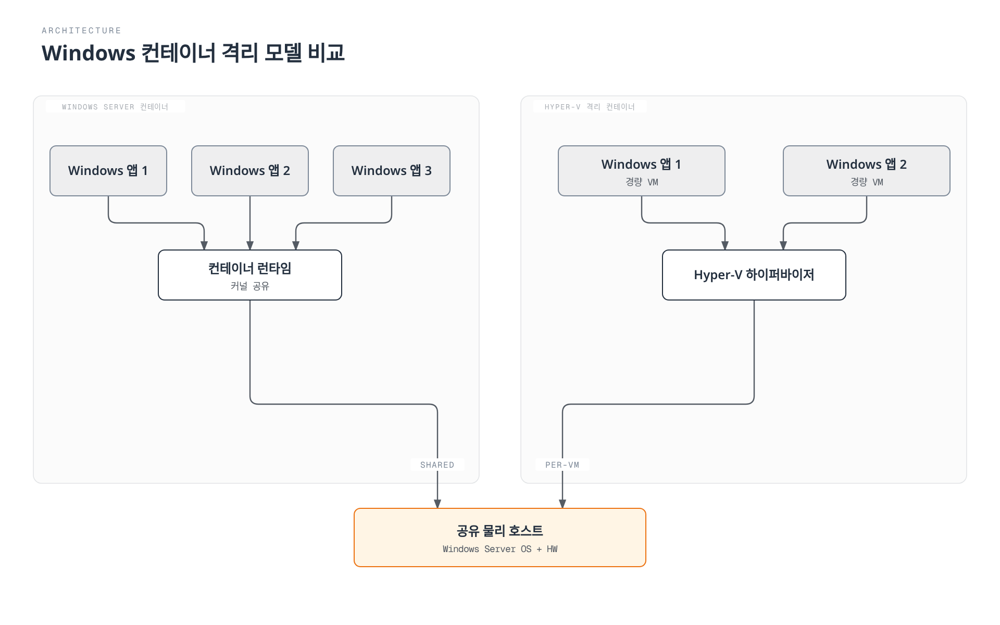
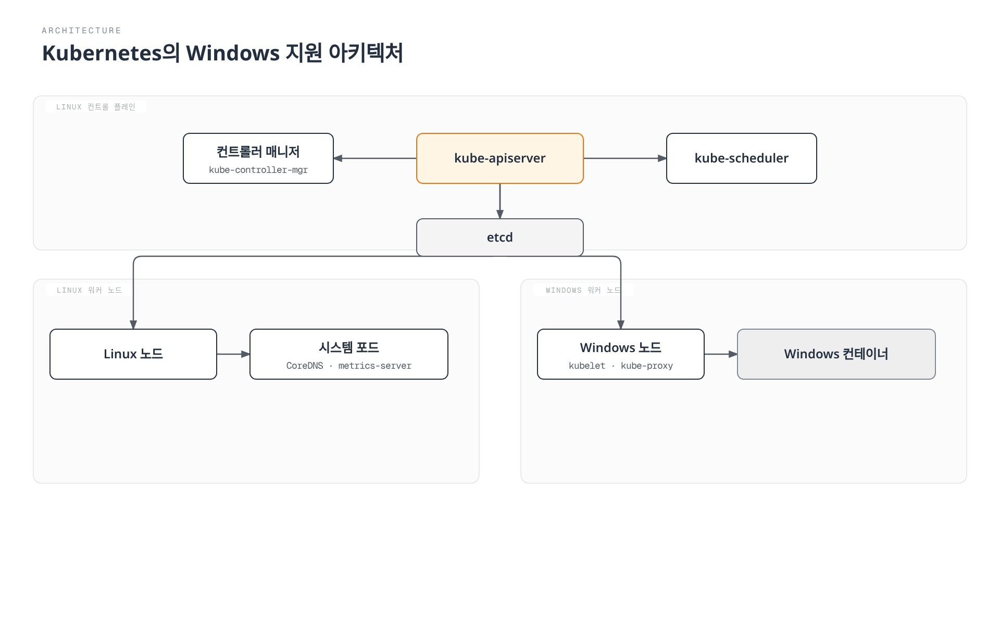
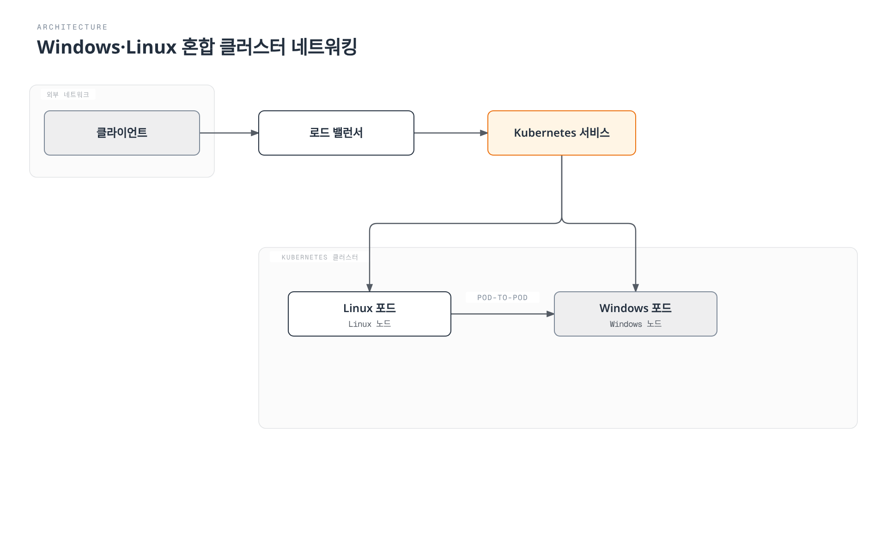
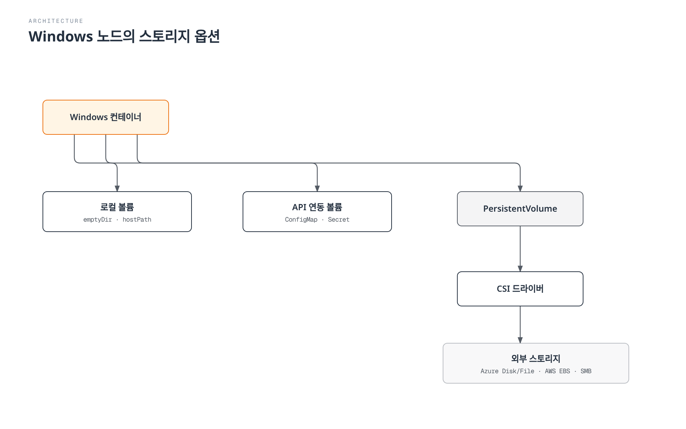
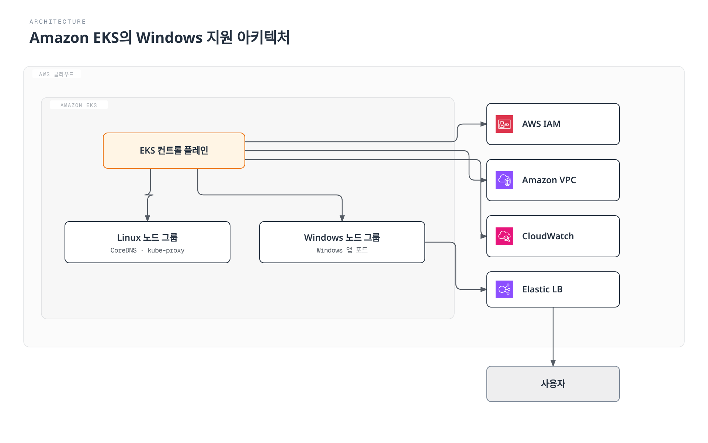

# Windows in Kubernetes

> **지원 버전**: Kubernetes 1.32, 1.33, 1.34
> **마지막 업데이트**: 2026년 2월 11일

Kubernetes는 원래 Linux 컨테이너를 위해 설계되었지만, 버전 1.14부터 Windows 컨테이너에 대한 프로덕션 지원이 추가되었습니다. 이 장에서는 Kubernetes에서 Windows 워크로드를 실행하는 방법, 아키텍처, 제한 사항, 그리고 Amazon EKS에서의 Windows 지원에 대해 알아보겠습니다.

## 목차
1. [Windows 컨테이너 개요](#windows-컨테이너-개요)
2. [Kubernetes의 Windows 지원 아키텍처](#kubernetes의-windows-지원-아키텍처)
3. [Windows 노드 제한 사항](#windows-노드-제한-사항)
4. [Windows 노드 설정](#windows-노드-설정)
5. [Windows 컨테이너 배포](#windows-컨테이너-배포)
6. [네트워킹](#네트워킹)
7. [스토리지](#스토리지)
8. [모니터링 및 로깅](#모니터링-및-로깅)
9. [보안](#보안)
10. [Amazon EKS에서의 Windows 지원](#amazon-eks에서의-windows-지원)
11. [모범 사례](#모범-사례)
12. [결론](#결론)

## Windows 컨테이너 개요

Windows 컨테이너는 Windows 운영 체제에서 실행되는 컨테이너로, Windows 애플리케이션을 컨테이너화하여 배포할 수 있게 해줍니다.

### Windows 컨테이너 유형

Windows 컨테이너에는 두 가지 유형이 있습니다:

1. **Windows Server 컨테이너**: Linux 컨테이너와 유사하게 호스트 OS 커널을 공유합니다. 가볍고 빠르게 시작되지만, 호스트와 동일한 Windows 버전이 필요합니다.

2. **Hyper-V 격리 컨테이너**: 각 컨테이너가 경량 VM에서 실행되어 더 높은 수준의 격리를 제공합니다. 호스트와 다른 Windows 버전을 실행할 수 있지만, 더 많은 리소스를 사용합니다.

다음 다이어그램은 두 가지 Windows 컨테이너 유형의 아키텍처 차이를 보여줍니다:



### Windows 컨테이너 이미지

Windows 컨테이너 이미지는 Microsoft에서 제공하는 기본 이미지를 기반으로 합니다:

1. **Windows Server Core**: 최소한의 Windows Server 환경을 제공하는 경량 이미지
2. **Nano Server**: 더 작은 공간을 차지하는 초경량 이미지
3. **Windows**: 전체 Windows Server 환경을 제공하는 이미지

예시 Dockerfile:

```dockerfile
FROM mcr.microsoft.com/windows/servercore:ltsc2019
WORKDIR /app
COPY . .
RUN powershell -Command "Install-WindowsFeature Web-Server"
EXPOSE 80
CMD ["powershell", "-Command", "Start-Service W3SVC; Get-Content -Path 'C:\\inetpub\\logs\\LogFiles\\W3SVC1\\u_ex*' -Wait"]
```

## Kubernetes의 Windows 지원 아키텍처

Kubernetes에서 Windows 지원은 혼합 환경을 기반으로 합니다. 컨트롤 플레인 구성 요소는 항상 Linux에서 실행되며, 워커 노드는 Linux 또는 Windows일 수 있습니다.

### 아키텍처 개요

Kubernetes의 Windows 지원 아키텍처는 다음과 같습니다:

1. **Linux 컨트롤 플레인**: kube-apiserver, kube-controller-manager, kube-scheduler, etcd는 항상 Linux에서 실행됩니다.
2. **Linux 워커 노드**: 시스템 구성 요소(CoreDNS, metrics-server 등)를 실행합니다.
3. **Windows 워커 노드**: Windows 애플리케이션 워크로드를 실행합니다.



### Windows 노드 구성 요소

Windows 노드에서 실행되는 Kubernetes 구성 요소:

1. **kubelet**: 노드에서 포드 및 컨테이너 관리
2. **kube-proxy**: 네트워크 규칙 관리
3. **CNI 플러그인**: 네트워킹 구성
4. **CSI 플러그인**: 스토리지 관리

## Windows 노드 제한 사항

Kubernetes에서 Windows 노드를 사용할 때 알아야 할 몇 가지 제한 사항이 있습니다.

### 기능 제한 사항

1. **특권 컨테이너**: Windows는 특권 컨테이너를 지원하지 않습니다.
2. **호스트 네트워크 모드**: Windows 포드는 호스트 네트워크 모드를 사용할 수 없습니다.
3. **포드 보안 컨텍스트**: 일부 보안 컨텍스트 기능(runAsUser, fsGroup 등)은 지원되지 않습니다.
4. **DaemonSet**: Windows 노드에서 실행되는 DaemonSet은 특별한 고려 사항이 필요합니다.
5. **emptyDir 볼륨**: Windows에서는 메모리 기반 emptyDir 볼륨이 지원되지 않습니다.
6. **리소스 제한**: Windows에서는 CPU 제한이 다르게 적용됩니다.

### 네트워킹 제한 사항

1. **네트워크 모드**: Windows는 L3 네트워킹만 지원합니다.
2. **서비스 유형**: Windows 노드는 일부 서비스 유형에 제한이 있습니다.
3. **로드 밸런싱**: 일부 로드 밸런싱 기능이 제한될 수 있습니다.

### 운영 체제 버전 호환성

Windows 컨테이너는 호스트 OS 버전과의 호환성이 중요합니다:

| 컨테이너 기본 이미지 | 호환되는 호스트 OS 버전 |
|-------------------|----------------------|
| Windows Server 2019 | Windows Server 2019 |
| Windows Server 2022 | Windows Server 2022 |

Hyper-V 격리를 사용하면 이러한 제한을 완화할 수 있지만, 추가 리소스가 필요합니다.
## Windows 노드 설정

Kubernetes 클러스터에 Windows 노드를 추가하는 과정을 알아보겠습니다.

### 사전 요구 사항

Windows 노드를 설정하기 전에 다음 사항을 확인해야 합니다:

1. **Kubernetes 버전**: 1.14 이상
2. **Windows 버전**: Windows Server 2019 이상
3. **네트워크 플러그인**: Windows를 지원하는 CNI 플러그인(Calico, Flannel 등)
4. **컨테이너 런타임**: Docker, containerd 등

### Windows 노드 준비

Windows 노드를 준비하는 단계:

1. **Windows Server 설치**: Windows Server 2019 이상 설치
2. **컨테이너 기능 활성화**:

```powershell
Install-WindowsFeature -Name Containers
Restart-Computer -Force
```

3. **Docker 설치**:

```powershell
Install-Module -Name DockerMsftProvider -Repository PSGallery -Force
Install-Package -Name Docker -ProviderName DockerMsftProvider -Force
Restart-Computer -Force
```

4. **Kubernetes 구성 요소 설치**:

```powershell
# 디렉토리 생성
mkdir -p c:\k

# kubelet, kubeadm, kubectl 다운로드
curl.exe -LO https://dl.k8s.io/v1.22.0/bin/windows/amd64/kubelet.exe
curl.exe -LO https://dl.k8s.io/v1.22.0/bin/windows/amd64/kubectl.exe
curl.exe -LO https://dl.k8s.io/v1.22.0/bin/windows/amd64/kube-proxy.exe
curl.exe -LO https://github.com/kubernetes-sigs/sig-windows-tools/releases/latest/download/wins.exe

# 파일을 C:\k로 이동
mv kubelet.exe C:\k
mv kubectl.exe C:\k
mv kube-proxy.exe C:\k
mv wins.exe C:\k
```

5. **네트워크 구성**:

```powershell
# 방화벽 규칙 설정
New-NetFirewallRule -Name kubelet -DisplayName 'kubelet' -Enabled True -Direction Inbound -Protocol TCP -Action Allow -LocalPort 10250
New-NetFirewallRule -Name https -DisplayName 'https' -Enabled True -Direction Inbound -Protocol TCP -Action Allow -LocalPort 443
New-NetFirewallRule -Name http -DisplayName 'http' -Enabled True -Direction Inbound -Protocol TCP -Action Allow -LocalPort 80
```

### kubeadm을 사용한 Windows 노드 조인

Linux 컨트롤 플레인에서 조인 토큰 생성:

```bash
kubeadm token create --print-join-command
```

Windows 노드에서 조인 명령 실행:

```powershell
# kubeadm 조인 명령 실행
kubeadm join <control-plane-host>:<control-plane-port> --token <token> --discovery-token-ca-cert-hash sha256:<hash>

# kubelet 서비스 등록 및 시작
sc.exe create kubelet binPath= "C:\k\kubelet.exe --windows-service --kubeconfig=C:\k\config"
Start-Service kubelet
```

### Windows 노드 레이블 설정

Windows 노드에 적절한 레이블을 설정하여 워크로드 스케줄링을 제어합니다:

```bash
kubectl label node <windows-node-name> kubernetes.io/os=windows
kubectl label node <windows-node-name> kubernetes.io/arch=amd64
```

## Windows 컨테이너 배포

Windows 컨테이너를 Kubernetes에 배포하는 방법을 알아보겠습니다.

### 노드 셀렉터 사용

Windows 워크로드를 배포할 때는 노드 셀렉터를 사용하여 Windows 노드에 스케줄링되도록 해야 합니다:

```yaml
apiVersion: apps/v1
kind: Deployment
metadata:
  name: iis-deployment
spec:
  replicas: 2
  selector:
    matchLabels:
      app: iis
  template:
    metadata:
      labels:
        app: iis
    spec:
      nodeSelector:
        kubernetes.io/os: windows
      containers:
      - name: iis
        image: mcr.microsoft.com/windows/servercore/iis:windowsservercore-ltsc2019
        resources:
          limits:
            cpu: 1
            memory: 800Mi
          requests:
            cpu: .1
            memory: 300Mi
        ports:
        - containerPort: 80
```

### 리소스 요청 및 제한

Windows 컨테이너의 리소스 요청 및 제한은 Linux 컨테이너와 다르게 처리됩니다:

1. **CPU 제한**: Windows에서는 CPU 제한이 다르게 적용됩니다. 예를 들어, CPU 제한이 1이면 단일 CPU 코어의 100%를 사용할 수 있습니다.
2. **메모리 제한**: Windows 컨테이너는 메모리 제한을 준수하지만, 일부 시스템 프로세스로 인해 추가 오버헤드가 발생할 수 있습니다.

### 컨테이너 사용자 지정

Windows 컨테이너에서 사용자 지정 스크립트 실행:

```yaml
apiVersion: v1
kind: Pod
metadata:
  name: windows-custom-script
spec:
  nodeSelector:
    kubernetes.io/os: windows
  containers:
  - name: windows-container
    image: mcr.microsoft.com/windows/servercore:ltsc2019
    command:
    - powershell.exe
    - -Command
    - |
      while ($true) {
        Write-Host "Hello from Windows container"
        Start-Sleep -Seconds 10
      }
```

### 다중 컨테이너 포드

Windows에서도 다중 컨테이너 포드를 지원하지만, 일부 제한 사항이 있습니다:

```yaml
apiVersion: v1
kind: Pod
metadata:
  name: windows-multi-container
spec:
  nodeSelector:
    kubernetes.io/os: windows
  containers:
  - name: web
    image: mcr.microsoft.com/windows/servercore/iis:windowsservercore-ltsc2019
    ports:
    - containerPort: 80
  - name: logger
    image: mcr.microsoft.com/windows/servercore:ltsc2019
    command:
    - powershell.exe
    - -Command
    - |
      while ($true) {
        Get-Content -Path 'C:\inetpub\logs\LogFiles\W3SVC1\u_ex*' -Wait
      }
```

## 네트워킹

Windows 노드의 네트워킹은 Linux 노드와 다른 특성을 가집니다.

다음 다이어그램은 Windows 노드와 Linux 노드가 혼합된 Kubernetes 클러스터의 네트워킹 아키텍처를 보여줍니다:



### 지원되는 네트워크 플러그인

Windows 노드에서 지원되는 네트워크 플러그인:

1. **Flannel**: VXLAN 또는 host-gw 모드
2. **Calico**: VXLAN 모드
3. **Antrea**: OVS 기반 네트워킹
4. **Azure CNI**: Azure 환경에서 사용
5. **AWS VPC CNI**: AWS 환경에서 사용

### Flannel 설정 예시

Flannel을 사용한 Windows 네트워킹 설정:

```yaml
apiVersion: apps/v1
kind: DaemonSet
metadata:
  name: kube-flannel-ds-windows
  namespace: kube-system
  labels:
    tier: node
    app: flannel
spec:
  selector:
    matchLabels:
      app: flannel
  template:
    metadata:
      labels:
        tier: node
        app: flannel
    spec:
      affinity:
        nodeAffinity:
          requiredDuringSchedulingIgnoredDuringExecution:
            nodeSelectorTerms:
            - matchExpressions:
              - key: kubernetes.io/os
                operator: In
                values:
                - windows
      hostNetwork: true
      containers:
      - name: kube-flannel
        image: sigwindowstools/flannel:v0.13.0
        command:
        - powershell
        args:
        - -file
        - /opt/bin/flannel-host.ps1
        env:
        - name: POD_NAME
          valueFrom:
            fieldRef:
              fieldPath: metadata.name
        - name: POD_NAMESPACE
          valueFrom:
            fieldRef:
              fieldPath: metadata.namespace
        volumeMounts:
        - name: host-run
          mountPath: /run
        - name: cni
          mountPath: /etc/cni/net.d
        - name: flannel-cfg
          mountPath: /etc/kube-flannel/
      volumes:
      - name: host-run
        hostPath:
          path: /run
      - name: cni
        hostPath:
          path: /etc/cni/net.d
      - name: flannel-cfg
        configMap:
          name: kube-flannel-cfg
```

### 서비스 노출

Windows 노드에서 서비스를 노출하는 방법:

```yaml
apiVersion: v1
kind: Service
metadata:
  name: iis-service
spec:
  selector:
    app: iis
  ports:
  - port: 80
    targetPort: 80
  type: LoadBalancer
```

### 네트워크 정책

Windows 노드에서 네트워크 정책을 사용하려면 네트워크 정책을 지원하는 CNI 플러그인(예: Calico)이 필요합니다:

```yaml
apiVersion: networking.k8s.io/v1
kind: NetworkPolicy
metadata:
  name: allow-frontend-to-backend
  namespace: default
spec:
  podSelector:
    matchLabels:
      app: backend
      os: windows
  ingress:
  - from:
    - podSelector:
        matchLabels:
          app: frontend
    ports:
    - protocol: TCP
      port: 80
```

## 스토리지

Windows 노드에서 사용할 수 있는 스토리지 옵션을 알아보겠습니다.

다음 다이어그램은 Windows 노드에서 사용 가능한 다양한 스토리지 옵션을 보여줍니다:



### 지원되는 볼륨 유형

Windows 노드에서 지원되는 볼륨 유형:

1. **emptyDir**: 임시 스토리지 (메모리 기반 emptyDir은 지원되지 않음)
2. **hostPath**: 호스트 노드의 파일 시스템
3. **configMap**: 구성 데이터
4. **secret**: 민감한 데이터
5. **azureFile**: Azure File 스토리지
6. **awsElasticBlockStore**: AWS EBS 볼륨
7. **azureDisk**: Azure Disk 스토리지
8. **CSI**: Container Storage Interface 드라이버

### emptyDir 볼륨 예시

```yaml
apiVersion: v1
kind: Pod
metadata:
  name: windows-emptydir
spec:
  nodeSelector:
    kubernetes.io/os: windows
  containers:
  - name: windows-container
    image: mcr.microsoft.com/windows/servercore:ltsc2019
    volumeMounts:
    - name: temp-volume
      mountPath: C:\temp
    command:
    - powershell.exe
    - -Command
    - |
      Set-Content -Path C:\temp\test.txt -Value "Hello from Windows"
      while ($true) {
        Get-Content -Path C:\temp\test.txt
        Start-Sleep -Seconds 10
      }
  volumes:
  - name: temp-volume
    emptyDir: {}
```

### hostPath 볼륨 예시

```yaml
apiVersion: v1
kind: Pod
metadata:
  name: windows-hostpath
spec:
  nodeSelector:
    kubernetes.io/os: windows
  containers:
  - name: windows-container
    image: mcr.microsoft.com/windows/servercore:ltsc2019
    volumeMounts:
    - name: logs-volume
      mountPath: C:\logs
    command:
    - powershell.exe
    - -Command
    - |
      Set-Content -Path C:\logs\app.log -Value "Application log"
      while ($true) {
        Add-Content -Path C:\logs\app.log -Value "Log entry at $(Get-Date)"
        Start-Sleep -Seconds 10
      }
  volumes:
  - name: logs-volume
    hostPath:
      path: C:\k\logs
      type: DirectoryOrCreate
```

### ConfigMap 및 Secret 볼륨 예시

```yaml
apiVersion: v1
kind: ConfigMap
metadata:
  name: windows-config
data:
  config.json: |
    {
      "setting1": "value1",
      "setting2": "value2"
    }
---
apiVersion: v1
kind: Secret
metadata:
  name: windows-secret
type: Opaque
data:
  username: YWRtaW4=  # admin
  password: cGFzc3dvcmQ=  # password
---
apiVersion: v1
kind: Pod
metadata:
  name: windows-config-secret
spec:
  nodeSelector:
    kubernetes.io/os: windows
  containers:
  - name: windows-container
    image: mcr.microsoft.com/windows/servercore:ltsc2019
    volumeMounts:
    - name: config-volume
      mountPath: C:\config
    - name: secret-volume
      mountPath: C:\secret
    command:
    - powershell.exe
    - -Command
    - |
      Get-Content -Path C:\config\config.json
      Get-Content -Path C:\secret\username
      Get-Content -Path C:\secret\password
      while ($true) { Start-Sleep -Seconds 10 }
  volumes:
  - name: config-volume
    configMap:
      name: windows-config
  - name: secret-volume
    secret:
      secretName: windows-secret
```

### CSI 드라이버 사용

Windows에서 CSI 드라이버를 사용하는 예시:

```yaml
apiVersion: v1
kind: PersistentVolumeClaim
metadata:
  name: windows-pvc
spec:
  accessModes:
  - ReadWriteOnce
  resources:
    requests:
      storage: 10Gi
  storageClassName: windows-csi
---
apiVersion: v1
kind: Pod
metadata:
  name: windows-csi-pod
spec:
  nodeSelector:
    kubernetes.io/os: windows
  containers:
  - name: windows-container
    image: mcr.microsoft.com/windows/servercore:ltsc2019
    volumeMounts:
    - name: data-volume
      mountPath: C:\data
    command:
    - powershell.exe
    - -Command
    - |
      Set-Content -Path C:\data\file.txt -Value "Persistent data"
      while ($true) { Start-Sleep -Seconds 10 }
  volumes:
  - name: data-volume
    persistentVolumeClaim:
      claimName: windows-pvc
```
## 모니터링 및 로깅

Windows 노드 및 컨테이너의 모니터링 및 로깅 방법을 알아보겠습니다.

### 모니터링

Windows 노드 모니터링을 위한 도구:

1. **Prometheus Windows Exporter**: Windows 노드 메트릭 수집
2. **metrics-server**: 기본 리소스 사용량 메트릭 제공
3. **Datadog, Dynatrace, New Relic**: 상용 모니터링 솔루션

Windows 노드에 Prometheus Windows Exporter 설치:

```powershell
# Windows Exporter 다운로드
Invoke-WebRequest -Uri https://github.com/prometheus-community/windows_exporter/releases/download/v0.16.0/windows_exporter-0.16.0-amd64.msi -OutFile windows_exporter.msi

# Windows Exporter 설치
Start-Process msiexec.exe -ArgumentList '/i', 'windows_exporter.msi', 'ENABLED_COLLECTORS=cpu,memory,disk,net,service,os,system', '/quiet' -Wait
```

Prometheus 구성:

```yaml
scrape_configs:
  - job_name: 'windows-nodes'
    static_configs:
      - targets: ['windows-node-1:9182', 'windows-node-2:9182']
```

### 로깅

Windows 컨테이너 로그 수집을 위한 도구:

1. **Fluent Bit**: 경량 로그 수집기
2. **Fluentd**: 로그 수집 및 전달
3. **Elasticsearch**: 로그 저장 및 검색
4. **Azure Monitor**: Azure 환경에서 사용
5. **CloudWatch Logs**: AWS 환경에서 사용

Windows 노드에 Fluent Bit 설치:

```powershell
# Fluent Bit 다운로드
Invoke-WebRequest -Uri https://fluentbit.io/releases/1.8/fluent-bit-1.8.11-win64.zip -OutFile fluent-bit.zip

# 압축 해제
Expand-Archive -Path fluent-bit.zip -DestinationPath C:\fluent-bit

# 구성 파일 생성
@"
[SERVICE]
    Flush        5
    Daemon       Off
    Log_Level    info

[INPUT]
    Name         winlog
    Channels     Application,System,Security

[OUTPUT]
    Name         es
    Match        *
    Host         elasticsearch-host
    Port         9200
    Index        windows_logs
"@ | Out-File -FilePath C:\fluent-bit\conf\fluent-bit.conf -Encoding ascii

# 서비스 등록
sc.exe create fluent-bit binPath= "C:\fluent-bit\bin\fluent-bit.exe -c C:\fluent-bit\conf\fluent-bit.conf"
Start-Service fluent-bit
```

### 애플리케이션 로그 수집

Windows 컨테이너 애플리케이션 로그 수집:

```yaml
apiVersion: v1
kind: Pod
metadata:
  name: windows-logging
spec:
  nodeSelector:
    kubernetes.io/os: windows
  containers:
  - name: iis
    image: mcr.microsoft.com/windows/servercore/iis:windowsservercore-ltsc2019
    volumeMounts:
    - name: logs
      mountPath: C:\inetpub\logs\LogFiles
  - name: log-collector
    image: mcr.microsoft.com/windows/servercore:ltsc2019
    command:
    - powershell.exe
    - -Command
    - |
      while ($true) {
        Get-Content -Path 'C:\inetpub\logs\LogFiles\W3SVC1\u_ex*' -Wait
      }
    volumeMounts:
    - name: logs
      mountPath: C:\inetpub\logs\LogFiles
  volumes:
  - name: logs
    emptyDir: {}
```

## 보안

Windows 노드 및 컨테이너의 보안 고려 사항을 알아보겠습니다.

### Windows 노드 보안

Windows 노드 보안을 위한 권장 사항:

1. **최신 업데이트 적용**: Windows 보안 업데이트 정기적 적용
2. **방화벽 구성**: Windows Defender 방화벽 적절히 구성
3. **최소 권한 원칙**: 필요한 최소한의 권한만 부여
4. **안티바이러스 소프트웨어**: 적절한 안티바이러스 소프트웨어 설치
5. **그룹 정책**: 보안 강화를 위한 그룹 정책 적용

### Windows 컨테이너 보안

Windows 컨테이너 보안을 위한 권장 사항:

1. **최소 기본 이미지**: 가능한 작은 기본 이미지 사용(Nano Server 등)
2. **이미지 스캐닝**: 컨테이너 이미지 취약점 스캐닝
3. **ReadOnlyRootFilesystem**: 가능한 경우 읽기 전용 루트 파일 시스템 사용
4. **비특권 사용자**: 비특권 사용자로 애플리케이션 실행
5. **네트워크 정책**: 적절한 네트워크 정책 적용

### RunAsUsername

Windows 컨테이너에서는 `runAsUser` 대신 `runAsUsername`을 사용하여 컨테이너 내에서 실행할 사용자를 지정할 수 있습니다:

```yaml
apiVersion: v1
kind: Pod
metadata:
  name: windows-runasusername
spec:
  nodeSelector:
    kubernetes.io/os: windows
  securityContext:
    windowsOptions:
      runAsUserName: "ContainerUser"
  containers:
  - name: windows-container
    image: mcr.microsoft.com/windows/servercore:ltsc2019
    command:
    - powershell.exe
    - -Command
    - |
      whoami
      while ($true) { Start-Sleep -Seconds 10 }
```

### 그룹 관리 서비스 계정(gMSA)

Windows 컨테이너에서 Active Directory 인증을 위한 gMSA 구성:

1. **Active Directory에 gMSA 생성**:

```powershell
# gMSA 생성
New-ADServiceAccount -Name WebApp1 -DNSHostName WebApp1.contoso.com -ServicePrincipalNames http/WebApp1.contoso.com -PrincipalsAllowedToRetrieveManagedPassword "Domain Controllers", "Domain Computers"
```

2. **Kubernetes에 gMSA 자격 증명 저장**:

```yaml
apiVersion: v1
kind: Secret
metadata:
  name: gmsa-cred-spec
type: microsoft.com/gmsa-credential-spec
data:
  credspec.json: <base64-encoded-credential-spec>
```

3. **포드에 gMSA 구성 적용**:

```yaml
apiVersion: v1
kind: Pod
metadata:
  name: windows-gmsa
spec:
  nodeSelector:
    kubernetes.io/os: windows
  securityContext:
    windowsOptions:
      gmsaCredentialSpecName: gmsa-cred-spec
  containers:
  - name: windows-container
    image: mcr.microsoft.com/windows/servercore:ltsc2019
    command:
    - powershell.exe
    - -Command
    - |
      whoami
      while ($true) { Start-Sleep -Seconds 10 }
```

## Amazon EKS에서의 Windows 지원

Amazon EKS에서 Windows 워크로드를 실행하는 방법을 알아보겠습니다.

다음 다이어그램은 Amazon EKS에서의 Windows 지원 아키텍처를 보여줍니다:



### EKS에서 Windows 지원 활성화

Amazon EKS에서 Windows 지원을 활성화하는 단계:

1. **VPC CNI 플러그인 업데이트**:

```bash
kubectl apply -f https://raw.githubusercontent.com/aws/amazon-vpc-cni-k8s/release-1.11/config/master/vpc-resource-controller.yaml
```

2. **Windows VPC 어드미션 웹훅 설치**:

```bash
kubectl apply -f https://raw.githubusercontent.com/aws/amazon-vpc-cni-k8s/release-1.11/config/master/vpc-admission-webhook.yaml
```

### Windows 노드 그룹 생성

eksctl을 사용하여 Windows 노드 그룹 생성:

```bash
eksctl create nodegroup \
  --cluster my-cluster \
  --region us-west-2 \
  --name windows-ng \
  --node-type t3.large \
  --nodes 2 \
  --nodes-min 1 \
  --nodes-max 4 \
  --managed \
  --node-ami-family WindowsServer2019FullContainer
```

AWS Management Console을 사용하여 Windows 노드 그룹 생성:

1. EKS 콘솔에서 클러스터 선택
2. "컴퓨팅" 탭 선택
3. "노드 그룹 추가" 클릭
4. 노드 그룹 세부 정보 입력
5. AMI 유형으로 "Windows" 선택
6. 나머지 설정 구성 및 생성

### EKS에서 Windows 애플리케이션 배포

EKS에서 Windows 애플리케이션 배포 예시:

```yaml
apiVersion: apps/v1
kind: Deployment
metadata:
  name: windows-server-iis
spec:
  selector:
    matchLabels:
      app: windows-server-iis
      tier: backend
      track: stable
  replicas: 2
  template:
    metadata:
      labels:
        app: windows-server-iis
        tier: backend
        track: stable
    spec:
      nodeSelector:
        kubernetes.io/os: windows
      containers:
      - name: windows-server-iis
        image: mcr.microsoft.com/windows/servercore/iis:windowsservercore-ltsc2019
        ports:
        - name: http
          containerPort: 80
        resources:
          limits:
            cpu: 1
            memory: 800Mi
          requests:
            cpu: .1
            memory: 300Mi
---
apiVersion: v1
kind: Service
metadata:
  name: windows-server-iis-service
  labels:
    app: windows-server-iis
spec:
  ports:
  - port: 80
    protocol: TCP
  selector:
    app: windows-server-iis
  type: LoadBalancer
```

### EKS에서 Windows 컨테이너 로깅

CloudWatch Logs를 사용하여 Windows 컨테이너 로그 수집:

```yaml
apiVersion: v1
kind: ConfigMap
metadata:
  name: fluent-bit-config
  namespace: amazon-cloudwatch
data:
  fluent-bit.conf: |
    [SERVICE]
        Flush         5
        Log_Level     info
        Daemon        off

    [INPUT]
        Name          tail
        Tag           kube.*
        Path          /var/log/containers/*.log
        Parser        docker
        DB            /var/fluent-bit/state/flb_container.db
        Mem_Buf_Limit 50MB

    [FILTER]
        Name          kubernetes
        Match         kube.*
        Kube_URL      https://kubernetes.default.svc:443
        Merge_Log     On

    [OUTPUT]
        Name          cloudwatch_logs
        Match         kube.*
        region        us-west-2
        log_group_name /aws/eks/my-cluster/windows-logs
        log_stream_prefix windows-
        auto_create_group true
```

## 모범 사례

Kubernetes에서 Windows 워크로드를 실행하기 위한 모범 사례를 알아보겠습니다.

### 클러스터 설계 모범 사례

1. **혼합 노드 풀**: Linux 노드와 Windows 노드를 적절히 혼합하여 사용
2. **노드 레이블 및 테인트**: 적절한 노드 레이블 및 테인트를 사용하여 워크로드 분리
3. **버전 호환성**: Kubernetes 버전과 Windows 버전 간의 호환성 확인
4. **네트워크 플러그인 선택**: Windows를 지원하는 적절한 네트워크 플러그인 선택
5. **고가용성**: 중요한 워크로드에 대한 고가용성 구성

### 애플리케이션 설계 모범 사례

1. **컨테이너 이미지 최적화**: 작고 효율적인 컨테이너 이미지 사용
2. **리소스 요청 및 제한**: 적절한 리소스 요청 및 제한 설정
3. **상태 비저장 설계**: 가능한 상태 비저장 애플리케이션 설계
4. **로깅 및 모니터링**: 효과적인 로깅 및 모니터링 구성
5. **보안 강화**: 적절한 보안 컨텍스트 및 네트워크 정책 적용

### 운영 모범 사례

1. **정기적인 업데이트**: Windows 노드 및 컨테이너 이미지 정기적 업데이트
2. **자동화**: 배포 및 관리 작업 자동화
3. **백업 및 복구**: 중요한 데이터 정기적 백업
4. **문제 해결 도구**: 적절한 문제 해결 도구 및 프로세스 구축
5. **문서화**: 구성 및 절차 문서화

### EKS 특화 모범 사례

1. **관리형 노드 그룹**: 가능한 경우 관리형 노드 그룹 사용
2. **IAM 역할 서비스 계정(IRSA)**: 포드별 IAM 권한 관리
3. **VPC CNI 구성**: 네트워킹 요구 사항에 맞게 VPC CNI 구성
4. **보안 그룹**: 적절한 보안 그룹 구성
5. **비용 최적화**: 적절한 인스턴스 유형 및 크기 선택

## 결론

Kubernetes에서 Windows 지원은 계속 발전하고 있으며, 이제 프로덕션 환경에서 Windows 워크로드를 실행할 수 있습니다. Windows 노드는 Linux 노드와 함께 동일한 클러스터에서 실행될 수 있으며, 이를 통해 다양한 워크로드를 단일 Kubernetes 클러스터에서 관리할 수 있습니다.

Windows 컨테이너는 .NET Framework 애플리케이션, Windows 서비스, 기타 Windows 전용 워크로드를 컨테이너화하여 Kubernetes의 오케스트레이션 기능을 활용할 수 있게 해줍니다. 그러나 Linux 컨테이너와 비교하여 일부 제한 사항이 있으므로, 이러한 제한 사항을 이해하고 적절히 대응하는 것이 중요합니다.

Amazon EKS는 Windows 노드에 대한 관리형 서비스를 제공하여 Windows 워크로드를 쉽게 배포하고 관리할 수 있게 해줍니다. EKS의 Windows 지원을 활용하면 Windows 애플리케이션을 현대적인 컨테이너 환경으로 마이그레이션하는 과정을 간소화할 수 있습니다.

Windows in Kubernetes를 성공적으로 구현하려면 적절한 계획, 설계, 운영 모범 사례를 따르는 것이 중요합니다. 이를 통해 Windows 및 Linux 워크로드를 효율적으로 관리하고 Kubernetes의 모든 이점을 활용할 수 있습니다.

## 퀴즈

이 장에서 배운 내용을 테스트하려면 [Windows in Kubernetes 퀴즈](../quizzes/core/10-windows-in-kubernetes-quiz.md)를 풀어보세요.
