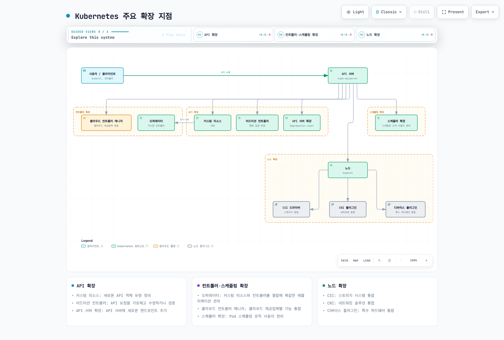
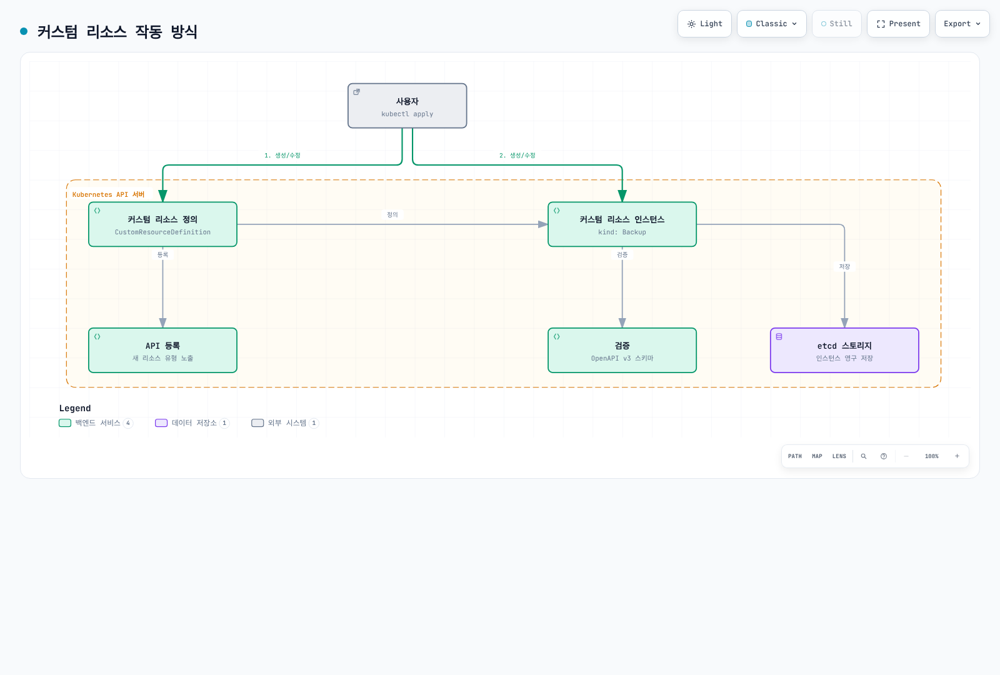
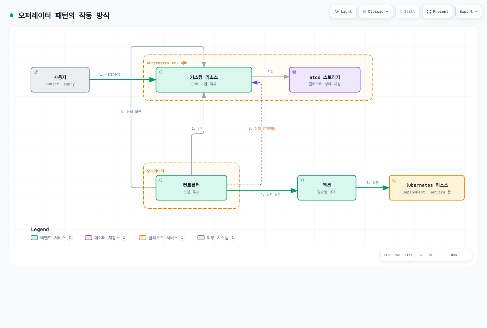
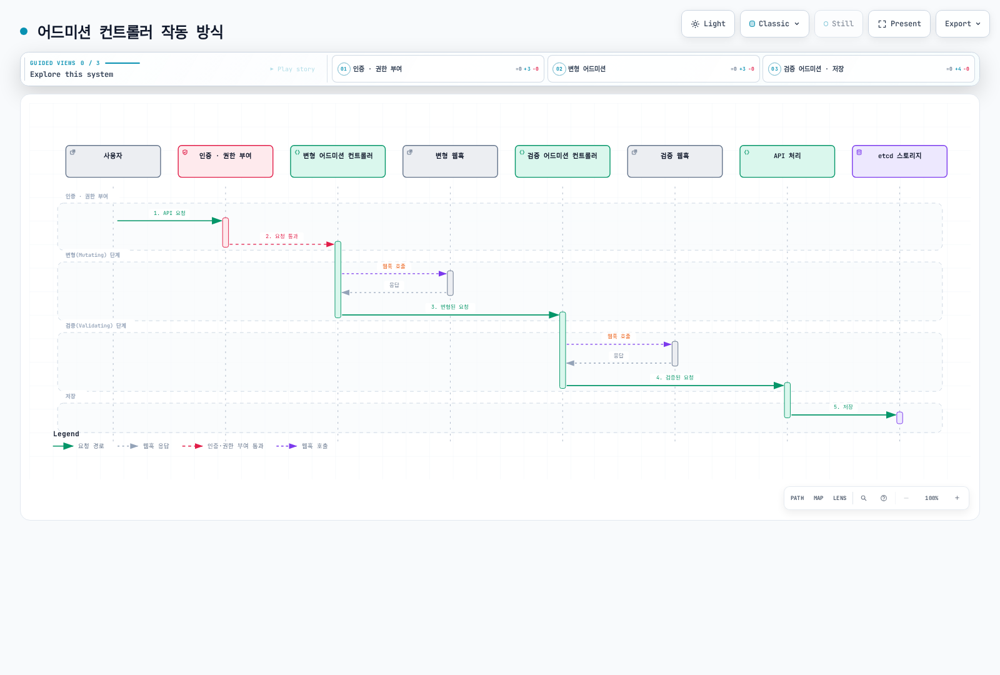
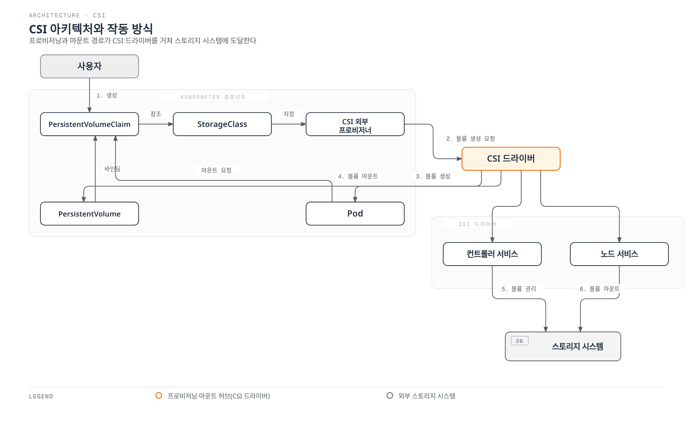
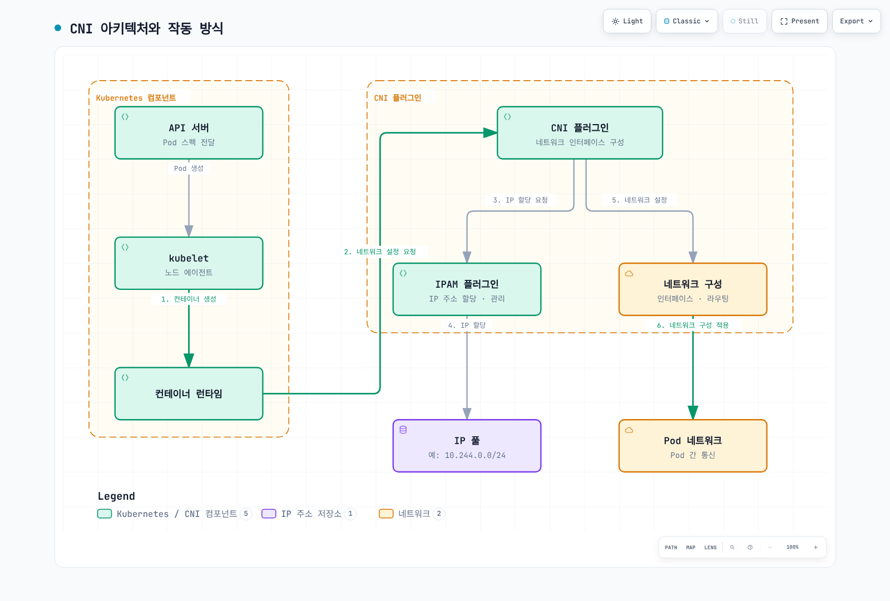
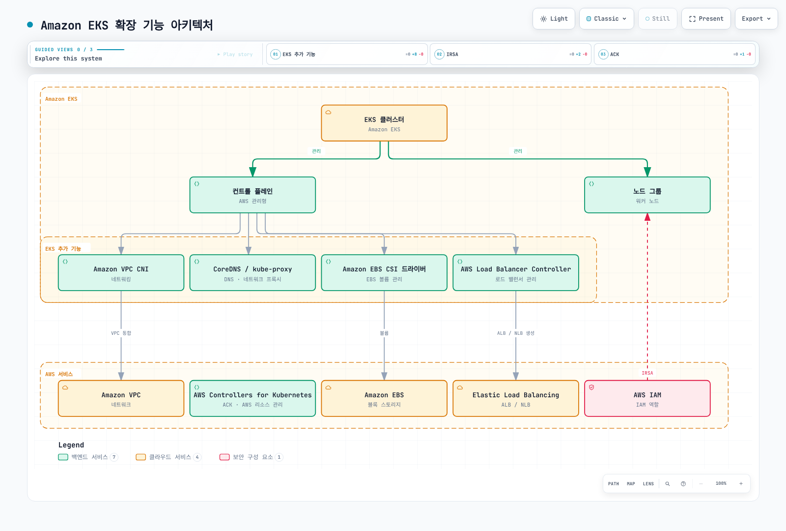

# Kubernetes 확장

> **검토한 upstream Kubernetes 버전**: Kubernetes 1.35, 1.36, 1.37
> **마지막 업데이트**: 2026년 9월 11일

Kubernetes는 확장성을 고려하여 설계된 플랫폼으로, 다양한 방법으로 기능을 확장할 수 있습니다. 이 장에서는 Kubernetes를 확장하는 다양한 방법과 Amazon EKS에서의 확장 기능 활용 방법에 대해 알아보겠습니다.

## 목차
1. [Kubernetes 확장 개요](#kubernetes-확장-개요)
2. [커스텀 리소스](#커스텀-리소스)
3. [오퍼레이터 패턴](#오퍼레이터-패턴)
4. [어드미션 컨트롤러](#어드미션-컨트롤러)
5. [API 서버 확장](#api-서버-확장)
6. [스케줄러 확장](#스케줄러-확장)
7. [클라우드 컨트롤러 매니저](#클라우드-컨트롤러-매니저)
8. [CSI(Container Storage Interface)](#csicontainer-storage-interface)
9. [CNI(Container Network Interface)](#cnicontainer-network-interface)
10. [디바이스 플러그인](#디바이스-플러그인)
11. [Amazon EKS에서의 확장 기능](#amazon-eks에서의-확장-기능)
12. [모범 사례](#모범-사례)
13. [결론](#결론)

## Kubernetes 확장 개요

Kubernetes는 다양한 확장 지점을 제공하여 기본 기능을 확장하고 사용자 정의할 수 있습니다. 주요 확장 지점은 다음과 같습니다:

1. **커스텀 리소스**: 새로운 API 객체 유형 정의
2. **오퍼레이터**: 커스텀 리소스와 컨트롤러를 결합하여 복잡한 애플리케이션 관리
3. **어드미션 컨트롤러**: API 요청을 가로채고 수정하거나 검증
4. **API 서버 확장**: API 서버에 새로운 엔드포인트 추가
5. **스케줄러 확장**: 포드 스케줄링 로직 사용자 정의
6. **클라우드 컨트롤러 매니저**: 클라우드 제공업체별 기능 통합
7. **CSI(Container Storage Interface)**: 스토리지 시스템 통합
8. **CNI(Container Network Interface)**: 네트워킹 솔루션 통합
9. **디바이스 플러그인**: 특수 하드웨어 통합

다음 다이어그램은 Kubernetes의 주요 확장 지점을 보여줍니다:



[🔍 인터랙티브 다이어그램 보기](https://www.atomai.click/kubernetes-docs/archmaps/ko-core-11-extending-kubernetes-0.html)

### 확장 방법 선택

적절한 확장 방법을 선택하는 데 고려해야 할 사항:

1. **사용 사례**: 확장하려는 기능의 유형
2. **복잡성**: 구현 및 유지 관리의 복잡성
3. **성능 영향**: 확장이 클러스터 성능에 미치는 영향
4. **업그레이드 호환성**: Kubernetes 버전 업그레이드와의 호환성
5. **커뮤니티 지원**: 확장 방법에 대한 커뮤니티 지원 수준

## 커스텀 리소스

커스텀 리소스는 Kubernetes API를 확장하여 새로운 객체 유형을 정의하는 방법입니다.

다음 다이어그램은 커스텀 리소스의 작동 방식을 보여줍니다:



[🔍 인터랙티브 다이어그램 보기](https://www.atomai.click/kubernetes-docs/archmaps/ko-core-11-extending-kubernetes-1.html)

### 커스텀 리소스 정의(CRD)

CRD는 새로운 리소스 유형을 정의하는 가장 간단한 방법입니다:

```yaml
apiVersion: apiextensions.k8s.io/v1
kind: CustomResourceDefinition
metadata:
  name: backups.example.com
spec:
  group: example.com
  names:
    kind: Backup
    listKind: BackupList
    plural: backups
    singular: backup
    shortNames:
    - bk
  scope: Namespaced
  versions:
  - name: v1
    served: true
    storage: true
    schema:
      openAPIV3Schema:
        type: object
        properties:
          spec:
            type: object
            properties:
              source:
                type: string
              destination:
                type: string
              schedule:
                type: string
            required:
            - source
            - destination
          status:
            type: object
            properties:
              phase:
                type: string
              lastBackupTime:
                type: string
                format: date-time
    subresources:
      status: {}
    additionalPrinterColumns:
    - name: Status
      type: string
      jsonPath: .status.phase
    - name: Age
      type: date
      jsonPath: .metadata.creationTimestamp
```

위 예시에서 `Backup`이라는 새로운 리소스 유형을 정의하고, 해당 리소스의 스키마와 추가 프린터 열을 지정합니다.

### 커스텀 리소스 인스턴스 생성

CRD의 Established 조건을 확인한 후 인스턴스를 생성합니다. CRD는 데이터를 저장/검증할 뿐 컨트롤러 없이는 백업을 실행하지 않습니다.

```yaml
apiVersion: example.com/v1
kind: Backup
metadata:
  name: daily-backup
spec:
  source: /data
  destination: s3://my-bucket/backups
  schedule: "0 0 * * *"
```

### 커스텀 리소스 검증

CRD에서 OpenAPI v3 스키마를 사용하여 커스텀 리소스의 유효성을 검증할 수 있습니다:

```yaml
openAPIV3Schema:
  type: object
  properties:
    spec:
      type: object
      properties:
        replicas:
          type: integer
          minimum: 1
          maximum: 10
        image:
          type: string
          minLength: 1
      required:
      - replicas
      - image
```

위 예시에서 `replicas` 필드는 1에서 10 사이의 정수여야 하고, `image` 필드는 비어 있지 않아야 하며 이미지 존재/서명 검증은 별도 정책이 필요합니다.

### 버전 관리

CRD는 여러 버전을 지원하여 API 진화를 가능하게 합니다:

```yaml
versions:
- name: v1alpha1
  served: true
  storage: false
- name: v1beta1
  served: true
  storage: false
- name: v1
  served: true
  storage: true
```

위 예시에서 `v1alpha1`, `v1beta1`, `v1` 세 가지 버전이 제공되지만, 새 쓰기는 `v1` 형식으로 저장됩니다. 위 조각에는 버전별 구조적 스키마를 추가해야 합니다. 기존 객체가 자동 재작성되지는 않으므로 이전 storedVersions 항목을 제거하기 전에 저장 데이터를 마이그레이션해야 합니다.

### 변환 웹훅

서로 다른 버전 간의 변환을 처리하기 위해 변환 웹훅을 사용할 수 있습니다:

```yaml
# Merge this spec fragment into the complete CRD above.
spec:
  conversion:
    strategy: Webhook
    webhook:
      clientConfig:
        service:
          namespace: default
          name: example-conversion-webhook
          path: /convert
        caBundle: <base64-encoded-ca-cert>
      conversionReviewVersions:
      - v1
```

## 오퍼레이터 패턴

오퍼레이터 패턴은 커스텀 리소스와 컨트롤러를 결합하여 복잡한 애플리케이션의 운영 지식을 자동화하는 방법입니다.

다음 다이어그램은 오퍼레이터 패턴의 작동 방식을 보여줍니다:



[🔍 인터랙티브 다이어그램 보기](https://www.atomai.click/kubernetes-docs/archmaps/ko-core-11-extending-kubernetes-2.html)

### 오퍼레이터 개념

오퍼레이터는 다음 구성 요소로 이루어집니다:

1. **커스텀 리소스 정의(CRD)**: 관리할 리소스의 스키마 정의
2. **컨트롤러**: 커스텀 리소스의 상태를 모니터링하고 원하는 상태로 조정하는 로직
3. **Kubernetes API 클라이언트**: Kubernetes API와 상호 작용하기 위한 클라이언트

### 오퍼레이터 예시

데이터베이스 오퍼레이터 예시:

```yaml
# 커스텀 리소스 정의
apiVersion: apiextensions.k8s.io/v1
kind: CustomResourceDefinition
metadata:
  name: databases.example.com
spec:
  group: example.com
  names:
    kind: Database
    listKind: DatabaseList
    plural: databases
    singular: database
    shortNames:
    - db
  scope: Namespaced
  versions:
  - name: v1
    served: true
    storage: true
    schema:
      openAPIV3Schema:
        type: object
        properties:
          spec:
            type: object
            properties:
              engine:
                type: string
                enum:
                - mysql
                - postgresql
              version:
                type: string
              storageSize:
                type: string
              replicas:
                type: integer
                minimum: 1
            required:
            - engine
            - version
            - storageSize
          status:
            type: object
            properties:
              phase:
                type: string
              endpoint:
                type: string
    subresources:
      status: {}
```

```yaml
# 데이터베이스 인스턴스
apiVersion: example.com/v1
kind: Database
metadata:
  name: my-db
spec:
  engine: postgresql
  version: "17"
  storageSize: 10Gi
  replicas: 3
```

### 오퍼레이터 개발 도구

오퍼레이터를 개발하기 위한 도구:

1. **Operator SDK**: Go, Ansible, Helm을 사용하여 오퍼레이터 개발
2. **KUDO(Kubernetes Universal Declarative Operator)**: 선언적 방식으로 오퍼레이터 개발
3. **Kubebuilder**: Go 기반 오퍼레이터 개발 프레임워크
4. **Metacontroller**: 웹훅 기반 오퍼레이터 개발

#### Operator SDK 예시

Operator SDK를 사용한 오퍼레이터 생성:

```bash
: "${OPERATOR_IMAGE:?Set a registry image tag or digest you control}"
# Install a reviewed supported Operator SDK release and verify its checksum first.

# 새 오퍼레이터 프로젝트 생성
operator-sdk init --domain example.com --repo github.com/example/database-operator

# API 생성
operator-sdk create api --group database --version v1 --kind Database --resource --controller

# 컨트롤러 구현 (main.go, controllers/database_controller.go 등)

# 오퍼레이터 빌드 및 배포
make docker-build docker-push IMG="$OPERATOR_IMAGE"
make deploy IMG="$OPERATOR_IMAGE"
```

### 인기 있는 오퍼레이터

많이 사용되는 오픈 소스 오퍼레이터:

1. **Prometheus Operator**: Prometheus 모니터링 스택 관리
2. **Elasticsearch Operator**: Elasticsearch 클러스터 관리
3. **CoreOS etcd Operator(보관됨)**: 과거 etcd 자동화 예시이며 현재 설치 권장 대상은 아님
4. **PostgreSQL Operator**: PostgreSQL 데이터베이스 관리
5. **OpenTelemetry Operator**: Jaeger v2 배포에 사용하며 기존 Jaeger Operator는 지원 종료된 v1 전용
6. **Strimzi Kafka Operator**: Apache Kafka 클러스터 관리
7. **Istio in-cluster Operator(1.24에서 제거)**: 과거 예시이며 지원되는 Helm/istioctl 설치 절차 사용
## 어드미션 컨트롤러

어드미션 컨트롤러는 Kubernetes API 서버에 대한 요청을 가로채고 수정하거나 검증하는 플러그인입니다.

다음 다이어그램은 어드미션 컨트롤러의 작동 방식을 보여줍니다:



[🔍 인터랙티브 다이어그램 보기](https://www.atomai.click/kubernetes-docs/archmaps/ko-core-11-extending-kubernetes-3.html)

### 어드미션 컨트롤러 유형

Kubernetes에는 두 가지 유형의 어드미션 컨트롤러가 있습니다:

1. **변형(Mutating) 어드미션 컨트롤러**: 리소스를 변경할 수 있음
2. **검증(Validating) 어드미션 컨트롤러**: 리소스를 검증만 할 수 있음

### 내장 어드미션 컨트롤러

Kubernetes에는 여러 내장 어드미션 컨트롤러가 있습니다:

1. **NamespaceLifecycle**: 삭제 중인 네임스페이스에 리소스 생성을 방지
2. **LimitRanger**: 포드 및 컨테이너에 기본 리소스 제한 설정
3. **ServiceAccount**: Pod의 서비스 계정 기본값/존재 여부를 확인하고 automount 설정에 따라 projected 토큰 볼륨을 추가합니다. 기본 계정 생성은 별도 컨트롤러 역할입니다.
4. **DefaultStorageClass**: PVC에 기본 스토리지 클래스 할당
5. **ResourceQuota**: 네임스페이스별 리소스 사용량 제한
6. **PodSecurity**: 네임스페이스 Pod Security Standards를 적용하며 PodSecurityPolicy는 1.25에서 제거되었습니다.
7. **NodeRestriction**: 노드가 수정할 수 있는 리소스 제한

### 웹훅 어드미션 컨트롤러

사용자 정의 로직을 구현하기 위해 웹훅 어드미션 컨트롤러를 사용할 수 있습니다:

```yaml
# 변형 웹훅 구성
apiVersion: admissionregistration.k8s.io/v1
kind: MutatingWebhookConfiguration
metadata:
  name: pod-mutating-webhook
webhooks:
- name: pod-mutator.example.com
  clientConfig:
    service:
      namespace: default
      name: pod-mutating-webhook
      path: "/mutate"
    caBundle: <base64-encoded-ca-cert>
  rules:
  - apiGroups: [""]
    apiVersions: ["v1"]
    resources: ["pods"]
    operations: ["CREATE"]
    scope: "Namespaced"
  admissionReviewVersions: ["v1"]
  sideEffects: None
  timeoutSeconds: 5
```

```yaml
# 검증 웹훅 구성
apiVersion: admissionregistration.k8s.io/v1
kind: ValidatingWebhookConfiguration
metadata:
  name: pod-validating-webhook
webhooks:
- name: pod-validator.example.com
  clientConfig:
    service:
      namespace: default
      name: pod-validating-webhook
      path: "/validate"
    caBundle: <base64-encoded-ca-cert>
  rules:
  - apiGroups: [""]
    apiVersions: ["v1"]
    resources: ["pods"]
    operations: ["CREATE", "UPDATE"]
    scope: "Namespaced"
  admissionReviewVersions: ["v1"]
  sideEffects: None
  timeoutSeconds: 5
```

### 웹훅 서버 구현

아래 Go 조각은 하나의 파일에서 v1 AdmissionReview 핸들러를 구현합니다. /mutate와 /validate를 Service 이름과 일치하는 인증서/CA를 사용하는 HTTPS 서버에 연결합니다. 외부 부작용이 없어 dry-run에 안전하며 대상 네임스페이스를 제한해야 합니다. 태그 검사는 정책 예시로 이미지 참조 전체 구문이나 서명을 검증하지 않습니다.

```go
package main

import (
    "encoding/json"
    "net/http"
    "strings"
    admissionv1 "k8s.io/api/admission/v1"
    corev1 "k8s.io/api/core/v1"
    metav1 "k8s.io/apimachinery/pkg/apis/meta/v1"
)

func readPodReview(w http.ResponseWriter, r *http.Request) (*admissionv1.AdmissionRequest, *corev1.Pod, bool) {
    if r.Method != http.MethodPost || r.Body == nil {
        http.Error(w, "POST body required", http.StatusBadRequest)
        return nil, nil, false
    }
    var review admissionv1.AdmissionReview
    if err := json.NewDecoder(http.MaxBytesReader(w, r.Body, 2<<20)).Decode(&review); err != nil {
        http.Error(w, "Invalid AdmissionReview JSON", http.StatusBadRequest)
        return nil, nil, false
    }
    req := review.Request
    if review.APIVersion != "admission.k8s.io/v1" || review.Kind != "AdmissionReview" || req == nil || req.UID == "" {
        http.Error(w, "AdmissionReview v1 request and UID required", http.StatusBadRequest)
        return nil, nil, false
    }
    if req.Kind.Group != "" || req.Kind.Version != "v1" || req.Kind.Kind != "Pod" ||
        (req.Operation != admissionv1.Create && req.Operation != admissionv1.Update) {
        http.Error(w, "Only Pod CREATE/UPDATE is supported", http.StatusBadRequest)
        return nil, nil, false
    }
    var pod corev1.Pod
    if err := json.Unmarshal(req.Object.Raw, &pod); err != nil {
        http.Error(w, "Invalid Pod JSON", http.StatusBadRequest)
        return nil, nil, false
    }
    return req, &pod, true
}

func writeReview(w http.ResponseWriter, response admissionv1.AdmissionResponse) {
    review := admissionv1.AdmissionReview{
        TypeMeta: metav1.TypeMeta{APIVersion: "admission.k8s.io/v1", Kind: "AdmissionReview"},
        Response: &response,
    }
    data, err := json.Marshal(review)
    if err != nil {
        http.Error(w, "Response encoding failed", http.StatusInternalServerError)
        return
    }
    w.Header().Set("Content-Type", "application/json")
    _, _ = w.Write(data)
}

func writePatch(w http.ResponseWriter, req *admissionv1.AdmissionRequest, patches []map[string]interface{}) {
    response := admissionv1.AdmissionResponse{UID: req.UID, Allowed: true}
    if len(patches) > 0 {
        data, err := json.Marshal(patches)
        if err != nil {
            http.Error(w, "Patch encoding failed", http.StatusInternalServerError)
            return
        }
        patchType := admissionv1.PatchTypeJSONPatch
        response.PatchType, response.Patch = &patchType, data
    }
    writeReview(w, response)
}

func deny(w http.ResponseWriter, req *admissionv1.AdmissionRequest, message string) {
    writeReview(w, admissionv1.AdmissionResponse{
        UID: req.UID, Allowed: false,
        Result: &metav1.Status{Status: "Failure", Reason: metav1.StatusReasonForbidden, Code: 403, Message: message},
    })
}
func mutateHandler(w http.ResponseWriter, r *http.Request) {
    req, pod, ok := readPodReview(w, r)
    if !ok { return }
    if pod.Labels["injected-by"] == "mutating-webhook" {
        writePatch(w, req, nil)
        return
    }
    if pod.Labels == nil { pod.Labels = map[string]string{} }
    pod.Labels["injected-by"] = "mutating-webhook"
    // Add the whole map, preserving existing labels. Works when labels was absent.
    writePatch(w, req, []map[string]interface{}{{"op": "add", "path": "/metadata/labels", "value": pod.Labels}})
}
```

```go
func validateHandler(w http.ResponseWriter, r *http.Request) {
    req, pod, ok := readPodReview(w, r)
    if !ok { return }
    images := []string{}
    for _, c := range pod.Spec.Containers { images = append(images, c.Image) }
    for _, c := range pod.Spec.InitContainers { images = append(images, c.Image) }
    for _, c := range pod.Spec.EphemeralContainers { images = append(images, c.Image) }
    for _, image := range images {
        if strings.Contains(image, "@") { continue } // Digest references have no implicit latest tag.
        last := image[strings.LastIndex(image, "/")+1:]
        if !strings.Contains(last, ":") || strings.HasSuffix(last, ":latest") {
            deny(w, req, "Use an explicit non-latest tag or digest for every container")
            return
        }
    }
    writeReview(w, admissionv1.AdmissionResponse{UID: req.UID, Allowed: true})
}
```

### 인기 있는 어드미션 컨트롤러 프로젝트

1. **OPA Gatekeeper**: Open Policy Agent를 사용한 정책 적용
2. **Kyverno**: YAML 기반 정책 엔진
3. **Istio**: 서비스 메시 사이드카 주입
4. **cert-manager**: TLS 인증서 관리

## API 서버 확장

API 서버 확장은 Kubernetes API 서버에 새로운 엔드포인트를 추가하는 방법입니다.

### 확장 API 서버

확장 API 서버는 Kubernetes API 서버와 별도로 실행되는 서버로, 커스텀 API를 제공합니다:

```yaml
# APIService 정의
apiVersion: apiregistration.k8s.io/v1
kind: APIService
metadata:
  name: v1.example.com
spec:
  group: example.com
  version: v1
  groupPriorityMinimum: 1000
  versionPriority: 15
  service:
    name: example-api
    namespace: default
  caBundle: <base64-encoded-ca-cert>
```

### 확장 API 서버 구현

확장 API 서버는 다음과 같은 구성 요소로 이루어집니다:

1. **API 서버**: Kubernetes API 서버와 유사한 인터페이스 제공
2. **리소스 핸들러**: 특정 리소스 유형에 대한 요청 처리
3. **스토리지 백엔드**: 리소스 데이터 저장

아래는 구현 개요이며 독립 실행 프로그램이 아닙니다. k8s.io 의존성에 맞는 공식 sample-apiserver에서 시작하여 TLS, 위임 인증/권한, 실제 example.com/v1 타입, 저장소 및 종료 컨텍스트를 구성합니다. APIService와 서버의 group/version이 일치해야 합니다.

```go
// 확장 API 서버 예시
func main() {
    // 서버 구성
    config := genericapiserver.NewRecommendedConfig(apiserver.Codecs)
    config.OpenAPIConfig = genericapiserver.DefaultOpenAPIConfig(
        sampleopenapi.GetOpenAPIDefinitions,
        openapi.NewDefinitionNamer(apiserver.Scheme),
    )
    config.EnableIndex = true
    config.EnableDiscovery = true

    // 서버 생성
    server, err := config.Complete().New("sample-apiserver", genericapiserver.NewEmptyDelegate())
    if err != nil {
        log.Fatalf("Error creating server: %v", err)
    }

    // API 그룹 정보 설정
    apiGroupInfo := genericapiserver.NewDefaultAPIGroupInfo(
        samplev1.GroupName,
        apiserver.Scheme,
        metav1.ParameterCodec,
        apiserver.Codecs,
    )

    // 스토리지 설정
    apiGroupInfo.VersionedResourcesStorageMap["v1"] = map[string]rest.Storage{
        "widgets": NewWidgetStorage(),
    }

    // API 그룹 설치
    if err := server.InstallAPIGroup(&apiGroupInfo); err != nil {
        log.Fatalf("Error installing API group: %v", err)
    }

    // 서버 실행
    if err := server.PrepareRun().Run(stopCh); err != nil {
        log.Fatalf("Error running server: %v", err)
    }
}
```

### 애그리게이션 레이어

애그리게이션 레이어는 여러 API 서버를 단일 API 서버처럼 보이게 합니다:

```
                                   +-----------------+
                                   |                 |
                                   |  kube-apiserver |
                                   |                 |
                                   +-------+---------+
                                           |
                                           v
                      +--------------------+--------------------+
                      |                                         |
                      |                                         |
          +-----------v-----------+               +------------v------------+
          |                       |               |                         |
          |  metrics-server       |               |  example-apiserver      |
          |                       |               |                         |
          +-----------------------+               +-------------------------+
```

## 스케줄러 확장

스케줄러 확장은 Kubernetes 스케줄러의 동작을 사용자 정의하는 방법입니다.

### 스케줄러 프레임워크

Kubernetes 1.15부터 도입된 스케줄러 프레임워크는 플러그인을 통해 스케줄링 파이프라인의 다양한 단계를 확장할 수 있습니다:

1. **Queue Sort**: 스케줄링 큐의 포드 정렬
2. **Pre-filter**: 필터링 전 포드 및 클러스터 상태 검사
3. **Filter**: 포드를 실행할 수 없는 노드 필터링
4. **Post-filter**: 필터링 후 작업 수행
5. **Pre-score**: 점수 계산 전 작업 수행
6. **Score**: 노드에 점수 부여
7. **Normalize Score**: 점수 정규화
8. **Reserve**: 포드를 위한 리소스 예약
9. **Permit**: 포드 스케줄링 허용, 거부 또는 지연
10. **Pre-bind**: 바인딩 전 작업 수행
11. **Bind**: 포드를 노드에 바인딩
12. **Post-bind**: 바인딩 후 작업 수행

### 스케줄러 구성

스케줄러 구성 예시:

```yaml
apiVersion: kubescheduler.config.k8s.io/v1
kind: KubeSchedulerConfiguration
leaderElection:
  leaderElect: true
profiles:
- schedulerName: custom-scheduler
  pluginConfig:
  - name: NodeResourcesFit
    args:
      scoringStrategy:
        type: MostAllocated
        resources:
        - name: cpu
          weight: 1
        - name: memory
          weight: 1
```

### 사용자 정의 스케줄러

아래 Deployment는 빌드한 custom-scheduler 이미지, 앞의 config.yaml을 담은 custom-scheduler-config ConfigMap 및 스케줄링/Lease RBAC 권한이 있는 ServiceAccount가 필요합니다. in-cluster 인증을 사용하며 워커에서 관리형 컨트롤 플레인의 scheduler.conf를 마운트하지 않습니다. schedulerName은 Pod와 일치해야 합니다.

```yaml
apiVersion: apps/v1
kind: Deployment
metadata:
  name: custom-scheduler
  namespace: kube-system
spec:
  replicas: 1
  selector:
    matchLabels:
      app: custom-scheduler
  template:
    metadata:
      labels:
        app: custom-scheduler
    spec:
      serviceAccountName: custom-scheduler
      nodeSelector:
        kubernetes.io/os: linux
      containers:
      - name: custom-scheduler
        image: example/custom-scheduler:REPLACE_WITH_TESTED_RELEASE
        command: [/custom-scheduler, --config=/etc/scheduler/config.yaml]
        volumeMounts:
        - name: config
          mountPath: /etc/scheduler
          readOnly: true
      volumes:
      - name: config
        configMap:
          name: custom-scheduler-config
```

포드에서 사용자 정의 스케줄러 지정:

```yaml
apiVersion: v1
kind: Pod
metadata:
  name: custom-scheduled-pod
spec:
  schedulerName: custom-scheduler
  containers:
  - name: container
    image: nginx:1.30.4
```

## 클라우드 컨트롤러 매니저

클라우드 컨트롤러 매니저는 Kubernetes와 클라우드 제공업체 간의 인터페이스를 제공합니다.

### 클라우드 컨트롤러 매니저 구성 요소

클라우드 컨트롤러 매니저는 다음과 같은 컨트롤러로 구성됩니다:

1. **노드 컨트롤러**: 클라우드 제공업체 API를 통해 노드 정보 업데이트
2. **라우트 컨트롤러**: 클라우드 네트워크에 라우트 설정
3. **서비스 컨트롤러**: 클라우드 로드 밸런서 생성, 업데이트, 삭제

### AWS 클라우드 컨트롤러 매니저

AWS CCM은 AWS 위의 **자체 관리 Kubernetes**를 위한 외부 클라우드 컨트롤러입니다. Kubernetes 버전에 맞는 cloud-provider-aws 릴리스를 선택하고 공식 기존 클러스터 설치 절차의 ServiceAccount/RBAC, IAM, 클러스터 태그, 노드 이름 및 `--cloud-provider=external` 전환 조건을 확인합니다. 현재 이미지 경로는 `registry.k8s.io/provider-aws/cloud-controller-manager`입니다. VPC/서브넷 태그는 임의의 cloud.conf 키로 대신할 수 없습니다.

EKS의 AWS 관리 컨트롤 플레인에 이 DaemonSet을 설치하거나 scheduler.conf를 마운트할 수 없습니다. EKS에서는 서비스가 관리하는 클라우드 통합과 지원되는 AWS Load Balancer Controller 또는 Auto Mode 기능을 사용하며 동일 리소스를 여러 컨트롤러가 소유하지 않게 합니다.

<span id="csicontainer-storage-interface"></span>

## CSI(Container Storage Interface)

CSI는 Kubernetes와 스토리지 시스템 간의 표준 인터페이스를 제공합니다.

다음 다이어그램은 CSI의 아키텍처와 작동 방식을 보여줍니다:



[🔍 인터랙티브 다이어그램 보기](https://www.atomai.click/kubernetes-docs/archmaps/ko-core-11-extending-kubernetes-4.html)

### CSI 아키텍처

CSI는 다음과 같은 구성 요소로 이루어집니다:

1. **CSI 컨트롤러 플러그인**: 볼륨 생성, 삭제, 스냅샷 등의 작업 처리
2. **CSI 노드 플러그인**: 볼륨 마운트, 언마운트 등의 작업 처리
3. **CSI 드라이버**: 특정 스토리지 시스템과 통합하는 구현체

```
+-------------------+
|                   |
|  Kubernetes       |
|  (External        |
|   Provisioner)    |
|                   |
+--------+----------+
         |
         | gRPC
         v
+--------+----------+
|                   |
|  CSI Driver       |
|                   |
+--------+----------+
         |
         | Storage Protocol
         v
+--------+----------+
|                   |
|  Storage System   |
|                   |
+-------------------+
```

### CSI 드라이버 배포

아래는 드라이버 개발용 템플릿이며 완전한 설치 매니페스트가 아닙니다. 공급자 문서에 따라 드라이버 이미지/인수, 호환되는 sidecar 버전, ServiceAccount/RBAC 및 CSIDriver 등록을 준비합니다. NodePlugin은 Linux에서 실행되며 지정된 호스트 경로와 권한이 필요합니다.

```yaml
# CSI 컨트롤러 서비스
apiVersion: apps/v1
kind: Deployment
metadata:
  name: csi-controller
spec:
  replicas: 1
  selector:
    matchLabels:
      app: csi-controller
  template:
    metadata:
      labels:
        app: csi-controller
    spec:
      serviceAccountName: csi-controller
      nodeSelector:
        kubernetes.io/os: linux
      containers:
      - name: csi-provisioner
        image: registry.k8s.io/sig-storage/csi-provisioner:REPLACE_WITH_COMPATIBLE_RELEASE
        args:
        - "--csi-address=$(ADDRESS)"
        - "--v=5"
        env:
        - name: ADDRESS
          value: /var/lib/csi/sockets/pluginproxy/csi.sock
        volumeMounts:
        - name: socket-dir
          mountPath: /var/lib/csi/sockets/pluginproxy/
      - name: csi-attacher
        image: registry.k8s.io/sig-storage/csi-attacher:REPLACE_WITH_COMPATIBLE_RELEASE
        args:
        - "--csi-address=$(ADDRESS)"
        - "--v=5"
        env:
        - name: ADDRESS
          value: /var/lib/csi/sockets/pluginproxy/csi.sock
        volumeMounts:
        - name: socket-dir
          mountPath: /var/lib/csi/sockets/pluginproxy/
      - name: csi-driver
        image: example/csi-driver:v1.0.0
        args:
        - "--endpoint=$(CSI_ENDPOINT)"
        - "--nodeid=$(NODE_ID)"
        env:
        - name: CSI_ENDPOINT
          value: unix:///var/lib/csi/sockets/pluginproxy/csi.sock
        - name: NODE_ID
          valueFrom:
            fieldRef:
              fieldPath: spec.nodeName
        volumeMounts:
        - name: socket-dir
          mountPath: /var/lib/csi/sockets/pluginproxy/
      volumes:
      - name: socket-dir
        emptyDir: {}

---
# CSI 노드 서비스
apiVersion: apps/v1
kind: DaemonSet
metadata:
  name: csi-node
spec:
  selector:
    matchLabels:
      app: csi-node
  template:
    metadata:
      labels:
        app: csi-node
    spec:
      serviceAccountName: csi-node
      nodeSelector:
        kubernetes.io/os: linux
      hostNetwork: true
      containers:
      - name: csi-node-driver-registrar
        image: registry.k8s.io/sig-storage/csi-node-driver-registrar:REPLACE_WITH_COMPATIBLE_RELEASE
        args:
        - "--csi-address=$(ADDRESS)"
        - "--kubelet-registration-path=$(DRIVER_REG_SOCK_PATH)"
        - "--v=5"
        env:
        - name: ADDRESS
          value: /csi/csi.sock
        - name: DRIVER_REG_SOCK_PATH
          value: /var/lib/kubelet/plugins/example.csi.k8s.io/csi.sock
        volumeMounts:
        - name: plugin-dir
          mountPath: /csi
        - name: registration-dir
          mountPath: /registration
      - name: csi-driver
        image: example/csi-driver:v1.0.0
        args:
        - "--endpoint=$(CSI_ENDPOINT)"
        - "--nodeid=$(NODE_ID)"
        env:
        - name: CSI_ENDPOINT
          value: unix:///csi/csi.sock
        - name: NODE_ID
          valueFrom:
            fieldRef:
              fieldPath: spec.nodeName
        securityContext:
          privileged: true
        volumeMounts:
        - name: plugin-dir
          mountPath: /csi
        - name: pods-mount-dir
          mountPath: /var/lib/kubelet/pods
          mountPropagation: "Bidirectional"
      volumes:
      - name: plugin-dir
        hostPath:
          path: /var/lib/kubelet/plugins/example.csi.k8s.io
          type: DirectoryOrCreate
      - name: registration-dir
        hostPath:
          path: /var/lib/kubelet/plugins_registry
          type: Directory
      - name: pods-mount-dir
        hostPath:
          path: /var/lib/kubelet/pods
          type: Directory
```

### 스토리지 클래스 및 PVC

CSI 드라이버를 사용하는 스토리지 클래스 및 PVC 예시:

```yaml
# 스토리지 클래스
apiVersion: storage.k8s.io/v1
kind: StorageClass
metadata:
  name: example-csi
provisioner: example.csi.k8s.io
parameters:
  type: ssd
  csi.storage.k8s.io/fstype: ext4
reclaimPolicy: Delete
allowVolumeExpansion: true
volumeBindingMode: WaitForFirstConsumer

---
# PVC
apiVersion: v1
kind: PersistentVolumeClaim
metadata:
  name: example-pvc
spec:
  accessModes:
  - ReadWriteOnce
  resources:
    requests:
      storage: 10Gi
  storageClassName: example-csi
```

### 인기 있는 CSI 드라이버

1. **AWS EBS CSI 드라이버**: AWS EBS 볼륨 관리
2. **AWS EFS CSI 드라이버**: AWS EFS 파일 시스템 관리
3. **GCE PD CSI 드라이버**: Google Compute Engine 영구 디스크 관리
4. **Azure Disk CSI 드라이버**: Azure 디스크 관리
5. **Ceph RBD CSI 드라이버**: Ceph RBD 볼륨 관리
6. **NFS CSI 드라이버**: NFS 볼륨 관리

<span id="cnicontainer-network-interface"></span>

## CNI(Container Network Interface)

CNI는 Kubernetes와 네트워킹 솔루션 간의 표준 인터페이스를 제공합니다.

다음 다이어그램은 CNI의 아키텍처와 작동 방식을 보여줍니다:



[🔍 인터랙티브 다이어그램 보기](https://www.atomai.click/kubernetes-docs/archmaps/ko-core-11-extending-kubernetes-5.html)

### CNI 아키텍처

CNI는 다음과 같은 구성 요소로 이루어집니다:

1. **CNI 플러그인**: 컨테이너 네트워크 인터페이스 구성
2. **IPAM 플러그인**: IP 주소 할당 및 관리
3. **메타 플러그인**: 여러 플러그인을 조합하여 사용

```
+-------------------+
|                   |
|  Kubernetes       |
|  CRI runtime      |
|  (via kubelet)    |
+--------+----------+
         |
         | CNI Spec
         v
+--------+----------+
|                   |
|  CNI Plugin       |
|                   |
+--------+----------+
         |
         | Network Configuration
         v
+--------+----------+
|                   |
|  Network          |
|                   |
+-------------------+
```

### CNI 플러그인 구성

아래 단일 노드 bridge/host-local 예제는 CNI 규약을 설명합니다. 클러스터에는 노드별 고유 서브넷과 노드 간 라우팅이 필요합니다. 최신 kubelet이 직접 호출하는 것이 아니라 CRI 런타임이 CNI를 호출합니다.

```json
{
  "cniVersion": "0.4.0",
  "name": "example-network",
  "type": "bridge",
  "bridge": "cni0",
  "isGateway": true,
  "ipMasq": true,
  "ipam": {
    "type": "host-local",
    "subnet": "10.244.0.0/24",
    "routes": [
      { "dst": "0.0.0.0/0" }
    ]
  }
}
```

### 인기 있는 CNI 플러그인

1. **Calico**: 네트워크 정책 및 보안 기능이 강화된 CNI
2. **Flannel**: 간단한 오버레이 네트워크 제공
3. **Cilium**: eBPF 기반의 네트워킹 및 보안 솔루션
4. **Weave Net(보관됨)**: 과거 멀티 호스트 네트워킹 프로젝트이며 유지 관리되는 대안 검토
5. **AWS VPC CNI**: AWS VPC와 통합된 CNI
6. **Azure CNI**: Azure 가상 네트워크와 통합된 CNI
7. **Antrea**: Open vSwitch 기반의 네트워킹 솔루션

### CNI 플러그인 설치

Calico CNI 플러그인 설치 예시:

```bash
# Use the official Calico installation guide for your distribution.
# Select a supported release and inspect the operator/custom-resources manifests.
# Do not install a second primary CNI over an existing cluster network.
kubectl get nodes -o wide
kubectl -n kube-system get daemonsets
```

## 디바이스 플러그인

디바이스 플러그인은 Kubernetes와 특수 하드웨어 간의 인터페이스를 제공합니다.

### 디바이스 플러그인 아키텍처

디바이스 플러그인은 다음과 같은 구성 요소로 이루어집니다:

1. **디바이스 플러그인 서버**: 디바이스 검색, 할당, 초기화 등의 작업 처리
2. **kubelet**: 디바이스 플러그인과 통신하여 포드에 디바이스 할당

```
+-------------------+
|                   |
|  Kubernetes       |
|  (kubelet)        |
|                   |
+--------+----------+
         |
         | Device Plugin API
         v
+--------+----------+
|                   |
|  Device Plugin    |
|                   |
+--------+----------+
         |
         | Device Management
         v
+--------+----------+
|                   |
|  Hardware Device  |
|                   |
+-------------------+
```

### NVIDIA GPU 디바이스 플러그인

NVIDIA GPU 디바이스 플러그인 배포 예시:

호환되는 NVIDIA 드라이버/Container Toolkit과 런타임을 먼저 구성합니다. 공식 NVIDIA device-plugin Helm 차트에서 검증한 버전을 고정하고 Linux GPU 노드만 선택합니다. 운영자가 이미 GPU Operator/Auto Mode로 플러그인을 관리하는 경우 중복 설치하지 않습니다.

### GPU 요청 포드

GPU를 요청하는 포드 예시:

```yaml
apiVersion: v1
kind: Pod
metadata:
  name: gpu-pod
spec:
  restartPolicy: Never
  nodeSelector:
    kubernetes.io/os: linux
  containers:
  - name: cuda-container
    image: nvidia/cuda:REPLACE_WITH_DRIVER_COMPATIBLE_TAG
    command: ["nvidia-smi"]
    resources:
      limits:
        nvidia.com/gpu: 1
```

### 인기 있는 디바이스 플러그인

1. **NVIDIA GPU 디바이스 플러그인**: NVIDIA GPU 관리
2. **AMD GPU 디바이스 플러그인**: AMD GPU 관리
3. **FPGA 디바이스 플러그인**: FPGA 디바이스 관리
4. **InfiniBand 디바이스 플러그인**: InfiniBand 디바이스 관리
5. **SRIOV 네트워크 디바이스 플러그인**: SR-IOV 네트워크 디바이스 관리

## Amazon EKS에서의 확장 기능

EKS 버전 지원은 upstream과 다릅니다. 2026-09-11 기준 EKS 표준 지원은 1.34–1.36이며 애드온/컨트롤러의 개별 호환성도 확인합니다.

Amazon EKS는 다양한 확장 기능을 지원하여 Kubernetes 클러스터의 기능을 확장할 수 있습니다.

다음 다이어그램은 Amazon EKS의 확장 기능 아키텍처를 보여줍니다:



[🔍 인터랙티브 다이어그램 보기](https://www.atomai.click/kubernetes-docs/archmaps/ko-core-11-extending-kubernetes-6.html)

### EKS 추가 기능

Amazon EKS는 다음과 같은 추가 기능을 제공합니다:

1. **Amazon VPC CNI**: AWS VPC와 통합된 네트워킹
2. **CoreDNS**: 클러스터 내 DNS 서비스
3. **kube-proxy**: 네트워크 프록시
4. **Amazon EBS CSI 드라이버**: EBS 볼륨 관리
5. **AWS Load Balancer Controller**: 지원되는 Helm/매니페스트로 별도 설치하며 모든 확장이 EKS 관리형 애드온이라고 가정하지 않음

```bash
set -euo pipefail
: "${CLUSTER_NAME:?Set cluster name}"
KUBERNETES_VERSION=$(aws eks describe-cluster --name "$CLUSTER_NAME" --query cluster.version --output text)
aws eks list-addons --cluster-name "$CLUSTER_NAME"
aws eks describe-addon-versions --addon-name amazon-ebs-csi-driver --kubernetes-version "$KUBERNETES_VERSION"
# Choose a compatible version and prepare the controller's scoped IAM role first.
: "${ADDON_VERSION:?Set reviewed compatible add-on version}"
: "${EBS_ROLE_ARN:?Set EBS CSI IRSA role ARN}"
aws eks create-addon --cluster-name "$CLUSTER_NAME" --addon-name amazon-ebs-csi-driver \
  --addon-version "$ADDON_VERSION" --service-account-role-arn "$EBS_ROLE_ARN"
# For an existing installation, use update-addon instead of create-addon.
# To stop EKS management while retaining the workload (not uninstall it):
# aws eks delete-addon --cluster-name "$CLUSTER_NAME" --addon-name amazon-ebs-csi-driver --preserve
```

### AWS Controllers for Kubernetes(ACK)

ACK는 Kubernetes에서 AWS 리소스를 관리할 수 있게 해주는 오퍼레이터 모음입니다:

```bash
set -euo pipefail
: "${ACK_VERSION:?Set a reviewed S3 controller chart version}"
: "${AWS_REGION:?Set target service region}"
# First prepare ack-s3-controller ServiceAccount with scoped IRSA/Pod Identity permissions.
helm upgrade --install ack-s3-controller oci://public.ecr.aws/aws-controllers-k8s/s3-chart \
  --version "$ACK_VERSION" --namespace ack-system --create-namespace \
  --set aws.region="$AWS_REGION" --set serviceAccount.create=false \
  --set serviceAccount.name=ack-s3-controller
# Creating a Bucket CR provisions a real AWS resource: review IAM, naming and retention first.
```

아래 Bucket 예제는 컨트롤러가 설치되어 있고 IAM 권한이 있으면 실제 AWS 리소스를 생성합니다. 전역적으로 고유한 이름으로 바꾸고 수명 주기/보존 정책을 검토합니다. Kubernetes 객체 삭제 시 버킷도 삭제될 수 있으므로 데이터 보존 요구에 맞는 컨트롤러 삭제 정책을 설정합니다.

```yaml
apiVersion: s3.services.k8s.aws/v1alpha1
kind: Bucket
metadata:
  name: example-bucket
spec:
  name: replace-with-your-globally-unique-bucket-name
```

### AWS Load Balancer Controller

AWS Load Balancer Controller는 Kubernetes 서비스 및 인그레스를 AWS 로드 밸런서와 통합합니다:

```yaml
# ALB 인그레스 예시
apiVersion: networking.k8s.io/v1
kind: Ingress
metadata:
  name: example-ingress
  annotations:
    alb.ingress.kubernetes.io/scheme: internet-facing
    alb.ingress.kubernetes.io/target-type: ip
spec:
  ingressClassName: alb
  rules:
  - host: example.com
    http:
      paths:
      - path: /
        pathType: Prefix
        backend:
          service:
            name: example-service
            port:
              number: 80
```

### IAM Roles for Service Accounts(IRSA)

IRSA는 Kubernetes 서비스 계정에 AWS IAM 역할을 연결하여 포드가 AWS 서비스에 안전하게 접근할 수 있게 합니다:

```bash
# OIDC 제공자 생성
: "${S3_READ_POLICY_ARN:?Set a customer-managed policy restricted to your bucket/prefix}"
eksctl utils associate-iam-oidc-provider \
  --cluster my-cluster \
  --approve

# IAM 역할 및 서비스 계정 생성
eksctl create iamserviceaccount \
  --cluster my-cluster \
  --namespace default \
  --name my-service-account \
  --attach-policy-arn "$S3_READ_POLICY_ARN" \
  --approve

# 서비스 계정을 사용하는 포드
cat <<EOF | kubectl apply -f -
apiVersion: v1
kind: Pod
metadata:
  name: s3-reader
spec:
  serviceAccountName: my-service-account
  restartPolicy: Never
  containers:
  - name: aws-cli
    image: public.ecr.aws/aws-cli/aws-cli:REPLACE_WITH_TESTED_RELEASE
    command: [aws]
    args: [sts, get-caller-identity]
EOF
```

## 모범 사례

Kubernetes 확장 기능을 구현할 때 고려해야 할 모범 사례를 알아보겠습니다.

### 설계 모범 사례

1. **표준 인터페이스 사용**: 가능한 경우 CSI, CNI 등의 표준 인터페이스 사용
2. **선언적 API 설계**: 명령형이 아닌 선언적 API 설계
3. **Kubernetes 디자인 원칙 준수**: 컨트롤러 패턴, 레벨 트리거링 등의 원칙 준수
4. **버전 관리**: API 버전 관리 및 호환성 유지
5. **최소 권한 원칙**: 필요한 최소한의 권한만 부여

### 구현 모범 사례

1. **재사용 가능한 라이브러리 활용**: client-go, controller-runtime 등의 라이브러리 활용
2. **적절한 오류 처리**: 오류 상황에 대한 적절한 처리 및 로깅
3. **지수 백오프**: 재시도 시 지수 백오프 사용
4. **리소스 제한 설정**: 메모리 및 CPU 제한 설정
5. **상태 보고**: 리소스 상태 정확히 보고

### 배포 모범 사례

1. **점진적 롤아웃**: 한 번에 모든 것을 변경하지 않고 점진적으로 롤아웃
2. **버전 관리**: 이미지 태그에 latest 사용 지양
3. **헬스 체크**: 적절한 활성 및 준비 프로브 구성
4. **로깅 및 모니터링**: 포괄적인 로깅 및 모니터링 구성
5. **문서화**: API 및 사용 방법 문서화

### 보안 모범 사례

1. **최소 권한 원칙**: 필요한 최소한의 권한만 부여
2. **RBAC 사용**: 적절한 RBAC 정책 구성
3. **네트워크 정책**: 적절한 네트워크 정책 구성
4. **이미지 스캐닝**: 컨테이너 이미지 취약점 스캐닝
5. **시크릿 관리**: 시크릿 안전하게 관리

### EKS 특화 모범 사례

1. **관리형 추가 기능 사용**: 가능한 경우 EKS 관리형 추가 기능 사용
2. **IRSA 사용**: 포드별 IAM 권한 관리를 위해 IRSA 사용
3. **VPC CNI 구성**: 네트워킹 요구 사항에 맞게 VPC CNI 구성
4. **보안 그룹**: 적절한 보안 그룹 구성
5. **비용 최적화**: 적절한 인스턴스 유형 및 크기 선택

## 결론

Kubernetes는 다양한 확장 지점을 제공하여 기본 기능을 확장하고 사용자 정의할 수 있습니다. 커스텀 리소스, 오퍼레이터, 어드미션 컨트롤러, API 서버 확장, 스케줄러 확장, CSI, CNI, 디바이스 플러그인 등의 확장 메커니즘을 통해 Kubernetes를 다양한 환경과 요구 사항에 맞게 조정할 수 있습니다.

Amazon EKS는 이러한 확장 기능을 지원하고, 추가적으로 EKS 추가 기능, ACK, AWS Load Balancer Controller, IRSA 등의 AWS 특화 기능을 제공하여 Kubernetes와 AWS 서비스 간의 통합을 간소화합니다.

Kubernetes 확장 기능을 구현할 때는 표준 인터페이스 사용, 선언적 API 설계, 최소 권한 원칙 등의 모범 사례를 따르는 것이 중요합니다. 이를 통해 안정적이고 확장 가능한 Kubernetes 환경을 구축할 수 있습니다.

## 퀴즈

이 장에서 배운 내용을 테스트하려면 [Kubernetes 확장 퀴즈](../quizzes/core/11-extending-kubernetes-quiz.md)를 풀어보세요.

## 검증 참고 자료

- https://kubernetes.io/releases/
- https://kubernetes.io/docs/reference/access-authn-authz/admission-controllers/
- https://kubernetes.io/docs/reference/access-authn-authz/extensible-admission-controllers/
- https://kubernetes.io/docs/tasks/extend-kubernetes/custom-resources/custom-resource-definitions/
- https://kubernetes.io/docs/tasks/extend-kubernetes/custom-resources/custom-resource-definition-versioning/
- https://kubernetes.io/docs/tasks/extend-kubernetes/configure-aggregation-layer/
- https://kubernetes.io/docs/concepts/scheduling-eviction/scheduling-framework/
- https://github.com/kubernetes/kubernetes/blob/v1.37.0/pkg/scheduler/apis/config/types.go
- https://github.com/kubernetes/cloud-provider-aws/blob/master/docs/prerequisites.md
- https://github.com/kubernetes/cloud-provider-aws/blob/master/examples/existing-cluster/base/aws-cloud-controller-manager-daemonset.yaml
- https://github.com/kubernetes-sigs/kubebuilder/blob/master/README.md
- https://github.com/operator-framework/operator-sdk/blob/master/README.md
- https://github.com/NVIDIA/k8s-device-plugin/blob/main/README.md
- https://github.com/jaegertracing/jaeger-operator/blob/main/README.md
- https://istio.io/latest/blog/2024/in-cluster-operator-deprecation-announcement/
- https://docs.aws.amazon.com/eks/latest/userguide/eks-add-ons.html
- https://docs.aws.amazon.com/eks/latest/userguide/lbc-helm.html
- https://docs.aws.amazon.com/eks/latest/userguide/kubernetes-versions-standard.html
- https://github.com/aws-controllers-k8s/community/blob/main/docs/content/docs/user-docs/install.md
- https://github.com/aws-controllers-k8s/s3-controller/blob/main/helm/values.yaml
