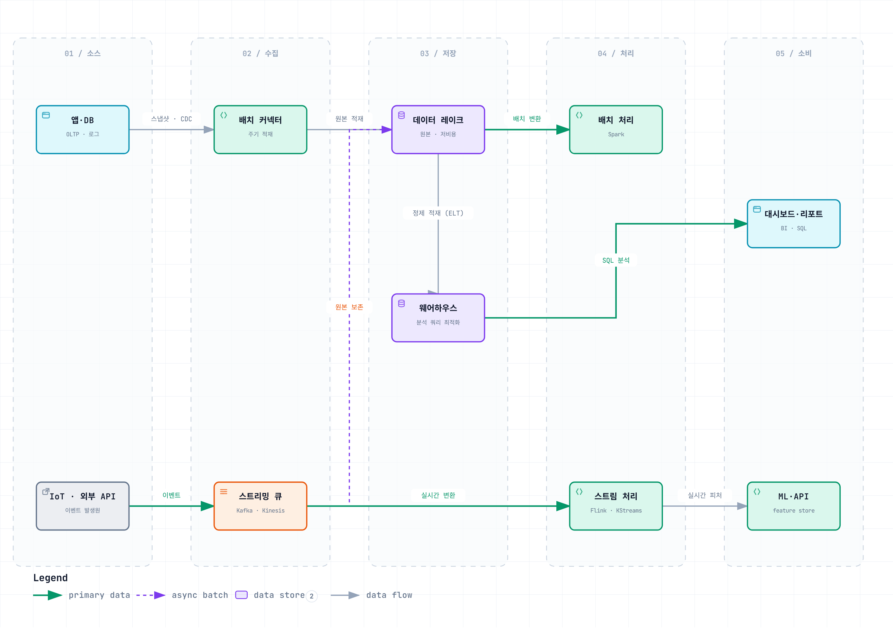

# 모던 데이터 파이프라인 해부 — 5개 계층

> **마지막 업데이트**: 2026년 8월 28일

::: tip 이 문서의 위치
Kafka·Spark·Airflow·Flink 딥다이브를 읽기 전에, 그 도구들이 **전체 파이프라인의 어느 자리에서 무슨 문제를 푸는지**를 한 장으로 정리합니다. 이미 데이터 플랫폼을 운영해봤다면 건너뛰고 각 딥다이브로 바로 가셔도 됩니다.
:::

데이터 파이프라인은 하나의 제품이 아니라 **계층의 스택**입니다. 각 계층은 원시 입력을 비즈니스에서 쓸 수 있는 인사이트로 옮기는 과정에서 정확히 하나의 역할을 맡고, 위 계층은 아래 계층이 이미 동작한다고 가정합니다. 그래서 파이프라인 설계에서 개별 기술 선택만큼 중요한 것이 **계층과 계층 사이의 계약**입니다 — 어떤 스키마로, 얼마나 신선하게, 실패하면 어떻게 재처리할 것인가.

[🔍 인터랙티브 다이어그램 보기](https://www.atomai.click/kubernetes-docs/archmaps/ko-data-on-eks-01-data-pipeline-anatomy-0.html)

---

## 1. 소스 계층 — 데이터가 태어나는 곳

애플리케이션 데이터베이스(OLTP), 서비스 로그, IoT 디바이스, 외부 API가 원천입니다. 이 계층에서 결정되는 것은 두 가지입니다.

- **변경을 어떻게 감지하는가** — 주기적 전체 스냅샷이냐, CDC(Change Data Capture)로 변경분만 흘리느냐. CDC는 신선도가 높지만 소스 DB의 복제 로그에 의존하므로 스키마 변경에 취약합니다.
- **소스에 부하를 얼마나 줄 것인가** — 파이프라인이 프로덕션 DB를 느리게 만들면 본말이 전도됩니다. 읽기 복제본이나 로그 기반 추출이 표준적인 완충 장치입니다.

## 2. 수집 계층 — 모으는 두 가지 방법

| | 배치 커넥터 | 스트리밍 큐 |
|---|---|---|
| 동작 | 주기적으로 묶어서 적재 | 이벤트를 연속적으로 발행·구독 |
| 지연 | 분~시간 | 밀리초~초 |
| 대표 도구 | Airbyte, Sqoop, 자체 배치 잡 | **Kafka**, Kinesis, Pulsar |
| 어울리는 데이터 | 스냅샷, 정산, 백필 | 클릭스트림, 센서, 주문 이벤트 |

실무 파이프라인은 대부분 **둘 다** 씁니다. 핵심 설계 포인트는 스트리밍 큐가 단순 전송로가 아니라 **재처리의 기준점**이 된다는 것입니다. Kafka의 보존 기간 안에서는 컨슈머 오프셋을 되감아 장애 이후 재소비할 수 있고, 이것이 아래 처리 계층의 정확성 보장(exactly-once 등)의 토대가 됩니다.

> 📎 EKS에서 Kafka를 직접 운영하는 방법은 [Kafka on EKS 딥다이브](./kafka/README.md) 8부작을 참고하세요.

## 3. 저장 계층 — 레이크, 웨어하우스, 레이크하우스

| | 데이터 레이크 | 웨어하우스 | 레이크하우스 |
|---|---|---|---|
| 저장 형태 | 원본 그대로 (파일/오브젝트) | 정제된 테이블 | 레이크 위에 테이블 포맷 |
| 강점 | 저비용, 스키마 유연성 | 분석 쿼리 성능, 거버넌스 | 둘의 절충 |
| 약점 | 쿼리 성능, "데이터 늪" 위험 | 비용, 적재 전 정제 필요 | 생태계 성숙도 |
| 대표 | S3 | Redshift, Snowflake, BigQuery | Iceberg, Delta Lake, Hudi |

흐름은 보통 **원본은 레이크에 먼저 보존하고**(재처리 가능성 확보), 정제본을 웨어하우스로 적재(ELT)하는 순서입니다. 최근에는 S3 위에 Iceberg 같은 오픈 테이블 포맷을 얹어 레이크 하나로 두 역할을 겸하게 하는 레이크하우스 채택이 늘고 있습니다 — 저장은 한 곳, 쿼리 엔진은 워크로드별로 선택하는 구조입니다.

## 4. 처리 계층 — 배치와 스트림

- **배치 처리** — 레이크/웨어하우스에 쌓인 데이터를 주기적으로 변환·집계합니다. 대표 도구는 **Spark**. 처리량이 크고 재실행이 쉬운 대신 지연이 큽니다.
- **스트림 처리** — 스트리밍 큐의 이벤트를 도착 즉시 변환·집계합니다. 대표 도구는 **Flink**, Kafka Streams. 상태 관리와 체크포인팅이 난이도의 근원입니다.

두 방식은 대체 관계가 아니라 **지연 요구사항에 따른 분업**입니다. 같은 지표를 스트림으로 근사 계산해 실시간 대시보드에 주고, 배치로 정확 재계산해 정산에 쓰는 패턴이 전형적입니다.

> 📎 EKS 위의 운영은 [Spark on EKS](./spark/README.md), [Flink on EKS](./flink/README.md) 딥다이브 참고.

## 5. 소비 계층 — 인사이트가 전달되는 곳

대시보드와 리포트(BI), ML 학습·추론용 feature store, 그리고 다운스트림 애플리케이션이 호출하는 데이터 API가 최종 수요처입니다. 이 계층에서 중요한 것은 **소비자별 신선도·정확도 계약을 명시하는 것**입니다. "대시보드는 5분 지연 허용, 정산 리포트는 정확성 우선, 추천 피처는 1초 이내" — 이 계약이 위 네 계층의 기술 선택을 역으로 결정합니다.

## 계층을 가로지르는 것들

- **오케스트레이션** — 계층 사이의 의존성과 스케줄, 실패 시 재시도를 관리합니다. 대표 도구는 **Airflow**([Airflow on EKS](./airflow/README.md) 참고). 파이프라인이 둘 이상이 되는 순간 필수가 됩니다.
- **스키마 계약** — 소스의 스키마 변경이 소비 계층까지 조용히 전파되어 깨뜨리는 사고가 파이프라인 장애의 단골입니다. 스키마 레지스트리와 호환성 규칙([Kafka Part 4](./kafka/04-schema-registry.md))이 방어선입니다.
- **관측성** — "어제 리포트 숫자가 왜 이상하죠?"에 답하려면 데이터 리니지(어느 소스에서 어떤 변환을 거쳤는지)와 각 계층의 신선도 지표가 필요합니다.

## EKS 관점에서 보면

이 5개 계층 중 수집(Kafka)·처리(Spark, Flink)·오케스트레이션(Airflow)이 이 섹션의 딥다이브가 다루는 영역입니다 — 모두 Operator 패턴으로 EKS 위에서 직접 운영할 수 있고, 저장 계층은 대개 S3(+ 테이블 포맷)와 관리형 웨어하우스로 클러스터 밖에 둡니다. 완전관리형(MSK, EMR, MWAA)과의 트레이드오프는 [Data on EKS 개요](./README.md)에서 다룹니다.

---

## 다음 문서

- [Kafka on EKS](./kafka/README.md) — 수집 계층 딥다이브
- [Spark on EKS](./spark/README.md) — 배치 처리 딥다이브
- [Flink on EKS](./flink/README.md) — 스트림 처리 딥다이브
- [Airflow on EKS](./airflow/README.md) — 오케스트레이션 딥다이브

## 참고

계층 구성은 Abhishek Agrawal의 "Anatomy of a Modern Data Pipeline" 인포그래픽을
출발점으로 삼았으며, 설명과 실무 관점은 별도로 작성했습니다.
