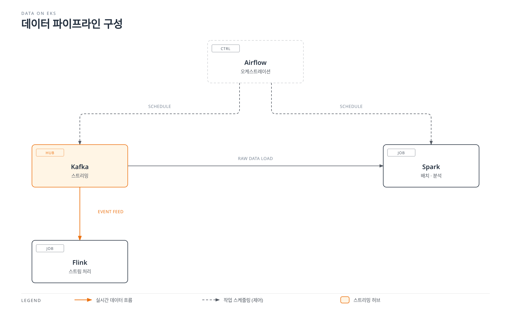

# Data on EKS

> **마지막 업데이트**: 2026년 7월 15일

## 개요

"Data on EKS"는 스트리밍, 배치 처리, 워크플로우 오케스트레이션 등 AWS 데이터 생태계의 핵심 워크로드를 완전관리형 서비스가 아니라 Amazon EKS 위에서 Kubernetes 네이티브 방식으로 직접 운영하는 접근 방식을 다루는 섹션입니다. Kafka, Spark, Airflow, Flink와 같은 도구를 컨테이너와 Operator 패턴으로 배포하면, 이미 EKS로 표준화된 플랫폼 안에서 데이터 워크로드를 나머지 애플리케이션과 동일한 방식으로 배포·관측·확장할 수 있습니다.

이는 Amazon MSK, Amazon EMR, Amazon MWAA 같은 완전관리형 서비스를 대체하기 위한 섹션이 아닙니다. 두 접근 방식은 서로 다른 트레이드오프를 가지며, 실제 프로젝트에서는 팀의 운영 역량, 커스터마이징 요구사항, 비용 구조에 따라 선택하거나 혼용하게 됩니다. 이 섹션은 EKS 위에서 직접 운영하는 옵션을 선택했을 때 필요한 지식을 다룹니다.

## 데이터 워크로드 카테고리

데이터 플랫폼을 구성하는 도구는 목적에 따라 크게 네 가지로 나눌 수 있습니다.

| 카테고리 | 해결하는 문제 | 대표 도구 | Data on EKS 콘텐츠 |
|----------|---------------|-----------|---------------------|
| **스트리밍 (Streaming)** | 이벤트를 실시간으로 발행·구독하고, 시스템 간 비동기 통신을 안정적으로 연결 | Apache Kafka | ✅ [Kafka on EKS](kafka/README.md) |
| **배치/분석 (Batch & Analytics)** | 대용량 데이터를 분산 처리하여 ETL, 집계, 머신러닝 파이프라인을 수행 | Apache Spark | ✅ [Spark on EKS](spark/README.md) |
| **워크플로우 오케스트레이션 (Orchestration)** | 여러 데이터 작업 간의 의존성과 스케줄을 정의하고 실행을 관리 | Apache Airflow | ✅ [Airflow on EKS](airflow/README.md) |
| **스트림 처리 (Stream Processing)** | 스트리밍 데이터에 대해 실시간으로 집계·변환·상태 기반 연산을 수행 | Apache Flink | ✅ [Flink on EKS](flink/README.md) |

## 왜 EKS에서 직접 운영하는가

완전관리형 서비스가 운영 부담을 크게 줄여주는 것은 사실이지만, 다음과 같은 이유로 EKS 네이티브 운영을 선택하는 팀이 늘고 있습니다.

- **통합 운영/관측성**: 데이터 워크로드도 나머지 마이크로서비스와 동일한 `kubectl`, GitOps, Prometheus/Grafana 스택으로 관리할 수 있어 운영 도구를 이중으로 유지할 필요가 없습니다.
- **오토스케일링**: [Karpenter](../autoscaling/02-karpenter.md) 기반 노드 오토스케일링과 HPA/KEDA를 활용해 브로커, 워커, 실행기(executor) 수를 워크로드에 맞춰 세밀하게 조정할 수 있습니다.
- **비용 효율**: Spot 인스턴스 활용, Bin-packing을 통한 노드 밀집도 향상 등 [EKS 비용 최적화](../eks/07-eks-cost-optimization.md) 기법을 데이터 워크로드에도 동일하게 적용할 수 있습니다.
- **멀티테넌시**: 네임스페이스, ResourceQuota, NetworkPolicy 등 Kubernetes의 격리 메커니즘을 그대로 활용해 여러 팀/워크로드를 하나의 클러스터에서 안전하게 공유할 수 있습니다.

물론 이 방식은 Operator 운영, 스토리지 설계, 업그레이드 전략 등을 팀이 직접 책임져야 한다는 트레이드오프를 동반합니다. 이후 각 도구별 딥다이브에서 이 균형점을 구체적으로 다룹니다.

## 현재 다루는 주제

- [Kafka on EKS](kafka/README.md) — Strimzi Operator를 사용해 Apache Kafka를 EKS에 배포하고 운영하는 방법을 8개 파트로 심층 다룹니다.
- [Spark on EKS](spark/README.md) — Spark-on-Kubernetes 기초, Spark Operator 생태계, Amazon EMR on EKS, 성능/비용 튜닝을 5개 파트로 다룹니다.
- [Airflow on EKS](airflow/README.md) — Airflow 3의 아키텍처, Helm 기반 배포와 Executor 선택, KubernetesPodOperator를 활용한 DAG 패턴, Amazon MWAA 연동을 5개 파트로 다룹니다.
- [Flink on EKS](flink/README.md) — Kubernetes 위에서의 Flink 아키텍처, Flink Kubernetes Operator, 상태 관리/체크포인팅, 운영 및 고가용성을 4개 파트로 다룹니다.

## 다음 단계

1. [Kafka on EKS](kafka/README.md) — Strimzi 기반 Kafka 딥다이브
2. [Spark on EKS](spark/README.md) — Spark Operator와 EMR on EKS 딥다이브
3. [Airflow on EKS](airflow/README.md) — Helm 기반 Airflow 배포와 DAG 패턴 딥다이브
4. [Flink on EKS](flink/README.md) — Flink Kubernetes Operator와 스트리밍 패턴 딥다이브
