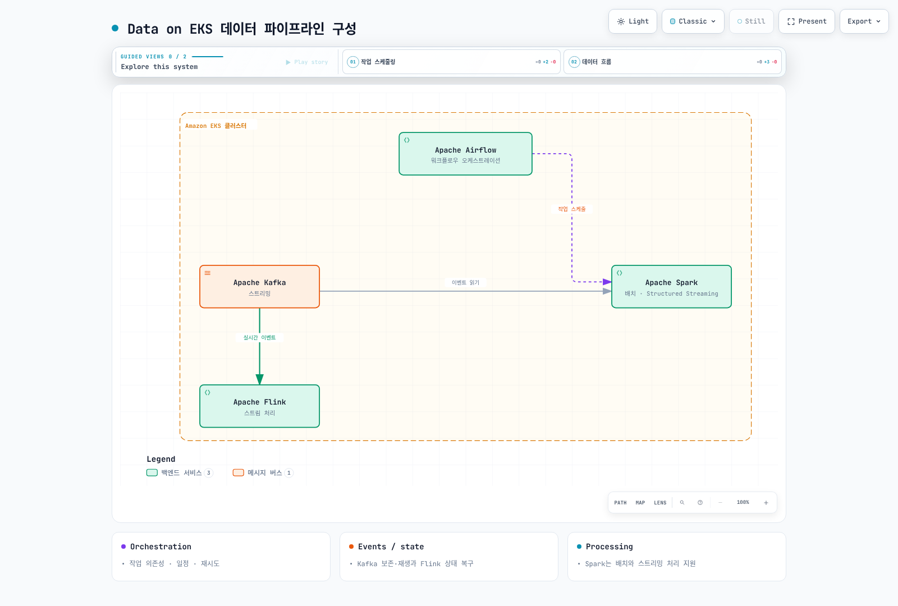

# Data on EKS

> **마지막 업데이트**: 2026년 9월 12일

## 개요

이 섹션은 Kafka·Spark·Airflow·Flink를 Amazon EKS에서 운영하는 방법과 AWS 관리형 서비스와의 연결을 다룹니다. 도구별 Helm chart, Kubernetes Operator, executor를 사용하되 배포·관측·확장 방식과 운영 책임은 서로 다릅니다.

직접 운영과 Amazon MSK·EMR·MWAA 같은 관리형 선택지는 운영 역량, 요구 기능, 가용성, 총비용에 따라 비교합니다. EMR on EKS는 작업 실행을 관리하면서도 사용자의 EKS 클러스터 운영 책임이 남습니다. SageMaker Unified Studio 항목은 EKS에 자체 배포하는 소프트웨어가 아니라 관리형 데이터·AI 작업 공간의 거버넌스를 연결하는 내용입니다.

## 데이터 워크로드 카테고리

네 가지 실행 워크로드와 이를 연결하는 관리형 거버넌스 영역을 구분합니다. 한 도구가 여러 역할을 수행할 수 있습니다.

| 카테고리 | 해결하는 문제 | 대표 도구 | Data on EKS 콘텐츠 |
|----------|---------------|-----------|---------------------|
| **스트리밍 (Streaming)** | 이벤트를 실시간으로 발행·구독하고, 시스템 간 비동기 통신을 안정적으로 연결 | Apache Kafka | ✅ [Kafka on EKS](kafka/README.md) |
| **배치/분석 (Batch & Analytics)** | 대용량 데이터를 분산 처리하여 ETL, 집계, 머신러닝 파이프라인을 수행 | Apache Spark | ✅ [Spark on EKS](spark/README.md) |
| **워크플로우 오케스트레이션 (Orchestration)** | 여러 데이터 작업 간의 의존성과 스케줄을 정의하고 실행을 관리 | Apache Airflow | ✅ [Airflow on EKS](airflow/README.md) |
| **스트림 처리 (Stream Processing)** | 스트리밍 데이터에 대해 실시간으로 집계·변환·상태 기반 연산을 수행 | Apache Flink | ✅ [Flink on EKS](flink/README.md) |
| **거버넌스 기반 데이터·AI 작업 공간** | 데이터 자산, project profile, 도구와 membership을 관리형 경계에서 공유 | SageMaker Unified Studio | ✅ [Unified Studio 거버넌스](sagemaker-unified-studio/README.md) |

[🔍 인터랙티브 다이어그램 보기](https://www.atomai.click/kubernetes-docs/archmaps/ko-data-on-eks-readme-0.html)

## 왜 EKS에서 직접 운영하는가

EKS 직접 운영을 검토할 때 다음 가능성과 제약을 함께 평가합니다.

- **통합 운영/관측성**: 기존 `kubectl`, GitOps, Prometheus/Grafana 체계를 재사용할 수 있습니다. 데이터 품질·리니지·쿼리 성능·소비 지연처럼 별도 관측이 필요한 영역은 남습니다.
- **오토스케일링**: [Karpenter](../autoscaling/02-karpenter.md)는 노드 용량을, HPA/KEDA나 각 엔진의 autoscaler는 지원되는 작업·워커를 조정합니다. Kafka 브로커 확장에는 파티션 재배치, quorum, 스토리지와 Operator 지원을 함께 검토해야 합니다.
- **비용 효율**: 재시작·체크포인트·복제 요구를 만족하는 작업에 Spot과 bin-packing을 적용할 수 있습니다. [EKS 비용 최적화](../eks/07-eks-cost-optimization.md)는 스토리지·네트워크·운영 인력 비용과 함께 평가하며 브로커나 상태 저장 작업에 일률 적용하지 않습니다.
- **멀티테넌시**: namespace, ResourceQuota, NetworkPolicy는 격리 구성 요소입니다. 실제 데이터 접근 권한, 실행 신뢰 수준, 인증·스토리지·네트워크 정책을 검증해야 하며 namespace만으로 완전한 테넌트 격리가 되지는 않습니다.

물론 이 방식은 Operator 운영, 스토리지 설계, 업그레이드 전략 등을 팀이 직접 책임져야 한다는 트레이드오프를 동반합니다. 이후 각 도구별 딥다이브에서 이 균형점을 구체적으로 다룹니다.

## 현재 다루는 주제

- [모던 데이터 파이프라인 해부](01-data-pipeline-anatomy.md) — 소스부터 소비까지 5개 계층으로 파이프라인 전체 구조를 조망하고, 각 딥다이브가 어느 계층을 다루는지 매핑하는 도입 문서입니다.
- [Kafka on EKS](kafka/README.md) — Strimzi Operator를 사용해 Apache Kafka를 EKS에 배포하고 운영하는 방법을 8개 파트로 심층 다루고, Part 9에서 gp3 위 3-브로커 RF3 클러스터의 ingest 상한을 실측합니다.
- [Spark on EKS](spark/README.md) — Spark-on-Kubernetes 기초, Spark Operator 생태계, Amazon EMR on EKS, 성능/비용 튜닝을 5개 파트로 다룹니다.
- [Airflow on EKS](airflow/README.md) — Airflow 3의 아키텍처, Helm 기반 배포와 Executor 선택, KubernetesPodOperator를 활용한 DAG 패턴, Amazon MWAA 연동을 5개 파트로 다룹니다.
- [Flink on EKS](flink/README.md) — Kubernetes 위에서의 Flink 아키텍처, Flink Kubernetes Operator, 상태 관리/체크포인팅, 운영 및 고가용성을 4개 파트로 다룹니다.
- [SageMaker Unified Studio 거버넌스](sagemaker-unified-studio/README.md) — domain, project profile, project, catalog asset, membership과 삭제 lifecycle을 다룹니다.

## 다음 단계

1. [Kafka on EKS](kafka/README.md) — Strimzi 기반 Kafka 딥다이브
2. [Spark on EKS](spark/README.md) — Spark Operator와 EMR on EKS 딥다이브
3. [Airflow on EKS](airflow/README.md) — Helm 기반 Airflow 배포와 DAG 패턴 딥다이브
4. [Flink on EKS](flink/README.md) — Flink Kubernetes Operator와 스트리밍 패턴 딥다이브
5. [SageMaker Unified Studio 거버넌스](sagemaker-unified-studio/README.md) — 관리형 데이터·AI 작업 공간과 EKS 파이프라인을 연결하는 거버넌스 가이드
