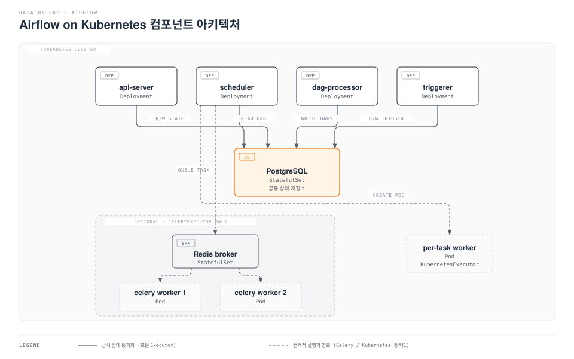

# Part 1: Kubernetes에서의 Airflow 아키텍처

> **지원 버전**: Apache Airflow 3.2+, Kubernetes 1.30+\
> **마지막 업데이트**: 2026년 7월 15일

## Apache Airflow란 무엇인가?

Apache Airflow는 작업(task)들을 방향성 비순환 그래프(DAG, Directed Acyclic Graph)로 정의해 스케줄링하고 모니터링하는 워크플로우 오케스트레이션 플랫폼입니다. ETL/ELT 파이프라인, ML 학습 파이프라인, 시스템 간 배치 워크플로우를 다루는 사실상의 표준 오케스트레이터로, 개별 작업을 고정된 워커 풀에서 경쟁시키는 대신 Pod 단위로 확장할 수 있다는 이유로 Kubernetes 위에서 많이 운영됩니다.

Airflow 2는 2026년 4월 22일부로 EOL(End of Life)에 도달해 더 이상 수정 사항을 받지 않으므로, 신규 배포는 반드시 **Airflow 3.x** 계열을 대상으로 해야 합니다(3.0은 2025년 4월 GA되었고, 이 글을 쓰는 시점의 최신 안정 버전은 3.3.0입니다). 이 문서는 Kubernetes 위에서의 Airflow 3 컴포넌트 아키텍처를 다룹니다. Part 2에서는 공식 Helm 차트를 이용해 EKS에 실제로 배포하는 과정과, 사용 가능한 Executor들을 깊이 있게 비교합니다.

## 1. Airflow 3가 모놀리스를 분리한 이유

Airflow 2에서는 단일 **웹서버(webserver)** 프로세스가 UI, REST API, 인증을 모두 담당했고, **스케줄러(scheduler)** 프로세스는 작업 인스턴스를 스케줄링하는 것뿐 아니라 DAG 파일을 파싱해 메모리 상의 DAG 표현을 최신 상태로 유지하는 역할까지 함께 맡았습니다. DAG 수가 많거나, DAG 중첩이 깊거나, DAG 파일의 최상위 코드가 무거운 환경에서는 파일 파싱이 스케줄러 본연의 스케줄링 루프를 잠식할 수 있었고, 이는 플랫폼의 핵심 신뢰성 지표인 "준비된 작업을 제때 큐에 올리는 것"에 직접적인 악영향을 끼쳤습니다.

Airflow 3는 배포를 각각 단일 책임을 갖는 4개의 독립적으로 확장 가능한 서비스로 분리해 이 문제를 해결합니다.

* **`airflow api-server`**: UI와 REST API v2를 제공하고 인증을 담당하는, FastAPI 기반의 새로운 서비스입니다. Airflow 2의 Flask 기반 웹서버를 대체합니다.
* **`airflow scheduler`**: 이제 **오직 스케줄링만** 수행합니다 — 작업 간 의존성을 평가하고, 실행을 트리거하고, 작업 인스턴스를 큐에 넣습니다. 더 이상 DAG 파일을 직접 파싱하지 않습니다.
* **`airflow dag-processor`**: **필수(mandatory)** 서비스로 새로 도입되었습니다(2.x에서는 선택적으로 켤 수 있는 프로세스였습니다). 유일한 역할은 DAG 파일을 파싱해 그 결과를 메타데이터 DB의 `serialized_dag` 테이블에 기록하는 것입니다. 스케줄러는 매 루프마다 파일을 다시 파싱하는 대신 이 테이블에서 DAG 구조를 읽어옵니다.
* **`airflow triggerer`**: 지연 가능한(deferrable) 오퍼레이터를 실행합니다(Airflow 2와 역할 동일) — 외부 이벤트(API 응답, 파일 도착, 다른 작업의 완료 등)를 기다리는 동안 워커 슬롯을 반납하고, 이벤트가 발생하면 비동기적으로 재개되는 작업들입니다.

dag-processor를 필수로 만들고 파싱을 스케줄러의 루프에서 완전히 떼어낸 것이 Airflow 3의 대표적인 고가용성(HA) 개선점입니다. DAG 수의 급증이나 잘못 작성되어 느린 DAG 파일 하나가 더 이상 배포 전체의 스케줄링 지연을 유발할 수 없습니다. 두 관심사는 서로 독립적으로 확장됩니다 — 스케줄러 용량은 그대로 두고 dag-processor 레플리카만 늘려서 대량의 DAG 파싱 부하를 흡수할 수 있습니다.

### Airflow 2 vs Airflow 3: 무엇이 바뀌었나

| 항목 | Airflow 2 | Airflow 3 |
| --- | --- | --- |
| UI/API 프로세스 | Flask 기반 `webserver` | FastAPI 기반 `api-server` (UI + REST API v2 + 인증) |
| DAG 파싱 | 스케줄러 프로세스가 직접 수행 | 별도의 필수 서비스인 `dag-processor`가 수행 |
| DAG 프로세서 | 선택적(옵트인, 기본은 스케줄러 내부에서 파싱) | 필수 — 모든 배포에서 실행됨 |
| 스케줄러의 역할 | 스케줄링 + DAG 파일 파싱 | 스케줄링만 담당, Postgres의 `serialized_dag`를 읽음 |
| 하이브리드 Executor | `CeleryKubernetesExecutor`, `LocalKubernetesExecutor` | 제거됨 — 작업/DAG 단위 Executor 지정으로 대체 |

### 백엔드 서비스

* **PostgreSQL** (메타데이터 데이터베이스): 항상 필요합니다. DAG/작업 상태, 스케줄러가 읽는 `serialized_dag` 테이블, 커넥션, 변수, XCom을 저장합니다.
* **Redis**: `CeleryExecutor`를 사용할 때만 필요합니다(Airflow 2의 `CeleryKubernetesExecutor`도 마찬가지였지만, 이 옵션이 3.x에서 사라진 이유는 아래에서 설명합니다). 스케줄러와 Celery 워커 풀 사이의 Celery 작업 브로커 역할을 합니다.

## 2. Kubernetes 위 컴포넌트 구성도



dag-processor는 Postgres에 쓰기만 하고, 스케줄러는 Postgres에서 DAG 구조를 읽기만 합니다. 스케줄러와 api-server 어느 쪽도 DAG 파일을 직접 파싱하지 않으며, DAG 파일 접근은 dag-processor Pod로 완전히 격리됩니다. 즉 DAG 작성자의 코드는 오직 이 하나의 컴포넌트의 파일시스템(또는 마운트된 볼륨)에서만 읽힐 수 있으면 됩니다.

## 3. Executor 개요

Executor를 선택하고 튜닝하는 내용은 Part 2에서 다룰 주제입니다. 여기서는 위 구성도가 맥락상 이해되도록 선택지만 간단히 소개합니다.

* **`KubernetesExecutor`**: 각 작업 인스턴스가 자신만의 Pod로 실행되며, Kubernetes API가 직접 스케줄링합니다. Pod는 필요할 때 생성되고 완료되면 종료되므로 유휴 용량이 거의 0에 가깝지만, 작업마다 Pod 시작 지연이 발생합니다.
* **`CeleryExecutor`**: 항상 실행 중인 Celery 워커 Pod 풀이 브로커(위에서 다룬 Redis, 또는 RabbitMQ)에서 큐에 쌓인 작업을 가져갑니다. 작업마다 새 Pod를 스케줄링할 필요가 없어 시작 속도는 빠르지만, 트래픽이 뜸한 구간에도 유휴 워커 용량에 대한 비용을 지불해야 합니다.

### Executor 특징 한눈에 보기

| 항목 | `KubernetesExecutor` | `CeleryExecutor` |
| --- | --- | --- |
| 작업 시작 단위 | 작업 인스턴스마다 새 Pod | 이미 실행 중인 워커가 작업을 가져감 |
| 유휴 자원 비용 | 거의 0 — 실행할 작업이 없으면 Pod도 없음 | 0이 아님 — 작업 큐가 비어 있어도 워커 풀은 계속 실행됨 |
| 작업 시작 지연 | 높음 — 작업마다 Pod 스케줄링/이미지 풀 비용 발생 | 낮음 — 워커가 이미 실행 중 |
| 브로커 의존성 | 없음 | Redis(또는 RabbitMQ) 필요 |
| 작업 간 격리 | 강함 — 각 작업이 자신만의 Pod와 리소스 제한을 가짐 | 상대적으로 약함 — 작업들이 워커 Pod의 리소스를 공유 |

### Airflow 3에서 사라진 하이브리드 Executor

Airflow 2는 `CeleryKubernetesExecutor`와 `LocalKubernetesExecutor`라는 두 가지 하이브리드 Executor를 제공했습니다. 이를 이용하면 하나의 Airflow 배포 안에서 작업 단위 큐 이름에 따라 일부 작업은 Celery 워커로, 일부는 Kubernetes Pod로 라우팅할 수 있었습니다. Airflow 3.0에서는 **두 하이브리드 Executor 클래스가 모두 제거**되었습니다.

이를 대체하는 것은 더 범용적인 기능입니다. Airflow 3는 **여러 Executor를 동시에 설정**할 수 있게 하고, 작업 하나 또는 DAG 전체에 명시적으로 Executor를 지정할 수 있습니다(예: DAG의 나머지는 배포 기본 Executor를 쓰되, 특정 작업 하나만 `executor="KubernetesExecutor"`로 지정). 이는 의도된 단순화입니다 — 하이브리드 Executor 클래스는 특정한 하나의 이원 분할을 하드코딩하기 위해서만 존재했고, 새로운 조합이 필요할 때마다 전용 하이브리드 클래스를 새로 만들어야 했습니다. 다중 Executor 설정은 이 아이디어를 일반화한 것으로, 특정 쌍을 위한 특수 클래스 없이도 Airflow의 모든 Executor(둘이 아니라 그 이상)를 작업 또는 DAG 단위로 지정할 수 있습니다.

## 실습 환경 준비

Part 2에서는 동작하는 Airflow 3 클러스터를 실제로 배포하므로, 다음 사전 준비를 미리 해두세요.

* **`kubectl`** — 관리자 권한이 있는 EKS 클러스터(1.30+)에 연결된 상태
* **Helm 3** — 로컬에 설치
* **EKS 클러스터** — 소규모~중간 규모 Pod 여러 개를 감당할 수 있는 관리형 노드 그룹 최소 1개(api-server, scheduler, dag-processor, triggerer는 모두 가볍지만, 작업 Pod의 크기는 워크로드에 따라 달라집니다)
* **메타데이터 DB용 PostgreSQL 인스턴스** — 두 가지 선택지가 있으며, 둘 다 Part 2에서 다룹니다.
  * 공식 Helm 차트에 내장된 Postgres(PVC 기반의 단일 in-cluster Pod) — 가장 빠르게 띄울 수 있어 학습·개발 환경에 적합
  * 외부 Amazon RDS for PostgreSQL 인스턴스 — 클러스터를 삭제해도 데이터가 유지되고 관리형 백업/HA를 확보할 수 있어, 실습 이상의 용도라면 권장되는 방식

Redis는 아직 준비할 필요가 없습니다 — Part 2의 Executor 비교 결과 `CeleryExecutor`를 선택하게 될 때만 준비하면 됩니다.

```bash
# 공식 Airflow Helm 차트 저장소 추가 (Part 2에서 사용)
helm repo add apache-airflow https://airflow.apache.org
helm repo update

# Part 2 진행 전 kubectl 접근 확인
kubectl get nodes
kubectl create namespace airflow --dry-run=client -o yaml
```

Part 2에서 설치를 마치면 4개의 개별 Deployment(`airflow-api-server`, `airflow-scheduler`, `airflow-dag-processor`, `airflow-triggerer`)와 Postgres Pod(또는 StatefulSet)가 보여야 합니다 — 위 구성도의 아키텍처가 실제로 동작하는 모습입니다.

## 다음 단계

이번 문서에서는 Airflow 3의 4가지 서비스 구조(api-server, scheduler, dag-processor, triggerer), DAG 파싱이 스케줄러에서 분리되어 별도의 필수 서비스가 된 이유, 2.x의 하이브리드 Executor가 작업/DAG 단위 Executor 지정으로 대체된 이유를 살펴봤습니다. Part 2에서는 공식 Helm 차트를 이용해 이 아키텍처를 EKS에 배포하고, 메타데이터 데이터베이스를 설정하며, `KubernetesExecutor`와 `CeleryExecutor`를 더 깊이 비교해 워크로드에 맞는 선택을 돕습니다.

[메인 페이지로 돌아가기](./README.md)

## 퀴즈

이 장에서 배운 내용을 테스트하려면 [주제 퀴즈](../../quizzes/data-on-eks/airflow/01-architecture-quiz.md)를 풀어보세요.
