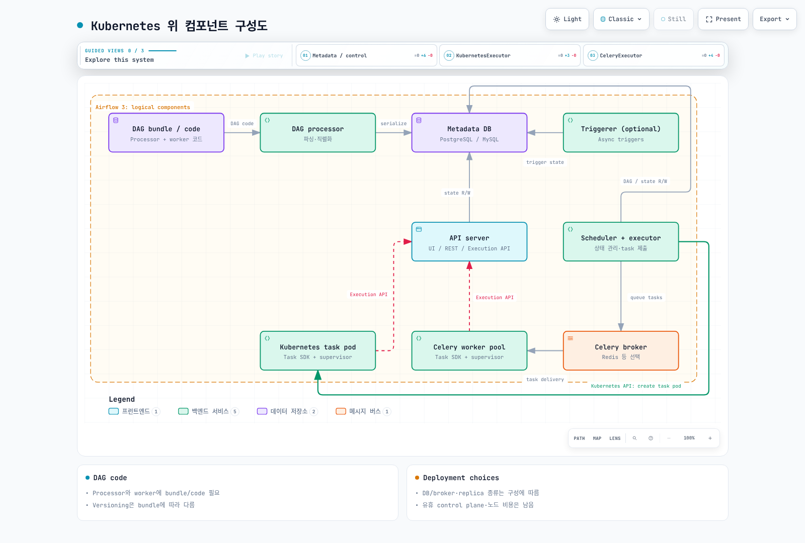

# Part 1: Kubernetes에서의 Airflow 아키텍처

> **검토 기준**: Airflow 3.3.1 / Helm chart 1.22.0 · 2026년 9월 12일

## 1. 구성 요소와 작업 실행

Airflow는 DAG에 정의한 의존성을 보고 task instance를 예약·실행·관찰합니다.
실제 계산은 선택한 executor의 worker, 외부 Pod 또는 호출한 외부 서비스가 수행할 수
있습니다. Kubernetes API server는 요청·상태를 제공하고 scheduler/kubelet이
Pod 배치·시작을 담당합니다.

| 구성 요소 | 역할과 범위 |
| --- | --- |
| Scheduler + executor | DAG/task 의존성·실행 가능 여부 판단, task 제출, 상태·heartbeat 관리; DB에 읽기/쓰기 |
| DAG processor | Bundle 접근, DAG 파일 파싱과 직렬화·버전 관련 metadata 갱신; Airflow 3에서 별도 필수 역할 |
| API server | UI·REST API v2와 Execution API; auth manager 및 배포 설정으로 인증·인가 구성 |
| Task runtime / worker | Operator·Task SDK 코드를 실행하고 실행 API 등 필요한 서비스와 통신 |
| Triggerer | Deferred task의 trigger를 async event loop에서 실행; deferral을 사용하지 않으면 생략 가능 |
| Metadata DB | DAG/task 상태·직렬화된 구조 등의 공유 저장소 |

### Airflow 3의 Execution API

일반적인 Python Task SDK 실행에서는 worker가 supervisor 프로세스를 시작하고,
supervisor가 task-runner 프로세스를 실행합니다. Task 코드와 supervisor는 socket으로
통신하고, supervisor는 단기 task JWT로 **Execution API**를 호출합니다.
Task 코드가 metadata DB에 직접 접근하는 대신 Connection·Variable·XCom·상태
등의 public SDK 경로를 사용하는 구조입니다.

이 때문에 worker→API server의 주소·인증·네트워크가 실제 의존성입니다.
단순히 scheduler→worker 화살표만으로 Airflow 3 실행 구조를 설명하면 부족합니다.
Celery result backend 등 executor 내부 저장소·system worker의 요구 사항은 별도로
확인합니다. 이 설명을 모든 backend 프로세스가 어떤 DB에도 접속하지 않는다는
보장으로 확대하지 않습니다. 로컬 dag.test 등의 in-process 실행도 일반 supervised
배포와 동일한 프로세스·HTTP 경로라고 가정하지 않습니다.

### Triggerer와 worker 구분

Operator는 worker에서 시작하다가 기다릴 지점에서 trigger를 등록하고 defer할 수
있습니다. Triggerer가 trigger를 실행하고 이벤트가 발생하면 task가 다시 예약되어
worker에서 재개됩니다. Triggerer가 operator 전체를 대신 실행하는 것은 아닙니다.
Deferred task는 worker slot을 놓으며 pool slot도 기본적으로 차지하지 않지만 pool
설정으로 바꿀 수 있습니다. 일반 async task는 worker slot을 유지할 수 있어 별개입니다.

## 2. Airflow 2와 3의 실제 차이

Airflow 2는 2026년 4월 22일 EOL이며 아래 비교는 마이그레이션 이해용입니다.

| 항목 | Airflow 2.x | Airflow 3.x |
| --- | --- | --- |
| UI/API | Flask 계열 webserver | FastAPI 기반 api-server와 task Execution API 경로 |
| DAG 파싱 | Manager·개별 file-processing subprocess, standalone dag-processor 선택 가능 | 별도 DAG processor가 필수 구성 역할 |
| DAG 구조 읽기 | Scheduler가 serialized DAG를 사용하는 구조가 이미 존재 | Serialized 구조와 버전 metadata를 사용하는 구조 지속 |
| Scheduler HA | DB 기반 multi-scheduler 지원이 이미 존재 | HA와 용량·DB 부하를 계속 설계·검증 |
| 여러 executor 동시 설정 | 2.10.0부터 지원 | 유지·확장된 기본 선택지 |
| 고정 hybrid executor | LocalKubernetesExecutor·CeleryKubernetesExecutor 사용 가능했던 계열 | 3.0부터 지원 중단 |

“Airflow 2가 모든 DAG를 scheduler의 같은 Python loop 안에서 직접 파싱했고,
Airflow 3부터 HA가 가능해졌다”는 설명은 맞지 않습니다. 분리하면 파싱과 스케줄링을
독립적으로 조정하기 좋지만 새 DAG의 파싱 지연, 공유 CPU·메모리·metadata DB 병목,
과도한 parser 수 등은 계속 scheduling latency에 영향을 줄 수 있습니다.
Replica 수만 늘려 안전성이 자동으로 확보되지 않습니다.

## 3. Metadata, broker와 DAG 코드

Airflow 3.3.1의 테스트 목록은 PostgreSQL 14–18, MySQL 8.0/8.4/Innovation,
SQLite 3.15.0+입니다. **SQLite는 개발·시험용이며 production에 사용하지 않습니다.**
MariaDB는 지원하지 않습니다. 이 시리즈의 PostgreSQL 선택이 MySQL 지원 부재를
뜻하지는 않습니다. 관리형 DB도 HA·백업 보존·삭제 정책을 실제로 구성해야 합니다.

CeleryExecutor에는 호환 broker가 필요하며 Redis 또는 RabbitMQ 등의 선택지가
있습니다. KubernetesExecutor/LocalExecutor 때문에 Redis가 필수인 것은 아닙니다.
Metadata DB와 broker, 선택한 Celery result backend를 같은 개념으로 취급하지 않습니다.
Connection·Variable은 secrets backend, XCom payload는 다른 backend에 저장하도록
구성할 수도 있습니다.

DAG processor **뿐 아니라 worker에도** 실행할 DAG/task 코드와 필요한 패키지가
있어야 합니다. API server가 일반 task 실행을 위해 DAG 파일을 직접 파싱하는 구조는
아니지만, plugin·auth manager·trigger 등 구성별 코드/의존성 배포는 별도로 필요합니다.

| DAG bundle | 현재 버전 고정 지원 |
| --- | --- |
| GitDagBundle | 지원 |
| LocalDagBundle | 미지원; 로컬 최신 코드 사용 |
| S3DagBundle / GCSDagBundle | 미지원; object-store 자체 versioning과 구분 |

git-sync는 chart 1.22.0에도 남아 있습니다. 실제 렌더링에서 DAG processor·triggerer
sidecar/init container와 Kubernetes task Pod template의 init container를 확인했습니다.
git-sync·이미지 내 DAG·공유 volume·원격 bundle 중 적합한 전달 방식을 선택합니다.
Bundle이 해당 실행 코드 버전을 보존하는지와 retry 시 어떤 코드를 읽는지 검증합니다.



[Interactive diagram](https://www.atomai.click/kubernetes-docs/archmaps/ko-data-on-eks-airflow-01-architecture-0.html)

## 4. Executor 선택과 여러 executor

| 선택 | 실행 단위 | 비용·시작 시간·격리 고려 |
| --- | --- | --- |
| LocalExecutor | Scheduler 쪽 로컬 task process | 별도 broker 불필요; scheduler와 자원·경계를 공유 |
| KubernetesExecutor | Task instance별 worker Pod | Pod 배치·이미지 시작 지연; 자원 제한·identity는 실제 spec에 달림 |
| CeleryExecutor | Broker에서 작업을 가져오는 worker pool | Warm worker는 빠를 수 있음; KEDA 등으로 scale-to-zero하면 cold start 발생 |

KubernetesExecutor가 idle worker Pod를 남기지 않아도 Airflow control plane·DB·노드·
로그 비용은 남습니다. Pod 하나씩 쓴다는 사실만으로 강한 보안 경계가 자동 제공되지
않습니다. KubernetesPodOperator는 task가 별도 Pod를 실행하는 **operator**이며
KubernetesExecutor와 같은 개념이 아닙니다.

여러 executor를 설정하면 첫 항목이 기본값입니다. Task의 executor 필드로 선택하고,
DAG 전체 기본값은 `default_args={"executor": "KubernetesExecutor"}`처럼 지정할 수
있습니다. Task별 값이 이를 override합니다. 선택한 executor/alias가 실제로 설정되어
있고 provider·버전·RBAC가 호환되는지 확인합니다. 이 기능은 2.10.0부터 있었으며,
3.0의 고정 hybrid 제거와 구분합니다.

## 5. Part 2 준비와 검증 범위

Chart 1.22.0은 Helm **3.19.0+**와 Airflow **3.1.0+**를 대상으로 합니다.
Airflow 3.3.1의 Kubernetes 테스트 목록은 **1.30–1.35**입니다. 이것을 모든 미래
Kubernetes 버전 지원이나 오래된 EKS 1.30 권장으로 해석하지 않습니다.
실제 EKS 지원 기간·선택한 provider/chart 호환성을 함께 확인합니다.

Part 2에서 이미지·DB/broker 연결·DAG 전달·권한·스토리지를 준비합니다.
API server·scheduler·DAG processor·triggerer가 모두 가벼운 고정 크기라고 가정하지
않고 DAG 수·parse 비용·API 부하·동시 task에 맞게 측정합니다.

```bash
helm version --short
helm repo add apache-airflow https://airflow.apache.org
helm repo update apache-airflow
helm show chart apache-airflow/airflow --version 1.22.0
kubectl config current-context
# Prints the namespace manifest; does not create it.
kubectl create namespace airflow --dry-run=client -o yaml
```

고정된 4개 Deployment만 기대하지 않습니다. 실제 chart에서 triggerer는 persistence
설정에 따라 StatefulSet 또는 Deployment였고, StatsD·DB·broker·worker 리소스도
선택한 values에 따라 달랐습니다. 외부 DB이면 PostgreSQL Pod가 없을 수 있습니다.

이 장은 3.3.1 override로 KubernetesExecutor·CeleryExecutor·git-sync의 세 chart
구성을 렌더링했습니다. 실제 DB 연결·task 실행·이미지 pull이나 HA 복구 시험은
아니며 Part 2의 환경 검증이 필요합니다.


- [Airflow 3.3.1 architecture](https://airflow.apache.org/docs/apache-airflow/3.3.1/core-concepts/overview.html)
- [Supported versions and lifecycle](https://airflow.apache.org/docs/apache-airflow/3.3.1/installation/supported-versions.html)
- [Airflow prerequisites](https://airflow.apache.org/docs/apache-airflow/3.3.1/installation/prerequisites.html)
- [Executor configuration and history](https://airflow.apache.org/docs/apache-airflow/3.3.1/core-concepts/executor/index.html)
- [DAG bundles](https://airflow.apache.org/docs/apache-airflow/3.3.1/administration-and-deployment/dag-bundles.html)
- [Deferrable operators and triggers](https://airflow.apache.org/docs/apache-airflow/3.3.1/authoring-and-scheduling/deferring.html)
- [Airflow 2.11 DAG processing](https://airflow.apache.org/docs/apache-airflow/2.11.0/authoring-and-scheduling/dagfile-processing.html)
- [Airflow 2.11 scheduler HA](https://airflow.apache.org/docs/apache-airflow/2.11.0/administration-and-deployment/scheduler.html)
- [Official Helm chart](https://airflow.apache.org/docs/helm-chart/1.22.0/index.html)

[Part 2: Helm deployment](02-helm-deployment.md)

[README](README.md)

[Quiz](../../quizzes/data-on-eks/airflow/01-architecture-quiz.md)
