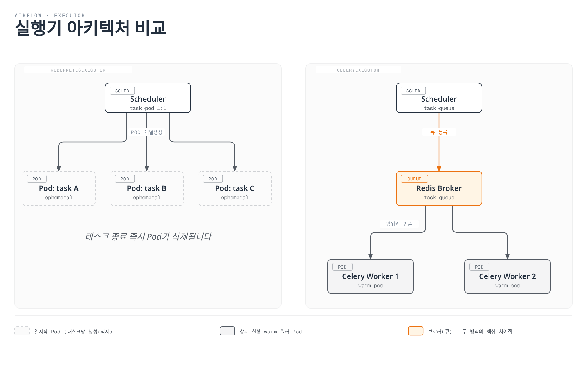

# Part 2: Helm 배포와 Executor 선택

> **지원 버전**: apache/airflow Helm 차트 1.22+ (기본적으로 Airflow 3.2.2 배포), Kubernetes 1.30+\
> **마지막 업데이트**: 2026년 7월 15일

## 실습 환경 설정

이 문서의 예제를 따라하기 위해서는 다음과 같은 도구와 환경이 필요합니다:

### 필수 도구

* kubectl v1.30 이상
* Helm v3.19 이상 (공식 차트가 요구하는 최소 버전)
* 작동하는 Kubernetes 클러스터 (Amazon EKS 권장)
* KEDA — 이 문서 뒤쪽의 `CeleryExecutor` 오토스케일링 예제를 실습할 경우에만 필요

## 서로 다른 두 개의 Airflow Helm 차트

설치를 시작하기 전에 자주 혼동되는 부분을 먼저 정리하겠습니다. Airflow를 Kubernetes에 배포하는 Helm 차트는 **서로 무관한 두 가지**가 존재하며, 이 둘의 문서나 values 스키마, GitHub 이슈를 혼용하면 엉뚱한 방향으로 헤매게 됩니다.

* **`apache/airflow`**: Apache Airflow 프로젝트가 직접 관리하는 공식 차트로, 메인 `apache/airflow` 저장소의 `chart` 디렉터리에서 배포됩니다. 이 문서가 다루는 차트이며, 업스트림 문서와 릴리스 노트가 가리키는 대상도 이 차트입니다.
* **`airflow-helm/charts`**: 흔히 저장소 이름을 따 `airflow-helm`이라고도 불리는, 더 오래된 커뮤니티 유지보수 차트입니다. 공식 차트보다 먼저 존재했고 values 스키마도 전혀 다르며, Apache Airflow 프로젝트와는 관련이 없습니다. 오래된 튜토리얼이나 블로그 글에서 자주 인용되기 때문에, 공식 차트에는 적용되지 않는 values.yaml 스니펫이 돌아다니는 가장 흔한 원인이 됩니다.

공식 차트의 릴리스 주기는 Airflow 본체의 릴리스와 비교적 밀접하게 맞물려 있습니다. 이 글을 쓰는 시점 기준 최신 버전은 **1.22.0**(2026년 6월 릴리스)이며, 기본적으로 **Airflow 3.2.2**를 배포합니다. 차트는 최소 Helm 버전으로 **3.19.0**을 요구하며, **1.16.0** 버전부터는 **Kubernetes 1.30+**를 요구합니다 — 둘 다 차트 자체의 `Chart.yaml` 제약 조건으로 강제되므로, 더 낮은 버전의 Helm이나 클러스터를 사용하면 배포가 어설프게 되는 것이 아니라 설치 시점에 곧바로 실패합니다.

## 설치

### 저장소 추가 및 설치

```bash
# Apache Airflow 공식 Helm 저장소 추가
helm repo add apache-airflow https://airflow.apache.org/
helm repo update

# 전용 네임스페이스에 특정 차트 버전으로 설치
helm install airflow apache-airflow/airflow \
  --namespace airflow \
  --create-namespace \
  --version 1.22.0

# 설치 확인
kubectl get pods -n airflow
helm list -n airflow
```

기본값으로 설치하면 차트에 내장된 PostgreSQL과 `KubernetesExecutor`가 함께 배포되어, 실습이나 평가용으로는 곧바로 동작하는 Airflow 3 환경을 얻을 수 있습니다. 이를 넘어서는 것(실제 메타데이터 DB, Executor 선택, 리소스 사이징)은 모두 `-f`로 전달하는 `values.yaml`에서 다뤄야 합니다.

### 가장 중요한 설정: `executor`

차트의 다른 모든 설정은 결국 최상위 값 하나에 종속됩니다. 이 값에 따라 차트가 어떤 부속 컴포넌트를 배포할지 자체가 달라지기 때문입니다.

```yaml
# values.yaml
executor: KubernetesExecutor  # 또는 CeleryExecutor

# executor가 CeleryExecutor일 때만 참조됨
workers:
  celery:
    keda:
      enabled: false  # 아래 오토스케일링 절 참고

# 실습을 넘어서는 환경이라면 외부 메타데이터 DB를 지정
postgresql:
  enabled: true  # RDS로 전환하면 false
```

```bash
helm upgrade airflow apache-airflow/airflow \
  --namespace airflow \
  --version 1.22.0 \
  -f values.yaml
```

이미 태스크가 실행 중인 상태에서 `executor`를 바꾸는 것은 파급 효과가 큽니다 — scheduler, 그리고 `CeleryExecutor`의 경우 worker Deployment와 Redis까지 이 필드 값에 따라 조건부로 렌더링되기 때문입니다. 프로덕션 트래픽을 받기 전에 배포 단위로 executor를 확정해 두는 것이 좋습니다.

### 외부 메타데이터 데이터베이스 연결

내장된 PostgreSQL Pod(PVC 기반 단일 replica)는 실습용으로는 충분하지만, 릴리스를 삭제하는 순간 함께 사라지고 failover도 없습니다. 실습을 넘어서는 환경이라면 이를 비활성화하고 외부 Amazon RDS for PostgreSQL 인스턴스를 대신 가리키도록 설정합니다.

```yaml
# values.yaml
postgresql:
  enabled: false

data:
  metadataConnection:
    user: airflow
    pass: airflow-password   # 실제 배포에서는 평문이 아니라 Secret을 참조
    protocol: postgresql
    host: airflow-metadata.xxxxxxxxxxxx.us-east-1.rds.amazonaws.com
    port: 5432
    db: airflow
```

차트에 내장된 PostgreSQL 서브차트와 외부 연결 필드는 실질적으로 상호 배타적입니다 — `postgresql.enabled`를 `false`로 설정하면 scheduler, api-server, dag-processor, triggerer 등 모든 컴포넌트가 대신 `data.metadataConnection`을 읽습니다.

## Executor 선택: KubernetesExecutor vs. CeleryExecutor

Part 1에서 컴포넌트 아키텍처의 일부로 두 executor를 개괄적으로 소개했다면, 여기서는 실제 배포 전에 결정해야 하는 트레이드오프를 더 깊이 다룹니다.

### KubernetesExecutor

각 태스크 인스턴스는 scheduler가 Kubernetes API를 통해 생성하는 자신만의 Pod에서 실행되고, 완료되면 곧바로 삭제됩니다.

* **적합한 경우**: 태스크가 런타임 격리가 필요하거나, 리소스 소모가 크거나, 태스크별로 다른 컨테이너 이미지(다른 Python 환경, GPU 이미지, DAG의 나머지 부분과 전혀 다른 런타임)를 써야 하는 경우
* **비용**: 아주 짧은 태스크라도 대략 **1~2분**의 콜드 스타트가 발생합니다 — Pod 스케줄링, (캐시되지 않았다면) 이미지 풀, 그리고 여유 용량이 없으면 Karpenter나 Cluster Autoscaler를 통한 노드 스케일 아웃까지 포함될 수 있습니다.
* **이점**: 태스크가 몰리지 않는 구간에는 유휴 비용이 전혀 없고, 격리 수준도 높습니다 — 한 태스크의 의존성 충돌이나 메모리 누수가 다른 태스크의 Pod에 영향을 주지 않습니다.

### CeleryExecutor

미리 기동된 Celery worker Pod 풀이 계속 실행되며 브로커에서 대기 중인 태스크를 가져와 처리합니다.

* **적합한 경우**: 시작 지연이 중요한, 짧고 동질적인 태스크 — 한 실행에 수백 개의 작은 태스크가 있는 DAG라면, 태스크당 1~2분의 Pod 기동을 기다리는 것과 이미 떠 있는 worker에 초 단위로 즉시 분배되는 것은 체감 차이가 큽니다.
* **비용**: 같은 worker로 라우팅된 모든 태스크가 그 worker의 리소스와 설치된 의존성을 공유합니다 — 태스크마다 전용 Pod를 쓰는 방식보다 격리 수준이 훨씬 낮습니다.
* **필요 조건**: 메시지 브로커(Redis 또는 RabbitMQ)와 상시 실행되는 worker Deployment가 추가로 필요하며, 둘 다 별도의 용량 계획과 운영 부담이 따르는 구성 요소입니다.

### 정답이 정해진 문제가 아니라 트레이드오프

이 선택은 "특별한 이유가 없으면 KubernetesExecutor를 쓴다"처럼 기본값이 정해진 문제가 아니라, 실제 트레이드오프입니다.

| | KubernetesExecutor | CeleryExecutor |
|---|---|---|
| 태스크 시작 지연 | 콜드 스타트 약 1~2분 | 초 단위 (warm pool) |
| 유휴 비용 | 없음 — 태스크가 실행되는 동안만 Pod 존재 | 0으로 스케일하지 않으면 worker 풀이 계속 실행됨 |
| 격리 수준 | 강함 — 태스크당 Pod 1개 | 약함 — 태스크들이 worker의 리소스/의존성을 공유 |
| 추가 인프라 | 클러스터 자체 외에는 없음 | Redis/RabbitMQ 브로커 + worker Deployment |
| 대량 태스크 시 스케일링 특성 | 예측 가능 — 클러스터 용량에 따라 스케일 | 지속적인 고부하 상황에서 worker 풀 스케일링이 골칫거리가 될 수 있음 |

실무에서는 태스크 처리량이 큰 팀일수록 `KubernetesExecutor`가 더 예측 가능하게 스케일된다고 느끼는 경우가 많습니다. 태스크별 리소스 사용량이 명시적이고, 나머지는 클러스터 오토스케일링이 처리하기 때문입니다. 반면 `CeleryExecutor`로 시작했다가 초기 사이징을 넘어서는 규모로 커진 배포는 worker 풀 스케일링 한계에 부딪혀 수동으로 재조정해야 하는 상황을 겪기도 합니다.

그렇다고 배포 전체에서 반드시 하나만 골라야 하는 것은 아닙니다. Part 1에서 소개한 Airflow 3의 "여러 executor 동시 사용" 기능을 이용하면, 배포 전역에 하나의 executor를 못 박는 대신 태스크 또는 DAG 단위로 executor를 지정할 수 있습니다 — 예를 들어 대부분의 DAG는 지연이 낮은 warm `CeleryExecutor` 풀에서 돌리면서, 리소스 소모가 크거나 GPU가 필요한 일부 태스크만 격리를 위해 `KubernetesExecutor`로 라우팅하는 식입니다. 대부분의 본격적인 배포에서는 이 방식이 현실적인 답입니다: 합리적인 기본 executor를 정하고, 다른 executor의 특성이 필요한 태스크만 명시적으로 오버라이드하는 것입니다.



`KubernetesExecutor`는 태스크마다 새 Pod가 생성되고 그 태스크의 생명주기 동안만 존재합니다. `CeleryExecutor`는 worker Pod가 장기간 살아있으면서 브로커에서 작업을 가져오는 구조로, 위 다이어그램의 worker Pod들은 태스크가 큐에 들어오기 전부터 이미 실행 중인 상태입니다.

## KEDA로 CeleryExecutor Worker 오토스케일링

Celery worker는 기본적으로 고정된 풀이기 때문에, 피크 부하에 맞춰 worker Deployment 크기를 잡으면 유휴 시간에는 그만큼 용량을 낭비하게 됩니다. KEDA는 고정된 replica 수 대신 실제로 실행/대기 중인 태스크 수를 기준으로 worker Deployment를 스케일링해 이 간극을 줄여줍니다.

`values.yaml`에서 활성화합니다.

```yaml
workers:
  celery:
    keda:
      enabled: true
      minReplicaCount: 0
      maxReplicaCount: 20
```

활성화하면 차트가 worker Deployment를 대상으로 하는 KEDA `ScaledObject`를 생성합니다. KEDA는 대략 **10초마다** 다음과 같은 쿼리로 메타데이터 DB를 폴링합니다.

```sql
SELECT ceil(COUNT(*)::decimal / worker_concurrency)
FROM task_instance
WHERE state IN ('running', 'queued');
```

이 결과가 곧 Pod당 설정된 `worker_concurrency`로 현재 실행/대기 중인 태스크 인스턴스를 모두 처리하는 데 필요한 worker replica 수입니다. 실행/대기 중인 태스크 수가 0이 되면 ScaledObject는 Deployment를 **0개 replica**까지 줄이지만, 태스크 활동이 없는 상태가 대략 **5분** 정도 유지된 뒤에야 스케일 다운이 이뤄집니다. 이는 DAG 실행 사이의 짧은 공백 때문에 worker 풀이 내려갔다가 곧바로 다시 올라오는 것을 막기 위한 것입니다.

### KubernetesExecutor에는 대응되는 KEDA 설정이 없는 이유

이 절은 `CeleryExecutor`에만 적용되며, "KubernetesExecutor용 KEDA" 같은 대응 패턴은 존재하지 않습니다 — 이는 빠진 기능이 아니라 설계상 그런 것입니다. `KubernetesExecutor`의 스케일링은 이미 Pod 단위로 세밀하게 이뤄집니다. 태스크마다 정확히 하나의 Pod가 생성되므로, 처음부터 크기를 조절해야 할 고정 크기의 worker 풀 자체가 존재하지 않습니다. `KubernetesExecutor`에서 실제로 스케일이 필요한 대상은 그 태스크 Pod들을 위한 클러스터 수준의 컴퓨트 용량이며, 이는 KEDA 같은 워크로드 단위 오토스케일러가 아니라 Karpenter나 Cluster Autoscaler의 역할입니다. KEDA는 외부 지표를 기준으로 장기 실행 중인 Deployment의 크기를 조절하는 역할을 하는데, `KubernetesExecutor`에는 크기를 조절할 장기 실행 Deployment 자체가 없습니다.

## 배포 확인

```bash
# 모든 컴포넌트 Pod가 Running 상태인지 확인
kubectl get pods -n airflow

# scheduler와 dag-processor에 재시작/크래시가 없는지 개별 확인
kubectl get pods -n airflow -l component=scheduler
kubectl get pods -n airflow -l component=dag-processor

# api-server를 로컬로 포트포워딩해 UI 접근
kubectl port-forward -n airflow svc/airflow-api-server 8080:8080
```

포트포워딩이 연결된 상태에서 `http://localhost:8080`으로 UI에 접근할 수 있습니다. 차트는 최초 설치 시 기본 `admin`/`admin` 사용자를 생성합니다 — 설치 전에 `values.yaml`의 `webserver.defaultUser.password`를 지정해 비밀번호를 바꾸세요(테스트용 랩이 아니라면 기본값을 그대로 두지 마세요). `executor: CeleryExecutor`로 설정했다면 worker Deployment와 Redis도 정상 상태인지 함께 확인합니다.

```bash
kubectl get deploy -n airflow -l component=worker
kubectl get pods -n airflow -l component=redis
```

## 다음 단계

이 문서에서는 두 가지 Airflow Helm 차트와 그중 `apache/airflow`만이 공식 차트인 이유를 정리하고, 실제로 동작하는 Airflow 3 배포를 설치했으며, `KubernetesExecutor`와 `CeleryExecutor`의 선택 기준과 Celery worker의 KEDA 기반 오토스케일링까지 깊이 다뤘습니다. 이 섹션의 다음 장에서는 Kubernetes 위에서의 DAG 작성 패턴 — `KubernetesPodOperator`, 태스크 단위 executor 오버라이드, Part 1에서 소개한 dag-processor에 맞춘 DAG 구조화 — 을 다룹니다.

[메인 페이지로 돌아가기](./README.md)

## 퀴즈

이 장에서 배운 내용을 테스트하려면 [주제 퀴즈](../../quizzes/data-on-eks/airflow/02-helm-deployment-quiz.md)를 풀어보세요.
