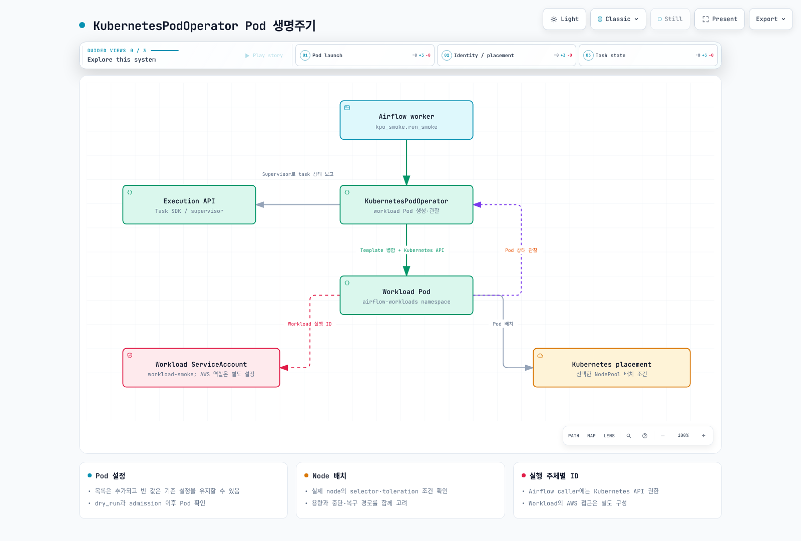

# Part 3: DAG 패턴과 KubernetesPodOperator

> **검토 기준**: Airflow 3.3.1 / cncf-kubernetes provider 10.21.0 · 2026년 9월 12일

## 1. Executor, KPO와 실제 Pod 수

KubernetesPodOperator(KPO)는 Airflow task가 별도의 workload Pod를 생성·관찰하는
operator입니다. CeleryExecutor·KubernetesExecutor·호환되는 다른 executor에서
실행할 수 있습니다. Task를 실행하는 Airflow 환경에는 provider가 필요하지만
**workload Pod에는 Airflow 설치가 필수가 아닙니다**.

| 일반적인 새 실행 | 새로 만드는 Pod와 공유 자원 |
| --- | --- |
| CeleryExecutor + KPO | 기존 worker 프로세스가 KPO를 실행하고 workload Pod를 생성; worker Pod는 여러 task가 공유 가능 |
| KubernetesExecutor + KPO | Airflow task-runner Pod와 KPO workload Pod를 각각 생성 |

따라서 “executor를 바꿔도 Pod 개수가 변하지 않는다”는 설명은 틀립니다.
논리적으로 실행 주체와 workload를 구분하는 것과 **물리적 Pod 수**는 다른 문제입니다.
Retry·reattachment는 Pod를 재사용하거나 추가 실행을 만들 수 있고, deferrable
모드에서는 기다리는 동안 worker slot을 놓고 triggerer가 관찰을 이어갈 수 있습니다.
항상 정확히 두 Pod가 살아 있다는 보장도 아닙니다.

## 2. 설정 우선순위에는 병합 규칙도 포함

Provider 10.21.0의 구성 절차는 다음과 같습니다.

1. pod_template_file이 있으면 이를 선택합니다. 같은 호출의 pod_template_dict를
   추가로 합치는 것이 아닙니다.
2. 파일이 없으면 pod_template_dict를, 둘 다 없으면 full_pod_spec 또는 빈 Pod를
   출발점으로 사용합니다.
3. 선택한 template과 full_pod_spec을 병합하고, KPO가 만든 Pod 설정을 다시 병합합니다.
4. Airflow label·secret/XCom 구성·pod_mutation_hook 및 서버 admission/defaulting이
   최종 결과에 추가로 영향을 줄 수 있습니다.

Image·namespace처럼 지정한 비어 있지 않은 값은 일반적으로 override하지만, 모든
속성이 단순 교체되는 것은 아닙니다. 실제 릴리스의 병합 함수를 실행해 확인한 예:

| 입력 | 결과 |
| --- | --- |
| 비어 있지 않은 image | Template image를 override |
| 빈 command 또는 tolerations 목록 | Template 값이 남을 수 있음 |
| Template의 automount=true에 False override | Falsy 값이 기존 True를 유지할 수 있음; 최종 Pod 확인 |
| env·volume_mounts 등 목록 | 이어 붙여질 수 있음; 빈 목록으로 삭제한다고 가정하지 않음 |
| container_resources에 limits만 지정 | 기존 requests가 함께 유지되지 않음 |
| 비어 있지 않은 node_selector | 기존 selector 전체를 대체할 수 있음 |
| Metadata labels | Key별로 병합 |
| init container | 같은 이름끼리 병합하고 나머지는 추가 |

Kubernetes 자원 설정은 **container_resources=V1ResourceRequirements(...)**로
전달합니다. 일반 resources 인자를 Kubernetes container 자원 설정과 혼동하지
않습니다. dry_run과 실제 생성된 Pod를 확인하며 admission 이후 설정까지 검증합니다.

## 3. 실행 가능한 작은 DAG 준비

Part 2의 Airflow와 DAG 전달 경로를 먼저 준비합니다. 아래 예제는 S3에 접근하지 않고
run ID를 출력하므로 AWS 데이터 역할은 필요하지 않습니다. 실제 workload에는 해당
image·패키지·데이터 권한을 별도로 준비합니다.

workload-access.yaml의 RoleBinding subject는 **실제로 KPO를 실행하는 Airflow
worker의 ServiceAccount**로 바꿉니다. 예시는 airflow namespace의 airflow-worker입니다.
Workload Pod의 ServiceAccount와 서로 다릅니다.

```yaml
apiVersion: v1
kind: Namespace
metadata:
  name: airflow-workloads
---
apiVersion: v1
kind: ServiceAccount
metadata:
  name: workload-smoke
  namespace: airflow-workloads
automountServiceAccountToken: false
---
apiVersion: rbac.authorization.k8s.io/v1
kind: Role
metadata:
  name: airflow-kpo
  namespace: airflow-workloads
rules:
- apiGroups:
  - ''
  resources:
  - pods
  verbs:
  - create
  - get
  - list
  - watch
  - patch
  - delete
- apiGroups:
  - ''
  resources:
  - pods/log
  verbs:
  - get
---
apiVersion: rbac.authorization.k8s.io/v1
kind: RoleBinding
metadata:
  name: airflow-kpo-worker
  namespace: airflow-workloads
subjects:
- kind: ServiceAccount
  name: airflow-worker
  namespace: airflow
roleRef:
  apiGroup: rbac.authorization.k8s.io
  kind: Role
  name: airflow-kpo
```

Role은 workload namespace에 범위를 두지만 그 안의 모든 해당 Pod에 영향을 줄 수
있습니다. 신뢰하지 않는 DAG 작성자가 다른 ServiceAccount나 위험한 Pod spec을
선택하지 못하도록 namespace 경계·admission 정책도 설계합니다.
이 동기 예제는 XCom exec 권한을 사용하지 않습니다. XCom sidecar나 deferrable
실행을 추가하면 pods/exec와 triggerer의 관찰 권한 등 필요한 범위를 따로 검토합니다.

DAG bundle에 다음 파일을 함께 배포합니다.

```text
dags/
  kpo_smoke.py
  templates/
    base-pod-template.yaml
```

templates/base-pod-template.yaml은 KPO가 완성하는 template이며 단독 Pod 배포
파일이 아닙니다. 예제 workload에 맞춘 자원·filesystem·UID 설정입니다.

```yaml
apiVersion: v1
kind: Pod
metadata:
  labels:
    app: airflow-kpo-smoke
spec:
  serviceAccountName: workload-smoke
  automountServiceAccountToken: false
  restartPolicy: Never
  securityContext:
    runAsNonRoot: true
    runAsUser: 65532
    seccompProfile:
      type: RuntimeDefault
  containers:
  - name: base
    image: python:3.12-slim
    resources:
      requests:
        cpu: 100m
        memory: 64Mi
      limits:
        cpu: 500m
        memory: 128Mi
    securityContext:
      allowPrivilegeEscalation: false
      readOnlyRootFilesystem: true
      capabilities:
        drop:
        - ALL
```

kpo_smoke.py는 실제 DAG 객체를 정의합니다. Template 경로는 worker에서 읽는
bundle 파일 위치를 기준으로 계산하며 특정 /opt/airflow/dags 경로를 무조건 가정하지 않습니다.

```python
from datetime import datetime, timedelta, timezone
from pathlib import Path

from airflow.sdk import Asset, DAG
from airflow.providers.cncf.kubernetes.operators.pod import KubernetesPodOperator
from kubernetes.client import models as k8s

TEMPLATES = Path(__file__).parent / "templates"
smoke_completed = Asset("demo://kpo-smoke-completed")

with DAG(
    dag_id="kpo_smoke",
    schedule=None,
    start_date=datetime(2026, 9, 1, tzinfo=timezone.utc),
    catchup=False,
) as dag:
    run_smoke = KubernetesPodOperator(
        task_id="run_smoke",
        name="kpo-smoke",
        namespace="airflow-workloads",
        in_cluster=True,
        pod_template_file=str(TEMPLATES / "base-pod-template.yaml"),
        service_account_name="workload-smoke",
        image="python:3.12-slim",
        cmds=["python", "-B", "-c"],
        arguments=["import sys; print('KPO_SMOKE_OK run_id=' + sys.argv[1])", "{{ run_id }}"],
        container_resources=k8s.V1ResourceRequirements(
            requests={"cpu": "250m", "memory": "128Mi"},
            limits={"cpu": "500m", "memory": "256Mi"},
        ),
        random_name_suffix=True,
        reattach_on_restart=True,
        deferrable=False,
        get_logs=True,
        do_xcom_push=False,
        startup_timeout_seconds=120,
        active_deadline_seconds=180,
        execution_timeout=timedelta(minutes=5),
        on_finish_action="delete_pod",
        on_kill_action="delete_pod",
        outlets=[smoke_completed],
    )

if __name__ == "__main__":
    run_smoke.dry_run()
```

Provider가 설치된 Airflow 환경에서 python kpo_smoke.py를 실행하면 Pod 구성을
출력합니다. 이 예제는 namespace가 명시되고 XCom을 껐으므로 10.21.0의 dry_run 경로에서
live Kubernetes client 초기화를 피합니다. Jinja 인자와 task-instance label은 실제
실행 context가 있어야 완성되므로 dry_run을 최종 admission/실행 성공으로 해석하지 않습니다.

run_id는 명령의 독립된 인자로 넘깁니다. Asset-triggered DAG run 등에는 logical_date,
ds 같은 시간 context가 없을 수 있으므로 모든 task에 `{{ ds }}`가 있다고 가정하지 않습니다.

Workload namespace/RBAC를 적용하고 DAG 전달·파싱을 확인한 뒤 UI나 CLI에서
kpo_smoke를 실행합니다. Task 상태, KPO_SMOKE_OK 로그, 선택한 image와 실제 Pod의
serviceAccountName·resources를 확인합니다. 성공 후 Pod 삭제는 설정된 동작입니다.
장기 로그 보존은 Part 5의 원격 로그 구성이 필요합니다.

### 삭제·중단·재시작

10.21.0은 is_delete_operator_pod를 인자로 받지만 생성자에서 그 값을 사용하지
않습니다. False를 넣었다고 Pod가 보존된다고 기대하지 않습니다.
**on_finish_action**과 **on_kill_action**을 사용해 정상 종료와 kill 경로를 각각
설정합니다. Reattachment는 재시작 후 기존 Pod를 찾아 관찰하는 기능이며 외부 데이터
쓰기의 exactly-once를 보장하지 않습니다.

## 4. 전용 노드와 AWS 권한

필요하면 준비된 NodePool에 맞춰 node selector/required affinity와 toleration을
추가합니다. Toleration은 taint를 허용할 뿐 배치를 강제하지 않습니다. 전용 pool도
Spot 회수·노드 장애·disk pressure·disruption을 없애지 않고, 같은 taint를 허용한
다른 workload가 존재할 수 있습니다.

실제 S3 작업은 workload Pod의 ServiceAccount에 맞는 IRSA OIDC trust 또는
Pod Identity association·Agent와 IAM 권한, 호환 SDK/provider를 준비합니다.
Annotation이나 service_account_name 문자열만으로 S3 접근이 완성되지 않습니다.
SDK의 기본 체인·IMDS 접근·환경 변수 등 다른 credential source도 확인합니다.
Pod 수명과 발급된 임시 credential의 만료가 항상 같은 시각인 것도 아닙니다.
Kubernetes RBAC와 AWS 데이터 권한을 분리해 실제 허용/거부 경로를 시험합니다.

## 5. DAG bundle와 재실행 코드 버전

Bundle은 DAG processor와 worker에 코드·의존 파일을 제공하는 추상화입니다.
LocalDagBundle 및 S3DagBundle/GCSDagBundle은 현재 bundle versioning을 제공하지
않습니다. 파싱 때 읽은 내용과 나중 worker가 읽는 내용이 반드시 같은 snapshot이라는
뜻도 아닙니다. GitDagBundle은 versioning을 지원하며 git-sync도 계속 사용할 수 있습니다.

Versioned bundle도 재실행이 무조건 원래 commit을 쓰는 것은 아닙니다.
3.3.1의 선택 순서는 다음과 같습니다.

1. API 요청의 run_on_latest_version 명시값.
2. DAG의 rerun_with_latest_version 값.
3. 전역 [core] rerun_with_latest_version 설정.
4. 미지정 시 clear/rerun은 False, backfill은 True라는 호출 경로별 기본값.

disable_bundle_versioning은 별도 설정으로, 켜면 run의 bundle version 추적 자체를
끄며 위 선택을 버전 보존 장치로 사용할 수 없습니다. Git commit을 보존하더라도
image·Python package·외부 데이터·설정이 달라지면 결과까지 재현되지는 않습니다.
Git 보존/접근 정책과 실행 의존성을 함께 고정합니다.

Bundle kwargs는 Config API에 노출될 수 있으므로 인증 token을 repo_url 등에
직접 넣지 않고 Airflow Connection 등 적절한 자격 증명 경로를 참조합니다.



[Interactive diagram](https://www.atomai.click/kubernetes-docs/archmaps/ko-data-on-eks-airflow-03-dag-patterns-0.html)

## 6. Spark·dbt와 Asset 연결

KPO는 패키징된 dbt/CLI workload를 실행할 수 있습니다. Spark에는 여러 경로가 있습니다.

| 경로 | 확인할 사항 |
| --- | --- |
| SparkKubernetesOperator | 대상 SparkApplication API/CRD·provider 버전, caller RBAC, driver 관찰·cleanup |
| SparkSubmitOperator 또는 KPO submitter image | spark-submit 런타임·인증·driver/executor 역할, 완료·실패 확인 |
| 직접 CustomObjects client/별도 제출 서비스 | 명시적인 namespace·고유 실행 ID·상태/재시도/정리 계약 |

고정 이름의 SparkApplication에 apply하고 COMPLETED만 기다리는 이전 예제는
재실행 시 기존 COMPLETED를 새 실행 성공으로 오인할 수 있고, namespace가 다르면
잘못된 대상을 기다리며 FAILED를 즉시 처리하지도 못합니다. 이 조합을 실행 가능한
기본 예제로 사용하지 않습니다.

Native operator라고 모든 조합이 자동 호환되는 것도 아닙니다. 검토한 provider
10.21.0의 SparkKubernetesOperator는 reattachment 설정 경로에서 spec.labels를
추가하지만 Spark 절의 Kubeflow 2.5.2 CRD에는 그 필드가 없습니다. 서버의 field
validation/pruning에 따라 동작이 달라질 수 있으므로 **operator가 최종 생성한 CR**
까지 검증합니다. 또한 이 버전의 kill 경로는 Spark CR을 삭제하며,
delete_on_termination=False가 그 경로까지 보존한다는 뜻은 아닙니다.
입력 YAML만 검증하고 전체 연동 성공으로 표시하지 않습니다.

기본 DAG의 demo://kpo-smoke-completed는 성공 시 기록되는 **데모 Asset 이벤트**입니다.
실제 S3 object 생성 감지나 데이터 검증이 자동 추가되지는 않습니다.
Downstream DAG가 schedule=[smoke_completed]로 그 이벤트를 사용할 수 있지만,
실제 파이프라인에서는 데이터가 확정된 뒤 outlet 이벤트가 발생하도록 설계합니다.

## 검증 범위

이 장의 병합 결과는 릴리스의 원본 merge 함수를 실제 Kubernetes Python 모델로
실행해 확인했습니다. Constructor 관련 검사는 source/AST 검사입니다.
전체 Airflow task·Kubernetes API·IAM/S3·Spark cluster 실행이나 재실행 복구를
완료한 결과로 해석하지 않습니다.


- [Kubernetes provider 10.21.0 operators](https://airflow.apache.org/docs/apache-airflow-providers-cncf-kubernetes/10.21.0/operators.html)
- [KPO implementation](https://github.com/apache/airflow/blob/providers-cncf-kubernetes/10.21.0/providers/cncf/kubernetes/src/airflow/providers/cncf/kubernetes/operators/pod.py)
- [Released PodGenerator merge implementation](https://github.com/apache/airflow/blob/providers-cncf-kubernetes/10.21.0/providers/cncf/kubernetes/src/airflow/providers/cncf/kubernetes/pod_generator.py)
- [DAG bundles and rerun version selection](https://airflow.apache.org/docs/apache-airflow/3.3.1/administration-and-deployment/dag-bundles.html)
- [Template context and logical dates](https://airflow.apache.org/docs/apache-airflow/3.3.1/templates-ref.html)
- [SparkKubernetesOperator implementation](https://github.com/apache/airflow/blob/providers-cncf-kubernetes/10.21.0/providers/cncf/kubernetes/src/airflow/providers/cncf/kubernetes/operators/spark_kubernetes.py)
- [Kubeflow SparkApplication 2.5.2 CRD](https://github.com/kubeflow/spark-operator/blob/v2.5.2/config/crd/bases/sparkoperator.k8s.io_sparkapplications.yaml)

[Part 4: MWAA integration](04-mwaa-integration.md)

[README](README.md)

[Quiz](../../quizzes/data-on-eks/airflow/03-dag-patterns-quiz.md)
