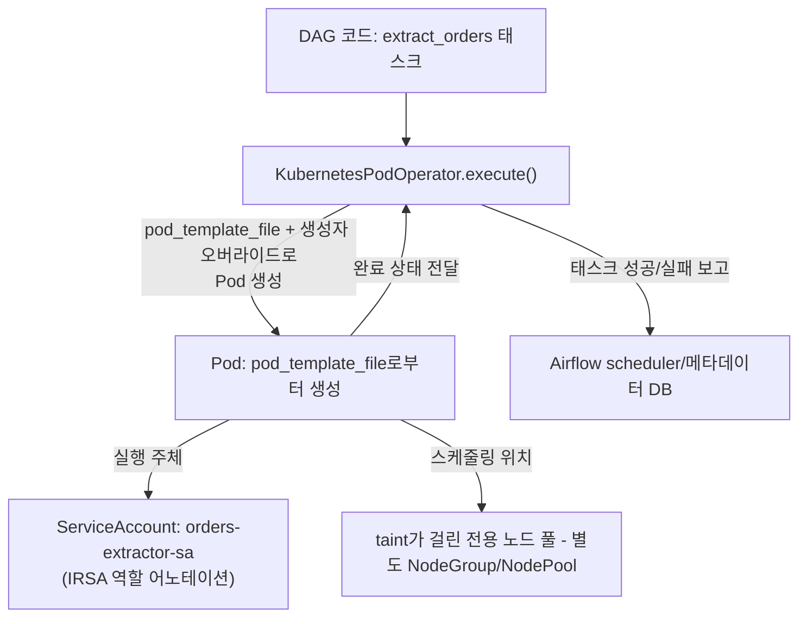

# Part 3: DAG 패턴과 KubernetesPodOperator

> **마지막 업데이트**: 2026년 7월 15일

## 실습 환경 준비

이 문서의 예제를 따라 하려면 다음이 필요합니다.

### 필수 도구

* Part 2에서 배포한 Airflow 3이 실행 중인 EKS 클러스터(1.30+)에 접근 가능한 `kubectl`
* 태스크가 실제로 필요로 하는 권한만 부여한 IRSA용 IAM 역할(또는 EKS Pod Identity 연결) — 이 문서의 예제에서는 특정 S3 prefix에 대한 읽기/쓰기 권한
* `KubernetesPodOperator`로 실행할 컨테이너 이미지 — Pod 템플릿 예제는 어떤 이미지든 상관없지만, 뒤에 나오는 Spark 예제는 [Spark 섹션 Part 2](../spark/02-spark-operator.md)에서 구성한 Spark Operator 환경을 전제로 합니다

## KubernetesPodOperator는 Executor 선택과 무관하게 동작한다

Part 2에서는 DAG의 태스크 인스턴스 자체를 실행하는 방식인 `KubernetesExecutor`와 `CeleryExecutor` 중 무엇을 선택할지를 다뤘습니다. `KubernetesPodOperator`(KPO, `airflow.providers.cncf.kubernetes.operators.pod`)는 이와 완전히 별개의 개념입니다. 어떤 Executor를 쓰든 사용할 수 있는 오퍼레이터로, `execute()` 메서드가 Kubernetes API를 호출해 임의의 Pod를 새로 생성하고 그 Pod가 끝날 때까지 기다립니다. `execute()`를 실제로 호출하는 주체가 `KubernetesExecutor`에서는 태스크마다 새로 뜨는 Pod이고 `CeleryExecutor`에서는 이미 떠 있는 Celery 워커 프로세스라는 차이만 있을 뿐, 둘 다 실제 작업을 수행하는 두 번째 Pod을 별도로 생성하고 감시한다는 점은 동일합니다.

이 구분을 명확히 알아둘 필요가 있는 이유는, 실무에서 흔히 오해가 생기는 지점이기 때문입니다. 이미 KPO를 쓰는 DAG를 `CeleryExecutor`에서 `KubernetesExecutor`로 바꾼다고 해서 Pod가 한 겹 더 생기거나 줄어드는 것이 아닙니다. KPO 태스크는 항상 (태스크 실행을 담당하는 Celery 워커 프로세스 또는 KubernetesExecutor Pod) + (KPO가 실제로 띄우는 작업용 Pod), 이렇게 두 개의 실행 단위로 구성됩니다. Executor 선택이 바꾸는 것은 오직 `execute()`를 호출하는 "앞단"이 어떻게 스케줄링되는지일 뿐이며, KPO 자체가 Pod를 생성하는 동작은 어느 쪽을 쓰든 동일합니다.

## Pod 스펙 우선순위

KPO는 여러 소스에서 가져온 설정을 병합해 실제로 실행할 Pod 스펙을 만들며, 같은 필드가 여러 소스에서 지정되어 있으면 더 구체적인 소스가 우선합니다. 우선순위가 높은 것부터 나열하면 다음과 같습니다.

1. **KPO 생성자 인자** — `image`, `cmds`, `env_vars`, `resources` 등 오퍼레이터에 직접 넘기는 속성들. 다른 어떤 소스보다 항상 우선합니다.
2. **`full_pod_spec`** — Python 코드에서 직접 넘기는 완전한 `kubernetes.client.models.V1Pod` 객체로, 필요하다면 모든 필드를 완전히 제어할 수 있습니다.
3. **`pod_template_file`** — 기본 Pod 스펙이 담긴 YAML 파일 경로.
4. **`pod_template_dict`** — `pod_template_file`과 같은 역할을 하지만, 파일 경로 대신 메모리 상의 dict로 전달합니다.
5. **비어 있는 기본 `V1Pod`** — 위 어느 소스에도 값이 없을 때 KPO가 사용하는 최종 기본값.

실무에서는 대부분 DAG 전체 또는 배포 단위의 공통 기본값으로 `pod_template_file`을 두고, 이미지·커맨드·특정 태스크의 리소스 상향처럼 태스크마다 실제로 달라져야 하는 몇몇 필드만 KPO 생성자 인자로 덮어쓰는 방식을 채택합니다.

## `pod_template_file` 패턴

`pod_template_file`은 배포에 속한 모든 KPO 태스크에 리소스 요청/한도, toleration, 서비스 어카운트 같은 공통 출발점을 매 DAG마다 YAML을 반복 작성하지 않고 일관되게 제공하는 표준적인 방법입니다. 기본 템플릿은 대략 다음과 같은 형태입니다.

```yaml
# base-pod-template.yaml
apiVersion: v1
kind: Pod
metadata:
  labels:
    app: airflow-task
spec:
  serviceAccountName: airflow-task-sa  # 태스크별로 IRSA용 SA로 덮어씀
  restartPolicy: Never
  containers:
    - name: base
      image: python:3.12-slim  # 태스크별로 덮어씀
      resources:
        requests:
          cpu: "500m"
          memory: "1Gi"
        limits:
          cpu: "1"
          memory: "2Gi"
  tolerations:
    - key: "workload"
      operator: "Equal"
      value: "airflow-tasks"
      effect: "NoSchedule"
```

DAG의 태스크는 이 템플릿을 참조하면서 태스크에 고유한 부분만 덮어씁니다.

```python
from airflow.providers.cncf.kubernetes.operators.pod import KubernetesPodOperator

extract_orders = KubernetesPodOperator(
    task_id="extract_orders",
    namespace="airflow",
    name="extract-orders",
    image="my-registry/orders-extractor:1.4.0",
    cmds=["python", "extract.py"],
    arguments=["--date", "{{ ds }}"],
    pod_template_file="/opt/airflow/dags/templates/base-pod-template.yaml",
    service_account_name="orders-extractor-sa",
    is_delete_operator_pod=True,
)
```

위 예제의 `{{ ds }}`처럼 Jinja 템플릿은 KPO의 인자에서도 다른 오퍼레이터와 동일하게 동작합니다. 오퍼레이터가 Pod를 만들기 전에 템플릿 필드를 먼저 렌더링하기 때문입니다. 생성자에 넘긴 `image`와 `cmds`/`arguments`는 앞서 설명한 우선순위에 따라 템플릿 파일이 지정한 같은 필드보다 항상 우선합니다 — 템플릿은 공통 기본값을 제공하고, 생성자 인자는 이 태스크에서 실제로 달라지는 부분을 지정하는 역할을 합니다.

## 전용 노드 풀에 태스크 고정하기

KPO가 실행하는 태스크 Pod도 일반적인 Kubernetes Pod이므로, 특정 노드로 워크로드를 몰아주는 익숙한 방법인 `affinity`/`tolerations`가 그대로 적용됩니다. KPO 생성자 인자로 직접 지정하거나 Pod 템플릿에 미리 넣어두어, 전용 노드 그룹에 걸린 taint와 맞춰주면 됩니다. Karpenter가 관리하는 NodePool에 임의의 워크로드를 고정할 때 쓰는 것과 동일한 패턴을, 여기서는 Airflow 태스크 Pod에 적용하는 것뿐입니다.

```yaml
# Pod 템플릿에 포함하거나 KPO의 affinity/tolerations 인자로 전달
tolerations:
  - key: "workload"
    operator: "Equal"
    value: "airflow-tasks"
    effect: "NoSchedule"
affinity:
  nodeAffinity:
    requiredDuringSchedulingIgnoredDuringExecution:
      nodeSelectorTerms:
        - matchExpressions:
            - key: "karpenter.sh/nodepool"
              operator: In
              values: ["airflow-tasks"]
```

태스크 Pod를 taint가 걸린 Airflow 전용 노드 풀로 분리해두면 공용 노드에서 관련 없는 워크로드와 자원을 다투거나 밀려나는 상황을 피할 수 있고, 이 풀은 순전히 태스크 Pod 수요만 보고 독립적으로 스케일할 수 있습니다.

## 태스크별 IRSA 권한 분리

`pod_template_file`로 지정한(또는 KPO의 `service_account_name` 인자로 직접 넘긴) `serviceAccountName`은 태스크마다 별도의 AWS 권한을 부여하는 통로이기도 합니다. Kubernetes ServiceAccount에 일반적인 IRSA 방식대로 IAM 역할 ARN을 어노테이션으로 달아두면, KPO가 생성한 태스크 Pod을 포함해 그 ServiceAccount로 실행되는 모든 Pod가 Pod가 살아있는 동안 해당 역할의 권한을 갖게 됩니다.

```yaml
apiVersion: v1
kind: ServiceAccount
metadata:
  name: orders-extractor-sa
  namespace: airflow
  annotations:
    eks.amazonaws.com/role-arn: arn:aws:iam::123456789012:role/orders-extractor-task-role
```

이는 Airflow 컨트롤 플레인 컴포넌트(scheduler, api-server, dag-processor)가 사용하는 역할과는 성격이 다른, 별도의 권한 경계입니다. S3의 특정 prefix만 읽으면 되는 태스크에는 정확히 그 범위만 허용된 역할을 부여할 수 있고, 플랫폼 컴포넌트 자체의 운영에 필요할 수 있는 더 넓은 권한을 굳이 물려받지 않게 됩니다. `service_account_name` 역시 앞서 설명한 우선순위를 따르는 필드이므로, 태스크별로 지정한 값이 기본 Pod 템플릿의 서비스 어카운트보다 항상 우선합니다 — 대부분의 태스크는 템플릿의 기본값을 공유하고, 별도의 AWS 권한이 필요한 일부 태스크만 자신만의 서비스 어카운트를 선언하면 됩니다.

## DAG Bundle: 단일 DAG 폴더를 대체하는 Airflow 3의 방식

Airflow 2는 모든 컴포넌트가 같은 로컬 디스크 경로에서 DAG 파일을 읽는다고 가정했습니다. 그래서 dag-processor(그리고 2.x에서는 scheduler까지)가 이 경로를 채워야 했고, 보통은 저장소를 공유 볼륨으로 계속 동기화하는 `git-sync` 사이드카를 붙이거나 배포 이미지에 DAG를 직접 빌드해 넣는 방식을 썼습니다. Airflow 3는 이 가정을 **DAG Bundle**로 대체합니다. dag-processor가 DAG 소스를 어디서 가져올지를 하나의 로컬 경로에 고정하는 대신, Bundle 단위로 설정할 수 있게 만든 추상화입니다.

* **`LocalDagBundle`** — 로컬 파일시스템 경로에서 DAG를 읽는, 기존 방식과 동일한 방식입니다. 버전 관리가 없어서 지금 디스크에 있는 내용이 그대로 실행됩니다. 이미 이미지 빌드 시점에 "디스크에 있는 내용"이 고정되는 baked-image 배포나 로컬 개발 환경에 적합합니다.
* **`GitDagBundle`** — Git 저장소에서 DAG를 직접 가져오며, 태생적으로 버전 관리를 지원합니다. 모든 DAG 실행은 그 실행이 사용한 정확한 커밋 SHA를 기록합니다. 과거의 DAG 실행을 다시 재실행하면 그 커밋 시점의 코드로 재현되며, 저장소의 HEAD가 그 사이 얼마나 바뀌었는지와는 무관합니다. 이것이 바로 `git-sync`가 절대 줄 수 없었던 특성입니다 — 사이드카는 작업 복사본을 최신 상태로 유지해줄 뿐, 특정 실행이 실제로 어떤 커밋을 보고 돌았는지는 Airflow 2에서는 아무도 기록하지 않았습니다.
* **`S3DagBundle`** / **`GCSDagBundle`** — 각각 S3 버킷과 GCS 버킷에서 DAG를 가져옵니다. `LocalDagBundle`과 마찬가지로 실행별 버전을 추적하지 않으며, dag-processor가 파싱하는 시점에 설정된 키/prefix에 있는 오브젝트가 그대로 실행됩니다.

Part 2에서 다룬 공식 Helm 차트에서 `git-sync` 사이드카는 여전히 동작합니다 — Airflow 3가 이 방식을 없앤 것은 아닙니다. 다만 재현성이 중요한 실행(몇 달 전의 백필을 다시 돌려서 당시 실제로 실행됐던 그 코드를 그대로 얻어야 하는 상황)에서는 `GitDagBundle`이야말로 그 보장을 실제로 제공하는 방식입니다. 그래서 이 문서에서는 `git-sync`의 단순한 대안이 아니라 그것을 대체하는 현대적인 방식으로 자리매김하는 것입니다.



## 작성 패턴

TaskFlow API와 동적 태스크 매핑(dynamic task mapping)은 3.x에서도 여전히 Airflow의 핵심 작성 패턴입니다. 둘 다 3.x에서 새로 생긴 기능은 아니지만, 이제는 UI에서 DAG 버전을 인식한 상태로 표시되어 DAG Bundle이 바뀌더라도 매핑된 태스크의 실행 이력을 계속 알아보기 쉽게 유지해줍니다. 여기서 짚어볼 만한 점은 네이티브 Python으로 돌리기 어려운 작업을 실행할 때 KPO가 이 패턴들과 어떻게 섞여 쓰이는가입니다. TaskFlow 데코레이터로 작성한 DAG라도, `@task`로 감싼 일반 Python 콜러블 사이에 `KubernetesPodOperator` 태스크를 자연스럽게 섞어 넣을 수 있습니다.

실무에서 자주 쓰는 통합 패턴은 Airflow DAG에서 Spark 잡을 실행하는 경우입니다. Kubernetes 네이티브 Spark([Spark 섹션 Part 2](../spark/02-spark-operator.md) 참고)에 어울리는 방식은, DAG가 Kubernetes API를 직접 호출하는 대신 KPO 태스크의 컨테이너 이미지가 `SparkApplication` 매니페스트를 적용하고 완료될 때까지 폴링하는 형태입니다.

```python
spark_etl = KubernetesPodOperator(
    task_id="run_spark_etl",
    namespace="airflow",
    name="run-spark-etl",
    image="my-registry/spark-submitter:1.0.0",
    cmds=["/bin/sh", "-c"],
    arguments=["kubectl apply -f /manifests/orders-etl-sparkapp.yaml && "
                "kubectl wait --for=jsonpath='{.status.applicationState.state}'=COMPLETED "
                "sparkapplication/orders-etl --timeout=30m"],
    pod_template_file="/opt/airflow/dags/templates/base-pod-template.yaml",
    service_account_name="spark-submitter-sa",  # S3 + SparkApplication RBAC를 위한 IRSA 지정
)
```

dbt 컨테이너 이미지(KPO 태스크의 커맨드로 `dbt run`을 실행)나 그 밖에 네이티브 Airflow 로직으로 재구현하기보다 목적에 맞춰 만든 컨테이너로 돌리는 편이 나은 도구라면 동일한 패턴을 그대로 적용할 수 있습니다.

Airflow 3의 asset/event 기반 스케줄링은 이런 태스크를 다음 단계와 이어주는 데 잘 맞습니다. 다운스트림 DAG가 Spark 잡의 결과물이 도착했는지 일정 간격으로 폴링하는 대신, 업스트림 DAG가 완료 시점에 Asset을 갱신하고 다운스트림 DAG는 시간 기반 스케줄이 아니라 그 Asset 갱신에 직접 반응해 트리거되도록 구성할 수 있습니다. 이렇게 하면 KPO로 실행한 배치 잡이 단순히 스케줄에 따라 도는 태스크가 아니라, 파이프라인의 나머지 부분에 대한 온전한 이벤트 소스 역할을 하게 됩니다.

## 다음 단계

이 문서에서는 `KubernetesPodOperator`가 Part 2에서 다룬 `KubernetesExecutor`/`CeleryExecutor` 선택과 무관하게 Pod를 생성한다는 점, `pod_template_file`/`full_pod_spec`/`pod_template_dict`를 지배하는 Pod 스펙 우선순위, `affinity`/`tolerations`와 태스크별 IRSA로 KPO 태스크에 전용 컴퓨트와 범위가 제한된 AWS 권한을 부여하는 방법, 그리고 Airflow 3의 DAG Bundle 모델 — 특히 커밋 단위 버전 관리를 제공해 기존의 단순 `git-sync` 사이드카를 대체하는 `GitDagBundle` — 을 살펴봤습니다.

[메인 페이지로 돌아가기](./)

## 퀴즈

이 장에서 배운 내용을 테스트하려면 [주제 퀴즈](../../quizzes/data-on-eks/airflow/03-dag-patterns-quiz.md)를 풀어보세요.
