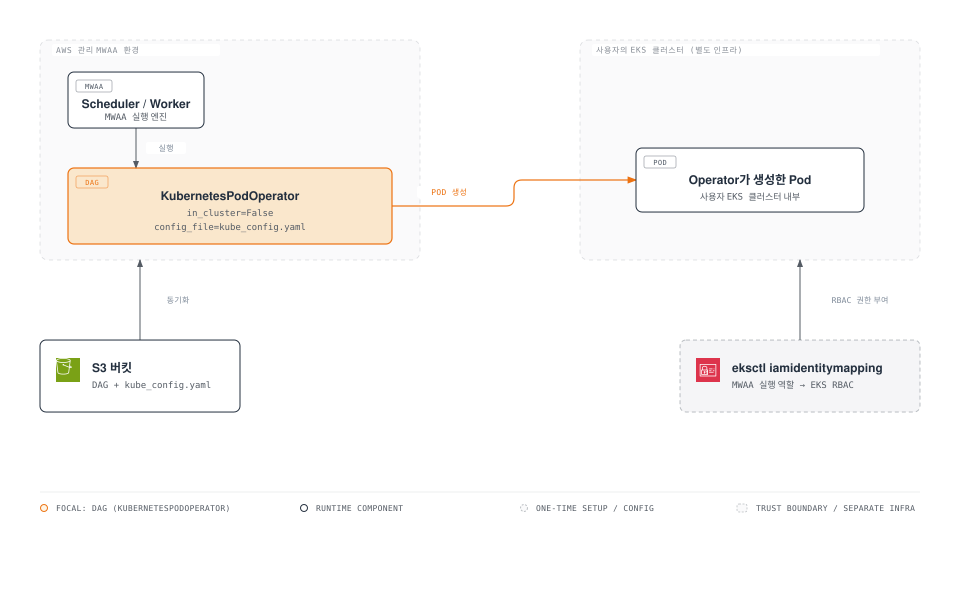

# Part 4: Amazon MWAA 통합

> **마지막 업데이트**: 2026년 7월 15일

## 실습 환경 설정

이 문서의 예제를 따라하기 위해서는 다음과 같은 도구와 환경이 필요합니다.

### 필수 도구

* AWS CLI v2 (MWAA 환경 및 IAM identity mapping 관리)
* `eksctl` (대상 EKS 클러스터의 RBAC에 IAM identity mapping을 추가하기 위해)
* Amazon MWAA 환경 (이 문서의 KubernetesPodOperator 패턴은 특정 MWAA 버전에 종속되지 않습니다)
* MWAA 자체 인프라와는 별개의 EKS 클러스터(1.30 이상), `kubectl` 접근 가능

앞선 Part 1~3에서는 Airflow의 전체 컨트롤 플레인 — api-server, scheduler, dag-processor, triggerer — 을 EKS 위에서 직접 운영하는 방법을 다뤘고, `KubernetesPodOperator`를 통한 네이티브 Kubernetes 통합과 `GitDagBundle`을 통한 git 네이티브 DAG 배포도 살펴봤습니다. 이번 Part에서는 AWS의 완전관리형 Airflow 컨트롤 플레인인 Amazon MWAA와, 직접 운영하는 방식과의 트레이드오프를 다룹니다. 또한 EKS 중심 플랫폼에서 가장 중요한 패턴 — MWAA에 올라간 DAG가 여전히 자체 EKS 클러스터의 워크로드를 제어할 수 있는 방법 — 도 함께 살펴봅니다.

## MWAA에서 "완전관리형"이 의미하는 것

MWAA(Managed Workflows for Apache Airflow)는 scheduler, api-server(Part 1에서 다룬 것처럼 Airflow 3에서 기존 webserver를 대체한 컴포넌트), dag-processor, 워커까지 전부 AWS가 관리하는 인프라, 즉 AWS 계정 경계 내부에서 실행합니다 — 사용자의 VPC나 EKS 클러스터 안이 아닙니다. 여기서 명확히 짚어야 할 결론 하나는, **Airflow 컨트롤 플레인 자체에는 `kubectl`로 접근할 방법이 없다**는 것입니다. Part 2에서 다룬 셀프 매니지드 배포처럼 `kubectl get pods -n airflow`로 MWAA의 scheduler를 조회할 수는 없습니다. 환경의 헬스 체크, 스케일링, 패치는 전부 AWS의 책임이며, Kubernetes 프리미티브가 아니라 CloudWatch 메트릭/로그와 MWAA 콘솔/API를 통해서만 노출됩니다.

## Amazon MWAA vs. EKS 셀프 매니지드 Airflow

두 방식 모두 "Airflow는 DAG, scheduler, 메타데이터 데이터베이스로 구성된다"는 정의 자체는 같지만, 컨트롤 플레인이 어디서 실행되고 얼마나 손댈 수 있는지, 그리고 신규 Airflow 릴리스를 얼마나 빨리 받아들이는지에서는 크게 갈립니다.

| 항목 | EKS 셀프 매니지드 Airflow (Part 1~3) | Amazon MWAA |
| --- | --- | --- |
| **컨트롤 플레인 위치** | 자체 EKS 클러스터, 직접 조회·스케일 가능한 Deployment로 실행 | AWS 관리 인프라, 클러스터 외부 — 컨트롤 플레인에 대한 직접적인 Kubernetes 접근 불가 |
| **운영 부담** | 업그레이드, HA 구성, 실행기(executor) 튜닝을 모두 사용자가 책임 | 모든 컨트롤 플레인 컴포넌트의 패치, 스케일링, 가용성을 AWS가 관리 |
| **버전 최신성** | 업스트림 릴리스가 나오는 즉시 채택 가능 | 업스트림보다 지연 — MWAA는 **2026년 4월**에 Airflow 3.2 지원을 추가했는데, 이는 Airflow 자체의 3.2 릴리스보다 약 3개월 늦은 시점이며, 그보다 앞서 2026년 1월에는 2.x 브릿지 릴리스인 Airflow 2.11로 먼저 갱신됨 |
| **플러그인 배포** | 이미지에 빌드하거나 볼륨으로 마운트하는 plugins 폴더 | S3에 업로드하는 압축된 `plugins.zip` |
| **Python 의존성** | 워커/scheduler 이미지를 직접 빌드하는 방식이라 root/시스템 패키지 설치도 자유로움 | S3에 업로드한 `requirements.txt`를 MWAA가 빌드 시점에 의존성을 해석 — root/시스템 패키지 설치 불가 |
| **DAG 배포** | git-sync 사이드카, 또는 Part 3에서 다룬 Airflow 3의 네이티브 `GitDagBundle`로 git 저장소에서 직접 가져옴, S3 단계 불필요 | S3 버킷에서만 동기화 — git-sync나 DAG 번들 방식은 전혀 지원하지 않음 |
| **DAG에서의 Kubernetes 접근** | 네이티브 — `KubernetesPodOperator`가 DAG가 실행되는 동일 클러스터를 대상으로 `in_cluster=True`로 동작 | 간접적 — `KubernetesPodOperator`를 `in_cluster=False`와 업로드한 kubeconfig로 구성해 별도의 EKS 클러스터를 대상으로 함 (아래에서 다룸) |
| **커스터마이징** | 실행기 조합, 베이스 이미지, scheduler/dag-processor 튜닝까지 전부 자유 | MWAA 환경 설정에서 제공하는 범위로 제한 |

### MWAA를 선택하는 이유

* AWS 전용 조직이며, Airflow 컨트롤 플레인 자체를 패치·스케일·고가용화하는 인프라를 전혀 갖고 싶지 않은 경우
* DAG가 순수 Python/PyPI 워크로드라서 — 커스텀 시스템 패키지나 특수한 실행기가 필요 없어서 — MWAA의 `requirements.txt`/`plugins.zip` 모델이 실질적인 제약이 되지 않는 경우
* 또 하나의 상태 저장(stateful) Kubernetes 워크로드를 운영할 여력이 부족하고, 업스트림보다 몇 개월 늦는 버전 지연을 감수할 수 있는 경우

### 그래도 EKS에서 Airflow를 직접 운영하는 이유

* 커스텀 실행기, 커스텀 Docker 이미지, 태스크 단위 격리 전략처럼 MWAA 환경 설정이 제공하는 범위를 넘어서는 요구가 장기적으로 있는 경우
* 새로운 Airflow 기능(신규 실행기, 신규 DAG 번들 타입 등)을 MWAA가 따라오길 기다리지 않고 업스트림 릴리스 즉시 채택하고 싶은 경우
* 완전관리형 컨트롤 플레인으로는 얻을 수 없는 멀티클라우드/온프레미스 이식성이 필요한 경우
* 대규모에서는 셀프 호스팅이 비용상 유의미하게 유리할 수 있습니다 — 대규모의 잘 튜닝된 셀프 매니지드 배포를 운영하는 팀은 비슷한 처리량 기준으로 잘 튜닝되지 않은 MWAA 환경보다 **30~60% 낮은 비용**을 보고하기도 합니다. 다만 이 수치는 트래픽 패턴과 튜닝에 투입할 수 있는 엔지니어링 역량에 크게 의존하는 값이라 보장된 수치가 아니며, 셀프 호스팅에 필요한 지속적인 엔지니어링 노력과 함께 저울질해야 합니다.

### DAG 배포 방식의 차이가 실무에 미치는 영향

위 표의 DAG 배포 항목은 단순한 체크박스 차이가 아닙니다. Part 3의 `GitDagBundle`을 쓰면 추적 중인 브랜치에 푸시하는 즉시 — dag-processor가 자체 폴링 주기로 git에서 직접 가져오므로 — 셀프 매니지드 배포가 새 DAG를 인식합니다. MWAA에는 이런 방식이 없습니다. 모든 DAG 변경은 먼저 환경의 S3 버킷에 파일로 올라가야 하며, 이는 수동 `aws s3 sync`든 이를 대신하는 CI 단계든 마찬가지입니다. 동기화 단계를 한 번 스크립트화해두면 운영상 큰 부담은 아니지만, "main에 머지됨"과 "scheduler에서 실행 중"사이에 셀프 매니지드 Airflow의 git 네이티브 경로보다 단계가 하나 더 끼어드는 셈입니다.

## MWAA에서 EKS 클러스터 제어하기

MWAA 자체 컨트롤 플레인이 EKS 클러스터 위에 있지 않더라도, MWAA의 DAG는 여전히 사용자가 직접 소유한 EKS 클러스터의 워크로드를 대상으로 삼아 제어할 수 있습니다 — Part 3에서 다룬 것과 동일한 `KubernetesPodOperator`를 in-cluster 대신 바깥쪽 클러스터를 향하도록 구성하는 것입니다.



MWAA 실행 환경에는 in-cluster Kubernetes API 접근 권한이 없으므로, `KubernetesPodOperator`도 다른 외부 클라이언트와 똑같은 방식으로 인증해야 합니다. 즉 kubeconfig 파일과, 대상 클러스터의 RBAC가 신뢰하는 IAM 아이덴티티가 필요합니다.

### 1. MWAA 실행 역할을 EKS 클러스터의 RBAC에 바인딩

MWAA 환경은 실행 역할(execution role) 하에 동작합니다. 이 역할이 EKS 클러스터에 Pod를 생성할 수 있으려면, 먼저 클러스터의 `aws-auth` 구성이 이 역할을 인식해야 합니다.

```bash
eksctl create iamidentitymapping \
  --cluster data-eks-cluster \
  --region us-east-1 \
  --arn arn:aws:iam::123456789012:role/mwaa-execution-role-my-environment \
  --username mwaa-executor \
  --group mwaa-pod-launcher
```

`--group mwaa-pod-launcher`는 `system:masters`처럼 광범위한 그룹이 아니라, DAG가 실제로 필요로 하는 작업(예: 특정 네임스페이스에서 Pod 생성/조회)으로 범위를 좁힌 Kubernetes `ClusterRole`/`ClusterRoleBinding`에 매핑해야 합니다 — identity mapping은 MWAA 역할이 클러스터 내부에서 *누구인지*만 결정하고, *무엇을 할 수 있는지*는 별도의 RBAC 바인딩이 결정합니다.

### 2. kubeconfig 생성 및 배치

대상 클러스터를 가리키는 kubeconfig를 생성한 뒤, MWAA 환경의 S3 버킷에 DAG 파일들과 함께 업로드합니다 (MWAA는 임의의 파일을 동기화해주지는 않지만, DAG 파일 옆에 놓인 kubeconfig는 DAG 코드가 런타임에 참조하는 다른 파일과 마찬가지로 함께 내려받아집니다).

```bash
aws eks update-kubeconfig \
  --name data-eks-cluster \
  --region us-east-1 \
  --kubeconfig ./kube_config.yaml

aws s3 cp ./kube_config.yaml s3://my-mwaa-environment-bucket/dags/kube_config.yaml
```

### 3. 프로바이더 추가 및 DAG 작성

`requirements.txt`에 Kubernetes 프로바이더를 추가합니다.

```
apache-airflow[cncf.kubernetes]
```

DAG 태스크에서는 `in_cluster=False`를 지정하고, `config_file`이 MWAA가 DAG와 함께 동기화해온 kubeconfig를 가리키게 합니다.

```python
from airflow.providers.cncf.kubernetes.operators.pod import KubernetesPodOperator

process_data = KubernetesPodOperator(
    task_id="process_data_on_eks",
    name="process-data",
    namespace="data-processing",
    image="123456789012.dkr.ecr.us-east-1.amazonaws.com/data-etl:latest",
    cmds=["python", "process.py"],
    in_cluster=False,
    config_file="/usr/local/airflow/dags/kube_config.yaml",
    is_delete_operator_pod=True,
)
```

EKS 중심 플랫폼에서 가장 중요한 통합 경로가 바로 이것입니다. MWAA가 오케스트레이션 레이어를 담당하는 동안, 실제 데이터 처리 Pod는 여전히 EKS 클러스터에서 실행되고, 소유·확장·관측도 그대로 EKS에서 이뤄집니다.

## 의사결정 가이드

* **DAG가 커스텀 실행기나 시스템 패키지 없이 순수 Python/PyPI로만 구성되는가?** → 예: MWAA도 충분히 합리적인 선택 / 아니오: 셀프 매니지드 쪽으로
* **업스트림 신규 기능을 나온 그달 즉시 써야 하는가?** → 예: 셀프 매니지드 / 아니오: MWAA의 몇 개월 지연은 감수할 만함
* **멀티 클라우드/온프레미스 이식성이 핵심 요구사항인가?** → 예: EKS 셀프 매니지드 / 아니오: MWAA 검토 가능
* **Airflow 컨트롤 플레인 자체를 패치·스케일할 인프라를 전혀 두고 싶지 않고, 그 대가로 버전 지연을 감수할 수 있는가?** → 예: MWAA / 아니오: 셀프 매니지드
* **이미 EKS 위에서 대부분의 데이터 워크로드(Strimzi 기반 Kafka, Spark 등)를 운영 중이며 운영 표면을 하나로 통일하고 싶은가?** → 예: 셀프 매니지드 Airflow가 더 자연스럽게 맞음 / 아니오: MWAA가 클러스터와 분리되어 있다는 점이 덜 중요한 단점이 됨

Kafka 시리즈의 MSK vs Strimzi와 마찬가지로, 실제로는 둘 다 쓰는 팀도 많습니다 — 상대적으로 리스크가 낮고 PyPI 의존성만으로 충분한 파이프라인은 MWAA로, 커스텀 실행기나 최신 버전 채택, EKS 네이티브 데이터 플랫폼과의 깊은 통합이 필요한 파이프라인은 EKS 셀프 매니지드 Airflow로 나누는 방식입니다.

## 다음 단계

이 문서에서는 MWAA의 완전관리형 컨트롤 플레인이 제공하는 것과 제공하지 않는 것 — scheduler/api-server/워커 자체에 대한 직접적인 Kubernetes 접근 불가, 업스트림 Airflow보다 몇 개월 지연되는 버전, Part 1~3의 git 네이티브 워크플로우 대신 S3 기반의 플러그인/의존성/DAG 배포 — 을 다뤘고, 여기에 더해 MWAA의 DAG가 여전히 자체 EKS 클러스터의 워크로드를 제어할 수 있게 해주는 `KubernetesPodOperator` + `in_cluster=False` + IAM identity mapping 패턴도 살펴봤습니다. MWAA를 선택하든, EKS 셀프 매니지드 Airflow를 선택하든, 혹은 둘을 섞어 쓰든, 위 의사결정 가이드는 이 Data on EKS 시리즈 전반에서 반복적으로 등장하는 "완전관리형 vs 셀프 매니지드" 트레이드오프 분석과 동일한 구조를 따릅니다.

[메인 페이지로 돌아가기](./README.md)

## 퀴즈

이 장에서 배운 내용을 테스트하려면 [주제 퀴즈](../../quizzes/data-on-eks/airflow/04-mwaa-integration-quiz.md)를 풀어보세요.
