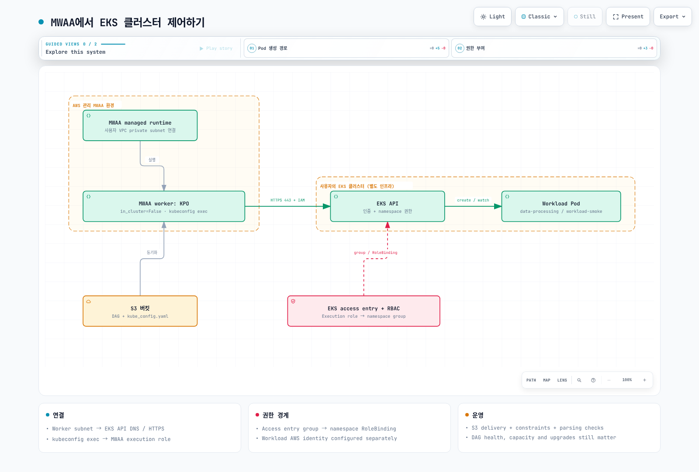

# Part 4: Amazon MWAA 통합

> 검토 기준: 2026-09-12, MWAA Airflow 3.3.1 / Python 3.12, Kubernetes provider 10.21.0.

이 장은 **environment를 만드는 provisioned Amazon MWAA**에서 자체 EKS로 작업을
제출하는 방법을 다룹니다. YAML workflow를 사용하는 **MWAA Serverless**는 별도
배포 옵션이며 아래의 environment·DAG 파일·비용 모델을 그대로 적용하지 않습니다.

## 1. 관리 범위와 현재 버전

MWAA scheduler/worker는 AWS가 관리하는 Fargate 기반 실행 환경이며, 선택한 사용자
VPC의 private subnet에 연결됩니다. 메타데이터 DB도 AWS가 관리합니다.
따라서 “사용자 VPC와 무관하다”는 설명은 맞지 않습니다. 다만 **고객 EKS 안에
MWAA scheduler Pod가 생기는 것은 아니므로 kubectl로 관리하지 않습니다**.
Airflow 3에서는 MWAA webserver가 Execution API도 제공합니다.

AWS가 기반 서비스를 운영하지만 사용자는 DAG·의존성·IAM·VPC 연결·환경 용량 설정·
알람과 복구 절차를 관리하고 지원 버전으로 업그레이드해야 합니다.
관리형이라는 이유로 모든 환경 장애나 용량 계획이 자동 해결되지는 않습니다.

공식 지원 표에서 Airflow **3.3.1은 2026-09-01**, 3.2.1은 2026-05-19부터
MWAA에서 제공됩니다. 3.3.1의 upstream 릴리스는 2026-08-12입니다.
“항상 3개월 뒤처진다”는 고정 지연 모델 대신 필요한 patch·provider·region과
실제 환경 버전을 확인합니다. 기존 환경은 자동으로 새 Airflow 버전이 되지 않습니다.

| 항목 | 자체 EKS Airflow | Provisioned MWAA |
| --- | --- | --- |
| 운영 | Kubernetes 자원·DB·업그레이드·복구를 설계 | 서비스 기반 인프라는 AWS 관리, DAG·권한·연결·용량·업그레이드는 사용자 작업 포함 |
| 버전·executor | 원하는 조합의 호환성을 직접 검증 | 지원 Airflow/runtime/configuration 범위에서 선택 |
| Python 패키지 | 자체 image 빌드 등 | S3 requirements.txt와 버전에 맞는 constraints |
| 시스템 의존성 | image·노드 정책 범위에서 구성 | startup script로 Linux runtime 설치 가능; 지원 범위·시작 시간·네트워크 검증 |
| DAG 배포 | GitDagBundle, git-sync 등 구성 | 문서화된 기본 경로는 S3 DAG folder와 지원 파일 동기화 |
| 외부 workload | KPO 등으로 별도 image 실행 | KPO/EKS 연동 등으로 별도 workload image 실행 가능 |

Startup script는 requirements 설치와 Airflow 시작 전에 실행되며, 공식 예제에는
sudo로 runtime을 설치하는 방법도 있습니다. “root/시스템 패키지 설치가 전혀
불가능하다”는 구분으로 제품을 선택하지 않습니다. 임의의 base image나 executor를
자유롭게 바꾸는 권한과는 다릅니다.

이 예제는 Git → CI → S3 → MWAA 경로를 사용합니다. S3 delivery를 사용한다는
사실만으로 Airflow 3의 모든 bundle 기능이 불가능하다고 단정하지 않습니다.
별도 bundle 설정을 도입하려면 해당 MWAA 버전의 허용 설정과 지원 여부를 검증합니다.
Git polling과 S3 동기화 모두 파싱 지연이 있어 push/merge 즉시 실행되는 보장은 없습니다.

## 2. EKS 연결의 세 가지 조건

1. **네트워크:** MWAA worker subnet에서 EKS API endpoint의 DNS와 HTTPS 443에
   도달해야 합니다. Private endpoint면 routing·security group·DNS를 확인합니다.
   인증을 추가해도 연결 timeout은 해결되지 않습니다.
2. **인증:** MWAA execution role이 EKS access entry 또는 기존 aws-auth 경로로
   인식되어야 합니다. kubeconfig의 exec plugin은 실행 시점의 IAM 자격 증명을 씁니다.
3. **권한:** 그 IAM 주체에 연결한 Kubernetes group을 namespace RoleBinding에 연결합니다.
   EKS API 인증, Kubernetes RBAC, child Pod의 AWS 데이터 권한은 별개입니다.

실습은 기존 MWAA 3.3.1 환경과 운영 중인 EKS, AWS CLI v2와 kubectl을 전제로 합니다.
EKS 버전의 현재 지원 상태와 provider/client 호환성을 확인합니다.
이 장을 위해 새 cluster나 광범위한 관리자 역할을 만들 필요는 없습니다.

### Access entry와 namespace RBAC

아래는 cluster 관리자가 수행하는 설정 예제입니다. ARN·cluster·region을 실제
값으로 바꾸고 기존 access entry가 있는지 확인합니다.

```bash
aws eks describe-cluster \
  --name data-eks-cluster --region us-east-1 \
  --query 'cluster.accessConfig.authenticationMode'

# Administrator action; API or API_AND_CONFIG_MAP mode is required.
aws eks create-access-entry \
  --cluster-name data-eks-cluster --region us-east-1 \
  --principal-arn arn:aws:iam::123456789012:role/mwaa-execution-role-my-environment \
  --type STANDARD \
  --kubernetes-groups mwaa-pod-launcher
```

API_AND_CONFIG_MAP에서도 access entry를 사용할 수 있습니다. API 모드에서는
aws-auth 수정이 접근 권한을 추가하지 않습니다. CONFIG_MAP 전용 기존 cluster는
기존 매핑을 사용하거나 계획된 migration을 진행합니다. 인증 모드 변경에는 되돌릴
수 없는 전환이 있으므로 이 예제에 자동 변경 명령을 넣지 않았습니다.

아래를 workload-access.yaml로 저장해 적용합니다. Namespace RoleBinding이므로
권한 범위는 data-processing입니다. ClusterRoleBinding을 사용해 namespace
제한을 표현하지 않습니다.

```yaml
apiVersion: v1
kind: Namespace
metadata:
  name: data-processing
---
apiVersion: v1
kind: ServiceAccount
metadata:
  name: workload-smoke
  namespace: data-processing
automountServiceAccountToken: false
---
apiVersion: rbac.authorization.k8s.io/v1
kind: Role
metadata:
  name: mwaa-pod-launcher
  namespace: data-processing
rules:
- apiGroups:
  - ''
  resources:
  - pods
  verbs:
  - create
  - get
  - list
  - watch
  - patch
  - delete
- apiGroups:
  - ''
  resources:
  - pods/log
  verbs:
  - get
---
apiVersion: rbac.authorization.k8s.io/v1
kind: RoleBinding
metadata:
  name: mwaa-pod-launcher
  namespace: data-processing
subjects:
- kind: Group
  name: mwaa-pod-launcher
  apiGroup: rbac.authorization.k8s.io
roleRef:
  apiGroup: rbac.authorization.k8s.io
  kind: Role
  name: mwaa-pod-launcher
```

이 Role은 namespace 안의 Pod 전체에 영향을 줄 수 있습니다. 다른 grant가 있다면
권한은 합산되므로 모든 access policy/RBAC도 확인합니다. Pod를 생성할 수 있는
신뢰하지 않는 작성자의 ServiceAccount·Pod spec 선택은 admission 정책으로 제한합니다.
이 예제는 동기 실행이며 XCom/exec 권한을 사용하지 않습니다.

## 3. kubeconfig와 의존성 배포

기존 개인 kubeconfig와 섞이지 않도록 새 파일을 만듭니다. 생성하는 관리 주체에는
대상 cluster의 eks:DescribeCluster 권한이 필요합니다.

```bash
set -eu
mkdir -p ./mwaa-staging
test ! -e ./mwaa-staging/kube_config.yaml
aws eks update-kubeconfig \
  --name data-eks-cluster --region us-east-1 \
  --alias data-eks-cluster \
  --kubeconfig ./mwaa-staging/kube_config.yaml
```

생성된 파일의 cluster/context/CA와 exec.command를 확인합니다. 개발자 로컬
AWS_PROFILE을 참조하는 exec.env 항목은 제거해야 MWAA execution role의 기본
credential chain을 사용할 수 있습니다. 별도 role 가정을 의도하지 않았다면
exec 인자의 --role도 넣지 않습니다. 장기 access key나 고정 token을 저장하지 않습니다.
MWAA runtime에서 aws 실행 파일과 get-token 경로가 동작하는지도 확인합니다.

아래 requirements.txt는 **이 장의 3.3.1/Python 3.12 환경에만 맞춘 예제**입니다.
기본 image에 provider가 있는지 먼저 확인하고, 추가/변경 시 실제 설치 결과를
검증합니다. 버전 없는 apache-airflow extra로 core를 임의 갱신하지 않습니다.

```text
--constraint https://raw.githubusercontent.com/apache/airflow/constraints-3.3.1/constraints-3.12.txt
apache-airflow-providers-cncf-kubernetes==10.21.0
```

S3 버킷은 MWAA 요구사항에 맞게 versioning과 Block Public Access를 켭니다.
requirements.txt를 업로드한 뒤 environment가 참조하는 object version도 갱신하고
설치 로그를 확인합니다. 파일 overwrite만으로 설정 변경이 끝난다고 가정하지 않습니다.

DAG folder에는 다음 구조를 유지합니다. 로컬에서 생성한 kube_config.yaml을
검토한 뒤 이 folder에 넣고, 환경에서 설정한 S3 DAG prefix로 배포합니다.

```text
dags/
  mwaa_eks_smoke.py
  kube_config.yaml
  templates/
    base-pod-template.yaml
```

```yaml
apiVersion: v1
kind: Pod
metadata:
  labels:
    app: airflow-kpo-smoke
spec:
  serviceAccountName: workload-smoke
  automountServiceAccountToken: false
  restartPolicy: Never
  securityContext:
    runAsNonRoot: true
    runAsUser: 65532
    seccompProfile:
      type: RuntimeDefault
  containers:
  - name: base
    image: python:3.12-slim
    resources:
      requests:
        cpu: 100m
        memory: 64Mi
      limits:
        cpu: 500m
        memory: 128Mi
    securityContext:
      allowPrivilegeEscalation: false
      readOnlyRootFilesystem: true
      capabilities:
        drop:
        - ALL
```

```python
from datetime import datetime, timedelta, timezone
from pathlib import Path

from airflow.sdk import DAG
from airflow.providers.cncf.kubernetes.operators.pod import KubernetesPodOperator

BUNDLE_DIR = Path(__file__).resolve().parent

with DAG(
    dag_id="mwaa_eks_smoke",
    start_date=datetime(2026, 9, 1, tzinfo=timezone.utc),
    schedule=None,
    catchup=False,
) as dag:
    run_smoke = KubernetesPodOperator(
        task_id="run_smoke",
        name="mwaa-eks-smoke",
        namespace="data-processing",
        image="python:3.12-slim",
        cmds=["python", "-B", "-c"],
        arguments=["import sys; print('MWAA_EKS_OK run_id=' + sys.argv[1])", "{{ run_id }}"],
        pod_template_file=str(BUNDLE_DIR / "templates/base-pod-template.yaml"),
        in_cluster=False,
        config_file=str(BUNDLE_DIR / "kube_config.yaml"),
        service_account_name="workload-smoke",
        random_name_suffix=True,
        reattach_on_restart=True,
        deferrable=False,
        do_xcom_push=False,
        get_logs=True,
        log_events_on_failure=False,
        startup_timeout_seconds=120,
        active_deadline_seconds=180,
        execution_timeout=timedelta(minutes=5),
        on_finish_action="delete_pod",
        on_kill_action="delete_pod",
    )
```



[Interactive diagram](https://www.atomai.click/kubernetes-docs/archmaps/ko-data-on-eks-airflow-04-mwaa-integration-0.html)

## 4. 실행 확인과 제품 선택

DAG parse 성공 후 mwaa_eks_smoke를 수동 실행해 task 상태와 MWAA_EKS_OK 로그를
확인합니다. 실행 중 실제 Pod의 SA·image·resources도 확인합니다. 성공 후 삭제는
설정된 cleanup 동작입니다. 오래 보관할 task 로그는 MWAA CloudWatch logging에서 확인합니다.

| 증상 | 확인할 경계 |
| --- | --- |
| DNS/연결 timeout | worker subnet → EKS API routing·DNS·SG |
| Unauthorized | exec credential, 실제 IAM role, access entry |
| Forbidden | namespace·group·RoleBinding과 필요한 verb |
| ImagePullBackOff | EKS node/Fargate image pull 역할과 registry 연결 |
| DAG import/exec binary 오류 | MWAA 설치 버전·파일 동기화·aws 실행 경로 |

Workload Pod는 MWAA execution role을 자동 상속하지 않습니다. 실제 S3 작업에는
child SA의 IRSA/Pod Identity 등 별도 데이터 권한이 필요합니다.
KPO가 이기종 image를 실행할 수 있으므로 MWAA를 “PyPI-only 또는 중요도가 낮은
파이프라인 전용”으로 분류하지 않습니다.

필요한 executor/runtime 자유도, 지원 버전, 운영 인력, 네트워크 경계와 장애 복구
요구를 비교합니다. 비용은 같은 처리량·지연 목표에서 environment class/worker 범위,
EKS·DB·스토리지·NAT·로그와 운영 인건비를 함께 산정합니다.
근거 없는 “셀프 호스팅 30–60% 절감” 수치는 의사결정 기준에서 제외합니다.

## 검증 범위와 참고 자료

버전 표·공식 제약·provider 소스와 예제 Python/YAML/shell 구조를 검토했습니다.
실제 MWAA update, EKS access entry 생성, RBAC 적용이나 end-to-end 실행은 수행하지
않았습니다. 계정별 연결과 실행 결과는 위 확인 절차로 검증해야 합니다.


- [MWAA supported versions and availability dates](https://docs.aws.amazon.com/mwaa/latest/userguide/airflow-versions.html)
- [MWAA architecture](https://docs.aws.amazon.com/mwaa/latest/userguide/what-is-mwaa.html)
- [Startup scripts and Linux runtimes](https://docs.aws.amazon.com/mwaa/latest/userguide/using-startup-script.html)
- [Python dependencies and constraints](https://docs.aws.amazon.com/mwaa/latest/userguide/working-dags-dependencies.html)
- [MWAA with EKS](https://docs.aws.amazon.com/mwaa/latest/userguide/mwaa-eks-example.html)
- [EKS access management](https://aws.amazon.com/blogs/containers/a-deep-dive-into-simplified-amazon-eks-access-management-controls/)
- [MWAA Serverless](https://docs.aws.amazon.com/mwaa/latest/mwaa-serverless-userguide/what-is-mwaa-serverless.html)

[Part 5: Operations](05-operations.md)

[README](README.md)

[Quiz](../../quizzes/data-on-eks/airflow/04-mwaa-integration-quiz.md)
