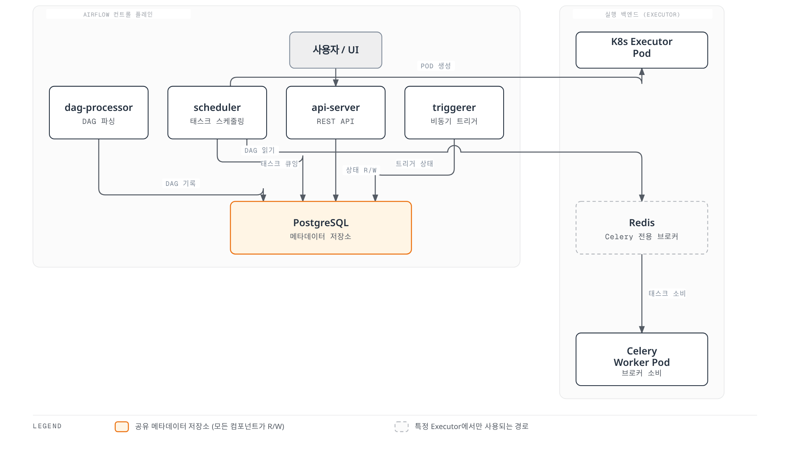

# Airflow on EKS 딥다이브

## 개요

Apache Airflow는 ETL/ELT 작업, ML 학습 파이프라인, 시스템 간 배치 워크플로우 등을 태스크의 DAG(directed acyclic graph)로 정의하고 실행하는, 데이터 파이프라인 오케스트레이션의 표준으로 자리잡은 플랫폼입니다. EKS 환경에서는 보통 **공식 `apache/airflow` Helm 차트**를 통해 배포하며, 이를 통해 개별 태스크가 고정된 워커 풀에서 자원을 다투는 대신 Kubernetes Pod로 독립적으로 확장될 수 있습니다. Airflow 2는 2026년 4월에 EOL(지원 종료)에 도달했으므로, 신규 배포는 **Airflow 3.x** 계열을 대상으로 해야 합니다. Airflow 3는 플랫폼을 독립적으로 확장 가능한 서비스들로 재구성했고, 2.x의 여러 패턴(하이브리드 executor, `git-sync` 기반 DAG 전달)을 Kubernetes 네이티브 방식으로 대체했습니다.

> **지원 버전**: Apache Airflow 3.2+, Kubernetes 1.30+
> **마지막 업데이트**: 2026년 7월 15일

## 핵심 아키텍처 개념

Airflow 2에서는 UI/API를 담당하는 단일 **webserver** 프로세스와, 태스크 스케줄링*과* DAG 파일 파싱을 동시에 담당하는 **scheduler** 프로세스로 구성되어 있었습니다. 부하가 높은 상황에서는 비용이 큰 DAG 파싱 작업이 스케줄러 본연의 스케줄링 루프를 잠식할 수 있었습니다. Airflow 3는 컨트롤 플레인을 각각 하나의 책임만 갖는 네 개의 독립적으로 확장 가능한 서비스로 분리하여 이 문제를 해결합니다: **`api-server`**(UI, REST API v2, 인증을 담당하는 FastAPI 기반 서비스), **`scheduler`**(의존성 평가와 태스크 인스턴스 큐잉만 담당), **`dag-processor`**(이제는 필수 서비스가 된, DAG 파일을 파싱해 메타데이터 DB의 `serialized_dag` 테이블에 결과를 기록하는 것이 유일한 역할인 서비스), 그리고 **`triggerer`**(외부 이벤트를 기다리는 deferrable operator를 실행). **PostgreSQL**은 메타데이터 데이터베이스로 항상 필요하며, **Redis**는 `CeleryExecutor` 워커 풀을 사용하는 경우에만 필요합니다.

## 딥다이브 목차

**[1. Kubernetes 위의 Airflow 아키텍처](01-architecture.md)**
- Airflow 3의 4개 서비스 분리: api-server, scheduler, dag-processor, triggerer
- DAG 파싱이 스케줄러에서 필수 서비스인 dag-processor로 이전된 이유
- 백엔드 서비스: PostgreSQL(항상 필요)과 Redis(CeleryExecutor 전용)
- Executor 종류 개관 및 3.0에서 제거된 하이브리드 executor

**[2. Helm 배포와 Executor 선택](02-helm-deployment.md)**
- 공식 `apache/airflow` Helm 차트 vs 무관한 커뮤니티 차트 `airflow-helm/charts`
- 차트 설치와 최상위 `executor` 설정
- `KubernetesExecutor` vs `CeleryExecutor` 심층 비교
- Celery 워커를 위한 KEDA 기반 오토스케일링(스케일 투 제로 포함)

**[3. DAG 패턴과 KubernetesPodOperator](03-dag-patterns.md)**
- `KubernetesPodOperator`와 Pod 스펙 우선순위(`pod_template_file`, `full_pod_spec`, 생성자 인자)
- 전용 노드 풀에 태스크 Pod 배치 및 태스크별 IRSA 부여
- `git-sync`를 대체하는 DAG 번들(`GitDagBundle`, `S3DagBundle`)
- KubernetesPodOperator를 통한 DAG에서 Spark/dbt 작업 실행

**[4. Amazon MWAA 통합](04-mwaa-integration.md)**
- MWAA의 "관리형"이 의미하는 것 vs EKS 위에서 셀프 매니지드로 운영하는 컨트롤 플레인
- Amazon MWAA vs EKS 셀프 매니지드 Airflow: 버전 최신성, 비용, 커스터마이징 관점의 트레이드오프
- `in_cluster=False`로 설정한 `KubernetesPodOperator`를 통해 MWAA에서 EKS 클러스터 제어하기
- MWAA와 셀프 매니지드 Airflow 중 선택하기 위한 의사결정 가이드

**[5. 운영과 보안](05-operations.md)**
- 분리된 dag-processor 덕분에 이제 스케일에서도 안전해진 스케줄러 HA
- 데이터베이스 마이그레이션/업그레이드 방식과 시크릿 백엔드 구성
- Prometheus/Grafana를 활용한 원격 로깅과 모니터링
- 보안 체크리스트 및 시리즈 전체를 아우르는 프로덕션 준비 체크리스트

## 참고 자료

- [Apache Airflow 공식 문서](https://airflow.apache.org/docs/apache-airflow/stable/)
- [Airflow Helm Chart 문서](https://airflow.apache.org/docs/helm-chart/stable/)
- [DAG Bundles](https://airflow.apache.org/docs/apache-airflow/stable/administration-and-deployment/dag-bundles.html)
- [Kubernetes Provider 문서](https://airflow.apache.org/docs/apache-airflow-providers-cncf-kubernetes/stable/)
- [Amazon MWAA: Amazon EKS와 KubernetesPodOperator 사용하기](https://docs.aws.amazon.com/mwaa/latest/userguide/mwaa-eks-example.html)
- [AWS Data on EKS 프로젝트](https://awslabs.github.io/data-on-eks/)

## 퀴즈

이 섹션에서 배운 내용을 테스트하려면 [Airflow 아키텍처 퀴즈](../../quizzes/data-on-eks/airflow/01-architecture-quiz.md)를 풀어보세요.
