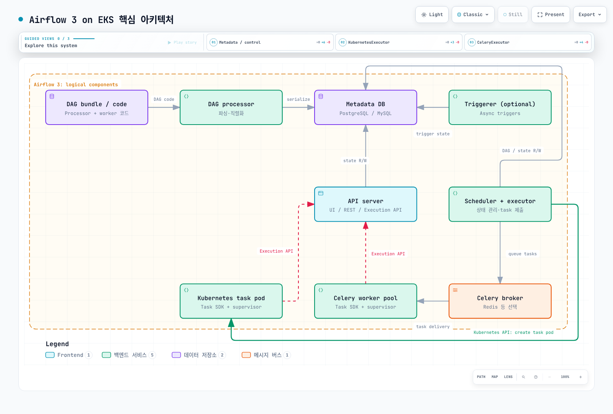

# Airflow on EKS 딥다이브

> **검토 기준**: Airflow 3.3.1 · 공식 Helm chart 1.22.0 · 2026년 9월 12일

Apache Airflow는 DAG로 작업 의존성을 정의하고 예약·실행·관찰하는 플랫폼입니다.
EKS에서 어떤 작업이 별도 Pod로 실행되는지는 **executor와 operator 선택**에
달려 있습니다. Helm chart를 설치했다는 이유만으로 모든 task가 Pod 하나씩으로
실행되지는 않습니다.

Airflow 2는 2026년 4월 22일 EOL에 도달했습니다. 신규 구성은 지원 중인 3.x를
기준으로 합니다. 다만 chart 1.22.0의 기본 Airflow는 **3.2.2**이므로 chart 버전과
Airflow image/설정 버전을 별도로 확인해야 합니다. 이 시리즈는 3.3.1 동작을
검토하고 해당 버전 override로 chart를 렌더링했습니다.

## 핵심 구조

- Scheduler와 executor가 실행할 task를 결정·제출하고 metadata 상태를 갱신합니다.
- 필수 DAG processor가 DAG bundle을 파싱·직렬화합니다. Worker에도 작업 코드와
  해당 bundle 또는 코드 배포 경로가 필요합니다.
- API server는 UI·REST API와 Task Execution API 경로를 제공합니다. 일반 Python
  Task SDK의 supervisor는 이 API로 작업 상태·Connection/Variable/XCom을 교환합니다.
- Triggerer는 deferrable task가 기다리는 동안 **trigger**를 실행합니다. Deferral을
  쓰지 않는 최소 구성에는 필수가 아닙니다.
- Metadata DB는 PostgreSQL 또는 MySQL 등을 지원합니다. 이 시리즈는 PostgreSQL
  예제를 사용하지만 유일한 선택지는 아닙니다. Celery broker도 Redis만 가능한 것은 아닙니다.

[Interactive diagram](https://www.atomai.click/kubernetes-docs/archmaps/ko-data-on-eks-airflow-readme-0.html)

DAG bundle는 git-sync를 무조건 제거한 기능이 아닙니다. 공식 chart는 git-sync를
계속 지원하며, 전달 방식과 bundle의 버전 고정 능력을 구분합니다.
Parser 분리도 모든 지연·DB 병목이나 HA 문제를 없애지는 않습니다.

## 시리즈

1. [Kubernetes의 Airflow 아키텍처](01-architecture.md): 구성 요소·Execution API·DB/broker·executor.
2. [Helm 배포와 executor 선택](02-helm-deployment.md): 공식 chart·버전·연결·worker scaling.
3. [DAG 패턴과 KubernetesPodOperator](03-dag-patterns.md): Pod 실행·코드 전달·bundle·Spark/dbt.
4. [Amazon MWAA 통합](04-mwaa-integration.md): 관리 범위·EKS 연동·버전과 비용 비교.
5. [운영과 보안](05-operations.md): HA·마이그레이션·시크릿·로그·관측·복구 검증.

- [Airflow 3.3.1 architecture](https://airflow.apache.org/docs/apache-airflow/3.3.1/core-concepts/overview.html)
- [Supported versions and lifecycle](https://airflow.apache.org/docs/apache-airflow/3.3.1/installation/supported-versions.html)
- [Airflow prerequisites](https://airflow.apache.org/docs/apache-airflow/3.3.1/installation/prerequisites.html)
- [Executor configuration and history](https://airflow.apache.org/docs/apache-airflow/3.3.1/core-concepts/executor/index.html)
- [DAG bundles](https://airflow.apache.org/docs/apache-airflow/3.3.1/administration-and-deployment/dag-bundles.html)
- [Deferrable operators and triggers](https://airflow.apache.org/docs/apache-airflow/3.3.1/authoring-and-scheduling/deferring.html)

[Quiz](../../quizzes/data-on-eks/airflow/01-architecture-quiz.md)
