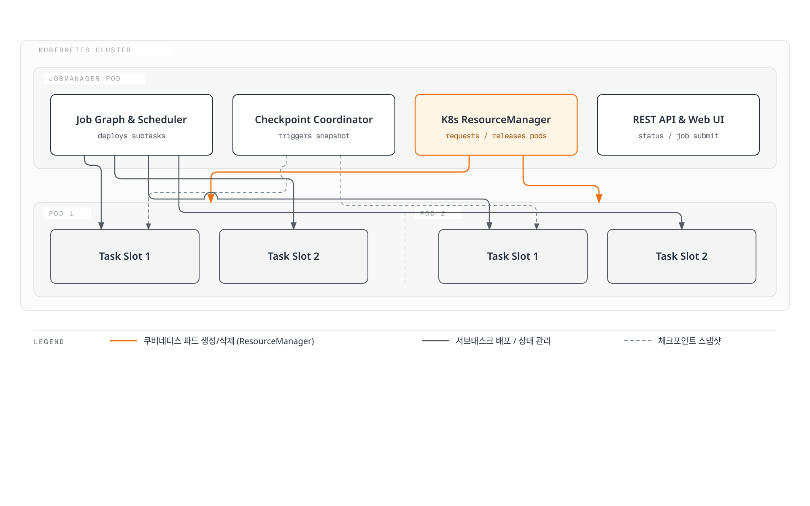

# Part 1: Kubernetes에서의 Flink 아키텍처

> **지원 버전**: Apache Flink 2.2+, Kubernetes 1.21+\
> **마지막 업데이트**: 2026년 7월 15일

## Apache Flink란 무엇인가?

Apache Flink는 무한(unbounded) 및 유한(bounded) 데이터 스트림에 대한 상태 기반(stateful) 연산을 위해 설계된 분산 스트림 처리 엔진입니다. 실시간 분석, 이벤트 기반 애플리케이션, 낮은 지연시간과 exactly-once 상태 보장이 필요한 지속적인 ETL 파이프라인 등에 널리 사용됩니다.

이 문서는 EKS에서 Flink를 운영하기 전에 이해해야 하는 핵심 아키텍처 개념 — JobManager/TaskManager 클러스터 모델, 세 가지 배포 모드, 네이티브 Kubernetes 배포와 Standalone-on-Kubernetes의 차이 — 을 다룹니다. Part 2에서는 실제 EKS 클러스터에 **Flink Kubernetes Operator**를 설치하고 운영하는 방법을 설명합니다.

## 실습 환경 설정

이 문서의 예제를 따라하기 위해서는 다음과 같은 도구와 환경이 필요합니다:

### 필수 도구

* kubectl v1.21 이상
* 작동하는 Kubernetes 클러스터 (Amazon EKS 권장)
* Apache Flink 배포판에 포함된 Flink CLI(`bin/flink`) — 클러스터에 직접 잡을 제출할 때 사용
* (Part 2에서 다룸) Flink Kubernetes Operator의 CRD — 이 문서는 Operator 자체보다 Operator가 관리하는 아키텍처에 초점을 맞추므로 이번 문서에서는 필요하지 않습니다

## 1. 핵심 클러스터 아키텍처: JobManager와 TaskManager

### 핵심 용어

* **JobManager(JM)**: Flink 클러스터의 컨트롤 플레인. 제출된 애플리케이션으로부터 잡 그래프를 구성하고, 체크포인트를 조율하며, TaskManager에 작업을 스케줄링하고, REST API와 웹 UI를 제공합니다. Kubernetes에서는 JobManager가 자신만의 Pod로 실행됩니다.
* **TaskManager(TM)**: 실제로 잡을 실행하는 워커 프로세스. 각 TaskManager는 하나 이상의 **태스크 슬롯(task slot)**을 제공하며, 각 슬롯은 오퍼레이터 서브태스크의 병렬 인스턴스 하나를 실행합니다. Kubernetes에서는 각 TaskManager가 자신만의 Pod로 실행됩니다.
* **태스크 슬롯(Task Slot)**: TaskManager의 자원(주로 메모리)을 고정된 단위로 나눠, 한 번에 정확히 하나의 오퍼레이터 서브태스크를 위해 예약해 두는 것. 슬롯이 4개인 TaskManager는 최대 4개의 서브태스크를 동시에 실행할 수 있습니다.
* **체크포인트 코디네이터(Checkpoint Coordinator)**: JobManager 내부에서 주기적으로 모든 TaskManager에 걸친 오퍼레이터 상태의 분산 스냅샷을 트리거하는 컴포넌트로, 장애 이후 exactly-once 복구를 가능하게 합니다.
* **Kubernetes ResourceManager**: JobManager 내부에서 Kubernetes API 서버와 통신해 TaskManager Pod를 요청하거나 반환하는 컴포넌트. 네이티브 Kubernetes 배포(3절 참고)에서만 사용됩니다.

### Kubernetes에서의 JobManager ↔ TaskManager 흐름



JobManager는 제출된 애플리케이션을 잡 그래프로 분해하고, 각 오퍼레이터를 병렬 서브태스크로 나눠, 가용한 TaskManager Pod들의 태스크 슬롯에 배치합니다. 네이티브 Kubernetes 배포를 사용하면 JobManager 내부의 Kubernetes ResourceManager가 더 많은 슬롯이 필요할 때 새로운 TaskManager Pod를 동적으로 요청하고, 잡의 병렬도가 줄거나 잡이 종료되면 해당 Pod를 반환합니다.

### 슬롯 공유(Slot Sharing): 슬롯 수가 전체 병렬도의 합이 아닌 이유

기본적으로 Flink는 같은 잡에 속한 여러 오퍼레이터의 서브태스크를, 오퍼레이터마다 병렬 인스턴스당 별도의 슬롯을 요구하는 대신 **슬롯 공유 그룹(slot sharing group)**을 통해 같은 슬롯에 배치합니다. 즉 잡에 실제로 필요한 태스크 슬롯 수는 보통 모든 오퍼레이터의 병렬도를 합한 값이 아니라, 잡의 **최대 오퍼레이터 병렬도**입니다. 예를 들어 `source`(병렬도 4) → `map`(병렬도 4) → `sink`(병렬도 2)로 이어지는 파이프라인은 전체 4개의 슬롯만 있으면 됩니다. 특정 병렬 "파이프라인 인스턴스"에 속한 세 오퍼레이터의 서브태스크가 같은 슬롯에 함께 배치되기 때문입니다. 이는 클러스터에 실제로 몇 개의 TaskManager Pod가 필요한지를 산정할 때 사용하는 주요 기준 중 하나입니다.

## 2. 배포 모드

Flink는 잡의 `main()` 메서드가 어디서 실행되는지, 그리고 잡이 자신만의 클러스터에 얼마나 밀접하게 묶여 있는지에 따라 세 가지 배포 모드를 지원합니다.

| 모드 | 동작 방식 | 격리 수준 | 권장 여부 |
| --- | --- | --- | --- |
| **Application Mode** | 잡마다 전용 클러스터를 생성하고, 잡의 `main()`이 JobManager 내부에서 직접 실행됨 | 잡 간 완전한 자원 격리와 펜싱(fencing) — 한 잡의 장애나 자원 급증이 다른 잡에 영향을 주지 않음 | **프로덕션 기본값으로 권장** |
| **Session Mode** | 하나의 공유된 장수명 클러스터가 시간이 지나며 독립적으로 제출되는 여러 잡을 실행 | 격리 수준이 낮음 — 여러 잡이 같은 JobManager를 공유하고 동일한 TaskManager 풀을 두고 경쟁함 | 클러스터 시작 오버헤드가 격리보다 더 중요한, 짧고 애드혹한 잡이 많은 환경에 적합 |
| **Per-Job Mode** | 레거시 모드. 클라이언트가 로컬에서 `main()`을 실행해 미리 만들어진 잡 그래프를 제출하고, 잡마다 전용 클러스터를 새로 띄움 | Application Mode와 유사한 완전한 격리 | **네이티브 Kubernetes 배포에서는 지원되지 않음** — 앞으로도 사실상 사용되지 않는 모드 |

**Application Mode**가 기본값으로 권장되는 이유는, 잡의 `main()`을 JobManager 내부에서 실행하면 클라이언트 측에서 미리 구성한 대용량 잡 그래프를 네트워크로 전송할 필요가 없고, 더 중요하게는 잡마다 전용 JobManager와 TaskManager Pod를 갖게 되기 때문입니다. 이러한 잡 단위 자원 격리와 펜싱 덕분에, 문제를 일으키거나 자원을 과다하게 사용하는 잡이 다른 잡의 클러스터를 굶기거나 불안정하게 만들 수 없습니다. 여러 Flink 워크로드를 함께 운영하는 공유 EKS 클러스터에서는 이 특성이 특히 중요합니다.

**Session Mode**는 이러한 격리를 포기하는 대신 잡당 시작 지연시간을 낮춥니다. 클러스터가 이미 존재하는 상태에서 새 잡이 단순히 제출되기 때문입니다. 대화형 탐색 작업이나 짧게 끝나는 배치 잡이 대량으로 존재하는 환경에서는 여전히 합리적인 선택이지만, 하나의 시끄러운(noisy) 잡이 세션 클러스터 전체에 영향을 줄 수 있다는 점을 감안해야 합니다.

**Per-Job Mode**는 Kubernetes 환경에서 왜 어디에서도 권장되지 않는지를 설명하기 위해서만 언급합니다. 네이티브 Kubernetes 배포는 처음부터 Per-Job Mode를 구현하지 않았기 때문에, EKS 환경에서는 이 모드 자체를 선택할 수 없습니다. Application Mode가 레거시 클라이언트 측 제출 방식 없이도 동일한 잡 단위 격리 목표를 달성해 줍니다.

## 3. 네이티브 Kubernetes 배포 vs. Standalone-on-Kubernetes

Flink는 근본적으로 다른 두 가지 방식으로 Kubernetes 위에서 실행될 수 있으며, 이 차이는 클러스터의 TaskManager 개수를 누가 어떻게 관리하는지를 결정할 때 중요합니다.

| 항목 | 네이티브 Kubernetes 배포 | Standalone-on-Kubernetes |
| --- | --- | --- |
| 자원 관리 | Flink 자체의 Kubernetes ResourceManager 통합이 Kubernetes API와 직접 통신하며 TaskManager Pod를 요청/반환 | 없음 — Flink는 Kubernetes를 전혀 인식하지 못하며, Pod는 그냥 일반 프로세스일 뿐 |
| TaskManager Pod 개수 | 탄력적 — 잡에 필요한 슬롯 수에 따라 동적으로 늘고 줄어듦 | 고정 — 일반 Kubernetes `Deployment`/YAML 매니페스트로 사전에 정의된 개수 |
| 배포 방식 | Kubernetes 컨텍스트를 대상으로 하는 `flink run-application` / `flink run`, 또는 그 위에 구축된 컨트롤러(예: Flink Kubernetes Operator) | JobManager와 TaskManager 컨테이너를 직접 띄우는 수작업 Kubernetes `Deployment`/`Service`/`ConfigMap` YAML |
| 운영 성숙도 | 현재 권장되는 최신 방식 — Part 2에서 다룰 **Flink Kubernetes Operator**가 바로 이 위에 구축됨 | 레거시/수동 방식 — 여전히 기술적으로는 동작하지만, TaskManager 개수를 바꾸려면 YAML을 직접 수정하고 다시 적용해야 함 |

**네이티브 Kubernetes 배포**는 2026년 현재 권장되는 방식입니다. JobManager가 Kubernetes API 서버와 직접 통신할 수 있기 때문에, 잡의 병렬도가 필요로 하는 만큼만 정확히 TaskManager Pod를 요청하고 더 이상 필요 없을 때 반환할 수 있으며, 이를 위해 오퍼레이터나 사람이 YAML을 직접 편집할 필요가 없습니다. 이 동적 자원 할당은 Flink Kubernetes Operator가 그 위에 구축되는 기반이기도 합니다 — Operator는 네이티브 모드 위에 `FlinkDeployment`, `FlinkSessionJob` 같은 Kubernetes 네이티브 CRD 계층을 추가해, 클러스터 라이프사이클과 업그레이드, 세이브포인트 기반 재배포를 선언적으로 관리할 수 있게 합니다.

**Standalone-on-Kubernetes**는 네이티브 지원이 나오기 전부터 존재했던 방식으로, JobManager와 TaskManager를 고정된 개수의 일반 컨테이너로 그냥 실행하며 동적인 자원 요청이 전혀 없습니다. 여전히 동작하며 어떤 Pod가 존재하는지를 더 세밀하게 직접 통제하고 싶을 때 종종 사용되지만, 레거시이자 수동적인 방식입니다 — TaskManager를 스케일링하려면 `Deployment` 매니페스트를 직접 수정하고 다시 적용해야 하며, 클러스터가 필요에 따라 Kubernetes에 추가 용량을 요청하는 내장 메커니즘이 없습니다.

Operator 없이 Flink CLI로 네이티브 Kubernetes 배포(Application Mode)를 이용해 잡을 직접 제출하면 다음과 같은 모습입니다.

```bash
# 네이티브 Kubernetes 배포를 사용해 Application Mode로 잡 제출
./bin/flink run-application \
  --target kubernetes-application \
  -Dkubernetes.cluster-id=my-flink-app \
  -Dkubernetes.container.image=my-registry/my-flink-app:2.3.0 \
  -Dkubernetes.namespace=data-processing \
  -Dtaskmanager.numberOfTaskSlots=2 \
  local:///opt/flink/usrlib/my-job.jar
```

이 한 줄의 명령으로 Flink 클라이언트가 Kubernetes API와 통신해 JobManager Deployment를 생성하며, 이후에는 JobManager 내부의 Kubernetes ResourceManager가 잡에 필요한 만큼 TaskManager Pod를 요청하는 역할을 이어받습니다. Part 2에서는 이 명령형(imperative) CLI 호출 대신, `kubectl apply`로 적용하고 Flink Kubernetes Operator가 지속적으로 관리하는 선언적 `FlinkDeployment` 커스텀 리소스를 사용하는 방식으로 전환합니다.

## 4. Kubernetes에서의 Flink 2.x: 버전 기준선

Apache Flink의 2.x 라인은 2026년 중반 기준 현재 안정 버전이며, **Flink 2.3.0**이 2026년 6월에 최신 안정 릴리스로 출시되었습니다. 2.x 라인 전반에 걸친 주목할 만한 플랫폼 변화는 JobManager와 TaskManager 이미지의 **기본 런타임이 Java 17로 이동**한 것으로, 과거에 사용되던 Java 11 기준선을 대체합니다. 이는 Kubernetes Pod 스펙에서 참조하는 베이스 이미지와, 그 위에 구축하는 커스텀 Flink 이미지 모두에 영향을 미칩니다 — Java 11이 아닌 Java 17(또는 그 이상) JRE/JDK를 기반으로 빌드해야 합니다.

## 다음 단계

이번 문서에서는 Kubernetes에서의 Flink 핵심 아키텍처 — JobManager/TaskManager 모델, 세 가지 배포 모드와 Application Mode가 프로덕션 기본값인 이유, 네이티브 Kubernetes 배포와 레거시 Standalone-on-Kubernetes 방식의 차이 — 를 살펴봤습니다. Part 2에서는 네이티브 Kubernetes 배포 위에 구축되어 `FlinkDeployment`와 `FlinkSessionJob` 커스텀 리소스로 Flink 클러스터를 선언적으로 관리하는 **Flink Kubernetes Operator**의 설치와 운영을 다룹니다.

[메인 페이지로 돌아가기](./README.md)

## 퀴즈

이 장에서 배운 내용을 테스트하려면 [주제 퀴즈](../../quizzes/data-on-eks/flink/01-architecture-quiz.md)를 풀어보세요.
