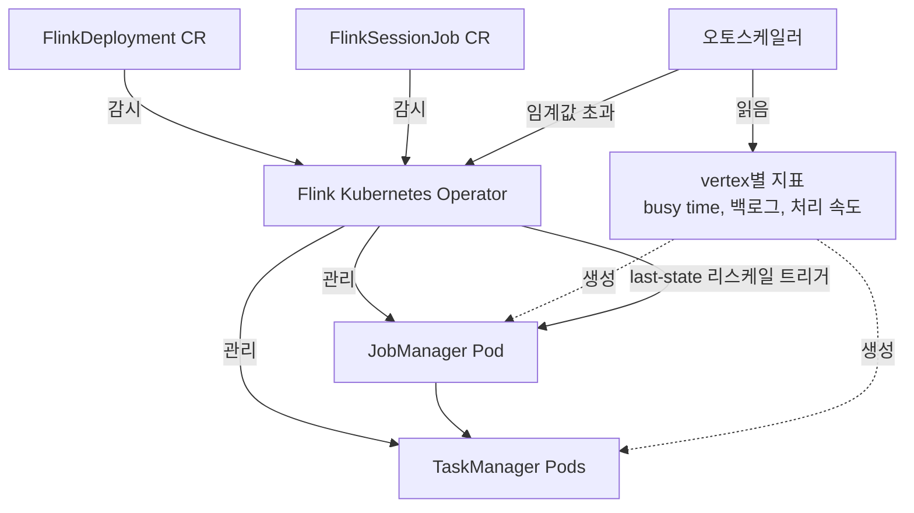

# Part 2: Flink Kubernetes Operator

> **지원 버전**: apache/flink-kubernetes-operator 1.15+, Kubernetes 1.21+\
> **마지막 업데이트**: 2026년 7월 15일

## 실습 환경 설정

이 문서의 예제를 따라하기 위해서는 다음과 같은 도구와 환경이 필요합니다:

### 필수 도구

* kubectl v1.21 이상
* Helm v3.12 이상
* 작동하는 Kubernetes 클러스터 (Amazon EKS 권장)
* cert-manager는 기본 설치 시 필요하지 않습니다 — Helm 차트가 내부 Job을 통해 self-signed 웹훅 인증서를 자동으로 생성합니다. 자체 PKI를 어드미션 웹훅에 연동하려는 경우에만 cert-manager를 설치하세요.

## Flink Kubernetes Operator란 무엇인가?

[Apache Flink Kubernetes Operator](https://github.com/apache/flink-kubernetes-operator)는 Operator 패턴을 통해 Kubernetes 위에서 실행되는 Flink 배포의 전체 라이프사이클을 관리합니다. `flink run-application` CLI로 Kubernetes 타겟에 직접 잡을 제출할 수도 있지만, 그 이후로 다음과 같은 반복적이고 오류가 발생하기 쉬운 작업들이 계속 남습니다:

* 상태 손실 없이 실행 중인 잡을 안전하게 업그레이드/롤백하는 순서 관리
* 잡의 목표 병렬도(parallelism)를 실제 부하에 맞춰 지속적으로 재조정
* 재해 복구용으로만이 아니라 평상시 운영 과정에서도 세이브포인트와 체크포인트 관리
* 오래 유지되는 Session 클러스터와 일회성 Application 클러스터를 동일한 도구로 선언적으로 운영

Operator는 이 모든 것을 `FlinkDeployment`와 `FlinkSessionJob`이라는 두 개의 CRD(Custom Resource Definition)로 추상화합니다. 원하는 잡 스펙을 YAML로 선언하면 Operator가 실제 클러스터 상태를 이에 맞춰 지속적으로 조정하며, 변경 사항을 어떤 방식으로 적용할지(전체 재시작, 빠른 in-place 업그레이드, 또는 그 중간)도 함께 판단합니다.

최신 릴리스인 **1.15.0**(2026년 5월)은 잡 런타임으로 Flink **2.2.x, 2.1.x, 2.0.x, 1.20.x, 1.19.x**를 지원하며, **Kubernetes 1.21 이상**을 요구합니다 — Operator의 어드미션 웹훅이 의존하는 네임스페이스 자동 라벨링 기능이 이 버전부터 지원되기 때문입니다. 최근에는 다음과 같은 주목할 만한 기능이 추가되었습니다:

* **1.14.0**(2026년 2월)에서 네이티브 **Blue/Green 배포** 지원이 추가되어, 잡의 두 버전을 동시에 운영하면서 Operator 제어 하에 트래픽/상태를 전환할 수 있게 되었습니다 (외부 스크립트로 직접 구현할 필요가 없어짐).
* **1.15.0**은 `FlinkDeployment.status`에 Kubernetes 네이티브 `Conditions`를 추가해 `.status.jobStatus.state`를 계속 폴링하는 대신 `kubectl wait --for=condition=...`를 사용할 수 있게 했고, 기본 Log4j2와 함께 선택 가능한 Logback 로깅 옵션을 제공하며, Helm 차트에 `flink-metrics-dropwizard` 리포터를 기본으로 포함시켰습니다.

### 핵심 CRD

* **FlinkDeployment**: Application 모드 클러스터(JobManager, TaskManager, 그리고 배포에 포함된 단 하나의 잡)를 정의하거나, 잡이 붙어있지 않은 Session 모드 클러스터(작업을 기다리는 오래 유지되는 JobManager/TaskManager 풀)를 정의
* **FlinkSessionJob**: 이미 실행 중인 Session 모드 `FlinkDeployment` 위에 잡을 제출. 하나의 세션 클러스터는 여러 개의 `FlinkSessionJob`을 호스팅할 수 있으며, 각각은 기반 클러스터에 영향을 주지 않고 독립적으로 관리/업그레이드/삭제됩니다

Application 모드는 각 잡마다 전용 클러스터와 완전한 라이프사이클 격리를 제공하므로, 프로덕션 잡의 기본 선택지로 자연스럽습니다. Session 모드는 이 격리를 포기하는 대신 잡 시작 속도가 빠르고 클러스터 오버헤드를 공유할 수 있어, 매번 전용 JobManager를 띄울 필요가 없는 단기성/탐색용 잡에 적합합니다.

## 설치

```bash
# Flink Kubernetes Operator Helm 저장소 추가
helm repo add flink-operator-repo https://downloads.apache.org/flink/flink-kubernetes-operator-1.15.0/
helm repo update

# flink 네임스페이스에 Operator 설치
helm install flink-kubernetes-operator flink-operator-repo/flink-kubernetes-operator \
  --namespace flink \
  --create-namespace

# 설치 확인
kubectl get pods -n flink
kubectl get crd | grep flink
```

Operator는 기본적으로 클러스터의 모든 네임스페이스를 감시합니다. 특정 네임스페이스로 범위를 제한하려면 Helm 차트 값의 `watchNamespaces`를 설정합니다.

```bash
helm upgrade flink-kubernetes-operator flink-operator-repo/flink-kubernetes-operator \
  --namespace flink \
  --set watchNamespaces="{flink,flink-staging}"
```

### 최소 구성 FlinkDeployment 예제

```yaml
apiVersion: flink.apache.org/v1beta1
kind: FlinkDeployment
metadata:
  name: order-events-processor
  namespace: flink
spec:
  image: apache/flink:2.1.0
  flinkVersion: v2_1
  flinkConfiguration:
    taskmanager.numberOfTaskSlots: "2"
    execution.checkpointing.savepoint-dir: s3://my-flink-bucket/savepoints
    execution.checkpointing.dir: s3://my-flink-bucket/checkpoints
  serviceAccount: flink
  jobManager:
    resource:
      memory: "2048m"
      cpu: 1
  taskManager:
    resource:
      memory: "4096m"
      cpu: 2
  job:
    jarURI: local:///opt/flink/usrlib/order-events-processor.jar
    entryClass: com.example.flink.OrderEventsJob
    parallelism: 4
    upgradeMode: last-state
```

이 리소스를 적용하면 Operator는 JobManager Deployment, TaskManager Deployment와 관련 Service를 생성한 뒤, `spec.job`에 정의된 잡을 제출합니다.

```bash
kubectl apply -f order-events-processor.yaml -n flink
kubectl get flinkdeployment -n flink
kubectl wait --for=condition=Available flinkdeployment/order-events-processor -n flink --timeout=180s
```

## EKS 배포 고려사항

### 1. 체크포인트/세이브포인트를 위한 IAM Role for Service Accounts (IRSA)

위 예제에서는 `execution.checkpointing.dir`와 `execution.checkpointing.savepoint-dir`를 S3로 지정했습니다. JobManager와 TaskManager Pod가 여기에 쓰기 작업을 하려면, `spec.serviceAccount`에서 참조하는 서비스 어카운트에 해당 버킷/프리픽스로 권한을 좁힌 IAM 역할을 IRSA(또는 EKS Pod Identity)로 바인딩해야 합니다 — 노드 전체에 적용되는 IAM 역할이 아니라, Flink 워크로드만 체크포인트/세이브포인트 데이터를 읽고 쓸 수 있도록 범위를 제한합니다.

```yaml
apiVersion: v1
kind: ServiceAccount
metadata:
  name: flink
  namespace: flink
  annotations:
    eks.amazonaws.com/role-arn: arn:aws:iam::123456789012:role/flink-checkpoint-access
```

### 2. TaskManager를 위한 노드 크기와 스케줄링

TaskManager Pod는 오래 실행되며 메모리/RocksDB에 상태를 보관하므로, 상태 없는 웹 워크로드와 달리 가볍게 재스케줄되는 것을 견디지 못합니다. 실무적으로 참고할 만한 몇 가지 지침은 다음과 같습니다:

* RocksDB 상태 백엔드를 사용한다면 스필된 상태 처리에 로컬 디스크 I/O가 많이 발생하므로, 충분한 로컬 NVMe/EBS 처리량을 가진 인스턴스 타입으로 Flink TaskManager 전용 [Karpenter](../../autoscaling/02-karpenter.md) NodePool을 구성합니다.
* 전체 AZ 장애로 모든 TaskManager가 함께 죽는 것을 허용할 수 없는 잡이라면, `taskManager.podTemplate`에 `topologySpreadConstraints`나 AZ 간 안티어피니티를 추가합니다.
* TaskManager를 부하가 튀는 무관한 워크로드와 같은 노드에 섞지 않도록 합니다 — CPU를 경쟁하는 noisy neighbor는 vertex의 busy time을 직접 증가시켜, 원치 않는 오토스케일러 리스케일을 유발할 수 있습니다.

## 업그레이드 모드

`spec.job.upgradeMode`는 실행 중인 잡에 변경 사항을 어떻게 적용할지를 결정합니다 — 스펙 수정, 수동 세이브포인트 기반 재배포, 오토스케일러에 의한 리스케일 모두 동일한 메커니즘을 거칩니다. 세 가지 모드가 있습니다:

* **`stateless`**: 상태를 전혀 가져오지 않고 잡을 처음부터 다시 시작합니다. 재시작 간 연속성이 필요 없는 잡(멱등성 컨슈머, 상태가 사소하거나 외부에 별도로 저장되는 잡)에만 적합합니다.
* **`savepoint`**: Operator가 명시적으로 세이브포인트를 생성하고, 클러스터를 안전하게 종료한 뒤, 새 배포를 해당 세이브포인트로부터 복원합니다. 세이브포인트는 완전하고 이동 가능하며 검증된 스냅샷이므로 가장 안전한 선택이지만, 다른 작업을 진행하기 전에 stop-the-world 방식의 세이브포인트를 먼저 생성해야 해서 가장 느립니다.
* **`last-state`**: 새로운 세이브포인트를 생성하지 않고 가장 최근 체크포인트의 메타데이터를 이용해 잡을 복원합니다. 속도가 빠르고, 무엇보다 중요한 점은 잡을 정상적으로 정지시켜 세이브포인트를 뜰 수 없는 상태(비정상 상태이거나 계속 실패 중인 잡)에서도 동작한다는 것입니다. `last-state`가 `FlinkSessionJob`에서도 사용 가능해진 것은 Operator 1.10.0부터로, 그 이전에는 `FlinkDeployment`에서만 사용할 수 있었습니다.

실무에서는 체크포인팅이 활성화된 프로덕션 잡에 `last-state`를 기본으로 권장합니다 — 가장 빠르면서도 잡이 이미 비정상 상태일 때 유일하게 안전하게 동작하는 모드이기 때문입니다. 위험한 스키마 변경 전처럼 외부에서 검증 가능한 내구성 있는 스냅샷이 필요할 때는 `savepoint`를, 상태가 정말로 의미 없을 때만 `stateless`를 선택합니다.

## 오토스케일러

Operator에는 내장 오토스케일러가 포함되어 있는데, 일반적인 Kubernetes HPA와는 근본적으로 다르게 동작합니다: CPU/메모리를 기준으로 Pod 복제본 수를 조정하는 것이 아니라, **잡 그래프 안의 각 vertex(소스, 맵, 조인, 싱크 등)의 병렬도를 개별적으로** 그 vertex가 처리해야 할 데이터량에 맞춰 조정합니다.

### 병렬도를 결정하는 방식

오토스케일러는 각 vertex에 대해 *목표 처리율(target processing rate)*을 계산합니다:

* **소스 vertex**: 목표 처리율은 유입되는 데이터 속도(Kafka, Kinesis 등에서 레코드가 들어오는 속도, 밀린 백로그를 따라잡는 데 필요한 속도까지 포함)입니다.
* **하위 vertex**: 목표 처리율은 이 vertex로 유입되는 모든 상위 vertex의 출력 속도의 합입니다.

그런 다음 설정된 목표 사용률(utilization target)에서 이 목표 처리율을 감당할 수 있는 병렬도 값을 역산합니다 — 즉, vertex의 인스턴스당 현재 처리율과 busy time을 살펴보고, vertex를 100% busy 상태로 몰아넣지 않으면서 목표 부하를 처리하기 위해 몇 개의 병렬 인스턴스가 필요한지 계산합니다.

특히 주목할 점은 오토스케일러가 CPU나 메모리 지표를 전혀 사용하지 않는다는 것입니다. 대신 다음 지표들을 사용합니다:

* 소스 백로그와 소스 유입 속도
* vertex별 레코드 처리(출력) 속도
* vertex별 busy time / backpressure time

이는 의도적인 설계 선택입니다: 스트리밍 잡에서는 어떤 vertex가 느린 외부 I/O 호출을 기다리는 동안 CPU는 유휴 상태이면서도 실질적인 병목일 수 있고, 반대로 CPU는 계속 바쁘면서도 실제로는 부하로 인한 압박을 받지 않을 수도 있습니다. busy time과 처리율 지표는 실제 처리량 압박을 직접적으로 반영하며, 이것이 Flink가 입력을 따라갈 수 있는지를 결정하는 핵심입니다 — 레코드당 비용이 vertex마다 크게 다른 데이터플로우 엔진에서는 CPU/메모리 사용률이 이를 대변하기에 적합하지 않습니다.

### 주요 설정

```yaml
flinkConfiguration:
  job.autoscaler.enabled: "true"
  job.autoscaler.target.utilization: "0.6"
  job.autoscaler.target.utilization.boundary: "0.2"
  job.autoscaler.stabilization.interval: "5m"
  job.autoscaler.metrics.window: "10m"
  job.autoscaler.catch-up.duration: "10m"
  pipeline.max-parallelism: "360"
```

* **`job.autoscaler.target.utilization`** (예: `0.6`): 오토스케일러가 각 vertex를 유지하려는 busy time 비율입니다. 이 값보다 낮으면 스케일 다운, 높으면 스케일 업합니다.
* 스케일 업/다운 임계값은 목표 사용률과 경계값(boundary)으로부터 도출됩니다 — 실무적으로는 busy 비율이 대략 0.8을 넘으면 스케일 업, 0.4 아래로 내려가면 스케일 다운 트리거로 보고, 그 사이에 데드존을 두어 작은 변동마다 오토스케일러가 진동(oscillation)하지 않도록 합니다.
* **`job.autoscaler.stabilization.interval`**: 리스케일 이후 다음 리스케일을 고려하기까지 대기하는 시간으로, 잡이 안정화될 시간을 줍니다.
* **`job.autoscaler.metrics.window`**: 스케일링 결정을 내리기 전에 지표를 평활화하는 롤링 윈도우입니다. 권장 범위는 3~60분입니다 — 너무 짧으면 노이즈에 반응하고, 너무 길면 실제 부하 변화에 너무 늦게 반응합니다.
* **`job.autoscaler.catch-up.duration`**: 백로그를 처리 중인 vertex에게 추가로 부여하는 시간 여유로, 일시적인 캐치업 스파이크 때문에 오토스케일러가 과도하게 스케일업하지 않도록 방지합니다.
* **`pipeline.max-parallelism`**: 오토스케일러가 병렬도를 선택할 수 있는 상한선입니다. **고합성수(highly composite number)**(120, 180, 240, 360, 720 등)로 설정하는 것을 권장합니다 — Flink의 key-group 모델은 `max-parallelism`을 선택된 병렬도로 균등하게 나누므로, 소수(prime number)로 설정하는 것보다 고합성수로 설정할 때 오토스케일러가 고를 수 있는 유효한 약수(divisor) 후보가 훨씬 많아집니다.

내부적으로 오토스케일러가 vertex의 리스케일을 결정하면, 위에서 설명한 것과 동일한 메커니즘 — 즉 `last-state` 업그레이드 — 를 통해 이를 트리거합니다. 그래서 `last-state`는 빠르고 안정적으로 동작해야 합니다: 수동 배포를 위한 업그레이드 모드일 뿐만 아니라, 부하가 변할 때마다 오토스케일러가 지속적으로 의존하는 메커니즘이기도 하기 때문입니다.



## 다음 단계

Operator를 설치하고 업그레이드/오토스케일링 메커니즘을 이해했다면, 다음 단계는 실제 스트림 처리 잡을 배포하는 것입니다 — 체크포인팅과 상태 백엔드 설정, Kafka 소스/싱크 연동, 프로덕션 워크로드에 맞는 리소스 크기 조정 등이 이어집니다.

[메인 페이지로 돌아가기](./README.md)

## 퀴즈

이 장에서 배운 내용을 테스트하려면 [주제 퀴즈](../../quizzes/data-on-eks/flink/02-flink-kubernetes-operator-quiz.md)를 풀어보세요.
