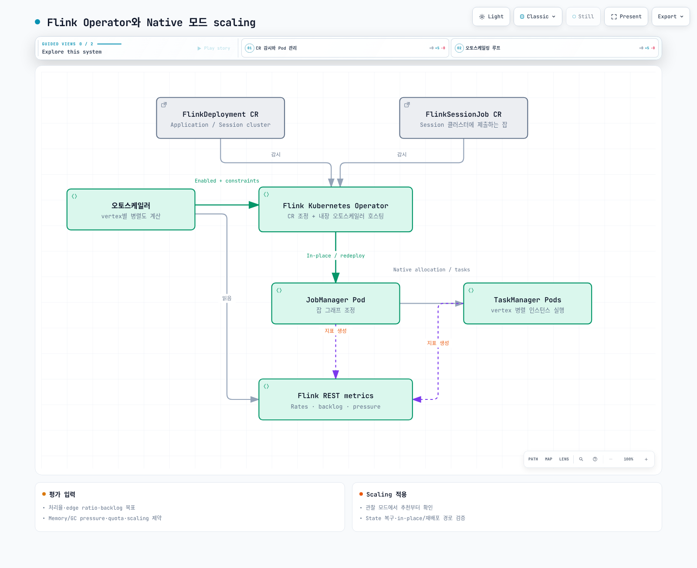

# Part 2: Flink Kubernetes Operator

> 검토: 2026-09-12. Operator/Helm chart 1.15.0, Flink 2.2.1 / Java 17.

Operator는 CR의 목표 상태를 관찰된 cluster/job 상태와 맞추고 upgrade·snapshot·
복구·autoscaling을 관리합니다. 모든 변경의 무중단·무손실을 보장하는 장치는 아닙니다.
Native/Standalone과 Application/Session의 차이는 Part 1을 참고합니다.

## 1. CR과 운영 경계

| CR | 역할 |
| --- | --- |
| FlinkDeployment | Application 또는 Session cluster의 목표 상태 |
| FlinkSessionJob | 기존 managed Session cluster에 제출하는 job |
| FlinkStateSnapshot | 연결된 Deployment/SessionJob의 savepoint/checkpoint 관리 |
| FlinkBlueGreenDeployment | 두 child deployment를 통한 blue/green 전환 관리 |

SessionJob은 개별 spec을 관리할 수 있지만 JM/TM과 기반 cluster 장애는 공유합니다.
Application도 공유 EKS node·network·storage·quota로부터 완전 격리되는 것은 아닙니다.
Blue/green CR이 있다고 외부 Kafka consumer group, transactional ID, sink 쓰기나
중복 처리까지 자동으로 안전하게 전환되는 것은 아닙니다. 전환 시 추가 용량과
실제 데이터 경로·상태 호환성을 검증합니다.

## 2. 설치: cert-manager와 namespace를 먼저 준비

현재 지원되는 EKS/Kubernetes와 호환 kubectl·Helm을 사용합니다.
이 릴리스의 기본 webhook chart는 **cert-manager Certificate와 Issuer를 생성**합니다.
인증서를 만드는 내부 Job이 있는 것이 아닙니다. 운영 중인 호환 cert-manager와
controller/webhook/cainjector 상태를 먼저 확인합니다.
웹훅을 끄는 것을 설치 오류의 기본 해결책으로 삼지 않습니다.

아래 operator-values.yaml은 workload namespace를 data-processing으로 제한하고
검증한 Operator image digest를 고정합니다. Chart의 짧은 기본 tag와 1.15.0 tag가
같은 multi-architecture digest임을 확인했습니다.

```yaml
watchNamespaces:
- data-processing
image:
  repository: ghcr.io/apache/flink-kubernetes-operator
  tag: 1.15.0
  digest: sha256:5372e4461b433ee37391b0ee3fc3e4029980d14e9b64576b0cb78493d1cafe3a
webhook:
  create: true
```

```bash
# Existing cert-manager installation; adjust its namespace if necessary.
kubectl get crd certificates.cert-manager.io issuers.cert-manager.io
kubectl rollout status deployment/cert-manager -n cert-manager --timeout=180s
kubectl rollout status deployment/cert-manager-webhook -n cert-manager --timeout=180s
kubectl rollout status deployment/cert-manager-cainjector -n cert-manager --timeout=180s

# Create the watched workload namespace before Helm creates its SA/RBAC.
kubectl create namespace data-processing --dry-run=client -o yaml | kubectl apply -f -

helm repo add flink-operator-repo https://downloads.apache.org/flink/flink-kubernetes-operator-1.15.0/
helm repo update flink-operator-repo
helm upgrade --install flink-kubernetes-operator flink-operator-repo/flink-kubernetes-operator \
  --version 1.15.0 \
  --namespace flink-operator --create-namespace \
  -f operator-values.yaml \
  --wait --timeout 10m

kubectl wait --for=condition=Ready certificate/flink-operator-serving-cert \
  -n flink-operator --timeout=180s
kubectl get serviceaccount/flink -n data-processing
```

watchNamespaces가 비어 있으면 모든 namespace를 감시합니다. 이 예제처럼 지정하면
chart가 대상 namespace에 flink job ServiceAccount·Role·RoleBinding도 생성합니다.
Namespace는 먼저 존재해야 합니다. 감시 범위, 실제 RBAC와 기존 grant를 함께
확인하며 namespace 제한을 신뢰하지 않는 tenant 사이의 완전한 격리로 해석하지 않습니다.

기존 설치 업그레이드는 chart version/values뿐 아니라 CRD 변경·webhook 호환성·
실행 중인 job 상태를 검토합니다. Helm upgrade만으로 crds/의 기존 CRD가 모두
갱신되는 것은 아닙니다. Chart의 CRD와 image를 동일 릴리스로 관리합니다.

## 3. 먼저 image에 포함된 job으로 실행 경로 확인

flink-smoke.yaml은 공식 image에 포함된 StateMachineExample을 실행합니다.
가상의 order-events JAR이나 존재하지 않는 entryClass를 기본 image에 요구하지 않습니다.
**장시간 실행되는 stateless-upgrade 데모**이며, production 상태 보존을 검증하는
구성은 아닙니다.

```yaml
apiVersion: flink.apache.org/v1beta1
kind: FlinkDeployment
metadata:
  name: flink-smoke
  namespace: data-processing
spec:
  image: flink:2.2.1-java17
  flinkVersion: v2_2
  mode: native
  flinkConfiguration:
    taskmanager.numberOfTaskSlots: '2'
  serviceAccount: flink
  jobManager:
    resource:
      memory: 2048m
      cpu: 1
  taskManager:
    resource:
      memory: 2048m
      cpu: 1
  job:
    jarURI: local:///opt/flink/examples/streaming/StateMachineExample.jar
    parallelism: 2
    upgradeMode: stateless
    state: running
```

```bash
# This readiness sequence is for the initial deployment.
kubectl apply -f flink-smoke.yaml
kubectl wait --for=condition=Running flinkdeployment/flink-smoke \
  -n data-processing --timeout=300s
kubectl get flinkdeployment/flink-smoke -n data-processing -o yaml
kubectl get pods -n data-processing -l app=flink-smoke
kubectl logs deployment/flink-smoke -n data-processing --tail=100
```

Native 모드에서 Operator/Flink는 JM Deployment를 만들고, JM의 ResourceManager가
TM Pod를 동적으로 관리합니다. Native TM이 항상 Deployment라는 설명은 틀립니다.
Standalone 모드의 외부 TM Deployment 관리와 구분합니다.

1.15.0의 조건 이름은 **Running**이며 Available이 아닙니다.
Application은 관찰된 job state가 RUNNING일 때, Session은 JM Deployment가 READY일 때
True가 됩니다. 데이터 정확성·checkpoint 성공·목표 처리량을 보증하는 조건은 아닙니다.
이 구현은 condition에 observedGeneration을 넣지 않으므로 기존 CR 수정 직후 남아
있는 Running=True만으로 새 spec 반영을 판정하지 않습니다. Reconciliation status와
실제 image/config/job 상태가 원하는 변경을 반영했는지 추가 확인합니다.

## 4. 상태 보존 배포에 추가할 조건

실제 application JAR은 호환 runtime·connector와 함께 image에 빌드하거나 지원되는
artifact 전달 경로로 제공합니다. SessionJob의 artifact scheme/host 허용 정책도
Operator 설정에서 확인합니다.

S3 URL과 SA annotation만으로 stateful 배포가 완성되지는 않습니다.

- JM/TM에 맞는 S3 filesystem plugin과 credential provider를 설치합니다.
- IRSA 또는 Pod Identity의 trust/association·Agent·SDK와 bucket/prefix/KMS 권한을 검증합니다.
- Checkpoint interval, 접근 가능한 checkpoint/savepoint 저장소, HA metadata·복구 경로를 준비합니다.
- 새 image의 state serializer·operator UID·max parallelism·connector 상태 호환성을 검증합니다.

구체적인 backend·plugin·checkpoint 설정은 Part 3, HA는 Part 4에서 이어집니다.
RocksDB는 local disk I/O를 사용하고 복구에 state 다운로드 시간이 들 수 있으므로
TM memory·disk·network와 재배치 시간을 측정합니다. Node/AZ 분산도 job 연속성을
자동 보장하지 않으며 requests·taint·affinity·여유 용량과 함께 설계합니다.

## 5. Upgrade 모드는 복원 전제와 함께 선택

| 모드 | 상태 처리 | 확인할 조건 |
| --- | --- | --- |
| stateless | 이전 state 없이 재시작 | Source offset·외부 side effect를 포함한 재처리가 허용되는지 |
| savepoint | Savepoint를 생성하고 복원 | 실행 가능한 job, 저장소·state 호환성·실패 시 fallback 정책 |
| last-state | 접근 가능한 HA metadata 또는 마지막 checkpoint/savepoint로 복원 | Checkpointing, 유효한 metadata·state·자격 증명·복구 가능성 |

Savepoint는 “항상 stop-the-world인 가장 느리고 가장 안전한 방법”이 아닙니다.
소요 시간과 복원 가능성은 job·backend·state 변경에 달려 있습니다.
기본 last-state-fallback 설정과 HA metadata가 있으면 unhealthy job의 savepoint
upgrade가 last-state로 전환될 수도 있습니다. Fallback을 허용할지 명시합니다.

Last-state도 metadata가 사라졌거나 오래된 checkpoint·호환되지 않는 state만 있으면
자동 복구를 보장하지 않습니다. checkpoint age 제한이 healthy job의 savepoint를
유발할 수도 있습니다. SessionJob에도 해당 모드를 쓸 수 있지만 underlying Session
config와 checkpoint 저장소가 필요합니다. mode 문자열만 있는 최소 YAML은 충분하지 않습니다.

## 6. Autoscaler: 관찰부터 시작

Autoscaler의 주요 목표는 job vertex의 parallelism입니다. 기본적인 처리량 추정은
source 유입/lag, 처리율·busy time과 edge의 출력 비율을 사용합니다.
하위 vertex의 목표율은 **상위 목표율 × 해당 edge의 출력 비율**을 합산합니다.
현재 관찰된 upstream 출력율을 단순히 합한 값과는 다릅니다.

CPU 기반 HPA와 다르지만 “CPU·memory 정보를 전혀 보지 않는다”는 것도 틀립니다.
검토한 구현은 GC/memory pressure와 CPU/memory quota를 확인하고, 별도 선택 기능인
memory tuning으로 TM memory를 조정할 수 있습니다. Memory tuning은 기본 false입니다.

아래는 기존 spec 안에 병합할 **관찰 모드** 설정입니다. 실제 rescale은 비활성화합니다.
pipeline.max-parallelism은 신규 job 설계 시 결정하고 기존 state에 무심코 바꾸지 않습니다.

```yaml
flinkConfiguration:
  job.autoscaler.enabled: 'true'
  job.autoscaler.scaling.enabled: 'false'
  job.autoscaler.utilization.target: '0.6'
  job.autoscaler.utilization.min: '0.4'
  job.autoscaler.utilization.max: '0.8'
  job.autoscaler.stabilization.interval: 5m
  job.autoscaler.metrics.window: 10m
  job.autoscaler.catch-up.duration: 10m
  pipeline.max-parallelism: '360'
```

현재 key는 utilization.target/min/max입니다. 예전 target.utilization 및 boundary는
deprecated입니다. 0.4/0.8은 이 예제의 utilization 목표 구간이며 실제 결정은 backlog,
재시작 시간, metric window, quota·상한·stabilization 등도 반영합니다.
순간 busy time이 선을 넘는 즉시 rescale된다는 규칙으로 해석하지 않습니다.

catch-up.duration은 **재스케일 이후 backlog를 처리할 목표 시간**입니다.
예를 들어 backlog 6,000건을 600초에 해소하려면 추가 10건/초, 60초면 추가 100건/초가
필요합니다. 더 짧게 잡으면 더 많은 용량을 요구하며 0은 backlog 기반 scaling을 끕니다.
Backlog를 무시해 주는 대기 시간이 아닙니다.

3–60분 metrics window는 tuning 출발점이지 모든 workload에 맞는 고정 범위는 아닙니다.
Stabilization·scale-down interval과 SLO를 함께 조정합니다.
Autoscaler가 key group/partition 정렬을 선호할 수 있어 약수가 많은 max parallelism이
유용하지만 **Flink 자체가 모든 parallelism에 대해 나누어떨어짐을 요구하지는 않습니다**.
Alignment 모드와 source partition 수, keyed 여부에 따라 선택 방식도 달라집니다.

실제 scaling은 parallelism override를 적용하고 가능한 경우 adaptive scheduler의
resource-requirements API로 in-place 수행합니다. 지원·변경 종류·설정·성공 여부에 따라
전체 재배포로 fallback할 수 있어 “항상 last-state upgrade”라고 설명하지 않습니다.
In-place도 task 재시작과 state 복구 비용을 없애는 보장은 아닙니다.
관찰 결과를 검토하고 stateful 복구와 peak load 시험 후 scaling.enabled를 켭니다.



[Interactive diagram](https://www.atomai.click/kubernetes-docs/archmaps/ko-data-on-eks-flink-02-flink-kubernetes-operator-0.html)

## 검증 범위

공식 chart digest를 확인하고 기본·namespace 제한·webhook 미사용 비교 구성을
Helm으로 렌더링했습니다. CRD schema, image manifest, 릴리스의 readiness와 scaling
소스, 문서 예제 구조를 확인했습니다. 실제 Kubernetes 배포·인증서 발급·S3/HA·
job 처리량·재스케일 실행은 수행하지 않았습니다.

## 참고 자료

- [Released Operator 1.15.0 chart](https://downloads.apache.org/flink/flink-kubernetes-operator-1.15.0/)
- [Released chart values](https://github.com/apache/flink-kubernetes-operator/blob/release-1.15.0/helm/flink-kubernetes-operator/values.yaml)
- [Custom resources and Native/Standalone modes](https://github.com/apache/flink-kubernetes-operator/blob/release-1.15.0/docs/content/docs/custom-resource/overview.md)
- [Job management and recovery](https://github.com/apache/flink-kubernetes-operator/blob/release-1.15.0/docs/content/docs/custom-resource/job-management.md)
- [Autoscaler configuration](https://github.com/apache/flink-kubernetes-operator/blob/release-1.15.0/flink-autoscaler/src/main/java/org/apache/flink/autoscaler/config/AutoScalerOptions.java)
- [Autoscaler metric evaluation](https://github.com/apache/flink-kubernetes-operator/blob/release-1.15.0/flink-autoscaler/src/main/java/org/apache/flink/autoscaler/ScalingMetricEvaluator.java)
- [Running condition implementation](https://github.com/apache/flink-kubernetes-operator/blob/release-1.15.0/flink-kubernetes-operator-api/src/main/java/org/apache/flink/kubernetes/operator/api/utils/ConditionsUtils.java)

[Part 3: State and checkpoints](03-state-checkpointing-streaming.md)

[README](README.md)

[Quiz](../../quizzes/data-on-eks/flink/02-flink-kubernetes-operator-quiz.md)
