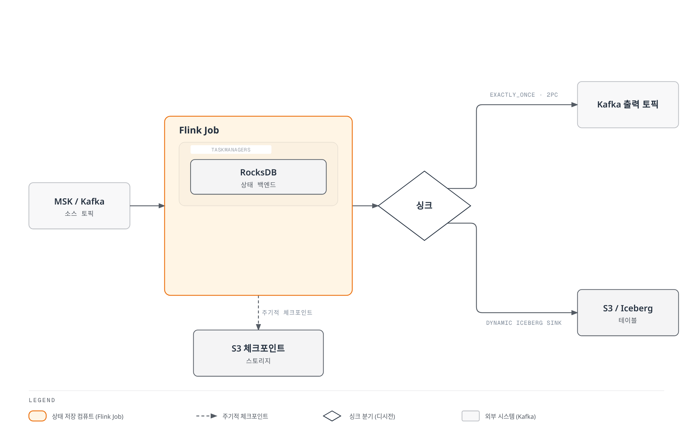

# Part 3: 상태 관리, 체크포인팅, 스트리밍 패턴

> **마지막 업데이트**: 2026년 7월 15일

## 상태 관리가 Flink에서 어려운 이유

상태가 없는(stateless) 스트림 처리는 레코드 하나를 변환해서 바로 흘려보내면 끝입니다. 기억할 것도, 잃을 것도 없습니다. 하지만 실제 운영되는 작업 대부분은 그렇게 단순하지 않습니다. 윈도우 집계는 현재 윈도우에 들어온 레코드를 전부 기억해야 하고, 조인은 한쪽 스트림을 기다리는 동안 다른 쪽 데이터를 붙잡고 있어야 하며, 중복 제거는 이미 처리한 키를 계속 추적해야 합니다. 이렇게 기억해 둔 데이터가 곧 **상태(state)**이고, 이 상태는 TaskManager 장애·Pod 축출·롤링 업그레이드를 거쳐도 결과가 깨지거나 데이터가 조용히 사라지지 않고 살아남아야 합니다. 이번 Part에서 다루는 상태 백엔드, 체크포인트, 세이브포인트, 정확히 한 번(exactly-once) 시맨틱 싱크는 모두 결국 하나의 질문에 답하기 위한 장치입니다 — 장애가 나도 처리 속도를 유지하면서 상태를 정확하게 지키려면 Flink는 무엇을 해야 하는가?

이 문서는 Part 2에서 다룬 Flink Kubernetes Operator를 통해 EKS에 이미 Flink 클러스터가 떠 있다고 가정합니다. 여기서 설명하는 내용은 그 클러스터 위에서 실제로 돌아가는 잡(job) 수준의 이야기입니다.

## 상태 백엔드: HashMap vs RocksDB

Flink는 오퍼레이터 상태를 **상태 백엔드**에 저장하며, 어떤 백엔드를 쓰느냐에 따라 상태가 물리적으로 어디에 저장되고 얼마나 커질 수 있는지가 결정됩니다.

| | HashMapStateBackend | EmbeddedRocksDBStateBackend |
| --- | --- | --- |
| **저장 위치** | 힙(JVM 힙 위의 객체) | 힙 밖 — TaskManager 슬롯마다 로컬 디스크에 스필되는 RocksDB 인스턴스 |
| **접근 속도** | 가장 빠름 — 순수 Java 객체 접근 | 상대적으로 느림 — 모든 읽기/쓰기가 RocksDB의 (역)직렬화 경로를 거침 |
| **상태 크기 한계** | 가용 힙 메모리에 제한됨 | 로컬 디스크 용량에 제한 — 메모리보다 훨씬 큰 상태도 가능 |
| **체크포인트 방식** | 전체(full) 체크포인트만 지원 | 증분(incremental) 체크포인트 지원 |
| **GC 부담** | 큼 — 상태가 커질수록 힙이 커지고 GC 정지 시간도 길어짐 | 작음 — 상태가 힙 밖에 있으므로 상태 크기와 무관하게 힙은 작게 유지됨 |
| **적합한 상황** | 상태가 작고 지연에 민감한 작업(단순 집계, 카디널리티 낮은 키) | 상태가 큰 작업(카디널리티 높은 키, 긴 윈도우, 대규모 조인) — 대규모 운영의 기본 선택 |

트레이드오프는 명확합니다. HashMapStateBackend는 상태가 순수 Java 객체로 힙에 존재하므로 연산당 속도는 더 빠르지만, 전체 상태 크기가 TaskManager의 메모리 예산 안에 여유 있게 들어와야만 이점이 유지됩니다. 키 개수가 수백만에 이르거나, 세션 윈도우가 넓거나, 스트림-스트림 조인 규모가 커지면 힙에 상태를 올려두는 방식은 JVM GC와 충돌하기 시작하고 결국 메모리가 부족해집니다. EmbeddedRocksDBStateBackend는 레코드 단위 지연을 조금 희생하는(RocksDB는 모든 키/값 접근에 직렬화를 거침) 대신 상태를 로컬 SSD로 스필할 수 있어 상태 크기가 더 이상 RAM에 갇히지 않습니다. TaskManager당 상태가 수백 MB를 넘어설 것으로 예상되는 작업이라면 RocksDB를 기본값으로 선택하는 것이 맞고, 상태가 작고 크기가 확실히 제한돼 있어 속도 이점이 메모리 상한을 감수할 만한 경우에만 HashMap을 유지하면 됩니다.

백엔드 선택은 설정 값 하나로 끝납니다.

```yaml
# flink-conf.yaml (또는 FlinkDeployment.spec.flinkConfiguration)
state.backend.type: rocksdb
execution.checkpointing.incremental: true
```

## 체크포인트: Flink가 장애에서 복구하는 방법

**체크포인트**는 잡이 실행되는 동안 일정 주기로 자동으로 찍히는, 모든 오퍼레이터 상태의 일관된 스냅숏입니다. TaskManager가 죽으면 JobManager는 영향받은 태스크를 재시작하고 가장 최근에 완료된 체크포인트에서 상태를 복원하므로, 처리는 처음부터가 아니라 일관성이 보장된 지점에서 다시 시작됩니다.

```yaml
execution.checkpointing.interval: 60s
execution.checkpointing.mode: EXACTLY_ONCE
execution.checkpointing.timeout: 10min
execution.checkpointing.min-pause: 30s
```

### 증분 체크포인트

`EmbeddedRocksDBStateBackend`를 쓰면 전체 체크포인트는 매번 모든 키의 현재 값을 다시 업로드한다는 뜻이라, 상태가 커지면 비용이 만만치 않습니다. 증분 체크포인트를 켜면 실제로 저장되는 대상이 바뀝니다.

```yaml
execution.checkpointing.incremental: true
```

전체 스냅숏 대신, 각 증분 체크포인트는 이전 체크포인트 이후 변경된 RocksDB SSTable 파일만 저장하고, 이전 체크포인트에서 만들어진 어떤 SSTable 파일들이 여전히 유효해서 전체 상태를 재구성할 때 필요한지 기록하는 매니페스트를 함께 남깁니다. 이는 체크포인트 시점의 네트워크·시간 비용과 복구 시점의 약간의 복잡성을 맞바꾸는 구조입니다.

* **체크포인트 비용 감소** — 델타만 전송되므로 체크포인트 소요 시간과 네트워크/스토리지 비용이 전체 상태 크기가 아니라 변경률에 비례합니다.
* **복구 비용은 이동** — 증분 체크포인트에서 복원하려면 현재 델타뿐 아니라 매니페스트가 여전히 참조하는 이전 파일들까지 모두 가져와야 하므로, 전체 체크포인트의 단일 스냅숏보다 개별 파일을 더 많이 가져오게 될 수 있습니다. 체크포인트 스토리지가 네트워크에 병목이 있는 경우(예: S3까지의 경로가 느린 경우) 복구가 전체 체크포인트보다 오히려 느려질 수 있습니다. 반대로 병목이 TaskManager의 CPU나 IOPS라면, 전체적으로 RocksDB에 다시 써 넣을 데이터가 적기 때문에 증분 체크포인트가 대체로 더 빨리 복구됩니다.

## 체크포인트 저장소 vs 세이브포인트

체크포인트와 세이브포인트는 모두 Flink의 파일시스템 기반 체크포인트 스토리지 백엔드를 통해 저장되며, EKS 환경에서는 거의 항상 S3를 사용합니다(AWS 밖에서는 HDFS, GCS, Azure Blob Storage가 동등한 역할을 합니다).

```yaml
execution.checkpointing.dir: s3://my-flink-checkpoints/checkpoints
execution.checkpointing.savepoint-dir: s3://my-flink-checkpoints/savepoints
```

저장 방식은 같지만 체크포인트와 세이브포인트는 목적이 다르며, 이름만 다른 같은 개념으로 취급하면 안 됩니다.

| | 체크포인트 | 세이브포인트 |
| --- | --- | --- |
| **트리거 주체** | Flink가 일정 주기로 자동 실행 | 사용자 또는 운영자가 명시적으로 실행 |
| **목적** | 장애 복구 | 계획된 업그레이드, 마이그레이션, 버전 업그레이드 |
| **라이프사이클** | Flink가 보존 정책을 관리하며 오래된 것은 자동 만료 | 수동으로 삭제하기 전까지 유지 — 영구적인 산출물로 취급 |
| **사용 주체** | 태스크 자동 재시작 | Flink Kubernetes Operator의 `last-state` 업그레이드 모드(Part 2), 또는 수동 `flink savepoint`/stop-with-savepoint |

Part 2에서 다룬 Operator의 `last-state` 업그레이드 모드는 실제로는 세이브포인트가 아니라 **가장 최근 체크포인트**에서 복원합니다. 그래서 빠르고 완전히 자동화될 수 있지만, 특정 잡 그래프에 묶이게 되는 대가가 있습니다. 반면 의도적인 버전 업그레이드, 스키마 변경, 다른 클러스터로의 마이그레이션을 계획한다면 먼저 명시적으로 세이브포인트를 찍어야 합니다.

```bash
kubectl exec -n flink deploy/order-events-processor -- \
  flink savepoint <job-id> s3://my-flink-checkpoints/savepoints
```

또는 Operator가 같은 목적으로 제공하는 `FlinkStateSnapshot` CRD를 사용하면, 명령형 CLI 호출 대신 잡의 나머지 쿠버네티스 매니페스트와 함께 세이브포인트 라이프사이클을 선언적으로 관리할 수 있습니다.

## Kafka로의 정확히 한 번(Exactly-Once) 전달

이 사이트의 [Kafka on EKS](../kafka/01-kafka-fundamentals.md) 섹션은 Kafka 자체의 내구성·파티셔닝 모델을 깊게 다룹니다. 이번 절은 Flink가 프로듀서 역할을 할 때 `KafkaSink`가 그 위에 정확히 한 번 시맨틱을 어떻게 얹는지를 다룹니다.

`DeliveryGuarantee.EXACTLY_ONCE`로 설정된 `KafkaSink`는 Kafka의 트랜잭션 프로듀서 API를 이용한 2단계 커밋(two-phase-commit, 2PC) 프로토콜을 사용하며, 이 프로토콜은 Flink 자체의 체크포인팅과 직접 맞물려 있습니다.

1. 체크포인트 사이에 **KafkaWriter**는 열려 있는 Kafka 트랜잭션 안에서 레코드를 씁니다 — 데이터는 브로커에 존재하지만, `isolation.level=read_committed`로 읽는 컨슈머에게는 아직 보이지 않습니다.
2. 잡 전체에 걸친 Flink 체크포인트가 성공적으로 완료되면, 그때서야 **KafkaCommitter**가 해당 Kafka 트랜잭션을 커밋합니다 — 이 시점에야 기록된 레코드가 다운스트림에 노출됩니다.
3. 체크포인트가 완료되기 전에 잡이 실패하면 Flink는 마지막 체크포인트에서 복원하고, 아직 커밋되지 않은 Kafka 트랜잭션은 중단(또는 타임아웃)되므로 부분적인 출력이 노출되는 일은 없습니다.

```java
KafkaSink<String> sink = KafkaSink.<String>builder()
    .setBootstrapServers("my-msk-cluster:9092")
    .setRecordSerializer(KafkaRecordSerializationSchema.builder()
        .setTopic("orders-enriched")
        .setValueSerializationSchema(new SimpleStringSchema())
        .build())
    .setDeliveryGuarantee(DeliveryGuarantee.EXACTLY_ONCE)
    .setTransactionalIdPrefix("orders-enrichment-job")
    .build();
```

`transactionalIdPrefix`는 안정적으로 고정해야 합니다. Flink는 각 서브태스크의 실제 트랜잭션 ID를 이 prefix로부터 파생시키는데, 복원 시점에 이전 실행에서 커미터가 만들었던 ID와 정확히 맞아떨어져야 장애로 열려 있던 트랜잭션을 올바르게 해소할 수 있습니다.

이 기능을 켜기 전에 짚어야 할 현실적인 함정이 두 가지 있습니다.

* **출력 지연**: Kafka 트랜잭션은 이를 감싸는 Flink 체크포인트가 완료돼야 커밋되므로, `read_committed`로 읽는 다운스트림 컨슈머는 대략 체크포인트 주기만큼 늦게 결과를 보게 됩니다. 체크포인트 주기가 60초라면 종단 간 지연이 최대 60초 정도 추가된다는 뜻입니다.
* **트랜잭션 코디네이터 부담**: 이 지연을 줄이려고 체크포인트 주기를 짧게 잡으면 Kafka 쪽에 대가가 따릅니다. 체크포인트 주기마다 싱크 서브태스크별로 새 트랜잭션이 열리는데, 병렬 서브태스크가 많은 상태에서 체크포인트 주기를 몇 초 단위로 줄이면 브로커의 트랜잭션 코디네이터가 추적해야 하는 트랜잭션 ID가 넘쳐날 수 있습니다. 체크포인트 주기는 순수하게 복구 속도만 보고 정할 게 아니라, 허용 가능한 출력 지연과 코디네이터 부담 사이의 균형으로 조정해야 합니다.

## 스트리밍 패턴: Kafka에서 S3/Iceberg로

이 사이트에서 EKS의 Kafka와 가장 흔하게 짝을 이루는 패턴은 MSK에서 Flink를 거쳐 다운스트림 분석용으로 S3 위의 Apache Iceberg 테이블에 데이터를 적재하는 것입니다.



### Dynamic Iceberg Sink

2025년 11월 Iceberg Flink 커넥터에 추가된 Dynamic Iceberg Sink는 기존 Iceberg 싱크를 확장해 **하나의 싱크에서 여러 Iceberg 테이블에 쓸 수** 있게 해줍니다. 각 레코드마다 대상 테이블을 선택하고, 레코드 내용이 요구하는 대로 각 테이블의 스키마를 자동으로 진화시킵니다. 개념적으로는 다음과 같습니다.

```java
// 예시 코드 — 각 레코드의 대상 테이블/스키마는 잡 그래프 구성 시점이 아니라
// 런타임에 레코드 내용으로부터 결정됩니다.
DynamicIcebergSink.forRecords(stream)
    .withTableIdentifierSelector(record -> record.getTargetTable())
    .withSchemaEvolutionEnabled(true)
    .build();
```

이 기능은 CDC 팬아웃에 특히 잘 맞습니다. Debezium 소스 기반의 Kafka 토픽 하나(또는 소스 테이블별 토픽)에 여러 소스 테이블의 insert/update/delete가 섞여 들어와도, 레코드별로 맞는 Iceberg 테이블로 라우팅하고 상류 스키마가 바뀌면 새 컬럼을 자동으로 반영할 수 있어 테이블마다 별도 싱크를 손으로 관리할 필요가 없습니다.

### Flink가 꼭 필요하지 않은 경우

MSK의 데이터를 S3 위의 Iceberg로 옮기는 방법이 Flink만 있는 것은 아니며, Flink의 프로그래밍 유연성이 그만큼의 운영 비용을 감당할 가치가 있는지 의식적으로 판단해야 합니다.

* **MSK → Data Firehose → S3 Tables/Iceberg**: 완전관리형이고 코드가 필요 없는 경로입니다. Firehose는 기본적인 포맷 변환과 버퍼링만으로 S3 Tables(Iceberg 기반)에 직접 쓸 수 있어, 별도로 운영할 클러스터가 전혀 없습니다.
* **MSK Connect + Iceberg 싱크 커넥터**: 관리형 MSK Connect 위에서 동작하는 Kafka Connect 커넥터가 토픽 데이터를 Iceberg 테이블에 바로 씁니다. 범용 스트림 프로세서 없이 커넥터 수준의 설정만으로 충분합니다.
* **Flink on EKS**: 조인, 윈도우 집계, 레코드별 라우팅 로직, 복잡한 이벤트 타임 처리, 앞서 설명한 동적 멀티 테이블 팬아웃처럼 실제 연산이 필요할 때 선택합니다. 파이프라인이 단순 패스스루이거나 포맷 변환 정도라면 Firehose나 MSK Connect 파이프라인이 구축·운영 부담이 훨씬 적습니다.

## Flink SQL/Table API vs DataStream API

Flink는 두 가지 서로 다른 프로그래밍 표면을 제공하며, 처음부터 적절한 쪽을 고르면 나중에 잡을 다시 작성하는 일을 피할 수 있습니다.

| | Flink SQL / Table API | DataStream API |
| --- | --- | --- |
| **적합한 용도** | SQL로 표현 가능한 일반적인 ETL, 집계, 윈도우, 조인 | 커스텀 오퍼레이터, 복잡한 이벤트 타임/상태 로직, 세밀한 제어 |
| **코드량** | 적음 — 선언적 쿼리 | 많음 — Java/Python/Scala로 명시적인 오퍼레이터 체인 작성 |
| **내장 커넥터** | Kafka, Iceberg, JDBC 등이 SQL 커넥터로 기본 제공 | 같은 커넥터를 사용할 수 있지만 명령형으로 직접 연결해야 함 |
| **내부 동작 제어** | 제한적 — 플래너가 오퍼레이터 동작을 결정 | 체크포인트 배리어, 백프레셔 처리, 커스텀 상태 접근까지 완전한 제어 |
| **권장 시작점** | 대부분의 작업에서 Yes | SQL/Table API로 표현이 안 될 때만 |

단순한 윈도우 집계는 SQL로 쓰면 실제로 코드가 훨씬 짧습니다.

```sql
SELECT
  window_start,
  window_end,
  customer_id,
  SUM(amount) AS total_amount
FROM TABLE(
  TUMBLE(TABLE orders, DESCRIPTOR(event_time), INTERVAL '1' MINUTE))
GROUP BY window_start, window_end, customer_id;
```

같은 로직을 DataStream API로 작성하려면 명시적인 `KeyedStream`, 윈도우 호출, 커스텀 집계 함수가 필요합니다 — 코드는 더 많아지지만, 체크포인트 정렬을 수동으로 제어하거나 커스텀 상태를 다루는 오퍼레이터를 직접 작성해야 하는 등 Table API 플래너가 노출하지 않는 무언가가 필요해지는 순간부터는 필수적인 선택이 됩니다.

## 윈도우와 워터마크

두 API 모두 같은 이벤트 타임 모델 위에서 동작합니다. 모든 레코드는 이벤트 타임 타임스탬프를 가지고 있고, **워터마크**는 스트림에 주기적으로 삽입되는 일종의 휴리스틱 신호로, "이 워터마크보다 오래된 타임스탬프를 가진 레코드는 더 이상 오지 않는다"는 것을 알려줍니다. 윈도우는 이 워터마크를 기준으로 언제 결과를 안전하게 닫고 내보낼지 판단합니다. 벽시계(처리) 시간에만 의존하면 컨슈머가 지연되거나 과거 데이터를 재처리할 때 결과가 일관되지 않을 수 있기 때문입니다.

표준 윈도우 유형은 대부분의 사용 사례를 다룹니다.

* **텀블링(Tumbling) 윈도우**: 고정 크기, 겹치지 않음(예: "1분 단위 구간").
* **슬라이딩(Sliding) 윈도우**: 고정 크기지만 더 작은 스텝으로 겹침(예: "최근 5분을 1분마다 다시 계산").
* **세션(Session) 윈도우**: 크기가 동적으로 결정되며, 설정된 타임아웃보다 긴 비활성 구간이 지나면 닫힘 — 고정된 윈도우 경계 없이 키별로 활동이 몰리는 구간(예: 사용자 세션)을 묶는 데 유용합니다.

늦게 도착한 데이터 — 이미 워터마크가 지나간 윈도우에 도착한 레코드 — 는 설정된 `allowedLateness`에 따라 버려지거나 별도 처리를 위한 **사이드 출력(side output)**으로 라우팅됩니다.

## 실습 환경 준비

이번 Part의 패턴을 따라 해보려면 다음이 필요합니다.

* Part 2에서 사용한 EKS 클러스터에 대한 `kubectl` 접근 권한 — Flink Kubernetes Operator가 설치되어 있고 `FlinkDeployment`/`FlinkSessionJob`이 이미 실행 중이어야 합니다.
* 체크포인트·세이브포인트 저장용 S3 버킷, 그리고 Flink 잡의 IRSA 역할에 해당 버킷에 대한 `s3:PutObject`/`s3:GetObject`/`s3:ListBucket` 권한:

```bash
aws s3 mb s3://my-flink-checkpoints --region us-east-1
```

* (선택) Flink 잡의 VPC/서브넷에서 접근 가능한 MSK 클러스터 — 위 정확히 한 번 예제의 소스/싱크로 사용할 토픽이 미리 생성돼 있어야 합니다.

```bash
kubectl get flinkdeployment -n flink
kubectl logs -n flink deploy/order-events-processor
```

## 다음 단계

이번 Part에서는 Flink가 상태를 정확하고 복구 가능하게 유지하는 방법 — 상태 백엔드, 체크포인트와 세이브포인트의 구분, Kafka로의 정확히 한 번 전달, MSK와 S3의 Iceberg를 잇는 스트리밍 패턴 — 을 다뤘습니다. 이 시리즈의 다음 Part는 잡 수준의 관심사에서 클러스터 수준의 운영으로 넘어가, EKS에서 Flink를 프로덕션으로 운영할 때의 모니터링과 스케일링을 다룹니다.

[메인 페이지로 돌아가기](./README.md)

## 퀴즈

이 장에서 배운 내용을 테스트하려면 [주제 퀴즈](../../quizzes/data-on-eks/flink/03-state-checkpointing-streaming-quiz.md)를 풀어보세요.
