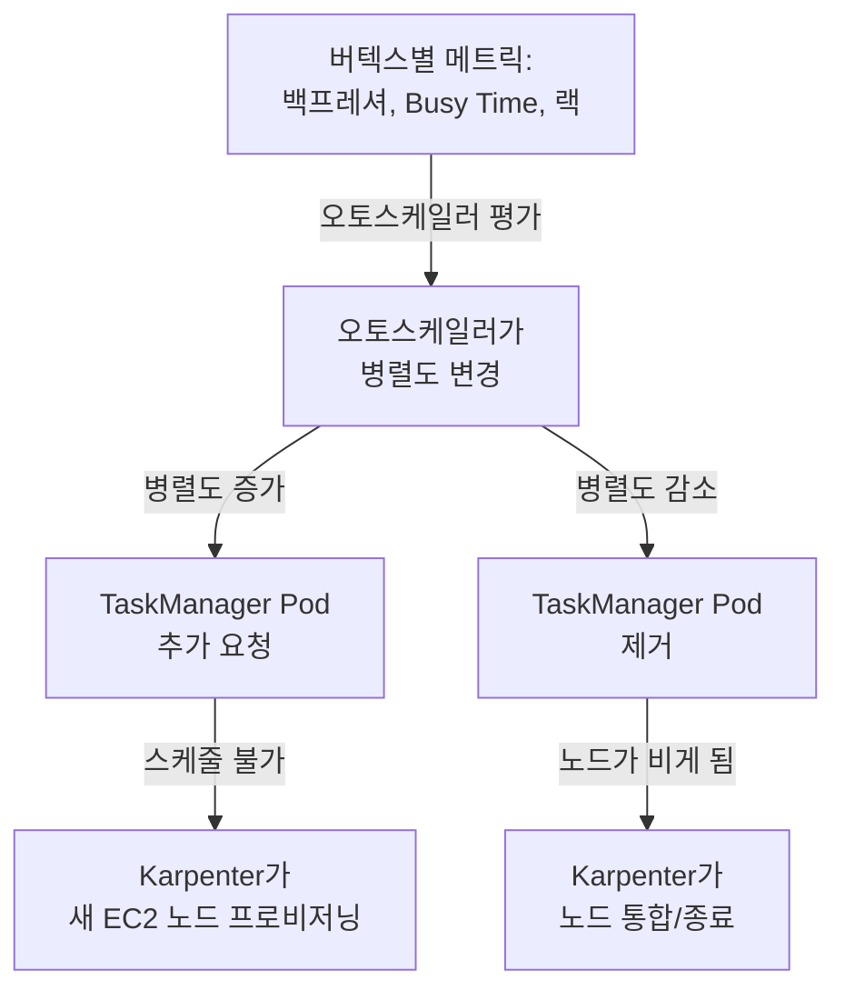

# Part 4: 운영, 고가용성, 그리고 매니지드 Flink

> **마지막 업데이트**: 2026년 7월 15일

Part 1~3에서는 Kubernetes 위에서의 Flink 아키텍처, Flink Kubernetes Operator 설치 및 운영, 상태 백엔드 선택과 체크포인트 튜닝을 다뤘습니다. 이번 마지막 Part에서는 이 구성을 실제 프로덕션에서 운영하는 데 필요한 것들을 다룹니다. JobManager와 TaskManager가 노출하는 메트릭을 수집하는 방법, TaskManager Pod의 메모리가 실제로 어디에 쓰이는지, Zookeeper 없이 Kubernetes 네이티브 고가용성(HA)을 구성하는 방법, 그리고 Flink Operator의 오토스케일러와 Karpenter의 노드 단위 오토스케일링을 함께 조율하는 방법까지 살펴봅니다. 마지막으로는 Part 1~4에서 다룬 모든 것에 대한 완전관리형 대안인 Amazon Managed Service for Apache Flink와의 비교, 그리고 시리즈 전체를 정리하는 체크리스트로 마무리합니다.

## 실습 환경 설정

이 문서의 예제를 따라하기 위해서는 다음과 같은 도구와 환경이 필요합니다:

### 필수 도구

* kubectl v1.28 이상, 작동하는 EKS 클러스터
* 클러스터에 설치된 Flink Kubernetes Operator (Part 2)
* [Karpenter](../../autoscaling/02-karpenter.md) 설치 및 최소 1개 이상의 `NodePool`/`EC2NodeClass` 구성
* 스크레이핑과 알림을 위한 Prometheus Operator (kube-prometheus-stack)
* AWS CLI v2 (5절의 Amazon Managed Service for Apache Flink 비교 실습에만 필요)

## 1. 모니터링: Prometheus와 RocksDB 메트릭

Flink에 내장된 **Prometheus 리포터**는 JobManager와 TaskManager의 메트릭을 노출하는 표준 방법으로, `flink-conf.yaml`(또는 `FlinkDeployment` CR의 `flinkConfiguration` 블록)에서 `metrics.reporter.prom.factory.class`로 설정합니다.

```yaml
# FlinkDeployment CR의 flinkConfiguration 블록 (Part 2)
metrics.reporter.prom.factory.class: org.apache.flink.metrics.prometheus.PrometheusReporterFactory
metrics.reporter.prom.port: "9249-9250"
```

이 설정을 적용하면 모든 JobManager/TaskManager Pod가 `/metrics` 엔드포인트를 노출하며, `PodMonitor`로 스크레이핑할 수 있습니다 — 이 시리즈의 다른 문서에서 Strimzi 기반 Kafka 브로커에 적용한 것과 동일한 패턴입니다. Part 2에서 다룬 Flink Kubernetes Operator 1.15 릴리스부터는 Operator 자체의 Helm 차트에도 `flink-metrics-dropwizard` 리포터가 함께 포함되어, Operator가 관리하는 잡뿐 아니라 **Operator 자신의 reconciliation 메트릭**도 별도 설치 없이 동일한 방식으로 스크레이핑할 수 있습니다.

```yaml
apiVersion: monitoring.coreos.com/v1
kind: PodMonitor
metadata:
  name: flink-metrics
  namespace: flink
spec:
  selector:
    matchLabels:
      app.kubernetes.io/managed-by: flink-kubernetes-operator
  namespaceSelector:
    matchNames:
      - flink
  podMetricsEndpoints:
    - port: metrics
      path: /metrics
      interval: 30s
```

### 대규모 상태 작업을 위한 RocksDB 메트릭

Part 3에서 다룬 RocksDB 상태 백엔드를 사용하는 작업의 경우, 표준 Prometheus 리포터만으로는 체크포인트나 상태 접근이 왜 느려지는지 알기 어렵습니다 — 그 이유를 파악하려면 RocksDB 내부 지표가 필요합니다. `state.backend.rocksdb.metrics.*` 계열 옵션들은 이런 지표를 항목별로 opt-in 방식으로 노출하는데, 전부 활성화하면 그만큼 CPU 비용이 든다는 점 때문에 개별적으로 켜도록 설계되어 있습니다.

```yaml
state.backend.rocksdb.metrics.block-cache-usage: "true"
state.backend.rocksdb.metrics.num-running-compactions: "true"
state.backend.rocksdb.metrics.compaction-pending: "true"
```

* **블록 캐시 사용률** — RocksDB의 인메모리 블록 캐시가 얼마나 차 있는지를 나타냅니다. 캐시가 계속 가득 차서 항목이 밀려나면 더 많은 읽기가 디스크까지 내려가야 하므로 상태 접근 지연이 직접적으로 늘어납니다.
* **컴팩션 통계** (`num-running-compactions`, `compaction-pending`) — RocksDB는 백그라운드에서 주기적으로 SST 파일을 병합(컴팩션)합니다. 쓰기 속도를 컴팩션이 따라가지 못하면 읽기 증폭이 커지고 체크포인트 소요 시간도 길어집니다.

이 지표들은 특히 **대규모 상태 작업**에서 중요합니다 — Part 3의 상태 백엔드 논의에서 RocksDB를 힙 상태 백엔드보다 우선 권장했던 바로 그 지점입니다. 상태가 작아 힙에 충분히 올라가는 작업이라면 이 정도 수준의 가시성이 필요 없지만, TaskManager당 수백 GB의 키드 상태를 다루는 작업이라면 필수적입니다.

### 대시보드 패널 구성

이 두 메트릭 소스를 기반으로 한 Flink 대시보드는 최소한 다음을 포함해야 합니다:

* **잡 헬스**: 잡/태스크 재시작 횟수, 최근 체크포인트 소요 시간과 크기, 체크포인트 실패율
* **처리량과 백프레셔**: 버텍스별 초당 레코드 인/아웃, Busy Time 비율, 백프레셔 비율 (4절의 오토스케일러가 참조하는 것과 동일한 신호)
* **RocksDB 내부 지표**: 블록 캐시 사용률, 실행 중인 컴팩션 수, 컴팩션 대기 여부 — 체크포인트 소요 시간 급증과의 상관관계 확인
* **리소스 압박**: TaskManager별 JVM 힙/매니지드 메모리 사용률, GC 정지 시간, 네트워크 버퍼 여유분

## 2. TaskManager 메모리 모델

각 TaskManager Pod의 전체 메모리 크기는 `taskmanager.memory.process.size`로 결정되며, Flink는 이를 네 가지 구조적 영역으로 나눕니다. 이 모델 자체는 2.x 라인 전체에서 아키텍처적으로 변하지 않았고, 워크로드에 맞춰 조정하는 것은 그 안의 비율뿐입니다.

| 영역 | 용도 |
| --- | --- |
| **JVM 힙** | 일반적인 Java 객체 할당 영역 — 사용자 코드, Flink 런타임 자체의 데이터 구조, (힙 상태 백엔드를 쓰는 경우) 키드 상태 자체 |
| **매니지드 메모리** | JVM 가비지 컬렉터에 맡기지 않고 Flink가 직접 관리하는 오프힙 메모리 — RocksDB의 블록 캐시/쓰기 버퍼, 배치 연산자의 정렬/조인 버퍼가 여기서 쓰입니다 |
| **네트워크 버퍼** | 서브태스크 간 레코드를 셔플링(네트워크 전송 또는 Pod 내부의 로컬 서브태스크 간 전달)하기 위해 예약된 메모리 |
| **JVM 오버헤드** | JVM 힙 계산에 포함되지 않는 JVM 내부적인 필요 영역 — 스레드 스택, 클래스 메타데이터, 코드 캐시 등 |

이 구조에서 실무적으로 중요한 점은 **RocksDB가 JVM 힙이 아니라 네트워크 셔플과 같은 오프힙 "매니지드 메모리" 풀을 두고 경쟁한다는 것**입니다. `taskmanager.memory.managed.fraction`을 늘리면 RocksDB가 쓸 수 있는 블록 캐시가 커져 1절의 컴팩션/캐시 지표에는 도움이 되지만, 같은 잡 그래프 안의 셔플이 많은 연산자가 쓸 수 있는 여유는 줄어듭니다. 정답이 되는 단일 비율은 없습니다 — 해당 작업이 상태 중심의 스트리밍 작업에 가까운지(매니지드 메모리 우선), 셔플이 많은 배치/윈도우 작업에 가까운지(네트워크 버퍼 우선)에 따라 달라지며, 어느 방향으로 조정할지는 결국 1절의 RocksDB 지표를 보며 판단해야 합니다.

## 3. Zookeeper 없는 고가용성

**FLIP-144**로 정의되고 **Flink 1.12부터** 제공된 Kubernetes 네이티브 HA는, 2026년 현재 네이티브 Kubernetes 배포와 (Part 1에서 다룬) 레거시 standalone-on-Kubernetes 방식 모두에 대해 기본이자 유일하게 권장되는 HA 경로입니다. 기존에 Flink가 의존했던 Zookeeper 기반 HA 서비스를, 이미 Kubernetes에 내장된 두 가지 요소로 대체합니다.

* **Kubernetes 리더 선출(leader-election) API** — 다른 Kubernetes 컨트롤러들이 사용하는 것과 동일한 리더 선출 프리미티브로, 현재 어떤 JobManager 레플리카가 활성 상태인지 결정합니다.
* **ConfigMap** — 활성 리더의 주소(다른 컴포넌트가 찾을 수 있도록)와, 장애 복구(failover) 시 새 리더가 잡을 복구하는 데 필요한 클러스터 HA 메타데이터(JobGraph 저장소, 체크포인트 포인터)를 저장합니다.

외부 Zookeeper 앙상블을 배포하거나 업그레이드하거나 백업할 필요가 전혀 없습니다. 활성화는 Part 2의 `FlinkDeployment` CR에서 `flinkConfiguration`을 다음과 같이 바꾸는 것으로 끝납니다.

```yaml
# FlinkDeployment CR의 flinkConfiguration 블록
high-availability.type: kubernetes
high-availability.storageDir: s3://my-flink-bucket/ha/
kubernetes.cluster-id: my-flink-cluster
```

### RBAC: ServiceAccount에 필요한 ConfigMap 권한

Flink의 JobManager 프로세스가 리더 선출과 HA 메타데이터 읽기/쓰기를 위해 Kubernetes API를 직접 호출하기 때문에, JobManager Pod가 사용하는 `ServiceAccount`에는 자신의 네임스페이스 안에서 `ConfigMap`을 생성·조회·수정·삭제할 수 있는 권한이 필요합니다 — 그 이상의 권한은 필요하지 않습니다.

```yaml
apiVersion: rbac.authorization.k8s.io/v1
kind: Role
metadata:
  name: flink-ha-role
  namespace: flink
rules:
  - apiGroups: [""]
    resources: ["configmaps"]
    verbs: ["get", "list", "watch", "create", "update", "patch", "delete"]
---
apiVersion: rbac.authorization.k8s.io/v1
kind: RoleBinding
metadata:
  name: flink-ha-rolebinding
  namespace: flink
subjects:
  - kind: ServiceAccount
    name: flink
    namespace: flink
roleRef:
  kind: Role
  name: flink-ha-role
  apiGroup: rbac.authorization.k8s.io
```

이 Role이 JobManager의 `ServiceAccount`에 바인딩되어 있지 않으면, JobManager가 리더 ConfigMap을 쓰려는 시점에 HA 구성이 조용히 실패합니다 — Pod는 정상적으로 뜨지만 리더 선출과 장애 복구가 실제로는 전혀 동작하지 않으며, 실제 JobManager 장애가 처음 발생하기 전까지는 이 문제를 놓치기 쉽습니다.

처음 구성할 때 놓치기 쉬운 부분이 두 가지 있습니다.

* **`high-availability.storageDir`은 반드시 내구성 있는 공유 스토리지(위 예시의 S3)를 가리켜야 합니다.** 새 리더가 될 수 있는 어떤 Pod에서도 접근 가능해야 하며, 실제 JobGraph와 체크포인트 포인터가 저장되는 곳은 바로 여기입니다 — ConfigMap은 이 위치와 리더 주소에 대한 포인터만 담고 있습니다.
* **기존 Zookeeper 기반 HA와 달리, 별도로 크기를 결정해야 할 쿼럼 앙상블이 없습니다.** 이는 Kubernetes 자체의 리더 선출 API가 대신 처리합니다. 대신 여전히 직접 결정해야 하는 것은 `FlinkDeployment`가 실행하는 JobManager **레플리카 수**입니다 — 2개 이상을 실행하면 장애 복구 시 즉시 넘겨받을 수 있는 웜 스탠바이가 준비되어, Kubernetes가 단일 JobManager Pod를 처음부터 다시 스케줄링하기를 기다릴 필요가 없습니다.

## 4. 2단계 오토스케일링: Flink 오토스케일러와 Karpenter

Flink Kubernetes Operator에 내장된 오토스케일러(Part 2)와 Karpenter는, 이 시리즈의 Spark 딥다이브에서 Karpenter와 Dynamic Resource Allocation(DRA)의 관계를 설명한 것과 같은 방식으로 **서로 다른 신호에 반응하는 두 개의 독립적이지만 맞물린 제어 루프**를 형성합니다.

* **Flink 오토스케일러**는 버텍스별 메트릭(백프레셔, Busy Time, 랙)을 관찰해 잡 그래프 안의 각 연산자에 필요한 **병렬도(parallelism)**를 결정합니다 — 이는 하위 노드에 대한 정보가 전혀 없는, 잡 내부의 판단입니다.
* **Karpenter**는 스케줄링되지 못한 TaskManager Pod(또는 비어버린 노드)를 관찰해 EC2 용량을 프로비저닝하거나 회수할지 결정합니다 — 이는 그 Pod들이 왜 존재하는지는 전혀 모르고, 단지 존재한다는 사실에만 반응하는 노드 단위의 판단입니다.



잡 단위 판단(병렬도)이 항상 먼저 일어나고, 노드 단위 판단(EC2 용량)은 그 결과 — Pending 상태이거나 비어버린 Pod — 에만 반응합니다. 한쪽 루프만 튜닝하면 Spark 성능 튜닝 문서에서 경고하는 것과 같은 종류의 불일치가 생깁니다. Flink 오토스케일러가 병렬도를 Karpenter의 [`NodePool`](../../autoscaling/02-karpenter.md#nodepool)이 맞는 노드를 프로비저닝할 수 있는 속도보다 빠르게 늘리면, 새 TaskManager Pod가 예상보다 오래 `Pending` 상태로 머물면서 오히려 오토스케일러가 유발한 스케일 업 자체를 지연시킵니다. 반대로 Karpenter의 노드 통합(consolidation) 지연 시간을 오토스케일러 자체의 안정화 구간보다 충분히 길게 유지해야, Karpenter가 오토스케일러가 곧 다시 필요로 할 노드를 미리 회수해버리는 문제를 막을 수 있습니다.

## 5. Amazon Managed Service for Apache Flink

**Amazon Managed Service for Apache Flink**(과거 Kinesis Data Analytics for Apache Flink의 후속 브랜드)는 Part 1~4에서 다룬 모든 것에 대한 AWS의 완전관리형 서버리스 대안입니다. 클러스터나 호스트, Kubernetes 오브젝트를 전혀 프로비저닝할 필요가 없고, 3절에서 RBAC Role까지 만들어 직접 해결했던 JobManager 고가용성도 AWS가 여러 가용 영역에 걸쳐 자동으로 관리합니다. 2026년 3월부터는 **Flink 2.2**, **Java 17**, **RocksDB 8.10.0**을 지원하기 시작하여, 이 시리즈가 다루는 업스트림 2.x 라인과 크게 어긋나지 않는 수준을 유지하고 있습니다.

| 항목 | Amazon Managed Service for Apache Flink | 셀프 매니지드 (EKS + Flink Kubernetes Operator, Part 1~4) |
| --- | --- | --- |
| **운영 부담** | 완전관리형 서버리스 — 클러스터, 호스트, Kubernetes 오브젝트 없음 | Operator, HA 구성(3절), 모니터링(1절)을 직접 소유 — Operator가 reconciliation은 자동화하지만 그 판단 자체는 대신하지 않음 |
| **고가용성** | AWS가 여러 AZ에 걸쳐 JobManager HA를 자동으로 관리 | Kubernetes 네이티브 HA(3절) — RBAC Role과 `flinkConfiguration`을 직접 구성 |
| **오토스케일링** | 서비스 내부에서 자동 관리 | Flink 오토스케일러 + Karpenter의 2단계 스택(4절)을 직접 튜닝 |
| **비용 모델** | 실행 중인 KPU(Kinesis Processing Unit) 기준의 사용량 기반 과금, 단순함 | EC2/EBS 직접 비용 — Spot Instance로 실질적인 절감이 가능하지만 Part 2에서 다룬 운영 역량이 필요 |
| **버전 지원** | AWS가 큐레이션한 버전 목록 (2026년 3월 기준 Flink 2.2, Java 17, RocksDB 8.10.0) | Flink Kubernetes Operator가 지원하는 범위 내에서 업스트림이 릴리스하는 시점에 원하는 버전 채택 |
| **플랫폼 통합** | 별도로 관리되는 독립적인 AWS 서비스 화면 | 클러스터의 다른 워크로드와 동일한 EKS/GitOps/관측 파이프라인으로 운영 |

### Amazon Managed Service for Apache Flink를 선택하는 이유

* Operator 업그레이드, HA 구성, 노드 풀 튜닝 없이 인프라 운영 부담을 완전히 없애고 싶은 경우
* 세밀한 비용 통제보다 단순한 사용량 기반 과금이 팀에 더 큰 가치가 있는 경우
* 아직 EKS에서 다른 워크로드를 운영하고 있지 않아, 편입시킬 만한 공유 운영 모델 자체가 없는 경우

### 그럼에도 EKS에서 Flink를 직접 운영하는 이유

* **Spot Instance를 통한 비용 통제**가 규모상 중요한 경우 — AWS는 EC2 Spot Instance로 Flink-on-EKS 비용을 최적화하는 방법에 대한 가이드를 별도로 공개했으며, KPU 단위로 과금되는 완전관리형 서비스에서는 이런 레버 자체를 쓸 수 없습니다
* **세밀한 오토스케일러 튜닝**이 필요한 경우 — 4절의 2단계 스택은 잡 단위 병렬도 판단과 노드 단위 용량 판단을 모두 직접 제어할 수 있게 해주며, 블랙박스에 맡기지 않아도 됩니다
* **플랫폼 일관성**이 중요한 경우 — 이 Data on EKS 시리즈의 다른 문서에서 다룬 것처럼 이미 Strimzi로 Kafka-on-EKS를 운영하는 조직이라면, Flink만을 위한 별도의 AWS 콘솔/과금 화면 대신 동일한 GitOps 파이프라인, 동일한 Prometheus/Grafana 스택, 동일한 온콜 대응 절차라는 하나의 일관된 운영 모델을 유지할 수 있습니다

이 시리즈의 다른 문서에서 다룬 MSK vs 셀프 매니지드 Kafka와 마찬가지로, 두 선택은 조직 전체 관점에서 상호 배타적이지 않습니다 — 신규 파이프라인은 매니지드 서비스로 빠르게 시작하고, 오토스케일러 튜닝이나 Spot 비용 절감이 운영 투자를 정당화할 만큼 커지는 시점에 EKS로 이전하는 것도 합리적인 경로입니다.

### 의사결정 가이드

* **Operator나 노드 풀 관리 없이 인프라 운영을 완전히 없애고 싶은가?** → 예: Amazon Managed Service for Apache Flink / 아니오: EKS + Flink Kubernetes Operator 검토 가능
* **Spot Instance를 통한 비용 통제가 규모상 중요한가?** → 예: EKS 셀프 매니지드 / 아니오: 매니지드 서비스의 사용량 기반 과금이 더 단순함
* **4절에서 다룬 오토스케일러와 노드 프로비저닝 동작을 세밀하게 제어해야 하는가?** → 예: EKS 셀프 매니지드 / 아니오: 매니지드 서비스가 내부적으로 처리하도록 맡김
* **이미 다른 스트림 처리 워크로드(예: Strimzi 기반 Kafka-on-EKS)를 동일한 GitOps/관측 파이프라인으로 운영하고 있는가?** → 예: 하나의 일관된 운영 모델을 위해 EKS 셀프 매니지드 / 아니오: Flink만을 위해 별도의 EKS 운영을 늘리지 않는 매니지드 서비스

## 6. 마무리: Flink on EKS 시리즈 정리

Part 1~4에 걸쳐 이 시리즈는 Flink의 JobManager/TaskManager 아키텍처와 배포 모드(Part 1), Flink Kubernetes Operator 설치와 운영(Part 2), 상태 백엔드 선택과 체크포인트 튜닝(Part 3), 그리고 이번 Part의 운영 주제들 — 모니터링, 메모리, HA, 오토스케일링, 매니지드 서비스 대안 — 을 다뤘습니다. 이를 하나의 프로덕션 준비 체크리스트로 정리하면 다음과 같습니다.

- [ ] **배포 모드**: 프로덕션 잡은 기본값인 Application Mode를 사용하고, Session Mode는 단기/애드혹 워크로드에만 사용 (Part 1)
- [ ] **상태 백엔드**: RocksDB와 힙 상태 백엔드 중 상태 크기를 기준으로 의도적으로 선택했는가, 기본값을 그대로 두지 않았는가 (Part 3)
- [ ] **체크포인트 간격**: 잡의 실제 상태 크기와 복구 목표 시간(RTO)에 맞춰 튜닝했는가, 일반적인 기본값을 그대로 두지 않았는가 (Part 3)
- [ ] **메트릭**: 모든 `FlinkDeployment`에 Prometheus 리포터가 활성화되어 있고, RocksDB 상태를 사용하는 잡에는 RocksDB 메트릭도 활성화되어 있는가 (Part 4)
- [ ] **메모리 모델**: 작업이 상태 중심인지 셔플 중심인지에 따라 `taskmanager.memory.managed.fraction`을 검토했는가, 기본 비율을 그대로 두지 않았는가 (Part 4)
- [ ] **고가용성**: `high-availability.type: kubernetes`가 설정되어 있고, JobManager의 `ServiceAccount`에 ConfigMap `create`/`update`/`delete` 권한을 부여하는 RBAC Role이 바인딩되어 있는가 (Part 4)
- [ ] **오토스케일러 구성**: Flink 오토스케일러의 스케일 업/다운 동작과 Karpenter `NodePool`의 통합(consolidation) 설정을 독립적이 아니라 함께 튜닝했는가 (Part 4)
- [ ] **매니지드 vs 셀프 매니지드 결정**: Amazon Managed Service for Apache Flink와 EKS 셀프 매니지드 중 선택한 근거(비용, 운영)를 문서화했는가 (Part 4)
- [ ] **부하 테스트**: 오토스케일러 동작과 체크포인트 소요 시간을 예상 피크 병렬도에서 추정만이 아니라 실제로 관찰했는가

이 체크리스트를 만족한다면 EKS에서 Flink 배포를 프로덕션에 투입할 준비가 되었다고 볼 수 있는 합리적인 기준입니다.

---

[메인 페이지로 돌아가기](./)

## 퀴즈

이 장에서 배운 내용을 테스트하려면 [주제 퀴즈](../../quizzes/data-on-eks/flink/04-operations-ha-quiz.md)를 풀어보세요.
