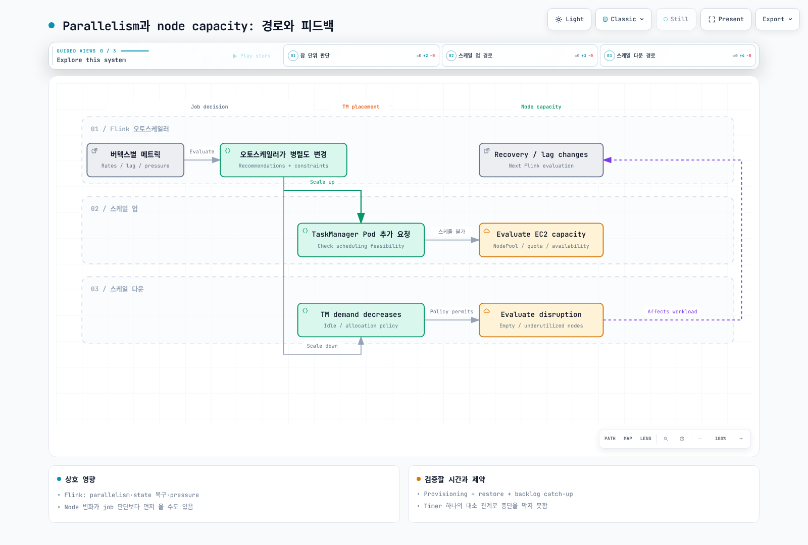

# Part 4: 운영, 고가용성과 관리형 Flink

> 검토: 2026-09-12. 자체 운영 예제는 Flink 2.2.1 / Operator 1.15.0; 관리형 비교는 AWS의 Flink 2.3 지원 문서 기준입니다.

Part 3의 stateful 배포에 관측과 HA를 연결하고, 실제 장애·복구와 용량을 검증합니다.
Karpenter를 반드시 사용해야 하는 것은 아니며, 기존 node capacity 운영 방식을
같이 점검합니다. Prometheus Operator와 이를 선택하는 Prometheus 설정은 준비되어
있다고 가정합니다.

## 1. Reporter·Pod port·PodMonitor를 함께 연결

Reporter 설정만으로 Prometheus 수집 경로가 완성되지 않습니다.
필요한 JAR, 고정된 listening port, Pod의 named container port, selector와 namespace,
Prometheus가 PodMonitor를 선택하는 설정이 모두 맞아야 합니다.

아래는 **Part 3의 전체 CR spec에 병합할 필드**입니다. 기존 S3 plugin·volume 설정을
유지하면서 Prometheus plugin을 함께 활성화합니다. 일반적인 서로 다른 Pod IP에서는
JM/TM에 같은 9249를 쓸 수 있습니다. Host networking이나 여러 reporter를 같은 Pod에서
쓰면 포트 충돌과 discovery를 별도로 설계합니다.

```yaml
flinkConfiguration:
  metrics.reporter.prom.factory.class: org.apache.flink.metrics.prometheus.PrometheusReporterFactory
  metrics.reporter.prom.port: '9249'
  state.backend.rocksdb.metrics.block-cache-usage: 'true'
  state.backend.rocksdb.metrics.block-cache-capacity: 'true'
  state.backend.rocksdb.metrics.num-running-compactions: 'true'
  state.backend.rocksdb.metrics.compaction-pending: 'true'
podTemplate:
  spec:
    securityContext:
      fsGroup: 9999
    containers:
    - name: flink-main-container
      env:
      - name: ENABLE_BUILT_IN_PLUGINS
        value: flink-s3-fs-hadoop-2.2.1.jar;flink-metrics-prometheus-2.2.1.jar
      volumeMounts:
      - name: rocksdb-local
        mountPath: /opt/flink/state
      ports:
      - name: flink-metrics
        containerPort: 9249
        protocol: TCP
    volumes:
    - name: rocksdb-local
      emptyDir: {}
  metadata:
    labels:
      metrics-group: flink-state-demo
```

```yaml
apiVersion: monitoring.coreos.com/v1
kind: PodMonitor
metadata:
  name: flink-state-metrics
  namespace: monitoring
  labels:
    release: monitoring
spec:
  selector:
    matchLabels:
      metrics-group: flink-state-demo
  namespaceSelector:
    matchNames:
    - data-processing
  podMetricsEndpoints:
  - port: flink-metrics
    path: /metrics
    interval: 30s
```

이 PodMonitor는 monitoring namespace에 있고 data-processing의 workload를 찾습니다.
metadata.labels.release=monitoring은 예시이므로 **실제 Prometheus의 podMonitorSelector와
podMonitorNamespaceSelector**에 맞춥니다. PodMonitor 내부의 namespaceSelector는
scrape 대상 Pod namespace를 고르는 별도 설정입니다.

Pod가 metrics-group 라벨과 flink-metrics named port를 실제로 갖는지 확인합니다.
기본 Pod에 있다고 확인하지 않은 app.kubernetes.io/managed-by 라벨이나, 선언하지
않은 port 이름을 selector에 쓰면 아무 target도 찾지 못할 수 있습니다.
Prometheus target 상태·실제 /metrics 응답·network policy와 discovery RBAC도 확인합니다.

### Operator 자신의 메트릭은 별도 설정

Dropwizard reporter가 포함되어 있다는 사실은 Prometheus HTTP endpoint가 기본으로
활성화된다는 뜻이 아닙니다. Operator image는 reporter plugin들을 제공하지만
기본 chart는 Slf4j reporter와 비어 있는 metrics.port를 사용합니다.
다음은 Part 2 values에 Prometheus 설정과 named port를 추가한 예제입니다.

```yaml
watchNamespaces:
- data-processing
image:
  repository: ghcr.io/apache/flink-kubernetes-operator
  tag: 1.15.0
  digest: sha256:5372e4461b433ee37391b0ee3fc3e4029980d14e9b64576b0cb78493d1cafe3a
webhook:
  create: true
metrics:
  port: 9249
defaultConfiguration:
  flink-conf.yaml: 'kubernetes.operator.metrics.reporter.prom.factory.class: org.apache.flink.metrics.prometheus.PrometheusReporterFactory

    kubernetes.operator.metrics.reporter.prom.port: 9249

    '
```

```yaml
apiVersion: monitoring.coreos.com/v1
kind: PodMonitor
metadata:
  name: flink-operator-metrics
  namespace: monitoring
  labels:
    release: monitoring
spec:
  selector:
    matchLabels:
      app.kubernetes.io/name: flink-kubernetes-operator
  namespaceSelector:
    matchNames:
    - flink-operator
  podMetricsEndpoints:
  - port: metrics
    path: /metrics
    interval: 30s
```

이 chart의 실제 Operator Pod에는 app.kubernetes.io/name 라벨이 있지만 기본
app.kubernetes.io/instance 라벨은 없었습니다. 배포 metadata의 라벨을 Pod 라벨로
가정하지 않습니다. Values 변경 후 rendered Pod와 target을 다시 확인합니다.
이 검토에서는 두 PodMonitor의 selector와 port가 렌더링된 설정에 맞는지 확인했으며,
실제 Prometheus가 수집하는 것까지 검증한 것은 아닙니다.

### RocksDB 지표의 단위와 비용

block-cache-usage와 block-cache-capacity는 **bytes**이며 usage 자체가 비율은 아닙니다.
필요하면 두 값을 비교하되 capacity=0/누락을 처리합니다. Cache가 찼다는 사실만으로
장애를 판정하지 말고 hit/miss·read latency·I/O·compaction과 함께 봅니다.
num-running-compactions는 개수, compaction-pending은 상태 신호입니다.
Property/column-family/subtask별 series 증가와 측정 비용을 확인하며 필요한 지표만 켭니다.

Flink Counter는 이 Prometheus reporter에서 Gauge로, Histogram은 Summary로 매핑됩니다.
실제 exported TYPE·이름·label을 확인하기 전에 임의의 counter/histogram PromQL을
붙이지 않습니다. 대시보드는 checkpoint 성공/실패·복원 시간, 처리율·lag·backpressure,
JVM/native memory·GC·disk와 Pod scheduling 상태를 함께 연결합니다.

## 2. Managed memory와 network memory는 다른 영역

TaskManager의 메모리 모델은 단순히 네 영역으로 끝나지 않습니다.

| 영역 | 예시 |
| --- | --- |
| Framework heap / task heap | Flink framework와 사용자 객체·heap state |
| Framework off-heap / task off-heap | Direct/native framework·사용자 메모리 |
| Managed memory | RocksDB, 정렬/hash 등 operator, Python UDF의 예산 |
| Network memory | Shuffle/network buffer의 별도 예산 |
| JVM metaspace | Class metadata |
| JVM overhead | Thread stack·code cache 등 나머지 JVM 비용 |

RocksDB와 network buffer가 같은 managed-memory pool을 직접 나누는 것은 아닙니다.
다만 총 process 예산 안에서 각 항목이 제약을 받습니다.
Managed memory의 명시적 size는 fraction보다 우선하며, consumer weight와 전체/부분
메모리 설정을 서로 모순되게 지정하지 않습니다.

Flink 2.2.1의 실제 계산 함수로 total process=4GiB, 나머지는 기본값인 두 설정을
비교한 결과입니다. **설정 예산 계산이며 실제 RSS 측정이 아닙니다.**

| Managed fraction | JVM heap (MiB) | Managed (MiB) | Network (MiB) |
| --- | ---: | ---: | ---: |
| 0.4 | 1587.20 | 1372.16 | 343.04 |
| 0.5 | 1244.16 | 1715.20 | 343.04 |


Managed fraction을 늘린 이 경우 network는 그대로이고 task heap이 줄었습니다.
모든 설정 조합이 같은 결과를 내는 것은 아닙니다. Pod request/limit와 sidecar,
native allocation·page cache, 실제 peak RSS/GC를 함께 확인합니다.
process.size 설정을 Pod의 모든 메모리 사용에 대한 보증으로 해석하지 않습니다.

## 3. Kubernetes HA: coordination과 durable state

Kubernetes HA는 외부 ZooKeeper를 직접 운영하지 않는 선택이며, ZooKeeper HA도
지원되는 별도 방식입니다. 검토한 Flink 구현은 Fabric8의 **ConfigMapLock**을 사용합니다.
이를 별도의 Kubernetes leader-election 서버/API나 항상 Lease 오브젝트라고 설명하지
않습니다. Kubernetes control plane 자체의 가용성이 전제입니다.

| 위치 | 역할 |
| --- | --- |
| ConfigMaps | Leader 정보와 recovery state handle/참조 |
| high-availability.storageDir | JM 복구에 필요한 metadata·job graph 등의 durable 파일 |
| execution.checkpointing.dir | 실제 checkpoint state를 보존하는 저장소 |

Part 3의 plugin·credential·저장소 조건을 그대로 충족해야 합니다.
HA metadata 경로를 지정했다고 모든 checkpoint 데이터가 그 경로에 저장되는 것은 아닙니다.
Operator가 관리하는 CR에서는 다음 필드를 사용할 수 있습니다.

```yaml
# Merge into the existing FlinkDeployment spec.
jobManager:
  replicas: 2
flinkConfiguration:
  high-availability.type: org.apache.flink.kubernetes.highavailability.KubernetesHaServicesFactory
  high-availability.storageDir: s3://replace-with-your-bucket/flink-state-demo/ha
```

**Operator CR 안에 kubernetes.cluster-id, kubernetes.namespace,
high-availability.cluster-id를 직접 넣지 않습니다.** 1.15 validator가 금지하며,
Operator는 CR의 name/namespace로 이를 관리합니다. 저수준 Flink CLI 가이드에서
cluster-id를 지정하는 경우와 구분합니다.

JobManager SA는 ConfigMap coordination 권한이 필요하고, Native ResourceManager에는
Pod/Service 관리 등 추가 권한이 필요합니다. HA용 ConfigMap Role만으로 모든
Native 배포 권한이 충족되는 것은 아닙니다. 권한 실패는 API 오류·로그·재시작 등으로
나타날 수 있어 “항상 Pod만 정상이고 조용히 실패”로 단정하지 않습니다.

두 JM replica는 시작 지연을 줄일 수 있지만 즉시·무중단 failover를 보장하지 않습니다.
Node/AZ 분산, election timeout, storage 접근, state restore·replay 시간과
중복 외부 쓰기를 시험합니다. 임의로 HA ConfigMap/파일을 지우거나, Operator CR과
하위 Deployment를 같은 의미로 삭제하지 않습니다.

## 4. Autoscaler와 node capacity는 양방향으로 영향을 줌

Flink autoscaler는 주로 vertex parallelism을, node autoscaler는 배치 가능한 node
capacity를 조정합니다. Part 2의 pressure·quota·stateful/in-place 조건도 적용됩니다.
“항상 Flink가 먼저, Karpenter는 결과만”이라는 단방향 순서는 없습니다.
Node 장애·Spot 회수·drift·consolidation이 먼저 일어나 job 복구와 lag를 바꿀 수도 있습니다.

Pending이라고 모두 node 증설 대상은 아닙니다. Scheduling 실패인지 image pull,
PVC, admission 또는 다른 문제인지 구분합니다. NodePool의 requirements·taint·
resource request·가용 instance·quota·PDB와 disruption 정책도 영향을 줍니다.
Consolidation은 빈 node뿐 아니라 조건을 만족하는 저활용 node도 대상으로 할 수 있습니다.

Consolidation delay를 Flink stabilization보다 길게 두는 것만으로 capacity 유지나
무중단을 보장하지 않습니다. 실제 node 준비·state 복원·backlog 해소 시간을 측정하고
여유 용량, 재시도·checkpoint 목표와 disruption 정책을 함께 조정합니다.



[Interactive diagram](https://www.atomai.click/kubernetes-docs/archmaps/ko-data-on-eks-flink-04-operations-ha-0.html)

## 5. Amazon Managed Service for Apache Flink와 비교

AWS 문서에는 현재 **Flink 2.3.0 지원**, Java 17 권장, Python 3.12가 명시되어 있습니다.
자체 EKS 예제의 runtime·connector 조합과 서비스 지원 범위를 구분합니다.
2.3 서비스에서는 Java 21, ForSt, Native S3 filesystem, custom telemetry/reporters,
Materialized Tables와 Studio 등이 지원되지 않는다고 명시되어 있습니다.
Self-managed의 Prometheus 설정이나 experimental 기능을 그대로 옮기지 않습니다.

| 항목 | Managed Service | EKS + Operator |
| --- | --- | --- |
| 기반 운영 | AWS가 host/AZ 장애 대응·서비스 인프라 관리 | Node·Operator·HA·업그레이드 운영 |
| 사용자 책임 | Application·IAM/network·connector/state 호환성·용량·복구 검증 | 같은 application 책임에 Kubernetes 운영 추가 |
| 확장 | 기본 CPU 기반 application parallelism 조정; 설정·한도·custom scaling 검토 | Vertex autoscaler와 node capacity·disruption 조정 |
| 관측 | 서비스가 지원하는 CloudWatch/telemetry 경로 | Reporter·Prometheus 등 직접 구성 |
| 비용 | Application KPU·storage·orchestration 및 연관 서비스 | EC2/EBS/control plane·storage/network·관측·운영 인력 |

서비스 HA와 자동 migration은 application 오류나 state/connector 불일치를 자동으로
해결하는 보장이 아닙니다. Snapshot/checkpoint와 실제 복원을 확인합니다.
공식 resilience 문서는 서비스 내부에서 multi-AZ ZooKeeper 기반 HA를 사용한다고
설명합니다. 고객이 그 ensemble이나 내부 EKS cluster를 직접 관리하는 모델은 아닙니다.

기본 autoscaling은 CPU 지표로 application parallelism을 조정하며 upstream의
vertex autoscaler와 같은 기능은 아닙니다. Parallelism, ParallelismPerKPU,
AutoScalingEnabled와 quota를 검토합니다. Scaling/restart에는 처리 중단과 backlog
회복 시간이 있을 수 있습니다.

KPU 하나는 1 vCPU·4GB memory와 실행 storage를 제공하며, 문서에는 orchestration용
추가 KPU 과금도 명시되어 있습니다. “실행 중 KPU 값 하나만 비교하면 끝”인 비용 모델로
단순화하지 않습니다. Spot 역시 절감 가능성과 interruption/recovery 비용을 같이 비교합니다.
동일 throughput·latency·복구 목표에서 선택하고, 기본값을 바꾸는 것 자체를 목표로 삼지 않습니다.

## 6. 운영 인수 기준

- [ ] Runtime/connector/state format과 Application/Session 선택 근거가 있습니다.
- [ ] 실제 Prometheus target·CloudWatch 지표·service/task 로그와 알람 전달을 확인했습니다.
- [ ] Heap/managed/network/native memory와 disk·GC를 peak load에서 측정했습니다.
- [ ] HA coordination·checkpoint 저장소·credential·복원과 외부 쓰기 결과를 시험했습니다.
- [ ] Node/AZ 실패, 지연된 capacity, Spot/disruption과 backlog 해소 시간을 측정했습니다.
- [ ] Upgrade/rollback과 snapshot 보존·삭제 책임, 비용 및 담당자 대응 절차를 기록했습니다.

기본값을 유지해도 요구사항을 충족한다면 유효한 선택입니다.
체크리스트만으로 production 안정성을 보증하지 않고 측정 결과와 남은 제한을 인수합니다.

## 검증 범위

Flink 2.2.1의 native memory 계산 두 경우, workload/PodMonitor CRD, Operator Helm
렌더와 selector/named-port 일치를 검증했습니다. 실제 Prometheus scrape,
cluster 배포·HA failover·managed application 실행이나 비용 측정은 하지 않았습니다.

## 참고 자료

- [Flink metric reporters](https://nightlies.apache.org/flink/flink-docs-release-2.2/docs/deployment/metric_reporters/)
- [TaskManager memory model](https://nightlies.apache.org/flink/flink-docs-release-2.2/docs/deployment/memory/mem_setup_tm/)
- [Kubernetes HA](https://nightlies.apache.org/flink/flink-docs-release-2.2/docs/deployment/ha/kubernetes_ha/)
- [Operator configuration validation](https://github.com/apache/flink-kubernetes-operator/blob/release-1.15.0/flink-kubernetes-operator/src/main/java/org/apache/flink/kubernetes/operator/validation/DefaultValidator.java)
- [RocksDB metrics](https://github.com/apache/flink/blob/release-2.2.1/flink-state-backends/flink-statebackend-rocksdb/src/main/java/org/apache/flink/state/rocksdb/RocksDBNativeMetricOptions.java)
- [Managed Flink 2.3 support and restrictions](https://docs.aws.amazon.com/managed-flink/latest/java/flink-2-3.html)
- [Managed Flink resilience](https://docs.aws.amazon.com/managed-flink/latest/java/disaster-recovery-resiliency.html)
- [Managed Flink automatic scaling](https://docs.aws.amazon.com/managed-flink/latest/java/how-scaling-auto.html)
- [Managed Flink KPU allocation](https://docs.aws.amazon.com/managed-flink/latest/java/how-scaling.html)

[README](README.md)

[Quiz](../../quizzes/data-on-eks/flink/04-operations-ha-quiz.md)
