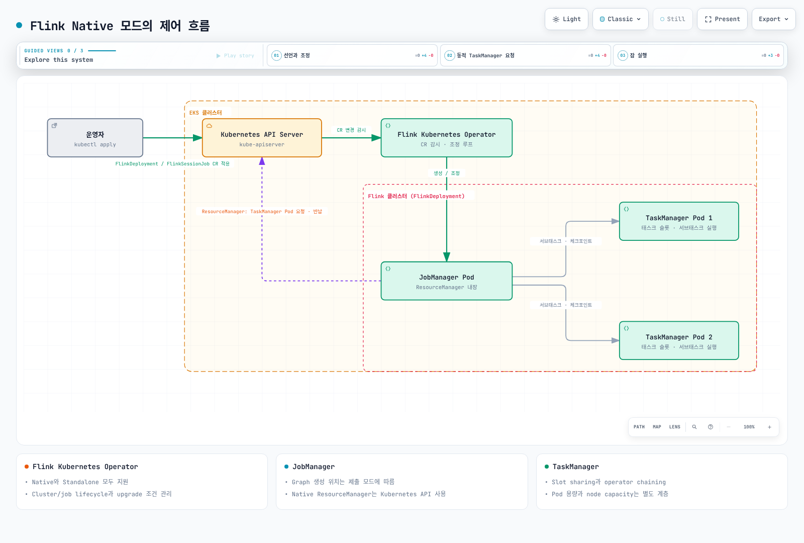

# Flink on EKS 딥다이브

Apache Flink는 유한·무한 스트림을 처리하는 분산 stateful 엔진입니다.
JobManager는 실행·복구를 조정하고, TaskManager는 operator task와 데이터 교환을
담당합니다. Checkpoint의 상태 일관성과 외부 sink의 exactly-once 보장은 별도 조건을
가집니다. Part 3에서 source·state·sink를 함께 검증합니다.

> 검토: 2026-09-12. 이 시리즈의 연동 기준은 **Flink 2.2.1 / Java 17 / Operator 1.15.0**입니다.

Flink 최신 안정 릴리스는 2.3.0이지만, 공개 Operator·커넥터 지원 표와 함께 확인할
예제 기준선을 2.2.1로 고정했습니다. 버전 문자열이 CRD enum에 들어 있다는 사실만으로
그 조합의 통합 검증을 대신하지 않습니다. Kubernetes와 kubectl은 현재 EKS 지원 및
version-skew 정책에 맞춥니다. “Kubernetes 1.21+”는 현재 EKS 지원 보장이 아닙니다.

## Kubernetes에서 누가 무엇을 관리하나요?

- **FlinkDeployment**는 Application 또는 Session cluster를 정의합니다.
- **FlinkSessionJob**은 이미 관리 중인 Session cluster에 제출하는 job을 정의합니다.
- Operator는 cluster/job lifecycle을 조정합니다. **Native와 Standalone 모드를 모두 지원**합니다.
- Native에서는 JobManager의 Kubernetes ResourceManager가 TaskManager Pod를 요청·해제합니다.
  Standalone에서는 Operator 등 외부 관리자가 Kubernetes 자원을 관리합니다.
- Task slot은 CPU core나 “서브태스크 정확히 하나”가 아닙니다. Chaining과 slot sharing으로
  여러 operator가 slot을 공유할 수 있으며, 상태·메모리·CPU 용량을 별도로 산정합니다.

아래 그림은 **Native 모드의 논리적 제어 흐름**입니다. Pod 해제는 idle timeout·필요 용량·
정리 정책에 따르며 job 종료 순간 node 비용까지 없어지는 것은 아닙니다.

[Interactive diagram](https://www.atomai.click/kubernetes-docs/archmaps/ko-data-on-eks-flink-readme-0.html)

## 시리즈 구성

1. [아키텍처](01-architecture.md): 프로세스·slot sharing, Application/Session, Native/Standalone의 두 축.
2. [Flink Kubernetes Operator](02-flink-kubernetes-operator.md): CRD·설치·업그레이드와 autoscaler.
3. [상태·체크포인트·스트리밍](03-state-checkpointing-streaming.md): backend·복구·connector의 실제 전달 보장.
4. [운영과 HA](04-operations-ha.md): metrics·HA 저장소·node capacity·관리형 서비스 비교.

Operator를 통한 선언적 운영을 주 경로로 다루며, CLI는 그 아래의 runtime 동작을
설명하는 데 사용합니다. Operator 없이 실행하는 방법도 지원되는 선택입니다.

## 참고 자료

- [Flink releases and connector compatibility](https://flink.apache.org/downloads/)
- [Flink 2.2 architecture](https://nightlies.apache.org/flink/flink-docs-release-2.2/docs/concepts/flink-architecture/)
- [Flink 2.2 deployment modes](https://nightlies.apache.org/flink/flink-docs-release-2.2/docs/deployment/overview/)
- [Native Kubernetes deployment](https://nightlies.apache.org/flink/flink-docs-release-2.2/docs/deployment/resource-providers/native_kubernetes/)
- [Java compatibility](https://nightlies.apache.org/flink/flink-docs-release-2.2/docs/deployment/java_compatibility/)
- [Operator 1.15.0 deployment modes](https://github.com/apache/flink-kubernetes-operator/blob/release-1.15.0/docs/content/docs/custom-resource/overview.md)

[Quiz](../../quizzes/data-on-eks/flink/01-architecture-quiz.md)
