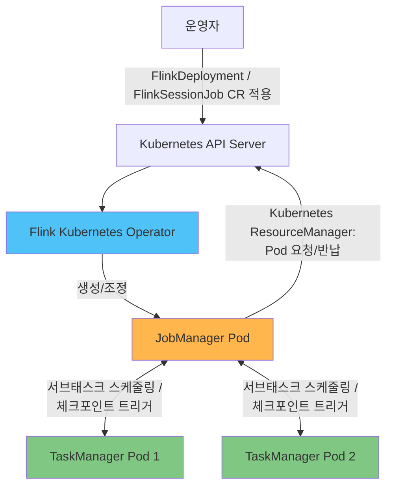

# Flink on EKS 딥다이브

## 개요

Apache Flink는 무한/유한 데이터 스트림에 대한 상태 기반(stateful) 연산을 위한 분산 스트림 처리 엔진으로, 실시간 분석, 이벤트 기반 애플리케이션, 지속적인 ETL 파이프라인 등에 널리 사용됩니다. EKS 환경에서는 Flink CLI로 잡을 직접 제출하는 대신 **Flink Kubernetes Operator**를 통해 클러스터를 운영하는 것이 표준적인 방식입니다. Operator는 배포, 업그레이드, 세이브포인트 기반 재배포, 오토스케일링 등 Flink 클러스터의 전체 라이프사이클을 Kubernetes 네이티브 CRD(Custom Resource Definition) 기반으로 선언적으로 관리합니다.

> **지원 버전**: Apache Flink 2.2+, Flink Kubernetes Operator 1.15+, Kubernetes 1.21+
> **마지막 업데이트**: 2026년 7월 15일

## 핵심 아키텍처 개념

Flink 클러스터는 두 가지 Pod 역할로 구성됩니다. **JobManager**는 컨트롤 플레인 역할을 하며, 잡 그래프를 생성하고 체크포인트를 조율하며 작업을 스케줄링하지만 레코드를 직접 처리하지는 않습니다. 실제 오퍼레이터 서브태스크를 **태스크 슬롯(Task Slot)** 안에서 실행하는 워커는 **TaskManager** Pod입니다. YARN이 노드 매니저를 상시 데몬셋 형태로 유지하는 것과 달리, Flink의 네이티브 Kubernetes 배포 모드에서는 JobManager 내부의 **Kubernetes ResourceManager** 컴포넌트가 Kubernetes API 서버와 직접 통신하여, 잡에 슬롯이 더 필요할 때 TaskManager Pod를 동적으로 요청하고 병렬성이 줄거나 잡이 끝나면 반납합니다. 즉, 고정된 워커 풀을 미리 프로비저닝하거나 수동으로 관리할 필요가 없습니다.

**Flink Kubernetes Operator**는 이 네이티브 배포 모델 한 단계 위에서 동작합니다. `flink run-application`으로 잡을 명령형으로 제출하는 대신, `FlinkDeployment`(Application/Session 모드 클러스터)와 `FlinkSessionJob`(실행 중인 Session 클러스터에 제출되는 잡) 커스텀 리소스로 원하는 클러스터 상태를 선언하면, Operator가 JobManager/TaskManager Pod를 그 상태에 맞춰 지속적으로 조정합니다. 여기에는 변경 사항을 어떻게 안전하게 적용할지(stateless 재시작, savepoint, last-state 업그레이드)와, 내장 오토스케일러를 통해 잡 그래프의 개별 vertex를 어떻게 재조정할지도 포함됩니다.

## 딥다이브 목차

**[1. Flink 아키텍처](01-architecture.md)**
- JobManager/TaskManager 클러스터 모델과 태스크 슬롯
- 배포 모드: Application, Session, 레거시 Per-Job
- 네이티브 Kubernetes 배포 vs standalone-on-Kubernetes

**[2. Flink Kubernetes Operator](02-flink-kubernetes-operator.md)**
- `FlinkDeployment`, `FlinkSessionJob` CRD 상세
- 업그레이드 모드: stateless, savepoint, last-state
- 내장 vertex 단위 오토스케일러

**[3. 상태, 체크포인팅, 스트리밍 패턴](03-state-checkpointing-streaming.md)**
- HashMap vs RocksDB 상태 백엔드, 증분(incremental) 체크포인트
- 체크포인트 vs 세이브포인트
- 2PC(2단계 커밋) 기반 Kafka Exactly-Once 전달, Dynamic Iceberg Sink
- Flink SQL/Table API vs DataStream API

**[4. 운영과 고가용성](04-operations-ha.md)**
- Prometheus/RocksDB 메트릭 모니터링
- ConfigMap 기반 Kubernetes 네이티브 HA (Zookeeper 불필요)
- Flink 오토스케일러와 Karpenter의 2단계 오토스케일링
- Amazon Managed Service for Apache Flink와 비교

## 참고 자료

- [Apache Flink 공식 문서](https://nightlies.apache.org/flink/flink-docs-release-2.2/)
- [Flink Kubernetes Operator](https://github.com/apache/flink-kubernetes-operator)
- [Flink Kubernetes Operator 오토스케일러](https://nightlies.apache.org/flink/flink-kubernetes-operator-docs-main/docs/custom-resource/autoscaler/)
- [Amazon Managed Service for Apache Flink](https://docs.aws.amazon.com/managed-flink/latest/java/what-is.html)
- [AWS Data on EKS 프로젝트](https://awslabs.github.io/data-on-eks/)

## 퀴즈

이 섹션에서 배운 내용을 테스트하려면 [Flink 아키텍처 퀴즈](../../quizzes/data-on-eks/flink/01-architecture-quiz.md)를 풀어보세요.
