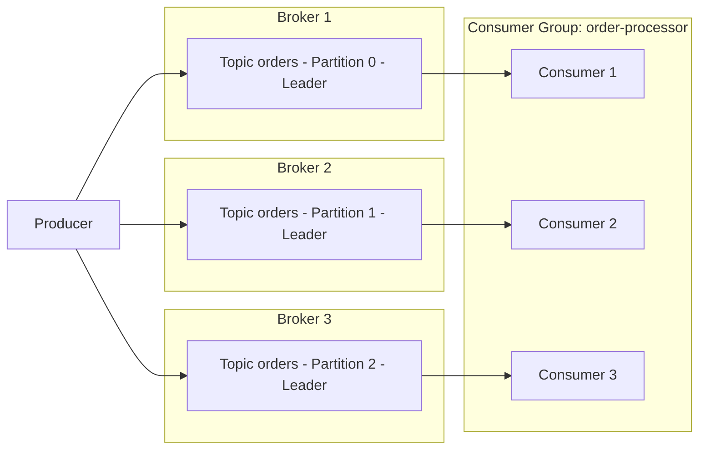

# Part 1: Kafka 핵심 개념

> **지원 버전**: Apache Kafka 3.9 (KRaft)\
> **마지막 업데이트**: 2026년 7월 9일

## Apache Kafka란 무엇인가?

Apache Kafka는 대용량의 실시간 데이터 스트림을 처리하기 위한 분산 이벤트 스트리밍 플랫폼입니다. 원래 LinkedIn에서 개발되어 Apache 프로젝트로 오픈소스화되었으며, 로그 수집, 메트릭 파이프라인, 이벤트 기반 마이크로서비스, CDC(Change Data Capture) 파이프라인 등 다양한 용도로 사용됩니다.

이 문서는 EKS에서 Kafka를 운영하기 전에 반드시 이해해야 하는 핵심 개념(브로커, 토픽, 파티션, 컨슈머 그룹, 복제, KRaft)을 다룹니다. Part 2에서는 Strimzi Operator를 이용해 이 개념들을 실제 EKS 클러스터에 배포하는 방법을 설명합니다.

## 1. Kafka 아키텍처 기초

### 핵심 용어

* **브로커(Broker)**: 메시지를 저장하고 클라이언트 요청을 처리하는 Kafka 서버 프로세스. 하나의 Kafka 클러스터는 보통 여러 개의 브로커로 구성됩니다.
* **토픽(Topic)**: 메시지를 분류하는 논리적 채널. 예를 들어 `orders`, `payments` 같은 이름으로 구분합니다.
* **파티션(Partition)**: 토픽을 물리적으로 나눈 단위. 각 파티션은 순서가 보장된 불변(append-only) 로그입니다.
* **오프셋(Offset)**: 파티션 내에서 각 메시지에 순차적으로 부여되는 고유 번호. 컨슈머는 오프셋을 기준으로 "어디까지 읽었는지"를 추적합니다.
* **복제 팩터(Replication Factor)**: 파티션의 데이터를 몇 개의 브로커에 복제할지를 나타내는 값. 브로커 장애 시 데이터 손실을 막기 위한 설정입니다.
* **리더/팔로워 레플리카(Leader/Follower Replica)**: 각 파티션의 복제본 중 하나는 리더로 지정되어 모든 읽기/쓰기 요청을 처리하고, 나머지 팔로워는 리더의 데이터를 복제합니다.
* **ISR(In-Sync Replicas)**: 리더와 충분히 동기화된 복제본 집합. `acks=all`로 쓰기를 요청하면 ISR에 속한 모든 레플리카가 메시지를 받아야 쓰기가 성공한 것으로 간주됩니다.

### 프로듀서 → 파티션 → 컨슈머 그룹 흐름



프로듀서는 토픽에 메시지를 쓰고, Kafka는 파티션 단위로 메시지를 여러 브로커에 분산 저장합니다. 같은 컨슈머 그룹에 속한 컨슈머들은 파티션을 나눠 가지며(1:1에 가깝게 매핑) 병렬로 메시지를 소비합니다.

## 2. 파티션과 순서 보장

파티션 수는 클러스터의 병렬 처리량을 결정하는 가장 중요한 요소입니다. 파티션이 많을수록 더 많은 컨슈머가 동시에 작업할 수 있지만, 파티션이 지나치게 많으면 브로커의 메타데이터 부담과 파일 핸들 수가 증가합니다.

> **핵심 개념**: Kafka는 **토픽 전체의 순서**를 보장하지 않습니다. 순서는 오직 **동일한 파티션 내**에서만 보장됩니다.

### 파티션 키 선택 전략

프로듀서가 메시지를 보낼 때 키(key)를 지정하면, Kafka는 키의 해시값을 기준으로 파티션을 결정합니다. 동일한 키는 항상 동일한 파티션으로 라우팅되므로, 같은 키를 가진 이벤트들 사이의 순서를 보장할 수 있습니다.

| 전략 | 설명 | 사용 예 |
| --- | --- | --- |
| 키 없음(null key) | 라운드 로빈 또는 sticky partitioner로 파티션 분산 | 순서가 중요하지 않은 로그 수집 |
| 엔티티 ID를 키로 사용 | 동일 엔티티의 이벤트를 같은 파티션에 고정 | 주문 ID별 주문 상태 이벤트 순서 보장 |
| 커스텀 파티셔너 | 비즈니스 규칙에 따라 파티션을 직접 지정 | 특정 고객 트래픽을 전용 파티션으로 분리 |

```bash
# 토픽 생성 예시 - 파티션 6개, 복제 팩터 3
kafka-topics.sh --create \
  --bootstrap-server localhost:9092 \
  --topic orders \
  --partitions 6 \
  --replication-factor 3 \
  --config min.insync.replicas=2
```

키 선택을 잘못하면 특정 파티션에 트래픽이 몰리는 "핫 파티션(hot partition)" 문제가 생길 수 있으므로, 키의 카디널리티(고유값 개수)가 충분히 큰지 확인해야 합니다.

## 3. 컨슈머 그룹과 리밸런싱

### 컨슈머 그룹 동작 방식

같은 `group.id`를 가진 컨슈머들은 하나의 **컨슈머 그룹**을 이룹니다. Kafka는 그룹 내에서 토픽의 파티션들을 컨슈머 인스턴스에 자동으로 배분하며, 한 파티션은 그룹 내 오직 하나의 컨슈머만 읽습니다(파티션 수보다 컨슈머가 많으면 일부 컨슈머는 유휴 상태가 됩니다).

### 리밸런싱이 발생하는 경우

* 새 컨슈머가 그룹에 참여할 때
* 기존 컨슈머가 그룹을 떠나거나(정상 종료) 하트비트 타임아웃으로 이탈이 감지될 때
* 토픽의 파티션 수가 변경될 때
* 컨슈머가 `session.timeout.ms` 내에 하트비트를 보내지 못하거나, `max.poll.interval.ms`를 초과해 처리 시간이 길어질 때

리밸런싱이 진행되는 동안에는 해당 그룹의 소비가 잠시 멈추므로, 너무 빈번한 리밸런싱은 처리량 저하의 원인이 됩니다. `CooperativeStickyAssignor`를 사용하면 파티션 재배치를 최소화해 리밸런싱 비용을 줄일 수 있습니다.

### 오프셋 커밋 전략

| 전략 | 설정 | 특징 |
| --- | --- | --- |
| 자동 커밋 | `enable.auto.commit=true` (기본값) | 주기적으로 자동 커밋되어 편리하지만, 처리 완료 전에 커밋되어 메시지 손실 위험이 있음 |
| 수동 커밋 (동기) | `enable.auto.commit=false` + `commitSync()` | 메시지 처리 완료 후 명시적으로 커밋, 안전하지만 처리량이 낮음 |
| 수동 커밋 (비동기) | `enable.auto.commit=false` + `commitAsync()` | 처리량은 높지만 커밋 실패 처리를 애플리케이션에서 관리해야 함 |

### 전달 보장(Delivery Semantics)

* **최대 한 번(At-most-once)**: 메시지 처리 전에 오프셋을 커밋. 장애 시 메시지가 누락될 수 있음.
* **최소 한 번(At-least-once)**: 메시지 처리 후에 오프셋을 커밋(일반적으로 권장되는 기본값). 장애 시 메시지가 중복 처리될 수 있어, 컨슈머 로직이 멱등성을 갖도록 설계해야 함.
* **정확히 한 번(Exactly-once)**: 프로듀서의 아이돔포턴트(idempotent) 옵션과 트랜잭션 API(`transactional.id`)를 함께 사용하면 Kafka 내부(토픽 간)에서 정확히 한 번 처리를 달성할 수 있음. 외부 시스템과의 정확히 한 번 처리는 별도의 설계(예: Kafka Connect의 exactly-once sink)가 필요합니다.

## 4. KRaft: ZooKeeper 없는 Kafka

전통적으로 Kafka는 클러스터 메타데이터(토픽/파티션 정보, ACL, 컨트롤러 선출 등)를 관리하기 위해 별도의 ZooKeeper 앙상블에 의존했습니다. Kafka 3.3부터 **KRaft(Kafka Raft metadata mode)**가 프로덕션 준비(GA) 상태가 되었고, **Kafka 4.0(2025년 3월 출시)**에서는 ZooKeeper 모드가 완전히 제거되어 KRaft가 유일한 메타데이터 관리 방식이 되었습니다.

### KRaft 아키텍처

KRaft에서는 별도의 ZooKeeper 클러스터 대신, Kafka 브로커 프로세스 중 일부가 **컨트롤러 쿼럼(Controller Quorum)** 역할을 수행합니다.

* **컨트롤러 보터(Controller Voter)**: Raft 합의 프로토콜에 참여해 메타데이터 로그를 복제하는 노드들(보통 3개 또는 5개로 홀수 구성).
* **액티브 컨트롤러(Active Controller)**: 보터 중 리더로 선출되어 실제로 클러스터 메타데이터 변경(파티션 리더 선출, 토픽 생성 등)을 처리하는 단일 노드.
* 컨트롤러 역할과 브로커 역할은 같은 프로세스에서 결합(`process.roles=broker,controller`)하거나, 대규모 클러스터에서는 전용 컨트롤러 노드로 분리(`process.roles=controller`)할 수 있습니다.

### Before / After 비교

| 항목 | ZooKeeper 기반 (Kafka 3.x 이하 기본) | KRaft 기반 (Kafka 3.3+ GA, 4.0+ 유일 모드) |
| --- | --- | --- |
| 메타데이터 저장소 | 별도의 ZooKeeper 앙상블 | Kafka 자체 내부 메타데이터 토픽(`__cluster_metadata`) |
| 필요한 클러스터 수 | Kafka 클러스터 + ZooKeeper 클러스터, 2개 | Kafka 클러스터 1개 |
| 컨트롤러 선출 | ZooKeeper의 임시 znode 기반 리더 선출 | Raft 합의 기반 액티브 컨트롤러 선출 |
| 메타데이터 확장성 | 파티션 수가 많아질수록 ZooKeeper 부하 증가 | 로그 기반 복제로 대규모 파티션 환경에 더 강함 |
| Kubernetes 운영 복잡도 | ZooKeeper StatefulSet, 별도 PVC, 별도 모니터링 필요 | 관리할 별도 컴포넌트 없이 Kafka 브로커/컨트롤러 Pod만 운영 |

Kubernetes/EKS 환경에서는 이 차이가 특히 중요합니다. ZooKeeper 기반 배포는 Kafka StatefulSet과 ZooKeeper StatefulSet을 각각 운영하고, 두 컴포넌트 간의 네트워크 정책·PDB·모니터링을 이중으로 관리해야 했습니다. KRaft는 이러한 운영 부담을 없애고, Strimzi Operator 같은 오퍼레이터가 관리해야 하는 리소스 종류를 줄여줍니다. Part 2에서 다룰 Strimzi 기반 배포는 기본적으로 KRaft 모드를 사용합니다.

### KRaft 노드 설정 예시 (server.properties)

```properties
# 이 노드가 브로커와 컨트롤러 역할을 모두 수행 (소규모 클러스터에 적합)
process.roles=broker,controller
node.id=1

# 컨트롤러 쿼럼 보터 목록 (node.id@host:port)
controller.quorum.voters=1@kafka-0.kafka-headless:9093,2@kafka-1.kafka-headless:9093,3@kafka-2.kafka-headless:9093

listeners=BROKER://:9092,CONTROLLER://:9093
controller.listener.names=CONTROLLER
inter.broker.listener.name=BROKER

log.dirs=/var/lib/kafka/data
```

## 5. 레플리케이션과 내구성 설정

프로듀서가 메시지를 보낸 뒤 "안전하게 저장되었다"고 확신할 수 있는 정도는 다음 세 가지 설정의 조합으로 결정됩니다.

* **`replication.factor`** (토픽 단위 설정): 파티션 데이터를 몇 개의 브로커에 복제할지 결정합니다. 최소 3을 권장하며, 이렇게 하면 동시에 최대 2개 브로커가 장애를 겪어도 데이터가 남아 있습니다.
* **`min.insync.replicas`** (토픽 단위 설정): `acks=all`로 쓰기를 요청했을 때, 쓰기가 성공으로 인정되기 위해 ISR에 최소 몇 개의 레플리카가 포함되어야 하는지를 지정합니다. 흔히 `replication.factor=3`, `min.insync.replicas=2`로 설정해 1개 브로커 장애까지는 쓰기 가용성을 유지합니다.
* **`acks`** (프로듀서 단위 설정): 프로듀서가 쓰기 완료를 확인받기까지 기다리는 수준을 결정합니다.

| `acks` 값 | 동작 | 내구성 | 지연시간/처리량 |
| --- | --- | --- | --- |
| `0` | 응답을 기다리지 않음 | 가장 낮음(전송 후 즉시 손실 가능) | 가장 빠름 |
| `1` | 리더에만 기록되면 성공으로 간주 | 중간(리더 장애 시 미복제 데이터 손실 가능) | 빠름 |
| `all` (`-1`) | ISR의 모든 레플리카에 기록되어야 성공으로 간주 | 가장 높음 | 상대적으로 느림 |

```bash
# 토픽 생성 후 min.insync.replicas 동적으로 변경
kafka-configs.sh --bootstrap-server localhost:9092 \
  --alter --entity-type topics --entity-name orders \
  --add-config min.insync.replicas=2
```

일반적인 프로덕션 권장 조합은 `replication.factor=3`, `min.insync.replicas=2`, 프로듀서의 `acks=all`, `enable.idempotence=true`입니다. 이 조합은 브로커 1대 장애까지 데이터 손실 없이 견딜 수 있으며, 아이돔포턴트 프로듀서 옵션은 네트워크 재시도로 인한 중복 쓰기를 방지합니다. 단, `acks=all`은 `acks=1`보다 지연시간이 늘어나므로, 지연시간에 극도로 민감하면서 일부 데이터 손실을 감내할 수 있는 워크로드(예: 메트릭 수집)에서는 `acks=1`을 선택하는 트레이드오프도 존재합니다.

## 다음 단계

이번 문서에서는 Kafka의 핵심 개념 — 브로커/토픽/파티션 구조, 순서 보장의 범위, 컨슈머 그룹의 리밸런싱, KRaft로의 전환, 복제/내구성 설정 — 을 살펴봤습니다. Part 2에서는 **Strimzi Operator**를 사용해 이 모든 개념을 실제 Amazon EKS 클러스터 위에 KRaft 기반 Kafka 클러스터로 배포하는 과정을 다룹니다.

[메인 페이지로 돌아가기](./)

## 퀴즈

이 장에서 배운 내용을 테스트하려면 [주제 퀴즈](../../quizzes/data-on-eks/kafka/01-kafka-fundamentals-quiz.md)를 풀어보세요.
