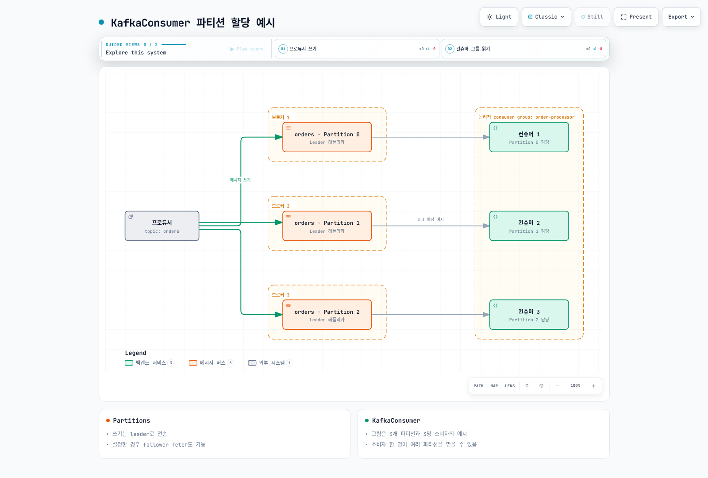

# Part 1: Kafka 핵심 개념

> **검토 기준**: 2026-09-12. Apache Kafka 4.3.1 / Strimzi 1.2.0 지원 조합.
> **검증**: Kafka 4.3.1 실제 설정 클래스로 19개 유효성·기본값·충돌 조건을 확인했습니다. 브로커나 EKS 클러스터를 실행한 결과는 아닙니다.

## 1. 브로커·토픽·파티션

Kafka는 이벤트를 파티션 로그에 저장하고 생산자와 소비자가 독립적으로 접근하게 하는 분산 이벤트 스트리밍 플랫폼입니다. 브로커는 토픽 전체가 아니라 여러 토픽의 파티션 복제본을 보관할 수 있습니다.

| 용어 | 의미 |
| --- | --- |
| Broker | 데이터 복제본을 저장하고 요청을 처리하는 서버 역할 |
| Topic | 이벤트를 구분하는 논리적 이름 |
| Partition | 기록 순서를 가진 append log. 보존·compaction으로 레코드가 삭제될 수 있음 |
| Offset | 파티션 안의 위치. 클러스터 전체 ID가 아니며 삭제·트랜잭션 등으로 보이는 offset에 빈틈이 생길 수 있음 |
| Replication factor | 파티션 복제본 수. 토픽 생성·재할당으로 관리하는 메타데이터 |
| Leader / follower | 쓰기는 리더가 처리하고 팔로워가 복제. 설정된 follower fetching에서는 소비자가 팔로워에서 읽을 수도 있음 |
| ISR | 리더와 충분히 동기화된 복제본 집합. 리더도 포함 |



[인터랙티브 다이어그램 보기](https://www.atomai.click/kubernetes-docs/archmaps/ko-data-on-eks-kafka-01-kafka-fundamentals-0.html)

그림의 3:3 배치는 하나의 예시입니다. `subscribe()`를 사용하는 `KafkaConsumer` 자동 그룹 할당에서는 한 파티션이 한 시점에 그룹 내 한 소비자에 할당되고, 한 소비자는 여러 파티션을 맡을 수 있습니다. 수동 `assign()` 사용은 별도로 관리합니다. 동일 토픽을 여러 그룹이 독립적으로 읽을 수도 있습니다. Kafka 4.x의 Share Groups/KafkaShareConsumer는 다른 공유·확인 모델이므로 이 설명과 구분합니다.

## 2. 순서와 파티션 키

Kafka의 로그 순서는 **파티션 안**에서 정의됩니다. 토픽 전체의 전역 순서나 업무 이벤트 발생 시각 순서를 자동 보장하지 않습니다.

기본적인 키 기반 라우팅에서 같은 키가 같은 파티션으로 가려면 키 serialization·partitioner·파티션 수가 일관되어야 합니다. 파티션 수를 늘리면 hash 기반 매핑이 달라질 수 있으며, 커스텀 partitioner나 명시적 파티션 지정도 결과를 바꿉니다. 여러 프로듀서와 재시도·소비자 병렬 처리의 순서도 별도 계약입니다.

키가 없는 레코드의 라우팅은 클라이언트/partitioner에 따라 다릅니다. 높은 키 cardinality만으로 균등 부하가 보장되지도 않습니다. 특정 키의 높은 빈도는 hot partition을 만들 수 있습니다.

다음 명령은 **이미 접근 가능한 3개 이상 브로커의 클러스터**에서 새 토픽을 만듭니다. 인증이 필요한 listener에서는 `--command-config client.properties`를 추가합니다. 이 명령을 아래의 단일 노드 학습 설정에 그대로 적용하지 않습니다.

```bash
: "${DOCS_BOOTSTRAP:?Set the existing Kafka bootstrap host:port}"
kafka-topics.sh --create --bootstrap-server "$DOCS_BOOTSTRAP" \
  --topic orders --partitions 6 --replication-factor 3 \
  --config min.insync.replicas=2
```

## 3. Consumer 그룹과 오프셋

파티션 기반 그룹에서 소비자를 파티션 수보다 많이 늘리면 일부가 할당 없이 대기할 수 있습니다. 생산자 처리량·디스크·네트워크·consumer 처리 시간도 병렬성에 영향을 주므로 파티션 수만으로 처리량을 예측하지 않습니다.

### 그룹 프로토콜을 구분

Kafka 4.3 Java consumer의 `group.protocol` 기본값은 `classic`입니다.

| 선택 | 할당과 timeout |
| --- | --- |
| `classic` | 클라이언트 assignor와 `session.timeout.ms` / `heartbeat.interval.ms` 사용 |
| `consumer` | 서버 측 assignor와 broker의 `group.consumer.session.timeout.ms` / `group.consumer.heartbeat.interval.ms` 사용 |

Classic의 eager rebalance는 파티션을 반납하는 범위가 넓습니다. `CooperativeStickyAssignor`는 이동이 필요한 파티션을 점진적으로 재할당합니다. 새 consumer 프로토콜도 서버 측 증분 재조정을 사용하므로 모든 rebalance가 그룹 전체를 항상 멈춘다고 설명하지 않습니다. 새 프로토콜의 설정에 기존 client assignor/timeout을 그대로 적용하지 않습니다.

`max.poll.interval.ms` 기본값은 300000 ms입니다. 정적 멤버십(`group.instance.id`)을 사용하면 이 간격을 넘었다고 파티션이 즉시 다른 멤버에게 재할당되는 것은 아니며, heartbeat 중단 후 해당 프로토콜의 session timeout도 관여합니다.

### 오프셋과 업무 완료

커밋한 offset은 일반적으로 다음에 읽을 위치를 나타냅니다. 클라이언트의 읽기 위치와 외부 업무 처리가 끝났다는 사실은 다릅니다. 비동기·병렬 처리에서는 아직 끝나지 않은 레코드 뒤의 offset을 커밋하지 않도록 관리합니다.

| 방식 | 의미와 주의점 |
| --- | --- |
| Auto commit | `enable.auto.commit=true`, 간격 기본 5000 ms. 업무 완료를 자동 판별하지 않음 |
| `commitSync()` | 호출 완료를 기다림. 배치 크기·호출 빈도에 따라 지연 영향이 다름 |
| `commitAsync()` | callback으로 실패·진행 상태 관리. 실패한 옛 offset을 무조건 재시도해 진행 위치를 되돌리지 않음 |

처리 전에 커밋하면 장애 시 누락될 수 있고, 처리 뒤 커밋하면 재처리로 중복 효과가 생길 수 있습니다. 어떤 방식을 쓰든 실패·재시작·rebalance 시나리오를 애플리케이션 출력과 함께 검증합니다.

## 4. Exactly-once의 범위

`enable.idempotence`는 프로듀서 재시도로 같은 전송이 중복 기록되는 것을 방지합니다. 애플리케이션이 같은 업무 이벤트를 새 전송으로 다시 보내는 것까지 일반적인 중복 제거 키로 처리하지는 않습니다.

Kafka 토픽을 읽어 다른 Kafka 토픽에 결과를 쓸 때는 출력과 **다음 입력 offset**을 같은 트랜잭션에 넣고, 소비자는 `read_committed`로 읽어야 합니다. `transactional.id` 문자열만 설정하는 것으로 이 처리 로직이 생기지는 않습니다. 외부 DB/API의 부작용은 sink의 트랜잭션·멱등성·복구 계약이 별도로 필요합니다.

**`producer.properties`**

```properties
bootstrap.servers=127.0.0.1:19092
key.serializer=org.apache.kafka.common.serialization.StringSerializer
value.serializer=org.apache.kafka.common.serialization.StringSerializer
acks=all
enable.idempotence=true
transactional.id=orders-writer-1
max.in.flight.requests.per.connection=5
delivery.timeout.ms=120000
```

**`consumer.properties`**

```properties
bootstrap.servers=127.0.0.1:19092
key.deserializer=org.apache.kafka.common.serialization.StringDeserializer
value.deserializer=org.apache.kafka.common.serialization.StringDeserializer
group.id=order-processor
group.protocol=consumer
enable.auto.commit=false
isolation.level=read_committed
max.poll.interval.ms=300000
```

트랜잭션 처리에는 `initTransactions()`, `beginTransaction()`, 결과 전송, `sendOffsetsToTransaction(...)`, `commitTransaction()`과 오류 시 abort/복구가 포함됩니다. 동시 실행 producer는 서로 다른 transactional ID를 사용해야 하며, 같은 논리적 writer의 재시작 정책과 fencing 처리를 설계합니다.

Idempotence를 명시적으로 켜면 `acks=all`, `retries>0`, `max.in.flight.requests.per.connection<=5`가 필요합니다. 충돌하면 ConfigException이 발생합니다. 명시하지 않은 기본 idempotence는 충돌 설정에서 꺼질 수 있습니다. `retries`가 커도 `delivery.timeout.ms` 등 기한을 넘겨 무한 재시도하지 않습니다.

## 5. KRaft 메타데이터

KRaft는 Kafka 2.8에서 early access로 도입되어 3.3에서 production-ready가 되었으며, Kafka 4.0부터 ZooKeeper 모드는 제거되었습니다. 전용 controller 프로세스는 데이터 broker 역할을 하지 않을 수 있으므로 “broker 중 일부가 controller”라고만 정의하지 않습니다.

Controller voter가 메타데이터 Raft 로그를 복제하고 그중 하나가 active controller가 됩니다. 운영에서는 보통 3개 또는 5개의 controller voter를 사용합니다. 과반수는 짝수에서도 계산되지만, 홀수는 같은 장애 허용 수준에서 자원을 효율적으로 사용합니다.

`__cluster_metadata`는 내부 메타데이터 로그 이름입니다. 애플리케이션이 일반 KafkaProducer/KafkaConsumer로 관리하는 토픽처럼 다루지 않습니다. ZooKeeper가 없어져도 controller quorum, 스토리지, 업그레이드와 모니터링 책임은 남습니다.

### 동적 quorum과 정적 quorum

현재 동적 quorum은 `controller.quorum.bootstrap.servers`를 discovery seed로 사용합니다. 이 목록은 voter 멤버십 정의가 아닙니다. 초기 저장소 format과 quorum bootstrap 절차에서 cluster ID·directory ID·초기 voter를 맞추고, 변경에는 지원되는 controller 추가/제거 절차를 사용합니다.

기존 정적 quorum의 `controller.quorum.voters`도 Kafka 4.3.1에서 지원됩니다. 동적 quorum에서는 이 값을 설정하지 않습니다. 파일의 seed 주소만 바꾸면 정적 quorum이 자동 변환된다고 가정하지 않습니다.

다음 파일은 **로컬 단일 노드 학습용**이며 HA 배포가 아닙니다. loopback listener와 PLAINTEXT를 사용하며, broker를 시작하기 전에 새 데이터 디렉터리에 맞는 storage format/bootstrap이 필요합니다. 기존 Kafka 데이터에 임의 format을 실행하지 않습니다.

**`combined-lab.properties`**

```properties
# Local, single-node configuration for learning; not an HA deployment.
process.roles=broker,controller
node.id=1
controller.quorum.bootstrap.servers=127.0.0.1:19093
listeners=BROKER://127.0.0.1:19092,CONTROLLER://127.0.0.1:19093
advertised.listeners=BROKER://127.0.0.1:19092,CONTROLLER://127.0.0.1:19093
listener.security.protocol.map=BROKER:PLAINTEXT,CONTROLLER:PLAINTEXT
controller.listener.names=CONTROLLER
inter.broker.listener.name=BROKER
log.dirs=./kafka-lab-data
# Single-node internal-topic settings are for this lab only.
offsets.topic.replication.factor=1
transaction.state.log.replication.factor=1
transaction.state.log.min.isr=1
share.coordinator.state.topic.replication.factor=1
share.coordinator.state.topic.min.isr=1
```

커스텀 `BROKER` listener에는 명시적 protocol mapping이 필요합니다. 반면 Kafka 4.3.1의 controller 전용 기본 `CONTROLLER` mapping은 일부 경우 PLAINTEXT로 보완되므로, mapping 줄이 없다는 이유만으로 모든 controller 설정이 잘못되었다고 단정하지 않습니다.

EKS에서는 Part 2의 Strimzi가 생성하는 설정·인증서·저장소를 사용합니다. Operator가 관리하는 Pod의 server.properties를 직접 수정하지 않습니다. 운영 listener에는 요구되는 TLS·인증·권한을 설정합니다.

## 6. 복제·쓰기 가용성과 내구성

RF=3만으로 임의의 두 broker 장애에서 모든 데이터가 보존된다고 보장할 수 없습니다. 실제 복제 진행 상태, 승인 시점의 ISR, 유효한 leader 선출, 저장소·네트워크와 controller quorum을 고려해야 합니다.

처음에 세 복제본이 정상 ISR이고 `min.insync.replicas=2`, `acks=all`인 파티션은 다른 조건이 유지되면 한 broker 장애 후 두 ISR로 쓰기를 계속할 수 있습니다. Leader 전환 중 오류·재시도는 발생할 수 있습니다. ISR이 최소값보다 줄면 쓰기가 거부되거나 실패하며 오류는 장애 시점에 따라 다를 수 있습니다.

| acks | 승인 의미 | 해석 |
| --- | --- | --- |
| `0` | broker 응답을 기다리지 않음 | 저장 여부를 확인하지 못함. 응답 offset은 -1 |
| `1` | leader가 기록한 뒤 응답 | follower 복제 전 leader 손실 위험 |
| `all` / `-1` | 현재 ISR 전체의 승인을 기다림 | min ISR·복제·leader 선출 정책과 함께 평가 |

`acks=all`이 매번 모든 디스크의 fsync 완료를 뜻하는 것은 아닙니다. 또한 acks 값만으로 처리량·p99 순위를 보장하지 않습니다. 확인 비용과 부하·batching·네트워크를 같은 조건에서 측정합니다.

토픽의 최소 ISR은 다음처럼 변경할 수 있습니다. 복제 팩터 자체의 변경에는 replica reassignment가 필요하며, 일반 토픽 config에 `replication.factor`를 추가하는 방식과 다릅니다.

```bash
kafka-configs.sh --bootstrap-server "$DOCS_BOOTSTRAP" \
  --alter --entity-type topics --entity-name orders \
  --add-config min.insync.replicas=2
```


## 다음 단계와 참고

- [Strimzi Operator](./02-strimzi-operator.md)
- [Kafka overview](./README.md)
- [Quiz](../../quizzes/data-on-eks/kafka/01-kafka-fundamentals-quiz.md)
- [Kafka design](https://kafka.apache.org/43/design/design/)
- [Consumer configurations](https://kafka.apache.org/43/configuration/consumer-configs/)
- [Producer configurations](https://kafka.apache.org/43/configuration/producer-configs/)
- [KRaft operations](https://kafka.apache.org/43/operations/kraft/)
- [Strimzi 1.2.0 release and migration notice](https://github.com/strimzi/strimzi-kafka-operator/releases/tag/1.2.0)
