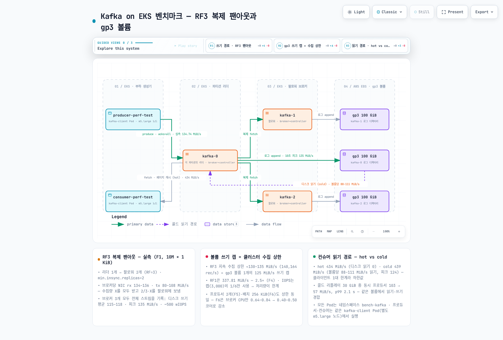
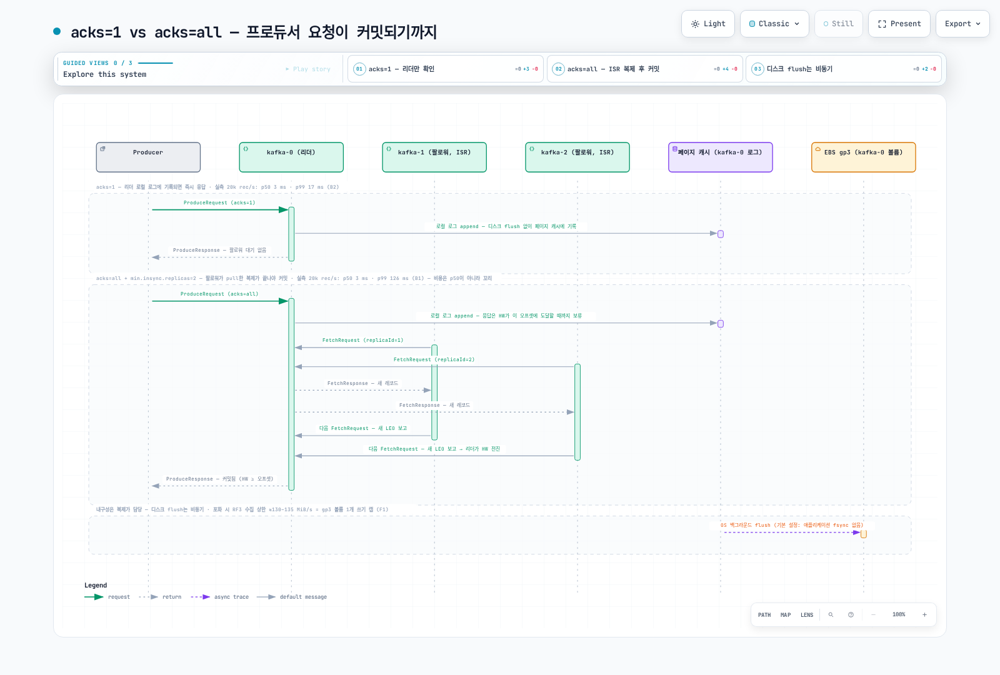

# Part 9: Kafka on EKS 실측 벤치마크 — RF3 복제와 gp3 처리량 한계

> **지원 버전**: Apache Kafka 4.3.1 (KRaft), Kubernetes 1.36 (Amazon EKS)
> **마지막 업데이트**: 2026년 9월 2일

EKS 위의 Kafka는 대부분 EBS 볼륨을 단 브로커 3대에 `replication.factor=3`으로 시작합니다. 그 구성에서 "이 클러스터가 초당 몇 MiB를 안정적으로 받아 주는가"를 정한 것은 Kafka가 아니라 **볼륨 하나의 쓰기 상한**이었습니다 — RF3에서는 모든 브로커가 스트림 전체를 자기 디스크에 쓰기 때문입니다. 이 문서는 m5.xlarge 3대 + 기본 설정 gp3 100 GiB 볼륨 3개라는 평범한 환경에서 `kafka-producer-perf-test`/`kafka-consumer-perf-test`로 RF3 vs RF1 상한, acks 설정별 지연, 배치·압축·레코드 크기, 콜드 컨슈머가 프로듀서에 주는 영향을 측정한 결과입니다. 클라이언트 수치는 브로커 안에서 디스크·CPU·NIC 카운터를 10초마다 샘플링한 값과 CloudWatch로 교차 검증했습니다.



[🔍 인터랙티브 다이어그램 보기](https://www.atomai.click/kubernetes-docs/archmaps/ko-data-on-eks-kafka-09-kafka-benchmark-0.html)

## TL;DR — 측정 결과 요약

| 측정 항목 | 결과 | 출처 테스트 |
|-----------|------|------------|
| RF3 `acks=all` 지속 ingest 상한 (1,000만 건, ≈9.5 GiB × 3) | **134.74 MiB/s** (140,164 rec/s) — 프로듀서를 2개로 늘려도 129.82 MiB/s | F1, F5 |
| RF1 `acks=1` 상한 (1,000만 건) | **337.81 MiB/s** (351,407 rec/s) = RF3의 **2.5배** | F4 |
| 브로커 볼륨당 쓰기 (RF3 ingest 134.74 MiB/s일 때) | 평균 115.2–117.5 MiB/s, 10초 피크 **135 MiB/s**, 495–505 wIOPS (3,000 IOPS 한도의 약 1/6) | F1 브로커 측 |
| `acks=all` vs `acks=1` 지연 (20,000 rec/s 정속) | p50 **3 ms / 3 ms**, p99 **126 ms / 17 ms** — 비용은 꼬리에만 | B1, B2 |
| 배치 65,536 → 262,144 B | 처리량 134.74 → 148.38 MiB/s(페이지 캐시 노이즈 범위), 브로커 CPU **0.64–0.84 → 0.40–0.50 코어** | F1 → F6 |
| 압축 lz4 (RF3 `acks=all`, 300만 건) | 264.70 MiB/s(비압축 환산), p99 **24 ms** — 비압축 `none`은 196.00 MiB/s, p99 425 ms | C |
| 단일 컨슈머 hot / cold | **434.11 / 438.6 MiB/s** — 둘 다 m5.large 클라이언트 1대가 먼저 포화 (하한값) | E1, E3 |
| 30 GiB 콜드 리플레이 중 동시 produce | 103.36 → **57.37 MiB/s**, p99 82 → **2,147 ms** | E0 → E4 |

## 테스트 환경

| 항목 | 값 |
|------|-----|
| 클러스터 | Amazon EKS, Kubernetes 1.36, ap-northeast-2 (서울), Karpenter 프로비저닝 노드 |
| 브로커 | 3 × `apache/kafka:4.3.1` (kafka_2.13-4.3.1, OpenJDK 21.0.11), **KRaft combined 모드**(각 파드가 broker+controller), StatefulSet 직접 배포 — Strimzi 등 Operator 없음 |
| 브로커 노드 | 3 × **m5.xlarge** 온디맨드 (4 vCPU, 16 GiB), 모두 **ap-northeast-2b** 단일 AZ, podAntiAffinity로 노드당 브로커 1개, Karpenter `system` NodePool이 측정 직전 새로 만든 노드 |
| 브로커 파드 리소스 | requests cpu 3 / mem 10Gi, limits cpu 4 / mem 12Gi, `KAFKA_HEAP_OPTS=-Xms4G -Xmx4G` (12 GiB 한도 중 약 8 GiB가 페이지 캐시 몫) |
| 브로커 스토리지 | 브로커당 **gp3 100 GiB** PVC 1개 (EBS CSI, StorageClass `gp3`), gp3 기본 성능 **3,000 IOPS / 125 MiB/s** (크기와 무관한 베이스라인) |
| 브로커 설정 | `num.partitions=6`, `default.replication.factor=3`, `min.insync.replicas=2`, `log.segment.bytes=1 GiB`, `num.network.threads=4`, `num.io.threads=8`, `num.replica.fetchers=2`, `log.retention.hours=2` |
| 커널 | Amazon Linux 2023, 6.18.41-94.142.amzn2023.x86_64; `vm.dirty_ratio=20`, `vm.dirty_background_ratio=10`, `vm.dirty_expire_centisecs=3000` |
| m5.xlarge 인스턴스 한도 | 네트워크 베이스라인 1.25 Gbps (버스트 10 Gbps); EBS 베이스라인 1,150 Mbps = 143.75 MB/s (≈137 MiB/s; 1,150 × 10⁶ ÷ 8 ÷ 1,048,576), 6,000 IOPS |
| 부하 생성기 | `kafka-client` 파드 1개 (같은 이미지), **m5.large** 노드 (2 vCPU, 8 GiB), cgroup **CPU 한도 1.9**, `KAFKA_HEAP_OPTS=-Xms2G -Xmx2G`; m5.large 네트워크 베이스라인 0.75 Gbps (버스트 10 Gbps) |
| 도구 | `kafka-producer-perf-test.sh`, `kafka-consumer-perf-test.sh` (apache/kafka 4.3.1 이미지에 동봉) |
| 네트워크 경로 | 같은 AZ 안의 파드 간 통신, PLAINTEXT (TLS/SASL 없음) |
| 토픽 | 테스트마다 새 토픽, 파티션 6개; RF3/min.isr=2 (RF1 테스트만 RF1/min.isr=1); `retention.bytes=-1` |
| 프로듀서 기본값 | `linger.ms=5`, `batch.size=65536`, `buffer.memory=67108864` (64 MiB), `compression.type=none` — 별도 표기 없으면 모든 테스트 공통 |
| 시간당 비용 | m5.xlarge 온디맨드 $0.236/h × 3 + gp3 100 GiB $0.0912/GB-월 × 3 (서울 리전, 2026-09 Pricing API 조회) |

측정은 **2026년 9월 2일 02:07–02:36 UTC(11:07–11:36 KST)**에 진행했습니다. 일부러 "화려하지 않은" 환경입니다. i-계열 NVMe 인스턴스나 프로비저닝된 io2가 아니라, 여러분 클러스터에 이미 있을 법한 범용 노드와 기본 gp3에서 RF3 Kafka가 어디까지 되는지가 질문입니다. 측정 전 `kafka-1`이 첫 기동 3초 만에 한 번 재시작(02:05:22Z, KRaft 기동 레이스)했지만 첫 테스트(02:07:25Z) 2분 전의 일이고, 테스트 중 재시작은 없었습니다. 이 재시작의 원인은 더 조사하지 않았습니다.

### 배포 매니페스트

주석만 걷어냈고 동작을 바꾸는 필드는 모두 남겼습니다. 측정 때 부하 생성기 파드는 `nodeName`으로 시스템 풀의 기존 m5.large 노드 1대에 고정했는데, 아래에서는 매니페스트를 그대로 쓸 수 있도록 `nodeSelector`로 바꿔 적었습니다.

```yaml
apiVersion: v1
kind: Namespace
metadata:
  name: bench-kafka
---
apiVersion: v1
kind: Service
metadata:
  name: kafka-hs
  namespace: bench-kafka
spec:
  clusterIP: None
  selector:
    app: kafka
  ports:
    - name: broker
      port: 9092
    - name: controller
      port: 9093
---
# 3-broker KRaft (broker+controller combined), 공식 apache/kafka 이미지, Operator 없음.
# 브로커 1개 = m5.xlarge 1대 = gp3 100 GiB 1개 → 브로커마다 3,000 IOPS / 125 MiB/s 예산을 따로 가짐.
apiVersion: apps/v1
kind: StatefulSet
metadata:
  name: kafka
  namespace: bench-kafka
spec:
  serviceName: kafka-hs
  replicas: 3
  podManagementPolicy: Parallel
  selector:
    matchLabels:
      app: kafka
  template:
    metadata:
      labels:
        app: kafka
      annotations:
        karpenter.sh/do-not-disrupt: "true"
    spec:
      terminationGracePeriodSeconds: 60
      nodeSelector:
        node.kubernetes.io/instance-type: m5.xlarge
        karpenter.sh/capacity-type: on-demand
      affinity:
        podAntiAffinity:
          requiredDuringSchedulingIgnoredDuringExecution:
            - labelSelector:
                matchLabels:
                  app: kafka
              topologyKey: kubernetes.io/hostname
      securityContext:
        fsGroup: 1000
      containers:
        - name: kafka
          image: apache/kafka:4.3.1
          command:
            - /bin/bash
            - -c
            - |
              set -e
              ORD=${HOSTNAME##*-}
              export KAFKA_NODE_ID=$ORD
              export KAFKA_ADVERTISED_LISTENERS="PLAINTEXT://${HOSTNAME}.kafka-hs.bench-kafka.svc.cluster.local:9092"
              exec /etc/kafka/docker/run
          env:
            - name: CLUSTER_ID
              value: "UdHYY7YQRrunSRromZFozw"
            - name: KAFKA_PROCESS_ROLES
              value: "broker,controller"
            - name: KAFKA_CONTROLLER_QUORUM_VOTERS
              value: "0@kafka-0.kafka-hs.bench-kafka.svc.cluster.local:9093,1@kafka-1.kafka-hs.bench-kafka.svc.cluster.local:9093,2@kafka-2.kafka-hs.bench-kafka.svc.cluster.local:9093"
            - name: KAFKA_LISTENERS
              value: "PLAINTEXT://0.0.0.0:9092,CONTROLLER://0.0.0.0:9093"
            - name: KAFKA_LISTENER_SECURITY_PROTOCOL_MAP
              value: "PLAINTEXT:PLAINTEXT,CONTROLLER:PLAINTEXT"
            - name: KAFKA_INTER_BROKER_LISTENER_NAME
              value: "PLAINTEXT"
            - name: KAFKA_CONTROLLER_LISTENER_NAMES
              value: "CONTROLLER"
            - name: KAFKA_LOG_DIRS
              value: "/var/lib/kafka/data/kafka"
            - name: KAFKA_NUM_PARTITIONS
              value: "6"
            - name: KAFKA_DEFAULT_REPLICATION_FACTOR
              value: "3"
            - name: KAFKA_OFFSETS_TOPIC_REPLICATION_FACTOR
              value: "3"
            - name: KAFKA_TRANSACTION_STATE_LOG_REPLICATION_FACTOR
              value: "3"
            - name: KAFKA_TRANSACTION_STATE_LOG_MIN_ISR
              value: "2"
            - name: KAFKA_MIN_INSYNC_REPLICAS
              value: "2"
            - name: KAFKA_LOG_RETENTION_HOURS
              value: "2"
            - name: KAFKA_LOG_SEGMENT_BYTES
              value: "1073741824"
            - name: KAFKA_NUM_NETWORK_THREADS
              value: "4"
            - name: KAFKA_NUM_IO_THREADS
              value: "8"
            - name: KAFKA_NUM_REPLICA_FETCHERS
              value: "2"
            - name: KAFKA_HEAP_OPTS
              value: "-Xms4G -Xmx4G"
          ports:
            - containerPort: 9092
            - containerPort: 9093
          resources:
            requests:
              cpu: "3"
              memory: 10Gi
            limits:
              cpu: "4"
              memory: 12Gi
          volumeMounts:
            - name: data
              mountPath: /var/lib/kafka/data
  volumeClaimTemplates:
    - metadata:
        name: data
      spec:
        accessModes: ["ReadWriteOnce"]
        storageClassName: gp3
        resources:
          requests:
            storage: 100Gi
---
# 부하 생성기 (kafka-producer-perf-test / kafka-consumer-perf-test). 브로커와 다른 노드에 둡니다.
apiVersion: v1
kind: Pod
metadata:
  name: kafka-client
  namespace: bench-kafka
  labels:
    app: kafka-client
spec:
  restartPolicy: Never
  nodeSelector:
    node.kubernetes.io/instance-type: m5.large   # 측정 시에는 nodeName으로 기존 m5.large 1대에 고정
  containers:
    - name: client
      image: apache/kafka:4.3.1
      command: ["sleep", "infinity"]
      env:
        - name: KAFKA_HEAP_OPTS
          value: "-Xms2G -Xmx2G"
      resources:
        requests:
          cpu: "500m"
          memory: 2500Mi
        limits:
          cpu: "1900m"
          memory: 4Gi
```

> 프로덕션이라면 StatefulSet을 손으로 쓰지 않고 [Strimzi](./02-strimzi-operator.md)의 `Kafka` 리소스로 배포합니다. 여기서는 측정 대상(브로커 + 볼륨)만 남기려고 Operator를 뺐습니다. 위 매니페스트는 인증·TLS·PodDisruptionBudget이 없는 벤치마크 전용 구성입니다. 또한 여기서는 벤치마크 편의상 KRaft combined 모드(broker+controller 동일 파드)를 썼지만, Apache Kafka 문서는 프로덕션에서 컨트롤러를 별도 노드로 분리하는 isolated 모드를 권고합니다.

## 테스트 페이로드 — 1 KiB JSON 로그 라인 2만 종

`kafka-producer-perf-test`는 두 가지 방식으로 레코드를 만듭니다.

- **`--record-size N`** (랜덤 모드, 표에서 A/B/D/E 테스트): 레코드마다 N바이트를 전부 난수 A–Z로 채웁니다. 이 레코드별 루프가 단일 프로듀서 스레드를 점유해, 1.9 CPU짜리 이 클라이언트에서는 acks 설정과 무관하게 **약 105–113 MiB/s**에서 막혔습니다. 즉 이 모드의 처리량은 **클라이언트 CPU 측정치**입니다 — 지연 분포를 볼 때만 사용합니다.
- **`--payload-file`** (C/F 테스트): 미리 읽어 둔 줄 중 하나를 고르기만 합니다. 같은 클라이언트가 **238–338 MiB/s**를 밀어냈고, 비압축(F 테스트 전부와 C-none)에서는 프로듀서 버퍼가 가득 차 있었으므로(평균 지연 160–890 ms) 병목은 브로커였습니다. 압축 코덱을 켠 C 테스트는 반대로 클라이언트 CPU가 한계였습니다(측정 4). 처리량 상한은 이 모드로 측정했습니다.

페이로드 파일은 **서로 다른 합성 JSON 로그 2만 줄, 평균 1,008 B**입니다 (`ts`, `level`, `namespace`, `pod`, `trace_id`, `http{method,path,status,duration_ms,bytes}`, `user_id`, `region`, `msg`, `pad`). **중요한 고지:** 각 줄은 약 362 B의 JSON에 약 1 KiB를 맞추기 위한 `"pad":"xxxx…"` 필드(약 636자의 `x`, **레코드의 63.2%**)를 붙인 것입니다. 이 패딩은 어떤 코덱으로도 거의 공짜로 압축되므로, 측정 4의 압축 **비율**은 실제 로그보다 크게 부풀려져 있습니다(전체 코퍼스 zlib-6 기준 패딩 포함 18.5× vs 제거 시 7.8×). 코덱 간 순서·CPU·지연 경향은 유효하지만 비율은 상한으로만 읽어야 합니다. `compression.type=none`일 때 디스크상 레코드 1건은 1,018 B(레코드 오버헤드 약 10 B)였습니다.

도구의 단위도 확인했습니다. `ProducerPerformance.java`의 "MB/sec"는 `bytes / (1024*1024)`로 계산되므로 **MiB/s**이고, 지연은 `send()` 호출부터 ack 콜백까지(프로듀서 버퍼 대기 시간 포함)입니다. 이 문서는 도구가 보고한 값을 MiB/s로 그대로 적습니다.

## 측정 1 — RF3 vs RF1: 지속 ingest 상한은 볼륨 하나의 쓰기 상한

`--payload-file` 모드, `compression.type=none`, 프로듀서 1개(F5만 2개). F1/F4는 1,000만 건(복제본 1개당 ≈9.5 GiB), F2/F3/F6은 600만 건(≈5.7 GiB), F5는 2 × 500만 건.

| Test | acks | RF | 프로듀서 | 레코드 | rec/s | MiB/s | avg ms | p50 | p95 | p99 | p99.9 | max |
|---|---|---|---|---|---|---|---|---|---|---|---|---|
| F1 | all | 3 | 1 | 1,000만 | 140,164 | **134.74** | 443.89 | 321 | 1,276 | 2,689 | 4,026 | 4,038 |
| F2 | 1 | 3 | 1 | 600만 | 248,221 | 238.62 | 222.66 | 230 | 321 | 398 | 426 | 650 |
| F3 | 0 | 3 | 1 | 600만 | 241,138 | 231.81 | 235.02 | 191 | 333 | 1,977 | 4,327 | 4,340 |
| F4 | 1 | 1 | 1 | 1,000만 | 351,407 | **337.81** | 159.51 | 138 | 290 | 358 | 515 | 642 |
| F5 | all | 3 | 2 | 2 × 500만 | 67,694 + 67,360 = 135,054 | 65.07 + 64.75 = **129.82** | 893.88 / 889.22 | 639 / 630 | 2,536 / 2,493 | 3,270 / 3,301 | 4,284 / 4,228 | 4,662 / 4,660 |
| F6 | all | 3 | 1 | 600만 | 154,349 | 148.38 | 395.82 | 238 | 1,142 | 2,094 | 2,594 | 2,621 |

F6은 F1과 `batch.size=262144 linger.ms=10`(F1은 65536 / 5)과 레코드 수(600만 vs 1,000만)만 다릅니다.

**읽는 법:** 1,000만 건을 밀어 넣은 RF3 `acks=all`은 **134.74 MiB/s**에서 멈췄고, RF1은 **337.81 MiB/s** — 337.81 ÷ 134.74 = **2.5배**입니다. RF1에서는 바이트 1개가 gp3 볼륨 1개에만 쓰이므로 클러스터 상한이 볼륨 수에 비례합니다(이론상 3 × 125 = 375 MiB/s, 1,000만 건 실측 338). F2/F3의 232–239 MiB/s는 "acks를 낮추면 상한이 높아진다"는 뜻이 **아닙니다** — 25–28초짜리 5.7 GiB 테스트여서 페이지 캐시가 흡수한 값이고, 그 시간 동안 디스크는 93–120 MiB/s만 썼습니다(아래 브로커 측 표). 측정 7에서 다시 다룹니다.

### 브로커 안에서 본 같은 시간 (10초 샘플러, 윈도우 평균 / 최고 10초)

브로커마다 `/sys/block/nvme1n1/stat`, cgroup `cpu.stat`, `eth0` 카운터를 10초마다 읽었습니다. 윈도우 평균에는 램프업과 테스트 후 드레인이 포함되므로 정상 상태보다 낮고, "peak10s"가 정상 상태에 가깝습니다. 샘플러는 라운드 사이에 10초 sleep했지만 브로커 3대에 대한 `kubectl exec` 시간이 더해져 실제 샘플 간격은 약 12초입니다. 아래 "10초"는 설정값을 뜻합니다.

| 윈도우 | 쓰기 MiB/s 평균 (peak10s) | wIOPS | 읽기 MiB/s (rIOPS) | 브로커 CPU 코어 | NIC tx / rx MiB/s |
|---|---|---|---|---|---|
| F1 RF3 acks=all 1,000만 (75 s) | 115.2–117.5 (134.9–135.1) | 495–505 | 0 | 0.64–0.84 | 80.2–108.1 / 134.2–135.8 |
| F2 RF3 acks=1 600만 (28 s) | 92.8–100.4 (124.1–127.6) | 397–427 | 0 | 0.53–0.62 | 64.4–80.4 / 123.7–125.0 |
| F3 RF3 acks=0 600만 (28 s) | 97.2–120.5 (123.5–124.1) | 414–514 | 0 | 0.80–0.81 | 87.3–94.4 / 163.5–170.6 |
| F4 RF1 acks=1 1,000만 (32 s) | 72.5–80.4 (117.6–129.1) | 312–346 | 0 | 0.30–0.31 | 0.3 / 119.9–125.4 |
| F5 프로듀서 2개 RF3 acks=all (81 s) | 99.9–102.2 (134.8–135.5) | 431–439 | 0 | 0.59–0.81 | 66.5–89.7 / 113.8–115.6 |
| F6 RF3 acks=all batch 256 KiB (43 s) | 102.3–107.7 (134.8–135.4) | 426–445 | 0 | **0.40–0.50** | 68.7–110.4 / 124.2–124.5 |
| E2 30 GiB 채우기 (262 s, 랜덤 모드) | 110.0–111.5 (134.5–135.0) | 468–473 | 0 | 0.72–0.80 | 74.9–77.5 / 114.3 |

**RF3 팬아웃 산술이 측정과 맞아떨어집니다.** 클러스터 ingest가 X라면 각 브로커는 파티션 1/3의 리더이자 2/3의 팔로워이므로 **자기 디스크에 ≈X**를 쓰고, NIC로 ≈X를 받고(1/3은 프로듀서에서, 2/3은 리더에서), ≈2/3·X를 보냅니다(자기 리더 파티션을 팔로워 두 곳에). F1에서 ingest 134.74 MiB/s일 때 브로커별 rx 134–136, tx 80–108, 디스크 쓰기 평균 115–118 / 피크 135 MiB/s였습니다. 반대로 RF1(F4)은 tx가 0.3 MiB/s(복제 없음)이고 각 브로커는 자기 몫 1/3만 받습니다.

**IOPS가 아니라 처리량이 한계입니다.** E2 채우기 중 kafka-0을 세밀하게 보면 10초 쓰기 속도가 **123–124 MiB/s ≈ gp3 상한 125 MiB/s**에 붙어 있었고, 그때 wIOPS는 약 520(쓰기 1건 ≈ 240 KiB) — 3,000 IOPS 한도에 한참 못 미칩니다. Kafka의 순차 append는 큰 I/O로 나가기 때문에 gp3에서 먼저 닿는 벽은 IOPS가 아니라 MiB/s입니다. 브로커 CPU는 4코어 중 0.75–0.98코어였습니다.

**CloudWatch(AWS/EBS, 60초 합계)로도 확인했습니다.** E2 정상 구간(02:22–02:24 UTC) 볼륨당 7,008–7,257 MiB/분 = **116.8–121.0 MiB/s**, 29,637–30,730 쓰기 ops/분(494–512 IOPS). Phase F 구간(02:30–02:36)은 볼륨당 4,367–7,512 MiB/분이었고, F1이 걸쳐 있던 02:31 1분에는 kafka-0/1/2가 각각 6,827 / 5,064 / 7,512 MiB를 썼습니다. Phase A+B(02:07–02:12) 동안 kafka-0 볼륨 누적 쓰기는 12,279 MiB(≈12.0 GiB)로, RF3 300만 건 테스트 3회(A1–A3, 복제본당 ≈2.9 GiB) + RF1 몫(A4, 300만 건의 1/3) + 정속 120만 건 테스트 2회(B1/B2, 각 ≈1.1 GiB)의 합과 부합합니다 — 세 브로커 모두가 RF3 스트림 전체를 실제로 디스크에 남겼음을 뜻합니다.

> **결론 1.** gp3 기본 설정의 EKS에서 3-브로커 RF3 Kafka의 **지속 ingest 상한은 ≈130–135 MiB/s** — 볼륨 *하나*의 쓰기 상한입니다. RF3가 모든 브로커에게 스트림 전체를 쓰게 하기 때문입니다. 프로듀서를 늘려도(F5) 오르지 않고, 배치를 키워도(F6) 처리량은 오르지 않으며 브로커 CPU만 약 40% 줄어듭니다.
>
> **결론 2.** **RF1은 2.5배(338 MiB/s)** — "복제 세금"은 정확히 볼륨 처리량 팬아웃입니다. Kafka를 의심하기 전에 gp3 처리량 프로비저닝(볼륨당 최대 1,000 MiB/s, 추가 요금), 더 많은 볼륨(`log.dirs`; gp3는 크기만 키워도 처리량이 늘지 않습니다) 또는 io2, 브로커 추가를 먼저 검토하세요.

## 측정 2 — acks=0/1/all: 비용은 p50이 아니라 꼬리에 있다



[🔍 인터랙티브 다이어그램 보기](https://www.atomai.click/kubernetes-docs/archmaps/ko-data-on-eks-kafka-09-kafka-benchmark-1.html)

포화 상태의 지연(측정 1의 F1/F2/F3)은 버퍼 대기 시간이 지배하므로 acks의 순수 비용을 보기 어렵습니다. 그래서 `--throughput 20000`(20,000 rec/s ≈ 19.5 MiB/s, 120만 건, RF3, 랜덤 모드)으로 정속 주행하며 지연 분포만 비교했습니다.

| Test | acks | linger.ms | avg ms | p50 | p95 | p99 | p99.9 | max |
|---|---|---|---|---|---|---|---|---|
| B1 | all | 5 | 5.27 | 3 | 6 | **126** | 173 | 771 |
| B2 | 1 | 5 | 2.58 | 3 | 5 | **17** | 40 | 642 |
| B3 | all | 0 | 3.23 | 3 | 5 | 25 | 59 | 752 |

참고로 클라이언트 CPU에 걸려 있던 전속력 랜덤 모드(300만 건 × 1,024 B, RF3)에서는:

| Test | acks | RF | rec/s | MiB/s | avg ms | p50 | p95 | p99 | p99.9 | max |
|---|---|---|---|---|---|---|---|---|---|---|
| A1 | all | 3 | 107,150 | 104.64 | 11.38 | 3 | 50 | 164 | 263 | 871 |
| A2 | 1 | 3 | 105,955 | 103.47 | 3.00 | 1 | 11 | 38 | 79 | 812 |
| A3 | 0 | 3 | 112,461 | 109.82 | 1.48 | 0 | 6 | 26 | 52 | 636 |
| A4 | 1 | 1 | 109,926 | 107.35 | 1.57 | 1 | 6 | 11 | 36 | 662 |

A 테스트의 처리량이 전부 비슷한(103–110 MiB/s) 것은 Kafka가 아니라 클라이언트가 한계였다는 뜻이므로 지연 형태만 봅니다.

> **결론 3.** **`acks=all`의 비용은 p50이 아니라 꼬리 지연입니다.** 20,000 rec/s(B1/B2)에서 p50은 두 설정 모두 3 ms인데 p99는 126 ms(`acks=all`) vs 17 ms(`acks=1`)로 126 ÷ 17 ≈ 7.4배 차이가 납니다. 클라이언트에 걸린 전속력 주행(A1/A2/A3)에서는 p99가 `acks=all` / 1 / 0 순으로 164 / 38 / 26 ms였습니다. (20,000 rec/s에서 `acks=0`은 측정하지 않았습니다.)

두 가지 덧붙일 점:

- **B3(`acks=all`, `linger.ms=0`)의 p99 25 ms는 B1(126 ms)보다 낮습니다.** 이 낮은 속도에서는 배치가 작을수록 요청 하나당 복제할 양이 줄기 때문입니다. 일반적인 권고가 아닙니다 — 고속 구간에서 작은 배치의 CPU 비용은 측정 3(F6)을 보세요.
- **`acks=0`은 "빠르지만 무해"가 아닙니다.** 포화 상태의 F3에서 max 4,340 ms / p99.9 4,327 ms가 나왔습니다. 버퍼가 가득 차기 전까지는 아무것도 프로듀서를 밀어내지 않아서(back-pressure 부재) 꼬리가 `acks=all`(F1 max 4,038 ms)과 다르지 않습니다. F2/F3의 처리량(232–239 MiB/s)이 F1보다 높게 보이는 이유는 측정 1에서 설명한 대로 페이지 캐시입니다 — RF3에서 acks를 낮춘다고 디스크 상한이 올라가지는 않습니다.

## 측정 3 — 배치 크기와 프로듀서 수: 처리량은 그대로, 브로커 CPU는 약 40% 감소

| 비교 | 설정 | MiB/s | avg ms | p99 ms | 브로커 CPU 코어 (윈도우 평균 범위) |
|---|---|---|---|---|---|
| F1 (기준) | 프로듀서 1, `batch.size=65536`, `linger.ms=5`, 1,000만 건 | 134.74 | 443.89 | 2,689 | 0.64–0.84 |
| F5 | **프로듀서 2**, 같은 배치, 2 × 500만 건 | 65.07 + 64.75 = 129.82 | 893.88 / 889.22 | 3,270 / 3,301 | 0.59–0.81 |
| F6 | 프로듀서 1, **`batch.size=262144`, `linger.ms=10`**, 600만 건 | 148.38 | 395.82 | 2,094 | **0.40–0.50** |

- **프로듀서를 하나 더 붙여도(F5) 합계는 129.82 MiB/s** — F1의 134.74와 같은 수준이고, 늘어난 것은 대기 시간뿐입니다(평균 444 → 약 890 ms, p99 2.7 → 3.3초). 디스크가 병목일 때 클라이언트를 더 붙이는 것은 큐만 길게 만듭니다.
- **배치를 4배로 키운 F6은 148.38 MiB/s** — F1(134.74)보다 높게 보이지만 600만 건 vs 1,000만 건의 페이지 캐시 노이즈 범위 안입니다(디스크 peak10s는 F1 134.9–135.1, F6 134.8–135.4로 같습니다). 대신 **브로커 CPU가 0.64–0.84 → 0.40–0.50 코어**로 떨어졌습니다 — 요청 수와 복제 fetch 수가 줄어든 결과로 보이지만, 요청 수는 샘플링하지 않았으므로 측정된 원인이 아니라 개연성 있는 설명입니다. 윈도우 평균 범위의 중간값으로 보면 0.74 → 0.45 코어, 1 − 0.45 ÷ 0.74 ≈ 39%이며, 이 절 제목과 결론 1의 "약 40%"가 이 수치입니다.

> **so what:** 디스크 상한에 닿은 클러스터에서 배치 크기는 처리량 스위치가 아니라 **브로커 CPU 여유(=같은 노드에서 더 많은 파티션·컨슈머를 감당할 여지) 스위치**입니다.

## 측정 4 — 압축: 클라이언트 CPU와 바꾸는 거래, 그리고 병목이 디스크에서 떠난다

`--payload-file` JSON(≈1,008 B), RF3, `acks=all`, 300만 건. 도구의 MiB/s는 **압축 전** 페이로드 바이트 기준입니다.

| codec | rec/s | MiB/s (비압축 환산) | avg ms | p50 | p95 | p99 | p99.9 | 디스크상 B/레코드 (복제본당) | `none` 대비 |
|---|---|---|---|---|---|---|---|---|---|
| none | 203,887 | 196.00 | 259.59 | 266 | 370 | 425 | 458 | 1,018 | 1.00× |
| lz4 | 275,356 | **264.70** | 4.38 | 3 | 11 | 24 | 60 | 113.1 | **9.0×** 축소 |
| snappy | 198,557 | 190.87 | 5.07 | 3 | 10 | 35 | 205 | 141.7 | 7.2× |
| zstd | 160,274 | 154.07 | 5.39 | 5 | 10 | 18 | 47 | 61.3 | **16.6×** |
| gzip | 53,418 | 51.35 | 6.01 | 6 | 10 | 17 | 45 | 60.7 | 16.8× |

디스크 크기는 각 실행 후 `kafka-log-dirs.sh --describe`로 한 브로커의 `t-comp-*` 파티션 합계를 읽은 값(세 브로커 모두 동일)입니다: none 2,912.4 MiB, lz4 323.5 MiB, snappy 405.3 MiB, zstd 175.3 MiB, gzip 173.8 MiB (각각 300만 건 복제본 1개). B/레코드 = MiB × 1,048,576 ÷ 3,000,000.

세 가지를 함께 읽어야 합니다.

1. **비율은 상한입니다.** 위에서 고지한 대로 레코드의 63.2%가 `x` 패딩이라 이 코퍼스는 실제 로그보다 훨씬 잘 압축됩니다(패딩 제거 시 zlib-6 전체 7.8× vs 포함 18.5×, 64건 배치 단위 6.5× vs 16.2×). "lz4가 JSON을 9배 줄였다"는 문장은 **이 패딩된 합성 코퍼스에서** 라는 조건 없이는 쓸 수 없습니다. 유효한 것은 **순서**입니다 — 압축률은 zstd ≈ gzip ≫ lz4 > snappy, 클라이언트 처리량은 lz4 > snappy ≈ none > zstd ≫ gzip.
2. **병목이 디스크에서 클라이언트 CPU로 옮겨갑니다.** `none`은 평균 지연 260 ms(버퍼 가득 = 브로커 병목; 디스크 전용 샘플러 기준 각 브로커 볼륨은 처음 약 8초는 페이지 캐시가 흡수해 거의 쓰지 않다가(0.1–11.9 MiB/s) 이후 122–136 MiB/s, 즉 gp3 한도까지 썼고 종료 후 약 12초 동안 64–72 MiB/s로 배출)인데, 모든 코덱은 평균 ≤ 6 ms입니다. lz4의 264.70 MiB/s는 압축 후 복제본당 약 29 MiB/s(264.70 ÷ 9.0)만 네트워크·디스크로 지나갔다는 뜻이고, 디스크는 한가해졌습니다. 대신 gzip은 단일 스레드에서 51.35 MiB/s로 클라이언트가 먼저 지쳤습니다.
3. **브로커는 재압축하지 않습니다.** 브로커 기본값 `compression.type=producer`에서는 프로듀서가 보낸 그대로 저장하므로, 압축 비용은 전적으로 프로듀서 쪽 CPU입니다.

> **결론 4.** 압축은 클라이언트 CPU와 바꾸는 거래이며, 디스크 상한에 걸린 RF3 클러스터에서는 **병목을 디스크에서 떼어냅니다**. 이 합성 코퍼스에서 lz4는 비압축 환산 264 MiB/s에 p99 24 ms(비압축 `none`은 브로커에 걸려 p99 425 ms), zstd 154 MiB/s, gzip은 51 MiB/s(단일 스레드)였습니다. 측정된 비율(lz4 9.0×, zstd 16.6×, gzip 16.8×)은 **패딩으로 부풀려진 값**이니 그 조건과 함께만 인용하세요. 실제 JSON 로그는 lz4로 몇 배, zstd로 그보다 더 압축되는 것이 보통입니다 — 여러분의 페이로드로 직접 재세요.

## 측정 5 — 레코드 크기: 작은 레코드는 비싸다

랜덤 모드, RF3, `acks=all` — 클라이언트에 걸린 테스트이므로 절대값이 아니라 **비율**을 봅니다.

| Test | 레코드 크기 | 레코드 수 | rec/s | MiB/s | avg ms | p50 | p95 | p99 | p99.9 |
|---|---|---|---|---|---|---|---|---|---|
| D1 | 100 B | 1,000만 | **506,380** | 48.29 | 3.18 | 2 | 9 | 15 | 33 |
| A1 | 1,024 B | 300만 | 107,150 | 104.64 | 11.38 | 3 | 50 | 164 | 263 |
| D2 | 10,240 B | 30만 | 12,326 | 120.37 | 17.40 | 5 | 84 | 157 | 223 |

100 B 레코드는 1 KiB 대비 rec/s는 4.7배(506,380 ÷ 107,150)지만 bytes/s는 46%(48.29 ÷ 104.64)에 그칩니다 — 레코드 헤더, 배칭, ack 장부, 그리고 랜덤 모드인 이 테스트에서는 클라이언트 send 경로의 건당 비용까지 포함한 **건당 오버헤드**가 지배합니다. 10 KiB는 bytes/s가 15% 높고(120.37 ÷ 104.64) rec/s는 8.7배 낮습니다(107,150 ÷ 12,326).

> **결론 5.** 레코드가 작으면 처리량은 초당 바이트가 아니라 초당 건수에서 먼저 막힙니다. 100 B 레코드가 506k rec/s를 내고도 48 MiB/s(1 KiB에서는 105 MiB/s)에 그쳤으니, 레코드가 작다면 업스트림에서 묶거나 집계해서 보내세요.

## 측정 6 — 컨슈머: hot vs cold, 그리고 콜드 리플레이가 프로듀서에 하는 일

### hot (페이지 캐시) vs cold (디스크)

- **E0 채우기**: `t-cons`에 300만 × 1,024 B(RF3, `acks=all`, 랜덤 모드) — 105,843 rec/s, 103.36 MiB/s, p99 82 ms.
- **E1 hot consume** (E0 직후, 데이터가 페이지 캐시에 있음): 300만 건. 첫 5초 구간은 36.3 MiB/s(그룹 조인 3,946 ms 포함), 정상 구간 **434.11 MiB/s = 444,532 msg/s**. 브로커 디스크 **읽기 0** — CloudWatch VolumeReadBytes가 02:06–02:20 동안 세 볼륨 모두 0, 파드 안 rIOPS도 0. JVM 기동 포함 약 15초.
- **E2 30 GiB 채우기**: `t-big`에 3,000만 × 1,024 B(RF3, `acks=all`, 랜덤 모드라 클라이언트 상한이지만 4분 22초 지속). 115,550 rec/s, **112.84 MiB/s**, 평균 60.17 ms, p50 2 / p95 125 / **p99 1,531 / p99.9 5,034 / max 5,258 ms**. 5초 구간 51개의 평균 112.8, 최소 36.3, 최대 138.0 MiB/s. 그중 **60 MiB/s 미만으로 떨어진 구간이 5개**(56.8, 36.3, 45.3, 40.8, 45.8 MiB/s — 1번째, 12–13번째, 24번째, 34번째 구간)입니다. 첫 구간(56.8 MiB/s, 평균 지연 5.5 ms)은 A1의 첫 구간(59.24 MiB/s)과 같은 기동 램프(JIT + 배치 채우기)이고, 나머지 4개(평균 지연 936–1,642 ms)가 실제 스톨입니다 — 즉 **약 1분에 한 번(≈60 s, 120 s, 170 s 지점) 프로듀서가 5–10초 멈췄고**(해당 구간 평균 지연 최대 약 1.6 s) 그동안에도 디스크는 상한에서 계속 쓰고 있었습니다(측정 1의 E2 브로커 행). 주기적인 dirty page 회수(write-back)가 로그 append와 경합하는 현상과 **일치하는** 패턴이지만, 원인을 더 파고들지는 않았습니다 — 여기서 "원인이다"라고 말하지 않습니다.
- **E3 cold consume** (3,000만 건, 마지막 몇 GiB만 페이지 캐시에 남은 상태): 5초 구간 13개 완전 구간의 MiB/s는 337.6, 431.3, 414.2, 495.7, 454.9, 452.1, 387.9, 458.7, 439.9, 452.4, 447.7, 491.0, 438.6 → **평균 438.6 MiB/s (최소 337.6, 최대 495.7)**, 리밸런스 3,669 ms, 약 75초. 이때 브로커 디스크는 볼륨당 읽기 88–111 MiB/s 윈도우 평균(10초 피크 ≈124 = gp3 상한)에 1,315–1,545 read IOPS였고, 각 브로커의 NIC tx는 137–142 MiB/s → kafka-1·kafka-2는 약 30 MiB/s, kafka-0은 약 49 MiB/s가 여전히 페이지 캐시에서 나왔습니다.

| | E1 hot | E3 cold |
|---|---|---|
| 컨슈머 처리량 (정상 구간) | 434.11 MiB/s | 평균 438.6 MiB/s (337.6–495.7) |
| 브로커 디스크 읽기 (볼륨당) | 0 | 88–111 MiB/s 평균, 피크 ≈124 (1,315–1,545 rIOPS) |
| 브로커 NIC tx (브로커당) | 82.8–83.4 MiB/s (15초 윈도우, JVM 기동·그룹 조인 포함) | 136.6–141.5 MiB/s |
| 브로커 CPU | 0.11–0.15 코어 | 0.11–0.12 코어 |

**hot ≈ cold ≈ 435–440 MiB/s인 것은 컨슈머 측(m5.large 클라이언트 1대)이 먼저 포화하기 때문**이며, 이 값은 하한입니다. 차이는 브로커 안에 있습니다 — 콜드 읽기는 모든 EBS 볼륨을 125 MiB/s 읽기 상한에 붙여 놓았고, 그 비용은 다음 테스트에서 프로듀서가 냈습니다.

### E4 — 30 GiB 토픽을 offset 0부터 리플레이하면서 3 GiB produce

- 컨슈머: 29,297.33 MiB / 30,000,466 msgs를 101.4초에 — **288.79 MiB/s** (fetch 시간 기준 299.62 MiB/s, 295,726 msg/s), 리밸런스 3,666 ms.
- 프로듀서 (E0과 같은 설정, 컨슈머 시작 5초 뒤 시작): 58,746 rec/s, **57.37 MiB/s** (E0 단독은 103.36), 평균 294.06 ms, p50 18 / **p95 1,587 / p99 2,147 / p99.9 2,425 / max 2,569 ms**.
- 브로커 측 (produce 구간 56초): 브로커당 쓰기 39.4–47.2 MiB/s + 읽기 28.6–37.7 MiB/s, tx 92.6–106.0 MiB/s, CPU 0.36–0.42 코어.

| | E0 (produce 단독) | E4 (콜드 리플레이 중 produce) |
|---|---|---|
| produce MiB/s | 103.36 | **57.37** |
| produce p99 | 82 ms | **2,147 ms** |
| 브로커 디스크 (볼륨당) | 쓰기 60.4–67.4 MiB/s (테스트 중; 나머지는 이후 드레인) | 쓰기 39.4–47.2 + 읽기 28.6–37.7 MiB/s |

브로커당 gp3 볼륨 하나를 로그 append와 콜드 fetch가 나눠 쓰니 **둘 다 크게 떨어졌습니다** — 프로듀서는 57.37 MiB/s(단독 대비 55.5%), p99 2.1초, 컨슈머 fetch 속도는 438.6 → 299.6 MiB/s(약 1/3 감소)로 내려갔고 브로커 CPU는 0.36–0.42코어에 머물렀습니다. 위 윈도우 평균(읽기+쓰기 합계 ≈68–85 MiB/s)은 처음 약 20초를 페이지 캐시가 흡수해 낮게 보입니다. 그러나 02:26:47부터 produce 구간 끝까지 약 12초 샘플마다 kafka-1·kafka-2 볼륨은 읽기+쓰기 합계 124–129 MiB/s, 즉 gp3 한도에 걸려 있었습니다(kafka-0은 68–108 MiB/s). 병목은 CPU가 아니라 볼륨이었습니다. CloudWatch도 같은 그림입니다: E3/E4 구간(02:25–02:28) 볼륨당 읽기 3,228–6,189 MiB/분(최대 103 MiB/s), 38,127–73,202 read ops/분(635–1,220 IOPS)이고, 예컨대 kafka-1의 02:26 1분은 읽기 6,188.6 MiB + 쓰기 3.7 MiB였습니다.

> **결론 6.** **콜드 컨슈머는 볼륨의 읽기 상한(브로커당 125 MiB/s)을 점유해 프로듀서 처리량을 거의 절반(−44.5%)으로 깎습니다.** 30 GiB를 offset 0부터 리플레이하자 동시 produce가 103 → 57 MiB/s로 떨어지고 p99가 2.1초로 치솟았습니다. 컨슈머를 페이지 캐시 안에 머물게 하거나(RAM 산정, lag 감시), 리플레이 트래픽을 격리하세요.

## 측정 7 — 짧은 벤치마크는 거짓말한다: 페이지 캐시

Kafka는 메시지마다 `fsync`하지 않습니다(`log.flush.interval.messages` 기본값 = Long.MAX). 내구성은 복제(`acks=all`, min.isr=2)가 담당하고 dirty page는 OS가 뒤에서 내려씁니다. 16 GiB 노드에 `vm.dirty_ratio=20`이면 수 GiB의 쓰기가 RAM에 머물 수 있습니다. 증거:

| 관찰 | 프로듀서가 본 값 | 디스크가 실제로 쓴 값 |
|---|---|---|
| E0 (3 GiB, 31초) | 103.36 MiB/s | 테스트 중 브로커별 60.4 / 63.3 / 67.4 MiB/s; 이어진 E1 구간(rx ≈ 0)에도 51–71 MiB/s로 계속 드레인 |
| F4 (RF1, 1,000만 건) | 5초 구간 134.41, 267.75, 325.56, **481.53**, 420.25 MiB/s | gp3 세 개가 받을 수 있는 최대는 3 × 125 = **375 MiB/s** → 초과분은 페이지 캐시 |
| F1 (RF3, 1,000만 건, 75초) | 5초 구간 120.23, 209.57, 145.62, 149.47, 91.12, 149.80, 135.06, 123.71, 142.32, 93.54, 47.27, 154.05, 213.51 MiB/s | 평균 115–118, 피크 135 MiB/s — 요동이 디스크 상한 주위에서 일어남 |

따라서 **브로커당 약 10 GiB 이상**(E2 30 GiB, F1 1,000만 건 ≈ 9.5 GiB × RF3)을 쓴 테스트만 디스크에 묶인 정상 상태를 보여 줍니다. 300만 건(복제본당 ≈2.9 GiB)짜리 짧은 테스트는 EBS가 아니라 "페이지 캐시 + 네트워크"를 측정합니다. A/B/C/D/E0/E1 표의 처리량을 상한 산정에 쓰지 않은 이유이고, 결론 1·2가 F1/F4의 1,000만 건 실행에만 기대는 이유입니다.

> **결론 7.** 디스크가 보일 만큼 길게 돌리세요. 25–28초짜리 600만 건 테스트의 232–239 MiB/s(F2/F3)와 300만 건 테스트의 196 MiB/s(C-none)는 RAM의 숫자이고, 브로커당 10 GiB 이상을 쓰고 나서 만나는 것은 **≈130–135 MiB/s**(F1 134.74 — gp3 명목 상한 125 MiB/s 근처)입니다.

## 비용으로 환산하면

이 환경(m5.xlarge $0.236/h, gp3 100 GiB $0.0912/GB-월 = $9.12/월, 서울 리전) 기준:

- **이 벤치마크 1회(약 30분 측정, 노드 수명 약 50분)**: 컴퓨트 3 × $0.236 × 50/60 h = **$0.59** + 스토리지 3 × 100 GiB × $0.0912 ÷ 730 h × 0.65 h ≈ **$0.02** → **합계 약 $0.6**. (클러스터 시스템 풀에 이미 있던 m5.large 클라이언트 노드는 제외.)
- **그대로 한 달 켜 두면**: 컴퓨트 3 × $0.236 × 730 h = **$516.84** + 스토리지 3 × $9.12 = **$27.36** → 월 $544.20(516.84 + 27.36).

설계 관점의 교훈은 비용 항목의 비대칭입니다. 이 클러스터에서 월 $516.84는 CPU 4코어 중 1코어도 다 쓰지 못한 브로커(F1 0.64–0.84 코어)에, $27.36은 실제 병목인 볼륨에 들어갔습니다. RF3 ingest를 올리는 선택지는 (1) 볼륨 처리량 자체를 사는 것 — gp3는 볼륨당 최대 1,000 MiB/s까지 추가 요금으로 프로비저닝할 수 있고, 인스턴스의 EBS 베이스라인(m5.xlarge 1,150 Mbps = 143.75 MB/s ≈ 137 MiB/s)도 함께 넘어야 하니 노드 크기도 봐야 합니다 — 또는 (2) 브로커를 늘려 RF3 쓰기를 더 많은 볼륨에 분산하는 것입니다. 어느 쪽이 싼지는 목표 처리량과 보관 기간에 따라 다르며, **이 문서에서는 두 선택지를 측정하지 않았습니다** — 측정한 것은 "지금 병목은 볼륨 처리량이고 IOPS·CPU·네트워크가 아니다"까지입니다.

## 재현 방법

1. 위 매니페스트를 `bench-kafka.yaml`로 저장하고 배포합니다 (Namespace 객체가 포함되어 있습니다. 클라이언트 파드는 브로커가 아닌 노드에 뜨는지 확인하세요).

   ```bash
   kubectl apply -f bench-kafka.yaml
   kubectl -n bench-kafka rollout status statefulset/kafka
   kubectl -n bench-kafka get pods -o wide   # kafka-0/1/2 + kafka-client
   ```

2. 클라이언트 파드에 들어가 페이로드 파일(1 KiB JSON 2만 줄)을 만듭니다. 이미지에 Python이 없어 `awk`로 생성했습니다 — 서로 다른 JSON 줄 2만 개를 만들고 각 줄을 `"pad":"xxx…"`로 약 1,000 B에 맞춥니다(이 패딩이 압축률을 부풀린다는 점은 위에서 고지했습니다). 측정에 쓴 생성기 그대로입니다:

   ```bash
   kubectl -n bench-kafka exec -it kafka-client -- bash
   BS="kafka-0.kafka-hs.bench-kafka.svc.cluster.local:9092,kafka-1.kafka-hs.bench-kafka.svc.cluster.local:9092,kafka-2.kafka-hs.bench-kafka.svc.cluster.local:9092"
   BIN=/opt/kafka/bin; R=/tmp/results; mkdir -p $R
   awk 'BEGIN{srand(42); split("payments orders inventory auth search checkout shipping catalog notify gateway",ns," ");
     split("INFO INFO INFO INFO WARN ERROR DEBUG",lv," ");
     for(i=0;i<20000;i++){
       n=ns[int(rand()*10)+1]; l=lv[int(rand()*7)+1]; d=int(rand()*900)+5; u=int(rand()*100000);
       msg=sprintf("{\"ts\":\"2026-09-02T02:%02d:%02d.%03dZ\",\"level\":\"%s\",\"namespace\":\"%s\",\"pod\":\"%s-7d9f8b6c4-%05x\",\"trace_id\":\"%08x%08x%08x%08x\",\"http\":{\"method\":\"POST\",\"path\":\"/api/v1/%s/%d\",\"status\":%d,\"duration_ms\":%d,\"bytes\":%d},\"user_id\":%d,\"region\":\"ap-northeast-2\",\"msg\":\"request completed upstream=%s-svc:8080 retries=%d cache=%s\"",
         int(rand()*60),int(rand()*60),int(rand()*1000),l,n,n,int(rand()*1048576),int(rand()*4294967296),int(rand()*4294967296),int(rand()*4294967296),int(rand()*4294967296),n,u,(l=="ERROR"?500:200),d,int(rand()*20000),u,n,int(rand()*3),(rand()<0.7?"hit":"miss"));
       pad=1000-length(msg)-2; if(pad<0)pad=0; p=""; for(k=0;k<pad;k++)p=p "x";
       printf "%s,\"pad\":\"%s\"}\n", msg, p }}' > $R/payload-1k.txt
   # 토픽 생성 (RF3/min.isr=2; RF1 테스트는 --replication-factor 1 --config min.insync.replicas=1)
   $BIN/kafka-topics.sh --bootstrap-server $BS --create --topic t-f --partitions 6 \
     --replication-factor 3 --config min.insync.replicas=2 --config retention.bytes=-1
   ```

3. **처리량 테스트는 `--payload-file`로** (F1과 동일한 호출; acks/레코드 수/추가 props만 바꿉니다). 테스트 사이에는 토픽을 지우고(`$BIN/kafka-topics.sh --bootstrap-server $BS --delete --topic t-f`) `--list`에서 사라질 때까지 기다린 뒤 새로 만들었습니다.

   ```bash
   $BIN/kafka-producer-perf-test.sh --topic t-f --num-records 10000000 --throughput -1 \
     --payload-file $R/payload-1k.txt \
     --producer-props bootstrap.servers=$BS acks=all compression.type=none \
       linger.ms=5 batch.size=65536 buffer.memory=67108864
   # F6: 뒤에 batch.size=262144 linger.ms=10 을 덧붙여 덮어씀
   # C-*: 토픽 t-comp에 --num-records 3000000, compression.type=lz4|snappy|zstd|gzip (디스크 크기는 6단계에서 t-comp로 읽음)
   # F5: 위 명령을 --num-records 5000000 으로 2개, 각각 KAFKA_HEAP_OPTS="-Xms768M -Xmx768M" 를 앞에 붙여
   #     백그라운드(&)로 동시에 띄운 뒤 wait — 클라이언트 파드 힙 2G 안에서 프로듀서 2개를 돌리기 위한 설정
   ```

4. **지연 테스트는 정속으로** (B1: `--throughput 20000`, 랜덤 모드는 `--record-size`):

   ```bash
   $BIN/kafka-producer-perf-test.sh --topic t-lat --num-records 1200000 --record-size 1024 --throughput 20000 \
     --producer-props bootstrap.servers=$BS acks=all compression.type=none \
       linger.ms=5 batch.size=65536 buffer.memory=67108864
   ```

5. **컨슈머** (E1/E3). E4는 같은 명령에서 `--show-detailed-stats --reporting-interval 5000`을 뺀 채(요약 한 줄만 출력) 백그라운드로 띄운 뒤, 5초 후 E0과 같은 설정으로 300만 건을 produce했습니다 — 그래서 E4 컨슈머는 5초 구간 값 없이 전체 288.79 MiB/s만 있습니다.

   ```bash
   $BIN/kafka-consumer-perf-test.sh --bootstrap-server $BS --topic t-big --messages 30000000 \
     --group cg-E3 --timeout 600000 --show-detailed-stats --reporting-interval 5000
   ```

6. **디스크 크기**는 각 압축 실행 뒤 `$BIN/kafka-log-dirs.sh --bootstrap-server $BS --describe --topic-list t-comp`로, **브로커 측 카운터**는 바깥에서 10초마다 세 브로커에 `kubectl exec`로 `/sys/block/nvme1n1/stat`(7번째 필드 = 쓴 섹터 수 × 512 B), `/sys/fs/cgroup/cpu.stat`의 `usage_usec`, `/sys/class/net/eth0/statistics/{tx,rx}_bytes`를 읽어 타임스탬프와 함께 기록한 뒤(속도는 10초가 아니라 기록된 타임스탬프 차이로 나눕니다), 테스트 시작/종료 시각(`date -u`로 남긴 마커)으로 잘라 구간 평균을 냈습니다. 호스트 sysfs가 파드 안에서 보이므로 별도 에이전트가 필요 없습니다.

   ```bash
   # 클러스터 바깥(kubectl이 있는 곳)에서 실행 — 측정에 쓴 샘플러 그대로
   OUT=broker-samples.log
   while true; do
     ts=$(date -u +%s)
     for b in 0 1 2; do
       st=$(kubectl -n bench-kafka exec kafka-$b -- bash -c 'echo "$(tr -s " " < /sys/block/nvme1n1/stat) | cpu $(grep -E "^(usage_usec|nr_throttled)" /sys/fs/cgroup/cpu.stat | awk "{printf \"%s \", \$2}")| net tx=$(cat /sys/class/net/eth0/statistics/tx_bytes) rx=$(cat /sys/class/net/eth0/statistics/rx_bytes)"' 2>/dev/null)
       echo "$ts kafka-$b $st" >> $OUT
     done
     sleep 10
   done
   ```

   CloudWatch `AWS/EBS`의 `VolumeWriteBytes`/`VolumeReadBytes`/`VolumeWriteOps`(60초 합계)로 독립 검증합니다.

7. 끝나면 네임스페이스를 삭제합니다 — `kubectl delete ns bench-kafka` (PVC는 StorageClass의 Delete reclaim으로 함께 정리됩니다).

## 해석 시 주의사항

- **클라이언트가 병목인 수치가 있습니다.** 부하 생성기는 CPU 한도 1.9인 m5.large 파드 1개였고, 전용 부하 노드(c6i.2xlarge)를 이 환경에서 만들 수 없었습니다. 그래서 컨슈머 상한(약 435–440 MiB/s)과 RF1 상한(338 MiB/s)은 **하한값**입니다. F4 자체도 디스크에 묶인 정상 상태가 아니었습니다 — RF1에서 1,000만 건은 브로커당 ≈3.2 GiB(9.5 ÷ 3)를 32초에 쓴 것이고, 그동안 디스크 쓰기 평균은 72.5–80.4 MiB/s로 브로커당 ingest 337.81 ÷ 3 ≈ 112.6 MiB/s에 못 미쳤으며 481.53 MiB/s 구간은 페이지 캐시입니다(측정 7). 세션 전체 클라이언트 CPU 사용은 1,905.5초였고 cgroup 스로틀링은 286 구간·합계 0.42초로 무시할 수준이었지만, 단일 프로듀서 스레드 자체가 한계였습니다. 클라이언트 NIC는 고처리량 테스트마다 m5.large 베이스라인(0.75 Gbps ≈ 89 MiB/s)을 넘어 버스트 크레딧으로 달렸고(F4 337.81 MiB/s ≈ 2.83 Gbps), 30분 세션 안에서는 크레딧 소진에 따른 하락이 관측되지 않았으나 더 긴 실행에서는 나타날 수 있습니다. 브로커도 같은 처지였습니다 — F1에서 브로커당 NIC는 rx 134–136 + tx 80–108 MiB/s(합계 ≈1.8–2.0 Gbps)로 m5.xlarge 베이스라인 1.25 Gbps를 넘어 버스트 네트워크에 의존했습니다. 디스크 상한이라는 해석은 그대로지만(볼륨은 gp3 한도에 있었음), m5.xlarge에서 수 시간 지속 실행하면 네트워크 베이스라인에도 걸릴 수 있습니다.
- **`--record-size` 모드(A/B/D/E)는 클라이언트 CPU를 측정합니다** (약 105–113 MiB/s 상한). 처리량 결론은 모두 `--payload-file` 모드(C/F)에 기댑니다. 랜덤 모드 표는 지연 형태와 비율만 읽으세요.
- **짧은 테스트는 페이지 캐시가 흡수합니다** (측정 7). 300만 건짜리 표의 MiB/s를 디스크 상한과 비교하지 마세요.
- **압축 비율은 부풀려져 있습니다.** 레코드의 63.2%가 `x` 패딩입니다. 코덱 순서와 CPU·지연 트레이드오프가 결론이고, 비율은 상한입니다.
- **E2의 주기적 스톨은 관측했지만 원인을 규명하지 않았습니다.** dirty page write-back 경합과 일치하는 패턴일 뿐, 그렇게 "인해" 발생했다고 말할 근거는 이 측정에 없습니다.
- **단일 AZ, PLAINTEXT, Operator 없음.** 세 브로커가 모두 ap-northeast-2b에 있어 AZ 간 복제 트래픽 비용·지연이 빠져 있습니다. TLS/SASL도 없으므로 실제 클러스터의 브로커 CPU는 이보다 높을 것입니다(이 문서에서는 미측정). Strimzi 없이 StatefulSet을 직접 배포했으므로 Operator가 제공하는 기능(rack awareness, Cruise Control 등)을 켠 구성과는 다릅니다.
- **한 번 실행한 값입니다.** 반복 측정으로 분산을 잡지 않았습니다. 절대값보다 상대 패턴(RF 팬아웃, acks의 꼬리, 배치의 CPU 효과, 콜드 읽기의 쓰기 잠식)이 이 문서의 본론입니다.

## 함께 읽기

- [EBS gp2 vs gp3 실측 벤치마크](../../storage/01-ebs-gp2-gp3-benchmark.md) — 이 문서가 부딪힌 125 MiB/s 볼륨 상한의 fio 실측
- [ClickHouse on EKS 실측 벤치마크](../../database/01-clickhouse-on-eks.md) — 같은 인스턴스 타입(m5.xlarge)·같은 기본 gp3 100 GiB에서 같은 벽(≈130 MiB/s 풀스캔)을 만난 기록
- [Kafka 기초](./01-kafka-fundamentals.md) — 파티션·복제·ISR·acks의 개념 정리
- [Kafka 운영](./03-kafka-operations.md) — 브로커 확장, 파티션 재배치, 볼륨 관리
- [모범 사례](./08-best-practices.md) — 프로듀서/컨슈머 설정 권고와 용량 산정
- [퀴즈: Kafka on EKS 실측 벤치마크](../../quizzes/data-on-eks/kafka/09-kafka-benchmark-quiz.md)
