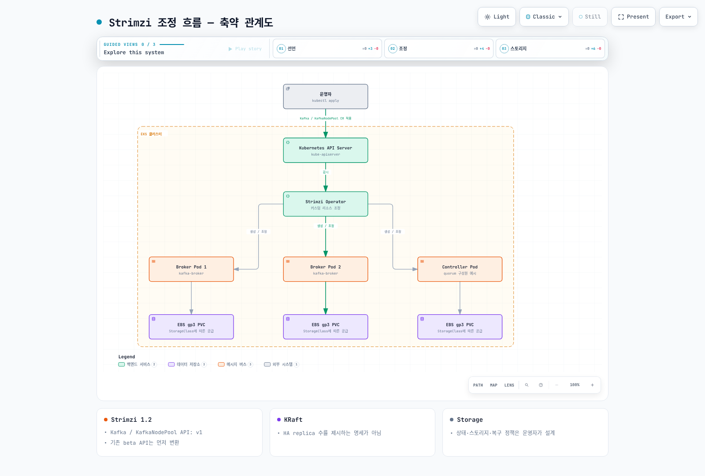

# Kafka on EKS 딥다이브

## 개요

이 가이드는 Apache Kafka를 EKS에서 직접 운영하는 선택지로 Strimzi Operator를 사용합니다. Operator는 Pod, 스토리지, listener, 인증서와 업그레이드를 조정하지만 데이터·가용성·보안 정책의 운영 책임을 모두 대신하지 않습니다. Amazon MSK 같은 관리형 선택지는 Part 6에서 비교합니다.

> **검토 기준**: 2026-09-12. Strimzi 1.2.0 / Kafka 4.3.1.
> **업그레이드 주의**: Strimzi 1.0 이상은 CRD API `v1`만 지원합니다. 기존 `v1beta2`/`v1beta1`/`v1alpha1` 리소스는 공식 전환 절차로 변환하고 CRD를 준비한 뒤 Operator를 업그레이드해야 합니다. 버전 번호만 교체하는 업그레이드가 아닙니다.

Strimzi 1.2.0의 지원 Kafka 버전은 4.2.0, 4.2.1, 4.3.0, 4.3.1이며 기본값은 4.3.1입니다. 이 문서에서는 호환되는 조합을 고정하며, 설치 시 배포판·Kubernetes 버전과 업그레이드 경로를 함께 확인합니다.

## 핵심 아키텍처 개념

브로커는 토픽의 파티션 복제본을 저장합니다. KafkaConsumer 그룹은 파티션을 나누어 처리하며 소비자 하나가 여러 파티션을 맡을 수 있습니다. 별도의 controller quorum은 메타데이터 Raft 로그를 관리합니다.

KRaft는 2.8에서 early access로 도입되어 3.3에서 production-ready가 되었고 Kafka 4.0부터 ZooKeeper 모드가 제거되었습니다. 전용 controller와 broker를 분리할 수 있으며, ZooKeeper 제거가 controller·스토리지·장애 복구 운영까지 없애지는 않습니다.

사용자는 `Kafka`, `KafkaNodePool` 같은 커스텀 리소스를 선언하고 Strimzi가 실제 Pod·PVC·Service·Secret을 조정합니다. 다음 그림은 이 관계를 축약한 도식이며 실제 HA replica 수를 제안하는 배포 명세가 아닙니다.

[인터랙티브 다이어그램 보기](https://www.atomai.click/kubernetes-docs/archmaps/ko-data-on-eks-kafka-readme-0.html)

## 딥다이브 목차

**[1. Kafka 핵심 개념](01-kafka-fundamentals.md)**
- 브로커, 토픽/파티션 구조
- 복제(Replication)와 내구성 보장
- 컨슈머 그룹과 오프셋 관리
- KRaft 컨트롤러 쿼럼 아키텍처

**[2. Strimzi Operator](02-strimzi-operator.md)**
- Strimzi 설치 및 초기 구성
- `Kafka`, `KafkaNodePool` CRD 상세
- EKS 클러스터에 Kafka 배포하기

**[3. Kafka 운영](03-kafka-operations.md)**
- EBS/gp3 기반 스토리지 설계
- 브로커 스케일링 전략
- Cruise Control을 활용한 파티션 리밸런싱
- 호환성과 가용성을 고려한 롤링 업그레이드

**[4. 스키마 레지스트리](04-schema-registry.md)**
- Avro/Protobuf 스키마 설계
- Karapace, Apicurio Registry 비교
- 호환성 전략: BACKWARD/FORWARD/FULL

**[5. Kafka Connect와 MirrorMaker](05-kafka-connect-mirrormaker.md)**
- Kafka Connect 배포 및 커넥터 구성
- 소스/싱크 커넥터 운영
- MirrorMaker2를 사용한 재해복구 및 지역 간 복제

**[6. MSK 통합](06-msk-integration.md)**
- Amazon MSK vs Strimzi 셀프 매니지드 비교
- MSK Connect 활용
- Kinesis Data Streams와의 연동 및 비교

**[7. 모니터링](07-monitoring.md)**
- Prometheus/Grafana 기반 브로커 메트릭 수집
- 컨슈머 랙(Consumer Lag) 모니터링
- KEDA 기반 컨슈머 오토스케일링 연동

**[8. 모범 사례](08-best-practices.md)**
- 파티션 수/키 설계 전략
- 프로듀서/컨슈머 성능 튜닝
- mTLS/SASL 기반 보안 구성
- 스토리지·인스턴스 비용 최적화

**[9. Kafka 실측 벤치마크](09-kafka-benchmark.md)**
- gp3 볼륨 위 3-브로커 KRaft 클러스터의 RF3 vs RF1 ingest 상한 실측
- acks=0/1/all 설정별 처리량·p99 레이턴시 트레이드오프
- 압축 코덱·레코드 크기에 따른 처리량과 CPU 비용
- 콜드 컨슈머·혼합 워크로드가 프로듀서 처리량에 미치는 영향

## 참고 자료

- [Strimzi 1.2.0 release](https://github.com/strimzi/strimzi-kafka-operator/releases/tag/1.2.0)

- [Strimzi 공식 문서](https://strimzi.io/docs/operators/1.2.0/overview.html)
- [Apache Kafka 공식 문서](https://kafka.apache.org/43/design/design/)
- [KRaft 운영 가이드](https://kafka.apache.org/43/operations/kraft/)
- [AWS Data on EKS 프로젝트](https://awslabs.github.io/data-on-eks/)

## 퀴즈

이 섹션에서 배운 내용을 테스트하려면 [Kafka 핵심 개념 퀴즈](../../quizzes/data-on-eks/kafka/01-kafka-fundamentals-quiz.md)를 풀어보세요. 벤치마크 수치를 근거로 설계 판단을 내릴 수 있는지 확인하려면 [Kafka 실측 벤치마크 퀴즈](../../quizzes/data-on-eks/kafka/09-kafka-benchmark-quiz.md)도 함께 풀어보세요.
