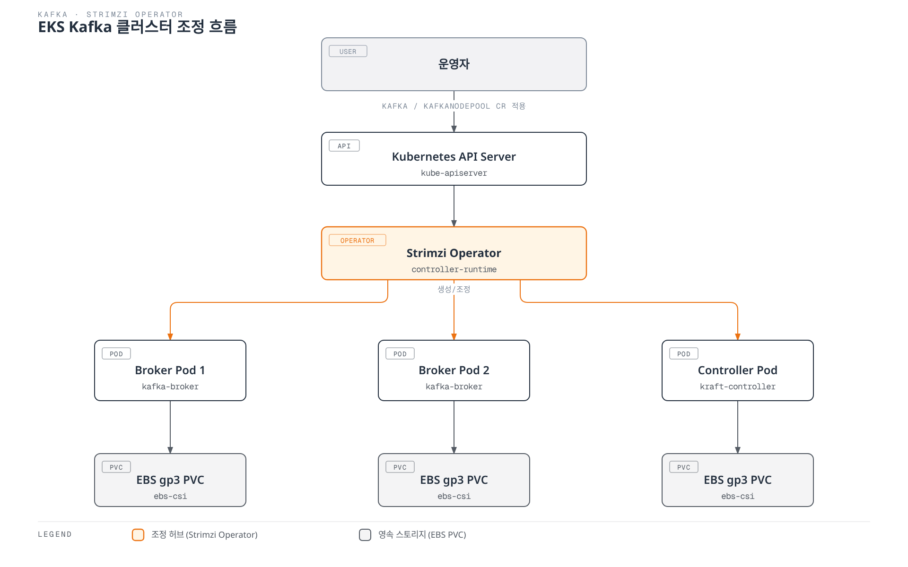

# Kafka on EKS 딥다이브

## 개요

Apache Kafka는 이벤트 기반 아키텍처와 실시간 스트리밍 파이프라인의 백본 역할을 하는 분산 이벤트 스트리밍 플랫폼입니다. 마이크로서비스 간 비동기 통신, 로그/메트릭 집계, CDC(Change Data Capture) 파이프라인 등 폭넓은 용도로 쓰이며, EKS 환경에서는 raw StatefulSet을 직접 관리하는 대신 **Strimzi Kubernetes Operator**를 사용하는 것이 표준적인 접근 방식입니다. Strimzi는 Kafka 클러스터의 생성, 스케일링, 롤링 업그레이드, 인증서 관리, 랙 인식(rack awareness) 배치 등 운영 전반을 CRD(Custom Resource Definition) 기반으로 선언적으로 관리할 수 있게 해줍니다.

> **지원 버전**: Kafka 3.7-3.9 (KRaft), Strimzi Operator 0.45+
> **마지막 업데이트**: 2026년 7월 9일

## 핵심 아키텍처 개념

Kafka 클러스터는 **브로커(Broker)** 라는 프로세스 집합으로 구성됩니다. 각 브로커는 하나 이상의 **토픽(Topic)** 을 저장하며, 토픽은 병렬 처리와 확장성을 위해 여러 **파티션(Partition)** 으로 나뉘고, 각 파티션은 내구성을 위해 다른 브로커에 복제본(replica)을 유지합니다. 프로듀서는 파티션에 메시지를 기록하고, **컨슈머 그룹(Consumer Group)** 은 파티션을 나눠 병렬로 메시지를 소비하면서 오프셋(offset)을 통해 처리 위치를 추적합니다.

과거 Kafka는 클러스터 메타데이터(토픽, 파티션 할당, ACL 등)를 관리하기 위해 별도의 ZooKeeper 앙상블이 필요했습니다. Kafka 3.x부터 도입된 **KRaft(Kafka Raft)** 모드는 ZooKeeper 없이 Kafka 자체의 Raft 기반 컨트롤러 쿼럼(quorum)이 메타데이터를 관리하도록 하여, 운영해야 할 컴포넌트를 줄이고 컨트롤러 페일오버 속도를 크게 개선합니다. Kafka 4.0부터는 ZooKeeper 지원이 완전히 제거되어 KRaft가 유일한 메타데이터 관리 방식이 되었으므로, 신규로 EKS에 Kafka를 구축한다면 처음부터 KRaft 모드를 전제로 설계해야 합니다.

Strimzi는 이 모든 구성 요소를 Kubernetes 리소스로 감쌉니다. 사용자는 `Kafka`, `KafkaNodePool` 같은 CRD에 원하는 상태를 선언하고, Strimzi Operator가 이를 감지하여 브로커/컨트롤러 Pod, PVC, Service, Secret 등을 실제로 생성·조정합니다.

## 딥다이브 목차

**[1. Kafka 핵심 개념](01-kafka-fundamentals.md)**
- 브로커, 토픽/파티션 구조
- 복제(Replication)와 내구성 보장
- 컨슈머 그룹과 오프셋 관리
- KRaft 컨트롤러 쿼럼 아키텍처

**[2. Strimzi Operator](02-strimzi-operator.md)**
- Strimzi 설치 및 초기 구성
- `Kafka`, `KafkaNodePool` CRD 상세
- EKS 클러스터에 Kafka 배포하기

**[3. Kafka 운영](03-kafka-operations.md)**
- EBS/gp3 기반 스토리지 설계
- 브로커 스케일링 전략
- Cruise Control을 활용한 파티션 리밸런싱
- 무중단 롤링 업그레이드

**[4. 스키마 레지스트리](04-schema-registry.md)**
- Avro/Protobuf 스키마 설계
- Karapace, Apicurio Registry 비교
- 호환성 전략: BACKWARD/FORWARD/FULL

**[5. Kafka Connect와 MirrorMaker](05-kafka-connect-mirrormaker.md)**
- Kafka Connect 배포 및 커넥터 구성
- 소스/싱크 커넥터 운영
- MirrorMaker2를 사용한 재해복구 및 지역 간 복제

**[6. MSK 통합](06-msk-integration.md)**
- Amazon MSK vs Strimzi 셀프 매니지드 비교
- MSK Connect 활용
- Kinesis Data Streams와의 연동 및 비교

**[7. 모니터링](07-monitoring.md)**
- Prometheus/Grafana 기반 브로커 메트릭 수집
- 컨슈머 랙(Consumer Lag) 모니터링
- KEDA 기반 컨슈머 오토스케일링 연동

**[8. 모범 사례](08-best-practices.md)**
- 파티션 수/키 설계 전략
- 프로듀서/컨슈머 성능 튜닝
- mTLS/SASL 기반 보안 구성
- 스토리지·인스턴스 비용 최적화

## 참고 자료

- [Strimzi 공식 문서](https://strimzi.io/docs/operators/latest/overview)
- [Apache Kafka 공식 문서](https://kafka.apache.org/documentation/)
- [KIP-500: ZooKeeper를 대체하는 KRaft](https://cwiki.apache.org/confluence/display/KAFKA/KIP-500)
- [AWS Data on EKS 프로젝트](https://awslabs.github.io/data-on-eks/)

## 퀴즈

이 섹션에서 배운 내용을 테스트하려면 [Kafka 핵심 개념 퀴즈](../../quizzes/data-on-eks/kafka/01-kafka-fundamentals-quiz.md)를 풀어보세요.
