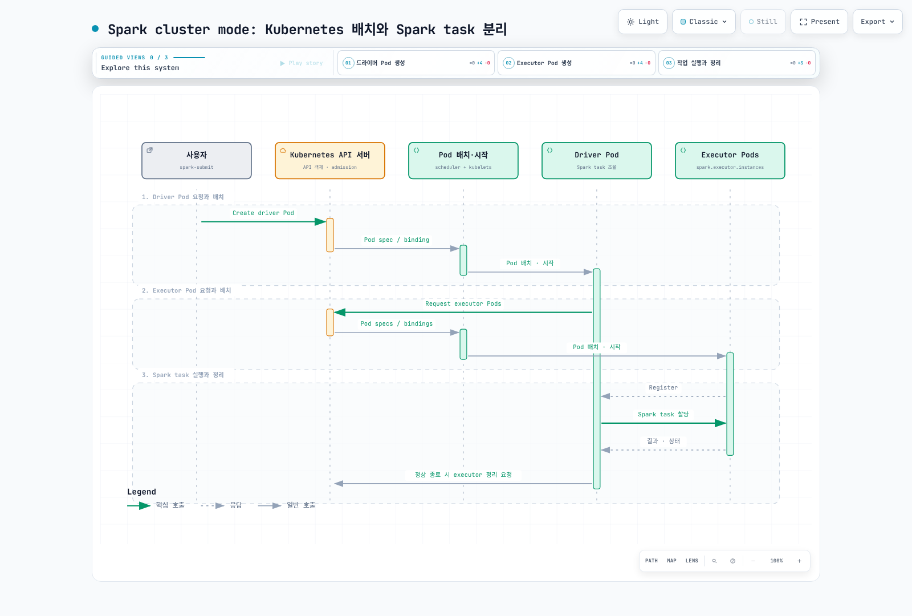

# Part 1: Spark on Kubernetes 기초

> **검토 기준**: Spark 4.2.0, Kubernetes 1.34+; 예제 이미지는 Java 21\
> **최종 검토**: 2026년 9월 12일

## Cluster mode와 client mode

Kubernetes는 Spark의 **두 배포 모드 모두** 지원합니다. Client mode는 Spark
2.4부터 지원되며 notebook만을 위한 기능이 아닙니다.

| 모드 | Driver 위치 | 운영 시 고려사항 |
| --- | --- | --- |
| Cluster | 제출로 생성한 driver Pod | 제출자 API 접근과 driver 자체의 service account/RBAC 필요 |
| Client | 제출 애플리케이션의 Pod 또는 호스트 | Executor에서 광고된 driver RPC·block-manager 주소로 접근하고 driver가 살아 있어야 함 |

Kubernetes API에 접근할 수 있다는 사실만으로 executor→driver 통신이 완성되지는
않습니다. Client mode는 안정적인 Service·hostname과 고정 포트가 필요할 수
있습니다. Driver가 Pod에서 실행되면 executor owner reference 정리를 위해
**실제 driver Pod 이름**을 설정합니다. 외부 호스트 driver에 가상의 Pod owner를
설정하지 않습니다.

## 무엇을 누가 스케줄링하는가?

API server는 인증·admission과 객체 저장을 담당하고, Kubernetes scheduler가
노드를 선택하며 kubelet이 컨테이너를 시작합니다. Spark driver는 executor Pod를
요청하고 Spark scheduler로 stage/task를 조율합니다. 서로 다른 계층입니다.



[인터랙티브 다이어그램](https://www.atomai.click/kubernetes-docs/archmaps/ko-data-on-eks-spark-01-spark-fundamentals-0.html)

1. 제출자가 driver Pod와 관련 리소스를 요청합니다.
2. Kubernetes가 driver를 배치·시작하면 driver가 executor Pod를 요청합니다.
3. Kubernetes가 executor를 배치·시작하고 executor는 driver에 등록합니다.
4. Driver가 Spark task를 할당하고 executor가 실행·결과·상태를 보고합니다.
5. 정상 종료 시 Spark가 설정에 따라 executor를 정리합니다. 완료·실패한 driver
   Pod는 로그용으로 남을 수 있습니다. 실패·owner reference 동작을 고려하며 모든
   리소스가 즉시 지워진다고 가정하지 않습니다.

별도 YARN·Spark Standalone 제어 계층은 줄지만 Kubernetes 용량·노드·스토리지·
네트워크·이미지 운영 자체가 없어지지는 않습니다.

## 구체적인 cluster mode 예제

로컬 Spark 4.2.0, 호환 kubectl·현재 kubeconfig context, Kubernetes 1.34+,
namespace 용량과 이미지 접근을 전제로 합니다. 제출자의 API 인증과 클러스터 안
driver RBAC는 별개입니다. SparkPi는 AWS 데이터 권한이 필요 없지만 S3 작업은
선택한 워크로드 ID와 호환 Hadoop/AWS 라이브러리를 추가로 준비합니다.

Namespace 관리자가 `rbac.yaml`을 검토·적용합니다.

```yaml
apiVersion: v1
kind: Namespace
metadata:
  name: spark-jobs
---
apiVersion: v1
kind: ServiceAccount
metadata:
  name: spark-driver
  namespace: spark-jobs
---
apiVersion: v1
kind: ServiceAccount
metadata:
  name: spark-executor
  namespace: spark-jobs
automountServiceAccountToken: false
---
apiVersion: rbac.authorization.k8s.io/v1
kind: Role
metadata:
  name: spark-driver
  namespace: spark-jobs
rules:
- apiGroups:
  - ''
  resources:
  - pods
  - services
  - configmaps
  verbs:
  - create
  - get
  - list
  - watch
  - delete
  - patch
---
apiVersion: rbac.authorization.k8s.io/v1
kind: RoleBinding
metadata:
  name: spark-driver
  namespace: spark-jobs
roleRef:
  apiGroup: rbac.authorization.k8s.io
  kind: Role
  name: spark-driver
subjects:
- kind: ServiceAccount
  name: spark-driver
  namespace: spark-jobs
```

이 역할은 동적 PVC가 없는 기본 예제용입니다. 추가 볼륨·리소스 관리 기능에는
해당 범위의 권한이 필요할 수 있습니다. Executor는 API token 자동 마운트를 끈
별도 service account를 사용합니다. Driver가 Pod를 만들 수 있는 namespace에는
신뢰하는 작업 코드·제출자만 허용합니다. RBAC만으로 비신뢰 코드를 격리하지는 못합니다.

다음은 `kubectl apply`할 독립 Pod가 아닌 **Pod template**입니다. Spark가
이미지·명령과 다른 필드를 채웁니다.

Driver template, `driver-template.yaml`:

```yaml
apiVersion: v1
kind: Pod
metadata:
  name: spark-driver-template
spec:
  securityContext:
    runAsNonRoot: true
    runAsUser: 185
    runAsGroup: 185
    seccompProfile:
      type: RuntimeDefault
  containers:
  - name: spark-kubernetes-driver
    securityContext:
      allowPrivilegeEscalation: false
      capabilities:
        drop:
        - ALL
```

Executor template, `executor-template.yaml`:

```yaml
apiVersion: v1
kind: Pod
metadata:
  name: spark-executor-template
spec:
  securityContext:
    runAsNonRoot: true
    runAsUser: 185
    runAsGroup: 185
    seccompProfile:
      type: RuntimeDefault
  containers:
  - name: spark-kubernetes-executor
    securityContext:
      allowPrivilegeEscalation: false
      capabilities:
        drop:
        - ALL
  automountServiceAccountToken: false
  terminationGracePeriodSeconds: 60
```

파일은 **제출 프로세스**에서 읽을 수 있어야 합니다. Cluster mode에서는 Spark가
executor template을 driver에 마운트하도록 준비합니다. 일부 필드는 Spark가
덮어쓰므로 template·operator webhook·Spark 설정을 조합하면 실제 생성 Pod를 확인합니다.

```bash
#!/bin/bash
set -euo pipefail
# Run in the directory containing driver-template.yaml and executor-template.yaml.
KUBE_CONTEXT="$(kubectl config current-context)"
KUBE_API_URL="$(kubectl --context "$KUBE_CONTEXT" config view --minify -o jsonpath='{.clusters[0].cluster.server}')"
case "$KUBE_API_URL" in https://*) ;; *) echo "Expected an HTTPS Kubernetes API URL" >&2; exit 1;; esac
SPARK_APP_NAME="spark-pi-$(date -u +%Y%m%d%H%M%S)"
spark-submit \
  --master "k8s://${KUBE_API_URL}" \
  --deploy-mode cluster \
  --name "$SPARK_APP_NAME" \
  --class org.apache.spark.examples.SparkPi \
  --conf "spark.kubernetes.context=$KUBE_CONTEXT" \
  --conf spark.kubernetes.namespace=spark-jobs \
  --conf spark.kubernetes.container.image=spark:4.2.0-scala2.13-java21-ubuntu \
  --conf spark.kubernetes.authenticate.driver.serviceAccountName=spark-driver \
  --conf spark.kubernetes.authenticate.executor.serviceAccountName=spark-executor \
  --conf "spark.kubernetes.driver.pod.name=$SPARK_APP_NAME-driver" \
  --conf spark.kubernetes.driver.podTemplateFile=driver-template.yaml \
  --conf spark.kubernetes.executor.podTemplateFile=executor-template.yaml \
  --conf spark.kubernetes.executor.terminationGracePeriodSeconds=60s \
  --conf spark.driver.cores=1 \
  --conf spark.driver.memory=1g \
  --conf spark.kubernetes.driver.limit.cores=1 \
  --conf spark.executor.cores=1 \
  --conf spark.executor.memory=1g \
  --conf spark.kubernetes.executor.limit.cores=1 \
  --conf spark.executor.instances=3 \
  local:///opt/spark/examples/jars/spark-examples.jar 10
kubectl -n spark-jobs logs "$SPARK_APP_NAME-driver"
kubectl -n spark-jobs get pod "$SPARK_APP_NAME-driver" -o jsonpath='{.status.phase}{"\n"}'
```

제출 전에 rbac.yaml을 적용합니다. 버전을 고정한 공식 이미지에는
spark-examples.jar 심볼릭 링크가 있습니다. local:///는 노트북의 로컬 파일을
업로드한다는 뜻이 아니라 컨테이너에 이미 있는 경로입니다. 필요하면 기존 공급망
절차에 따라 이미지를 복제·digest 고정합니다. 새 driver 이름과 선택 context를
문제 조사에 사용할 수 있도록 기록합니다.

고정 executor 3개를 요청해도 quota·admission·스케줄링·이미지 pull·노드 용량 때문에
Pending일 수 있습니다. Driver·executor event와 로그를 확인하며 spark-submit 실행만으로
작업 성공을 판단하지 않습니다.

## 리소스 요청·제한과 task slot

| Spark 설정 | Kubernetes의 기본 ResourceProfile 동작 |
| --- | --- |
| spark.driver.cores | 별도 지정 없으면 driver CPU request |
| spark.executor.cores | Executor task 용량과 기본 CPU request |
| spark.kubernetes.{driver,executor}.request.cores | Kubernetes CPU request 재정의; Spark task slot 자체는 아님 |
| spark.kubernetes.{driver,executor}.limit.cores | 명시적인 CPU limit; cores만으로 자동 생성되지 않음 |
| Driver memory | Heap과 지정·계산한 overhead를 더한 request·limit |
| Executor memory | Heap·overhead와 적용되는 off-heap/PySpark memory를 합산한 request·limit |

JVM 예제는 heap 1GiB에 기본 최소 overhead 384MiB를 더해 **1,408MiB**가 됩니다.
검증한 기본 계산이지 모든 작업의 적정 크기는 아닙니다. Python·native memory와
custom ResourceProfile은 따로 검토합니다. Task 용량보다 CPU request를 낮추면
경합할 수 있으며 request 변경과 실행 가능한 Spark task 수 변경은 다릅니다.

## Dynamic Resource Allocation

Spark DRA는 task backlog·idle 상태에 따라 **executor 수**를 바꿉니다.
장치용 Kubernetes DRA나 Pending Pod에 대응하는 노드 autoscaler와 구분합니다.

기본 Spark on Kubernetes는 YARN 방식의 external shuffle service를 지원하지
않습니다. Shuffle tracking은 지원되는 선택이지만 Spark의 유일한 방식은 아닙니다.
Decommission 기반 shuffle 보존과 적절한 reliable ShuffleDataIO 구현도 각자의
조건을 가진 대안입니다.

Shuffle tracking 프로필:

```properties
spark.dynamicAllocation.enabled=true
spark.dynamicAllocation.shuffleTracking.enabled=true
spark.dynamicAllocation.minExecutors=2
spark.dynamicAllocation.initialExecutors=3
spark.dynamicAllocation.maxExecutors=20
spark.kubernetes.allocation.batch.size=5
```

--conf 또는 properties 파일로 추가합니다. Shuffle tracking은 Spark 3.0부터이며
4.2에서는 **이미 기본값 true**입니다. 명시는 선택을 문서화합니다. 두 플래그를
언제나 명시해야 한다는 기존 설명은 틀립니다.

Tracking은 활성 shuffle 데이터를 가진 executor를 유지하려 하지만 설정한
tracking·cached-executor idle timeout, 강제 종료와 노드 장애로 재계산이 발생할 수
있습니다. 영속 공유 저장소가 아닙니다. 보존 방식을 중복해서 켜면 executor 회수가
지연될 수 있어 상호작용을 시험해야 합니다.

초기 수는 minExecutors·initialExecutors와 기존 spark.executor.instances를
고려합니다. 예제의 고정 3개와 initial 3개는 일치하며 min=2가 처음에 반드시 2개를
실행한다는 뜻은 아닙니다.

spark.kubernetes.allocation.batch.size는 Pod 요청 batch를 제어하며 EC2 확장
정책 자체는 아닙니다. API throttling, Pod 할당 간격, ResourceQuota, 배치 조건과
노드 프로비저닝은 별도로 작동합니다.

## Decommission의 동작과 한계

다음은 executor·block manager decommission과 적용 가능한 RDD/shuffle block
이전을 활성화합니다.

```properties
spark.decommission.enabled=true
spark.storage.decommission.enabled=true
spark.storage.decommission.rddBlocks.enabled=true
spark.storage.decommission.shuffleBlocks.enabled=true
spark.kubernetes.executor.terminationGracePeriodSeconds=60s
```

이 Spark 4.2 Kubernetes 경로에서는 decommission을 켜면
**preStop hook이 자동 추가**되어 spark.kubernetes.decommission.script
(기본 /opt/decom.sh)를 실행합니다. 공식 이미지에 이 스크립트가 포함되어 있으며
executor JVM을 찾아 **SIGPWR**를 보내고 기다립니다. Spark의 기본 종료 신호도
PWR입니다. 평범한 SIGTERM이 언제나 데이터를 이전한다고 가정하는 대신 hook 경로를
구분해야 합니다.

Custom image에는 동작하는 스크립트·도구가 필요하고 신호를 바꾸면 스크립트도
맞춰야 합니다. Spark는 template의 lifecycle을 덮어쓸 수 있습니다. 실제 hook을
확인하고 계획된 축소·중단 경로를 모두 시험합니다.

제출 예제는 `spark.kubernetes.executor.terminationGracePeriodSeconds=60s`를
명시합니다. Spark 4.2는 template 값을 이 설정으로 덮어쓰며 기본값은 30초입니다.
따라서 template에 terminationGracePeriodSeconds:60만 적는 것으로는 부족합니다.
유예 시간에는 preStop 실행도 포함됩니다.
이전 완료나 Spot 종료 기한 연장을 보장하는 시간이 아닙니다. 정상적인 대상
executor, 디스크·네트워크 용량, 시간과 필요한 fallback 저장소가 있어야 합니다.
강제 삭제·노드 소실은 이전 기회를 없앨 수도 있습니다. 동적 할당의 삭제 경로 등에서
명시한 deletion grace도 실제 시간 예산을 바꿀 수 있습니다.

이 플래그는 driver 장애 재시작, 애플리케이션 checkpoint나 전체 경로의 exactly-once
출력을 보장하지 않습니다. 재계산 가능한 중간 블록과 영속 입출력을 구분해 복구를 설계합니다.

## 참고 자료와 검증 범위

Driver를 loopback에 묶고 UI를 끈 로컬 SparkPi 작업을 실행했습니다.
Spark 4.2의 실제 feature-step 검사로 메모리 매핑, CPU limit 기본 동작과
decommission hook 주입을 확인했으며 Kubernetes client는 생성하지 않았습니다.
이 검사는 EKS 제출·RBAC/CNI 집행·실제 이전 완료·AWS 데이터 접근 성공을 뜻하지 않습니다.

- [Spark 4.2.0 on Kubernetes](https://spark.apache.org/docs/4.2.0/running-on-kubernetes.html)
- [Spark 4.2.0 configuration](https://spark.apache.org/docs/4.2.0/configuration.html)
- [Spark 4.2.0 dynamic allocation alternatives](https://spark.apache.org/docs/4.2.0/job-scheduling.html#dynamic-resource-allocation)
- [Driver resource mapping](https://github.com/apache/spark/blob/v4.2.0/resource-managers/kubernetes/core/src/main/scala/org/apache/spark/deploy/k8s/features/BasicDriverFeatureStep.scala)
- [Executor resources and decommission hook](https://github.com/apache/spark/blob/v4.2.0/resource-managers/kubernetes/core/src/main/scala/org/apache/spark/deploy/k8s/features/BasicExecutorFeatureStep.scala)
- [Official decommission script](https://github.com/apache/spark/blob/v4.2.0/resource-managers/kubernetes/docker/src/main/dockerfiles/spark/decom.sh)
- [Official Spark image tags](https://github.com/docker-library/official-images/blob/master/library/spark)

## 다음 단계

[Part 2: Spark Operator](./02-spark-operator.md)

[메인 페이지로 돌아가기](./README.md)

## 퀴즈

[주제 퀴즈](../../quizzes/data-on-eks/spark/01-spark-fundamentals-quiz.md)
