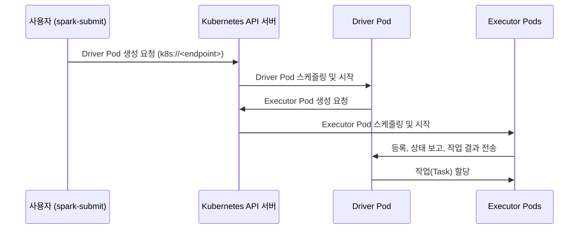

# Part 1: Spark on Kubernetes 기초

> **지원 버전**: Apache Spark 4.2, Kubernetes 1.30+\
> **마지막 업데이트**: 2026년 7월 15일

## 실습 환경 준비

이 문서의 예제를 따라 하려면 다음 도구와 환경이 필요합니다.

### 필수 도구

* kubectl v1.30 이상
* 사용 가능한 Kubernetes 클러스터 (Amazon EKS 권장)
* 로컬에 설치된 Apache Spark 4.2 배포판 (클러스터로 `spark-submit`을 실행하기 위함)
* 드라이버/executor Pod가 S3 등 AWS 서비스에 접근해야 한다면, Kubernetes 서비스 어카운트에 연결된 IAM 역할 (IRSA 또는 EKS Pod Identity)

## Spark on Kubernetes란 무엇인가?

Apache Spark는 대규모 배치·스트리밍 워크로드를 처리하는 분산 데이터 처리 엔진입니다. Spark 2.3부터 Kubernetes는 Standalone, YARN, Mesos(이후 지원 종료)와 함께 **네이티브 클러스터 매니저**로 지원되고 있습니다. Spark를 Kubernetes 위에서 운영한다는 것은, 다른 워크로드를 스케줄링하는 것과 동일한 Kubernetes API로 Spark의 드라이버와 executor Pod까지 스케줄링한다는 의미입니다. 별도의 Spark 클러스터 인프라를 구축하거나 유지 관리할 필요가 없습니다.

이 문서는 EKS에서 실제 Spark 작업을 배포하기 전에 이해해야 할 핵심 개념을 다룹니다: `spark-submit`이 어떻게 Pod로 매핑되는지, 별도의 클러스터 매니저가 아니라 드라이버가 직접 스케줄링을 담당하는 이유, DRA(Dynamic Resource Allocation)가 YARN과 Kubernetes에서 왜 다르게 동작하는지, 그리고 Pod가 종료되려 할 때 정상 종료(graceful decommission)가 실행 중인 작업을 어떻게 보호하는지를 살펴봅니다. Part 2에서는 이 개념들을 Kubernetes 네이티브 CRD 기반 워크플로로 감싸는 Spark Operator를 다룹니다.

## 1. Kubernetes에서는 클러스터 모드만 지원되는 제출 방식

### Kubernetes에서 spark-submit이 동작하는 방식

Kubernetes는 `spark-submit`에 대해 **클러스터 배포 모드(cluster deploy mode)**만 지원합니다. 즉 드라이버 자체가 제출 명령을 실행한 머신이 아니라 클러스터 내부의 Pod에서 실행됩니다(클라이언트 모드도 존재하지만 주로 spark-shell이나 노트북 같은 대화형 도구에 사용됩니다). 일반적인 제출 명령은 다음과 같습니다.

```bash
spark-submit \
  --master k8s://https://<EKS_API_SERVER_ENDPOINT>:443 \
  --deploy-mode cluster \
  --name spark-etl-job \
  --class com.example.ETLJob \
  --conf spark.kubernetes.namespace=spark-jobs \
  --conf spark.kubernetes.container.image=<ECR_IMAGE_URI> \
  --conf spark.kubernetes.authenticate.driver.serviceAccountName=spark-driver \
  --conf spark.executor.instances=4 \
  local:///opt/spark/jobs/etl-job.jar
```

`k8s://<endpoint>` 형태의 마스터 URL은 `spark-submit`이 Kubernetes API 서버를 바라보게 만듭니다. 제출 이후의 흐름은 다음과 같습니다.



1. `spark-submit`은 Kubernetes API 서버와 직접 통신하여 **드라이버 Pod**를 곧바로 생성합니다. 중간에 별도의 스케줄링 프로세스가 개입하지 않습니다.
2. 드라이버 Pod가 실행되면, 드라이버 스스로가 Kubernetes API를 다시 호출해 필요한 **executor Pod**를 생성합니다. 이때 기준이 되는 값은 `spark.executor.instances`이거나, 뒤에서 다룰 Dynamic Resource Allocation입니다.
3. executor들은 드라이버에 등록한 뒤 할당받은 작업을 실행하고, 결과와 상태를 드라이버에 다시 보고합니다.
4. 작업이 끝나면 드라이버의 Spark 컨텍스트가 종료되면서 자신이 생성했던 executor Pod들을 정리합니다.

### YARN보다 단순한 이유와 그 대신 옮겨가는 책임

YARN에서 작업을 제출하면 상시 실행 중인 **ResourceManager**와 통신하게 되고, ResourceManager는 노드마다 떠 있는 **NodeManager** 데몬으로부터 컨테이너를 협상해 ApplicationMaster에 넘겨주며, ApplicationMaster가 다시 해당 작업의 executor들을 관리합니다. Kubernetes는 이 계층 자체를 없앱니다. 설치하고 업그레이드하고 고가용성을 유지해야 할, Spark 전용의 상시 실행 클러스터 매니저 데몬이 존재하지 않습니다. 이미 다른 모든 워크로드를 위해 운영하고 있는 Kubernetes 컨트롤 플레인이 곧 Spark에 필요한 유일한 "클러스터 매니저"가 됩니다.

다만 그 대신 스케줄링과 리소스 할당의 책임이 **드라이버 Pod 자신**에게 넘어갑니다. 드라이버는 스스로 스케줄러 역할을 수행합니다 — Kubernetes API에 executor Pod 생성 요청을 직접 보내고, 어떤 executor가 살아 있는지 추적하며, executor가 실패하면 대체 Pod를 요청하는 주체가 바로 드라이버입니다. 운영 관점에서는 관리해야 할 구성 요소가 줄어든다는 점에서 확실히 더 단순하지만, 동시에 드라이버 Pod의 권한(서비스 어카운트를 통해 부여됨)과 API 서버에 접근할 수 있는지 여부가 작업 전체의 성패를 좌우하는 요소가 됩니다. 드라이버 Pod가 executor Pod를 생성하거나 감시(watch)할 수 없다면 어떤 작업도 스케줄링되지 않습니다.

### 드라이버·Executor Pod의 리소스 모델

드라이버와 executor는 각각 평범한 Pod로 실행되며, Spark의 표준 리소스 설정은 Kubernetes Pod의 표준 리소스 필드로 매핑됩니다.

| Spark 설정 | Kubernetes에서의 효과 |
| --- | --- |
| `spark.driver.cores`, `spark.driver.memory` | 드라이버 Pod 컨테이너의 CPU/메모리 요청(및 오버헤드를 더한 제한값) |
| `spark.executor.cores`, `spark.executor.memory` | 각 executor Pod 컨테이너의 CPU/메모리 요청/제한값 |
| `spark.kubernetes.driver.request.cores` / `.limit.cores` | `spark.driver.cores`와 별도로 드라이버 컨테이너의 Kubernetes CPU 요청/제한값을 재정의 |
| `spark.kubernetes.executor.request.cores` / `.limit.cores` | executor Pod에 대해 동일한 방식으로 재정의 |

모든 워크로드에 공통으로 맞는 만능 기본값은 없습니다. 드라이버/executor의 적절한 크기는 작업의 셔플 데이터량, 파티션 수, 작업당 필요한 메모리에 따라 달라집니다. 이 설정들은 다른 작업의 값을 그대로 복사해 쓸 대상이 아니라, 실제 워크로드를 대상으로 테스트하며 튜닝해야 할 값으로 다루는 것이 안전합니다.

## 2. Kubernetes에서의 Dynamic Resource Allocation(DRA)

### Kubernetes에서 DRA에 별도 설정이 필요한 이유

Dynamic Resource Allocation은 작업이 실행되는 동안 executor 수를 동적으로 늘리거나 줄여주는 기능입니다. 대기 중인 작업이 쌓이면 executor를 추가하고, 유휴 상태인 executor는 제거해 클러스터 자원을 돌려줍니다. YARN에서는 이 기능이 오래전부터 매끄럽게 동작했는데, YARN의 NodeManager가 **External Shuffle Service(ESS)**라는 데몬을 함께 운영하기 때문입니다. ESS는 특정 executor의 생명주기와 무관하게 독립적으로 동작하며, 셔플 데이터를 만든 executor가 제거된 뒤에도 해당 셔플 블록을 계속 서빙할 수 있습니다.

Kubernetes에는 이에 대응하는 내장 데몬이 없습니다. ESS가 없는 상태에서 DRA의 스케일 다운 로직이 다른 작업이 필요로 하는 셔플 블록을 여전히 들고 있는 executor를 제거해 버리면, 그 블록은 사라지고 해당 데이터를 필요로 하는 작업은 실패하며 비용이 큰 재계산이 강제됩니다. 이 때문에 Kubernetes에서 DRA를 활성화할 때는 다음 두 설정을 **함께** 켜야 합니다. 둘 중 하나만 켜면 이 구멍이 그대로 남습니다.

```properties
spark.dynamicAllocation.enabled=true
spark.dynamicAllocation.shuffleTracking.enabled=true
```

`spark.dynamicAllocation.shuffleTracking.enabled`(Spark 3.3.0부터 안정화)는 아직 끝나지 않은 다른 작업이 의존하는 셔플 블록을 어떤 executor가 들고 있는지를 Spark가 직접 추적하게 합니다. 셔플 트래킹이 켜져 있으면 스케일 다운 로직은 필요한 셔플 데이터를 여전히 들고 있는 executor를 제거하지 않으며, 해당 블록이 더 이상 필요 없어지거나 작업이 끝날 때까지 그 executor의 Pod 회수를 미룹니다.

### 튜닝 옵션

| 설정 | 목적 |
| --- | --- |
| `spark.dynamicAllocation.minExecutors` | DRA가 축소할 수 있는 executor 수의 하한선 |
| `spark.dynamicAllocation.maxExecutors` | DRA가 확장할 수 있는 executor 수의 상한선 |
| `spark.kubernetes.allocation.batch.size` | 드라이버가 한 번에 Kubernetes API로 보내는 executor Pod 생성 요청 수 — 얼마나 공격적으로 확장할지를 제어 |

```properties
spark.dynamicAllocation.enabled=true
spark.dynamicAllocation.shuffleTracking.enabled=true
spark.dynamicAllocation.minExecutors=2
spark.dynamicAllocation.maxExecutors=20
spark.kubernetes.allocation.batch.size=5
```

`spark.kubernetes.allocation.batch.size`를 너무 높게 설정하면 Pod 생성 요청이 한꺼번에 몰려 Kubernetes API와 노드 그룹의 스케일링에 부담을 줄 수 있습니다. 배치 크기를 적절히 조절하면 새 executor Pod를 수용하기 위해 노드를 프로비저닝하는 속도를 완만하게 유지할 수 있습니다.

## 3. Executor의 정상 종료(Graceful Decommission)

### 문제 상황: Pod는 죽어도 데이터는 사라지면 안 된다

Kubernetes Pod는 Spark 작업 자체와는 무관한 이유로도 종료될 수 있습니다. 노드 스케일 다운, Spot 인스턴스 중단, 롤링 노드 업그레이드 등이 대표적입니다. 기본 동작에서는 executor Pod가 종료되면 그 Pod가 메모리나 로컬 디스크에만 들고 있던 데이터(캐시된 RDD 파티션, 서빙 중이던 셔플 블록)가 그대로 사라지고, 해당 데이터에 의존하던 작업은 다른 곳에서 다시 계산해야 합니다.

### 정상 종료 기능 (Spark 3.1.1+)

Spark의 정상 종료(graceful decommission) 기능은 executor가 실제로 사라지기 전에, 자신이 들고 있던 데이터를 다른 executor로 옮길 수 있는 시간을 줍니다. 다음 두 설정으로 활성화합니다.

```properties
spark.decommission.enabled=true
spark.storage.decommission.enabled=true
```

Pod가 종료 신호를 받으면 Kubernetes는 강제로 종료시키기 전에 일정한 유예 시간 — Pod의 `terminationGracePeriodSeconds`(기본값 30초) — 을 부여합니다. 정상 종료 기능이 켜져 있으면 Spark는 이 유예 시간 동안 캐시된 RDD 블록과 셔플 블록을 여전히 살아 있는 다른 executor로 옮기며, Pod가 사라지는 순간 그대로 데이터를 잃어버리는 상황을 막습니다.

```yaml
# 예시: 유예 시간을 늘려주면 블록을 이전할 시간을 더 확보할 수 있음
apiVersion: v1
kind: Pod
metadata:
  name: spark-executor-example
spec:
  terminationGracePeriodSeconds: 60
  containers:
    - name: spark-kubernetes-executor
      # ...
```

이 기능이 가장 중요해지는 상황은, Kubernetes 기반 Spark를 매력적으로 만드는 바로 그 시나리오입니다 — 비용을 이유로 executor를 Spot 인스턴스에서 실행하는 경우, 중단은 드문 장애가 아니라 예상되는 정상적인 이벤트로 취급해야 합니다. 정상 종료 기능은 이러한 중단을 (데이터 일부는 이전되고, 일부 작업만 재계산되는) 관리 가능한 이벤트로 바꿔주는 토대입니다. 이 시리즈의 뒤에 나올 성능 튜닝 문서에서는 Spot 인스턴스 관련 처리(중단 통지, 노드 종료 핸들러, 그리고 이들이 이 유예 시간과 어떻게 상호작용하는지)를 더 깊이 다룹니다.

## 다음 단계

이번 문서에서는 Spark를 Kubernetes 위에서 운영할 때의 기초 — 클러스터 모드의 `spark-submit`이 드라이버 Pod를 만들고 그 드라이버가 Kubernetes API에 직접 executor Pod 스케줄링을 요청하는 방식, YARN 스타일의 External Shuffle Service가 없는 상황에서 Dynamic Resource Allocation이 `shuffleTracking.enabled`를 필요로 하는 이유, 그리고 Pod가 종료되려 할 때 정상 종료 기능이 진행 중인 데이터를 어떻게 보호하는지 — 를 살펴봤습니다. Part 2에서는 **Spark Operator**를 이용해 EKS에서 Spark 애플리케이션을 선언적으로 배포하고 관리하는 방법을 다룹니다.

[메인 페이지로 돌아가기](./)

## 퀴즈

이 장에서 배운 내용을 테스트하려면 [주제 퀴즈](../../quizzes/data-on-eks/spark/01-spark-fundamentals-quiz.md)를 풀어보세요.
