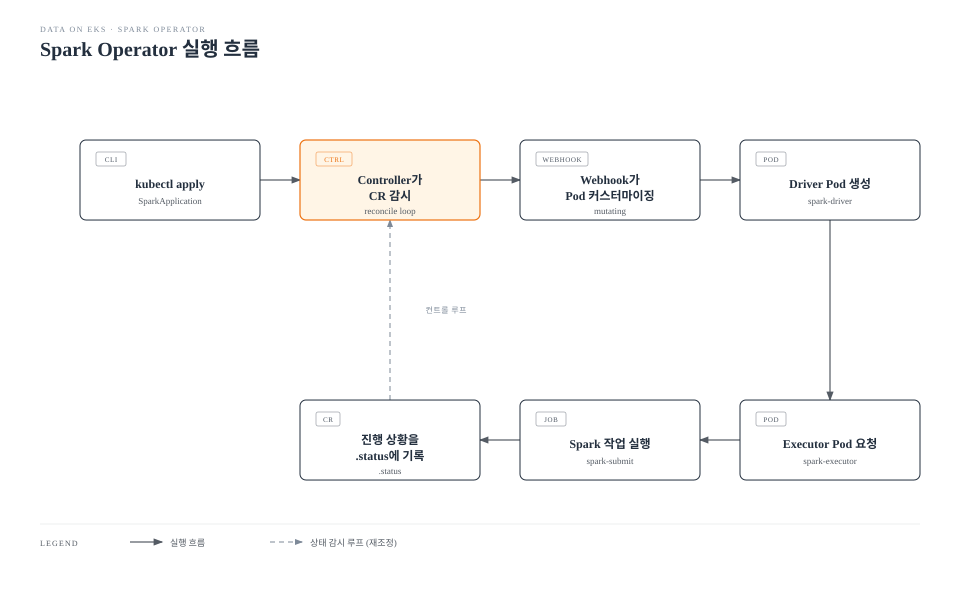

# Part 2: Spark Operator

> **지원 버전**: Kubernetes 1.34+ (apache/spark-kubernetes-operator 0.9.0) 또는 Kubernetes 1.28+ (kubeflow/spark-operator 2.5.0)\
> **마지막 업데이트**: 2026년 7월 15일

## 실습 환경 설정

이 문서의 예제를 따라하기 위해서는 다음과 같은 도구와 환경이 필요합니다:

### 필수 도구

* kubectl v1.28 이상 (apache/spark-kubernetes-operator를 사용할 경우 v1.34 이상)
* Helm v3.12 이상
* 작동하는 Kubernetes 클러스터 (Amazon EKS 권장)
* S3 접근 권한이 부여된 IRSA 역할 또는 EKS Pod Identity 연결 (입력 데이터 읽기와 작업 결과 쓰기용)

## 두 개의 Operator, 하나의 선택

`spark-submit --master k8s://...`를 직접 실행하는 방식은 단발성 작업에는 문제가 없지만, 상태를 Kubernetes 네이티브하게 추적하거나 실패한 드라이버를 재시도하거나 Git에서 작업 스펙을 선언적으로 버전 관리할 방법을 제공하지 않습니다. Spark Operator는 Spark 애플리케이션을 CRD로 감싸서 이 공백을 채웁니다. 원하는 작업을 `kubectl apply`로 선언하면 Operator가 제출, 재시도, 상태 보고를 대신 처리합니다.

2026년 중반 기준으로 활발히 관리되는 옵션이 두 가지 존재하며, 둘 중 하나를 고르는 것은 형식적인 선택이 아니라 실제 의사결정입니다.

### apache/spark-kubernetes-operator

2023년 11월 SPIP(Spark Improvement Proposal)로 제안되어 Apache Software Foundation 거버넌스 하에 처음부터 새로 만들어진 Operator입니다 — 기존 Kubeflow 커뮤니티 프로젝트를 되살린 것이 아니라 완전히 새로운 프로젝트입니다. 최신 릴리스인 0.9.0(2026년 5월)은 Kubernetes v1.34~v1.36과 Spark 3.5/4.0/4.1을 지원하며(4.2.0 프리뷰까지 테스트됨), Spark 프로젝트 자체가 만든 Operator이다 보니 Spark 4의 가속 엔진인 Apache DataFusion Comet, Apache Gluten과의 네이티브 연동을 별도의 접착 코드 없이 제공합니다.

### kubeflow/spark-operator

더 오래되었고 더 성숙하며 훨씬 널리 채택된 커뮤니티 Operator입니다. 여전히 활발히 개발되고 있으며, v2.5.0에서는 alpha 기능 게이트, 네임스페이스 라벨 기반 감시(watch), Python API 자동 생성, SparkConnect 웹훅 검증이 추가되었으며, 수년간 Helm을 주요 설치 방식으로 배포해 왔습니다.

### 어떤 것을 선택해야 할까?

| 고려사항 | apache/spark-kubernetes-operator | kubeflow/spark-operator |
|---|---|---|
| 거버넌스 | Apache Software Foundation, Spark 프로젝트 네이티브 | CNCF 인접 커뮤니티 프로젝트 |
| 성숙도/채택도 | 신생, 설치 기반이 작음 | 성숙하고 프로덕션에 널리 배포됨 |
| Spark 버전 정합성 | Spark 4 가속 기능(Comet, Gluten)에 대한 1급 지원 | Spark 3.x/4.x 전반을 폭넓게 지원(가속 특화는 아님) |
| Kubernetes 최소 버전 | 1.34+ | 1.28+ |
| 적합한 상황 | 이미 Spark 4와 DataFusion Comet/Gluten으로 표준화하려는 팀 | 검증된 Operator가 필요하거나 이미 Kubeflow 생태계를 사용하는 팀 |

둘 중 어느 쪽이 절대적으로 "더 우월"하지는 않습니다. 이 문서는 두 가지를 모두 소개하지만, 오늘날 더 흔하게 배포되는 kubeflow/spark-operator를 기준으로 실습 예제를 진행합니다.

## `spark-submit` 대비 Operator가 주는 것

`spark-submit`은 fire-and-forget 방식입니다. 드라이버 Pod가 한 번 생성되면 "이건 실패 시 재시도되어야 할 Spark 작업"이라는 개념 자체가 Kubernetes에 존재하지 않습니다. 드라이버가 죽어도 아무것도 재제출하지 않고, 상태를 확인할 CRD도 없습니다.

Operator는 두 가지 방식으로 이 문제를 해결합니다.

* **라이프사이클 관리** — `SparkApplication`을 제출하면 제어권이 Operator로 넘어가고, Operator는 드라이버 Pod를 감시하며 스펙에 선언된 `restartPolicy`(`Never`, `OnFailure`, `Always`, 재시도 횟수와 백오프 간격까지 설정 가능)를 적용합니다. `SUBMITTED`, `RUNNING`, `COMPLETED`, `FAILED` 같은 작업 상태는 CR의 `.status` 필드에 그대로 노출되므로, `kubectl get sparkapplication` 한 번으로 `spark-submit`만으로는 알 수 없었던 정보를 확인할 수 있습니다.
* **Mutating Admission Webhook** — 두 Operator 모두 드라이버/executor Pod 생성 요청을 가로채는 mutating admission webhook을 등록하고, `spec.driver`/`spec.executor`에 선언된 커스터마이징(추가 볼륨, 사이드카, affinity 규칙, secret 마운트, 환경 변수)을 주입합니다. 그래서 `--conf spark.kubernetes.driver.podTemplateFile`로 pod 템플릿을 직접 만들어 `spark-submit`에 전달할 필요 없이, `SparkApplication` YAML에 볼륨 마운트를 바로 선언할 수 있는 것입니다.

## 설치

### 방법 1: kubeflow/spark-operator (Helm, 권장)

```bash
# Spark Operator Helm 저장소 추가
helm repo add spark-operator https://kubeflow.github.io/spark-operator
helm repo update

# spark-operator 네임스페이스에 설치
helm install spark-operator spark-operator/spark-operator \
  --namespace spark-operator \
  --create-namespace \
  --version 2.5.0 \
  --set webhook.enable=true

# 설치 확인
kubectl get pods -n spark-operator
kubectl get crd | grep sparkoperator
```

`--set webhook.enable=true`는 위에서 설명한 mutating admission webhook을 활성화합니다. 이 설정 없이는 `spec.driver`/`spec.executor`에 선언한 pod 템플릿 커스터마이징이 조용히 무시됩니다.

### 방법 2: apache/spark-kubernetes-operator (Helm)

클러스터가 Kubernetes 1.34+ 이상이고 Spark 4/DataFusion Comet에 대한 1급 지원이 필요하다면 ASF Operator를 대신 설치합니다.

```bash
# ASF Spark Kubernetes Operator Helm 저장소 추가
helm repo add spark-kubernetes-operator https://apache.github.io/spark-kubernetes-operator
helm repo update

# spark-operator 네임스페이스에 설치
# 차트 버전 1.7.0이 앱 버전 0.9.0을 패키징합니다 -- Operator의 Helm 차트 버전과
# 앱 버전은 별도로 관리되므로, 여기서는 차트 버전을 지정합니다.
helm install spark-kubernetes-operator spark-kubernetes-operator/spark-kubernetes-operator \
  --namespace spark-operator \
  --create-namespace \
  --version 1.7.0

# 설치 확인
kubectl get pods -n spark-operator
kubectl get crd | grep spark.apache.org
```

두 Operator는 같은 네임스페이스를 동시에 감시하도록 설계되지 않았습니다 — 클러스터당(또는 의도적으로 나눠 쓴다면 네임스페이스당) 하나만 선택하세요. ASF Operator는 CRD를 kubeflow의 `sparkoperator.k8s.io`가 아닌 `spark.apache.org` API 그룹 아래에 정의합니다. 이 문서의 나머지 부분은 실제 예제가 가장 많이 존재하는 kubeflow/spark-operator의 CRD를 기준으로 설명합니다.

## 핵심 CRD

### SparkApplication

```yaml
apiVersion: sparkoperator.k8s.io/v1beta2
kind: SparkApplication
metadata:
  name: word-count
  namespace: spark-operator
spec:
  type: Scala
  mode: cluster
  image: "apache/spark:3.5.3"
  imagePullPolicy: IfNotPresent
  mainClass: org.apache.spark.examples.JavaWordCount
  mainApplicationFile: "local:///opt/spark/examples/jars/spark-examples.jar"
  arguments:
    - "s3a://my-bucket/input/sample.txt"
  sparkVersion: "3.5.3"
  restartPolicy:
    type: OnFailure
    onFailureRetries: 3
    onFailureRetryInterval: 10
    onSubmissionFailureRetries: 3
    onSubmissionFailureRetryInterval: 20
  driver:
    cores: 1
    memory: "1g"
    serviceAccount: spark-driver
  executor:
    cores: 1
    instances: 2
    memory: "2g"
```

`type`과 `mode`는 각각 `spark-submit`의 언어/`--class` 지정과 `--deploy-mode` 플래그에 대응합니다. Operator의 진짜 가치는 `restartPolicy`에서 나옵니다 — `OnFailure`와 `onFailureRetries`를 조합하면 순수 `spark-submit`에는 존재하지 않는 드라이버 자동 재제출이 가능해집니다.

### ScheduledSparkApplication

일별 ETL 작업처럼 반복 실행이 필요한 작업이라면, `spark-submit`을 호출하는 별도의 `CronJob` 같은 외부 스케줄러 없이 `ScheduledSparkApplication`이 `SparkApplication` 템플릿을 cron 스케줄로 감쌉니다.

```yaml
apiVersion: sparkoperator.k8s.io/v1beta2
kind: ScheduledSparkApplication
metadata:
  name: daily-etl
  namespace: spark-operator
spec:
  schedule: "0 2 * * *"
  concurrencyPolicy: Forbid
  template:
    type: Scala
    mode: cluster
    image: "apache/spark:3.5.3"
    mainClass: com.example.DailyEtlJob
    mainApplicationFile: "s3a://my-bucket/jars/daily-etl.jar"
    sparkVersion: "3.5.3"
    restartPolicy:
      type: OnFailure
      onFailureRetries: 2
      onFailureRetryInterval: 30
    driver:
      cores: 1
      memory: "2g"
      serviceAccount: spark-driver
    executor:
      cores: 2
      instances: 4
      memory: "4g"
```

`concurrencyPolicy: Forbid`는 이전 스케줄 실행이 끝나지 않았다면 새 실행을 건너뛰도록 합니다 — 실행이 겹치면 결과물이 오염될 수 있는 작업에 유용합니다.

## 동작 방식



Operator의 컨트롤 루프는 드라이버 Pod까지만 직접 관여합니다. 드라이버 자신은 순수 `spark-submit`과 마찬가지로 Kubernetes API에 직접 요청해 자신의 executor를 생성합니다. Operator가 더해주는 가치는 그 주변 계층입니다 — 제출, 웹훅 기반 pod 커스터마이징, 재시작 처리, 상태 보고.

## EKS 배포 고려사항

### 1. IRSA를 통한 S3 접근

EKS에서 Spark 작업은 보통 로컬/EBS 스토리지가 아니라 S3에서 데이터를 읽고 씁니다. 따라서 드라이버와 executor Pod 모두 AWS 자격 증명이 필요합니다. 고정 키를 심는 대신, 전용 ServiceAccount에 IAM 역할을 연결(annotate)하고 이를 `SparkApplication` 스펙에서 참조합니다.

```yaml
apiVersion: v1
kind: ServiceAccount
metadata:
  name: spark-driver
  namespace: spark-operator
  annotations:
    eks.amazonaws.com/role-arn: arn:aws:iam::123456789012:role/spark-s3-access
```

```yaml
spec:
  driver:
    serviceAccount: spark-driver
  executor:
    serviceAccount: spark-driver
```

EKS Pod Identity webhook(또는 IRSA 대신 EKS Pod Identity 연결을 사용한다면 해당 메커니즘)이 드라이버와 executor Pod 모두에 임시 AWS 자격 증명을 자동으로 주입합니다 — `spark.hadoop.fs.s3a.access.key` 같은 고정 자격 증명을 작업 스펙 어디에도 넣을 필요가 없습니다.

### 2. 셔플/스크래치 스토리지

Spark의 셔플과 spill 연산은 `spark.local.dir`에 기록되며, 별도로 설정하지 않으면 노드의 루트 EBS 볼륨 위에 있는 `emptyDir` 볼륨이 기본값으로 사용됩니다. 셔플이 많은 작업은 이 공간을 쉽게 소진하거나 처리량에서 병목을 겪을 수 있습니다. 별도의 `emptyDir`(가능하다면 인스턴스 스토어 NVMe가 있는 노드로)를 마운트하는 것이 좋습니다.

```yaml
spec:
  driver:
    volumes:
      - name: spark-local-dir
        emptyDir: {}
  executor:
    volumes:
      - name: spark-local-dir
        emptyDir: {}
```

이렇게 `spec.driver`/`spec.executor`에 선언한 `volumes` 블록이 실제 실행 중인 Pod에 반영되는 것도 mutating admission webhook 덕분입니다.

### 3. 모니터링 연동

kubeflow/spark-operator의 Helm 차트는 드라이버/executor JVM에 JMX Prometheus Exporter Java 에이전트를 기본으로 연결해주므로, Spark 이미지에 별도로 `-javaagent` 플래그를 추가하지 않아도 태스크 수, 셔플 읽기/쓰기, GC 정지 시간 같은 Spark 내부 메트릭을 Prometheus 형식으로 노출할 수 있습니다. 이 절에서는 이러한 연동 지점이 존재한다는 사실만 짚고, 전체 메트릭 설정과 권장 대시보드는 [Part 5: 모범 사례](./05-best-practices.md)에서 다룹니다.

## 배포 절차

```bash
# 1. Operator 실행 확인
kubectl get pods -n spark-operator

# 2. SparkApplication 적용
kubectl apply -f word-count.yaml -n spark-operator

# 3. 상태 확인 (COMPLETED 상태가 될 때까지 대기)
kubectl get sparkapplication -n spark-operator -w
kubectl describe sparkapplication word-count -n spark-operator

# 4. 드라이버 로그 확인
kubectl logs word-count-driver -n spark-operator

# 5. 정리
kubectl delete sparkapplication word-count -n spark-operator
```

`kubectl describe sparkapplication`은 `kubectl get pods`와 드라이버 로그를 일일이 조합해야 알 수 있던 드라이버/executor 상태 전이와 이벤트를 한 번에 보여줍니다 — 이것이 순수 `spark-submit`에는 없는 CRD 네이티브 상태 추적입니다.

## 다음 단계

Operator를 통해 작업을 제출하고 모니터링할 수 있게 되었다면, 다음으로 마주치는 질문은 보통 "직접 운영할지, AWS에 맡길지"입니다. 이 트레이드오프와 EMR on EKS의 virtual cluster 모델은 [Part 3: EMR on EKS](./03-emr-on-eks.md)에서 다룹니다.

[메인 페이지로 돌아가기](./README.md)

## 퀴즈

이 장에서 배운 내용을 테스트하려면 [주제 퀴즈](../../quizzes/data-on-eks/spark/02-spark-operator-quiz.md)를 풀어보세요.
