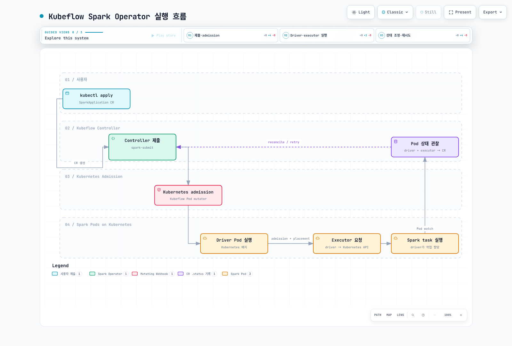

# Part 2: Spark Operator

> **검토 기준**: Kubeflow operator/chart 2.5.2; Apache operator 1.0.0 / chart 1.8.0\
> **예제 런타임**: Kubeflow는 controller 제출 런타임과 맞춘 Spark 4.0.4, Apache 예제는 Spark 4.2.0\
> **최종 검토**: 2026년 9월 12일

## 별개의 프로젝트와 API

두 프로젝트는 독립적으로 관리되며 같은 매니페스트를 서로 바꿔 사용하는 구현체가
아닙니다. 필요한 API·수명주기, 기존 리소스와 런타임 조합·운영 시험으로 선택합니다.
오래되었다거나 채택이 많다는 근거 없는 주장으로 호환성을 보장하지 않습니다.

| 항목 | Kubeflow Spark Operator | Apache Spark Kubernetes Operator |
| --- | --- | --- |
| 검토 릴리스 | 2.5.2 | 1.0.0 |
| Helm chart | 2.5.2 | **1.8.0**; chart와 앱 버전이 다름 |
| 여기서 사용하는 API | sparkoperator.k8s.io/v1beta2 | spark.apache.org/v1 |
| 주요 리소스 | SparkApplication·ScheduledSparkApplication, 별도 SparkConnect API | SparkApplication·SparkCluster |
| 설정 모델 | type/mode/driver/executor/restartPolicy | runtimeVersions/driverSpec/executorSpec/applicationTolerations/sparkConf |
| 해당 chart의 admission 방식 | Mutating·validating webhook | 같은 방식의 Pod mutating webhook을 설치하지 않음 |

Apache의 SparkCluster는 상주 Spark cluster를 관리할 수 있으며 네이티브 Kubernetes
SparkApplication과 다른 실행 모델입니다. Comet/Gluten 예제도 적합한 plugin
바이너리·이미지·classpath·설정과 런타임·아키텍처 호환성을 요구합니다.
Operator 설치만으로 가속이 켜지거나 특정 Operator가 항상 더 적합해지지는 않습니다.

두 API group은 존재할 수 있지만 공존에는 watch 범위·이름·webhook selector·RBAC를
설계해야 합니다. 아래 실습은 **설치 경로 하나**를 선택합니다. 모호한 sparkapp
약어 대신 API group까지 지정한 리소스 이름을 사용합니다.

## Reconciliation이 더하는 기능

spark-submit도 완료를 기다리고 Pod·로그·UI·event log로 상태를 확인할 수 있으며
스크립트·properties·template을 Git에서 관리할 수 있습니다. 본질적으로
fire-and-forget만 가능한 도구는 아닙니다. 그 자체로 Operator 관리
SparkApplication CR·스케줄 controller·자동 애플리케이션 재시도를 추가하지는 않습니다.

Kubeflow는 의도적으로 spark.kubernetes.submission.waitAppCompletion=false로
제출한 뒤 Pod·애플리케이션 상태를 조정합니다. Executor Pod도 관찰하고 수명주기
정리를 수행하므로 “driver에만 관여한다”는 설명은 틀립니다. Executor 용량 요청과
Spark task 할당은 여전히 Spark driver의 역할입니다.

## 작업 namespace와 ID 준비

클러스터와 호환되는 kubectl·Helm을 사용합니다. 이 예제 chart는 Kubernetes 1.36
기준으로 렌더링했으며 Apache의 Spark 4.2 작업은 Kubernetes 1.34+가 필요합니다.
오래된 README 표를 현재 권장 최소 Kubernetes 버전으로 해석하지 않습니다.

Kubeflow controller의 고정 Dockerfile은 제출용 Spark **4.0.4**를 사용합니다.
실습도 4.0.4로 맞췄으며 Part 1의 직접 Spark 4.2 제출과 구분합니다.
SparkApplication의 sparkVersion이 controller 안의 Spark를 업그레이드하지는
않습니다. 다른 제출자·작업 런타임 조합은 명시적으로 검증합니다.

어느 chart든 먼저 job-rbac.yaml을 저장·적용합니다. Part 1과 같은 namespace 범위
작업 권한이며 driver·executor ID를 분리합니다. 같은 이름을 이미 사용하면 기존
리소스를 검토합니다.

```yaml
apiVersion: v1
kind: Namespace
metadata:
  name: spark-jobs
---
apiVersion: v1
kind: ServiceAccount
metadata:
  name: spark-driver
  namespace: spark-jobs
---
apiVersion: v1
kind: ServiceAccount
metadata:
  name: spark-executor
  namespace: spark-jobs
automountServiceAccountToken: false
---
apiVersion: rbac.authorization.k8s.io/v1
kind: Role
metadata:
  name: spark-driver
  namespace: spark-jobs
rules:
- apiGroups:
  - ''
  resources:
  - pods
  - services
  - configmaps
  verbs:
  - create
  - get
  - list
  - watch
  - delete
  - patch
---
apiVersion: rbac.authorization.k8s.io/v1
kind: RoleBinding
metadata:
  name: spark-driver
  namespace: spark-jobs
roleRef:
  apiGroup: rbac.authorization.k8s.io
  kind: Role
  name: spark-driver
subjects:
- kind: ServiceAccount
  name: spark-driver
  namespace: spark-jobs
```

```bash
kubectl apply -f job-rbac.yaml
```

SparkPi는 AWS 데이터 권한이 필요하지 않습니다. Operator의 API 권한, driver의
API 권한과 AWS 데이터 권한은 별개입니다.

## 경로 A: Kubeflow 설치

kubeflow-values.yaml로 저장합니다. 기본 chart는 설치 namespace가 아닌 default를
감시하므로 **감시 namespace와 작업 namespace를 일치**시켜야 합니다.
여기서는 spark-jobs에서 작업을 실행하고 앞에서 준비한 작업 RBAC를 재사용합니다.
리소스와 제출 동시성은 측정·조정할 실습 시작값입니다.

```yaml
spark:
  jobNamespaces:
  - spark-jobs
  jobNamespaceSelector: ''
  serviceAccount:
    create: false
  rbac:
    create: false
webhook:
  enable: true
  resources:
    requests:
      cpu: 100m
      memory: 128Mi
    limits:
      cpu: '1'
      memory: 512Mi
controller:
  workers: 2
  resources:
    requests:
      cpu: 500m
      memory: 1Gi
    limits:
      cpu: '2'
      memory: 2Gi
```

2.5.2의 webhook.enable 기본값은 이미 **true**입니다. 명시는 선택을 문서화하며
플래그를 생략하면 꺼진다는 뜻이 아닙니다. 일부 설정은 admission, 다른 설정은
네이티브 Spark 설정으로 변환하므로 webhook을 끈다고 모든 설정이 무시되지는 않습니다.

아래 checksum은 **GitHub release asset** 메타데이터와 다운로드한 파일이
일치하는 값입니다. 검토 당시 repository index의 digest가 달라 직접 검증한
릴리스 archive로 설치하도록 작성했습니다.

```bash
# Fresh installation after reviewing/applying job-rbac.yaml.
curl --fail --location --silent --show-error 'https://github.com/kubeflow/spark-operator/releases/download/v2.5.2/spark-operator-2.5.2.tgz' -o spark-operator-2.5.2.tgz
printf '%s\n' '762be5b8632ecfe12eb20fff54450ddae0427f09506422107c508a0d1d38655b  spark-operator-2.5.2.tgz' | sha256sum --check -
helm install spark-operator ./spark-operator-2.5.2.tgz \
  --namespace spark-operator --create-namespace \
  --values kubeflow-values.yaml --wait --timeout 5m
kubectl -n spark-operator get deployments,pods
```

새 설치용 예제입니다. 업그레이드는 CRD 이전 절차를 검토합니다. 일반적인 Helm
upgrade는 crds/의 CRD를 자동 교체하지 않으며 이 chart의 hook.upgradeCrd는
명시적 선택입니다. CRD 삭제는 해당 custom resource에도 영향을 주므로 일상적인
업그레이드 절차로 사용하지 않습니다.

EKS에서는 control plane→webhook Service/endpoint, 서버 인증서·CA bundle과
selector를 확인합니다. 이 chart의 서버 포트는 9443이며 failurePolicy=Fail에서
webhook 장애가 일치하는 admission을 막을 수 있습니다. Deployment Ready만으로
Spark 작업의 admission 성공을 보장하지 않습니다.

## Kubeflow SparkApplication

spark-pi.yaml로 저장합니다. 불명확한 S3 객체나 없는 ETL 클래스 대신 고정 이미지에
들어 있는 실제 예제를 사용합니다.

```yaml
apiVersion: sparkoperator.k8s.io/v1beta2
kind: SparkApplication
metadata:
  name: spark-pi
  namespace: spark-jobs
spec:
  type: Scala
  mode: cluster
  image: apache/spark:4.0.4@sha256:94ad730f7510002d8a1615de269f27cdeca4d4eef51657384db3fa9246b5a4d8
  imagePullPolicy: IfNotPresent
  mainClass: org.apache.spark.examples.SparkPi
  mainApplicationFile: local:///opt/spark/examples/jars/spark-examples_2.13-4.0.4.jar
  arguments:
  - '10'
  sparkVersion: 4.0.4
  restartPolicy:
    type: OnFailure
    onFailureRetries: 3
    onFailureRetryInterval: 30
    onSubmissionFailureRetries: 3
    onSubmissionFailureRetryInterval: 30
  driver:
    cores: 1
    coreLimit: '1'
    memory: 1g
    serviceAccount: spark-driver
    podSecurityContext: &id001
      runAsNonRoot: true
      runAsUser: 185
      seccompProfile:
        type: RuntimeDefault
    securityContext: &id002
      allowPrivilegeEscalation: false
      capabilities:
        drop:
        - ALL
  executor:
    cores: 1
    coreLimit: '1'
    instances: 2
    memory: 1g
    serviceAccount: spark-executor
    terminationGracePeriodSeconds: 60
    podSecurityContext: *id001
    securityContext: *id002
```

이 버전은 driver.serviceAccount와 **executor.serviceAccount 모두** 지원합니다.
재시도는 컨테이너 하나의 제자리 재시작이 아닌 제출·애플리케이션 시도에 적용됩니다.
재실행은 출력 작업을 반복할 수 있으므로 실제 작업에는 멱등성·트랜잭션을 설계합니다.

Executor grace 필드는 Kubeflow Pod mutator가 적용하며 Part 1에서 확인한 Spark
4.2의 native template 덮어쓰기와 다른 경로입니다. Decommission·custom lifecycle을
사용한다면 Operator·Spark·webhook 조합이 실제 Pod에 어떻게 반영되는지 확인합니다.

```bash
kubectl apply -f spark-pi.yaml
kubectl -n spark-jobs get sparkapplications.sparkoperator.k8s.io spark-pi \
  -o jsonpath='{.status.applicationState.state}{"\n"}'
kubectl -n spark-jobs describe sparkapplications.sparkoperator.k8s.io spark-pi
DRIVER_POD="$(kubectl -n spark-jobs get sparkapplications.sparkoperator.k8s.io spark-pi \
  -o jsonpath='{.status.driverInfo.podName}')"
: "${DRIVER_POD:?Driver pod name is not available yet; inspect submission events}"
kubectl -n spark-jobs logs "$DRIVER_POD"
```

제출 실패를 포함한 현재 status·event를 확인한 뒤 실제 driver Pod 이름으로 로그를
봅니다. kubectl get -w는 중단할 때까지 계속되는 watch이지 성공까지 기다리는 유한
단계가 아닙니다. COMPLETED는 프로세스 완료 상태이며 외부 데이터셋의 정확성 증거는 아닙니다.

### UTC를 명시한 스케줄

scheduled-spark-pi.yaml로 저장합니다. 같은 Pi 예제를 예약하며 실제 ETL은 패키징·
검증한 프로그램으로 바꿉니다.

```yaml
apiVersion: sparkoperator.k8s.io/v1beta2
kind: ScheduledSparkApplication
metadata:
  name: daily-spark-pi
  namespace: spark-jobs
spec:
  schedule: 0 2 * * *
  timeZone: UTC
  concurrencyPolicy: Forbid
  successfulRunHistoryLimit: 2
  failedRunHistoryLimit: 2
  template:
    type: Scala
    mode: cluster
    image: apache/spark:4.0.4@sha256:94ad730f7510002d8a1615de269f27cdeca4d4eef51657384db3fa9246b5a4d8
    imagePullPolicy: IfNotPresent
    mainClass: org.apache.spark.examples.SparkPi
    mainApplicationFile: local:///opt/spark/examples/jars/spark-examples_2.13-4.0.4.jar
    arguments:
    - '10'
    sparkVersion: 4.0.4
    restartPolicy:
      type: OnFailure
      onFailureRetries: 3
      onFailureRetryInterval: 30
      onSubmissionFailureRetries: 3
      onSubmissionFailureRetryInterval: 30
    driver:
      cores: 1
      coreLimit: '1'
      memory: 1g
      serviceAccount: spark-driver
      podSecurityContext: &id001
        runAsNonRoot: true
        runAsUser: 185
        seccompProfile:
          type: RuntimeDefault
      securityContext: &id002
        allowPrivilegeEscalation: false
        capabilities:
          drop:
          - ALL
    executor:
      cores: 1
      coreLimit: '1'
      instances: 2
      memory: 1g
      serviceAccount: spark-executor
      terminationGracePeriodSeconds: 60
      podSecurityContext: *id001
      securityContext: *id002
```

2.5.2는 timeZone 필드를 지원하며 기본값은 controller의 Local입니다.
예제는 **UTC 02:00**입니다. Forbid는 이 예약 리소스의 이전 실행을 확인할 뿐 재시도·
수동 실행·다른 scheduler의 중복 효과까지 막지는 않습니다. History limit은 자식 실행
기록의 보존 수이며 데이터 백업이 아닙니다.

```bash
kubectl apply -f scheduled-spark-pi.yaml
kubectl -n spark-jobs get scheduledsparkapplications.sparkoperator.k8s.io daily-spark-pi -o yaml
# Stop future schedule triggers; this does not itself terminate an active child run.
kubectl -n spark-jobs patch scheduledsparkapplications.sparkoperator.k8s.io daily-spark-pi \
  --type=merge -p '{"spec":{"suspend":true}}'
```

## 경로 B: Apache Operator

실습에서 **경로 A 대신** 선택할 때 apache-values.yaml을 사용합니다.
spark-jobs를 감시하고 Operator는 namespace Role을 사용하며 기존 작업 ID를
재사용합니다. Chart 주석에 오래된 속성명이 있을 수 있지만 렌더링된 설정은
spark.kubernetes.operator.watchedNamespaces=spark-jobs입니다.

```yaml
workloadResources:
  namespaces:
    create: false
    overrideWatchedNamespaces: true
    data:
    - spark-jobs
  serviceAccount:
    create: false
  role:
    create: false
  clusterRole:
    create: false
  roleBinding:
    create: false
operatorRbac:
  clusterRole:
    create: false
  clusterRoleBinding:
    create: false
  role:
    create: true
  roleBinding:
    create: true
```

```bash
# Fresh installation after reviewing/applying job-rbac.yaml.
curl --fail --location --silent --show-error 'https://github.com/apache/spark-kubernetes-operator/releases/download/1.0.0/spark-kubernetes-operator-1.8.0.tgz' -o spark-kubernetes-operator-1.8.0.tgz
printf '%s\n' '7536a8849b8a7c242283d0e393b5e0ec56365f34ec93717b158c76dfa1036a06  spark-kubernetes-operator-1.8.0.tgz' | sha256sum --check -
helm install asf-spark-operator ./spark-kubernetes-operator-1.8.0.tgz \
  --namespace spark-operator-asf --create-namespace \
  --values apache-values.yaml --wait --timeout 5m
kubectl -n spark-operator-asf get deployments,pods
```

Apache 릴리스의 수명주기·실행 이미지는 Kubeflow와 다릅니다. 공개된 이미지를
사용하며 작업의 Java 버전으로 Operator 이미지의 Java 요구사항까지 추정하지 않습니다.

다음 v1 예제는 Spark 4.2.0을 사용하고 잠시 리소스를 유지해 관찰할 수 있게 합니다.

```yaml
apiVersion: spark.apache.org/v1
kind: SparkApplication
metadata:
  name: spark-pi-asf
  namespace: spark-jobs
spec:
  runtimeVersions:
    sparkVersion: 4.2.0
  mainClass: org.apache.spark.examples.SparkPi
  jars: local:///opt/spark/examples/jars/spark-examples.jar
  driverArgs:
  - '10'
  sparkConf:
    spark.kubernetes.namespace: spark-jobs
    spark.kubernetes.container.image: spark:4.2.0-scala2.13-java21-ubuntu
    spark.kubernetes.authenticate.driver.serviceAccountName: spark-driver
    spark.kubernetes.authenticate.executor.serviceAccountName: spark-executor
    spark.executor.instances: '2'
  applicationTolerations:
    resourceRetainPolicy: Always
    ttlAfterStopMillis: 600000
```

ttlAfterStopMillis: 600000은 마지막 종료 후 controller가 애플리케이션과 연관
리소스를 정리하는 TTL입니다. resourceRetainPolicy: Always는 Operator가 만든
리소스를 정리 시점까지 유지하지만 driver 자체의 executor/service 삭제 설정을
덮어쓰거나 재시도 간 리소스 보존을 보장하지 않습니다.


```bash
kubectl apply -f apache-spark-pi.yaml
kubectl -n spark-jobs get sparkapplications.spark.apache.org spark-pi-asf -o yaml
```

이 릴리스는 이전 v1beta1도 제공하지만 새 예제는 v1을 사용합니다.
Kubeflow 리소스의 apiVersion만 바꿔서는 필드·상태·재시도·보존 정책이 이전되지 않습니다.
Kubeflow ScheduledSparkApplication이나 restartPolicy 스키마를 Apache API에
그대로 적용하지 않습니다.

## Pod 생성 주변의 동작



[인터랙티브 다이어그램](https://www.atomai.click/kubernetes-docs/archmaps/ko-data-on-eks-spark-02-spark-operator-0.html)

Webhook은 Kubernetes admission 과정이며 노드 배치나 Spark task 스케줄링을
대체하지 않습니다. 그림은 **Kubeflow**를 설명하며 두 Operator의 API·구조를
같은 것으로 취급하지 않습니다.

## 스토리지·인증·메트릭

### 스크래치 볼륨의 올바른 위치

Kubeflow에서 볼륨은 **spec.volumes**, 마운트는 driver/executor 아래에 둡니다.
spec.driver.volumes·spec.executor.volumes는 이 CRD의 필드가 아닙니다.
다음은 완전한 Kubeflow 예제에 적용할 merge patch입니다.

```yaml
spec:
  volumes:
  - name: spark-local-dir-scratch
    emptyDir:
      sizeLimit: 8Gi
  driver:
    volumeMounts:
    - name: spark-local-dir-scratch
      mountPath: /var/data/spark-local
  executor:
    volumeMounts:
    - name: spark-local-dir-scratch
      mountPath: /var/data/spark-local
```

```bash
kubectl -n spark-jobs patch sparkapplications.sparkoperator.k8s.io spark-pi \
  --type=merge --patch-file scratch.patch.yaml
```

실제 작업 실행 전에 볼륨을 구성합니다. 애플리케이션 변경은 재제출을 유발할 수
있습니다. JSON merge patch는 배열을 교체하므로 기존 볼륨·mount가 있는 작업에서는
기존 항목도 합쳐서 patch를 작성합니다.


spark-local-dir- 접두사는 특별 처리됩니다. Operator가 네이티브 Spark 볼륨 설정으로
변환하고 일반 Pod volume mutator는 이를 건너뜁니다. 다른 사용자 볼륨은 webhook
경로를 사용할 수 있습니다. 모든 필드가 한 방식으로 구현된다고 가정하지 않습니다.

emptyDir 하나를 더 만든다고 별도 물리 디스크나 NVMe를 선택하지는 않습니다.
Memory 방식이 아니면 노드에 구성된 파일시스템을 사용합니다. Kubelet·컨테이너
파일시스템은 EBS·instance store 등 실제 구성에 달려 있습니다. 노드 저장소나
적절한 영속 볼륨을 구성·확인하고 ephemeral-storage request/limit과 disk pressure를
계획합니다.

### IRSA와 Pod Identity 구분

S3 작업에는 driver/executor의 실제 데이터 권한·신뢰/연결과 호환 Hadoop S3A/AWS
라이브러리·credential provider가 필요합니다. 기본 이미지, ARN annotation이나
s3a:// 문자열만으로 완성되지 않습니다. Artifact/template을 읽는 프로세스의
권한도 해당 경로에 맞게 검토합니다.

- **IRSA**는 service account role annotation, OIDC trust와 web identity 교환을 사용합니다.
- **EKS Pod Identity**는 association·Agent·container credential 경로를 사용하며
  IRSA role annotation이 그 연결을 대신하지 않습니다.
- Kubernetes RBAC는 S3 권한을 주지 않습니다. 임시 자격증명을 사용하고 실제 Pod의
  유효 ID·데이터 접근을 검증합니다.

완전한 데이터 접근·보안 예제는 Part 5에서 다룹니다. 고정 AWS 키를 작업 스펙이나
이미지에 넣지 않습니다.

### Controller 메트릭과 작업 JMX 구분

Chart의 기본 Prometheus endpoint 8080은 **Operator** 메트릭입니다.
모든 Spark JVM에 JMX agent가 자동 추가되는 것은 아닙니다.
작업 모니터링은 애플리케이션에서 명시적으로 구성하고 이미지의 exporter JAR·설정과
수집·탐색이 필요합니다. Spark native endpoint와 event/history log도 별도 방식입니다.
세부 내용은 [Part 5](./05-best-practices.md)를 참고합니다.

## 정리와 검증 범위

예약을 먼저 멈추고 parent 삭제의 자식 리소스 영향도 확인합니다.
의도한 API group을 지정해 데모 리소스를 정리합니다.

```bash
# Kubeflow demo resources, if installed:
kubectl -n spark-jobs delete scheduledsparkapplications.sparkoperator.k8s.io daily-spark-pi
kubectl -n spark-jobs delete sparkapplications.sparkoperator.k8s.io spark-pi
# Apache demo resource, if installed:
kubectl -n spark-jobs delete sparkapplications.spark.apache.org spark-pi-asf
```

Chart 렌더링과 릴리스 CRD 검사는 리소스 형식·namespace·설정 경로를 확인합니다.
실제 webhook·controller/runtime 조합·S3 접근·데이터 정확성·재시도 복구 성공을
증명하지 않습니다. 실제 작업 적용 전 생성 Pod·status·출력을 검증합니다.

- [Kubeflow Spark Operator 2.5.2](https://github.com/kubeflow/spark-operator/releases/tag/v2.5.2)
- [Kubeflow 2.5.2 application API](https://github.com/kubeflow/spark-operator/blob/v2.5.2/api/v1beta2/sparkapplication_types.go)
- [Kubeflow 2.5.2 scheduled API](https://github.com/kubeflow/spark-operator/blob/v2.5.2/api/v1beta2/scheduledsparkapplication_types.go)
- [Kubeflow submission/configuration conversion](https://github.com/kubeflow/spark-operator/blob/v2.5.2/internal/controller/sparkapplication/submission.go)
- [Kubeflow pod mutator](https://github.com/kubeflow/spark-operator/blob/v2.5.2/internal/webhook/sparkpod_defaulter.go)
- [Apache operator 1.0.0](https://github.com/apache/spark-kubernetes-operator/releases/tag/1.0.0)
- [Apache operator configuration](https://github.com/apache/spark-kubernetes-operator/blob/1.0.0/docs/configuration.md)
- [Apache Comet example and prerequisites](https://github.com/apache/spark-kubernetes-operator/blob/1.0.0/examples/pi-with-comet.yaml)
- [Apache Gluten example and prerequisites](https://github.com/apache/spark-kubernetes-operator/blob/1.0.0/examples/pi-with-gluten.yaml)
- [Spark Kubernetes configuration](https://spark.apache.org/docs/4.2.0/running-on-kubernetes.html)

## 다음 단계

[Part 3: EMR on EKS](./03-emr-on-eks.md)

[메인 페이지로 돌아가기](./README.md)

## 퀴즈

[주제 퀴즈](../../quizzes/data-on-eks/spark/02-spark-operator-quiz.md)
