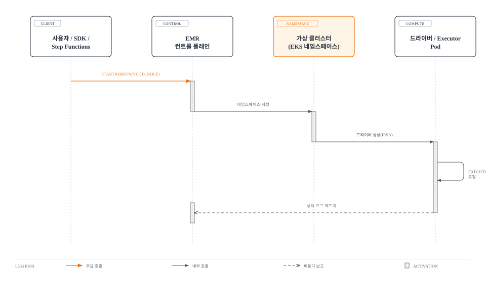

# Part 3: Amazon EMR on EKS

> **마지막 업데이트**: 2026년 7월 15일

## 실습 환경 설정

이 문서의 예제를 따라하기 위해서는 다음과 같은 도구와 환경이 필요합니다:

### 필수 도구

* AWS CLI v2 (가상 클러스터 등록 및 `emr-containers` API 호출용)
* 작동하는 Amazon EKS 클러스터 (v1.30 이상 권장)
* EMR 가상 클러스터의 IAM 역할과 각 작업의 실행 역할을 생성할 수 있는 IAM 권한
* kubectl v1.30 이상 (EMR on EKS가 대상으로 하는 네임스페이스 확인용)

Part 1에서는 Kubernetes에 직접 `spark-submit`을 호출하는 방식을 다뤘고, Part 2에서는 동일한 제출 모델을 오픈소스 Spark Operator의 CRD 기반 워크플로로 감싸는 방식을 다룹니다. 이번 Part에서는 세 번째 선택지인 Amazon EMR on EKS를 다룹니다 — 기존 EKS 클러스터를 대체하지 않고 그 위에서 동작하는 AWS의 관리형 Spark 런타임입니다.

## EMR on EKS가 실제로 바꾸는 것

EMR on EKS는 별도의 클러스터를 제공하는 것이 아닙니다. 드라이버와 Executor Pod는 여전히 나머지 워크로드와 동일한 EKS 노드 위에서 실행됩니다. EMR on EKS가 바꾸는 것은 **작업 제출 방식과 Spark 런타임**입니다. `SparkApplication` 커스텀 리소스에 `kubectl apply`를 실행하거나(Part 2 방식) 직접 `spark-submit`을 호출하는 대신(Part 1 방식), **StartJobRun API**를 호출하면 AWS 컨트롤 플레인이 이를 AWS가 최적화한 Spark 빌드를 실행하는 작업으로 변환합니다.

### 가상 클러스터: 핵심 추상화

**가상 클러스터(virtual cluster)**는 EMR 개념과 실제 Kubernetes 객체 사이의 매핑입니다 — 하나의 EKS 네임스페이스를 EMR 컨트롤 플레인에 등록하는 것입니다. 등록 시점에 네임스페이스 안에 무언가가 새로 프로비저닝되는 것은 아닙니다. 가상 클러스터는 새로운 인프라가 아니라 포인터에 가깝습니다. 이후 해당 가상 클러스터 ID로 제출하는 모든 작업은 그 네임스페이스 안에 드라이버/Executor Pod로 생성되며, 그 네임스페이스에 이미 적용된 `ResourceQuota`, `LimitRange`, RBAC의 제약을 그대로 따릅니다.

```bash
# 기존 EKS 네임스페이스를 EMR 가상 클러스터로 등록
aws emr-containers create-virtual-cluster \
  --name my-spark-vc \
  --container-provider '{
    "id": "my-eks-cluster",
    "type": "EKS",
    "info": {
      "eksInfo": {
        "namespace": "emr-spark"
      }
    }
  }'
```

이 호출은 `virtualClusterId`를 반환하며, 이후 모든 `start-job-run` 호출에 이 값을 전달합니다. 가상 클러스터를 삭제해도 등록 정보만 삭제될 뿐, 네임스페이스나 그 안에서 실행 중인 리소스에는 영향이 없습니다.

### 작업 실행 IAM 역할

모든 작업 실행에는 **작업 실행 역할(job execution role)**이 필요합니다 — 해당 작업이 접근할 수 있는 대상(S3 버킷, Glue 데이터 카탈로그, KMS 키 등)으로 범위를 좁힌 IAM 역할로, 클러스터에 한 번 붙여두는 것이 아니라 매 `start-job-run` 호출마다 명시적으로 전달합니다. 이 역할은 먼저 가상 클러스터에 **온보딩**되어야 합니다 — 신뢰 정책이 해당 네임스페이스에서 실행되는 Pod를 위해 EMR on EKS 서비스가 이 역할을 위임(assume)할 수 있도록 허용해야 하며, IRSA 방식과 유사한 OIDC 신뢰 관계를 통해 Kubernetes 서비스 어카운트에 바인딩됩니다. 이는 Part 2에서 다룬 IRSA의 동작 방식과 원리는 같지만, 직접 만들고 관리하는 서비스 어카운트가 아니라 EMR이 관리하는 Pod와 실행 역할 사이의 바인딩이라는 점이 다릅니다.

```bash
# EMR on EKS 서비스가 작업 실행 역할을 위임할 수 있도록 권한 부여
aws emr-containers update-role-trust-policy \
  --cluster-name my-eks-cluster \
  --namespace emr-spark \
  --role-name my-job-execution-role
```

## 작업 제출 방식: StartJobRun vs kubectl apply

이것이 Part 2와의 근본적인 UX 차이입니다. Spark Operator 방식은 `SparkApplication` YAML 매니페스트를 작성해 `kubectl`로(또는 Git에서 동기화하는 GitOps 도구로) 적용하는 방식이며, 작업의 전체 정의가 하나의 Kubernetes 객체로 존재하고 해당 CRD를 감시하는 컨트롤러가 이를 조정(reconcile)합니다. EMR on EKS는 대신 작업 제출을 **일반적인 AWS API 호출**로 노출합니다 — CLI, 어떤 AWS SDK, 콘솔, 심지어 Step Functions 상태 머신에서도 호출할 수 있으며, 작업을 실행하기 위해 클러스터에 대한 `kubectl` 접근 권한이 전혀 필요하지 않습니다.

```bash
aws emr-containers start-job-run \
  --virtual-cluster-id abcd1234efgh5678ijkl9012mnop \
  --name my-etl-job \
  --execution-role-arn arn:aws:iam::111122223333:role/my-job-execution-role \
  --release-label emr-7.6.0-latest \
  --job-driver '{
    "sparkSubmitJobDriver": {
      "entryPoint": "s3://my-bucket/jobs/etl-job.py",
      "sparkSubmitParameters": "--conf spark.executor.instances=4 --conf spark.executor.memory=4G"
    }
  }' \
  --configuration-overrides '{
    "monitoringConfiguration": {
      "cloudWatchMonitoringConfiguration": {
        "logGroupName": "/emr-containers/my-spark-vc",
        "logStreamNamePrefix": "etl-job"
      }
    }
  }'
```



결과적으로 실행되는 Pod는 평범한 EKS Pod입니다 — `kubectl get pods -n emr-spark`로 다른 워크로드처럼 그대로 조회할 수 있지만, 그 스펙을 직접 작성하는 일은 없습니다. 전달한 `release-label`(예: `emr-7.6.0-latest`)이 드라이버/Executor Pod에 사용할 Spark 버전과 컨테이너 이미지를 함께 결정하므로, 직접 빌드하고 푸시할 Dockerfile이 필요 없습니다.

### EMR 릴리스 레이블

EMR on EKS는 **릴리스 레이블**로 Spark 런타임 버전을 관리하며, `emr-x.x.x-latest` 형식을 따릅니다. 각 릴리스 레이블은 AWS가 패치한 특정 Spark 빌드를 고정합니다.

| 릴리스 레이블 | Spark 버전 |
| --- | --- |
| `emr-7.0.0-latest` | Spark 3.5.0-amzn-0 |
| `emr-7.6.0-latest` | Spark 3.5.3-amzn-0 |

`-amzn-N` 접미사는 이것이 순정 업스트림 Spark가 아니라, 오픈소스 릴리스에 AWS 자체 패치(S3 커넥터 튜닝, AQE·셔플 개선, 기타 성능 백포트)를 얹은 빌드임을 나타냅니다. **Spark 4.0**을 GA로 가져오는 것은 `emr-spark-8.0` 릴리스 라인이며, EMR on EC2·EMR Serverless·EMR on EKS 전체에 동일하게 적용됩니다.

### EMR Studio

**EMR Studio**는 매번 CLI로 작업을 패키징해 `start-job-run`을 호출하는 대신, 가상 클러스터를 대상으로 대화형으로 Spark 코드를 개발하고 실행할 수 있는 노트북/IDE 스타일 인터페이스입니다. 내부적으로는 동일한 가상 클러스터/실행 역할 모델을 그대로 사용합니다 — Studio도 결국 같은 API로 제출합니다 — 다만 작업이 정식으로 예약된 `start-job-run` 파이프라인으로 넘어가기 전, 탐색적으로 개발할 수 있는 Jupyter 스타일의 워크플로를 제공합니다.

## EMR on EKS와 Spark Operator는 서로 배타적이지 않다

EMR on EKS와 Part 2의 셀프 매니지드 Spark Operator를 서로 경쟁하는 양자택일 관계로 보기 쉽지만, **EMR 6.10**부터는 반드시 그렇지 않습니다. EMR on EKS는 자체적인 드라이버/Executor Pod 생성 방식뿐 아니라, 작업 제출 모델의 한 선택지로서 오픈소스 Spark Operator를 *통해서도* 작업을 제출할 수 있습니다. 이 모드에서도 EMR의 AWS 최적화 Spark 런타임과 릴리스 레이블 기반 버전 관리는 그대로 유지되지만, 내부 조정 로직은 EMR 자체의 Pod 관리 대신 Spark Operator의 CRD 기반 라이프사이클을 따릅니다. 이미 GitOps 파이프라인을 `SparkApplication` 매니페스트 중심으로 표준화해 두었고, EMR의 관리형 런타임과 작업 실행 API를 얻기 위해 이를 포기하고 싶지 않은 경우에 특히 유용합니다.

## EMR on EKS vs 셀프 매니지드 Spark Operator 비교

| 항목 | Amazon EMR on EKS | 셀프 매니지드 Spark Operator (Part 2) |
| --- | --- | --- |
| **Spark 런타임** | AWS 최적화 빌드(`-amzn-N`), 성능/AQE 개선이 백포트됨 | 순정 업스트림 Spark 또는 원하는 커스텀 빌드 |
| **작업 제출** | `StartJobRun` API (CLI/SDK/콘솔/Step Functions) | `SparkApplication` CR에 `kubectl apply`, 대개 GitOps로 |
| **버전 관리** | `release-label`을 선택하면 AWS가 Spark/런타임 조합을 큐레이션 | Spark와 Kubernetes 버전을 직접 선택, 원하는 시점에 업그레이드 |
| **운영 부담** | 런타임 이미지와 제출 관련 배관을 대부분 AWS가 관리 | Operator의 라이프사이클, CRD 버전, 업그레이드 시점을 직접 소유 |
| **AWS 서비스 통합** | CloudWatch Logs/Metrics, Step Functions, EventBridge 통합이 기본 제공 | Prometheus/Grafana/EventBridge 연동을 직접 구성해야 함 |
| **GitOps 적합성** | 작업이 매니페스트가 아니라 API 호출이므로 GitOps 파이프라인에 넣으려면 래퍼(Lambda, Step Functions)가 필요 | `SparkApplication`이 네이티브 Kubernetes 객체이므로 Argo CD/Flux에 다른 매니페스트처럼 바로 편입 |
| **이식성** | AWS 전용 컨트롤 플레인과 API | Operator가 실행되는 어떤 Kubernetes 클러스터로도 이식 가능 |
| **대화형 개발** | 가상 클러스터를 대상으로 하는 EMR Studio 노트북 | 노트북/IDE 통합을 직접 구성 |
| **제출 모델 유연성** | EMR 6.10+부터 내부적으로 Spark Operator에 위임해 CRD 기반 조정을 쓰면서 관리형 런타임도 유지 가능 | 해당 없음 — 이 자체가 CRD 기반 모델 |

### EMR on EKS를 선택하는 이유

* AWS가 최적화한 Spark 런타임을 쓰고 싶고, 업스트림 성능 패치를 직접 추적하고 싶지 않은 경우
* 직접 제출 도구를 만드는 대신, 관리형 API/콘솔을 통해 작업을 제출·모니터링하고 Step Functions나 EventBridge로 오케스트레이션하고 싶은 경우
* 직접 구축하지 않고도 CloudWatch Logs/Metrics로 작업 관측성을 확보하고 싶은 경우
* 프로덕션 작업이 실행되는 것과 동일한 EKS 인프라 위에서 팀이 대화형 노트북 경험(EMR Studio)을 원하는 경우

### 그래도 셀프 매니지드 Spark Operator를 유지하는 이유

* EMR 릴리스 레이블에 아직 반영되지 않은 특정 Spark 빌드(최신 업스트림 릴리스, 커스텀 포크, AWS 패치가 없는 버전)를 실행해야 하는 경우
* 플랫폼이 이미 Kubernetes 매니페스트 중심의 GitOps로 완전히 운영되고 있어, AWS API 제출 경로를 추가하면 파이프라인이 분리되는 경우
* Kubernetes와 Spark 버전 조합을 AWS의 릴리스 레이블 주기가 아니라 원하는 시점에 직접 통제하고 싶은 경우
* EKS가 아닌 다른 Kubernetes 클러스터로의 이식성이 필요한 경우

실제로는 EMR 6.10+에서 EMR on EKS 작업을 Spark Operator를 통해 실행할 수 있게 되면서, 이것이 항상 양자택일은 아닙니다 — GitOps 파이프라인이 이미 감시하고 있는 동일한 `SparkApplication` CRD로 조정하면서도, AWS의 관리형 런타임과 작업 실행 API를 함께 얻을 수 있습니다.

## 의사결정 가이드

아래 체크리스트로 EMR on EKS와 셀프 매니지드 Spark Operator 중 무엇을 선택할지 좁혀갑니다.

* **Spark 빌드와 패치 주기를 AWS가 큐레이션해주길 원하는가?** → 예: EMR on EKS / 아니오: 셀프 매니지드 Spark Operator로 원하는 버전을 직접 선택
* **Step Functions, EventBridge 등 AWS 오케스트레이션 서비스에서 별도 연동 코드 없이 작업을 트리거해야 하는가?** → 예: EMR on EKS의 `StartJobRun` API / 아니오: 둘 다 가능
* **플랫폼이 이미 Kubernetes 매니페스트 중심의 GitOps로 완전히 운영되고 있는가?** → 예: Spark Operator(또는 EMR 6.10부터는 이를 통해 실행하는 EMR on EKS) / 아니오: EMR on EKS의 API 기반 제출이 도입하기 더 단순함
* **EMR이 아직 릴리스 레이블로 제공하지 않은 Spark 빌드(최신 업스트림 버전이나 커스텀 포크)가 필요한가?** → 예: 셀프 매니지드 Spark Operator / 아니오: EMR on EKS의 릴리스 레이블로 충분
* **프로덕션 작업을 실행하는 것과 동일한 인프라 위에서 대화형 노트북 경험을 원하는가?** → 예: EMR Studio(EMR on EKS) / 아니오: 노트북 통합을 직접 구성

Kafka 시리즈의 MSK vs Strimzi와 마찬가지로 두 방식이 항상 배타적인 것은 아닙니다 — EMR 6.10부터는 EMR on EKS를 선택하더라도 Spark Operator의 CRD 기반 워크플로를 포기할 필요가 없습니다.

## 다음 단계

Part 1과 Part 2에서는 `spark-submit`을 직접 호출하거나 Spark Operator로 선언적으로 관리하며 EKS 위에서 Spark를 직접 운영하는 방법을 다뤘습니다. 이번 Part에서는 동일한 EKS 인프라 위에 작업 실행 API, 최적화된 런타임, AWS 서비스 네이티브 통합을 얹은 관리형 대안인 EMR on EKS를 다뤘습니다. 이 시리즈의 다음 Part에서는 세 가지 제출 모델 모두에 적용되는 성능 튜닝과 비용 최적화를 다룹니다.

[메인 페이지로 돌아가기](./README.md)

## 퀴즈

이 장에서 배운 내용을 테스트하려면 [주제 퀴즈](../../quizzes/data-on-eks/spark/03-emr-on-eks-quiz.md)를 풀어보세요.
