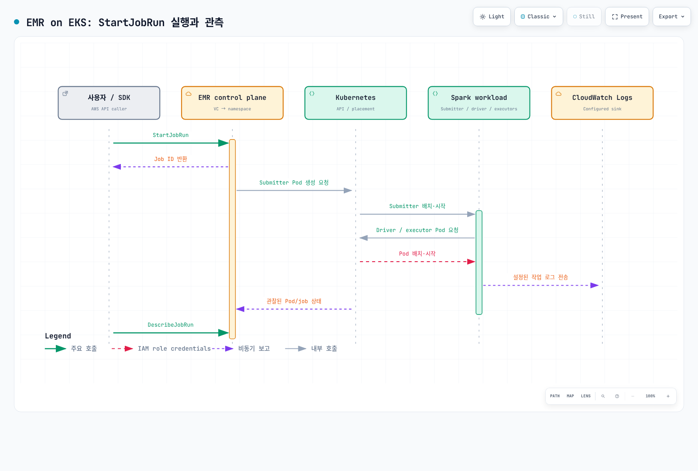

# Part 3: Amazon EMR on EKS

> **최종 검토**: 2026년 9월 12일 · API 예제는 `emr-spark-8.0.0-20260421` 기준

## EMR 런타임과 제출 경로

EMR on EKS는 기존 EKS에 AWS가 관리하는 Spark 런타임과 제출 기능을 제공합니다.
EKS control plane·노드·용량·네트워크·스토리지는 계속 운영해야 합니다.
다음 경로는 구분해야 합니다.

| 경로 | 제출·수명주기 | 필요한 관리 |
| --- | --- | --- |
| StartJobRun | EMR virtual cluster ID와 실행 역할로 AWS API 호출 | EMR job 상태·권한·로그 설정 |
| EMR 런타임 + Spark Operator | 설치한 EMR용 Operator에 SparkApplication CR 제출 | Helm/CRD·controller·Kubernetes RBAC·작업 상태 |
| 직접 spark-submit | Spark가 Kubernetes API에 제출 | 제출자·Spark 설정·상태·재실행 |

EMR 6.10.0+의 Spark Operator 지원은 **StartJobRun이 내부적으로 Operator에
위임하는 옵션이라는 뜻이 아닙니다**. 공식 Operator 경로는 별도로 설치하고
kubectl apply로 CR을 생성합니다. 같은 작업이 자동으로 StartJobRun job ID나
EMR job API의 관리 대상이 된다고 가정하지 않습니다. EMR 런타임과 CR 기반 운영을
함께 사용할 수 있지만 제출·관측·재시도 방식은 각 경로에 맞게 설계합니다.
EMR용 chart를 Part 2의 최신 Kubeflow/Apache chart와 동일하다고 가정하지 않습니다.

## 현재 릴리스와 재현성

| EMR on EKS 릴리스 | Spark 런타임 |
| --- | --- |
| emr-7.13.0 | 3.5.6-amzn-2 |
| emr-spark-8.0.0 | 4.0.2-amzn-0; Spark 4.x GA, 2026년 4월 출시 |

Spark 4는 예정 기능이 아닙니다. 8.0.0은 EMR 런타임 릴리스 이름이며 Apache Spark
버전 8을 뜻하지 않습니다. 다른 EMR 배포 방식의 세부 버전·기능도 각각 확인합니다.
`-latest`는 보안 업데이트를 따라가는 별칭이므로 동일한 이미지 바이트를 고정하지
않습니다. 날짜 suffix는 선택한 릴리스를 재현하는 데 유용하지만 업데이트 검토는
계속 필요합니다. 아래 예제의 날짜 릴리스는 최신 보안 상태를 보장하는 권장이 아닙니다.

## 실습 전 준비

지원 중인 EKS 버전과 호환 kubectl, 최신 AWS CLI v2를 사용합니다. 오래된 1.30을
일괄 권장하지 않습니다. Pod Identity CLI helper는 2.24.0 이상이 필요합니다.
관리자가 다음 항목을 준비한 뒤 아래 API 예제를 실행합니다.

1. 작업 namespace `emr-spark`, 노드 용량·네트워크, namespace quota/admission 정책.
2. EMR service-linked role과 EKS API 접근. 새 virtual cluster에는 EKS Access Entry
   연동을 사용합니다. 공식 CAM 절차는 API_AND_CONFIG_MAP을 예시로 설명하므로
   현재 인증 모드를 확인하며 이미 API-only인 cluster를 되돌리려 하지 않습니다.
   기존 virtual cluster가 자동 마이그레이션된다고 가정하지 않습니다.
3. 작업 실행 역할 `docs-emr-job`: 아래 script object 읽기, 필요한 데이터·KMS 권한,
   CloudWatch log group/stream 접근만 허용합니다.
4. 기존 S3 artifact bucket과 `/emr-containers/docs-spark` log group, 보존 기간.
   업로더 권한과 job 실행 역할 권한을 구분합니다.
5. 제출자의 StartJobRun·조회/취소 권한과 허용 실행 역할.
   `emr-containers:ExecutionRoleArn` 조건으로 사용 가능한 역할을 제한합니다.
   Pod Identity 경로의 PassRole은 지정 역할과 `pods.eks.amazonaws.com`으로 제한합니다.

Virtual cluster는 EKS namespace 등록이며 새 compute cluster가 아닙니다.
하지만 “등록은 어떤 리소스·권한도 바꾸지 않는다”는 설명은 부정확합니다.
최초 service-linked role 생성 및 CAM access entry/policy 설정이 발생할 수 있습니다.
Namespace는 단독 보안 경계가 아니므로 RBAC·네트워크·Pod 보안도 필요합니다.

## 실행 역할: IRSA 또는 Pod Identity

IRSA는 cluster OIDC provider·audience·namespace·EMR 관리 service account 이름에
맞는 trust가 필요합니다. update-role-trust-policy는 이 IAM trust를 수정하는 관리
명령이며 데이터를 읽는 권한이나 제출자 권한을 자동으로 추가하지 않습니다.

StartJobRun은 EMR **7.3.0부터 EKS Pod Identity도 지원**합니다. 이 경로는
Agent/노드 EKS Auth 권한, `pods.eks.amazonaws.com`에 대한
sts:AssumeRole·sts:TagSession trust, 그리고 실행 역할과 EMR service account의
association이 필요합니다. Helper는 submitter·driver·executor의 세 association을
준비합니다. IRSA role annotation만으로 대신할 수 없습니다.

아래의 cluster/role 이름과 namespace를 실제 준비한 값으로 바꾸고 **선택한 경로만**
실행합니다. 해당 helper는 IAM/EKS 설정을 변경합니다.

```bash
# Option A: IRSA, after creating the cluster IAM OIDC provider and job role.
aws emr-containers update-role-trust-policy \
  --region "$AWS_REGION" \
  --cluster-name my-eks-cluster --namespace emr-spark --role-name docs-emr-job

# Option B: Pod Identity, after configuring the agent/node permissions and job-role trust.
# Choose the appropriate path; these are not two mandatory consecutive steps.
aws emr-containers create-role-associations \
  --region "$AWS_REGION" \
  --cluster-name my-eks-cluster --namespace emr-spark --role-name docs-emr-job
```

## Virtual cluster 등록

create-virtual-cluster.json으로 저장하고 예시 이름을 바꿉니다.

```json
{
  "name": "docs-spark-vc",
  "containerProvider": {
    "id": "my-eks-cluster",
    "type": "EKS",
    "info": {
      "eksInfo": {
        "namespace": "emr-spark"
      }
    }
  }
}
```

최신 서비스 문서에는 schedulerConfiguration의 maxConcurrentJobRuns와
maxInQueueJobRuns가 있습니다. 다만 검증 환경의 AWS CLI 2.35.11 서비스 모델에는
이 필드가 아직 없어 위 기본 예제에는 넣지 않았습니다. 사용 전 CLI/SDK 지원을
확인합니다. 작업 수 제한은 CPU·메모리 quota나 executor 상한을 대신하지 않습니다.

```bash
# Replace the cluster/name/namespace in create-virtual-cluster.json first.
: "${AWS_REGION:?Set the region of the EKS cluster}"
aws emr-containers create-virtual-cluster \
  --region "$AWS_REGION" \
  --cli-input-json file://create-virtual-cluster.json \
  --query id --output text
# Copy the returned id into start-job-run.json; verify state before submitting.
: "${EMR_VIRTUAL_CLUSTER_ID:?Set the returned virtual cluster ID}"
aws emr-containers describe-virtual-cluster \
  --region "$AWS_REGION" --id "$EMR_VIRTUAL_CLUSTER_ID" \
  --query 'virtualCluster.{state:state,provider:containerProvider}'
```

CreateVirtualCluster 응답 필드는 **id**입니다. StartJobRun 요청의 virtualClusterId에
그 값을 사용하며 RUNNING 상태와 대상 namespace를 확인합니다.

## 실행 가능한 smoke job

smoke.py로 저장합니다. 외부 데이터를 변경하지 않고 rows=10, total=45를 검증합니다.

```python
from pyspark.sql import SparkSession
from pyspark.sql import functions as F

spark = SparkSession.builder.appName("docs-emr-smoke").getOrCreate()
try:
    result = spark.range(10).agg(F.count("*").alias("rows"), F.sum("id").alias("total")).first()
    if result.rows != 10 or result.total != 45:
        raise RuntimeError(f"Unexpected result: {result}")
    print("SMOKE_OK rows=10 total=45")
finally:
    spark.stop()
```

start-job-run.json으로 저장하고 virtualClusterId·계정·역할·bucket을 실제 값으로
바꿉니다. S3 script와 log group 접근 권한을 준비한 상태여야 합니다.

```json
{
  "name": "docs-spark-smoke",
  "virtualClusterId": "abcd1234efgh5678ijkl9012mnop",
  "executionRoleArn": "arn:aws:iam::111122223333:role/docs-emr-job",
  "releaseLabel": "emr-spark-8.0.0-20260421",
  "jobDriver": {
    "sparkSubmitJobDriver": {
      "entryPoint": "s3://my-existing-artifact-bucket/docs-emr/smoke.py",
      "sparkSubmitParameters": "--conf spark.executor.instances=2 --conf spark.executor.cores=1 --conf spark.executor.memory=1g --conf spark.driver.cores=1 --conf spark.driver.memory=1g"
    }
  },
  "configurationOverrides": {
    "monitoringConfiguration": {
      "cloudWatchMonitoringConfiguration": {
        "logGroupName": "/emr-containers/docs-spark",
        "logStreamNamePrefix": "smoke"
      }
    }
  }
}
```

```bash
# Replace the bucket in this command and start-job-run.json with the same existing bucket.
aws s3 cp smoke.py s3://my-existing-artifact-bucket/docs-emr/smoke.py \
  --region "$AWS_REGION"

# Keep this token for retries of the same request. Use a new token for a new intended run.
EMR_REQUEST_TOKEN="$(python3 -c 'import uuid; print(uuid.uuid4())')"
aws emr-containers start-job-run \
  --region "$AWS_REGION" \
  --cli-input-json file://start-job-run.json \
  --client-token "$EMR_REQUEST_TOKEN" --query id --output text

: "${EMR_JOB_ID:?Set the returned job ID}"
aws emr-containers describe-job-run \
  --region "$AWS_REGION" --virtual-cluster-id "$EMR_VIRTUAL_CLUSTER_ID" \
  --id "$EMR_JOB_ID" --query 'jobRun.{state:state,details:stateDetails,reason:failureReason}'
```

API의 성공 응답은 접수 성공입니다. 최종 COMPLETED 상태와 driver 로그의
SMOKE_OK rows=10 total=45를 확인합니다. Request token은 같은 API 요청 중복을
제어하며 애플리케이션 재시도의 외부 부작용까지 exactly-once로 만들지 않습니다.
환경 장애 시 stateDetails·failureReason·submitter/driver/executor 로그를 함께 봅니다.



[Interactive diagram](https://www.atomai.click/kubernetes-docs/archmaps/ko-data-on-eks-spark-03-emr-on-eks-0.html)

## Pod 설정·관측·대화형 개발

EMR Pod도 namespace에서 kubectl로 볼 수 있습니다. Pod template과 지원되는 custom
image 경로로 설정을 바꿀 수 있으므로 “Pod spec을 작성할 수 없다”는 설명은 틀립니다.
하지만 StartJobRun이 관리하는 namespace·service account·이름 등은 임의로 덮어쓰지
않습니다. 릴리스·제출 방식별 지원 필드와 custom image 검증 절차를 따릅니다.

CloudWatch 로그는 monitoringConfiguration과 실행 역할 권한이 필요합니다.
Job 상태 메트릭과 전체 Spark executor 메트릭은 구분합니다. Step Functions에는
StartJobRun의 요청/응답 및 .sync 통합이 있지만 state machine·역할을 구성해야 합니다.
EventBridge의 작업 이벤트도 rule·target과 실패 처리를 구성해야 합니다.
서비스 통합이 있다는 이유로 모든 수집과 자동화가 기본 활성화되는 것은 아닙니다.

EMR Studio는 **CreateManagedEndpoint로 만든 interactive endpoint**와 연결합니다.
Jupyter Enterprise Gateway가 kernel 수명주기를 관리하며 private subnet·ALB
controller·네트워크·역할 구성이 필요합니다. 노트북 cell이 일반 StartJobRun batch
호출로 그대로 변환된다고 설명하지 않습니다. Endpoint에 연결하는 사용자/kernel이
해당 endpoint 실행 역할을 공유하므로 접근 경계와 별도 endpoint 구성을 검토합니다.
Endpoint·kernel은 비용을 발생시키며 virtual cluster 등록만 무료라는 설명과 구분합니다.

## 운영 선택과 정리

AWS API 중심 제출·EMR 런타임을 원하면 StartJobRun을, Kubernetes CR 중심 운영을
원하면 적합한 Operator 경로를 검토합니다. 원하는 upstream 버전·plugin·이식성,
실제 성능과 총비용을 비교합니다. EMR 런타임을 쓰더라도 EKS/compute·스토리지·로그
비용과 운영 책임이 사라지지 않습니다.

Virtual cluster 삭제를 모든 작업·데이터·역할 정리 명령으로 사용하지 않습니다.
실행 중 작업과 endpoint를 먼저 점검하고 의도한 리소스를 각각 정리합니다.

```bash
# Inspect active work/endpoints before cleanup.
aws emr-containers list-job-runs \
  --region "$AWS_REGION" --virtual-cluster-id "$EMR_VIRTUAL_CLUSTER_ID"
aws emr-containers list-managed-endpoints \
  --region "$AWS_REGION" --virtual-cluster-id "$EMR_VIRTUAL_CLUSTER_ID"
# If this demo job is still active and should stop:
aws emr-containers cancel-job-run \
  --region "$AWS_REGION" --virtual-cluster-id "$EMR_VIRTUAL_CLUSTER_ID" --id "$EMR_JOB_ID"
# After reviewing/cleaning the relevant jobs and any managed endpoints:
aws emr-containers delete-virtual-cluster \
  --region "$AWS_REGION" --id "$EMR_VIRTUAL_CLUSTER_ID"
aws emr-containers describe-virtual-cluster \
  --region "$AWS_REGION" --id "$EMR_VIRTUAL_CLUSTER_ID" --query virtualCluster.state
```

삭제는 비동기 상태를 확인합니다. 권한 문제는 ARRESTED로 나타날 수 있습니다.
Namespace·EKS cluster·S3 artifact·log group·IAM role과 Pod Identity association을
각각 검토합니다. Association은 namespace/SA가 없어도 남을 수 있으므로 사용이 끝난
연결만 별도로 정리합니다. 공유 리소스는 이 실습 때문에 삭제하지 않습니다.

예제는 로컬 CLI 입력·문법을 검증했으며 실제 AWS 배포나 EMR 런타임 실행을 완료했다는
의미는 아닙니다. 계정 권한·quota·네트워크·릴리스 사용 가능성은 실제 환경에서 검증합니다.


- [EMR on EKS release labels](https://docs.aws.amazon.com/emr/latest/EMR-on-EKS-DevelopmentGuide/emr-eks-releases.html)
- [EMR Spark 8.0.0 on EKS release notes](https://docs.aws.amazon.com/emr/latest/EMR-on-EKS-DevelopmentGuide/emr-eks-spark-8.0.0.html)
- [EKS cluster access setup](https://docs.aws.amazon.com/emr/latest/EMR-on-EKS-DevelopmentGuide/setting-up-cluster-access.html)
- [Job execution role and execution-role condition](https://docs.aws.amazon.com/emr/latest/EMR-on-EKS-DevelopmentGuide/iam-execution-role.html)
- [Pod Identity setup for StartJobRun](https://docs.aws.amazon.com/emr/latest/EMR-on-EKS-DevelopmentGuide/setting-up-enable-IAM.html)
- [Virtual clusters and scheduler limits](https://docs.aws.amazon.com/emr/latest/EMR-on-EKS-DevelopmentGuide/virtual-cluster.html)
- [StartJobRun API](https://docs.aws.amazon.com/emr-on-eks/latest/APIReference/API_StartJobRun.html)
- [EMR Spark Operator installation and CR submission](https://docs.aws.amazon.com/emr/latest/EMR-on-EKS-DevelopmentGuide/spark-operator-gs.html)
- [Interactive endpoint architecture](https://docs.aws.amazon.com/emr/latest/EMR-on-EKS-DevelopmentGuide/how-it-works.html)
- [Custom images](https://docs.aws.amazon.com/emr/latest/EMR-on-EKS-DevelopmentGuide/docker-custom-images.html)
- [CloudWatch logging configuration](https://docs.aws.amazon.com/emr/latest/EMR-on-EKS-DevelopmentGuide/emr-eks-jobs-cloudwatch.html)

## 다음 단계

[Part 4: Performance tuning](./04-performance-tuning.md)

[README](./README.md)

[Quiz](../../quizzes/data-on-eks/spark/03-emr-on-eks-quiz.md)
