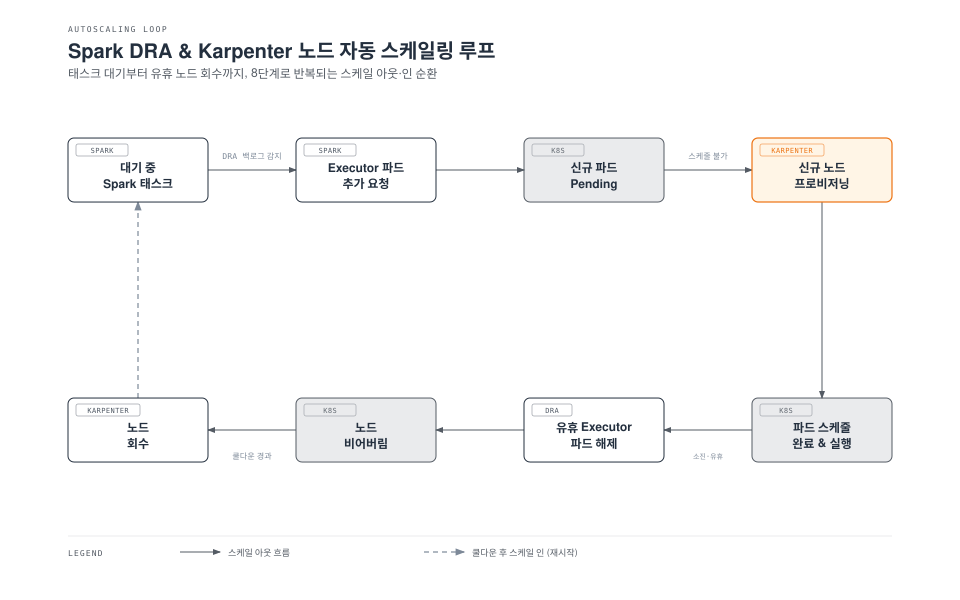

# Part 4: 성능 및 비용 튜닝

> **마지막 업데이트**: 2026년 7월 15일

Part 1에서는 `spark-submit`이 드라이버/Executor 파드를 Kubernetes API에 직접 스케줄링하는 과정과, 파드가 중간에 사라져도 잡이 버틸 수 있게 해주는 두 가지 장치인 Dynamic Resource Allocation(DRA)과 Graceful Decommission을 다뤘습니다. 이번 문서는 그 위에서, 셔플이 많은 Spark 워크로드가 실제로 견뎌내는 노드 타입과 로컬 스토리지는 무엇인지, Spot 인스턴스와 Decommission을 결합해도 잡 진행 상황을 잃지 않는 방법은 무엇인지, 그리고 Karpenter의 노드 단위 오토스케일링과 Spark의 파드 단위 DRA를 하나가 아니라 서로 영향을 주는 **두 개의 독립적인 제어 루프**로 봐야 하는 이유를 다룹니다.

## 실습 환경 준비

이 문서의 예제를 따라 하려면 다음이 필요합니다.

### 필수 도구

* kubectl v1.30 이상
* [Karpenter](../../autoscaling/02-karpenter.md)가 설치되고 `EC2NodeClass`/`NodePool` 쌍이 최소 하나 이상 구성된 EKS 클러스터
* 로컬에 배포된 Apache Spark 4.2 (클러스터로 `spark-submit`을 실행하기 위함)
* metrics-server 또는 Kubernetes Metrics API 활성화 — Pending 파드 기반 스케일링이 문서 설명대로 동작하려면 필요

## 1. 셔플이 많은 잡을 위한 노드 타입 선택

Spark on EKS에 대한 AWS 자체 모범 사례 가이드는 셔플이 많은 워크로드에는 **로컬 NVMe 인스턴스 스토어를 갖춘 R 계열 인스턴스** — 구체적으로 R5d, R5ad, R5dn — 를 권장합니다. 이유는 단순합니다. 셔플 스테이지는 대체로 CPU가 아니라 메모리와 디스크 I/O에 의해 성능이 좌우되므로, vCPU당 메모리 비율이 넉넉하고 로컬 디스크가 빠른 인스턴스 패밀리가 범용이나 컴퓨팅 최적화 패밀리보다 이 워크로드에 더 적합합니다.

```yaml
apiVersion: karpenter.sh/v1
kind: NodePool
metadata:
  name: spark-shuffle-heavy
spec:
  template:
    spec:
      requirements:
        - key: node.kubernetes.io/instance-type
          operator: In
          values: ["r5d.2xlarge", "r5d.4xlarge", "r5ad.2xlarge", "r5dn.2xlarge"]
        - key: karpenter.sh/capacity-type
          operator: In
          values: ["spot", "on-demand"]
      nodeClassRef:
        group: karpenter.k8s.aws
        kind: EC2NodeClass
        name: spark-nvme
```

**Graviton에 대한 참고 사항:** 이 섹션이 근거로 삼은 AWS 가이드는 Graviton(arm64) 인스턴스 타입 — R5d/R5ad/R5dn과 동일하게 R 계열 메모리 비율에 NVMe 인스턴스 스토어를 갖춘 R6gd, R7gd 등 — 을 Spark 셔플 워크로드에 대해 별도로 언급하지 않습니다. 문서화되지 않은 Graviton 동등성을 단정하기보다는, 별도로 검증해야 할 대상으로 다루는 것이 맞습니다. arm64용 Spark 컨테이너 이미지를 빌드하고, 대표적인 셔플 워크로드로 동급 x86 NVMe 인스턴스와 벤치마크를 비교하고, 잡에서 쓰는 네이티브/JNI 의존성(압축 코덱, 네이티브 BLAS 라이브러리 등)이 실제로 arm64 빌드를 제공하는지 확인한 뒤에 도입을 결정하세요.

## 2. 셔플 스필 스토리지: EBS보다 NVMe 인스턴스 스토어

Spark는 셔플 블록과 RDD 스필 데이터를 `spark.local.dir`에 지정된 디렉터리에 씁니다. 새로 프로비저닝된 EKS 워커 노드에서 이 경로는 기본적으로 **루트 EBS 볼륨** 위의 공간으로 잡히는데, 루트 볼륨은 보통 20GB 안팎으로 OS와 컨테이너 이미지를 위해 잡힌 크기이지 수백 GB~TB 단위의 셔플 스크래치 공간을 감당할 크기가 아닙니다. 실제 셔플 부하가 걸리면 이 공간은 금방 가득 차고, Spark 레벨 오류가 아니라 `No space left on device`로 잡이 죽습니다.

해법은 R5d/R5ad/R5dn(그리고 Nitro 인스턴스 전반)에 딸려 오는 NVMe 인스턴스 스토어 디스크를 마운트하고 `spark.local.dir`이 그쪽을 가리키게 만드는 것입니다. 인스턴스 스토어는 물리 호스트에 직접 붙은 임시 로컬 디스크이므로, 네트워크로 붙는 EBS보다 훨씬 높은 처리량과 IOPS를 제공하면서도 GB당·IOPS당 별도 과금이 없습니다.

```bash
# EC2NodeClass userData (일부): 부트스트랩 시점에 NVMe 인스턴스 스토어를 포맷/마운트
#!/bin/bash
for disk in $(lsblk -d -o NAME,TYPE | awk '$2=="disk" && $1 ~ /^nvme/ {print $1}'); do
  # 루트/EBS 기반 디바이스는 건너뛰고, 실제 인스턴스 스토어 NVMe 디스크만 처리
  if ! mount | grep -q "/dev/$disk"; then
    mkfs.xfs "/dev/$disk"
    mkdir -p "/mnt/k8s-disks/$disk"
    mount "/dev/$disk" "/mnt/k8s-disks/$disk"
    chmod 777 "/mnt/k8s-disks/$disk"
  fi
done
```

```yaml
# Executor 파드 템플릿: 호스트의 NVMe 경로를 spark.local.dir로 마운트
apiVersion: v1
kind: Pod
spec:
  containers:
    - name: spark-kubernetes-executor
      volumeMounts:
        - name: spark-local-dir
          mountPath: /data/spark-local
  volumes:
    - name: spark-local-dir
      hostPath:
        path: /mnt/k8s-disks/nvme1n1
        type: Directory
```

```properties
# spark-submit conf
spark.local.dir=/data/spark-local
```

인스턴스 스토어는 인스턴스가 정지되거나 종료되면 그대로 사라지므로, 이 방식은 셔플/스필처럼 일시적인 스크래치 데이터에만 적합합니다. 파드가 재시작돼도 살아있어야 하는 데이터에는 절대 사용하지 마세요.

## 3. Spot 인스턴스 전략: 드라이버는 On-Demand, Executor는 Spot

드라이버는 잡의 코디네이션 상태 — DAG 스케줄러, 태스크 북키핑, (client에 가까운 구성에서는) SparkContext 자체 — 를 쥐고 있습니다. 드라이버를 잃으면 일부 태스크가 아니라 잡 전체를 잃습니다. 반대로 Executor는 언제든 대체 가능한 컴퓨트로, 하나를 잃어도 그 Executor가 처리 중이던 태스크와 아직 마이그레이션하지 못한 셔플 데이터 정도만 손실됩니다. 이 비대칭성 때문에 다음과 같이 나누는 것이 권장됩니다.

* **드라이버 파드 → On-Demand** 용량 — AWS가 짧은 통보로 회수하지 않는 자원
* **Executor 파드 → Spot** 용량 — 개별 Executor가 중단될 수 있음을 감수

### 분리를 강제하기

노드 그룹 단위 Taint와 파드 단위 Toleration/노드 셀렉터를 함께 쓰면 드라이버 파드는 Spot 노드에 발을 들이지 못하고, Executor 파드는 On-Demand 노드를 (엄격하게 막지는 않더라도) 피하도록 만들 수 있습니다.

```yaml
apiVersion: karpenter.sh/v1
kind: NodePool
metadata:
  name: spark-driver-on-demand
spec:
  template:
    spec:
      requirements:
        - key: karpenter.sh/capacity-type
          operator: In
          values: ["on-demand"]
      taints:
        - key: spark-role
          value: driver
          effect: NoSchedule
      nodeClassRef:
        group: karpenter.k8s.aws
        kind: EC2NodeClass
        name: spark-nvme
---
apiVersion: karpenter.sh/v1
kind: NodePool
metadata:
  name: spark-executor-spot
spec:
  template:
    spec:
      requirements:
        - key: karpenter.sh/capacity-type
          operator: In
          values: ["spot"]
      nodeClassRef:
        group: karpenter.k8s.aws
        kind: EC2NodeClass
        name: spark-nvme
```

Spark에는 `spark.kubernetes.*.tolerations.*` 설정 항목이 존재하지 않습니다 — Toleration은 평범한 `spark-submit` conf 키로 노출되지 않고, Pod 템플릿 필드로만(또는 Part 2에서 다룬 Spark Operator를 쓴다면 `SparkApplication` CRD의 `spec.driver.tolerations`로) 설정할 수 있습니다. 일반 `spark-submit`에서는 드라이버 Pod 템플릿을 통해 Toleration을 추가합니다.

```yaml
# driver-pod-template.yaml
apiVersion: v1
kind: Pod
spec:
  tolerations:
    - key: spark-role
      operator: Equal
      value: driver
      effect: NoSchedule
```

```properties
# spark-submit conf: 드라이버는 위 템플릿을 사용하고 On-Demand 풀을 타겟팅
spark.kubernetes.driver.podTemplateFile=driver-pod-template.yaml
spark.kubernetes.driver.node.selector.karpenter.sh/capacity-type=on-demand

# Executor는 드라이버 Taint에 대한 Toleration이 없으므로 해당 노드에 절대 스케줄되지 않고,
# 대신 Spot 풀을 명시적으로 타겟팅
spark.kubernetes.executor.node.selector.karpenter.sh/capacity-type=spot
```

`spark-role=driver` Toleration은 드라이버 Pod에만 붙어 있으므로, On-Demand `NodePool`의 `NoSchedule` Taint는 Executor를 포함한 다른 모든 Pod를 그 노드에서 막아줍니다. Executor는 별도로 노드 셀렉터를 통해 Spot `NodePool` 쪽으로 보내집니다.

### 중단을 버텨내게 만들기

Taint와 Toleration은 파드가 **어디에 배치되는지**만 제어할 뿐, 그것만으로 Spot 중단이 무해해지지는 않습니다. 이를 위한 것이 Part 1에서 다룬 Graceful Decommission 설정입니다.

```properties
spark.decommission.enabled=true
spark.storage.decommission.enabled=true
```

AWS는 Spot 인스턴스를 회수하기 전에 대략 **2분의 중단 통보 시간**을 줍니다. Decommission이 활성화되어 있으면 Spark는 이 시간 동안 곧 사라질 Executor가 들고 있던 셔플 블록과 캐시된 RDD 파티션을 정상 상태의 다른 Executor로 마이그레이션합니다. 만약 여유 공간을 가진 피어 Executor가 없다면, Spark는 설정되어 있는 durable/원격 셔플 스토리지로 폴백하거나(설정이 없다면 해당 태스크를 그냥 재계산하게 둡니다) — 성능은 저하되지만 잡 실패로 이어지지는 않습니다. 결과적으로 Spot 중단은 "잡이 처음부터 다시 시작"되는 사건이 아니라 "몇몇 태스크가 다른 Executor에서 재실행"되는 수준으로 줄어듭니다.

## 4. 두 개의 독립적인 스케일링 루프: Karpenter와 Dynamic Resource Allocation

DRA와 Karpenter를 함께 쓰기 시작하면, 이 둘이 서로 다른 신호에 반응하면서도 서로에게 영향을 주는 **두 개의 별도 제어 루프**라는 점을 분명히 인식해 두는 것이 좋습니다.

* **Spark의 DRA**는 자신이 파악하고 있는 대기 중인 **태스크** 물량을 보고 Executor **파드**를 몇 개나 요청/해제할지 결정합니다 — 이는 Spark 내부 판단으로, 밑단의 노드 상태는 전혀 모릅니다.
* **Karpenter**는 스케줄되지 못한 **파드**(또는 비어버린 노드)를 감시하며 EC2 용량을 늘릴지 줄일지 결정합니다 — 이는 노드 단위 판단으로, Spark의 태스크 백로그는 전혀 모르고 DRA가 이미 만들어 놓은 파드만 봅니다.



이 관계를 알고 있어야 하는 실질적인 이유는, 한쪽 루프만 튜닝하면 두 루프의 동작이 서로 어긋난다는 점입니다. DRA의 `spark.kubernetes.allocation.batch.size`가 Karpenter의 `NodePool`이 맞춰줄 수 있는 속도보다 빠르게 Executor를 요청하면, 새 Executor 파드는 예상보다 오래 `Pending` 상태로 남습니다. 반대로 Karpenter의 `consolidateAfter`([NodePool 설정](../../autoscaling/02-karpenter.md#nodepool) 참고)를 너무 짧게 잡고 DRA의 `spark.dynamicAllocation.executorIdleTimeout`은 상대적으로 길게 두면, DRA가 아직 해제하지 않은 Executor가 남아 있는 노드를 Karpenter가 통합(consolidate)하려다 3절의 PodDisruptionBudget/Decommission 경로와 충돌할 수 있습니다. 기본 원칙으로는 Karpenter의 통합 지연 시간을 DRA의 Executor 유휴 타임아웃보다 다소 길게 잡아, DRA가 노드를 먼저 비워둔 뒤에 Karpenter가 회수를 시도하도록 순서를 맞추는 것이 안전합니다.

## 5. 드라이버·Executor 리소스 요청/제한 크기 설계

드라이버와 Executor는 역할이 다르고, 최소한 개념적으로는 이 차이가 리소스 크기에도 반영되어야 합니다.

* **드라이버**: 실제 필요량보다 여유 있고 안정적으로 크게 잡습니다. 잡 전체의 단일 장애점이기 때문에 메모리 한계에 바짝 붙어 있다가 일시적인 스파이크로 OOM-kill을 당하면 안 되고, (3절에서 본 대로) 대체 가능한 Executor처럼 가볍게 축출되어서도 안 됩니다.
* **Executor**: 작게 잡고 수를 늘립니다. 데이터를 여러 조각으로 나눠 많은 Executor가 병렬로 처리하는 것 자체가 수평 확장의 목적이며, 4절의 DRA는 Executor 하나하나가 자유롭게 추가·제거될 만큼 개별적으로 가벼워야 성립합니다.

Spark 자체의 리소스 설정은 Kubernetes 파드 리소스 필드에 그대로 대응됩니다.

| Spark 설정 | Kubernetes에 미치는 영향 |
| --- | --- |
| `spark.driver.memory`, `spark.driver.cores` | 드라이버 컨테이너의 `resources.requests`/`.limits` (메모리 오버헤드가 더해짐) |
| `spark.executor.memory`, `spark.executor.cores` | 각 Executor 컨테이너의 `resources.requests`/`.limits` |
| `spark.driver.memoryOverheadFactor` | `spark.driver.memory` 위에 오프힙/JVM 오버헤드용으로 추가되는 여유분 |

여기에는 모든 잡에 들어맞는 수치 기본값이 없습니다. 드라이버가 필요로 하는 메모리는 얼마나 많은 상태(파티션 수, 브로드캐스트 변수 크기, 어큐뮬레이터)를 추적하느냐에 달려 있고, Executor가 필요로 하는 메모리는 태스크당 작업셋 크기와 셔플 버퍼 설정에 달려 있습니다. 다른 파이프라인에서 쓰던 값을 그대로 가져오지 말고, 실제 잡과 데이터셋 크기로 부하 테스트를 해서 값을 찾아가는 대상으로 다루세요.

## 6. 비용 최적화: 일반 EKS 기법 위에 쌓기

Spot 인스턴스 활용, Karpenter 통합을 통한 빈 패킹, 인스턴스 타입 라이트사이징 같은 EKS 전반의 비용 절감 기법 대부분은 클러스터의 다른 워크로드에 적용되는 것과 똑같이 Spark에도 적용됩니다. [Amazon EKS 비용 최적화](../../eks/07-eks-cost-optimization.md) 문서가 이런 일반 기법을 다루고 있으니, 이 절에서는 그 기법들을 **Spark의 드라이버/Executor 파드 모델**에 어떻게 구체적으로 적용하는지에 집중합니다.

* 해당 문서의 [스팟 인스턴스 활용](../../eks/07-eks-cost-optimization.md#스팟-인스턴스-활용) 절은 드라이버가 아니라 Executor에 적용됩니다 — 왜 이 구분이 중요한지는 3절에서 다룬 Spark 고유의 이유 때문입니다.
* [Karpenter의 통합(consolidation) 동작](../../autoscaling/02-karpenter.md#nodepool)은 DRA가 Executor를 줄여 비게 된 노드를 회수하는데, 이는 4절에서 본 피드백 루프의 뒷부분 그 자체입니다 — 통합이 실제로 이득을 보려면 DRA가 유휴 Executor를 제때 해제해 줘야 합니다.
* 1절의 인스턴스 타입 선택과 2절의 NVMe 기반 로컬 스토리지는 비용 최적화 문서의 "적절한 인스턴스 패밀리를 고르라"는 일반 지침을 Spark에 맞게 구체화한 내용입니다.

## 다음 단계

이 문서에서는 셔플이 많은 잡을 위한 노드 타입 선택, EBS보다 NVMe 인스턴스 스토어가 셔플 스필에 유리한 이유, On-Demand 드라이버/Spot Executor 분리와 Graceful Decommission이 Spot 중단을 버텨내게 해주는 방식, Karpenter와 DRA라는 두 개의 독립적인 스케일링 루프가 서로 어긋나지 않게 맞추는 법, 그리고 드라이버·Executor 리소스 크기를 설계하는 사고방식을 다뤘습니다. 이 문서가 기반으로 삼은 일반 EKS 비용 기법과 함께, 이는 Spark on EKS의 성능·비용 측면을 마무리하는 내용입니다. 모니터링, 보안, Spark on EKS의 운영(Day-2) 모범 사례는 다음 [Part 5: 모범 사례와 보안](./05-best-practices.md)에서 다룹니다.

[메인 페이지로 돌아가기](./README.md)

## 퀴즈

이 장에서 배운 내용을 테스트하려면 [주제 퀴즈](../../quizzes/data-on-eks/spark/04-performance-tuning-quiz.md)를 풀어보세요.
