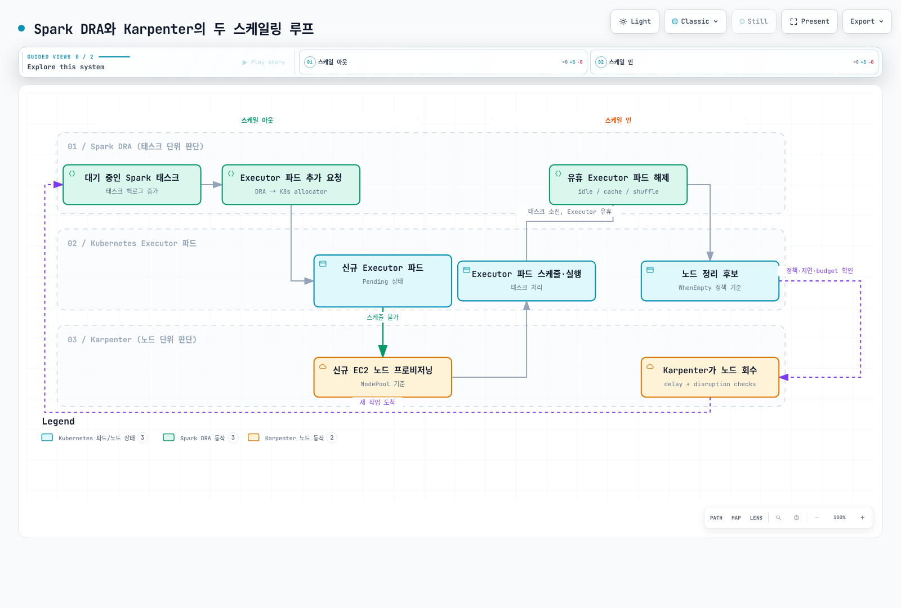

# Part 4: 성능 및 비용 튜닝

> **검토 기준**: 2026년 9월 12일 · upstream Spark 4.2.0 · Karpenter 1.14 계열

## 실습 범위와 측정

이 장은 Part 1의 직접 spark-submit 경로를 사용합니다. Spark 4.2는 Kubernetes
1.34+를 요구하며, EKS·kubectl·Karpenter의 호환 버전도 확인합니다.
Part 2의 Operator 및 Part 3의 EMR은 제출·Pod 변경 경로가 다르므로 설정을
무조건 복사하지 않습니다. 아래 수치는 성능 최적값이 아닌 작은 시작 설정입니다.

**Karpenter의 Pending Pod 기반 용량 공급에 metrics-server가 필수인 것은 아닙니다.**
Pod 요청·스케줄링 조건으로 동작합니다. metrics-server는 kubectl top·HPA 등의
사용량 관찰에 유용하지만 Spark task backlog를 수집하거나 EC2를 직접 늘리지 않습니다.

Event log와 Spark UI에서 stage/task 시간, spill 크기, shuffle fetch wait, skew,
GC와 executor 손실을 보고, 노드의 CPU·메모리·디스크/네트워크 한계와 함께 판단합니다.
실제 I/O 병목인지 확인하기 전에는 R 계열이나 NVMe가 항상 빠르다고 단정하지 않습니다.
AQE·partition 수·join 전략·데이터 포맷을 함께 검토하고 한 번에 한 요인을 바꿉니다.

## 1. 노드와 인스턴스 스토어 선택

R5d/R5ad/R5dn 같은 과거 예시는 선택 가능한 조합의 일부입니다. CPU 중심,
메모리 중심, 디스크/네트워크 중심 작업에 따라 M/C/R/I 계열을 비교하며 현재
리전·AZ의 용량과 총비용으로 결정합니다. R 계열이 모든 셔플 작업에 우월하거나
C 계열이 Spark에 부적합한 것은 아닙니다.

Graviton은 Spark에서 평가할 수 있는 정상적인 선택지입니다. 검증한 multi-arch
이미지를 사용할 수 있으며 직접 이미지 빌드가 항상 필요한 것은 아닙니다.
JNI·압축 codec·BLAS·Python wheel 및 custom plugin의 arm64 지원을 확인합니다.
아래 NodePool은 하나의 검증 경로를 위해 amd64를 선택하며 성능 우위를 주장하지 않습니다.

**Nitro 또는 NVMe라는 이름만으로 instance store를 판별하지 않습니다.**
EBS도 Nitro 인스턴스에서 NVMe로 노출됩니다. 마운트되지 않았다는 사실도 비어 있거나
포맷해도 된다는 뜻이 아닙니다. 기존 nvme 디스크 순회·mkfs 예제는 EBS나 루트
디스크를 오인할 수 있어 제거했습니다.

## 2. AL2023에서 관리되는 scratch 저장소

실습 전 관리자가 두 EC2NodeClass를 준비합니다.

- `spark-general`: driver용으로 검증한 일반 노드 설정.
- `spark-nvme`: 선택한 Kubernetes/아키텍처에 맞는 **AL2023 AMI를 고정**하고
  IAM·subnet·security group을 설정한, executor 전용 새 NodeClass.

spark-nvme 전체 설정에 다음 필드를 포함합니다. 이것은 **부분 설정**이며 단독
kubectl apply 리소스가 아닙니다. 기존 NodeClass 변경은 drift와 노드 교체를
유발할 수 있으므로 운영 중 노드에 즉석 포맷 스크립트를 실행하지 않습니다.

```yaml
spec:
  instanceStorePolicy: RAID0
```

AL2023에서는 Karpenter가 NodeConfig로 instance-store RAID0 초기화를 구성하고
kubelet/containerd의 ephemeral storage로 사용하도록 합니다. Allocatable도 해당
용량을 반영합니다. 직접 /dev/nvme1n1을 고정하거나 hostPath를 사용할 필요가 없습니다.
다른 AMI 계열·custom bootstrap은 해당 지원 절차를 따릅니다.

Instance store는 transient scratch에 적합하며 정지·종료·장애 시 데이터가 사라질
수 있습니다. RAID0은 복제나 백업이 아닙니다. 별도 EBS volume 과금 항목은 없더라도
디스크가 포함된 인스턴스 가격·유휴 용량·재계산 비용은 있습니다.
EBS도 용량·IOPS·처리량·instance 한계를 맞춰 사용 가능한 선택지입니다.
루트 EBS 크기나 backing filesystem을 모든 EKS에서 20GB로 가정하지 않습니다.

## 3. Driver On-Demand / executor Spot 배치

On-Demand driver는 Spot 회수 위험을 줄이지만 장애·유지보수·Karpenter drift/expiry를
없애지는 않습니다. Driver의 SparkContext와 coordination 상태는 cluster/client
모드 모두 중요합니다. Driver 재시작·작업 재실행과 데이터 복구는 별도로 설계합니다.

아래 nodepools.yaml은 준비한 두 NodeClass를 참조합니다. Executor는 instance store
용량이 있는 타입만 허용합니다. Spot-only이므로 용량이 부족하면 Pending일 수 있으며
On-Demand로 자동 fallback하지 않습니다. Fallback이 필요하면 별도 정책·비용 한도로 설계합니다.

```yaml
apiVersion: karpenter.sh/v1
kind: NodePool
metadata:
  name: spark-driver
spec:
  template:
    metadata:
      labels:
        workload-pool: spark-driver
    spec:
      requirements:
      - key: kubernetes.io/arch
        operator: In
        values:
        - amd64
      - key: kubernetes.io/os
        operator: In
        values:
        - linux
      - key: karpenter.sh/capacity-type
        operator: In
        values:
        - on-demand
      - key: karpenter.k8s.aws/instance-category
        operator: In
        values:
        - m
        - r
      - key: karpenter.k8s.aws/instance-generation
        operator: Gt
        values:
        - '5'
      taints:
      - key: spark-role
        value: driver
        effect: NoSchedule
      nodeClassRef:
        group: karpenter.k8s.aws
        kind: EC2NodeClass
        name: spark-general
  limits:
    cpu: '64'
    memory: 512Gi
  disruption:
    consolidationPolicy: WhenEmpty
    consolidateAfter: 120s
---
apiVersion: karpenter.sh/v1
kind: NodePool
metadata:
  name: spark-executor
spec:
  template:
    metadata:
      labels:
        workload-pool: spark-executor
    spec:
      requirements:
      - key: kubernetes.io/arch
        operator: In
        values:
        - amd64
      - key: kubernetes.io/os
        operator: In
        values:
        - linux
      - key: karpenter.sh/capacity-type
        operator: In
        values:
        - spot
      - key: karpenter.k8s.aws/instance-category
        operator: In
        values:
        - m
        - r
        - i
      - key: karpenter.k8s.aws/instance-generation
        operator: Gt
        values:
        - '5'
      - key: karpenter.k8s.aws/instance-local-nvme
        operator: Gt
        values:
        - '0'
      taints:
      - key: spark-role
        value: executor
        effect: NoSchedule
      nodeClassRef:
        group: karpenter.k8s.aws
        kind: EC2NodeClass
        name: spark-nvme
  limits:
    cpu: '256'
    memory: 2048Gi
  disruption:
    consolidationPolicy: WhenEmpty
    consolidateAfter: 120s
```

Pool label과 node selector는 대상을 선택하고 toleration은 해당 taint를 허용합니다.
Toleration만으로 그 노드에 강제 배치되는 것은 아니며, 다른 Pod도 같은 toleration을
가질 수 있습니다. NoSchedule은 이미 실행 중인 Pod를 퇴거시키지 않습니다.
NodePool limits는 용량 가드레일이며 동시 scale-out에서 일시 초과할 수 있는
eventually consistent 제한입니다. 정확한 비용 상한으로 해석하지 않습니다.

driver-template.yaml로 저장합니다. 이것은 Spark가 완성하는 **Pod template**이며
단독 Pod 배포 파일이 아닙니다.

```yaml
apiVersion: v1
kind: Pod
spec:
  securityContext:
    runAsNonRoot: true
    runAsUser: 185
    fsGroup: 185
  tolerations:
  - key: spark-role
    operator: Equal
    value: driver
    effect: NoSchedule
  containers:
  - name: spark-kubernetes-driver
    securityContext:
      allowPrivilegeEscalation: false
      capabilities:
        drop:
        - ALL
      seccompProfile:
        type: RuntimeDefault
    resources:
      requests:
        ephemeral-storage: 2Gi
      limits:
        ephemeral-storage: 4Gi
```

executor-template.yaml로 저장합니다.

```yaml
apiVersion: v1
kind: Pod
spec:
  securityContext:
    runAsNonRoot: true
    runAsUser: 185
    fsGroup: 185
  tolerations:
  - key: spark-role
    operator: Equal
    value: executor
    effect: NoSchedule
  containers:
  - name: spark-kubernetes-executor
    securityContext:
      allowPrivilegeEscalation: false
      capabilities:
        drop:
        - ALL
      seccompProfile:
        type: RuntimeDefault
    resources:
      requests:
        ephemeral-storage: 10Gi
      limits:
        ephemeral-storage: 20Gi
    volumeMounts:
    - name: spark-local-dir-scratch
      mountPath: /var/data/spark-local
  automountServiceAccountToken: false
  volumes:
  - name: spark-local-dir-scratch
    emptyDir:
      sizeLimit: 16Gi
```

이 emptyDir은 준비한 NVMe-backed kubelet filesystem을 사용합니다. 다른 노드에
배치하면 backing store도 달라집니다. `spark-local-dir-` 접두사 뒤에 이름이 있어야
Spark가 scratch mount로 인식합니다. 이전 `spark-local-dir` 이름은 이 접두사와
일치하지 않아 같은 경로에 추가 emptyDir mount를 생성할 수 있습니다.

spark.local.dir만 지정해도 Kubernetes용 Spark는 그 경로에 emptyDir을 만들 수
있으며 hostPath가 필수는 아닙니다. 인식된 scratch mount가 있으면 해당 경로로
SPARK_LOCAL_DIRS를 구성합니다. sizeLimit은 공간 예약이 아니며 노드 디스크가 먼저
차면 실패할 수 있습니다. requests/limits·로그·writable layer와 disk pressure를
함께 관찰합니다. tmpfs를 선택하면 RAM을 사용하므로 memory 예산에 포함합니다.

## 4. 두 scaling loop와 종료 설정

performance.properties로 저장합니다. Part 1의 namespace·RBAC를 재사용합니다.

```properties
spark.kubernetes.namespace=spark-jobs
spark.kubernetes.container.image=spark:4.2.0-scala2.13-java21-ubuntu
spark.kubernetes.authenticate.driver.serviceAccountName=spark-driver
spark.kubernetes.authenticate.executor.serviceAccountName=spark-executor
spark.kubernetes.driver.podTemplateFile=driver-template.yaml
spark.kubernetes.executor.podTemplateFile=executor-template.yaml
spark.kubernetes.driver.node.selector.workload-pool=spark-driver
spark.kubernetes.executor.node.selector.workload-pool=spark-executor
spark.kubernetes.driver.node.selector.karpenter.sh/capacity-type=on-demand
spark.kubernetes.executor.node.selector.karpenter.sh/capacity-type=spot
spark.driver.cores=1
spark.driver.memory=1g
spark.kubernetes.driver.limit.cores=1
spark.executor.cores=2
spark.executor.memory=4g
spark.kubernetes.executor.limit.cores=2
spark.executor.instances=2
spark.dynamicAllocation.enabled=true
spark.dynamicAllocation.shuffleTracking.enabled=true
spark.dynamicAllocation.minExecutors=1
spark.dynamicAllocation.initialExecutors=2
spark.dynamicAllocation.maxExecutors=10
spark.dynamicAllocation.executorIdleTimeout=60s
spark.kubernetes.allocation.batch.size=5
spark.kubernetes.allocation.batch.delay=1s
spark.decommission.enabled=true
spark.storage.decommission.enabled=true
spark.kubernetes.executor.terminationGracePeriodSeconds=120s
```

```bash
# Prerequisite: Part 1's spark-jobs namespace and driver/executor RBAC.
# All template/property files below must be present in the submitter's working directory.
K8S_API_SERVER="$(kubectl config view --minify -o jsonpath='{.clusters[0].cluster.server}')"
: "${K8S_API_SERVER:?Select the intended Kubernetes context first}"
spark-submit \
  --master "k8s://${K8S_API_SERVER}" --deploy-mode cluster \
  --name spark-performance-smoke \
  --properties-file performance.properties \
  --class org.apache.spark.examples.SparkPi \
  local:///opt/spark/examples/jars/spark-examples.jar 10
```

Spark DRA는 task backlog와 executor 유휴·cache/shuffle 상태를 기반으로 수량을
조정합니다. `spark.kubernetes.allocation.batch.size`/batch.delay는 요청된 executor를
Pod로 만드는 속도를 조절하는 Kubernetes allocator 설정이며 DRA 전용 설정은 아닙니다.
Karpenter는 스케줄되지 못한 Pod의 요청·제약을 보고 적합한 노드 용량을 공급합니다.
Image pull, 부족한 IP·quota·AZ 용량·taint 불일치도 Pending 원인이 될 수 있습니다.

WhenEmpty와 120s는 실행 중 Spark Pod의 불필요한 통합을 줄이는 시작 정책입니다.
Karpenter에서 ‘empty’는 disruption cost가 없는 DaemonSet 등의 Pod가 남아 있는
경우도 포함할 수 있습니다. Driver가 없는 executor-only 노드가 비었다고 판단하려면
다른 일반 workload도 확인합니다.

`consolidateAfter > executorIdleTimeout`이 DRA 선행 종료를 보장하지 않습니다.
두 타이머는 시작 조건이 다르고 cache/shuffle tracking이 executor를 더 오래 유지할
수 있습니다. Drift·expiration·Spot interruption도 consolidation 정책과 별개입니다.
PDB·do-not-disrupt·disruption budget을 Spot 회수 방지책으로 해석하지 않습니다.



[Interactive diagram](https://www.atomai.click/kubernetes-docs/archmaps/ko-data-on-eks-spark-04-performance-tuning-0.html)

### Decommission의 실제 한계

Spot stop/terminate 경고는 통상 2분 전이며 best effort입니다. Hibernation은 즉시
시작되어 2분 경고를 받지 않습니다. Karpenter의 Spot 대응에는 EventBridge→SQS와
interruption queue·권한이 필요합니다. Spark 설정만 켜면 AWS 경고를 자동 수신하는
것은 아닙니다.

Part 1에서 확인했듯 Spark 4.2의 decommission flag는 공식 이미지의 /opt/decom.sh
preStop을 주입합니다. Script·signal·Pod grace·노드 drain이 실제로 연결되는지
확인합니다. `spark.kubernetes.executor.terminationGracePeriodSeconds=120s`는
요청 grace이며 클라우드 종료까지 남은 시간이나 데이터 이동 완료를 보장하지 않습니다.
커스텀 hook을 별도로 덮어쓰면 이 동작이 달라질 수 있습니다.

Migration은 peer 공간·네트워크·남은 시간에 좌우됩니다. Shuffle fallback은
`spark.storage.decommission.fallbackStorage.path`와 파일시스템·권한을 명시적으로
구성해야 하며 모든 원격 storage/History Server가 자동 fallback이 되지는 않습니다.
RDD cache와 shuffle 복구 방식도 다릅니다. 재계산·반복 손실·fetch/task 재시도 한도·
source 재읽기 실패가 잡 실패로 이어질 수 있으므로 “executor 손실은 절대 잡 실패가
아니다”라는 설명은 틀립니다.

## 5. 리소스와 비용 검증

| 설정 | Kubernetes 효과 |
| --- | --- |
| driver/executor memory | Heap에 overhead 등 해당 항목을 더한 memory request/limit |
| driver/executor cores | 기본 CPU request 및 Spark 역할별 병렬성; 자동 CPU limit 아님 |
| spark.kubernetes.*.request.cores | CPU request를 별도 지정; task slot 수와 구분 |
| spark.kubernetes.*.limit.cores | 명시적인 CPU limit |
| template ephemeral-storage | Scratch·로그 등 로컬 임시 저장소 예산; 실제 backing store는 노드 구성에 따름 |

JVM executor 4g에서 기본 overhead 10%를 정수 MiB로 계산하면 409MiB가 더해져
4505MiB입니다. PySpark·off-heap·명시적 overhead는 별도 계산하며 4g를 Pod 전체
메모리로 해석하지 않습니다. Driver가 반드시 executor보다 커야 하거나 executor를
무조건 작게 많이 만들어야 하는 것은 아닙니다.

시간당 인스턴스 가격뿐 아니라 성공한 작업당 비용과 p95 완료 시간, 재시도·유휴 용량·
storage/network·로그 비용을 비교합니다. EMR runtime의 executor preallocation 등은
upstream과 다를 수 있으므로 해당 릴리스 설정을 따로 확인합니다.

예제는 CRD·native Spark feature-step으로 확인했으며 실제 EC2 노드 생성,
디스크 초기화, Spot 중단 또는 대규모 shuffle 성능을 시험한 결과는 아닙니다.


- [Karpenter instanceStorePolicy and AMI behavior](https://karpenter.sh/docs/concepts/nodeclasses/#specinstancestorepolicy)
- [Karpenter disruption and interruption handling](https://karpenter.sh/docs/concepts/disruption/)
- [Karpenter scheduling](https://karpenter.sh/docs/concepts/scheduling/)
- [EKS AL2023 instance-store setup implementation](https://github.com/awslabs/amazon-eks-ami/blob/main/templates/al2023/runtime/bin/setup-local-disks)
- [Spark 4.2 Kubernetes configuration](https://spark.apache.org/docs/4.2.0/running-on-kubernetes.html)
- [Spark local-directory feature implementation](https://github.com/apache/spark/blob/v4.2.0/resource-managers/kubernetes/core/src/main/scala/org/apache/spark/deploy/k8s/features/LocalDirsFeatureStep.scala)
- [Spark 4.2 configuration](https://spark.apache.org/docs/4.2.0/configuration.html)
- [Spot interruption notice limitations](https://docs.aws.amazon.com/AWSEC2/latest/UserGuide/spot-instance-termination-notices.html)
- [EMR-specific performance and storage guidance](https://docs.aws.amazon.com/emr/latest/EMR-on-EKS-DevelopmentGuide/best-practices.html)

[Part 5: Best practices](./05-best-practices.md)

[README](./README.md)

[Quiz](../../quizzes/data-on-eks/spark/04-performance-tuning-quiz.md)
