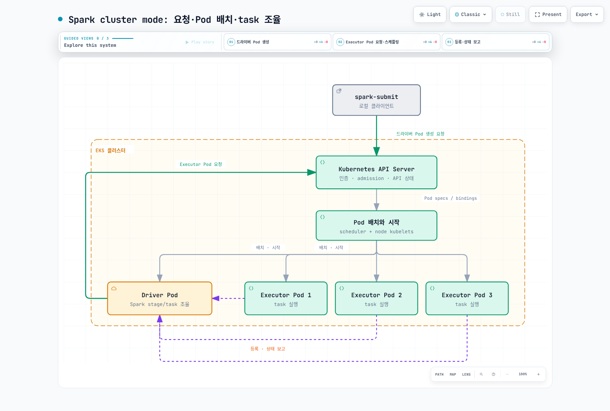

# Spark on EKS 딥다이브

> **검토 기준**: Apache Spark 4.2.0, Kubernetes 1.34 이상\
> **최종 검토**: 2026년 9월 12일

Apache Spark는 배치·SQL·스트리밍 등의 분산 데이터를 처리합니다.
Kubernetes 네이티브 지원은 Spark 2.3, client mode 지원은 2.4부터입니다.
Spark 4.2.0 공식 문서는 **Kubernetes 1.34+**를 전제로 합니다.
kubectl도 오래된 고정 최솟값 대신 실제 EKS 버전과 호환되게 선택합니다.

별도의 Spark Standalone master나 YARN ResourceManager 없이 기존 Kubernetes
용량·제어 영역을 사용할 수 있지만 노드, 이미지, 인증, 네트워크, 저장소와 관측
운영은 남습니다. ResourceManager·NodeManager는 Spark 전용이 아닌 YARN 구성요소입니다.

## 실행 책임 구분

**Cluster deploy mode**에서는 제출 클라이언트가 Kubernetes API에 driver Pod를
요청합니다. Pod 배치·시작은 Kubernetes admission·scheduler·노드 kubelet이
처리합니다. Spark driver는 executor Pod를 요청하고 Spark stage/task를 조율하며
Kubernetes scheduler를 대체하지 않습니다.

Executor는 Spark 작업을 위해 driver에 직접 등록·통신하고 Kubernetes는 Pod의
수명주기를 계속 관리합니다. **Client mode**에서는 제출 애플리케이션의 driver가
Pod 안이나 다른 호스트에서 실행되며 executor에서 접근 가능해야 합니다.
두 모드 모두 Spark 애플리케이션에 사용할 수 있습니다.

[인터랙티브 다이어그램](https://www.atomai.click/kubernetes-docs/archmaps/ko-data-on-eks-spark-readme-0.html)

## 목차

1. [Spark on Kubernetes 기초](01-spark-fundamentals.md): cluster/client 제출,
   리소스 매핑, 동적 할당과 decommission의 조건.
2. [Spark Operator](02-spark-operator.md): Apache·Kubeflow operator의 구분,
   API·작업 수명주기·제출·관측.
3. [EMR on EKS](03-emr-on-eks.md): 가상 클러스터, 작업 제출·실행 ID,
   관리형 런타임과 EKS 용량 운영의 구분.
4. [성능과 비용](04-performance-tuning.md): 셔플·스토리지·CPU·메모리 병목,
   적절한 노드 기능, Spot 복구와 executor·노드 확장.
5. [모범 사례와 보안](05-best-practices.md): Kubernetes·AWS 인증,
   데이터 접근, event log/history, 메트릭·네트워크 정책과 복구.

Spark의 **Dynamic Resource Allocation**은 애플리케이션 안의 executor 수를
조정합니다. 장치용 Kubernetes Dynamic Resource Allocation이나 노드 자동 확장과는
다릅니다. Decommission은 재계산을 줄일 수 있지만 강제 종료에서도 모든 블록을
보존한다고 보장하지 않습니다.

## 참고 자료

- [Spark 4.2.0 on Kubernetes](https://spark.apache.org/docs/4.2.0/running-on-kubernetes.html)
- [Spark 4.2.0 configuration](https://spark.apache.org/docs/4.2.0/configuration.html)
- [Spark 4.2.0 dynamic allocation alternatives](https://spark.apache.org/docs/4.2.0/job-scheduling.html#dynamic-resource-allocation)
- [Driver resource mapping](https://github.com/apache/spark/blob/v4.2.0/resource-managers/kubernetes/core/src/main/scala/org/apache/spark/deploy/k8s/features/BasicDriverFeatureStep.scala)
- [Executor resources and decommission hook](https://github.com/apache/spark/blob/v4.2.0/resource-managers/kubernetes/core/src/main/scala/org/apache/spark/deploy/k8s/features/BasicExecutorFeatureStep.scala)
- [Official decommission script](https://github.com/apache/spark/blob/v4.2.0/resource-managers/kubernetes/docker/src/main/dockerfiles/spark/decom.sh)
- [Official Spark image tags](https://github.com/docker-library/official-images/blob/master/library/spark)

- [Apache Spark Kubernetes Operator](https://github.com/apache/spark-kubernetes-operator)
- [Kubeflow Spark Operator](https://github.com/kubeflow/spark-operator)
- [EMR on EKS 개념](https://docs.aws.amazon.com/emr/latest/EMR-on-EKS-DevelopmentGuide/emr-eks-concepts.html)

## 퀴즈

[Spark 기초 퀴즈](../../quizzes/data-on-eks/spark/01-spark-fundamentals-quiz.md)
