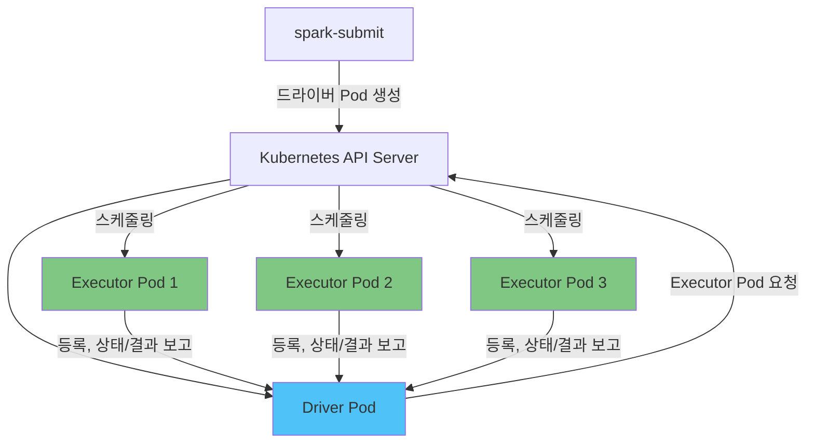

# Spark on EKS 딥다이브

## 개요

Apache Spark는 대규모 배치 ETL, SQL 분석, 스트리밍 워크로드를 처리하는 핵심 분산 처리 엔진이며, Spark 2.3부터는 Standalone·YARN과 함께 Kubernetes를 정식 클러스터 매니저로 지원합니다. EKS에서 Spark를 실행한다는 것은 다른 워크로드를 스케줄링하는 것과 동일한 Kubernetes API 서버가 Spark의 드라이버·Executor Pod까지 스케줄링한다는 의미로, 별도의 Spark 클러스터 인프라를 구축하거나 유지보수할 필요가 없습니다. 실무에서는 `spark-submit`을 직접 호출하는 방식, Kubernetes 네이티브 CRD로 감싼 **Spark Operator**를 사용하는 방식, 또는 기존 EKS 클러스터 위에서 동작하는 AWS의 관리형 Spark 런타임인 **Amazon EMR on EKS**를 사용하는 방식 중 하나를 선택하게 됩니다.

> **지원 버전**: Apache Spark 4.2, Kubernetes 1.30+
> **마지막 업데이트**: 2026년 7월 15일

## 핵심 아키텍처 개념

YARN과 달리 Spark on Kubernetes에는 상시 구동되는 클러스터 매니저 데몬이 없습니다. 즉, 작업을 기다리며 항상 떠 있는 ResourceManager나 NodeManager 같은 프로세스가 존재하지 않습니다. 대신 `spark-submit`은 Kubernetes API 서버에 직접 요청을 보내 단 하나의 **드라이버 Pod**를 생성합니다. 이 드라이버 Pod는 작업이 실행되는 동안 그 자체로 클러스터 매니저 역할을 하며, 실행이 시작되면 `spark.executor.instances` 설정이나 Dynamic Resource Allocation에 따라 필요한 **Executor Pod**를 Kubernetes API를 직접 호출해 생성·관리합니다. Executor는 드라이버에 등록한 뒤 작업(task)을 받아 처리하고 결과와 상태를 다시 드라이버로 보고하는데, 이 과정은 드라이버-Executor 간 직접 연결로 이루어지며 Kubernetes는 Pod 스케줄링과 라이프사이클 관리에만 관여할 뿐 작업 조율 자체에는 개입하지 않습니다.

## 딥다이브 목차

**[1. Spark on Kubernetes 기초](01-spark-fundamentals.md)**
- 클러스터 모드 전용 `spark-submit`: 드라이버 Pod가 Executor Pod를 직접 생성·관리하는 흐름
- Kubernetes 환경의 Dynamic Resource Allocation(DRA) — External Shuffle Service가 없는 이유와 대안
- Pod 종료 직전 상태를 보호하는 Executor Graceful Decommission

**[2. Spark Operator](02-spark-operator.md)**
- `apache/spark-kubernetes-operator` vs `kubeflow/spark-operator` — 거버넌스, 성숙도, 클러스터별 선택 기준
- `SparkApplication` CRD와 라이프사이클 관리(`restartPolicy`, 상태 조회)
- 드라이버/Executor Pod에 커스터마이징을 주입하는 Mutating Admission Webhook
- 모니터링 연동 방식과 EKS 배포 시 고려사항

**[3. Amazon EMR on EKS](03-emr-on-eks.md)**
- 가상 클러스터(Virtual Cluster): EKS 네임스페이스를 EMR 컨트롤 플레인에 등록하기
- `StartJobRun` API 기반 제출 vs `kubectl apply` 기반 제출
- 작업 실행 IAM 역할과 가상 클러스터 온보딩
- EMR on EKS vs 셀프 매니지드 Spark Operator — 상황별 선택 기준

**[4. 성능 및 비용 튜닝](04-performance-tuning.md)**
- 셔플이 많은 작업을 위한 노드 타입 선정: 로컬 NVMe 인스턴스 스토어를 갖춘 R 계열 인스턴스
- Executor에 Spot 인스턴스를 활용하고 Graceful Decommission으로 작업 진행 손실 방지하기
- 서로 결합되어 있지만 독립적으로 동작하는 두 개의 스케일링 루프: Karpenter와 Dynamic Resource Allocation
- 드라이버/Executor 리소스 사이징과 비용 최적화

**[5. 모범 사례 및 보안](05-best-practices.md)**
- IRSA를 활용한 안전하고 자격증명 없는 S3 접근
- 네이티브 `PrometheusServlet`과 JMX Prometheus Exporter 비교, Spark History Server를 통한 디버깅
- IAM/IRSA를 넘어선 보안 강화(RBAC, 네트워크 정책)
- 프로덕션 준비 체크리스트

## 참고 자료

- [Running Spark on Kubernetes (Apache Spark 공식 문서)](https://spark.apache.org/docs/latest/running-on-kubernetes.html)
- [apache/spark-kubernetes-operator](https://github.com/apache/spark-kubernetes-operator)
- [kubeflow/spark-operator](https://github.com/kubeflow/spark-operator)
- [Amazon EMR on EKS 개념 안내](https://docs.aws.amazon.com/emr/latest/EMR-on-EKS-DevelopmentGuide/emr-eks-concepts.html)
- [Best Practices for Running Spark on Amazon EKS](https://aws.amazon.com/blogs/containers/best-practices-for-running-spark-on-amazon-eks/)
- [AWS Data on EKS 프로젝트](https://awslabs.github.io/data-on-eks/)

## 퀴즈

이 섹션에서 배운 내용을 테스트하려면 [Spark 기초 퀴즈](../../quizzes/data-on-eks/spark/01-spark-fundamentals-quiz.md)를 풀어보세요.
