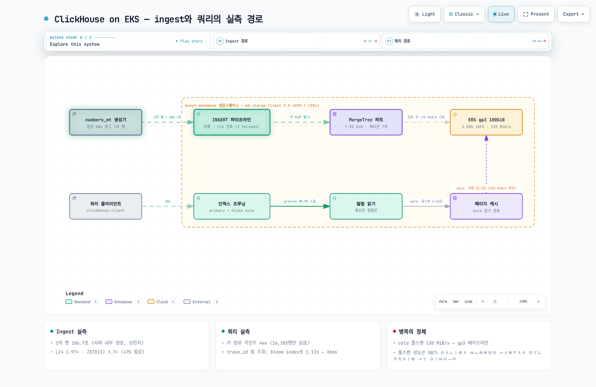

# ClickHouse on EKS 실측 벤치마크

> **지원 버전**: ClickHouse 24.8 LTS, Kubernetes 1.36 (Amazon EKS)
> **마지막 업데이트**: 2026년 9월 1일

"ClickHouse는 빠르다"는 말은 벤치마크 보고서마다 나오지만, **EKS의 평범한 노드 하나와 기본 gp3 볼륨**에서 어느 정도인지 직접 잰 숫자는 찾기 어렵습니다. 이 문서는 4 vCPU 노드 + 기본 설정 gp3 100GiB라는 의도적으로 소박한 환경에 Kubernetes 로그 1억 행을 넣고 측정한 결과입니다. 모든 숫자는 이 문서의 매니페스트와 쿼리로 재현할 수 있습니다.



[🔍 인터랙티브 다이어그램 보기](https://www.atomai.click/kubernetes-docs/archmaps/ko-database-01-clickhouse-on-eks-0.html)

## TL;DR — 측정 결과 요약

| 측정 항목 | 결과 |
|-----------|------|
| Ingest (서버 내부 생성·삽입) | 1억 행 / 106.7초 = **약 94만 행/초** |
| 저장 크기 (LZ4 기본) | 15.37 GiB → **7.82 GiB (1.97×)** |
| 저장 크기 (ZSTD(3)) | 15.37 GiB → **4.16 GiB (3.7×)**, LZ4 대비 47% 절감 |
| ORDER BY 키 범위 카운트 (1시간 창) | **4 ms** — 1억 행 중 16,385행만 읽음 |
| 에러 top-10 GROUP BY (2일 창) | **0.36 초** (2,800만 행 스캔) |
| `LIKE '%timeout%'` 풀스캔 | 캐시 warm **2.63 초** / 디스크 직행 **31.5 초** (12배) |
| trace_id 점 조회 | 풀스캔 1.13초 → **bloom filter index 후 0.036초 (31배)** |

## 테스트 환경

| 항목 | 값 |
|------|-----|
| 클러스터 | Amazon EKS, Kubernetes 1.36, ap-northeast-2 |
| 노드 | **m5.xlarge** (4 vCPU, 16 GiB) — Karpenter가 프로비저닝한 전용 노드 1대 (벤치마크 파드 단독 배치) |
| 파드 리소스 | requests 2.5 vCPU / 9 Gi, limits 3.5 vCPU / 12 Gi |
| 스토리지 | EBS **gp3 100 GiB 기본 설정** (3,000 IOPS / 125 MiB/s 베이스라인), EBS CSI 드라이버 |
| ClickHouse | 공식 이미지 `clickhouse/clickhouse-server:24.8` (24.8.14.39), 설정 기본값 |
| 시간당 비용 | m5.xlarge 온디맨드 $0.236/h + gp3 100GB $0.0912/GB-월 (서울 리전, 2026-09 Pricing API 조회) |

일부러 "화려하지 않은" 환경입니다. 전용 i-계열 NVMe 인스턴스가 아니라, 여러분 클러스터에 이미 있을 법한 범용 노드와 기본 gp3에서 어디까지 되는지가 이 벤치마크의 질문입니다.

### 배포 매니페스트

```yaml
apiVersion: v1
kind: PersistentVolumeClaim
metadata:
  name: clickhouse-data
  namespace: bench-database
spec:
  accessModes: ["ReadWriteOnce"]
  storageClassName: gp3
  resources:
    requests:
      storage: 100Gi
---
apiVersion: v1
kind: Pod
metadata:
  name: clickhouse
  namespace: bench-database
spec:
  nodeSelector:
    node.kubernetes.io/instance-type: m5.xlarge
  containers:
    - name: clickhouse
      image: clickhouse/clickhouse-server:24.8
      resources:
        requests: { cpu: "2500m", memory: 9Gi }
        limits: { cpu: "3500m", memory: 12Gi }
      env:
        - name: CLICKHOUSE_SKIP_USER_SETUP
          value: "1"
      volumeMounts:
        - name: data
          mountPath: /var/lib/clickhouse
  volumes:
    - name: data
      persistentVolumeClaim:
        claimName: clickhouse-data
```

> 프로덕션이라면 단일 Pod가 아니라 [Altinity clickhouse-operator](https://github.com/Altinity/clickhouse-operator)의 `ClickHouseInstallation`으로 배포합니다. 여기서는 측정 대상을 단순하게 유지하기 위해 Pod를 직접 사용했습니다.

## 데이터셋 — 현실적인 Kubernetes 로그 1억 행

균등 난수(generateRandom)는 압축률을 왜곡하므로, 실제 로그처럼 **반복되는 템플릿 + 가변 필드** 구조로 생성했습니다. 10개 네임스페이스, 네임스페이스당 파드 수 개, 0.8% ERROR 비율, 7일치 타임스탬프입니다.

```sql
CREATE TABLE logs
(
  timestamp   DateTime64(3),
  namespace   LowCardinality(String),
  pod         String,
  container   LowCardinality(String),
  level       LowCardinality(String),
  message     String,
  trace_id    String,
  duration_ms Float32
)
ENGINE = MergeTree
PARTITION BY toDate(timestamp)
ORDER BY (namespace, timestamp);
```

```sql
INSERT INTO logs (timestamp, namespace, pod, container, level, trace_id, duration_ms, message)
WITH
  ['payment','order','user','search','catalog','cart','shipping','auth','gateway','recommend'] AS nss,
  ['GET /api/v1/orders','POST /api/v1/payments','GET /api/v1/users','GET /api/v1/search',
   'POST /api/v1/cart/items','GET /api/v1/products','POST /api/v1/shipments','POST /oauth/token',
   'GET /healthz','GET /api/v1/recommendations'] AS eps
SELECT
  toDateTime64('2026-08-25 00:00:00', 3) + toIntervalMillisecond(number * 6) AS timestamp,
  nss[(cityHash64(number) % 10) + 1] AS namespace,
  concat(namespace, '-7c7dd4f9c-', substring(lower(hex(sipHash64(cityHash64(number) % 10))), 1, 5)) AS pod,
  if(cityHash64(number + 2) % 10 < 8, 'app', 'istio-proxy') AS container,
  multiIf(cityHash64(number + 3) % 1000 < 8, 'ERROR',
          cityHash64(number + 3) % 1000 < 50, 'WARN',
          cityHash64(number + 3) % 1000 < 300, 'DEBUG', 'INFO') AS level,
  lower(hex(sipHash128(number))) AS trace_id,
  round(if(level = 'ERROR', 2000 + (cityHash64(number + 4) % 30000) / 10,
           (cityHash64(number + 4) % 20000) / 100), 1) AS duration_ms,
  multiIf(
    level = 'ERROR', concat('upstream request timeout after ', toString(round(duration_ms)),
                            'ms endpoint=', eps[(cityHash64(number + 5) % 10) + 1],
                            ' status=503 trace_id=', trace_id),
    concat(eps[(cityHash64(number + 5) % 10) + 1], ' completed status=200 in ',
           toString(duration_ms), 'ms trace_id=', trace_id)
  ) AS message
FROM numbers_mt(100000000)
SETTINGS max_threads = 3, max_insert_threads = 2, max_memory_usage = 9000000000;
```

## 측정 1 — Ingest: 1억 행 / 106.7초

```text
Elapsed: 106.747 sec  →  약 936,800 행/초, 파티션 7개(일 단위), active parts 36개
```

**이 수치의 의미를 정확히 읽어야 합니다.** 서버 내부에서 생성해 바로 삽입(INSERT…SELECT)한 값이므로 네트워크 전송과 텍스트 파싱 비용이 빠진 **상한선**입니다. 외부에서 TSV/Native 포맷으로 밀어넣으면 클라이언트와 포맷에 따라 이보다 낮아집니다. 그럼에도 3.5 vCPU 제한 안에서 초당 약 94만 행을 정렬·압축·기록했다는 점, 그것도 125 MiB/s짜리 기본 gp3에서 해냈다는 점이 핵심입니다 — 압축 덕분에 디스크에는 초당 약 75 MiB만 쓰면 됐기 때문입니다.

## 측정 2 — 압축: 어떤 컬럼이 돈을 쓰는가

전체: 15.37 GiB → 7.82 GiB (**1.97×**, LZ4 기본). 컬럼별 내역이 훨씬 흥미롭습니다:

| 컬럼 | 압축 후 | 압축 전 | 비율 |
|------|---------|---------|------|
| message | 3.97 GiB | 8.75 GiB | 2.2× |
| **trace_id** | **3.08 GiB** | 3.07 GiB | **1.0× (압축 불가)** |
| timestamp | 404 MiB | 763 MiB | 1.89× |
| duration_ms | 289 MiB | 381 MiB | 1.32× |
| level | 46 MiB | 96 MiB | 2.09× |
| container | 39 MiB | 96 MiB | 2.44× |
| pod | 9.3 MiB | 2.15 GiB | **236×** |
| namespace | 0.5 MiB | 96 MiB | **201×** |

두 가지 교훈이 바로 보입니다:

1. **LowCardinality + ORDER BY 정렬의 위력** — namespace는 ORDER BY 첫 키라서 같은 값이 길게 이어지고, 96 MiB가 0.5 MiB로 사라집니다. pod도 카디널리티가 낮아 236×.
2. **고엔트로피 ID가 스토리지의 절반을 먹습니다** — 32자 hex trace_id는 압축이 전혀 안 되어(1.0×) 전체 7.82 GiB 중 3.08 GiB를 차지합니다. 로그 스키마를 설계할 때 "ID를 문자열로 넣을 것인가"가 저장 비용의 최대 변수라는 뜻입니다. (UUID 타입/FixedString(16) 바이너리 저장으로 절반으로 줄일 수 있습니다.)

### LZ4 vs ZSTD(3) — 저장 47% vs 스캔 1.9×

같은 데이터를 `CODEC(ZSTD(3))` 테이블에 다시 삽입해 비교했습니다:

| | LZ4 (기본) | ZSTD(3) |
|---|-----------|---------|
| 압축 후 크기 | 7.82 GiB (1.97×) | **4.16 GiB (3.7×)** |
| 재압축 삽입 (1억 행) | — | 120.0초 |
| `LIKE '%timeout%'` 풀스캔 (warm) | **2.63초** | 4.9초 |

저장은 47% 줄지만 CPU-bound 풀스캔은 1.9배 느려집니다. **자주 조회하는 최근 데이터는 LZ4, 오래된 파티션은 TTL로 ZSTD 재압축**이 로그 워크로드의 정석 조합인 이유가 숫자로 보입니다.

## 측정 3 — 쿼리: 어떤 쿼리가 왜 빠른가/느린가

각 쿼리는 mark/uncompressed 캐시를 비운 뒤 ① `min_bytes_to_use_direct_io=1`로 페이지 캐시를 우회한 디스크 직행 1회, ② warm 3회(최솟값 기록)를 측정했습니다.

| # | 쿼리 패턴 | 디스크 직행 | warm | 읽은 행 수 |
|---|-----------|-----------|------|-----------|
| Q1 | `WHERE namespace='payment' AND timestamp BETWEEN …` (1시간 창 count) | 13 ms | **4 ms** | 16,385 (0.016%) |
| Q2 | ERROR top-10 pod, 2일 창 GROUP BY | 0.57 s | **0.36 s** | 2,800만 |
| Q3 | `message LIKE '%timeout%'` 전 기간 풀스캔 | **31.5 s** | 2.63 s | 1억 |
| Q4 | namespace별 duration p50/p99 전 기간 | 1.34 s | **1.03 s** | 1억 |
| Q5 | `trace_id = '…'` 점 조회 (인덱스 없음) | 24.3 s | 1.13 s | 1억 |

읽는 법:

- **Q1이 4ms인 이유**: PARTITION BY(일)와 ORDER BY(namespace, timestamp)가 겹치면서 1억 행 중 granule 두 개(16,385행)만 읽습니다. ClickHouse 성능의 8할은 이 프루닝 설계에서 나옵니다.
- **Q3의 31.5초(디스크 직행) vs 2.63초(warm)**: message 컬럼 압축본 약 4 GiB를 디스크에서 읽으면 4 GiB ÷ 31.5초 ≈ **130 MiB/s — 정확히 gp3 베이스라인 처리량(125 MiB/s)에 막힌 수치**입니다. 같은 쿼리가 페이지 캐시에서는 CPU-bound(초당 3,800만 행)로 바뀝니다. 풀스캔 성능은 데이터베이스가 아니라 **볼륨 처리량 설정**의 문제일 수 있다는 실측 증거입니다. ([EBS gp2 vs gp3 실측](../storage/01-ebs-gp2-gp3-benchmark.md) 참고)
- **Q4가 풀스캔인데 1초인 이유**: 컬럼 지향의 본질입니다. duration_ms(289 MiB)와 namespace(0.5 MiB)만 읽지, 7.8 GiB를 읽지 않습니다.

## 측정 4 — bloom filter skip index: 1.13초 → 0.036초

trace_id 점 조회는 ORDER BY 키가 아니므로 기본적으로 풀스캔(1.13초)입니다. skip index를 추가하면:

```sql
ALTER TABLE logs ADD INDEX trace_bf trace_id TYPE bloom_filter(0.01) GRANULARITY 4;
ALTER TABLE logs MATERIALIZE INDEX trace_bf;  -- 기존 데이터에 적용 (약 20초 소요)
```

| | 인덱스 없음 | bloom_filter(0.01) |
|---|-----------|-------------------|
| warm 조회 시간 | 1.13 s | **0.036 s (31×)** |
| 읽은 행 수 | 1억 | **108만 (98.9% 스킵)** |
| 읽은 데이터 | 3.82 GiB | 42.6 MiB |
| 인덱스 크기 | — | 119.7 MiB (테이블의 1.5%) |

관측용 로그 저장소에서 "trace ID로 점프"는 가장 흔한 쿼리인데, 인덱스 크기 1.5%와 materialize 20초로 31배를 얻습니다. Grafana + ClickHouse 로그 백엔드를 구성한다면 반드시 넣어야 할 인덱스입니다.

## 비용으로 환산하면

이 환경(m5.xlarge $0.236/h + gp3 100GB $9.12/월, 서울 리전) 기준:

- 1억 행(원본 15.4 GiB) 로그가 디스크에서 7.8 GiB(LZ4) 또는 4.2 GiB(ZSTD) — **gp3 저장 비용으로 월 $0.71/$0.38**.
- 하루 1억 행(≈초당 1,160행) 유입이라면 30일 보관 시 LZ4 기준 약 235 GiB → gp3 $21/월 + 노드 비용. 같은 볼륨의 CloudWatch Logs ingest 요금과 비교해 보면 self-hosted ClickHouse가 왜 로그 파이프라인에서 인기인지 명확해집니다.

## 재현 방법

1. 위 매니페스트로 네임스페이스/PVC/Pod 배포 (`kubectl apply -f clickhouse.yaml`)
2. 스키마·INSERT 실행: `kubectl exec -n bench-database clickhouse -- clickhouse-client --time --query "$(cat insert.sql)"`
3. 쿼리 측정 루틴: 각 쿼리마다 `SYSTEM DROP MARK CACHE` → `SYSTEM DROP UNCOMPRESSED CACHE` → `SETTINGS min_bytes_to_use_direct_io=1`로 1회 → 설정 없이 3회
4. 통계 확인: `system.parts`(크기), `system.parts_columns`(컬럼별), `system.query_log`(read_rows/read_bytes)
5. 끝나면 네임스페이스 삭제 (PVC는 Delete reclaim으로 함께 정리)

## 해석 시 주의사항

- **단일 노드, 단일 실행 환경**입니다. 복제/샤딩 구성이나 다른 인스턴스 타입에서는 절대값이 달라집니다. 상대적 패턴(프루닝, 컬럼 지향, 캐시, 인덱스 효과)이 이 문서의 본론입니다.
- ingest 수치는 서버 내부 생성 기준 상한입니다(측정 1 참고).
- 합성 데이터의 압축률은 필드 구성에 민감합니다. 고엔트로피 trace_id를 message에도 포함시켜 보수적으로 만들었지만, 실제 로그의 압축률은 스키마에 따라 이보다 좋을 수도 나쁠 수도 있습니다.
- warm 첫 회는 캐시 적재 때문에 느립니다(Q3 첫 회 8.7초 → 이후 2.6초). 표의 warm 값은 3회 중 최솟값입니다.

## 함께 읽기

- [ClickHouse — 로그 백엔드 관점](../observability/logging/04-clickhouse.md) — 수집 파이프라인(Fluent Bit/Vector)과의 통합
- [EBS gp2 vs gp3 실측 벤치마크](../storage/01-ebs-gp2-gp3-benchmark.md) — Q3에서 확인한 볼륨 처리량 병목의 근거
- [Database on Kubernetes 개요](./README.md) — Operator 지형과 관리형 vs self-hosted 판단 기준
