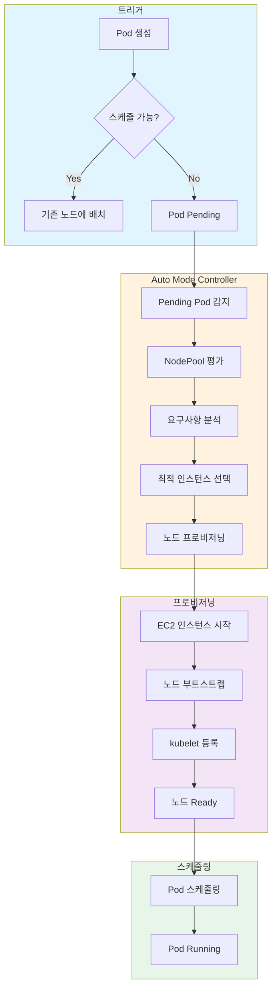
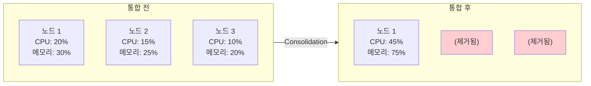

# 스케일링 동작 이해

> **지원 버전**: EKS 1.29+, EKS Auto Mode GA
> **마지막 업데이트**: 2026년 2월 19일

< [이전: NodePool 구성](./02-nodepool-configuration.md) | [목차](./README.md) | [다음: Spot 전략](./04-spot-strategies.md) >

---

이 문서에서는 EKS Auto Mode의 스케일링 동작을 이해하고 최적화하는 방법을 설명합니다.

## Pod Pending에서 노드 프로비저닝까지

EKS Auto Mode의 스케일링 흐름을 이해하면 최적화에 도움이 됩니다.



## Consolidation 동작

Consolidation은 비효율적인 노드를 정리하여 비용을 최적화합니다.

### WhenEmpty 정책

빈 노드만 제거합니다.

```yaml
apiVersion: karpenter.sh/v1
kind: NodePool
metadata:
  name: when-empty-example
spec:
  template:
    spec:
      requirements:
        - key: karpenter.k8s.aws/instance-category
          operator: In
          values: ["m", "c"]
      nodeClassRef:
        group: eks.amazonaws.com
        kind: NodeClass
        name: default
  disruption:
    consolidationPolicy: WhenEmpty
    consolidateAfter: 30s  # 빈 상태로 30초 후 제거
```

### WhenEmptyOrUnderutilized 정책

빈 노드뿐만 아니라 저사용률 노드도 통합합니다.

```yaml
apiVersion: karpenter.sh/v1
kind: NodePool
metadata:
  name: when-underutilized-example
spec:
  template:
    spec:
      requirements:
        - key: karpenter.k8s.aws/instance-category
          operator: In
          values: ["m", "c"]
      nodeClassRef:
        group: eks.amazonaws.com
        kind: NodeClass
        name: default
  disruption:
    consolidationPolicy: WhenEmptyOrUnderutilized
    consolidateAfter: 1m
```



## Drift 감지 및 교체

NodePool 설정이 변경되면 기존 노드를 새 설정으로 교체합니다.

```yaml
# 노드 Drift 확인
kubectl get nodes -o custom-columns=\
NAME:.metadata.name,\
NODEPOOL:.metadata.labels.karpenter\\.sh/nodepool,\
DRIFT:.metadata.annotations.karpenter\\.sh/drift-hash

# Drift가 감지된 노드 확인
kubectl get nodeclaims -o wide
```

Drift가 발생하는 경우:
- NodePool의 requirements가 변경된 경우
- NodeClass의 설정이 변경된 경우
- AMI가 업데이트된 경우

## Expiration 기반 노드 갱신

보안 패치나 AMI 업데이트를 위해 노드를 주기적으로 교체합니다.

```yaml
apiVersion: karpenter.sh/v1
kind: NodePool
metadata:
  name: with-expiration
spec:
  template:
    spec:
      requirements:
        - key: karpenter.k8s.aws/instance-category
          operator: In
          values: ["m", "c"]
      nodeClassRef:
        group: eks.amazonaws.com
        kind: NodeClass
        name: default
      # 노드 최대 수명 설정
      expireAfter: 168h  # 7일 후 자동 교체
  disruption:
    consolidationPolicy: WhenEmptyOrUnderutilized
    consolidateAfter: 1m
```

## 스케일링 지연 시간 최적화

```bash
# 노드 프로비저닝 시간 측정
kubectl get events --sort-by='.lastTimestamp' | grep -E "Provisioned|Registered"

# 일반적인 프로비저닝 타임라인
# - EC2 인스턴스 시작: 10-30초
# - AMI 부팅: 20-40초
# - kubelet 등록: 5-10초
# - Pod 스케줄링: 1-5초
# 총 예상 시간: 40-90초
```

### 빠른 프로비저닝을 위한 NodeClass 설정

```yaml
# 빠른 프로비저닝을 위한 NodeClass 설정
apiVersion: eks.amazonaws.com/v1
kind: NodeClass
metadata:
  name: fast-boot
spec:
  amiFamily: Bottlerocket  # AL2023보다 빠른 부팅 시간

  # EBS 최적화
  blockDeviceMappings:
    - deviceName: /dev/xvda
      ebs:
        volumeSize: 50Gi  # 필요한 만큼만
        volumeType: gp3
        iops: 3000
        throughput: 125
```

### 프로비저닝 속도 최적화 팁

| 최적화 항목 | 설명 | 예상 개선 |
|------------|------|----------|
| AMI 선택 | Bottlerocket은 AL2023보다 빠른 부팅 | 10-20초 단축 |
| EBS 볼륨 크기 | 필요한 최소 크기 사용 | 5-10초 단축 |
| 다양한 인스턴스 타입 | 가용성 높은 타입 선택 가능 | 가용성 향상 |
| 리전 내 AZ 분산 | 용량 부족 시 대체 AZ 사용 | 가용성 향상 |

---

< [이전: NodePool 구성](./02-nodepool-configuration.md) | [목차](./README.md) | [다음: Spot 전략](./04-spot-strategies.md) >
