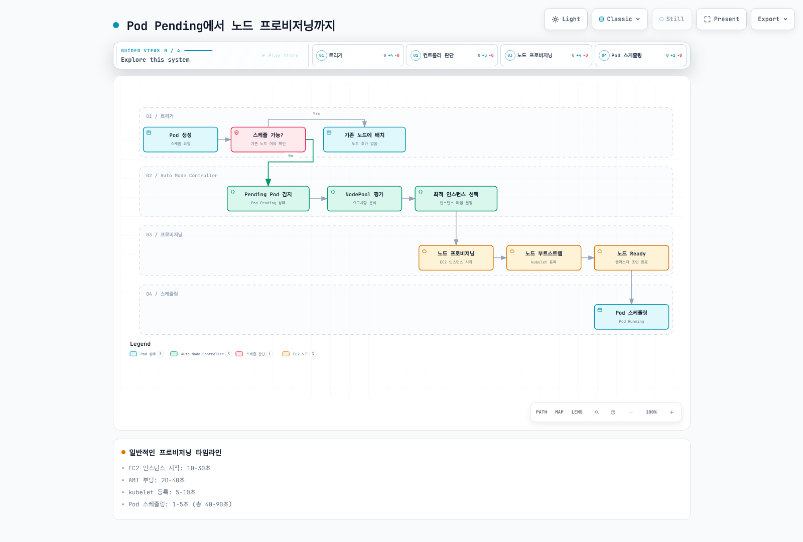
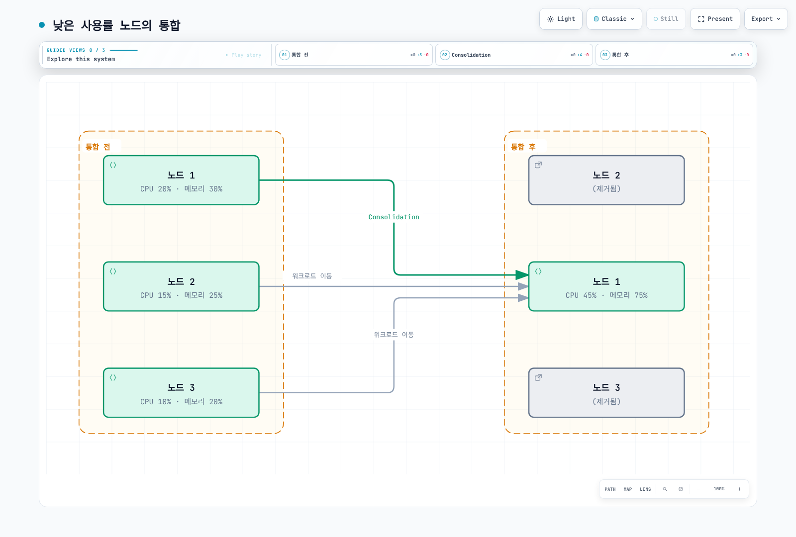

# 스케일링 동작 이해

> **지원 버전**: EKS Auto Mode GA; 예제 기준 EKS 1.36
> **마지막 업데이트**: 2026년 9월 12일

프로비저닝, consolidation, drift와 expiration을 구분합니다. [시작하기](./01-getting-started.md)에서 확인한 계정·컨텍스트를 사용하세요. Manifest는 구성된 `default` NodeClass를 가정하며 수명 주기 동작에 집중하도록 On-Demand 용량을 사용합니다. 예시 제한값도 상당한 비용을 허용할 수 있습니다.

이번 감사에서 클러스터, 워크로드나 지연 시간 벤치마크를 실행하지 않았습니다. 구성과 진단 변환은 로컬에서 검사했으며, 프로덕션 적용 전에 통제된 환경에서 admission, IAM, 배치와 중단 동작을 검증해야 합니다.

## 스케줄 불가능한 Pod에서 용량 확보까지

Auto Mode는 스케줄러가 기존 용량에 배치하지 못하는 Pod를 관찰합니다. 적합한 NodePool/NodeClass, 호환되는 제약, 할당량과 EC2 용량이 있어야 프로비저닝이 성공할 수 있습니다. Requests, affinity, taint, topology, 볼륨 위치와 아키텍처가 모두 영향을 줍니다. 복제본 증가는 HPA/KEDA 등 애플리케이션 컨트롤러의 역할이며 노드 자동화가 애플리케이션 CPU 사용률 autoscaler를 대신하지 않습니다.

`Pending`만으로 노드 부족을 입증할 수는 없습니다. 이미 노드에 배치된 Pod가 이미지나 초기화를 기다릴 수도 있습니다. 그림은 성공적인 용량 확보 경로를 나타내며 실패 경로를 생략합니다. 호환 인스턴스 선택은 전역 최적값이나 준비 시간 보장이 아닙니다. `Running`도 애플리케이션 readiness를 뜻하지 않습니다.



[인터랙티브 다이어그램 보기](https://www.atomai.click/kubernetes-docs/archmaps/ko-eks-auto-mode-03-scaling-behavior-0.html)

### 과거 교육용 추정값

이전 가이드에는 원시 관측 자료나 재현 가능한 벤치마크 없이 다음 수치가 제시됐습니다. **검증되지 않은 과거 추정값**으로 보존하며 EKS 1.36에서 측정한 결과나 AWS SLO가 아닙니다. 단계 정의가 겹칠 수 있으므로 실측 trace처럼 합산하지 마세요.

| 이전 설명의 단계 | 제시됐던 시간 |
|------------------|---------------|
| Pending 감지 | 1–5초 |
| 인스턴스 선택 | 1–3초 |
| EC2 시작 | 10–30초 |
| AMI 부팅 | 20–40초 |
| kubelet 등록 | 5–10초 |
| Pod 스케줄링 | 1–5초 |
| 제시됐던 합계 | 40–90초 |

## Consolidation: 타이머 보장이 아닌 후보 자격

Consolidation은 배치 가능성을 유지하면서 비용을 줄일 수 있는 제거·교체를 찾습니다. 이를 실측 CPU·메모리 사용률의 고정 임계값으로 모델링하지 마세요. Resource requests와 배치 제약이 중요합니다. PDB, disruption budget, annotation, 대체 용량과 drain 진행 상태가 작업을 막거나 늦출 수 있습니다.

`consolidateAfter`는 안정화·후보 검토 지연입니다. Pod가 추가·제거되면 타이머가 재설정됩니다. 30초를 설정해도 정확히 30초 뒤 삭제되거나 그 안에 대체 노드가 준비된다는 보장이 아닙니다.

### WhenEmpty

이 정책은 조건을 충족한 빈 노드를 검토합니다. 여기서 “빈 노드”가 `kubectl get pods`에 Pod가 전혀 없는 노드만을 뜻하지는 않습니다. DaemonSet만 있는 노드도 대상이 될 수 있습니다. Consolidation 관점에서는 보수적이지만 drift, expiration, Spot interruption 같은 다른 중단 원인을 비활성화하지 않습니다.

```yaml
apiVersion: karpenter.sh/v1
kind: NodePool
metadata:
  name: when-empty-example
spec:
  template:
    spec:
      requirements:
      - key: eks.amazonaws.com/instance-category
        operator: In
        values:
        - m
        - c
      - key: karpenter.sh/capacity-type
        operator: In
        values:
        - on-demand
      nodeClassRef:
        group: eks.amazonaws.com
        kind: NodeClass
        name: default
  disruption:
    consolidationPolicy: WhenEmpty
    consolidateAfter: 30s
    budgets:
    - nodes: 10%
  limits:
    cpu: '100'
    memory: 400Gi
```

### WhenEmptyOrUnderutilized

관련 제약을 만족하면서 워크로드를 더 저렴하게 재배치할 수 있으면 비어 있지 않은 노드도 통합할 수 있습니다. 기존 여유 용량으로 노드를 제거하거나 더 저렴한 용량으로 교체할 수 있으며 항상 새 노드가 필요한 것은 아닙니다.

```yaml
apiVersion: karpenter.sh/v1
kind: NodePool
metadata:
  name: when-underutilized-example
spec:
  template:
    spec:
      requirements:
      - key: eks.amazonaws.com/instance-category
        operator: In
        values:
        - m
        - c
      - key: karpenter.sh/capacity-type
        operator: In
        values:
        - on-demand
      nodeClassRef:
        group: eks.amazonaws.com
        kind: NodeClass
        name: default
  disruption:
    consolidationPolicy: WhenEmptyOrUnderutilized
    consolidateAfter: 1m
    budgets:
    - nodes: 10%
  limits:
    cpu: '100'
    memory: 400Gi
```

### Balanced

현재 AWS NodePool 참조는 중단 비용과 절감 효과를 함께 평가하는 `Balanced`도 지원합니다. 더 적극적인 정책이 수행할 수 있는 작은 절감 작업을 건너뛸 수 있지만 무중단 보장은 아닙니다.

```yaml
apiVersion: karpenter.sh/v1
kind: NodePool
metadata:
  name: balanced-example
spec:
  template:
    spec:
      requirements:
      - key: eks.amazonaws.com/instance-category
        operator: In
        values:
        - m
        - c
      - key: karpenter.sh/capacity-type
        operator: In
        values:
        - on-demand
      nodeClassRef:
        group: eks.amazonaws.com
        kind: NodeClass
        name: default
  disruption:
    consolidationPolicy: Balanced
    consolidateAfter: 1m
    budgets:
    - nodes: 10%
  limits:
    cpu: '100'
    memory: 400Gi
```

### 패킹 그림 해석



[인터랙티브 다이어그램 보기](https://www.atomai.click/kubernetes-docs/archmaps/ko-eks-auto-mode-03-scaling-behavior-1.html)

그림의 CPU 20/15/10%, 메모리 30/25/20%는 같은 용량의 노드에서 각각 45%, 75%로 합산됩니다. 보편적인 consolidation 임계값의 실측 입력이 아닌 설명용 패킹 수치입니다. 실제 배치는 requests, topology, 스토리지와 가용성 요구 사항도 만족해야 합니다. Pod는 축출 후 워크로드 컨트롤러가 다시 생성하며 live migration되는 것이 아닙니다.

## Drift 감지와 교체

Drift는 NodeClaim이 관련된 원하는 구성이나 해석된 리소스 선택과 달라졌음을 뜻합니다. `Drifted` condition을 확인하세요. 이전 `karpenter.sh/drift-hash` 노드 annotation 조회는 유효한 공개 drift 상태 확인이 아니었습니다. 아래에서는 condition 부재를 확정적인 false로 만들지 않고 `NotReported`로 표시합니다.

```bash
kubectl --context "$CLUSTER_NAME" --request-timeout=15s get nodeclaims -o json |
  jq '[.items[] | {
    claim: .metadata.name,
    node: .status.nodeName,
    pool: .metadata.labels["karpenter.sh/nodepool"],
    drift: ((.status.conditions // [] | map(select(.type == "Drifted") |
              {status, reason, lastTransitionTime, observedGeneration}) | first)
            // {status: "NotReported"})
  }]'
```

| 변경 | 해석 |
|------|------|
| Requirements가 현재 인스턴스를 제외 | Drift가 발생할 수 있음 |
| Requirements를 넓혀도 현재 인스턴스가 여전히 허용됨 | 반드시 drift가 발생하는 것은 아님 |
| 관련 NodeClass 설정이나 해석된 서브넷·보안 그룹 선택 변경 | Drift 가능. 실제 condition 확인 |
| AWS가 새 관리형 Auto Mode AMI를 선택 | 교체 가능. 사용자가 `amiFamily`를 선택하는 방식이 아님 |
| 이미 참조한 보안 그룹의 규칙 편집 | 다른 그룹을 선택하는 것과 다름. 항상 node drift가 발생한다고 가정하지 않음 |
| NodePool weight, limits, disruption 동작 | 그 자체는 노드 템플릿 drift가 아니지만 허용되는 작업을 바꿀 수 있음 |
| `expireAfter` 또는 `terminationGracePeriod` 변경 | 기존 NodeClaim 필드를 덮어쓰지 않으며 교체된 노드에 새 값 적용 |

일반적인 graceful 경로는 budget과 배치 가능성을 확인하고, 선택한 노드에 새 배치를 막고, **필요하면** 대체 용량을 준비한 뒤 기존 Pod를 축출·drain하고 노드를 종료합니다. 대체 용량과 기존 용량이 겹쳐 비용이 발생할 수 있습니다. 병렬성은 budget으로 제어되며 반드시 하나씩 교체하는 것은 아닙니다. 강제 interruption/expiration 경로도 항상 정상 대체 노드를 먼저 기다린다고 설명해서는 안 됩니다.

## Expiration과 종료 유예 시간

AWS는 Auto Mode 노드의 최대 수명을 21일로 설명합니다. 기본 expiry는 336시간이며 커스텀 NodePool에 `terminationGracePeriod`가 없으면 NodeClaim에 기본 24시간을 적용합니다. 일반 upstream의 720시간 기본값을 Auto Mode 권장값으로 가져오지 마세요.

다음은 168시간 후 expiration과 명시적인 유예 시간을 요청합니다. Expiration은 drain을 시작하는 조건이며 정확히 7일 뒤 정상 대체 노드가 준비됨을 보장하지 않습니다. 다른 원인으로 그보다 먼저 중단될 수도 있습니다.

```yaml
apiVersion: karpenter.sh/v1
kind: NodePool
metadata:
  name: with-expiration
spec:
  template:
    spec:
      requirements:
      - key: eks.amazonaws.com/instance-category
        operator: In
        values:
        - m
        - c
      - key: karpenter.sh/capacity-type
        operator: In
        values:
        - on-demand
      nodeClassRef:
        group: eks.amazonaws.com
        kind: NodeClass
        name: default
      expireAfter: 168h
      terminationGracePeriod: 24h
  disruption:
    consolidationPolicy: WhenEmptyOrUnderutilized
    consolidateAfter: 1m
    budgets:
    - nodes: 10%
  limits:
    cpu: '100'
    memory: 400Gi
```

| 이전 가이드의 정책 값 | 현재 해석 |
|-----------------------|-----------|
| 24–72시간 | 더 많은 교체를 수반하는 선택적 단기 정책. 매 주기 새 패치가 있다는 증거는 아님 |
| 168시간 | 위의 7일 예제. 가용성과 교체 오버헤드 평가 필요 |
| 336시간 | 문서화된 Auto Mode 기본 expiry |
| 720시간 / 30일 | Auto Mode의 문서화된 최대 21일을 초과. 노드 재사용 기간 보장으로 사용하지 않음 |

NodePool disruption budget은 graceful 방식의 속도를 제한하며 expiration, interruption, repair를 모두 막는 방패가 아닙니다. PDB와 `do-not-disrupt`는 drain·중단 판단에 영향을 주지만 무기한 보존을 보장하지 않습니다. 설정한 종료 유예 시간이 끝나면 남은 Pod가 강제로 제거될 수 있습니다. Stateful 워크로드, 볼륨 detach, 애플리케이션 종료 유예와 장애 시나리오를 반영해 정책을 선택하세요.

## 벤치마크를 만들어내지 않는 지연 진단

다음 명령은 전체 Pod spec 대신 필요한 metadata와 status만 수집합니다. 증거를 비공개로 보관하세요. 스냅샷의 마지막 condition 전환은 최초 시작이 아니라 이후 전환이나 readiness flap일 수도 있습니다.

```bash
umask 077
: "${WORK_DIR:?Use the private evidence directory from the getting-started guide}"
kubectl --context "$CLUSTER_NAME" --request-timeout=15s get nodeclaims -o json |
  jq '[.items[] | {
    claim: .metadata.name, uid: .metadata.uid,
    node: .status.nodeName, createdAt: .metadata.creationTimestamp,
    pool: .metadata.labels["karpenter.sh/nodepool"],
    expireAfter: .spec.expireAfter,
    terminationGracePeriod: .spec.terminationGracePeriod,
    conditions: [.status.conditions[]? |
      select(.type == "Launched" or .type == "Registered" or .type == "Initialized" or .type == "Ready") |
      {type, status, reason, lastTransitionTime}]
  }]' > "$WORK_DIR/nodeclaims-summary.json"
```

```bash
: "${WORKLOAD_NAMESPACE:?Set the controlled test namespace}"
: "${POD_NAME:?Set the controlled test Pod name}"
kubectl --context "$CLUSTER_NAME" --request-timeout=15s -n "$WORKLOAD_NAMESPACE" \
  get pod "$POD_NAME" -o json |
  jq '{name: .metadata.name, uid: .metadata.uid,
       createdAt: .metadata.creationTimestamp, node: .spec.nodeName, phase: .status.phase,
       conditions: [.status.conditions[]? |
         select(.type == "PodScheduled" or .type == "Ready") |
         {type, status, reason, lastTransitionTime}]}' > "$WORK_DIR/pod-summary.json"
```

실제 벤치마크에는 워크로드 생성부터 통제된 관찰을 시작하고 객체 UID와 NodeClaim·노드 배치를 연결해야 합니다. 첫 스케줄링, 노드 readiness와 애플리케이션 readiness를 구분하고 실패·timeout, 환경, 이미지와 워크로드 구성도 기록하세요. 스냅샷과 보관된 Kubernetes 이벤트만으로 전체 지연 분포를 입증할 수는 없습니다.

### 지원되는 스토리지 조정

Auto Mode가 Bottlerocket 변형을 선택합니다. 부팅 시간 단축을 기대하며 `amiFamily`나 `blockDeviceMappings`를 설정하지 마세요. 유효한 다음 스토리지 템플릿은 `ephemeralStorage`를 사용합니다. Profile·selector를 검토된 리소스로 바꾸고 대상 풀에서 이 NodeClass를 참조하세요.

```yaml
apiVersion: eks.amazonaws.com/v1
kind: NodeClass
metadata:
  name: image-storage-example
spec:
  instanceProfile: eks-node-instance-profile
  subnetSelectorTerms:
  - tags:
      Name: private-subnet
  securityGroupSelectorTerms:
  - tags:
      Name: eks-cluster-sg
  advancedNetworking:
    associatePublicIPAddress: false
  ephemeralStorage:
    size: 50Gi
    iops: 3000
    throughput: 125
```

설정을 바꾸기 전에 이미지 전송·압축 해제, CPU, 네트워크와 스토리지 병목을 측정하세요. 이전의 “Bottlerocket으로 10–20초 단축”, “EBS 축소로 5–10초 단축”, “IOPS 증가로 5–10초 단축”은 검증된 실측값이 없었습니다. 현재 튜닝 보장이 아니며 용량 축소가 오히려 이미지·임시 스토리지 부족을 일으킬 수 있습니다.

호환되는 인스턴스·AZ 선택지를 늘리면 용량 확보 선택지는 넓어질 수 있지만 워크로드와 볼륨 제약을 지켜야 합니다. Placeholder Pod는 유휴 비용을 지불하며 용량을 예약할 수 있을 뿐 이미지 다운로드나 애플리케이션 readiness가 거의 즉시 끝남을 보장하지 않습니다.

## 적절한 신호 관찰

모든 Pending Pod를 용량 요청으로 취급하지 말고 스케줄 불가능하다고 명시된 Pod를 확인합니다.

```bash
kubectl --context "$CLUSTER_NAME" --request-timeout=15s \
  get pods -A --field-selector=status.phase=Pending -o json |
  jq '[.items[] | select(any(.status.conditions[]?;
    .type == "PodScheduled" and .status == "False" and .reason == "Unschedulable")) |
    {namespace: .metadata.namespace, name: .metadata.name, uid: .metadata.uid,
     createdAt: .metadata.creationTimestamp}]'
```

이벤트는 판단 이유를 설명하지만 집계·중복·만료될 수 있습니다. 아래는 명시적인 `events.k8s.io` 리소스에서 워크로드 데이터 대신 상태 식별자를 선택합니다.

```bash
kubectl --context "$CLUSTER_NAME" --request-timeout=15s \
  get events.events.k8s.io -A -o json |
  jq '[.items[] |
    select(.regarding.kind == "NodeClaim" or .regarding.kind == "Node" or .regarding.kind == "Pod") |
    {time: (.eventTime // .deprecatedLastTimestamp // .metadata.creationTimestamp),
     reason, regarding: {kind: .regarding.kind, name: .regarding.name, uid: .regarding.uid},
     count: (.series.count // .deprecatedCount // 1)}] | sort_by(.time)'
```

| 신호 | 증거와 알람 설계 고려 사항 |
|------|----------------------------|
| 지속되는 unschedulable Pod | Kubernetes condition과 구성한 collector. 이전의 10개 초과·5분 기준은 예시였음 |
| NodeClaim 생성·실패율 | 지속 보관된 이벤트·로그 또는 계측. 현재 객체 스냅샷은 삭제된 시도를 누락 |
| 프로비저닝·애플리케이션 지연 | 실패를 포함해 연결한 관측. 이전 p99 120초 초과 기준은 AWS SLO가 아님 |
| Pool 리소스가 limits에 근접 | NodePool status, 할당량과 용량 확인. requests·예약 리소스와 실측 사용률 구분 |

이전 `karpenter_*` 표의 이름이 기본 Auto Mode CloudWatch 메트릭이라고 가정하지 마세요. 자체 관리 Karpenter Prometheus 메트릭, EKS control-plane 메트릭과 직접 구성한 collector는 서로 다른 인터페이스입니다. 실제 publisher에서 제공하는 메트릭 이름과 차원을 선택해야 합니다.

### AWS 관리 컴포넌트 로그

Auto Mode는 CloudWatch Vended Logs delivery로 관리 컴포넌트 로그를 제공합니다. 일반 EKS control-plane logging과 별도로 구성합니다.

- 관리형 Karpenter 판단을 위한 `AUTO_MODE_COMPUTE_LOGS`
- `AUTO_MODE_BLOCK_STORAGE_LOGS`
- `AUTO_MODE_LOAD_BALANCING_LOGS`
- `AUTO_MODE_IPAM_LOGS`

문서화된 설정은 delivery source, delivery destination, delivery를 연결합니다. 활성화 전에 대상 권한과 전송·보관 요금을 검토하세요. 기존 control-plane audit 로그에서도 `DisruptionBlocked`, `Unconsolidatable`, `FailedScheduling`, `NodeClassNotReady`와 종료 실패 등의 Kubernetes 이벤트를 확인할 수 있습니다. AWS 문제 해결 참조와 제한된 시간 범위를 사용하세요. 이 진단 이벤트가 자동으로 지연 histogram 메트릭이 되는 것은 아닙니다.

## 참고 자료

- [EKS Auto Mode behavior and maximum node lifetime](https://docs.aws.amazon.com/eks/latest/userguide/automode.html)
- [Auto Mode NodePool policies and grace period](https://docs.aws.amazon.com/eks/latest/userguide/create-node-pool.html)
- [Karpenter v1.14 disruption and drift](https://karpenter.sh/v1.14/concepts/disruption/)
- [Auto Mode NodeClass fields](https://docs.aws.amazon.com/eks/latest/userguide/create-node-class.html)
- [Auto Mode troubleshooting](https://docs.aws.amazon.com/eks/latest/userguide/auto-troubleshoot.html)
- [AWS-managed component log delivery](https://docs.aws.amazon.com/eks/latest/userguide/auto-managed-component-logs.html)

< [이전: NodePool 구성](./02-nodepool-configuration.md) | [목차](./README.md) | [다음: Spot 전략](./04-spot-strategies.md) >
