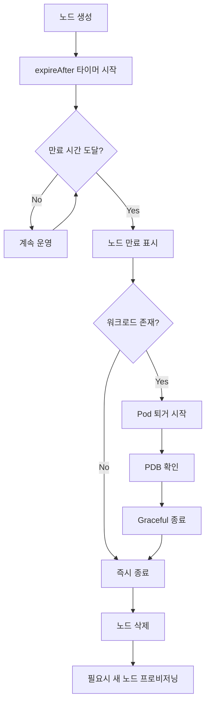
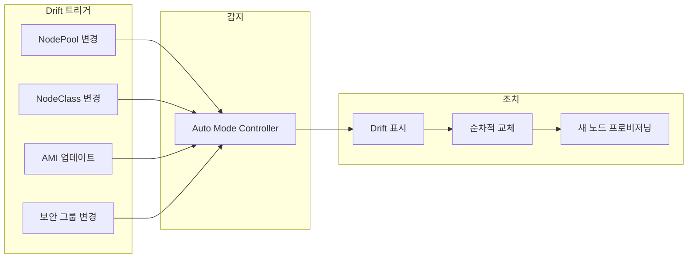
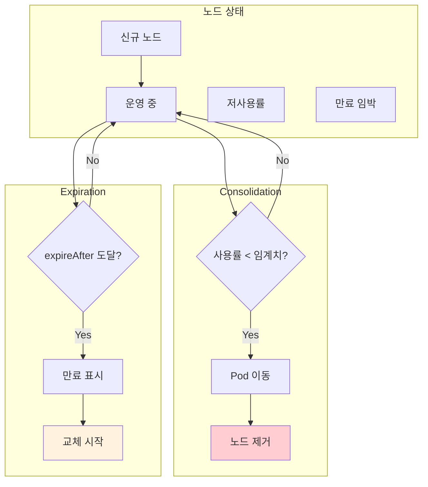

# 노드 생명주기 관리

> **지원 버전**: EKS 1.29+, EKS Auto Mode GA
> **마지막 업데이트**: 2026년 2월 19일

< [이전: 비용 관리](./06-cost-management.md) | [목차](./README.md) | [다음: 워크로드 최적화](./08-workload-optimization.md) >

---

이 문서에서는 EKS Auto Mode에서 노드의 생명주기를 관리하는 방법을 설명합니다. 노드 만료 정책, AMI 관리, Drift 감지, 그리고 노드 신선도 정책에 대해 다룹니다.

## 노드 만료 정책 (expireAfter)

### expireAfter 필드 이해

`expireAfter`는 노드의 최대 수명을 설정하는 필드입니다. 이전의 `ttlSecondsUntilExpired`를 대체합니다.

```yaml
apiVersion: karpenter.sh/v1
kind: NodePool
metadata:
  name: with-expiration
spec:
  template:
    spec:
      requirements:
        - key: karpenter.k8s.aws/instance-category
          operator: In
          values: ["m", "c"]
      nodeClassRef:
        group: eks.amazonaws.com
        kind: NodeClass
        name: default
      # 노드 만료 시간 설정
      expireAfter: 168h  # 7일 = 168시간
```

### 권장 만료 시간

| 환경 | 권장 expireAfter | 이유 |
|------|-----------------|------|
| **프로덕션** | 168h (7일) | 보안 패치 주기와 안정성 균형 |
| **스테이징** | 72h (3일) | 빠른 AMI 업데이트 테스트 |
| **개발** | 24h (1일) | 최신 상태 유지, 비용 최적화 |
| **보안 중요** | 48h (2일) | 빠른 패치 적용 |
| **GPU 워크로드** | 336h (14일) | 프로비저닝 시간 고려 |

### expireAfter 동작 원리



## AMI 관리 전략

### AMI 패밀리 선택

EKS Auto Mode는 두 가지 AMI 패밀리를 지원합니다.

```yaml
# AL2023 사용
apiVersion: eks.amazonaws.com/v1
kind: NodeClass
metadata:
  name: al2023-nodeclass
spec:
  amiFamily: AL2023
  # AL2023 특징:
  # - RHEL 기반, 안정적
  # - 광범위한 소프트웨어 호환성
  # - 부팅 시간: ~40-60초
---
# Bottlerocket 사용
apiVersion: eks.amazonaws.com/v1
kind: NodeClass
metadata:
  name: bottlerocket-nodeclass
spec:
  amiFamily: Bottlerocket
  # Bottlerocket 특징:
  # - 컨테이너 전용 OS
  # - 최소한의 공격 표면
  # - 부팅 시간: ~20-30초
  # - 자동 업데이트 지원
```

### AL2023 vs Bottlerocket 비교

| 특성 | AL2023 | Bottlerocket |
|------|--------|-------------|
| **기반** | RHEL | 목적 구축 OS |
| **부팅 시간** | 40-60초 | 20-30초 |
| **보안** | 표준 | 강화 (immutable) |
| **패키지 관리** | yum/dnf | 없음 (API 기반) |
| **SSH 접근** | 가능 | 제한적 (Admin container) |
| **디스크 크기** | 더 큼 | 최소화 |
| **소프트웨어 호환성** | 높음 | 컨테이너 전용 |
| **자동 업데이트** | 수동 | 지원 |
| **사용 사례** | 범용 | 보안 중시, 빠른 스케일링 |

### AMI 선택 가이드

```yaml
# 보안 중시 환경
apiVersion: eks.amazonaws.com/v1
kind: NodeClass
metadata:
  name: secure-nodeclass
spec:
  amiFamily: Bottlerocket
  # Bottlerocket의 보안 이점:
  # - 읽기 전용 루트 파일시스템
  # - SELinux 강제 모드
  # - dm-verity로 무결성 검증
  # - 최소 패키지로 공격 표면 감소
---
# 범용 환경
apiVersion: eks.amazonaws.com/v1
kind: NodeClass
metadata:
  name: general-nodeclass
spec:
  amiFamily: AL2023
  # AL2023 선택 이유:
  # - 기존 스크립트/도구 호환
  # - 디버깅 용이
  # - 광범위한 문서화
```

## AMI 업데이트와 Drift 감지

### Drift 감지 메커니즘

Auto Mode는 NodeClass나 NodePool 설정이 변경되면 자동으로 Drift를 감지합니다.

```bash
# Drift 상태 확인
kubectl get nodes -o custom-columns=\
NAME:.metadata.name,\
NODEPOOL:.metadata.labels.karpenter\\.sh/nodepool,\
CREATED:.metadata.creationTimestamp

# NodeClaim에서 Drift 확인
kubectl get nodeclaims -o wide

# Drift 이유 확인
kubectl describe nodeclaim <name> | grep -A5 "Status:"
```

### Drift 발생 시나리오



### AMI 업데이트 주기

```yaml
# AMI 자동 업데이트를 위한 설정
apiVersion: karpenter.sh/v1
kind: NodePool
metadata:
  name: auto-update-pool
spec:
  template:
    spec:
      requirements:
        - key: karpenter.k8s.aws/instance-category
          operator: In
          values: ["m", "c"]
      nodeClassRef:
        group: eks.amazonaws.com
        kind: NodeClass
        name: default
      # 7일마다 자동 교체로 최신 AMI 적용
      expireAfter: 168h
  disruption:
    consolidationPolicy: WhenEmptyOrUnderutilized
    consolidateAfter: 1m
    budgets:
      # 안전한 롤링 업데이트
      - nodes: "1"
```

## 노드 신선도 정책과 보안 패치

### 노드 신선도의 중요성

신선한 노드를 유지하는 것은 보안과 컴플라이언스에 중요합니다.

| 고려사항 | 설명 |
|----------|------|
| **보안 패치** | 최신 AMI는 최신 보안 패치 포함 |
| **CVE 대응** | 새 노드는 알려진 취약점 패치됨 |
| **컴플라이언스** | 규정 준수를 위한 정기적 교체 필요 |
| **드리프트 방지** | 구성 변경 누적 방지 |

### 보안 패치 전략

```yaml
# 보안 중심 노드 교체 정책
apiVersion: karpenter.sh/v1
kind: NodePool
metadata:
  name: security-focused
spec:
  template:
    spec:
      requirements:
        - key: karpenter.k8s.aws/instance-category
          operator: In
          values: ["m"]
      nodeClassRef:
        group: eks.amazonaws.com
        kind: NodeClass
        name: secure-nodeclass
      # 보안 패치를 위한 짧은 수명
      expireAfter: 72h  # 3일
  disruption:
    consolidationPolicy: WhenEmptyOrUnderutilized
    consolidateAfter: 1m
    budgets:
      # 업무 시간 외 교체
      - nodes: "0"
        schedule: "0 9-18 * * mon-fri"
        duration: 9h
      - nodes: "2"
```

### 보안 패치 모니터링

```bash
#!/bin/bash
# security-patch-status.sh

echo "=== 노드 보안 상태 분석 ==="

# 7일 이상 된 노드 확인
echo ""
echo "7일 이상 된 노드:"
kubectl get nodes -o json | jq -r '
  .items[] |
  select(
    (now - (.metadata.creationTimestamp | fromdateiso8601)) > 604800
  ) |
  "\(.metadata.name): \((now - (.metadata.creationTimestamp | fromdateiso8601)) / 86400 | floor)일 경과"
'

# AMI 버전 확인
echo ""
echo "노드별 AMI 정보:"
kubectl get nodes -o custom-columns=\
NAME:.metadata.name,\
AMI:.status.nodeInfo.osImage,\
KERNEL:.status.nodeInfo.kernelVersion
```

## Consolidation vs Expiration 트레이드오프

### 두 메커니즘의 차이

| 특성 | Consolidation | Expiration |
|------|--------------|------------|
| **트리거** | 리소스 사용률 | 시간 경과 |
| **목적** | 비용 최적화 | 노드 신선도 유지 |
| **동작** | 저사용률 노드 통합 | 만료된 노드 교체 |
| **우선순위** | 비용 절감 | 보안/안정성 |

### 상호작용 이해



### 권장 조합 설정

```yaml
# 비용과 보안 균형 잡힌 설정
apiVersion: karpenter.sh/v1
kind: NodePool
metadata:
  name: balanced-pool
spec:
  template:
    spec:
      requirements:
        - key: karpenter.k8s.aws/instance-category
          operator: In
          values: ["m", "c"]
      nodeClassRef:
        group: eks.amazonaws.com
        kind: NodeClass
        name: default
      # 7일 후 만료 (보안)
      expireAfter: 168h
  disruption:
    # 적극적 통합 (비용)
    consolidationPolicy: WhenEmptyOrUnderutilized
    consolidateAfter: 5m
    budgets:
      - nodes: "10%"
```

### 시나리오별 설정 가이드

```yaml
# 시나리오 1: 비용 최적화 우선
apiVersion: karpenter.sh/v1
kind: NodePool
metadata:
  name: cost-priority
spec:
  template:
    spec:
      expireAfter: 336h  # 14일 (긴 수명)
  disruption:
    consolidationPolicy: WhenEmptyOrUnderutilized
    consolidateAfter: 1m  # 빠른 통합
---
# 시나리오 2: 보안 우선
apiVersion: karpenter.sh/v1
kind: NodePool
metadata:
  name: security-priority
spec:
  template:
    spec:
      expireAfter: 48h  # 2일 (짧은 수명)
  disruption:
    consolidationPolicy: WhenEmpty  # 보수적 통합
    consolidateAfter: 10m
```

## 노드 수명 분포 모니터링

### kubectl을 활용한 모니터링

```bash
#!/bin/bash
# node-age-distribution.sh

echo "=== 노드 수명 분포 ==="

# 노드 수명 계산 및 분류
kubectl get nodes -o json | jq -r '
  .items[] |
  {
    name: .metadata.name,
    age_hours: ((now - (.metadata.creationTimestamp | fromdateiso8601)) / 3600 | floor)
  }
' | jq -s '
  group_by(
    if .age_hours < 24 then "< 1일"
    elif .age_hours < 72 then "1-3일"
    elif .age_hours < 168 then "3-7일"
    else "> 7일"
    end
  ) |
  map({
    range: .[0] | (
      if .age_hours < 24 then "< 1일"
      elif .age_hours < 72 then "1-3일"
      elif .age_hours < 168 then "3-7일"
      else "> 7일"
      end
    ),
    count: length,
    nodes: map(.name)
  })
'
```

### Prometheus 메트릭

```yaml
# 노드 수명 모니터링 규칙
apiVersion: monitoring.coreos.com/v1
kind: PrometheusRule
metadata:
  name: node-age-monitoring
spec:
  groups:
    - name: node-age
      rules:
        # 노드 수명 (초)
        - record: karpenter:node_age_seconds
          expr: |
            time() - kube_node_created

        # 7일 이상 된 노드 수
        - record: karpenter:stale_nodes_count
          expr: |
            count(karpenter:node_age_seconds > 604800) or vector(0)

        # 오래된 노드 알림
        - alert: StaleNodesDetected
          expr: karpenter:stale_nodes_count > 0
          for: 1h
          labels:
            severity: warning
          annotations:
            summary: "오래된 노드 감지"
            description: "{{ $value }}개의 노드가 7일 이상 운영 중입니다."
```

### Grafana 대시보드 쿼리

```promql
# 노드 수명 히스토그램
histogram_quantile(0.5,
  sum(rate(karpenter:node_age_seconds[1h])) by (le)
)

# NodePool별 평균 노드 수명
avg by (nodepool) (
  karpenter:node_age_seconds * on(node) group_left(nodepool)
  kube_node_labels{label_karpenter_sh_nodepool!=""}
)

# 수명별 노드 분포
count by (age_bucket) (
  label_replace(
    karpenter:node_age_seconds,
    "age_bucket",
    "$1",
    "node",
    ".*"
  )
)
```

---

< [이전: 비용 관리](./06-cost-management.md) | [목차](./README.md) | [다음: 워크로드 최적화](./08-workload-optimization.md) >
