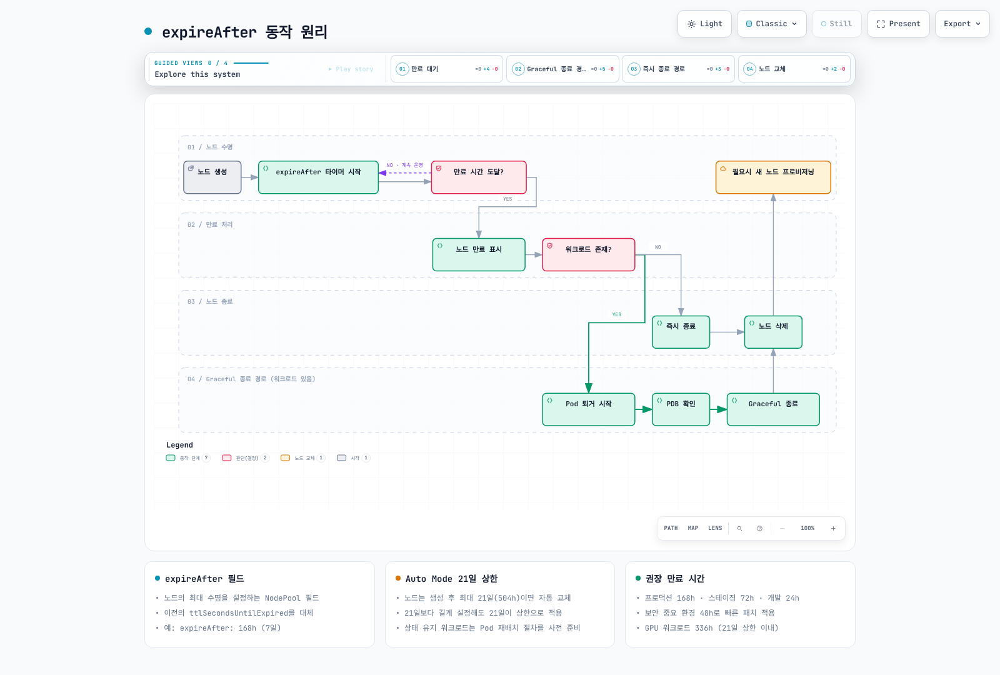
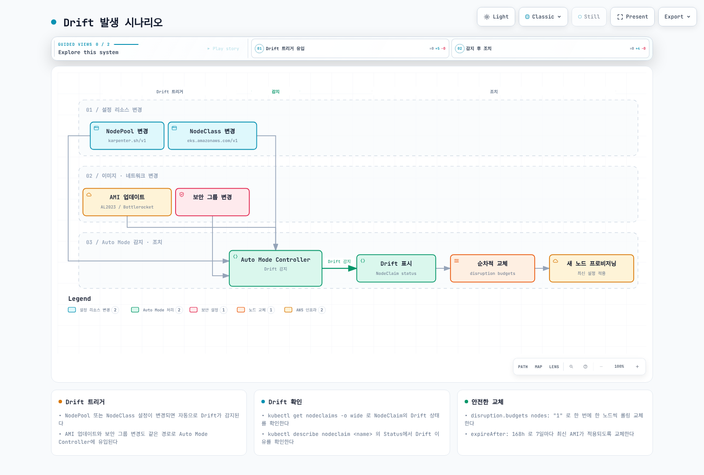
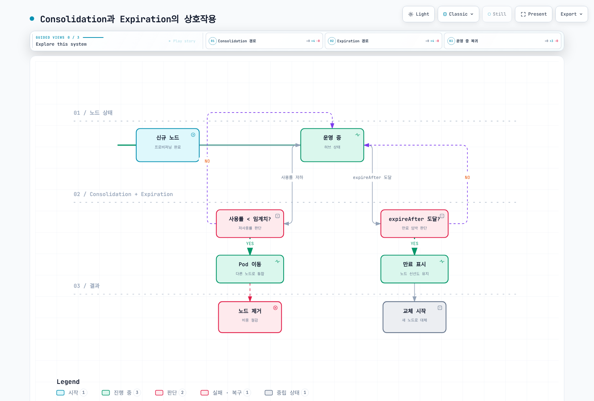

# 노드 생명주기 관리

> **지원 버전**: EKS Auto Mode GA; 예제 검토 기준 EKS 1.36
> **마지막 업데이트**: 2026년 9월 12일

Expiration, 관리형 이미지 갱신과 애플리케이션 복구는 노드 수명 주기의 서로 다른 부분입니다. Kubernetes Node 객체가 새롭다고 모든 CVE 패치나 워크로드 규정 준수가 입증되지는 않습니다. 공식 소스·로컬 스키마/fixture로 검토했으며 실제 노드 교체·클라우드 변경·benchmark는 수행하지 않았습니다.

## Expiration과 Auto Mode 수명 제한

`spec.template.spec.expireAfter`는 해당 template에서 생성된 NodeClaim의 나이 기준 만료를 정합니다. 이전 Provisioner 시기의 `ttlSecondsUntilExpired`는 이 `karpenter.sh/v1` NodePool에서 사용하지 않습니다.

다음 세 가지를 구분하세요.

| 개념 | Auto Mode 동작 |
|------|----------------|
| 기본 expiration | AWS 문서상 **336h(14일)**이며 7일·21일이 아님 |
| Termination grace | NodePool에서 생략하면 Auto Mode가 **NodeClaim에 24h**를 기본 적용; pool에 없더라도 claim 확인 |
| 관리형 인스턴스 최대 수명 | AWS가 **21일(504h)**을 적용; 그때까지 노드 가용성을 보장한다는 뜻은 아님 |

Upstream Karpenter의 기본 720h를 Auto Mode 기본값으로 대신 사용하지 마세요. 큰 duration이나 upstream `Never` 문법이 Auto Mode 관리형 인스턴스의 무기한 보존을 제공하지는 않습니다. 504h에 긴 drain을 더해 AWS 최대 수명을 연장할 수 있다고 생각해서도 안 됩니다.

아래 읽기 전용 명령 전에 [운영 및 관리](./05-operations.md)의 계정/context 검사와 private `WORK_DIR`를 사용합니다. 예제 pool은 검토된 `default` NodeClass를 가정하는 제한·taint가 있는 실습 설정입니다. 일치하는 workload selector/toleration과 애플리케이션 복구 검증이 필요합니다.

```yaml
apiVersion: karpenter.sh/v1
kind: NodePool
metadata:
  name: with-expiration
spec:
  template:
    spec:
      requirements:
      - key: eks.amazonaws.com/instance-category
        operator: In
        values:
        - m
      - key: karpenter.sh/capacity-type
        operator: In
        values:
        - on-demand
      nodeClassRef:
        group: eks.amazonaws.com
        kind: NodeClass
        name: default
      expireAfter: 168h
      terminationGracePeriod: 24h
      taints:
      - key: lifecycle-lab
        value: 'true'
        effect: NoSchedule
    metadata:
      labels:
        lifecycle-lab: 'true'
  disruption:
    consolidationPolicy: WhenEmptyOrUnderutilized
    consolidateAfter: 5m
    budgets:
    - nodes: 10%
  limits:
    cpu: '100'
    memory: 400Gi
```

### Expiration의 실제 동작

Expiration은 **forceful disruption trigger**입니다. NodeClaim이 정책 나이에 도달하면 termination/drain을 시작하며 미리 준비한 대체 노드의 Ready를 기다리지 않습니다. NodePool disruption budget은 expiration 속도를 제한하지 않습니다. 워크로드 controller·프로비저닝이 필요에 따라 대체 용량을 만들 수 있지만 이전의 “새 노드 Ready 다음 drain” 순서가 보장되지는 않습니다.

Termination controller는 일반적인 신규 배치를 막고 Eviction API 기반 drain, volume detach와 인스턴스 종료를 처리합니다. PDB와 Pod `do-not-disrupt`가 drain에 영향을 줄 수 있지만 termination grace 마감·AWS 최대 수명이 있어 무기한 가용성 보호는 아닙니다. Pod shutdown grace와 노드 termination grace도 다른 설정입니다. Local/ephemeral storage 데이터에는 복구 계획이 필요합니다.

Pool의 `expireAfter`를 바꿔도 기존 NodeClaim 값은 바뀌지 않습니다. Drift를 유발할 수 있으며 새 claim에 변경 정책이 적용됩니다. 다른 중단 원인으로 노드가 더 일찍 종료될 수도 있습니다. 1개 노드 budget이 여러 동시 expiration을 순차 처리로 바꾸지는 않습니다.



[🔍 인터랙티브 다이어그램 보기](https://www.atomai.click/kubernetes-docs/archmaps/ko-eks-auto-mode-07-node-lifecycle-0.html)

그림의 graceful 경로는 무기한 PDB 보호를 뜻하지 않습니다. 빈 노드도 controller/finalizer·리소스 정리 절차가 있으므로 “즉시 종료”를 완료 시간 보장으로 읽지 마세요.

### Duration 선택

이전의 환경별 24h·48h·72h·168h·336h는 정책 예시이며 AWS 프로덕션 기본값이나 PCI/HIPAA/SOC2의 필수 교체 간격이 아닙니다. 개발용 504h 예시는 서비스 상한이지 권장 `expireAfter`와 drain 시간 조합이 아닙니다.

패치 긴급도, checkpoint, cache warm-up, replica/quorum, 용량과 복구 검증으로 정책을 정합니다. 잦은 교체는 image pull·재배치·유료 복구 작업을 늘릴 수 있습니다. 특정 Spot 인스턴스의 EC2 interruption 확률 자체를 높이거나 새 패치 가용성을 보장하지는 않습니다.

## 관리형 AMI와 NodeClass 구성

Auto Mode는 AWS 관리형 **Bottlerocket 변형**을 사용합니다. AL2023/Bottlerocket `amiFamily` 전환, 커스텀 `amiSelectorTerms`, 임의 `userData`, SSH나 SSM Session Manager 접근을 제공하지 않습니다. 자체 Karpenter의 EC2NodeClass나 일반 managed node group 절차에서 이 인터페이스를 복사해서는 안 됩니다.

다음 지원 NodeClass는 스토리지·네트워크 identity를 구성하며 AMI를 선택·고정하지 않습니다.

```yaml
apiVersion: eks.amazonaws.com/v1
kind: NodeClass
metadata:
  name: lifecycle-nodeclass
spec:
  instanceProfile: eks-node-instance-profile
  subnetSelectorTerms:
  - tags:
      Name: private-subnet
  securityGroupSelectorTerms:
  - tags:
      Name: worker-restricted
  advancedNetworking:
    associatePublicIPAddress: false
  ephemeralStorage:
    size: 100Gi
    iops: 3000
    throughput: 125
```

Instance-profile role/access entry와 실제 subnet/security-group 선택을 검토한 뒤 대상 pool에서만 `lifecycle-nodeclass`를 참조하세요. Auto Mode IMDSv2/hop-limit은 관리형이며 `metadataOptions`로 덮어쓰는 필드가 아닙니다. `blockDeviceMappings` 대신 `ephemeralStorage`를 사용합니다. 노드 root/data EBS 암호화가 애플리케이션 PVC 암호화를 입증하지는 않습니다. 지원 key/인증서 설정은 [NodePool 구성](./02-nodepool-configuration.md)을 참고하세요.

### 과거 OS 비교는 Auto Mode 선택 메뉴가 아님

AL2023은 선택한 Fedora upstream 구성 요소를 사용하는 범용 Amazon Linux 배포판이며 단순한 RHEL 기반 OS가 아닙니다. 일반 AL2023·독립 운영 Bottlerocket 호스트의 관리 기능과 잠긴 Auto Mode 노드의 기능은 다릅니다. Auto Mode는 관리형 이미지로 GPU도 지원하므로 “GPU에는 반드시 AL2023”이라는 설명도 맞지 않습니다.

원래 AL2023 40–60초, Bottlerocket 20–30초/20–40초와 퀴즈의 20–40초 대 15–25초에는 확인된 실측 출처가 없습니다. 과거 예시로 보존하며 OS 속도 순위나 이 manifest의 예측값이 아닙니다. Image pull, 아키텍처, 인스턴스 유형과 workload readiness는 별도 측정이 필요합니다.

## Drift와 관리형 이미지 갱신

AWS는 Auto Mode AMI를 대략 매주 릴리스하고 적격 노드의 drift 교체를 허용한다고 설명합니다. 개별 CVE 패치 SLA는 아닙니다. 다른 EKS-optimized AMI family 릴리스가 자동으로 Auto Mode 이미지 갱신이 되는 것도 아닙니다.

| 변경·관측 | 올바른 해석 |
|-----------|-------------|
| 관리형 Auto Mode AMI 갱신 | 기존 claim이 drift 상태가 될 수 있으므로 실제 condition·rollout 확인 |
| NodePool requirement 변경 | 모든 변경이 drift는 아님; 기존 노드와 호환되는 허용값 확장은 적합성을 유지할 수 있음 |
| `expireAfter` template 변경 | 기존 claim은 저장 값을 유지하고 새 claim이 변경 정책 사용 |
| Weight·limits·disruption | 동작 설정이며 일괄 drift trigger 아님 |
| NodeClass desired state 변경 | 지원 필드를 사용하고 관리형 controller 관측; 장식용 tag는 긴급 패치 trigger 보장 아님 |
| `amiFamily`·`blockDeviceMappings` 변경 | 유효한 Auto Mode NodeClass 필드가 아님 |

NodeClaim의 `Drifted` condition을 사용하세요. Hash annotation은 boolean drift 상태가 아니고 condition 미보고도 “drift 아님”의 증거가 아닙니다. Reason/transition/generation을 현재 리소스와 대조합니다.

```bash
kubectl --context "$KUBE_CONTEXT" --request-timeout=15s get nodeclaims -o json |
jq '[.items[] | {
  name:.metadata.name,uid:.metadata.uid,node:.status.nodeName,
  createdAt:.metadata.creationTimestamp,deletionTimestamp:.metadata.deletionTimestamp,
  pool:.metadata.labels["karpenter.sh/nodepool"],
  expireAfter:.spec.expireAfter,terminationGracePeriod:.spec.terminationGracePeriod,
  imageID:.status.imageID,
  drift:([.status.conditions[]?|select(.type=="Drifted")|
    {status,reason,lastTransitionTime,observedGeneration}] |
    if length == 0 then {status:"NotReported"} else .[0] end),
  conditions:[.status.conditions[]?|{type,status,reason,lastTransitionTime,observedGeneration}]
}]'
```



[🔍 인터랙티브 다이어그램 보기](https://www.atomai.click/kubernetes-docs/archmaps/ko-eks-auto-mode-07-node-lifecycle-1.html)

그림의 `AL2023 / Bottlerocket` 선택과 무조건적인 “순차적 교체”는 Auto Mode 동작으로 읽으면 안 됩니다. 이 절의 managed image·condition·budget 설명이 적용됩니다.

Drift는 해당 budget, 배치 가능성과 drain 제약을 따르는 graceful 작업입니다. 다음은 자발적 중단 1개를 허용하며 평일 UTC 00:00–08:00, 즉 서울 09:00–17:00에는 **drift만** 멈춥니다. 이전 `0 9-17`/`0 9-18` 매시간 schedule은 긴 창을 반복해 중첩했습니다.

```yaml
apiVersion: karpenter.sh/v1
kind: NodePool
metadata:
  name: controlled-drift
spec:
  template:
    spec:
      requirements:
      - key: eks.amazonaws.com/instance-category
        operator: In
        values:
        - m
      - key: karpenter.sh/capacity-type
        operator: In
        values:
        - on-demand
      nodeClassRef:
        group: eks.amazonaws.com
        kind: NodeClass
        name: default
      expireAfter: 168h
      terminationGracePeriod: 24h
      taints:
      - key: lifecycle-lab
        value: 'true'
        effect: NoSchedule
    metadata:
      labels:
        lifecycle-lab: 'true'
  disruption:
    consolidationPolicy: WhenEmptyOrUnderutilized
    consolidateAfter: 10m
    budgets:
    - nodes: '1'
    - nodes: '0'
      schedule: 0 0 * * mon-fri
      duration: 8h
      reasons:
      - Drifted
  limits:
    cpu: '100'
    memory: 400Gi
```

Expiration, EC2 interruption이나 repair를 멈추지는 않습니다. `consolidateAfter`는 consolidation 설정이며 AMI patch 마감이 아닙니다. Pod·Node의 `do-not-disrupt` 범위도 다르고, Pod annotation이 drift를 막는지 판단할 때 Auto Mode의 기본 NodeClaim grace를 고려해야 합니다.

## 패치와 예외적 수동 복구

AWS는 노드 OS·Auto Mode 컴포넌트 패치를 관리하지만 애플리케이션·컨테이너 의존성과 workload 보안은 사용자 책임입니다. 실제 이미지, 관련 AWS 릴리스/권고, rollout 진행과 애플리케이션 검사를 기록합니다. 새로운 timestamp나 `SecurityPatch` tag가 패치 존재 증거는 아닙니다.

긴급 대응 절차:

1. 필요한 관리형 이미지·수정이 이 클러스터에 제공되는지 확인하고 영향 워크로드를 식별합니다.
2. 대상 context에서 **단일 NodeClaim UID**, node mapping, pool, condition, PDB, 데이터 내구성과 여유/확보 가능한 용량을 검토합니다.
3. 요구를 충족하면 관리형 drift rollout을 사용합니다. 수동 교체가 필요하면 검토된 단일 리소스 유지보수 절차를 사용하고 다음 리소스로 가기 전에 대체·애플리케이션 readiness를 확보합니다.
4. 변경마다 health·이미지를 확인하며 상태 불명, 용량 실패나 애플리케이션 회귀 시 중단합니다.

다음은 증거만 수집합니다.

```bash
: "${NODECLAIM_NAME:?Select one NodeClaim for review}"
kubectl --context "$KUBE_CONTEXT" --request-timeout=15s get nodeclaim "$NODECLAIM_NAME" -o json |
  jq '{name:.metadata.name,uid:.metadata.uid,node:.status.nodeName,
       pool:.metadata.labels["karpenter.sh/nodepool"],imageID:.status.imageID,
       expireAfter:.spec.expireAfter,terminationGracePeriod:.spec.terminationGracePeriod,
       conditions:[.status.conditions[]?|{type,status,reason}]}'
kubectl --context "$KUBE_CONTEXT" --request-timeout=15s get pdb -A -o json |
  jq '[.items[]|{namespace:.metadata.namespace,name:.metadata.name,
       observedGeneration:.status.observedGeneration,generation:.metadata.generation,
       currentHealthy:.status.currentHealthy,desiredHealthy:.status.desiredHealthy,
       disruptionsAllowed:.status.disruptionsAllowed}]'
```

`kubectl delete nodes -l ...`은 일괄 삭제이며 순차 rolling update가 아닙니다. 수동 node/claim 삭제는 NodePool budget으로 제한되지 않습니다. `drain --delete-emptydir-data`는 local 데이터를 버릴 수 있고 drain만으로 대체 노드가 보장되지도 않습니다. 이전 퀴즈의 무제한 삭제 명령·tag 변경 “패치 trigger”는 긴급 운영 절차가 아닙니다.

## Consolidation·Drift·Expiration

| 방식 | Trigger와 제어 |
|------|----------------|
| Consolidation | Requests/제약에 따라 더 저렴하고 가능한 배치; graceful 제어 적용 |
| Drift | 기존 claim이 관리형 desired state와 불일치; graceful 제어 적용 |
| Expiration | Claim이 저장된 정책 나이에 도달; forceful trigger이며 NodePool budget 대상 아님 |

Graceful disruption controller는 consolidation보다 drift를 먼저 평가하지만 expiration은 별도 forceful 경로입니다. 보편적인 “drift > expiration > consolidation” 우선순위나 먼저 조건을 충족한 작업 승리 계약은 없습니다. 5일 된 노드는 7일 만료 전에 consolidate될 수 있고 8일 된 만료 노드는 저활용 상태가 아니어도 종료를 시작할 수 있습니다.



[🔍 인터랙티브 다이어그램 보기](https://www.atomai.click/kubernetes-docs/archmaps/ko-eks-auto-mode-07-node-lifecycle-2.html)

그림의 “사용률 < 임계치”는 실제 consolidation 조건을 단순화한 오래된 표현입니다. Expiration과의 고정된 우선순위도 의미하지 않습니다.

다음은 대안적인 실습 정책이며 비용·보안 결과를 보장하지 않습니다.

```yaml
apiVersion: karpenter.sh/v1
kind: NodePool
metadata:
  name: cost-priority
spec:
  template:
    spec:
      requirements:
      - key: eks.amazonaws.com/instance-category
        operator: In
        values:
        - m
      - key: karpenter.sh/capacity-type
        operator: In
        values:
        - on-demand
      nodeClassRef:
        group: eks.amazonaws.com
        kind: NodeClass
        name: default
      expireAfter: 336h
      terminationGracePeriod: 24h
      taints:
      - key: lifecycle-lab
        value: 'true'
        effect: NoSchedule
    metadata:
      labels:
        lifecycle-lab: 'true'
  disruption:
    consolidationPolicy: WhenEmptyOrUnderutilized
    consolidateAfter: 1m
    budgets:
    - nodes: 10%
  limits:
    cpu: '100'
    memory: 400Gi
---
apiVersion: karpenter.sh/v1
kind: NodePool
metadata:
  name: security-priority
spec:
  template:
    spec:
      requirements:
      - key: eks.amazonaws.com/instance-category
        operator: In
        values:
        - m
      - key: karpenter.sh/capacity-type
        operator: In
        values:
        - on-demand
      nodeClassRef:
        group: eks.amazonaws.com
        kind: NodeClass
        name: default
      expireAfter: 72h
      terminationGracePeriod: 24h
      taints:
      - key: lifecycle-lab
        value: 'true'
        effect: NoSchedule
    metadata:
      labels:
        lifecycle-lab: 'true'
  disruption:
    consolidationPolicy: WhenEmpty
    consolidateAfter: 10m
    budgets:
    - nodes: 10%
  limits:
    cpu: '100'
    memory: 400Gi
```

`WhenEmpty`는 consolidation을 좁히지만 drift/expiration을 끄지는 않습니다. 선택한 expiry·grace에 애플리케이션을 맞추고 정책 이름으로 가용성을 추론하지 마세요.

## Node 객체 나이와 이미지 증거

`Node.metadata.creationTimestamp`, NodeClaim 생성 시각과 EC2 시작 시각은 서로 다른 관측입니다. `Node.status.nodeInfo.osImage`는 OS 설명이며 AMI ID가 아닙니다. 이전 CREATED/AGE 중복 timestamp 열이나 “보안 패치 상태” age script는 패치 상태를 입증하지 못했습니다.

필요한 Node 필드를 수집한 뒤 이식 가능한 소수 나이·명시적인 bucket을 계산합니다. 잘못된 값, 누락, timezone 부재와 미래 시각은 unknown으로 유지합니다.

```bash
kubectl --context "$KUBE_CONTEXT" --request-timeout=15s get nodes \
  -l eks.amazonaws.com/compute-type=auto -o json |
jq '{items:[.items[] | {
  name:.metadata.name,uid:.metadata.uid,createdAt:.metadata.creationTimestamp,
  pool:.metadata.labels["karpenter.sh/nodepool"],
  osImage:.status.nodeInfo.osImage,kernelVersion:.status.nodeInfo.kernelVersion
}]}' > "$WORK_DIR/node-lifecycle.json"
```

```bash
python3 - <<'PY'
import json, os
from datetime import datetime, timezone
from pathlib import Path
now = datetime.now(timezone.utc)
rows = []
for item in json.loads((Path(os.environ["WORK_DIR"]) / "node-lifecycle.json").read_text())["items"]:
    result = {"node": item["name"], "pool": item.get("pool")}
    try:
        created = datetime.fromisoformat(item["createdAt"].replace("Z", "+00:00"))
        if created.tzinfo is None or created > now:
            raise ValueError("unusable timestamp")
        hours = (now - created).total_seconds() / 3600
        bucket = "<1d" if hours < 24 else "1d–<3d" if hours < 72 else "3d–<7d" if hours < 168 else ">=7d"
        result.update(nodeObjectAgeHours=round(hours, 3), bucket=bucket)
    except (KeyError, AttributeError, TypeError, ValueError):
        result["bucket"] = "UnknownTimestamp"
    rows.append(result)
summary = [{"bucket": bucket, "count": sum(row["bucket"] == bucket for row in rows)}
           for bucket in ("<1d", "1d–<3d", "3d–<7d", ">=7d", "UnknownTimestamp")]
print(json.dumps({"observedAt": now.isoformat(), "nodes": rows, "distribution": summary}, indent=2))
PY
```

Bucket은 `[0,1)`, `[1,3)`, `[3,7)`, `>=7`일이며 정확히 7일은 마지막 bucket입니다. 성공한 빈 Node 목록과 API 오류를 구분합니다. Snapshot 진단이며 실시간 dashboard나 patch compliance 검사가 아닙니다.

### Prometheus와 Grafana

kube-state-metrics를 설치하고 `karpenter.sh/nodepool`, `eks.amazonaws.com/compute-type`을 allowlist에 포함합니다. 다음 **단일 클러스터** rule file은 scrape를 중복 제거하고 Node 생성 gauge에 Auto Mode label을 join합니다. 여러 클러스터라면 모든 group/join에 실제 cluster label을 포함해야 합니다. Metrics 부재나 미래 timestamp를 정상 0일 노드로 바꾸지 않습니다.

Age alert의 10일·표준편차 3일은 이전 값을 **검토 신호 예시**로 보존한 것입니다. Auto Mode 기본값이 아니며 pool 정책 혼합·정상 autoscaling도 분포를 넓힐 수 있습니다. Prometheus rule file로 로드하거나 operator가 선택하는 PrometheusRule의 `spec` 아래 groups를 넣어 사용합니다.

```yaml
groups:
- name: node-lifecycle
  rules:
  - record: eks_auto:node_object_age_days
    expr: "(\n  ((time() - max by (node) (kube_node_created)) >= 0) / 86400\n) * on\
      \ (node) group_left (label_karpenter_sh_nodepool)\nmax by (node,label_karpenter_sh_nodepool)\
      \ (\n  kube_node_labels{label_karpenter_sh_nodepool!=\"\",label_eks_amazonaws_com_compute_type=\"\
      auto\"}\n)"
  - alert: ReviewNodeObjectAge
    expr: eks_auto:node_object_age_days > 10
    for: 1h
    labels:
      severity: warning
    annotations:
      summary: Review this node against its actual lifecycle policy
  - alert: ReviewNodeAgeSpread
    expr: stddev(eks_auto:node_object_age_days) > 3
    for: 4h
    labels:
      severity: info
    annotations:
      summary: Age spread is a review signal, not proof of failed rotation
```

```promql
# median_object_age_days
quantile(0.5, eks_auto:node_object_age_days)

# mean_by_pool
avg by (label_karpenter_sh_nodepool) (eks_auto:node_object_age_days)

# oldest_five
topk(5, eks_auto:node_object_age_days)

# less_than_1d
sum((eks_auto:node_object_age_days >= bool 0) * (eks_auto:node_object_age_days < bool 1))

# 1d_to_under_3d
sum((eks_auto:node_object_age_days >= bool 1) * (eks_auto:node_object_age_days < bool 3))

# 3d_to_under_7d
sum((eks_auto:node_object_age_days >= bool 3) * (eks_auto:node_object_age_days < bool 7))

# 7d_or_more
sum(eks_auto:node_object_age_days >= bool 7)
```

`kube_node_created`는 timestamp gauge이며 histogram/counter가 아닙니다. 기본 `kube_node_created_bucket`은 없고 `rate()`와 `histogram_quantile()`로 node-age histogram을 만들 수 없습니다. 현재 나이 중앙값에는 `quantile()`, 막대그래프에는 명시적 boolean bucket을 사용합니다. 관측 노드는 있으나 해당 bucket이 비었을 때는 합계 0이며 입력 부재는 부재로 남습니다.

| Grafana panel | 증거 |
|---------------|------|
| 현재 나이 분포 | 명시적인 네 bucket query |
| Pool별 평균/오래된 노드 | Label join과 `avg`/`topk` |
| 만료 임박 claim | 실제 NodeClaim 생성 시각과 저장된 `expireAfter`; Node 나이만으로는 부족 |
| 교체율 | 구성한 event/log 이력 또는 확인된 counter publisher; 현재 객체 수로 추측하지 않음 |
| 패치 rollout | 관리형 이미지/릴리스, claim condition과 애플리케이션 health |

## 참고 자료

- [Auto Mode NodePool defaults and termination grace](https://docs.aws.amazon.com/eks/latest/userguide/create-node-pool.html)
- [Auto Mode security and maximum instance lifetime](https://docs.aws.amazon.com/eks/latest/userguide/auto-security.html)
- [Auto Mode managed OS and responsibilities](https://docs.aws.amazon.com/eks/latest/userguide/automode.html)
- [NodeClass supported configuration](https://docs.aws.amazon.com/eks/latest/userguide/create-node-class.html)
- [Karpenter disruption, expiration and drift](https://karpenter.sh/v1.14/concepts/disruption/)
- [Kube-state-metrics Node metrics](https://github.com/kubernetes/kube-state-metrics/blob/main/docs/metrics/cluster/node-metrics.md)
- [Prometheus aggregation operators](https://prometheus.io/docs/prometheus/latest/querying/operators/)
- [AL2023 relationship to Fedora](https://docs.aws.amazon.com/linux/al2023/ug/relationship-to-fedora.html)

< [이전: 비용 관리](./06-cost-management.md) | [목차](./README.md) | [다음: 워크로드 최적화](./08-workload-optimization.md) >
