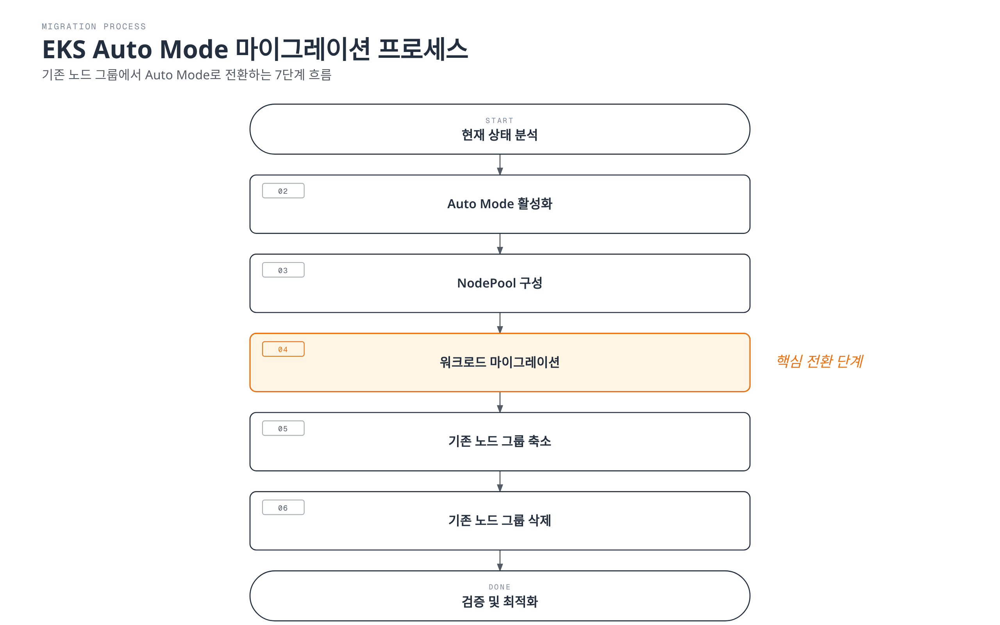

# 관리형 노드 그룹에서 Auto Mode로 마이그레이션

> **지원 버전**: EKS 1.29+, EKS Auto Mode GA
> **마지막 업데이트**: 2026년 7월 3일

< [이전: 워크로드 최적화](./08-workload-optimization.md) | [목차](./README.md) | [다음: 목차](./README.md) >

---

이 문서에서는 기존 관리형 노드 그룹에서 EKS Auto Mode로 안전하게 마이그레이션하는 방법을 설명합니다.

## 마이그레이션 단계



## 1단계: 현재 상태 분석

```bash
# 현재 노드 그룹 확인
eksctl get nodegroup --cluster my-cluster

# 노드 리소스 사용량 분석
kubectl top nodes

# 워크로드 분포 확인
kubectl get pods -A -o wide | awk '{print $8}' | sort | uniq -c

# 현재 인스턴스 타입별 노드 수
kubectl get nodes -o custom-columns=\
NAME:.metadata.name,\
TYPE:.metadata.labels.node\\.kubernetes\\.io/instance-type,\
ZONE:.metadata.labels.topology\\.kubernetes\\.io/zone
```

## 2단계: Auto Mode 활성화

```bash
# Auto Mode 활성화
aws eks update-cluster-config \
    --name my-cluster \
    --compute-config enabled=true,nodePools=general-purpose,nodePools=system

# 활성화 상태 확인
aws eks describe-cluster --name my-cluster \
    --query 'cluster.computeConfig'
```

## 3단계: 커스텀 NodePool 구성

```yaml
# custom-nodepools.yaml
apiVersion: karpenter.sh/v1
kind: NodePool
metadata:
  name: migrated-workloads
spec:
  template:
    metadata:
      labels:
        migration: auto-mode
    spec:
      requirements:
        # 기존 노드 그룹과 유사한 인스턴스 타입
        - key: karpenter.k8s.aws/instance-category
          operator: In
          values: ["m", "c", "r"]
        - key: karpenter.k8s.aws/instance-size
          operator: In
          values: ["large", "xlarge", "2xlarge"]
        - key: karpenter.sh/capacity-type
          operator: In
          values: ["on-demand"]
      nodeClassRef:
        group: eks.amazonaws.com
        kind: NodeClass
        name: default
```

## 4단계: 워크로드 마이그레이션

```bash
# 기존 노드에 cordon 적용 (새 Pod 스케줄 방지)
kubectl cordon -l eks.amazonaws.com/nodegroup=old-nodegroup

# 점진적으로 Pod drain
for node in $(kubectl get nodes -l eks.amazonaws.com/nodegroup=old-nodegroup -o name); do
    kubectl drain $node --ignore-daemonsets --delete-emptydir-data
    sleep 60  # 각 노드 사이에 대기 시간
done
```

## 5단계: 기존 노드 그룹 축소

```bash
# 노드 그룹 스케일 다운
eksctl scale nodegroup \
    --cluster my-cluster \
    --name old-nodegroup \
    --nodes 0 \
    --nodes-min 0
```

## 6단계: 기존 노드 그룹 삭제

```bash
# 노드 그룹 삭제
eksctl delete nodegroup \
    --cluster my-cluster \
    --name old-nodegroup

# 삭제 확인
eksctl get nodegroup --cluster my-cluster
```

## 공존 기간 운영 방법

마이그레이션 중 기존 노드 그룹과 Auto Mode가 공존할 수 있습니다.

```yaml
# coexistence-config.yaml
# 기존 노드 그룹 워크로드
apiVersion: apps/v1
kind: Deployment
metadata:
  name: legacy-app
spec:
  replicas: 3
  selector:
    matchLabels:
      app: legacy-app
  template:
    metadata:
      labels:
        app: legacy-app
    spec:
      # 기존 노드 그룹에 고정
      nodeSelector:
        eks.amazonaws.com/nodegroup: old-nodegroup
      containers:
        - name: app
          image: legacy-app:latest
---
# Auto Mode 워크로드
apiVersion: apps/v1
kind: Deployment
metadata:
  name: new-app
spec:
  replicas: 3
  selector:
    matchLabels:
      app: new-app
  template:
    metadata:
      labels:
        app: new-app
    spec:
      # Auto Mode 노드 선호
      affinity:
        nodeAffinity:
          preferredDuringSchedulingIgnoredDuringExecution:
            - weight: 100
              preference:
                matchExpressions:
                  - key: karpenter.sh/nodepool
                    operator: Exists
      containers:
        - name: app
          image: new-app:latest
```

## Self-managed Karpenter에서 마이그레이션 (공식 kubectl 기반 경로)

관리형 노드 그룹이 아니라 **기존에 self-managed Karpenter를 직접 운영 중**이라면, 위의 노드 그룹 전환 절차 대신 AWS가 공식 지원하는 kubectl 기반 마이그레이션 경로를 사용할 수 있습니다.

### 사전 조건

- Self-managed Karpenter **v1.1 이상**이 클러스터에 이미 설치되어 있어야 함
- 기존 Karpenter NodePool/EC2NodeClass 구성을 문서화해 둘 것

### 마이그레이션 절차

1. **Auto Mode 활성화**: 기존 Karpenter 컨트롤러와 NodePool은 그대로 둔 채 Auto Mode를 활성화합니다.

2. **Taint가 설정된 Auto Mode 전용 NodePool 생성**: 워크로드가 의도치 않게 Auto Mode 노드로 스케줄되지 않도록 Taint를 설정합니다.

   ```yaml
   apiVersion: karpenter.sh/v1
   kind: NodePool
   metadata:
     name: auto-mode-migration
   spec:
     template:
       spec:
         taints:
           - key: eks.amazonaws.com/auto-mode
             value: "true"
             effect: NoSchedule
         nodeClassRef:
           group: eks.amazonaws.com
           kind: NodeClass
           name: default
   ```

3. **워크로드에 matching toleration/nodeSelector 추가**: 전환할 워크로드에 위 Taint를 허용하는 toleration과 Auto Mode NodePool을 지정하는 nodeSelector를 추가합니다.

   ```yaml
   spec:
     template:
       spec:
         tolerations:
           - key: eks.amazonaws.com/auto-mode
             value: "true"
             effect: NoSchedule
         nodeSelector:
           karpenter.sh/nodepool: auto-mode-migration
   ```

4. **점진적 전환**: 워크로드 그룹 단위로 toleration/nodeSelector를 추가해 하나씩 Auto Mode 노드로 옮기면서, 기존 Karpenter가 관리하는 노드와 Auto Mode 노드가 같은 클러스터에서 병행 운영되도록 합니다.

5. **기존 Karpenter 제거**: 모든 워크로드가 Auto Mode 노드로 전환된 것을 확인한 뒤, 기존 self-managed Karpenter 컨트롤러와 관련 리소스(NodePool, EC2NodeClass, IAM 역할, Helm 릴리스 등)를 제거합니다.

이 경로는 self-managed Karpenter를 이미 운영 중인 클러스터를 위한 것이며, 관리형 노드 그룹에서 곧바로 전환하는 경우에는 위의 1~7단계 절차를 따르면 됩니다.

## 주의 사항

| 항목 | 주의 사항 |
|------|----------|
| AMI 호환성 | Auto Mode는 AL2023 또는 Bottlerocket만 지원 |
| 사용자 데이터 | 기존 부트스트랩 스크립트 호환성 확인 필요 |
| IAM 역할 | Auto Mode용 IAM 역할 자동 생성 |
| 보안 그룹 | NodeClass에서 재설정 필요 |
| 태그 | 기존 태그 정책을 NodeClass에 반영 |
| 모니터링 | 새로운 메트릭 수집 설정 필요 |

## 마이그레이션 체크리스트

### 사전 확인

- [ ] EKS 클러스터 버전 1.29 이상 확인
- [ ] 현재 워크로드 인벤토리 작성
- [ ] 리소스 사용량 패턴 분석
- [ ] 기존 nodeSelector/affinity 설정 검토
- [ ] PodDisruptionBudget 설정 확인

### 마이그레이션 중

- [ ] Auto Mode 활성화
- [ ] 기본 NodePool 생성 확인
- [ ] 커스텀 NodePool 구성
- [ ] 테스트 워크로드로 검증
- [ ] 점진적 워크로드 마이그레이션
- [ ] 기존 노드 그룹 축소

### 마이그레이션 후

- [ ] 모든 워크로드 정상 동작 확인
- [ ] 모니터링 대시보드 업데이트
- [ ] 알람 설정 조정
- [ ] 비용 최적화 검토
- [ ] 문서화 업데이트

## 롤백 계획

문제 발생 시 롤백 절차:

```bash
# 1. Auto Mode 노드에서 워크로드 퇴거
kubectl cordon -l karpenter.sh/nodepool

# 2. 기존 노드 그룹 재활성화
eksctl scale nodegroup \
    --cluster my-cluster \
    --name old-nodegroup \
    --nodes 3 \
    --nodes-min 1

# 3. 워크로드를 기존 노드로 복원
kubectl drain -l karpenter.sh/nodepool --ignore-daemonsets

# 4. Auto Mode 비활성화 (필요시)
aws eks update-cluster-config \
    --name my-cluster \
    --compute-config enabled=false
```

---

< [이전: 워크로드 최적화](./08-workload-optimization.md) | [목차](./README.md) | [다음: 목차](./README.md) >
