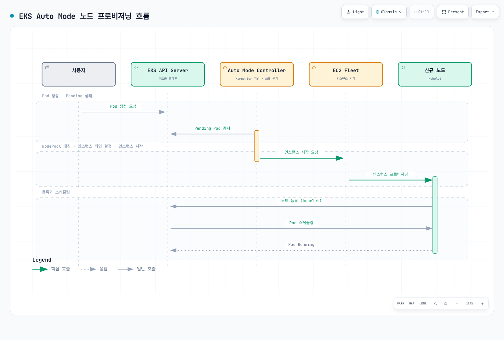

# EKS Auto Mode 운영 가이드

> **지원 버전**: EKS Auto Mode GA; 예제 기준 EKS 1.36
> **마지막 업데이트**: 2026년 9월 12일

Amazon EKS Auto Mode는 Kubernetes 노드 관리를 완전히 자동화하는 기능으로, 워크로드 요구 사항에 따라 자동으로 노드를 프로비저닝하고 최적화합니다. 이 가이드는 Auto Mode의 개념, 설정과 운영 시 고려 사항을 다룹니다. AWS가 Auto Mode 인프라를 관리하더라도 애플리케이션의 가용성, resource requests, 보안, 모니터링과 클러스터/VPC 구성은 사용자 책임입니다. 예제는 프로덕션 적용 전에 해당 환경에서 검증해야 합니다.

### 2026년 7월 업데이트: EFA 및 배치 그룹(Placement Group) 지원

2026년 7월 22일, EKS Auto Mode(및 오픈소스 Karpenter)의 노드 풀에서 Elastic Fabric Adapter(EFA) 네트워크 디바이스 구성과 EC2 배치 그룹을 지원한다고 발표되었습니다. EFA 지원 인스턴스의 네트워크 인터페이스를 EFA 전용 또는 표준 ENI로 구성할 수 있으며 — EFA 전용 인터페이스는 VPC IP 주소를 소비하지 않으면서도 인터커넥트 대역폭을 최대로 활용할 수 있습니다 — cluster, spread, partition 배치 전략을 노드 풀 구성에서 직접 지정해 인스턴스를 시작할 수 있습니다. 최대 처리량이나 장애 격리가 필요한 분산 학습/추론 워크로드를 겨냥한 기능입니다. 자세한 내용은 [발표](https://aws.amazon.com/about-aws/whats-new/2026/07/amazon-eks-efa-placement-groups/)를 참고하세요.

### 2026년 7월 업데이트: ARC Zonal Shift 지원

2026년 7월 10일부터 EKS Auto Mode 클러스터에서도 Amazon Application Recovery Controller(ARC) zonal shift와 autoshift를 사용할 수 있습니다. Auto Mode가 컴퓨팅을 대신 관리하므로 별도 플래그 설정이나 Karpenter 버전 관리 없이 클러스터에서 ARC zonal shift만 활성화하면 됩니다. zonal shift가 발동되면 Auto Mode는 장애 AZ에서 신규 용량 프로비저닝을 중단하고, 해당 존 노드에 대한 consolidation·drift 같은 자발적 중단(voluntary disruption)도 함께 중단합니다. 정상 AZ의 자발적 중단도 대체 Pod의 배치가 장애 AZ에 의존하면 막습니다. Auto Mode에 별도의 Karpenter 플래그는 필요하지 않지만, 클러스터 등록 후 ARC zonal autoshift는 별도로 구성해야 합니다. Zonal shift가 단일 AZ 볼륨이나 엄격한 AZ 배치 제약을 자동으로 이동 가능한 상태로 만들지는 않습니다. ARC zonal shift 자체의 추가 요금은 없지만 대체 용량과 일반 인프라 요금은 계속 적용됩니다. 자세한 내용은 [발표](https://aws.amazon.com/about-aws/whats-new/2026/07/eks-auto-mode-arc-zonal-shift)와 [ARC zonal shift 문서](https://docs.aws.amazon.com/eks/latest/userguide/zone-shift-enable.html)를 참고하세요.

## 목차

1. [Auto Mode 시작하기](./01-getting-started.md) - 클러스터 활성화 및 기본 설정
2. [NodePool 구성 및 최적화](./02-nodepool-configuration.md) - 기본 및 커스텀 NodePool 설정
3. [스케일링 동작 이해](./03-scaling-behavior.md) - 프로비저닝, Consolidation, Drift
4. [Spot 인스턴스 활용 전략](./04-spot-strategies.md) - 비용 최적화를 위한 Spot 활용
5. [운영 및 관리](./05-operations.md) - 모니터링, 문제 해결, Day-2 운영
6. [비용 관리 및 최적화](./06-cost-management.md) - 비용 분석 및 절감 전략
7. [노드 생명주기 관리](./07-node-lifecycle.md) - AMI 관리, 노드 갱신, 만료 정책
8. [워크로드별 최적화](./08-workload-optimization.md) - 웹, 배치, GPU, AI/ML 워크로드
9. [관리형 노드 그룹에서 마이그레이션](./09-migration-guide.md) - 마이그레이션 단계 및 주의사항

---

## EKS Auto Mode란 무엇인가?

EKS Auto Mode는 AWS가 관리하는 완전 자동화된 노드 관리 솔루션입니다. 내부적으로 Karpenter를 기반으로 하며, AWS가 관리형 인프라 컨트롤러를 운영합니다. 사용자는 Auto Mode용 Karpenter 컨트롤러를 별도로 설치하는 대신 워크로드 제약, 커스텀 NodePool/NodeClass와 disruption budget을 구성합니다.

```
┌─────────────────────────────────────────────────────────────────────────────┐
│                           EKS Auto Mode 아키텍처                              │
├─────────────────────────────────────────────────────────────────────────────┤
│                                                                              │
│  ┌─────────────────────────────────────────────────────────────────────┐    │
│  │                    EKS Control Plane (AWS 관리)                      │    │
│  │  ┌────────────┐  ┌────────────┐  ┌────────────┐  ┌────────────┐    │    │
│  │  │ API Server │  │   etcd     │  │ Controller │  │  Karpenter │    │    │
│  │  │            │  │            │  │  Manager   │  │ Controller │    │    │
│  │  └────────────┘  └────────────┘  └────────────┘  └────────────┘    │    │
│  └─────────────────────────────────────────────────────────────────────┘    │
│                                    │                                         │
│                                    ▼                                         │
│  ┌─────────────────────────────────────────────────────────────────────┐    │
│  │                        NodePool 리소스                                │    │
│  │  ┌──────────────────┐  ┌──────────────────┐  ┌──────────────────┐  │    │
│  │  │  general-purpose │  │      system      │  │   custom-pool    │  │    │
│  │  │    (기본 제공)    │  │    (기본 제공)    │  │   (사용자 정의)   │  │    │
│  │  └──────────────────┘  └──────────────────┘  └──────────────────┘  │    │
│  └─────────────────────────────────────────────────────────────────────┘    │
│                                    │                                         │
│                                    ▼                                         │
│  ┌─────────────────────────────────────────────────────────────────────┐    │
│  │                        EC2 인스턴스 (자동 관리)                        │    │
│  │  ┌──────────────┐  ┌──────────────┐  ┌──────────────┐              │    │
│  │  │   m6i.2xl    │  │   c7g.xl     │  │   r6i.4xl    │   ...        │    │
│  │  │  (On-Demand) │  │   (Spot)     │  │  (On-Demand) │              │    │
│  │  └──────────────┘  └──────────────┘  └──────────────┘              │    │
│  └─────────────────────────────────────────────────────────────────────┘    │
│                                                                              │
└─────────────────────────────────────────────────────────────────────────────┘
```

## 기존 관리 방식과의 비교

| 특성 | 관리형 노드 그룹 | Fargate | Auto Mode |
|------|-----------------|---------|-----------|
| 노드 관리 | AWS가 노드 그룹을 관리하고 사용자가 용량·업데이트를 구성 | AWS가 Pod별 인프라 관리 | AWS가 생성한 노드와 인프라 컨트롤러 관리 |
| 스케일링 | 설치한 Cluster Autoscaler 또는 명시적인 그룹 용량 변경 | Fargate profile에 따른 Pod별 프로비저닝 | 스케줄 불가능한 Pod에 대한 Karpenter 기반 프로비저닝 |
| 프로비저닝 시간 | 용량·부트스트랩·워크로드에 따라 달라짐 | 용량·이미지·워크로드에 따라 달라지며 즉시 완료가 아님 | 용량·부트스트랩·이미지·제약 조건에 따라 달라지며 고정 시간 보장이 없음 |
| 인스턴스 선택 | 설정한 인스턴스 유형 | 관리형 컴퓨팅 크기 | NodePool·워크로드 제약 내에서 선택 |
| Spot | 관리형 노드 그룹에서 지원 | EKS Fargate에서 미지원 | NodePool에서 허용한 경우 지원 |
| GPU 워크로드 | 적절한 노드에서 지원 | 미지원 | 호환되는 가속 인스턴스에서 지원하며 워크로드·런타임 조건 확인 필요 |
| DaemonSet | 지원 | 미지원 | 관리형 노드 제한 범위에서 지원 |
| 비용 제어 | requests·인스턴스 선택·autoscaler 정책 | Pod 리소스 크기와 복제본 | requests·허용 용량·consolidation 정책, 절감액 보장 없음 |
| 호스트 사용자 설정 | AMI·launch template 선택지 | 호스트 설정 불가 | AWS 관리 Bottlerocket 변형과 지원되는 NodeClass 설정 |

## 내부 아키텍처와 동작 원리

Karpenter 기반 컨트롤러는 워커 노드 외부에서 AWS가 운영합니다. 그림은 개념도입니다. 스케줄러가 스케줄 불가능한 Pod를 식별하고 이후 노드에 바인딩하며 API 서버는 객체를 저장합니다. Pending 상태라는 사실만으로 노드 추가가 문제를 해결한다고 판단할 수는 없습니다.



[🔍 인터랙티브 다이어그램 보기](https://www.atomai.click/kubernetes-docs/archmaps/ko-eks-auto-mode-readme-0.html)

## 지원 리전 및 제한 사항

### 리전과 지원 버전

[EKS FAQ](https://aws.amazon.com/eks/faqs/)는 중국 리전을 제외한 EKS 리전에서 Auto Mode를 제공하며 GovCloud(US)를 포함한다고 안내합니다. 인스턴스와 개별 기능의 리전별 가용성은 별도로 확인하세요. 이전의 짧은 리전 목록은 전체 목록이 아니었습니다.

FAQ의 초기 기능 지원 하한인 `1.29+`는 그 이후 모든 버전을 현재 생성할 수 있거나 표준 지원 중이라는 뜻이 아닙니다. 2026년 9월 12일 기준 EKS 1.34–1.36이 표준 지원 대상이며 예제는 1.36을 사용합니다. 수명 주기와 확장 지원 요금은 [현재 EKS 버전 일정](https://docs.aws.amazon.com/eks/latest/userguide/kubernetes-versions.html)에서 확인하세요.

### 확인할 제약

| 항목 | 확인 사항 |
|------|----------|
| 용량과 규모 | 적용된 EKS/EC2 할당량, 서브넷 IP 용량과 워크로드 제약을 확인하고 목표 규모를 해당 환경에서 검증합니다 |
| NodePool limits | 사용자가 지정한 리소스 제한과 AWS 계정·서비스 할당량은 다릅니다. 확장 규모와 노드 교체 여유를 검증하세요 |
| 운영 체제 | AWS가 관리하는 Bottlerocket 변형을 선택합니다. AL2023이나 임의의 커스텀 AMI는 Auto Mode의 AMI 선택지가 아닙니다 |
| Windows | Auto Mode는 Windows 노드를 제공하지 않습니다. 필요하면 호환되는 별도 노드 그룹을 사용하세요 |
| DNS와 스토리지 | Auto Mode 노드는 로컬 CoreDNS를 제공합니다. 혼합 클러스터는 다른 노드를 위해 CoreDNS Deployment를 유지합니다. 관리형 노드 디스크 암호화가 모든 동적 PVC 암호화를 뜻하지 않으므로 StorageClass에 명시하세요 |

[Service Quotas](https://docs.aws.amazon.com/eks/latest/userguide/service-quotas.html)와 [NodeClass 참조](https://docs.aws.amazon.com/eks/latest/userguide/create-node-class.html)에서 관련 제약을 확인하세요. 이번 감사에서 실제 계정 할당량이나 인스턴스 용량은 조회하지 않았습니다.

---

## 다음 단계

EKS Auto Mode를 성공적으로 구성한 후 다음 주제를 학습하는 것이 좋습니다:

1. **[EKS 비용 최적화](../eks/07-eks-cost-optimization.md)**: Spot, Savings Plans, 리소스 최적화
2. **[EKS 모니터링 및 로깅](../eks/06-eks-monitoring-logging.md)**: CloudWatch, Prometheus, Grafana
3. **[EKS 보안](../eks/05-eks-security.md)**: IAM, 네트워크 정책, Pod 보안
4. **[Karpenter 심화](../autoscaling/02-karpenter.md)**: 직접 Karpenter 설치 및 고급 기능

## 관련 퀴즈

학습 내용을 테스트하려면 [EKS Auto Mode 퀴즈](../quizzes/eks-auto-mode/01-getting-started-quiz.md)를 풀어보세요.

---

## 참고 자료

- [AWS EKS Auto Mode 공식 문서](https://docs.aws.amazon.com/eks/latest/userguide/automode.html)
- [Karpenter 공식 문서](https://karpenter.sh/)
- [EKS Best Practices Guide](https://docs.aws.amazon.com/eks/latest/best-practices/)
- [AWS 비용 최적화 가이드](https://aws.amazon.com/ko/pricing/cost-optimization/)
- [New EKS Auto Mode features for enhanced security, network control, and performance (AWS Containers Blog, 2025-10-16)](https://aws.amazon.com/blogs/containers/new-amazon-eks-auto-mode-features-for-enhanced-security-network-control-and-performance/)
- [Migrate from self-managed Karpenter to EKS Auto Mode](https://docs.aws.amazon.com/eks/latest/userguide/auto-migrate-karpenter.html)

- [Auto Mode 아키텍처와 책임 범위](https://docs.aws.amazon.com/eks/latest/userguide/automode.html)
- [EKS Fargate 제한](https://docs.aws.amazon.com/eks/latest/userguide/fargate.html)
