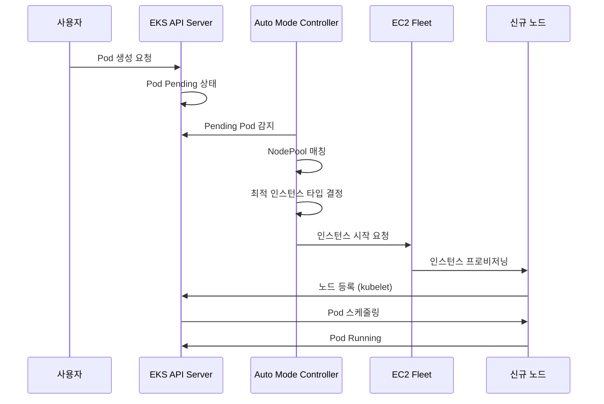

# EKS Auto Mode 운영 가이드

> **지원 버전**: EKS 1.29+, EKS Auto Mode GA
> **마지막 업데이트**: 2026년 7월 27일

Amazon EKS Auto Mode는 Kubernetes 노드 관리를 완전히 자동화하는 기능으로, 워크로드 요구 사항에 따라 자동으로 노드를 프로비저닝하고 최적화합니다. 이 가이드에서는 EKS Auto Mode의 개념, 설정 방법, 그리고 프로덕션 환경에서의 모범 사례를 상세히 다룹니다.

### 2026년 7월 업데이트: EFA 및 배치 그룹(Placement Group) 지원

2026년 7월 22일, EKS Auto Mode(및 오픈소스 Karpenter)의 노드 풀에서 Elastic Fabric Adapter(EFA) 네트워크 디바이스 구성과 EC2 배치 그룹을 지원한다고 발표되었습니다. EFA 지원 인스턴스의 네트워크 인터페이스를 EFA 전용 또는 표준 ENI로 구성할 수 있으며 — EFA 전용 인터페이스는 VPC IP 주소를 소비하지 않으면서도 인터커넥트 대역폭을 최대로 활용할 수 있습니다 — cluster, spread, partition 배치 전략을 노드 풀 구성에서 직접 지정해 인스턴스를 시작할 수 있습니다. 최대 처리량이나 장애 격리가 필요한 분산 학습/추론 워크로드를 겨냥한 기능입니다. 자세한 내용은 [발표](https://aws.amazon.com/about-aws/whats-new/2026/07/amazon-eks-efa-placement-groups/)를 참고하세요.

### 2026년 7월 업데이트: ARC Zonal Shift 지원

2026년 7월 10일부터 EKS Auto Mode 클러스터에서도 Amazon Application Recovery Controller(ARC) zonal shift와 autoshift를 사용할 수 있습니다. Auto Mode가 컴퓨팅을 대신 관리하므로 별도 플래그 설정이나 Karpenter 버전 관리 없이 클러스터에서 ARC zonal shift만 활성화하면 됩니다. zonal shift가 발동되면 Auto Mode는 장애 AZ에서 신규 용량 프로비저닝을 중단하고, 해당 존 노드에 대한 consolidation·drift 같은 자발적 중단(voluntary disruption)도 함께 중단합니다. 추가 비용은 없으며, 자세한 내용은 [발표](https://aws.amazon.com/about-aws/whats-new/2026/07/eks-auto-mode-arc-zonal-shift)와 [ARC zonal shift 문서](https://docs.aws.amazon.com/eks/latest/userguide/zone-shift.html)를 참고하세요.

## 목차

1. [Auto Mode 시작하기](./01-getting-started.md) - 클러스터 활성화 및 기본 설정
2. [NodePool 구성 및 최적화](./02-nodepool-configuration.md) - 기본 및 커스텀 NodePool 설정
3. [스케일링 동작 이해](./03-scaling-behavior.md) - 프로비저닝, Consolidation, Drift
4. [Spot 인스턴스 활용 전략](./04-spot-strategies.md) - 비용 최적화를 위한 Spot 활용
5. [운영 및 관리](./05-operations.md) - 모니터링, 문제 해결, Day-2 운영
6. [비용 관리 및 최적화](./06-cost-management.md) - 비용 분석 및 절감 전략
7. [노드 생명주기 관리](./07-node-lifecycle.md) - AMI 관리, 노드 갱신, 만료 정책
8. [워크로드별 최적화](./08-workload-optimization.md) - 웹, 배치, GPU, AI/ML 워크로드
9. [관리형 노드 그룹에서 마이그레이션](./09-migration-guide.md) - 마이그레이션 단계 및 주의사항

---

## EKS Auto Mode란 무엇인가?

EKS Auto Mode는 AWS가 관리하는 완전 자동화된 노드 관리 솔루션입니다. 내부적으로 Karpenter를 기반으로 하며, 사용자가 별도의 노드 관리 컴포넌트를 설치하거나 구성할 필요 없이 AWS가 모든 것을 관리합니다.

```
┌─────────────────────────────────────────────────────────────────────────────┐
│                           EKS Auto Mode 아키텍처                              │
├─────────────────────────────────────────────────────────────────────────────┤
│                                                                              │
│  ┌─────────────────────────────────────────────────────────────────────┐    │
│  │                    EKS Control Plane (AWS 관리)                      │    │
│  │  ┌────────────┐  ┌────────────┐  ┌────────────┐  ┌────────────┐    │    │
│  │  │ API Server │  │   etcd     │  │ Controller │  │  Karpenter │    │    │
│  │  │            │  │            │  │  Manager   │  │ Controller │    │    │
│  │  └────────────┘  └────────────┘  └────────────┘  └────────────┘    │    │
│  └─────────────────────────────────────────────────────────────────────┘    │
│                                    │                                         │
│                                    ▼                                         │
│  ┌─────────────────────────────────────────────────────────────────────┐    │
│  │                        NodePool 리소스                                │    │
│  │  ┌──────────────────┐  ┌──────────────────┐  ┌──────────────────┐  │    │
│  │  │  general-purpose │  │      system      │  │   custom-pool    │  │    │
│  │  │    (기본 제공)    │  │    (기본 제공)    │  │   (사용자 정의)   │  │    │
│  │  └──────────────────┘  └──────────────────┘  └──────────────────┘  │    │
│  └─────────────────────────────────────────────────────────────────────┘    │
│                                    │                                         │
│                                    ▼                                         │
│  ┌─────────────────────────────────────────────────────────────────────┐    │
│  │                        EC2 인스턴스 (자동 관리)                        │    │
│  │  ┌──────────────┐  ┌──────────────┐  ┌──────────────┐              │    │
│  │  │   m6i.2xl    │  │   c7g.xl     │  │   r6i.4xl    │   ...        │    │
│  │  │  (On-Demand) │  │   (Spot)     │  │  (On-Demand) │              │    │
│  │  └──────────────┘  └──────────────┘  └──────────────┘              │    │
│  └─────────────────────────────────────────────────────────────────────┘    │
│                                                                              │
└─────────────────────────────────────────────────────────────────────────────┘
```

## 기존 관리 방식과의 비교

| 특성 | 관리형 노드 그룹 | Fargate | Auto Mode |
|------|-----------------|---------|-----------|
| 노드 관리 | 사용자 (ASG 기반) | AWS 완전 관리 | AWS 완전 관리 |
| 스케일링 방식 | Cluster Autoscaler | Pod 단위 | Karpenter 기반 |
| 스케일링 속도 | 수 분 | 즉시 (Pod 스케줄) | 수십 초 |
| 인스턴스 타입 선택 | 사전 정의 | 자동 | 자동 최적화 |
| Spot 지원 | 수동 구성 | 미지원 | 자동 관리 |
| GPU 워크로드 | 지원 | 제한적 | 완전 지원 |
| DaemonSet 지원 | 지원 | 미지원 | 지원 |
| 비용 최적화 | 수동 | 중간 | 자동 |
| 복잡성 | 높음 | 낮음 | 낮음 |
| 커스터마이징 | 높음 | 낮음 | 중간 |

## 내부 아키텍처와 동작 원리

EKS Auto Mode는 Karpenter를 기반으로 동작하지만, AWS가 관리하는 컨트롤 플레인 내에서 실행됩니다.



## 지원 리전 및 제한 사항

### 지원 리전 (2026년 2월 기준)

EKS Auto Mode는 다음 리전에서 사용 가능합니다:

- **미주**: us-east-1, us-east-2, us-west-1, us-west-2
- **유럽**: eu-west-1, eu-west-2, eu-central-1, eu-north-1
- **아시아 태평양**: ap-northeast-1, ap-northeast-2, ap-southeast-1, ap-southeast-2, ap-south-1

### 제한 사항

| 항목 | 제한 |
|------|------|
| 클러스터당 최대 NodePool | 100개 |
| NodePool당 최대 노드 | 1000개 |
| 클러스터당 최대 노드 | 5000개 |
| 최소 EKS 버전 | 1.29 |
| 지원 AMI 패밀리 | AL2023, Bottlerocket |
| Windows 노드 | 미지원 |

---

## 다음 단계

EKS Auto Mode를 성공적으로 구성한 후 다음 주제를 학습하는 것이 좋습니다:

1. **[EKS 비용 최적화](../eks/07-eks-cost-optimization.md)**: Spot, Savings Plans, 리소스 최적화
2. **[EKS 모니터링 및 로깅](../eks/06-eks-monitoring-logging.md)**: CloudWatch, Prometheus, Grafana
3. **[EKS 보안](../eks/05-eks-security.md)**: IAM, 네트워크 정책, Pod 보안
4. **[Karpenter 심화](../autoscaling/02-karpenter.md)**: 직접 Karpenter 설치 및 고급 기능

## 관련 퀴즈

학습 내용을 테스트하려면 [EKS Auto Mode 퀴즈](../quizzes/eks-auto-mode/01-getting-started-quiz.md)를 풀어보세요.

---

## 참고 자료

- [AWS EKS Auto Mode 공식 문서](https://docs.aws.amazon.com/eks/latest/userguide/automode.html)
- [Karpenter 공식 문서](https://karpenter.sh/)
- [EKS Best Practices Guide](https://aws.github.io/aws-eks-best-practices/)
- [AWS 비용 최적화 가이드](https://aws.amazon.com/ko/pricing/cost-optimization/)
- [New EKS Auto Mode features for enhanced security, network control, and performance (AWS Containers Blog, 2025-10-16)](https://aws.amazon.com/blogs/containers/new-amazon-eks-auto-mode-features-for-enhanced-security-network-control-and-performance/)
- [Migrate from self-managed Karpenter to EKS Auto Mode](https://docs.aws.amazon.com/eks/latest/userguide/auto-migrate-karpenter.html)
